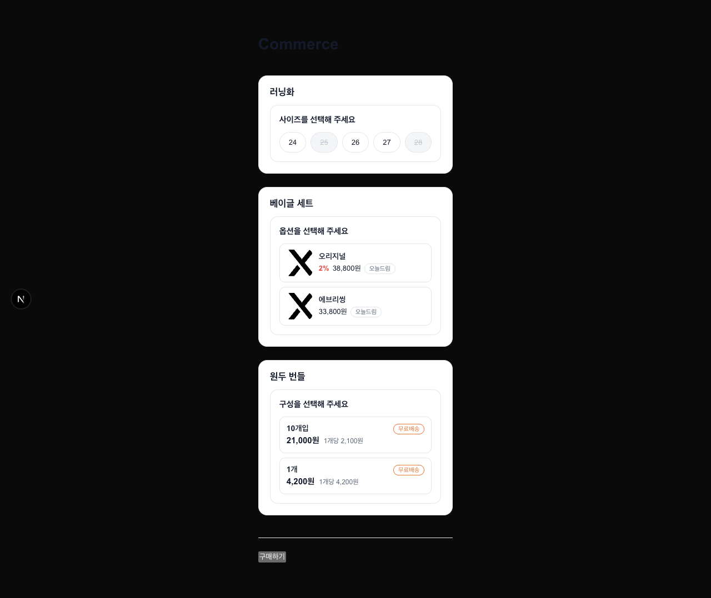
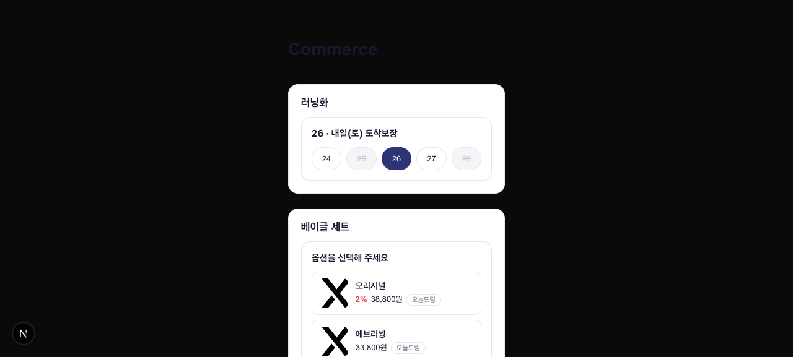
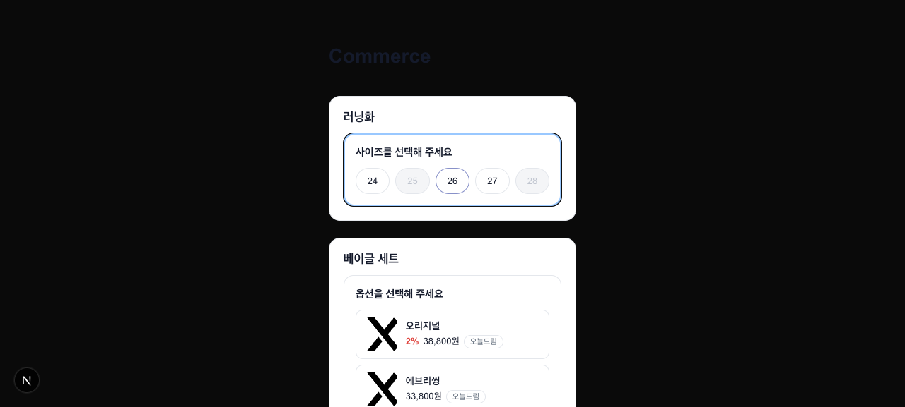
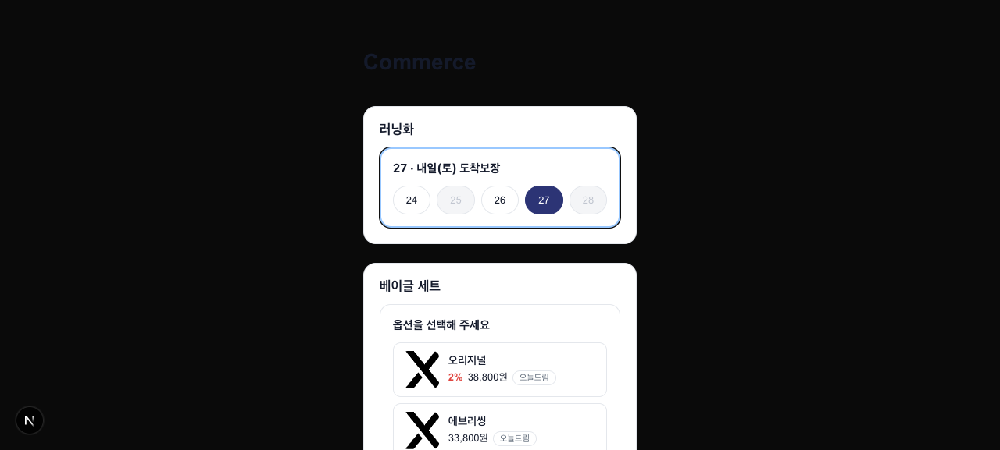
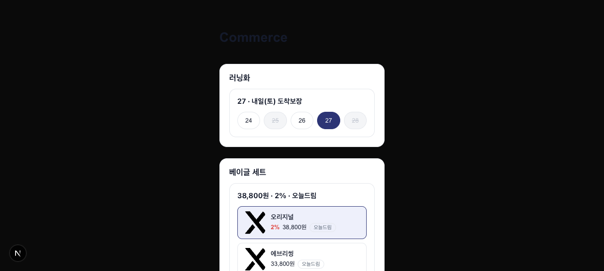
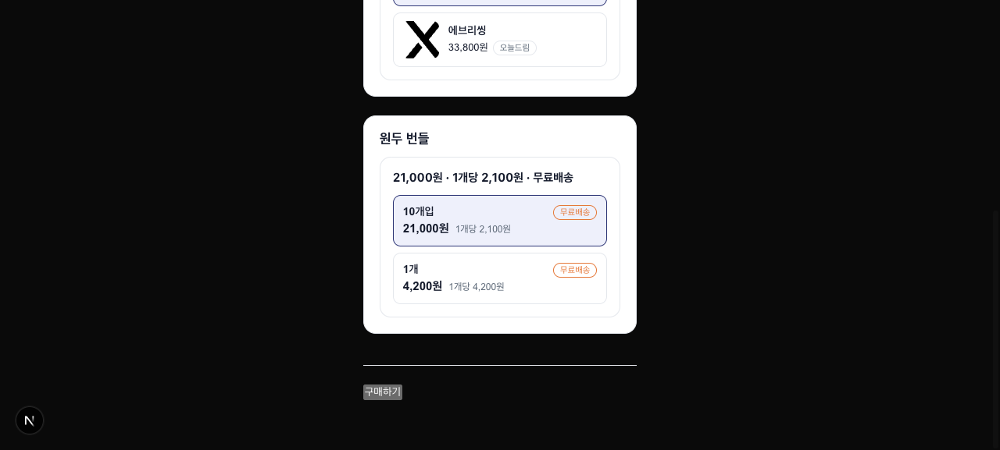
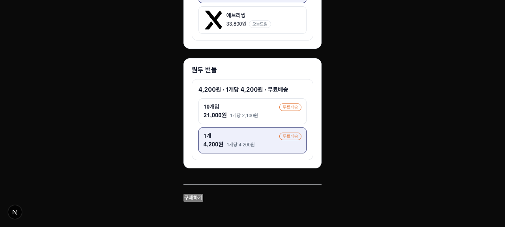
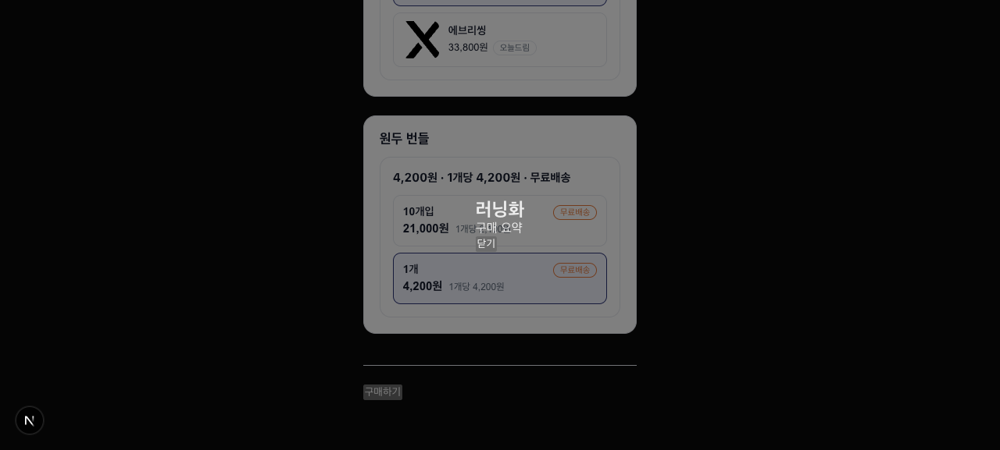
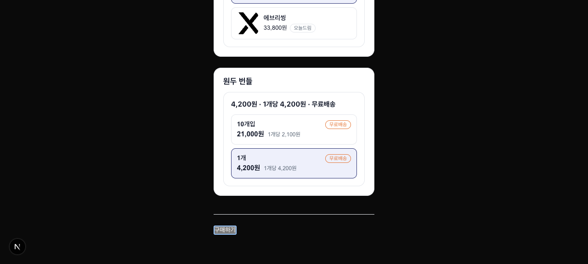

# week-04 QA 리포트 — Select(Headless) · Dialog(Compound)

실제 브라우저(agent-browser)로 커머스 PDP 데모를 몰아 검증한 **유저 관점 E2E** 결과다.
아래 스크린샷은 모두 이 폴더(`docs/qa/week-04/`)에 함께 커밋되어 GitHub에서 바로 렌더된다.

- **판정**: 기능 완성 · 전 시나리오 PASS (남은 항목은 LOW 미관 2건, 제출 비차단)
- **BASELINE 게이트**: `build` · `test`(64/64) · `lint` · `typecheck` · `depcruise`(38모듈/위반0) · `format:check` — **6/6 그린**
- **시나리오**: Select 6 + Dialog 5 + 적대적 depth 2 = **13 PASS**, 수정 사이클 0(첫 패스 그린)
- (선택) 인터랙티브 갤러리 아티팩트: <https://claude.ai/code/artifact/9a5f1dcd-d988-4271-a1dc-56729e3bdd6f> — 비공개 링크라 공유 메뉴로 열어야 타인이 봄. repo 커밋 스크린샷이 1차 근거.

---

## 과제 체크리스트 → 검증 매핑

### Select (Headless)

- [x] **라이브러리 없이 직접 구현** (네이티브 `<select>` 감싸기 ✗) — `<div role=group>`/`<ul>`/`<button>` listbox. → `01`
- [x] **로직 노출 인터페이스 스스로 설계** — `useSelect` 훅이 `isOpen`·`selected`·`highlightedIndex`·`toggle`·`select`·`onKeyDown`·`getOptionState` 노출.
- [x] **같은 로직으로 서로 다른 옵션 UI 3종** — size(칩) · thumbnail(썸네일 행) · bundle(묶음 행)이 한 `useSelect`를 소비. → `01` `06` `07` `08`
- [x] **`value`가 옵션 객체 전체** (가격·배송 계산에 쓰임) — readout이 선택 객체에서 값·배송·개당단가를 파생. → `02` `07` `08`
- [x] **키보드 열기·이동(↑↓)·선택(Enter)·닫기(Esc)** — 그룹 포커스 후 ArrowDown/Enter 동작. → `03` `04`
- [x] **품절 옵션 키보드 이동에서 건너뜀** + 선택 불가 — 25(품절) 스킵, 강제 클릭도 무효. → `03` `05`

### Dialog (Compound)

- [x] **compound 조립** — `Dialog / Trigger / Overlay / Content / Title / Description / Close`. → `09`
- [x] **controlled / uncontrolled 이중 API** — uncontrolled 경로 E2E(`09` `11`), controlled 경로는 유닛 64개 중 dialog 스위트가 커버.
- [x] **`Content`/`Overlay`를 Portal(`document.body`)로 렌더** — 열린 Title의 부모가 `<body>`임을 DOM으로 확인. → `09`
- [x] **Esc / 오버레이 클릭으로 닫힘 + 배경 스크롤 잠금** — `body.overflow` "" ↔ "hidden" 전이, 4회 반복 토글에도 누수 없이 복원. → `09` `10` `12`

### 데이터 · 프레임워크

- [x] **`app/page.tsx`가 Server Component로 `GET /api/products` fetch** → 클라이언트 skin에 props 전달 — SSR HTML에 3개 상품명 포함(`force-dynamic`). → `01`
- [x] **mock이 `optionKind` 판별 유니온으로 3종 옵션 서빙** (route.ts + MSW) — 유닛/parity 테스트 그린.

### 검증 바

- [x] **유닛(Vitest+RTL+MSW)** — 12파일 / **64 통과**.
- [x] **agent-browser E2E** — 이 리포트(13 시나리오).
- [x] **전 게이트 그린** — `lint` · `typecheck` · `test` · `depcruise` · `format:check` · `build`.

> 참고: 0단계(Next 세팅 + 하네스 이식 — ESLint flat config 교체 · `@next` 룰 · husky)는 이번 QA의 동적 검증 대상이 아니라 **BASELINE 게이트로 간접 확인**된다(`pnpm lint` 그린 = 커스텀 flat config + `eslint-config-next` 적용, `husky` prepare 존재). "왜 이 룰인가" 근거 서술은 작성자 몫.

---

## 시나리오별 스크린샷

### Select (Headless)

**S1 · [일반] PDP 초기 렌더** — async Server Component fetch → 3종 skin 실데이터. 품절 25·28은 회색+취소선.



**S2 · [일반] 사이즈 마우스 선택** — 26 클릭 → readout `26 · 내일(토) 도착보장`(값+배송 함께 파생).



**S3 · [일반] 키보드 이동·품절 스킵·clamp** — ArrowDown 2회에 하이라이트가 **25(품절)를 건너뛰고 26**에 안착(왼쪽), Enter로 27 선택(오른쪽, 28은 품절+마지막이라 clamp).

| 하이라이트(25 스킵)                                         | Enter 선택                                          |
| ----------------------------------------------------------- | --------------------------------------------------- |
|  |  |

**S4 · [무모/악의] 품절 선택 불가** — 품절 25를 **강제 프로그래매틱 클릭**해도 선택 안 됨(disabled + 훅 내부 이중 가드). 상태 27 유지.


**S5 · [일반] 썸네일 skin** — 같은 훅, 다른 UI. 오리지널 → `38,800원 · 2% · 오늘드림`(할인 0%면 % 숨김).



**S6 · [일반] 묶음 skin — 옵션별 가격 파생(핵심 증명)** — b1 `21,000원·1개당 2,100원` → b2 `4,200원·1개당 4,200원`. 옵션마다 값·개당단가가 달라짐 = `value`가 객체 전체.

| b1(10개입)                              | b2(1개)                                 |
| --------------------------------------- | --------------------------------------- |
|  |  |

### Dialog (Compound)

**D1·D2 · [일반] 열림 + Portal + 스크롤 잠금** — 구매하기 → Overlay·Content가 `document.body` Portal, 배경 딤 + `body.overflow=hidden`.


**D3 · [일반/무모] 오버레이 클릭 닫힘** — 내부 클릭은 유지(stopPropagation), 오버레이 클릭 → 닫힘 + 스크롤 복원.



**D4·D5 · [일반/악의] 재열기 → Esc 닫힘 → 스크롤 복원** — 트리거 재열기(uncontrolled), Esc 닫힘, 4회 빠른 토글에도 잠금 누수 없음.

| 재열기                              | Esc 닫힘·복원                              |
| ----------------------------------- | ------------------------------------------ |
|  |  |

---

## 남은 LOW 미관 노트 (기능 아님 · 제출 비차단)

1. **다크모드 시스템에서 페이지 크롬 저대비** — `app/globals.css`가 create-next-app 다크 테마(`--background:#0a0a0a`)를 깔았는데 제목은 `#141a2b` 하드코딩(`app/page.tsx`) → 다크모드 OS에서 "Commerce" 제목·구매하기 트리거가 배경에 묻힘. 상품 카드는 흰 배경 하드코딩이라 무관. 테마는 과제 범위 밖.
2. **Dialog 모달 콘텐츠에 배경 surface 없음** — `Dialog.Content`·`PurchaseDialog`가 배경/패딩을 안 줘 모달 텍스트가 딤된 페이지 위에 겹침(`09`). 과제가 Dialog 스타일링을 명시적 Non-Goal로 둠 → 설계상 정상이나, `PurchaseDialog`에서 흰 배경 래퍼만 추가하면 해결(프리미티브 불변).

---

## 재현 방법

```bash
pnpm dev            # http://localhost:3000
# PDP에서 3종 옵션 선택(마우스/키보드) → readout 확인 → 구매하기로 Dialog 개폐
```

게이트 로그 원본: `$OMT_DIR/evidence/week04-select-dialog/qa-handson/baseline-*.txt`
