## 🧭 0단계 — 측정 조건을 고정하고 Before를 남기기

| 구분 | commit SHA |
| --- | --- |
| Before | `a0dfbfe17d5cbfafc2660ca29bab30de63cf21f1` |
| After | `10370f634e3e92400b35d72979228b3d3cfb4c90` |

**Lighthouse 측정 조건**
- viewport: 모바일 412×823 (Lighthouse 모바일 기본 프리셋)
- CPU: 4x slowdown
- network: Fast 4G, Disable cache 체크
- 실행 환경: `pnpm build && pnpm start`
- 도구: Lighthouse 5회 지표 FCP·LCP·CLS raw 5회 + 중앙값 + 최소 + 최대
- 크롬 게스트 프로필로 측정하여 extension들 영향 안 받게

### Lighthouse FCP, LCP, CLS 5회 측정 값

| 지표 | raw값 | 중앙값 | 최소 | 최대 |
| --- | --- | --- | --- | --- | 
| FCP | 0.5s, 0.5s, 0.5s, 0.5s, 0.5s | 0.5s | 0.5s | 0.5s |
| LCP | 8.5s, 8.5s, 8.5s, 8.5s, 8.5s | 8.5s | 8.5s | 8.5s |
| CLS | 0, 0, 0, 0, 0 | 0 | 0 | 0 |

### LCP element, Performance filmstrip의 Header·페이지 제목·Hero 표시 순서, Network waterfall의 document·홈 데이터·Hero 이미지 요청 시작 순서와 전송 크기

**LCP element**

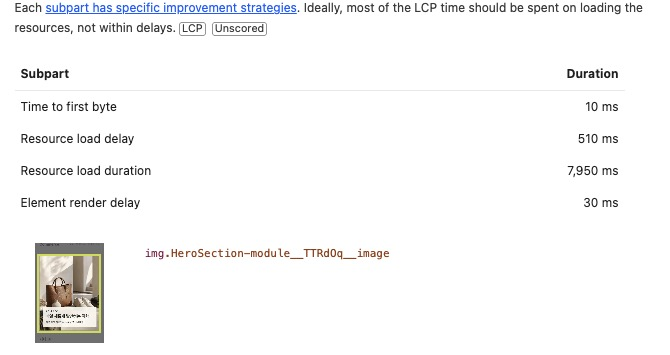

**Performance filmstrip**

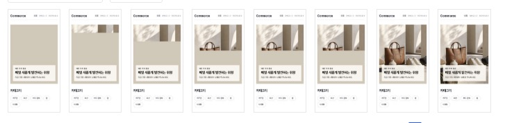

**Network waterfall의 document·홈 데이터·Hero 이미지 요청 시작 순서와 전송 크기**

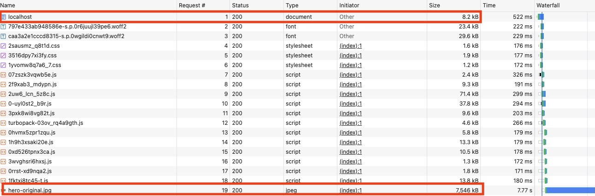
- 홈 데이터의 경우 React Query prefetch(dehydrate)로 서버에서 조회되어 브라우저 Network Waterfall에는 별도 요청이 나타나지 않음


### 관찰한 사실, 원인 가설, 가설을 반증할 방법, 먼저 시도할 가장 작은 변경
| 관찰한 사실 | 원인 가설 | 가설을 반증할 방법 | 먼저 시도할 가장 작은 변경 |
| --- | --- | --- | --- |
| LCP로 인하여 Performance 점수가 크게 떨어짐 | hero image의 큰 용량으로 인하여 인터넷 속도가 느리다면 사용자가 이미지를 보는데 큰 시간이 소요됨  | 용량이 작은 이미지로 변경해 보고 재측정 | next/image를 사용하여 이미지 사이즈를 줄여보기 |

### /api/products?scenario=slow에서 이전 요청이 늦게 끝나도 현재 화면을 덮지 않는지 확인 녹화
- docs/read0more-week7/recordings/step0_race_condition_check.webm

## 🖼️ 1단계 — Hero의 실제 LCP 병목을 줄이기

### LCP를 서버 응답 대기, 이미지 요청 시작 대기, 이미지 전송, 화면에 그려질 때까지의 시간으로 나눠 관찰

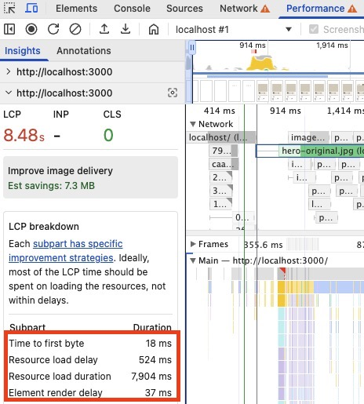
- Time to first byte = 서버 응답 대기
- Resource load delay = 이미지 요청 시작 대기
- Resource load duration = 이미지 전송
- Element Render delay = 화면에 그려질 때까지의 시간

### 실제 표시 크기와 viewport에 맞는 이미지 후보·포맷·압축률을 선택하고, 불필요하게 큰 이미지가 내려가지 않게

**표시 크기 (HeroSection.module.css 확인)**
- hero는 컨테이너 100% 폭으로 렌더되며 데스크탑은 컨테이너 max-width 1280px, 모바일은 100vw.
- 비율은 `aspect-ratio: 16/9`(모바일 `4/5`), `object-fit: cover`

**필요 해상도 판단**
- 데스크탑: CSS 표시 폭은 최대 1280px. 단 레티나 등 DPR이 높은 화면도 고려. DPR 2면 이론상 1280×2 = 2560px가 필요하다. 다만 2560px를 그대로 내리면 전송이 과하므로, 중간치인 1920으로 시도.
- 모바일: 모바일 기기는 일반적으로 DPR이 2~3이라 실제 필요 픽셀이 큼(예: 390px × DPR 3 ≈ 1170px, 큰 폰도 ~1290px). 즉 모바일 최대 필요치도 데스크탑 CSS 폭(1280)과 비슷한 수준이라 1280 이하 후보로 커버
- 결론: 모바일(≤~1290) ~ 고DPR 데스크탑(~1920)까지의 필요 픽셀을 하나의 srcset 후보 세트(640·828·1080·1280·1920)로 함께 커버하고, 브라우저가 각 기기의 폭×DPR에 맞는 최소 후보를 고르게

**결정 사항**

| 항목 | 결정 | 근거 |
| --- | --- | --- |
| 해상도 후보 | 640 / 828 / 1080 / 1280 / 1920 px | 표시 폭 × DPR. 고DPR 데스크탑은 이론상 2560px지만 전송 절충으로 상한 1920px. |
| `sizes` | `(min-width: 1280px) 1280px, 100vw` | 컨테이너 1280 캡, 그 아래는 뷰포트 100% |
| 포맷 | AVIF 우선, WebP fallback (미지원 시 JPEG) | 동일 화질에 JPEG 대비 50%+ 작음 |
| 압축률(quality) | 75(default) | default값인 만큼 hero 사진 기준 화질 손실 미미할 것으로 예상. 실무였다면 디자이너와 같이 육안으로 확인해 봤을 듯합니다. |
| 큰 이미지 방지 | 위 후보 + `sizes`로 뷰포트·DPR에 맞는 최소 이미지만 다운로드 | — |

### Hero 이미지가 언제 발견되어 요청되는지, 이 페이지에서 요청 우선순위를 높일 이유가 있는지
- 발견 시점: hero는 홈 데이터(~500ms) 대기 뒤 `Suspense` 경계 안에서 렌더되므로, 진입 즉시가 아니라 **경계가 스트리밍되는 ~500ms 뒤에 발견·요청**된다. (홈 HTML상 hero preload `<link as=image>`가 초기 `<head>`가 아니라 Suspense fallback보다 뒤에 방출됨 → LCP breakdown의 ② load delay ≈ 524ms와 일치.) 정적 hero를 셸(경계 밖)으로 빼면 초기 `<head>`에서 즉시 발견되게 만들 수 있다.
- hero는 화면 최상단 **LCP 요소**라 늦게 받으면 LCP가 곧바로 늦어지므로, 다른 리소스에 밀리지 않게 우선순위를 높일 이유가 있다. 따라서 `next/image`의 `priority`를 적용. `priority`는 `fetchpriority="high"`(다른 리소스보다 먼저 요청) + `preload`(img 태그 파싱 전에 미리 발견) + `eager`(lazy 로딩 해제)를 한 번에 적용한다.

### Hero의 시각적 크기, 비율, 주요 피사체와 문구를 유지, 이미지를 작게 보이게 하거나 품질을 낮춰 수치만 줄이지 않게
- 크기, 비율, 주요 피사체와 문구를 유지하였으며, 품질의 경우 next/image의 사용 시 default값(75)으로 사용

### 홈 데이터를 기다리는 동안 Header, 하나의 h1, 페이지 설명까지 함께 막히지 않도록 현재 데이터 소유권에 맞는 렌더링 경계를 선택
- 기존 구조 그대로 만족하여 따로 수정하지 않음. Header는 `Suspense` 밖(셸)이라 안 막히고, 느린 홈 데이터는 이를 소유한 `HomeSection`만 `<Suspense>`로 격리

### Hero fallback은 실제 Hero와 같은 공간을 차지하게 하고, 교체 때 아래 콘텐츠가 밀리지 않는지 Layout shifts track으로 확인
- fallback 추가 후에도 Lighthouse로 CLS 0임을 확인
- fallback 추가 방식에 대한 추가설명: `<Suspense fallback={<><HeroSkeleton /><p className={layout.status}>홈 데이터를 불러오는 중…</p></>}>` 와 같이 hero와 그 외의 부분을 묶은 fallback을 사용. 그 이유로는 현재 `/api/home`이 배너·리스트를 한 응답으로 내려주므로 두 경계로 나눠도 같은 응답에 함께 풀려 이득이 없다고 판단하여 단일 Suspense fallback을(HeroSkeleton + 텍스트) 선택. 실무라면 별도 API 분리를 요청하여 요청이 수용될 경우는 Suspense 경계를 따로 지정했을 것으로 예상

### LCP의 병목 구간과 선택한 변경의 인과관계
- 병목 구간과 근거 수치: [LCP 4구간 관찰](#lcp를-서버-응답-대기-이미지-요청-시작-대기-이미지-전송-화면에-그려질-때까지의-시간으로-나눠-관찰) 참조 — 이미지 전송(Resource load duration) 7,904ms가 LCP의 93%를 차지하므로 이 전송 구간이 LCP의 병목.
- 선택한 변경: [이미지 후보·포맷·압축률](#실제-표시-크기와-viewport에-맞는-이미지-후보포맷압축률을-선택하고-불필요하게-큰-이미지가-내려가지-않게) · [발견/요청·우선순위](#hero-이미지가-언제-발견되어-요청되는지-이-페이지에서-요청-우선순위를-높일-이유가-있는지) 참조 — next/image로 표시 폭·DPR에 맞는 srcset(640~1920) + AVIF/WebP + quality 75, LCP 요소라 `priority` 적용.
- 인과관계: 병목 구간이 이미지 전송이므로 전송 바이트 자체(7.5MB→수십KB)를 줄인 것이 LCP 하락을 위한 작업.

### Lighthouse FCP, LCP, CLS 5회 측정 값 after

| 지표 | raw값 | 중앙값 | 최소 | 최대 |
| --- | --- | --- | --- | --- | 
| FCP | 0.5s, 0.5s, 0.5s, 0.5s, 0.5s | 0.5s | 0.5s | 0.5s |
| LCP | 1s, 1s, 1s, 1s, 1s | 1s | 1s | 1s |
| CLS | 0, 0, 0, 0, 0 | 0 | 0 | 0 |

**before와 비교하여 LCP 8초 감소(8.5s→1s), hero에 대한 fallback 추가 후에도 CLS 0임을 확인**

### LCP를 서버 응답 대기, 이미지 요청 시작 대기, 이미지 전송, 화면에 그려질 때까지의 시간으로 나눠 관찰 after

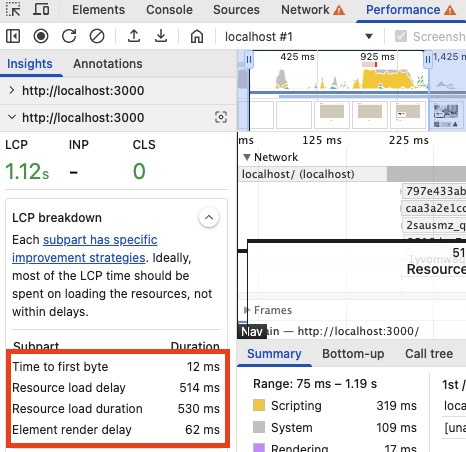

**before와 비교하여 Resource load duration 7904ms -> 530ms로 감소, 다만 Element Render delay가 37ms -> 62ms로 미세하게 상승**

## ⏳ 2단계 — 최초 pending, 목록 갱신, CLS를 나눠 다루기

### 2-1 slow API의 1.5초 지연은 그대로 두고, 데이터가 없는 최초 진입에는 실제 목록 크기를 예상할 수 있는 pending UI를 보여주기
- before: **수정 필요.** 최초 pending 은 텍스트 안내(`상품 목록을 불러오는 중…`)뿐이라 실제 목록 크기를 예상하지 못함.
- after: **스켈레톤 도입.** `ProductListSkeleton`을 `products/page.tsx` Suspense fallback + `ProductList` isPending 에 적용. 
- 영상: `docs/read0more-week7/recordings/step2-1-무데이터-최초진입-스켈레톤.webm`.

### 2-2 기존 목록이 있을 때 검색·카테고리·정렬·페이지 조건을 바꾸면 목록을 즉시 비우지 않고 갱신 중임을 보여주기
- before: **이미 적용됨.** `placeholderData: keepPreviousData` + 전환 중 `isPlaceholderData` 로 이전 목록을 흐리게 유지.
- after: 코드 변경 없음(이미 적용). 이전 목록 유지+흐림 재확인.
- 영상: `docs/read0more-week7/recordings/step2-2-기존목록-갱신중-흐림.webm`

### 2-3 표에 적은 사용자 관찰 기준을 먼저 만족시키고, isPending과 isFetching이 각각 어떤 화면을 맡는지 설명하고, 최초 실패·기존 목록 갱신 실패·빈 결과·취소된 요청을 구분하기
- before:
  - `isPending`(캐시된 데이터가 없고 첫 fetch 중일 때 true): **상품 목록을 불러오는 중…** 화면을 출력할 때 사용.
  - `isFetching`(첫 로드든 background 재요청이든 fetch 가 진행 중이면 true) 은 **사용하지 않음.**
  - 최초 실패 = **이미 적용**.
    - 5xx(일시적 서버 실패) → `error.tsx` 세그먼트 경계로 올려 "다시 시도" 버튼 제공(헤더·필터 유지). 재시도하면 성공할 수 있으니 버튼이 의미 있음.
    - 4xx(잘못된 조회 조건) → 목록 자리에 인라인 안내만. **요청 조건 자체가 틀린 것(앱↔서버 계약 불일치)이라 같은 요청을 재시도해도 똑같이 4xx → 재시도가 무의미**하다고 생각했기 때문. 고치려면 재시도가 아니라 조회 조건(URL/필터)을 바꿔야 하므로, 재시도 버튼을 주는 `error.tsx` 경계로 올리지 않고 `isError`를 이용하여 인라인 안내로 끝냄.
  - 기존 목록 갱신 실패 = **수정 필요.** (기존 목록 stale 유지되나 인라인 실패 표시·재시도 없음).
  - 빈 결과 = **이미 적용.**
  - 취소 = **이미 적용.** (취소된 이전 요청이 화면 안 덮음)
- after:
  - 최초 실패: 목록이 한 번도 안 뜬 채 첫 로드 실패 → `error.tsx` "다시 시도"(헤더·필터 유지) 확인.
  - 기존 목록 갱신 실패: **기존 목록을 유지한 채 인라인 배너("목록을 갱신하지 못했습니다." + 다시 시도→`refetch`)** 표시.
  - 빈 결과: "검색 결과가 없습니다." 확인.
  - 취소: 검색어 race(스탠리→가디건)로 늦은 응답이 현재 화면 안 덮음 확인.
- 영상:
  - 최초 실패: `docs/read0more-week7/recordings/step2-3-최초실패.webm`
  - 기존 목록 갱신 실패: `docs/read0more-week7/recordings/step2-3-갱신실패.webm`
  - 빈 결과: `docs/read0more-week7/recordings/step2-3-성공-0건.webm`
  - 취소: `docs/read0more-week7/recordings/step2-4-검색어-race-취소.webm`

### 2-4 서버 응답을 바꾸는 URL 조건을 query key와 실제 GET 요청에 함께 넣고, 현재 URL의 active query와 화면 결과가 일치하며, 이전 요청이 늦게 끝나도 현재 화면을 덮지 않기
- before: **이미 적용됨.** `normalizeProductListQuery` 결과를 queryKey·GET 양쪽에 동일하게 사용. 늦게 온 이전 요청은 현재 activeQuery 키에만 반영되어 화면을 덮지 않음.
- after: 2단계 상태에서도 검색어 race 로 재확인. A(스탠리)·B(가디건) 요청 겹침, 최종 URL=`?q=가디건`·화면=가디건 결과, 늦은 A 응답이 화면 안 덮음.
- 영상: `docs/read0more-week7/recordings/step2-4-검색어-race-취소.webm`

### 2-5 서버 응답을 Zustand나 별도 로컬 상태에 복사하지 않기
- before: **이미 적용됨.** 목록은 `useQuery` 결과를 그대로 사용, 별도 상태 복제 없음.
- after: 코드 변경 없음.

### 2-6 fallback과 실제 콘텐츠가 바뀔 때 CLS가 생기지 않는지 녹화와 Layout shifts track으로 확인하기
- before: **수정 필요.** 실제 목록 크기를 예상할 수 있는 pending UI 미구현. 실제 상품 목록으로 교체 시 CLS 확인 대상.
- after: 스켈레톤이 카드 grid + "총 N개" 줄 공간까지 처리. CLS 0 확인(크롬 DevTools의 performance 탭에서 확인).
- 영상: `docs/read0more-week7/recordings/step2-1-무데이터-최초진입-스켈레톤.webm`, `docs/read0more-week7/recordings/step2-2-기존목록-갱신중-흐림.webm`

## 🧾 3단계 — 동적 metadata와 Open Graph의 비용을 판단하기

### 3-1 normal·정상 empty·metadata query failure의 document 증거
세 케이스 모두 실제 Chrome **View Source**(JS 실행 전 SSR document)로 확보 — `<head>` metadata를 하이라이트한 스크린샷.
- **normal** `/products`: `<title>상품 목록 | Commerce</title>` · desc `전체 · 최신순 · 총 30개` · og:image=첫 상품(동적). 홈 `/`: title=배너 제목 · og:image=배너.
- **정상 empty** `/products?q=<무매칭 검색어>`: `<title>"…" 검색 결과 (0개) | Commerce</title>` · desc `총 0개` · og:image=`product-fallback.jpg`(OG fallback).
- **metadata query failure** (`APP_ORIGIN=http://127.0.0.1:9`): 루트 공통 metadata 상속(`<title>Commerce</title>`). ↔ 3-4 대비.

**홈 normal** - 설정한 APP_ORIGIN으로 실행한 production document 응답과 초기 HTML을 남기기
- docs/read0more-week7/recordings/step3-normal.html

**정상 empty**
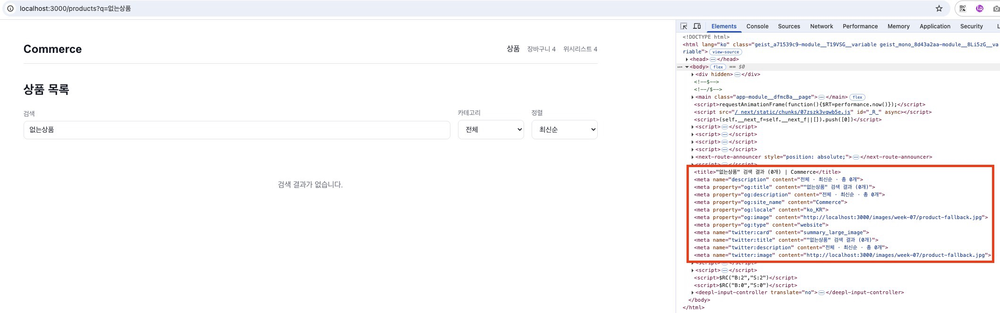
- metadata가 `<head>`가 아니라 문서 끝(body)에 붙는 건 Next의 **스트리밍 metadata**(기본): 느린 `generateMetadata`를 안 기다리고 셸을 먼저 보낸 뒤 완료되면 태그를 body에 추가한다. JS 실행 봇(Googlebot)은 최종 DOM으로 정상 인식하고, JS 미실행 봇(facebookexternalhit)엔 스트리밍을 꺼 `<head>`에 blocking으로 넣으므로 SEO·공유 카드 모두 문제없다.

**metadata query failure**
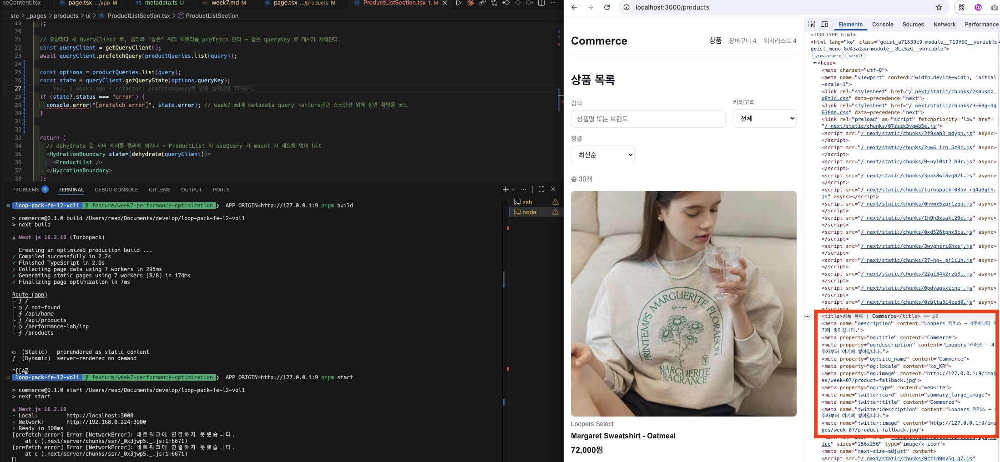

### 3-2 서버 호출 계수
`src/app/api/products/route.ts` GET에 임시 `[TEMP-COUNT]`(+user-agent) 로그, `generateMetadata`·`ProductListSection`에 각각 실행 태그 로그를 남기고 브라우저로 `/products?scenario=slow` 접속.

```
[TEMP-SECTION] prefetchQuery start
[TEMP-META] generateMetadata fetchQuery start
[TEMP-COUNT] count: 1 ?sort=latest&page=1&pageSize=12&scenario=slow ua=node
[TEMP-META] generateMetadata fetchQuery start
[TEMP-COUNT] count: 2 ?sort=latest&page=1&pageSize=12&scenario=slow ua=node
[TEMP-COUNT] count: 3 ?sort=latest&page=2&pageSize=12&scenario=slow ua=Mozilla/5.0 (Macintosh; Intel
```

- 첫 번째 호출은 서버에서의 prefetch. 섹션 prefetch(`[TEMP-SECTION]`)와 `generateMetadata` 1번째 실행(`[TEMP-META]`)만 찍힘. 같은 렌더 패스라 native fetch memoization 으로 두 소비자가 한 호출에 합쳐진다.
- 두 번째 호출도 **서버 발원**(`ua=node`) — **`generateMetadata`의 2번째 실행**. 로그에서 2번째 `[TEMP-META]` 직후에 count 2가 따라온다. 2번째 실행은 본문 렌더와 **다른 패스라 fetch memoization 밖**이기 때문에 독립적인 page=1 호출이 한 번 더 나감. 한 번 더 나가는 이유는 중복을 막아줄 두 층이 모두 빠지기 때문: ① 서버는 `getQueryClient()`가 실행마다 **새 QueryClient** 를 만들므로(요청 간 캐시 오염 방지 설계) 1번째 실행이 채운 TanStack Query 캐시가 2번째 실행에는 없고, ② 그럼 남는 건 native fetch memoization 인데, 이건 "**같은 렌더 작업 안**에서 같은 URL 을 여러 번 fetch 하면 첫 결과를 재사용해 주는" 장치다 — 1번째 `generateMetadata` 실행이 count 1 에 합쳐진 게 바로 이 덕분. 그런데 스트리밍 metadata 의 2번째 실행은 본문과 **별개의 렌더 작업**으로 돌기 때문에, Next 입장에선 "아까 그 URL 을 또 부른다"는 걸 알 방법이 없어서 또 호출하는 것.
  - 스트리밍 metadata 가 동원되는 이유: `generateMetadata` 가 **느릴 수 있어서**다 — 여기선 slow API(1.5s) 결과로 title·og 를 만들기 때문. Next 는 느린 metadata 를 기다렸다 첫 바이트를 늦추는 대신 셸을 먼저 보내고 metadata 는 준비되면 body 로 흘려보낸다. 그래서 **수정 방안 2가 근본 해법**: metadata 가 느린 데이터를 아예 안 기다리면 "느린 metadata 문제" 자체가 사라짐.
  - 교차 검증: headless Chrome 3회 반복에서도 같은 패턴, curl 같은 비브라우저 UA 는 blocking metadata 경로(3-3 참조)라 1회만 호출.
  - 수정 방안(기록만, 미적용):
    1. 목록 fetch 에 **Next Data Cache** 부여(예: `next: { revalidate: 60 }`) → 렌더 패스가 달라도 2번째 실행이 캐시 hit, 서버 호출 1회.
       - 리스크 ① 신선도 지연이 **중첩**된다: Data Cache 는 서버 전역 캐시라 SSR 시점에 이미 최대 60초 묵은 목록이 내려가고, 클라이언트 `staleTime` 60s 가 그 위에 얹혀 사용자가 보는 데이터는 최악의 경우 ~2분 전 상태가 될 수 있다(재고·품절 반영 지연).
       - 리스크 ② **전 사용자 공유 캐시**: 지금은 응답이 다 같기 때문에 안전하지만, 응답이 개인화(회원 등급별 가격 등)되는 순간 다른 사용자에게 캐시가 새어 나간다 — 도입 시 "이 API 는 영원히 비개인화"라는 전제가 코드에 암묵적으로 깔린다.
       - 리스크 ③ 캐시 키가 **URL 전체**라 검색어 `q` 같은 조합마다 생김. hit율이 낮아 이득 없이 캐시 저장소만 불어남.
    2. **metadata 의 slow 데이터 의존 축소** — title·description 을 URL 조건만으로 만들고 og:image 를 fallback 고정하면 metadata fetch 자체가 사라진다(동적 metadata 비용 판단 관점의 근본 해법).
- 세 번째 호출의 경우 5주차 과제 Advanced C의 다음 페이지 prefetch에서 붙인 부분

### 3-3 일반 UA와 facebookexternalhit의 응답 시점 비교
같은 `/products`(slow)를 UA만 바꿔 측정(`curl -w 'time_starttransfer/time_total'`).

| UA | TTFB(starttransfer) | total |
| --- | ---: | ---: |
| 일반 브라우저 UA | **~0.005s** | ~1.51s |
| `facebookexternalhit/1.1` | **~1.514s** | ~1.52s |

- 일반 UA는 Next가 셸을 **즉시 스트리밍**(TTFB 5ms), 느린 섹션은 Suspense로 뒤따름. 크롤러 UA엔 **스트리밍을 끄고** 완성 문서를 다 만든 뒤 첫 바이트 → TTFB가 곧 slow 지연 전체.
- 즉 "metadata가 slow 데이터를 기다린 비용"은 크롤러 TTFB로 드러나고, 일반 사용자는 이걸 느끼지 못함. total(완성 시점)은 양쪽 동일.
- 터미널 증거 (두 UA curl 출력):
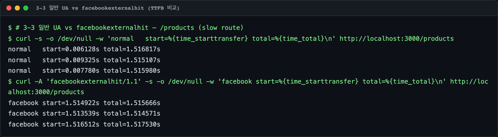

### 3-4 정상 empty와 metadata query failure가 서로 다른 fallback
failure 재현: `APP_ORIGIN=http://127.0.0.1:9 pnpm build`, `APP_ORIGIN=http://127.0.0.1:9 pnpm start` → 서버 fetch base(:9) 도달 불가 → `fetchQuery` NetworkError → `generateMetadata` catch → `{}` → **루트 공통 metadata 상속**

| 항목 | 정상 empty | metadata query failure |
| --- | --- | --- |
| title | `"{검색어}" 검색 결과 (0개) \| Commerce` | `Commerce`(루트) |
| description | `{카테고리명} · {정렬} · 총 0개` | `Loopers 커머스 - 4주차부터 여기에 쌓아갑니다.`(루트) |
| og:image | `product-fallback.jpg`(OG fallback) | `product-fallback.jpg`(루트) |
| 출처 | **페이지별** metadata(URL 조건 반영) | **루트 공통(src/app/layout.tsx, src/shared/config/metadata.ts)** |

## 🔁 4단계 — 같은 조건에서 After와 회귀를 확인하기

### 4-1 Before·After SHA

| 구분 | commit SHA |
| --- | --- |
| Before | `a0dfbfe17d5cbfafc2660ca29bab30de63cf21f1` |
| After | `10370f634e3e92400b35d72979228b3d3cfb4c90` |

### 4-2 Lighthouse FCP·LCP·CLS 5회 재측정 (Before 대비)
- Before와 같은 환경에서 측정

| 지표 | Before 중앙값(최소~최대) | After raw값 | After 중앙값 | After 최소 | After 최대 |
| --- | --- | --- | --- | --- | --- |
| FCP | 0.5s (0.5s~0.5s) | 0.4s, 0.5s, 0.5s, 0.5s, 0.5s | 0.5s | 0.4s | 0.5s |
| LCP | 8.5s (8.5s~8.5s) | 0.8s, 0.9s, 0.8s, 0.8s, 0.8s | 0.8s | 0.8s | 0.9s |
| CLS | 0 (0~0) | 0, 0, 0, 0, 0 | 0 | 0 | 0 |

### 4-3 LCP element·Hero 이미지 전송·요청 시작 순서·가장 길었던 구간 비교
- 0단계의 [이 항목](#lcp-element-performance-filmstrip의-header페이지-제목hero-표시-순서-network-waterfall의-document홈-데이터hero-이미지-요청-시작-순서와-전송-크기)에 대한 after

**LCP element**

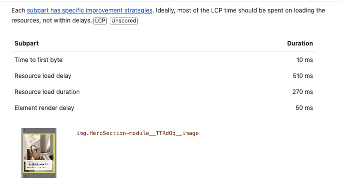
- before와 비교: LCP 요소는 before/after 모두 **동일하게 hero 이미지**. Resource load duration이 7,950ms에서 270ms로 단축.

**Performance filmstrip**

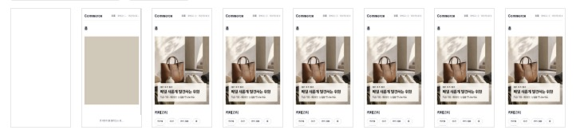
- before와 비교: 표시 순서(Header → 페이지 제목 → Hero)는 before/after 동일하나, Hero가 채워지는 시점이 크게 앞당겨짐

**Network waterfall의 document·홈 데이터·Hero 이미지 요청 시작 순서와 전송 크기**

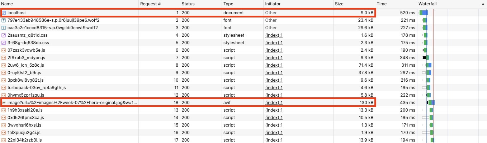
- 홈 데이터의 경우 React Query prefetch(dehydrate)로 서버에서 조회되어 브라우저 Network Waterfall에는 별도 요청이 나타나지 않음
- before와 비교:
  - **Hero 이미지 전송 크기**: 7.5MB → **130kB(AVIF)** 로 대폭 감소 — 이 구간이 LCP 병목이었으므로 가장 큰 개선.
  - **요청 시작 순서**: before는 Hero(`hero-original.jpg`) Request #19 -> after는 `preload` + `fetchPriority="high"`로 인하여 Hero(Request #18)
  - **document 전송 크기**: 8.2KB → **9.0kB로 소폭 증가.** next/image가 초기 HTML에 ① `<head>` hero preload `<link rel="preload" as="image" imagesrcset=… fetchpriority="high">` 를 주입하고, ② `` 에 여러 해상도 후보를 담은 `srcset`(640~1920)과 `sizes` 문자열을 추가하기 때문. 즉 preload 링크 + srcset 마크업 바이트가 document에 더 실린 것. Hero를 더 빨리·작게 받기 위한 **의도된 트레이드오프**(document +0.8KB ↔ 이미지 전송 7.5MB→130kB + LCP 대폭 단축).

### 4-4 목록 최초 진입·갱신 화면 재녹화, 검색·카테고리·정렬·페이지 URL 복원 확인

After 빌드에서 목록 화면이 2단계 동작을 그대로 유지하는지 시나리오별로 재녹화해 회귀 없음을 확인한다.

- **최초 진입(스켈레톤):** 무데이터 최초 진입 시 실제 목록 크기를 예상하는 스켈레톤 → 데이터 도착 후 실제 목록으로 교체.
  - 영상: `docs/read0more-week7/recordings/step4-4-최초진입-스켈레톤.webm`
- **기존 목록 갱신(흐림 유지):** 조건 변경 시 이전 목록을 즉시 비우지 않고 흐리게 유지한 채 갱신.
  - 영상: `docs/read0more-week7/recordings/step4-4-기존목록-갱신-흐림.webm`
- **URL 복원:** 검색·카테고리·정렬·페이지를 바꾼 뒤 **현재 URL의 active query와 화면 결과가 일치**하고, 새로고침 시 URL에서 조건이 복원됨을 재확인.
  - 영상: `docs/read0more-week7/recordings/step4-4-URL복원.webm`

### 4-5 회귀 재확인 (뒤로/앞으로 가기·장바구니·위시리스트·상태 화면)

| 확인 항목 | 결과 |
| --- | --- |
| 뒤로/앞으로 가기 | 정상 동작 |
| 장바구니·위시리스트·Header 개수 | 정상 동작 |
| 로딩·에러·빈 상태·재시도 | 정상 동작 |

### 4-6 FSD 의존 방향·슬라이스 Public API 확인

- pre-commit `steiger` FSD lint 게이트를 통과한 상태로 커밋했으므로, 의존 방향(상위→하위) 위반과 슬라이스 Public API 우회는 없다고 판단.

### 4-7 회귀 판정 (효과 없거나 악화된 변경)

Before와 After를 지표별로 다시 대조

| 항목 | Before | After | 판정 |
| --- | --- | --- | --- |
| LCP(중앙값) | 8.5s | 0.8s | ✅ 대폭 개선 — 선택한 병목과 직접 연결 |
| FCP(중앙값) | 0.5s | 0.5s | 유지 — 최소값만 0.5→0.4s로 소폭변동 |
| CLS | 0 | 0 | 유지 — Hero fallback·목록 스켈레톤 추가 후에도 shift 없음 |
| Hero 이미지 전송 | 7.5MB / 7,904ms | 130kB(AVIF) / 530ms | ✅ 대폭 개선 |
| LCP Element Render delay | 37ms | 62ms | ⚠️ 소폭 악화(+25ms) |
| document 전송 크기 | 8.2KB | 9.0kB | ⚠️ 소폭 악화(+0.8KB) |
| 이미지 품질 | 원본 | quality 75 | 육안상 큰 차이가 없어보이므로 유지 |
| 기존 기능(장바구니·위시리스트·필터·정렬·페이지) | 정상 | 정상 | 회귀 없음(4-5) |

- **LCP가 1s → 0.8s로 한 번 더 내려간 이유**: 4-8의 `fetchPriority="high"` 적용으로 hero 요청 우선순위가 올라간 결과. 1단계 after(1.0s)보다 재측정(4-2)이 더 나은 값을 냈다.
- **악화 항목 판단 — 둘 다 유지**:
  - `Element Render delay 37→62ms`: next/image 디코딩·레이아웃 경로 차이로 렌더 단계가 ~25ms 늘었으나, 같은 LCP 안에서 전송이 7,904→530ms로 줄어든 이득(LCP 순감 ~7.7s)이 압도적이라 유지.
  - `document 8.2→9.0KB(+0.8KB)`: preload `<link>` + `srcset`/`sizes` 마크업이 초기 HTML에 실린 결과(4-3). 이미지 전송 7.5MB→130kB 절감·LCP 대폭 단축을 위한 의도된 트레이드오프라 유지.
- **결론**: **FCP만 줄고 LCP·CLS·이미지 품질·기존 기능이 나빠진 경우가 아니로 판단.** FCP는 유지, LCP가 크게 개선됐고, 악화는 렌더 딜레이 +25ms·document +0.8KB 두 가지.

### 4-8 추가 발견 — hero 이미지 `priority` deprecation 대응

4단계 회귀 확인 중 **Lighthouse 검사에서 hero(LCP) 이미지에 `fetchpriority="high"` 가 붙지 않았다는 안내**를 받아 알게 됐고, 원인은 공식 문서를 보고 확인.

- **원인**: Next **16.0.0** 부터 `next/image` 의 `priority` prop 이 deprecated 되고 `preload` prop 으로 분리됨. 이 버전에서 `priority` 는 eager 로딩 + preload `<link>` 방출까지만 하고, **`fetchpriority="high"` 는 붙이지 않는다** (13.x~15.x 까지는 `priority` 가 `fetchpriority="high"` 까지 묶어줬으나 16 에서 분리.)
- **조치**: 1단계에서 준 `priority` 를 deprecated 되지 않은 `preload` + `fetchPriority="high"` 로 교체.
- 참고: [next/image docs — Version History (v16.0.0)](https://nextjs.org/docs/app/api-reference/components/image)

