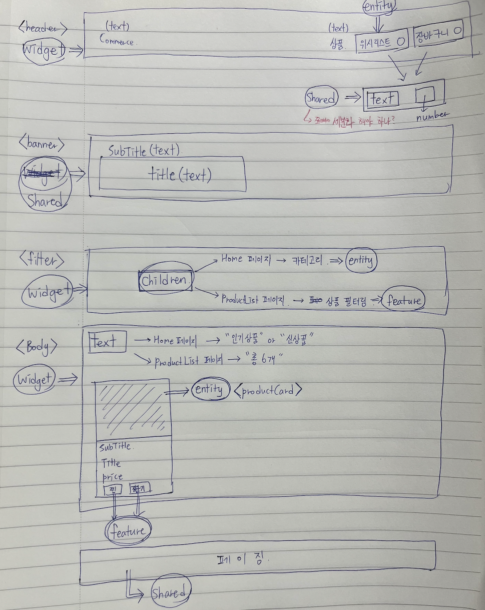
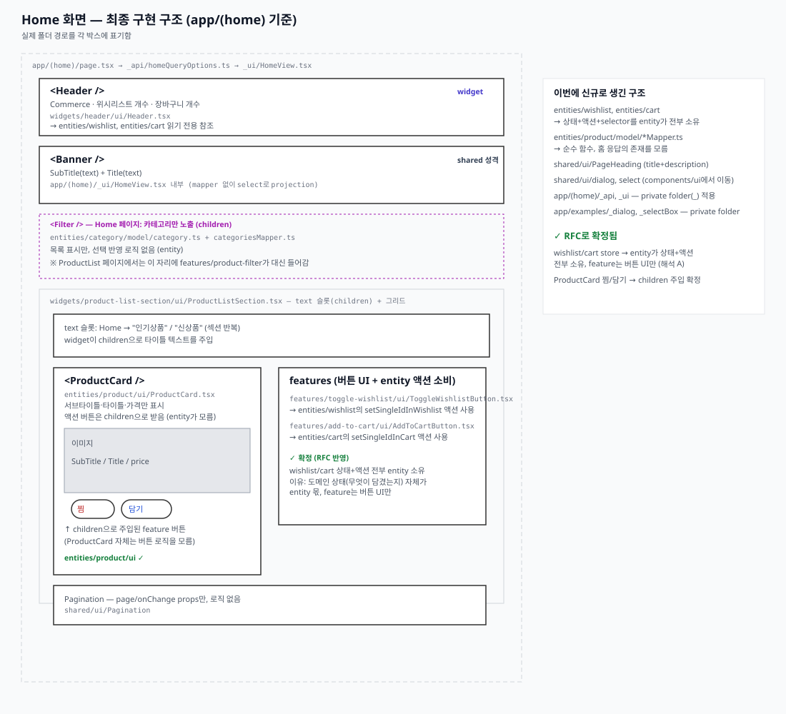

# Week 06 RFC — FSD로 변경 반경을 설계한다

> 이 문서는 `docs/assignments/week-06.md`의 RADIO 양식을 따른다.
> "직접 작성"으로 표시된 항목은 아직 결정하지 않은 부분이다.

## 0단계 — 동작 기준선

폴더 이동 전, 현재 코드(`feat/week-06`, `pnpm dev` 기준)에서 아래 항목을 직접 확인했다.

| 항목                                       | 결과                                                                                                                                                                                                                                                                                                                                                                                                  |
| ------------------------------------------ | ----------------------------------------------------------------------------------------------------------------------------------------------------------------------------------------------------------------------------------------------------------------------------------------------------------------------------------------------------------------------------------------------------- |
| `pnpm check`                               | 통과 — test 46/46, lint 에러 0 · warning 30(전부 mock 데이터의 `no-magic-numbers`, 구조 변경과 무관한 기존 경고), typecheck 통과, build 성공                                                                                                                                                                                                                                                          |
| 홈 화면 정상 상태                          | 배너 · 카테고리 · 인기 상품 · 신상품 정상 렌더링                                                                                                                                                                                                                                                                                                                                                      |
| 상품 목록 정상 상태                        | 총 30개, 페이지네이션 1/3 정상                                                                                                                                                                                                                                                                                                                                                                        |
| 검색                                       | `q=셔츠` → 서버가 `총 1개`로 정확히 필터링, 새로고침해도 결과 유지                                                                                                                                                                                                                                                                                                                                    |
| 카테고리 필터                              | `category=digital` → 총 6개로 정상 필터링                                                                                                                                                                                                                                                                                                                                                             |
| 정렬                                       | `sort=price-asc` 등 URL에 정상 반영                                                                                                                                                                                                                                                                                                                                                                   |
| URL 공유 · 새로고침                        | 쿼리 파라미터 포함 URL 새로고침 시 동일한 필터 결과 유지                                                                                                                                                                                                                                                                                                                                              |
| 뒤로/앞으로 가기                           | products → home 이동 후 뒤로 가기 시 검색 상태 복원, 앞으로 가기 정상                                                                                                                                                                                                                                                                                                                                 |
| 장바구니 · 위시리스트 동기화               | 상품 목록에서 찜 · 담기 토글 → 헤더에 "위시리스트 1 / 장바구니 1" 반영, 홈으로 이동해도 카운트 유지(Zustand 정상 공유)                                                                                                                                                                                                                                                                                |
| 빈 상태 (실제 검색)                        | `scenario` 없이 실제로 매칭되지 않는 검색어(`q=존재하지않는상품명zzz`)로 확인 — "검색 결과가 없습니다" 정상 표시                                                                                                                                                                                                                                                                                      |
| 네트워크 에러 (클라이언트 재요청)          | Playwright로 카테고리 변경 시 클라이언트 재요청을 강제로 실패시켜 확인. TanStack Query 기본 재시도(3회, 지수 백오프)가 끝나는 **약 8~10초 후**에야 `ErrorRetry`("Failed to fetch" + 다시 시도 버튼)가 렌더링됨. **그 사이 8~10초 동안은 이전 필터의 데이터가 그대로 남아있고 로딩·에러 표시가 전혀 없어 사용자에게는 "아무 반응 없음"으로 보임** — 4단계 설계에 반영 필요                             |
| 로딩 상태 (클라이언트 재요청)              | 필터 변경 시 응답에 지연을 걸어도 `QueryState`의 `renderLoading`("불러오는 중입니다…")은 **한 번도 렌더링되지 않음**. `placeholderData: keepPreviousData`로 인해 필터 변경 시 `isPending`이 항상 false가 되기 때문 — 최초 진입도 SSR prefetch가 항상 먼저 끝나 있어 사실상 `renderLoading` 분기는 현재 구조에서 도달 불가능에 가까움 → 4단계에서 로딩 표시 범위(스켈레톤/`isFetching` 등) 재설계 필요 |
| `scenario` 기반 에러/빈 상태 (mock 제어값) | `?scenario=empty`, `?scenario=error`로 URL을 조작해도 화면은 정상 데이터를 그대로 보여줌 — `scenario`가 `ProductListQuery`/`productSearchParams`에 없어(과제 지침에 따라 의도적으로 제외) 클라이언트가 API로 전달하지 않기 때문. `error.tsx`도 프로젝트 전체에 존재하지 않음. 버그가 아니라 4단계(에러 처리 경계)가 아직 구현되지 않아 생기는 공백 → 4단계에서 구조와 함께 정의                       |

### 발견한 기존 버그

없음. `fix: 5주차 과제 피드백 적용`(7625258)에서 이미 다음을 수정함:

- 훅 함수에 `.queryOptions` static property를 붙여 Server Component에서 재사용하던 편법을 `homeQueryOptions`/`productsQueryOptions` 독립 함수로 분리
- `ProductView`의 페이지 초과 리셋 로직에서 `isError` 분기 제거, `totalCount === 0` early return으로 단순화
- 검색 디바운스가 `history: 'push'`로 히스토리를 스팸처럼 쌓던 것을 `replace`로 변경

이후 `useWishlistStore`/`useCartStore`(직렬화·마이그레이션·rehydrate), `Pagination`(경계값), `set.ts`(Set 직렬화)를 코드 리뷰 + 브라우저 확인(검색·카테고리·정렬·페이지네이션·URL·장바구니/위시리스트 동기화)으로 다시 점검했지만 추가로 발견한 버그는 없음.

**추가로 발견한 구조적 결함 (동작 버그는 아님):**

- **원인**: `src/app/home/{api,model,ui}`, `src/app/products/ui`가 Next.js App Router 라우팅 디렉터리(`src/app/**`) 안에 있는데 언더스코어 접두사가 없다. Next.js는 `_folderName`처럼 언더스코어로 시작하는 폴더만 private folder로 취급해 라우팅 대상에서 완전히 제외한다. 지금은 그 안에 `page.tsx`/`route.ts`가 없어서 우연히 라우팅되지 않을 뿐, 나중에 실수로 `src/app/home/ui/page.tsx` 같은 파일이 추가되면 `/home/ui`가 그대로 라우트로 노출된다. 과제 문서가 "FSD App/Pages 레이어가 필요하면 예약 디렉터리와 구분되도록 `src/_app`·`src/_pages`를 쓴다"고 명시한 것과 같은 원칙이 라우트 세그먼트 내부 구현 폴더에도 적용돼야 한다.
- **현재 영향**: 없음 — 지금은 실제로 라우팅되는 페이지가 없어 사용자에게 보이는 동작 문제는 없다.
- **처리 방침**: 별도 버그 수정 커밋을 만들지 않는다. 이 폴더들은 어차피 이번 FSD 전환에서 옮겨지므로, 마이그레이션 결과물 자체가 이 문제를 해소한다 (예: `src/app/home/ui/HomeView.tsx` 같은 페이지 조합 파일이 라우팅 디렉터리에 남는다면 `_ui`처럼 언더스코어를 붙이거나 `src/_pages`로 이동).

---

## R — Requirements

### 5주차까지의 기능 요구사항

- Home 화면에서 API호출
- Home에서 조회된 상품 찜/담기 클릭시 header의 위시리스트 0 장바구니 0 에 즉시 표현되어야 함
- Home에서 카테고리 선택시 해당 카테고리 상품 목록 페이지로 이동
- 상품 목록에서 필터 선택시 필터에 맞는 상품 조회
- 상품 목록에서 조회된 상품 찜/담기 클릭시 header의 위시리스트 0 장바구니 0에 즉시 표현되어야 함
- 위시리스트에 포함된 상품은 찜에 표기됨
- 장바구니에 포함된 상품은 동일 상품 담기 클릭시 장바구니에서 해제됨 (위시리스트도 동일)
- 페이지 클릭시 해당 페이징의 상품 조회
- 뒤로가기 클릭시 이전 필터 조건으로 상품 조회됨
- 사용자의 다음 행위 (다음 페이지 이동, 또는 Home에서 카테고리 위에 호버)에 대한 선 API조회

**코드에서 추가로 확인한 요구사항** (위 목록에 없던 것만):

- 상품 목록에서 검색어(q)로 필터링 — 브랜드+상품명 기준, 대소문자 구분 없이 비교(`toLocaleLowerCase('ko')`)
- 상품 목록에서 정렬(최신순/인기순/가격 낮은순/가격 높은순) 적용
- 검색·필터 결과가 0건이면 목록은 "검색 결과가 없습니다", 홈은 "상품이 없습니다"(인기/신상품 섹션 각각) 문구 표시
- 필터 변경으로 총 페이지 수가 줄어들면 자동으로 1페이지로 리셋
- 위시리스트·장바구니 상태는 새로고침해도 유지(`sessionStorage` 기반, 탭/세션 종료 전까지 — 로그인 개념 없음)
- 로딩 중(`isFetching`)에는 페이지네이션을 숨김
- 검색 입력은 300ms 디바운스 + 즉시 제출(Enter) 가능, 디바운스 중 URL 히스토리는 `replace`로 스팸 방지
- 홈/목록 최초 진입 시 서버에서 prefetch → Hydration으로 클라이언트 재요청 없이 초기 데이터 표시(SSR)

### 비기능 요구사항

- **캐싱 정책** — `staleTime`/`gcTime`으로 불필요한 재조회 방지, `keepPreviousData`로 필터 변경 시 깜빡임 없이 이전 데이터 유지
- **접근성** — 찜/담기 버튼에 `aria-label`·`aria-pressed`로 토글 상태 명시, 페이지네이션 nav에 `aria-label`
- **타입 안전성** — `tsc --noEmit` 통과가 `pnpm check`의 필수 게이트
- **정적 분석** — ESLint(매직넘버 금지 등) 통과가 커밋 전 자동 검사 대상
- **SSR 초기 로드 성능** — 홈/목록 진입 시 서버 prefetch로 클라이언트 워터폴 방지

### 이번 주에 반드시 보존할 동작

위 기능 요구사항 전체 + 0단계 표 참고

### 이번 주에 하지 않을 것과 그 이유

- **[2026.07.28] Advanced (A. 의존성 하네스, B. 변경 반경 실험) — 아직 결정 보류.** 기본 과제(RFC, FSD 전환, Public API 결정, 에러 처리 경계, 삭제 시나리오 검증)만으로도 범위가 커서, 지금 시점에 Advanced를 한다/안 한다를 못박기보다 FSD 전환이 어느 정도 진행된 뒤 여유와 실현 가능성을 보고 재판단하기로 함. 특히 B(변경 반경 실험)는 새 구조 위에서 실제로 기능을 추가해봐야 하는 작업이라, 전환이 끝나기 전에는 범위를 가늠하기 어려움
- **[2026.07.31] Advanced B(변경 반경 실험)는 아직 보류.** 새 구조 위에서 실제로 작은 기능을 추가해봐야 하는 작업이라, 마이그레이션이 끝나지 않은 지금은 범위를 가늠하기 어렵다는 원래 판단을 그대로 유지함 (Advanced A(의존성 하네스)는 반대로 마이그레이션 전에 먼저 진행하기로 판단을 바꿔 실제로 구축함 — `eslint-plugin-boundaries`로 상위→하위 import 규칙과 같은 레이어 다른 슬라이스 직접 import 금지 규칙을 강제하는 하네스를 파일 이동 전에 먼저 설치·구성. 마이그레이션 자체를 이 하네스로 검증하려는 목적이라 "전환이 어느 정도 진행된 뒤"가 아니라 오히려 맨 먼저 하는 게 맞다고 판단했음)
- **[2026.07.31] Advanced B(변경 반경 실험) 재검토 — 진행함.** 위 항목에서 "보류를 유지"했던 판단을 다시 뒤집었다. 기본 과제와 Advanced A가 끝난 뒤 여유가 생겨, "상품 목록 필터 전체 초기화"를 대상으로 실제 구현까지 완료했다(`docs/rfc/week06-advanced-b.md` 참고).
- **[2026.07.31] `next/image`의 가로/세로 비율 경고는 고치지 않음.** 개발 서버 콘솔에 상품 이미지마다 "width 또는 height만 지정돼 있다"는 경고가 뜨는 걸 발견했다. 화면 렌더링이나 기능에는 영향이 없고, FSD 구조 전환과 무관한 별개의 스타일링 이슈라 이번 주 범위 밖으로 남긴다.
- **[2026.07.31] `Header`를 공통 레이아웃으로 묶는 건 하지 않음.** 애초에 FSD 설계 스케치(화면 구조 스케치 참고) 단계에선 Home·Products가 공통 레이아웃을 통해 `Header`를 한 번만 공유하는 그림이었지만, 실제 구현은 `HomeView.tsx`/`ProductView.tsx`가 각자 `<Header />`를 개별 렌더링하는 채로 남아있다는 걸 뒤늦게 발견했다. `src/app/layout.tsx`는 이번 마이그레이션에서 "전환 대상 아님"으로 스코프 밖에 뒀던 파일이라, `Header`를 `widgets/header`로 옮기면서도 "어디서 조합하는가"는 재검토하지 않고 넘어간 게 원인이다. 고치려면 ① 루트 `layout.tsx`에 `Header`를 추가(단, `/examples`에도 노출됨) ② `(home)`·`products`만 묶는 새 Route Group(`app/(shop)/layout.tsx`)을 만드는 두 방법이 있는데, 둘 다 구조 변경이 필요해 시간상 이번 주엔 진행하지 않고 다음으로 남긴다.

## A — Architecture

### 현재 겪는 문제 (3개 이상)

1. **예시/데모 코드와 실제 화면 코드가 뒤섞여 있고, private folder 컨벤션이 전혀 적용되지 않음** — `src/app/home/{api,model,ui}`, `src/app/products/ui`뿐 아니라 `src/app/examples/{dialog,selectBox}`도 언더스코어 없이 라우팅 디렉터리(`src/app/**`) 안에 있다. `src/examples/week-05-layout`처럼 라우팅 밖에 있는 예시 코드도 섞여 있어, 위치만 봐서는 실제 화면 코드인지 데모인지 구분되지 않는다. Next.js는 `_folderName`으로 시작하는 폴더만 라우팅 대상에서 완전히 제외하므로, 지금은 우연히 `page.tsx`가 없어 라우팅되지 않을 뿐 실수로 추가되면 그대로 라우트로 노출된다.
2. **FSD 레이어 골격은 있지만 세그먼트 내부 규칙이 러프함** — `dialog`/`select` 같은 compound 컴포넌트를 `shared/ui`로 어떻게 편입할지, 슬라이스 안에서 UI를 어떻게 합성할지가 정해지지 않았다. 너무 세밀하게 규칙을 만들면 오버엔지니어링이 될 수 있어, UI를 먼저 재정의하고 그 결과로 파일 구조를 도출하는 순서로 접근한다.
3. **에러·로딩(Suspense) 경계가 구체적으로 정의되지 않음** — `error.tsx`가 프로젝트에 없고, `QueryState`의 `renderLoading`도 `placeholderData: keepPreviousData` 때문에 구조상 거의 도달 불가능하다(0단계에서 확인). **해결(4단계 참고)**: 로딩은 라우트 `loading.tsx` 하나로, 에러는 API 실패(인라인 `QueryState`/`ErrorRetry`)와 렌더링 버그(`error.tsx`)로 분리해서 정의했다. `QueryState`는 `renderLoading` prop을 제거해 단순화한다.
4. **`/api/home`이 BFF 형태로 여러 도메인을 한 번에 묶어서 응답함** — `src/app/api/home/route.ts`가 `banner`(홈 전용) + `categories`(entities/category와 동일 데이터) + `popularProducts`/`newProducts`(entities/product를 `popular`/`latest` 정렬로 상위 6개만 자체 재정렬)를 한 응답으로 합쳐서 내려준다. 이미 `entities/product`에 동일한 정렬 옵션(`productsQueryOptions`)이 있는데도 홈은 별도 엔드포인트에서 정렬 로직을 중복 구현하고 있어, 도메인별 소유권이 불분명하다. **해결 방향**: 요청 자체는 쪼개지 않고(네트워크 워터폴 방지 요구사항 유지), `homeQueryOptions`는 페이지(`_api`)가 하나의 쿼리로 소유한다. `entities/product`(`popularProductsMapper`/`newProductsMapper`)와 `entities/category`(`categoriesMapper`)는 순수 mapper 함수만 export하고 `homeQueryOptions`를 직접 import하지 않는다(entity가 app 하위 파일을 import하면 역방향 의존이 되므로). 실제 `useQuery({ ...homeQueryOptions, select: mapper })` 연결은 페이지(`HomeView`)가 담당해 client 쪽 소유권을 정리한다. `route.ts`의 서버 쪽 정렬 로직 중복은 이번 전환 범위에서 제외한다(과제 문서가 `src/app/api` Route Handler를 전환 범위 제외로 허용).
5. **테스트 코드가 같은 레이어의 다른 슬라이스를 직접 import함** — `src/widgets/product-card/ui/ProductCard.test.tsx`가 다른 widget인 `@/widgets/header/ui/Header`를 가져와 "ProductCard에서 찜/담기를 누르면 Header 카운트도 같이 바뀐다"를 검증한다. 검증 의도(Header·ProductCard가 공유하는 Zustand store 동기화)는 타당하지만, 같은 레이어의 다른 슬라이스를 직접 import하지 않는다는 규칙을 테스트 코드가 어기고 있고, 실제로는 두 widget의 "조합"을 검증하는 테스트가 `product-card` 슬라이스 한쪽에 얹혀 있는 상태다. **해결**: `ProductCard`가 entity로 옮겨가며 찜/담기를 직접 갖지 않게 되면 이 테스트가 검증하던 대상 자체가 사라진다. 이 통합 테스트는 `widgets/body/ui/Body.test.tsx`로 옮긴다 — `Body`가 `ProductCard`+`features`(찜/담기 버튼)를 실제로 조합하는 주체이므로, 거기서 `Body`+`Header`를 함께 렌더링해 store 동기화를 검증한다.
6. **캐시 정책 상수가 이름과 다른 곳에서 재사용됨** — `entities/product/model/constants.ts`의 `PRODUCT_PRICE_STALE_TIME`/`PRODUCT_PRICE_GC_TIME`는 이름상 "상품 가격" 전용 캐시 정책인데, `src/app/home/model/homeQueryOptions.ts`가 이를 그대로 가져다 배너·카테고리·인기/신상품이 섞인 홈 응답 전체의 캐시 정책으로 사용한다. 홈 데이터는 가격과 무관한데 이름이 "가격"인 상수를 재사용하고 있어 이름과 실제 쓰임이 어긋난다. **해결**: `homeQueryOptions`가 페이지 소유(`_api`)로 옮겨가면서 `entities/product`의 상수를 빌려 쓸 이유 자체가 없어졌다. 홈 쿼리는 자기 자신의 staleTime을 페이지 쪽에 독립적으로 정의한다. 값은 기존과 동일한 60초로 유지한다 — 인기/신상품도 결국 가격이 자주 바뀌는 상품이라 같은 민감도(짧은 재확인 주기)가 여전히 유효하기 때문이다.
7. **`/` 경로가 홈이 아니라 `/home`으로 리다이렉트만 함** — `src/app/page.tsx`는 콘텐츠 없이 `redirect('/home')`만 수행하고, 실제 홈 콘텐츠는 `/home`에 있다. 일반적으로는 `/`가 곧 홈이어야 하는데 불필요한 리다이렉트 한 단계가 껴 있다. 이번 주에 Route Group(`src/app/(home)/page.tsx`)으로 전환해 `/` 경로에서 바로 홈 콘텐츠를 렌더링하고, 폴더명은 `(home)`으로 남겨 의도를 유지하기로 함.

### 화면 구조 스케치 (Before/After)

FSD 디렉터리로 옮기기 전, Home 화면을 영역별로 나눠 어떤 레이어에 속할지 먼저 손으로 그려봤다. 각 영역(header/banner/filter/Body/페이지네이션)에 어떤 데이터가 필요하고 어떤 FSD 레이어(Widget/Shared/entity/feature)로 분류할지에 대한 초기 판단이 담겨 있다.



아래는 이번 주 논의를 거쳐 실제로 구현된 Home 화면의 최종 구조다. 스케치 단계의 판단(예: `Body`)과 실제 구현(예: `ProductListSection`으로 개명)이 어떻게 달라졌는지 비교할 수 있다.



### Before — 현재 폴더 구조 (화면 기준)

```
src/
├── app/                          # Next.js 라우팅 디렉터리
│   ├── home/
│   │   ├── page.tsx              # 서버 컴포넌트, prefetch만 담당
│   │   ├── api/
│   │   │   └── homeService.ts    # fetchHome() — /api/home 호출
│   │   ├── model/
│   │   │   ├── types.ts          # HomeResponse (배너+카테고리+인기+신상품 조합 타입)
│   │   │   ├── homeQueryOptions.ts
│   │   │   └── useHomeData.ts
│   │   └── ui/
│   │       └── HomeView.tsx      # 실제 화면 렌더링 ('use client')
│   │
│   ├── products/
│   │   ├── page.tsx              # 서버 컴포넌트, prefetch만 담당
│   │   └── ui/
│   │       └── ProductView.tsx   # 실제 화면 렌더링 ('use client')
│   │                              # ※ products는 api/model 없이 entities/features를 바로 소비
│   │
│   ├── layout.tsx / providers.tsx / globals.css
│   └── api/{home,products}/route.ts   # mock 백엔드 (Route Handler)
│
├── components/ui/                # FSD 밖 — 아직 안 옮겨진 공용 UI
│   ├── dialog/                   # compound component
│   └── select/                   # compound component
│
├── entities/
│   ├── product/
│   │   ├── model/product.ts      # Product, ProductListQuery, 정렬/기본값 상수
│   │   ├── model/constants.ts    # staleTime/gcTime
│   │   └── api/{productsService, productsQueryOptions, useProductList}.ts
│   └── category/model/category.ts
│
├── features/
│   ├── cart/model/useCartStore.ts
│   ├── wishlist/model/useWishlistStore.ts
│   └── product-filter/
│       ├── model/{productSearchParams, loadProductSearchParams, useProductListParams}.ts
│       └── ui/ProductFilters.tsx
│
├── widgets/
│   ├── header/ui/Header.tsx            # wishlist·cart 카운트 표시, 상품 prefetch
│   └── product-card/ui/ProductCard.tsx # wishlist·cart 토글 버튼 포함
│
└── shared/
    ├── api/{getQueryClient, response}.ts
    ├── lib/{set, webStorage}.ts
    └── ui/{ErrorRetry, Pagination, QueryState}/
```

화면이 실제로 조합하는 관계:

- **`/home`**: `page.tsx`(prefetch) → `HomeView`(app/home/ui) → `Header`(widget) + `ProductCard`(widget, 카테고리별 반복) + `productsQueryOptions`(entities, hover prefetch용) 직접 조합
- **`/products`**: `page.tsx`(prefetch) → `ProductView`(app/products/ui) → `Header` + `ProductFilters`(feature) + `useProductListParams`(feature) + `useProductList`(entities) + `ProductCard`(widget) + `Pagination`(shared)

관찰: `home`은 자기 전용 `api/model`을 갖고 있는데 `products`는 없어서 두 화면의 구조가 서로 다르다. `HomeView`/`ProductView` 자체도 아직 FSD 세그먼트 밖(라우팅 디렉터리 안)에 있다. `select`/`dialog`도 `shared/ui`가 아니라 `src/components/ui/{dialog,select}`라는 FSD 레이어 밖의 별도 폴더에 있어서, 공용 UI를 찾으려면 `shared/ui`와 `components/ui` 두 곳을 다 봐야 한다.

### After — 목표 폴더 구조

지금까지 나온 결정을 전부 반영한 최종 트리다.

`src/_pages` 레이어는 쓰지 않기로 확정했다 — 홈·상품목록 모두 라우트 1개 : 페이지 조합 1개로 정확히 대응하고 여러 라우트가 공유하는 페이지 조합도 없어서, 프레임워크 라우팅과 분리해야 할 이유가 없다. `src/app/**/_ui`의 private folder만으로 "라우팅 제외 + 라우트와 동거"라는 목적이 충분히 달성된다.

```
src/
├── app/                                    # Next.js 라우팅 디렉터리
│   ├── (home)/                             # Route Group — URL은 '/' 그대로 (7번 문제 해결)
│   │   ├── page.tsx                        # 서버 컴포넌트, homeQueryOptions로 prefetch
│   │   ├── loading.tsx                     # 라우트 전환 시 화면 전체 로딩 (4단계)
│   │   ├── error.tsx                       # 예상 못한 렌더링 오류의 최후 방어선 (4단계)
│   │   ├── _api/homeQueryOptions.ts        # /api/home 요청 하나만 소유. staleTime 60s는 독립 정의 (문제 6 해결)
│   │   └── _ui/
│   │       └── HomeView.tsx                # entities의 mapper를 가져와 select로 실제 조립
│   │                                        # (배너는 mapper 없이 select로 여기서 바로 projection)
│   │
│   ├── products/
│   │   ├── page.tsx                        # 서버 컴포넌트, prefetch만
│   │   ├── loading.tsx                     # (4단계)
│   │   ├── error.tsx                       # (4단계)
│   │   └── _ui/
│   │       └── ProductView.tsx
│   │
│   ├── examples/                           # 실제 라우트('/examples'), 그대로 유지
│   │   ├── page.tsx
│   │   ├── _dialog/                        # private folder — 라우트 아님 (문제 1 해결)
│   │   └── _selectBox/                     # private folder — 라우트 아님
│   ├── layout.tsx / providers.tsx / globals.css
│   └── api/{home,products}/route.ts        # 전환 범위 제외 (assignment 명시)
│
├── entities/
│   ├── product/
│   │   ├── model/product.ts                # Product, ProductListQuery 등
│   │   ├── model/constants.ts              # PRODUCT_PRICE_* — productsQueryOptions 전용으로 범위 확정
│   │   ├── api/{productsService, productsQueryOptions, useProductList}.ts
│   │   ├── model/popularProductsMapper.ts  # 순수 함수. 홈 응답의 존재를 모름 (신규)
│   │   ├── model/newProductsMapper.ts      # 순수 함수 (신규)
│   │   └── ui/ProductCard.tsx              # 서브타이틀·타이틀·가격만. 액션은 children으로 받음
│   ├── category/
│   │   ├── model/category.ts
│   │   └── model/categoriesMapper.ts       # 순수 함수 (신규)
│   ├── wishlist/                           # 신규 — 상태(productIds) + 액션(setSingleIdInWishlist) + read selector 전부
│   │   └── model/useWishlistStore.ts
│   └── cart/                               # 신규 — 상태(productIds) + 액션(setSingleIdInCart) + read selector 전부
│       └── model/useCartStore.ts
│
├── features/
│   ├── product-filter/
│   │   ├── model/{productSearchParams, loadProductSearchParams, useProductListParams}.ts
│   │   └── ui/ProductFilters.tsx
│   ├── toggle-wishlist/ui/ToggleWishlistButton.tsx  # 신규 — 버튼 UI만. entities/wishlist의 액션을 가져다 씀
│   └── add-to-cart/ui/AddToCartButton.tsx           # 신규 — 버튼 UI만. entities/cart의 액션을 가져다 씀
│
├── widgets/
│   ├── header/ui/Header.tsx                # entities/wishlist·entities/cart를 읽기 전용으로 참조
│   └── product-list-section/ui/ProductListSection.tsx  # 신규 — text 슬롯(children) + 그리드(ProductCard+features 조합) (최초 이름 Body → 개명, 아래 애매한 파일 결정표 참고)
│
└── shared/
    ├── api/{getQueryClient, response}.ts
    ├── lib/{set, webStorage}.ts
    └── ui/
        ├── ErrorRetry/, Pagination/, QueryState/
        ├── PageHeading/                    # 신규 — title(필수)+description(선택)
        ├── dialog/                         # src/components/ui/dialog에서 이동
        └── select/                         # src/components/ui/select에서 이동
```

**`src` 밖으로 이동**: `src/examples/week-05-layout/`(`HomeLayoutExample.tsx`, `ProductListLayoutExample.tsx`, `week-05-layout.css`, `README.md`) — grep 결과 다른 코드에서 참조 없음 확인. `src`(실제 애플리케이션 코드)에서는 완전히 빠지되, 5주차 레이아웃 실험 기록 자체는 자료로 남기기 위해 삭제하지 않고 `docs/examples/week-05-layout/`로 이동한다.

### 사용할 레이어만 선택한 근거

- **사용**: `entities`, `features`, `widgets`, `shared` — 이미 코드에서 실제로 역할을 하고 있고, 이번 주 결정들(entity+feature 분리, `widgets/body` 등)도 전부 이 네 레이어 안에서 해결됨
- **미사용 — `_pages`**: 라우트 1개 : 페이지 조합 1개로 정확히 대응하고 여러 라우트가 공유하는 페이지 조합이 없어, 프레임워크 라우팅과 분리해야 할 이유가 없다. `src/app/**/_ui`(private folder)만으로 충분
- **미사용 — `processes`**: 과제 문서가 사용하지 않는다고 명시. 이 프로젝트에 여러 페이지에 걸친 비즈니스 프로세스(예: 결제 단계)가 없어서 필요성도 없음

### 허용/금지 import 예시

**허용 (상위 → 하위)**

```ts
// widgets/product-list-section/ui/ProductListSection.tsx
import { ProductCard } from '@/entities/product/ui/ProductCard'; // widget → entity
import { ToggleWishlistButton } from '@/features/toggle-wishlist'; // widget → feature

// src/app/(home)/_ui/HomeView.tsx (page 조합 코드)
import { popularProductsMapper } from '@/entities/product/model/popularProductsMapper'; // page → entity
import { productsQueryOptions } from '@/entities/product/api/productsQueryOptions'; // page → entity (카테고리 호버 프리페치)

// widgets/header/ui/Header.tsx
import { useWishlistCount } from '@/entities/wishlist/model/useWishlistStore'; // widget → entity (읽기 전용)

// features/toggle-wishlist/ui/ToggleWishlistButton.tsx
import { useWishlistStore } from '@/entities/wishlist/model/useWishlistStore'; // feature → entity (액션까지 entity가 소유, feature는 버튼 UI만)
```

**금지 (하위 → 상위, 같은 레이어 간)**

```ts
// ❌ entities/product/ui/ProductCard.tsx
import { useWishlistStore } from '@/features/toggle-wishlist'; // entity → feature (역방향)

// ❌ entities/product/model/popularProductsMapper.ts
import { homeQueryOptions } from '@/app/(home)/_api/homeQueryOptions'; // entity → app (역방향, 더 심각)

// ❌ widgets/product-card 안에서
import { Header } from '@/widgets/header/ui/Header'; // widget → widget (같은 레이어 다른 슬라이스, 문제 5에서 발견한 테스트 코드 위반 사례)

// ❌ entities/category/ui/... 안에서
import { productsQueryOptions } from '@/entities/product/api/productsQueryOptions'; // entity → entity (같은 레이어 다른 슬라이스)
```

### 단계별 마이그레이션 계획과 검증 방법

| 단계 | 작업                                                                                                                                                                            | 검증                                                                          |
| ---- | ------------------------------------------------------------------------------------------------------------------------------------------------------------------------------- | ----------------------------------------------------------------------------- |
| 1    | `src/components/ui/{dialog,select}` → `shared/ui/{dialog,select}` (경로만 이동, 로직 변경 없음)                                                                                 | `pnpm check`, `/examples` 페이지 육안 확인                                    |
| 2    | cart/wishlist store(상태+액션 전부)를 `entities/{cart,wishlist}`로 이동, `useWishlistStore.test.ts`도 함께 이동. `features/{add-to-cart,toggle-wishlist}`는 버튼 UI만 새로 작성 | 이동한 스토어 테스트 통과, 찜·담기 동작 육안 확인                             |
| 3    | `ProductCard`를 `widgets/product-card` → `entities/product/ui`로 이동, 찜/담기를 children으로 받게 변경                                                                         | 홈·목록에서 카드 렌더링 확인 (찜/담기는 4단계에서 Body 완성 후 확인)          |
| 4    | `widgets/body` 생성(텍스트 슬롯 + 그리드), Home·Products가 이걸 쓰도록 교체. `ProductCard.test.tsx`의 "찜/담기 → Header 카운트 동기화" 검증을 `Body.test.tsx`로 이관            | 홈 "인기상품/신상품" 섹션, 목록 "총 N개" 섹션 육안 확인, `Body.test.tsx` 통과 |
| 5    | `shared/ui/PageHeading` 생성, 배너/제목 영역 교체                                                                                                                               | 홈 배너, 목록 제목 육안 확인                                                  |
| 6    | 홈 API 재구성 — `_api/homeQueryOptions.ts` + entities별 mapper 연결                                                                                                             | 홈 데이터 정상 로드, 카테고리 호버 프리페치 동작 확인                         |
| 7    | `/` → Route Group `(home)`으로 전환, `HomeView`/`ProductView`를 `_ui`로 이동                                                                                                    | `/`, `/products` 라우팅 정상, `pnpm build`로 라우트 트리 확인                 |
| 8    | `src/app/examples/{dialog,selectBox}` → `_dialog`/`_selectBox`, `src/examples/week-05-layout` → `docs/`로 이동                                                                  | `/examples` 페이지 정상 동작                                                  |
| 9    | (4단계 별도) 에러 처리 경계 설계·구현                                                                                                                                           | 인위적 실패 재현으로 검증                                                     |

각 단계가 끝나면 공통으로 `pnpm check` 통과 + 0단계 체크리스트(검색·카테고리·정렬·페이지네이션·URL·장바구니/위시리스트 동기화) 중 해당 단계와 관련된 항목만 빠르게 재확인한다.

## D — Data Model

### 상태 분류표

| 상태                | Source of Truth                   | 소유 슬라이스/레이어                                                                                                               | 소비하는 곳                                                                   | 이동 후에도 중복 저장하지 않는 방법                                                                                                                                                                                                                                                                                                                                                                                                                                                                                                            |
| ------------------- | --------------------------------- | ---------------------------------------------------------------------------------------------------------------------------------- | ----------------------------------------------------------------------------- | ---------------------------------------------------------------------------------------------------------------------------------------------------------------------------------------------------------------------------------------------------------------------------------------------------------------------------------------------------------------------------------------------------------------------------------------------------------------------------------------------------------------------------------------------- |
| 상품 조회 결과      | 서버/TanStack Query               | `entities/product`(`productsQueryOptions`·`useProductList`), 홈의 인기/신상품은 같은 슬라이스의 mapper(`popularProductsMapper` 등) | 홈, 상품 목록                                                                 | TanStack Query 캐시만 신뢰하고 컴포넌트 로컬 `useState`로 복사하지 않는다. 홈의 인기/신상품도 별도 fetch 없이 `homeQueryOptions` 캐시를 `select`로 projection해서 캐시가 두 곳으로 갈라지지 않는다. `Product` 타입도 `entities/product/model`에 단일 정의                                                                                                                                                                                                                                                                                      |
| 검색·정렬·페이지    | URL/nuqs                          | `features/product-filter`(`productSearchParams`·`useProductListParams`)                                                            | 상품 목록                                                                     | URL이 유일한 SoT이며 컴포넌트가 필터 값을 로컬 `useState`로 따로 들고 있지 않고 `useProductListParams` 훅을 통해서만 읽고 쓴다. 검색창의 디바운스 중 임시값(`draftQuery`)만 `ProductFilters` 내부 로컬 상태로 잠깐 존재하고, 확정되면 URL로 반영되며 로컬값은 버려진다                                                                                                                                                                                                                                                                         |
| 장바구니·위시리스트 | Zustand(`sessionStorage` persist) | `entities/cart`·`entities/wishlist` — 상태·액션 전부(해석 A, D 섹션 결정 참고)                                                     | 헤더(읽기 전용), `features/toggle-wishlist`·`features/add-to-cart`(액션 호출) | `Header`도 features 버튼도 카운트/포함 여부를 로컬 상태로 따로 만들지 않고 전부 `entities`의 Zustand selector를 직접 구독한다. `sessionStorage` 동기화도 Zustand `persist` 미들웨어를 통해서만 하고 수동 sync 코드를 추가하지 않는다. **`localStorage`가 아니라 `sessionStorage`를 쓰는 이유**: `sessionStorage`는 탭마다 독립적이라, 같은 브라우저에서 여러 탭(서로 다른 사용자·세션일 수 있음)을 열어도 장바구니가 탭 간에 섞이지 않는다. `localStorage`였다면 한 탭에서 담은 장바구니가 다른 탭에도 즉시 반영돼 세션이 겹치는 문제가 생긴다 |
| Dialog 열림 여부    | React 로컬 상태                   | `shared/ui/dialog`·`shared/ui/select` 내부(`useDialog`·`useSelectRoot`)                                                            | 다이얼로그/셀렉트를 사용하는 화면                                             | controlled/uncontrolled 이중 API로 `open` prop 유무에 따라 SoT를 하나로 확정한다(`open` prop이 있으면 그 값이 SoT, 없으면 내부 `useState`가 SoT) — 두 개를 동시에 두지 않는다. 열림 여부를 Zustand 같은 전역 상태로 옮기지 않는다                                                                                                                                                                                                                                                                                                              |

## I — Interface

### Public API 사용 여부와 방식 (3단계)

**슬라이스 루트에 barrel `index.ts`를 두지 않는다. `@/*` alias를 통한 딥 임포트(`@/entities/product/model/product` 등)를 그대로 쓴다.**

근거:

1. 지금 프로젝트에 존재하는 `index.tsx` 파일들(`components/ui/dialog/index.tsx`, `components/ui/select/index.tsx`, `shared/ui/QueryState/index.tsx`)을 열어보면 전부 "재수출 배럴"이 아니라 **컴포넌트 구현 자체**다. `Dialog.Trigger = Trigger` 식으로 내부 `components/`·`hooks/`·`context/` 구현을 조립해서 결과만 노출하는 compound 패턴이고, 즉 barrel(귀찮아서 다 몰아 꺼낸 것)이 아니라, 이미 Public API(일부러 이것만 보여주기로 정한 것)에 해당한다. 즉 이 프로젝트엔 "습관적 재수출 배럴"이 애초에 하나도 없었다. `entities`/`features`/`widgets`에도 지금 `index.ts`가 하나도 없는데, 이건 우연이 아니라 5주차 FSD 초기 이관 과정에서 역할 없는 재수출 index를 직접 제거해본 판단이 이어지는 것이다.
2. 각 슬라이스(`entities/product`, `features/toggle-wishlist` 등)가 아직 파일 1~4개 수준으로 작아서, `index.ts`로 "뭘 숨길지"를 결정할 만큼의 내부 복잡도가 없다. barrel의 주된 이점(import 경로 단축)은 `@/*` alias로 이미 해결돼 있어, 굳이 barrel을 쓸 이유가 없다.
3. barrel을 습관적으로 추가하면 이름 충돌·순환 의존·번들 비용만 남긴다는 게 과제 문서의 경고인데, 지금 규모에서 얻는 이득보다 위험이 크다.
4. 딥 임포트는 "무엇을 가져다 쓰는지"가 import문에 그대로 드러나(`@/entities/product/model/product`), grep 가능성이 좋아져 5단계 삭제 시나리오("삭제 대상이 grep으로 다 찾아지는가")에도 유리하다.

**예외**: compound UI 컴포넌트(`shared/ui/dialog`, `shared/ui/select`, 이동 후 기준)는 `index.tsx`를 그대로 유지한다 — 4주차부터 이어진 의도된 Public API 계약(내부 조립 결과만 노출)이라 barrel이 아니다.

**재검토 조건**: 슬라이스가 커져서(파일 5개 이상) 외부에서 내부 구현 파일을 잘못 가져다 쓰는 사고가 실제로 발생하면 그 슬라이스에 한해 Public API `index.ts` 도입을 재검토한다.

### 각 슬라이스가 공개할 값과 숨길 구현 세부

barrel을 안 쓰므로 "공개 파일"이 곧 다른 슬라이스가 import하는 파일이다. 슬라이스 내부에서만 쓰는 헬퍼(예: `entities/product/api/productsService.ts`— `productsQueryOptions`만 외부에 노출되고 `productsService`는 `productsQueryOptions` 내부에서만 쓰임)는 자연히 숨겨진다. 별도 `index.ts` 계약 없이도, "다른 슬라이스에서 import된 적 있는 파일 = 공개, 없는 파일 = 내부 구현"이 grep으로 바로 드러난다.

### `ProductCard`와 장바구니·위시리스트 행위의 조합 방법

`entities/product/ui/ProductCard`는 서브타이틀·타이틀·가격만 그리고 `children`으로 액션 영역을 받는다. `widgets/body`가 `ProductCard`(entity)와 `features/toggle-wishlist`·`features/add-to-cart`(버튼 UI, 내부적으로 `entities/wishlist`·`entities/cart`의 액션을 가져다 씀)를 조합해 `<ProductCard product={p}>{wishlistButton}{cartButton}</ProductCard>` 형태로 렌더링한다. entity가 feature를 직접 import하지 않고도(역방향 의존 없이) 상품 표현과 사용자 행위를 함께 보여줄 수 있다.

## O — Optimization

- **TanStack Query 캐시 정책 유지/변경 근거**: `entities/product`의 `staleTime`/`gcTime`(60초/기존 값)은 그대로 유지한다 — 폴더 이동이 캐시 정책을 바꿀 이유는 아니기 때문이다. 홈 쿼리(`homeQueryOptions`)는 값(60초)은 기존과 동일하게 유지하되, `entities/product`의 `PRODUCT_PRICE_STALE_TIME`을 빌려 쓰던 것을 페이지(`_api`) 소유의 독립 상수로 분리했다(문제 6). `placeholderData: keepPreviousData`도 필터 변경 시 화면 깜빡임을 막기 위해 그대로 유지한다.
- **로딩·에러 경계 범위**: 로딩은 라우트 `loading.tsx` 하나로만 대표하고, 컴포넌트별(`isPending`) 로딩은 만들지 않는다 — `keepPreviousData`+SSR prefetch 때문에 `isPending` 분기가 구조상 거의 도달 불가능함을 0단계에서 확인했기 때문이다(`QueryState`의 `renderLoading` prop 제거). 에러는 API 실패(인라인 `QueryState`/`ErrorRetry`, `throwOnError: false`)와 순수 렌더링 버그(`error.tsx`)로 역할을 분리한다. 자세한 표와 근거는 4단계 참고.
- **이번 주에 하지 않을 최적화와 이유**:
  - 필터 변경 중 `isFetching`을 "업데이트 중…" 텍스트로 알리는 것 — 지금 구조에 그 신호가 꼭 필요한 컴포넌트가 없다고 판단해 보류했다. 향후 필요해지면 우측 상단 작은 로딩 아이콘 패턴으로 재검토한다.
  - `/api/home`의 서버 쪽 정렬 로직 중복(`entities/product`와 별개로 `route.ts`가 인기/신상품을 자체 재정렬하는 부분) — 과제 문서가 `src/app/api` Route Handler를 전환 범위 제외로 명시해 이번 주엔 손대지 않았다.
  - 빌드 시 정적 HTML(`/`)에 배너 텍스트가 완전히 포함되지 않는 SEO 이슈 — 런타임(hydration 이후)에는 정상 렌더링됨을 확인했고, 원인이 `<Suspense>`/`NuqsAdapter` 구조와 무관한 별개 이슈로 판단돼 이번 주 범위에서 제외하고 알아만 두기로 했다.

---

## 파일 매핑표 (이동하는 파일 + 그 자리에 남기는 파일)

### 라우팅 / 페이지

| 현재 위치                                                          | 목표 위치                                        | 레이어 / 슬라이스 / 세그먼트 | 이동 또는 유지하는 이유                                                        |
| ------------------------------------------------------------------ | ------------------------------------------------ | ---------------------------- | ------------------------------------------------------------------------------ |
| `src/app/page.tsx` (`redirect('/home')`)                           | 삭제                                             | -                            | Route Group `(home)`이 `/` 경로를 직접 담당해 리다이렉트가 불필요해짐 (문제 7) |
| `src/app/home/page.tsx`                                            | `src/app/(home)/page.tsx`                        | app 라우팅                   | Route Group 전환                                                               |
| `src/app/home/api/homeService.ts`                                  | `src/app/(home)/_api/homeQueryOptions.ts`에 병합 | app(page) `_api`             | `fetchHome`을 `homeQueryOptions`와 한 파일로 통합                              |
| `src/app/home/model/homeQueryOptions.ts`                           | `src/app/(home)/_api/homeQueryOptions.ts`        | app(page) `_api`             | 페이지 소유로 유지, staleTime 독립 정의 (문제 6)                               |
| `src/app/home/model/types.ts` (`HomeResponse`)                     | `src/app/(home)/_api/homeQueryOptions.ts`에 병합 | app(page) `_api`             | 페이지 전용 응답 타입, entity 아님 (애매한 파일 결정표)                        |
| `src/app/home/model/useHomeData.ts`                                | 삭제                                             | -                            | `select`+mapper로 각 entity가 직접 `useQuery`를 구성해 범용 훅이 불필요해짐    |
| `src/app/home/ui/HomeView.tsx`                                     | `src/app/(home)/_ui/HomeView.tsx`                | app(page) `_ui`              | private folder 적용 (문제 1)                                                   |
| `src/app/products/page.tsx`                                        | 그대로                                           | app 라우팅                   | 경로 변경 없음, 내용은 prefetch만이라 유지                                     |
| `src/app/products/ui/ProductView.tsx`                              | `src/app/products/_ui/ProductView.tsx`           | app(page) `_ui`              | private folder 적용 (문제 1)                                                   |
| `src/app/examples/page.tsx`                                        | 그대로                                           | app 라우팅                   | 실제 라우트(`/examples`), 유지 확정                                            |
| `src/app/examples/dialog/*`                                        | `src/app/examples/_dialog/*`                     | app `_dialog`                | private folder 적용 (문제 1)                                                   |
| `src/app/examples/selectBox/*`                                     | `src/app/examples/_selectBox/*`                  | app `_selectBox`             | private folder 적용 (문제 1)                                                   |
| `src/app/layout.tsx`, `layout.css`, `globals.css`, `providers.tsx` | 그대로                                           | app                          | 전환 대상 아님                                                                 |
| `src/app/api/**` (route handler, `_data`)                          | 그대로                                           | app/api                      | 전환 범위 제외 (assignment 명시)                                               |

### entities

| 현재 위치                                                                           | 목표 위치                                              | 레이어 / 슬라이스 / 세그먼트 | 이동 또는 유지하는 이유                                       |
| ----------------------------------------------------------------------------------- | ------------------------------------------------------ | ---------------------------- | ------------------------------------------------------------- |
| `src/entities/product/model/product.ts`                                             | 그대로                                                 | `entities/product/model`     | 도메인 타입, `shared/types` 반려 확정                         |
| `src/entities/product/model/constants.ts`                                           | 그대로                                                 | `entities/product/model`     | `productsQueryOptions` 전용으로 범위 확정 (문제 6)            |
| `src/entities/product/api/{productsService,productsQueryOptions,useProductList}.ts` | 그대로                                                 | `entities/product/api`       | 3곳 이상 재사용 확인, 유지 확정                               |
| 신규                                                                                | `src/entities/product/model/popularProductsMapper.ts`  | `entities/product/model`     | `homeQueryOptions` 결과를 `select`로 projection하는 순수 함수 |
| 신규                                                                                | `src/entities/product/model/newProductsMapper.ts`      | `entities/product/model`     | 위와 동일                                                     |
| `src/widgets/product-card/ui/ProductCard.tsx`                                       | `src/entities/product/ui/ProductCard.tsx`              | `entities/product/ui`        | entity로 재분류, 찜/담기 제거 후 `children` 슬롯 추가         |
| `src/entities/category/model/category.ts`                                           | 그대로                                                 | `entities/category/model`    | 변경 없음                                                     |
| 신규                                                                                | `src/entities/category/model/categoriesMapper.ts`      | `entities/category/model`    | `homeQueryOptions` 결과 projection용 순수 함수                |
| `src/features/wishlist/model/useWishlistStore.ts`                                   | `src/entities/wishlist/model/useWishlistStore.ts`      | `entities/wishlist/model`    | 상태+액션 전부 entity가 소유 (해석 A)                         |
| `src/features/wishlist/model/useWishlistStore.test.ts`                              | `src/entities/wishlist/model/useWishlistStore.test.ts` | `entities/wishlist/model`    | 테스트는 소스와 함께 이동 (콜로케이션 유지)                   |
| `src/features/cart/model/useCartStore.ts`                                           | `src/entities/cart/model/useCartStore.ts`              | `entities/cart/model`        | 상태+액션 전부 entity가 소유 (해석 A)                         |

### features

| 현재 위치                        | 목표 위치                                                  | 레이어 / 슬라이스 / 세그먼트  | 이동 또는 유지하는 이유                            |
| -------------------------------- | ---------------------------------------------------------- | ----------------------------- | -------------------------------------------------- |
| `src/features/product-filter/**` | 그대로                                                     | `features/product-filter`     | 변경 없음, 이미 올바른 위치                        |
| 신규                             | `src/features/toggle-wishlist/ui/ToggleWishlistButton.tsx` | `features/toggle-wishlist/ui` | `entities/wishlist`의 액션을 가져다 버튼 UI만 구현 |
| 신규                             | `src/features/add-to-cart/ui/AddToCartButton.tsx`          | `features/add-to-cart/ui`     | `entities/cart`의 액션을 가져다 버튼 UI만 구현     |

### widgets

| 현재 위치                                          | 목표 위치                                                                              | 레이어 / 슬라이스 / 세그먼트      | 이동 또는 유지하는 이유                                                                                                               |
| -------------------------------------------------- | -------------------------------------------------------------------------------------- | --------------------------------- | ------------------------------------------------------------------------------------------------------------------------------------- |
| `src/widgets/header/ui/Header.tsx`                 | 그대로 (import 경로만 `entities/wishlist`·`entities/cart`로 변경)                      | `widgets/header/ui`               | 위치 변경 없음                                                                                                                        |
| `src/widgets/header/ui/Header.test.tsx`            | 그대로 (import 경로만 변경)                                                            | `widgets/header/ui`               | 위치 변경 없음                                                                                                                        |
| `src/widgets/product-card/ui/ProductCard.test.tsx` | `src/widgets/product-list-section/ui/ProductListSection.test.tsx`로 이관 (내용 재작성) | `widgets/product-list-section/ui` | 검증 대상(Header·ProductCard store 동기화)이 실제로는 이 위젯의 조합 책임이므로                                                       |
| 신규                                               | `src/widgets/product-list-section/ui/ProductListSection.tsx`                           | `widgets/product-list-section/ui` | text 슬롯 + 그리드(`ProductCard`+features 조합) 위젯 (최초 이름 `Body` → `ProductListSection`으로 개명, 아래 애매한 파일 결정표 참고) |

### shared

| 현재 위치                                                                            | 목표 위치                                                    | 레이어 / 슬라이스 / 세그먼트          | 이동 또는 유지하는 이유                                |
| ------------------------------------------------------------------------------------ | ------------------------------------------------------------ | ------------------------------------- | ------------------------------------------------------ |
| `src/components/ui/dialog/**`                                                        | `src/shared/ui/dialog/**`                                    | `shared/ui/dialog`                    | FSD 레이어 밖에 있던 공용 UI를 편입                    |
| `src/components/ui/select/**`                                                        | `src/shared/ui/select/**`                                    | `shared/ui/select`                    | 위와 동일                                              |
| `src/shared/api/**`, `src/shared/lib/**`, `src/shared/ui/{ErrorRetry,Pagination}/**` | 그대로                                                       | `shared`                              | 변경 없음                                              |
| `src/shared/ui/QueryState/index.tsx`                                                 | 그대로, `renderLoading` prop 제거                            | `shared/ui/QueryState`                | `isPending` 분기가 구조상 도달 불가능해 단순화 (4단계) |
| 신규                                                                                 | `src/shared/ui/PageHeading/PageHeading.tsx`                  | `shared/ui/PageHeading`               | 배너/제목 영역 통일 (애매한 파일 결정표)               |
| 신규                                                                                 | `src/app/(home)/error.tsx`, `src/app/products/error.tsx`     | app 라우팅 (Next.js 기본 파일 컨벤션) | 예상 못한 렌더링 오류의 최후 방어선 (4단계)            |
| 신규                                                                                 | `src/app/(home)/loading.tsx`, `src/app/products/loading.tsx` | app 라우팅 (Next.js 기본 파일 컨벤션) | 라우트 전환 시 화면 전체 로딩을 대표 (4단계)           |

### 기타

| 현재 위치                        | 목표 위치                                                                  | 레이어 / 슬라이스 / 세그먼트 | 이동 또는 유지하는 이유                                      |
| -------------------------------- | -------------------------------------------------------------------------- | ---------------------------- | ------------------------------------------------------------ |
| `src/examples/week-05-layout/**` | `docs/examples/week-05-layout/**`                                          | -                            | `src` 밖으로 이동, 삭제는 안 함                              |
| 신규                             | `eslint.config.mjs`(수정), `package.json`(`eslint-plugin-boundaries` 추가) | -                            | Advanced A(의존성 하네스) — 마이그레이션 전에 미리 설치·구성 |

## 애매한 파일 5개 이상 결정표

| 대상                                                               | 후보 A                                                                                          | 후보 B                                                                                                                                                | 최종 결정                                                | 기준                                                                                                                                                                                                                                                                                                                                                                                                                                                                                                                                                                                                             |
| ------------------------------------------------------------------ | ----------------------------------------------------------------------------------------------- | ----------------------------------------------------------------------------------------------------------------------------------------------------- | -------------------------------------------------------- | ---------------------------------------------------------------------------------------------------------------------------------------------------------------------------------------------------------------------------------------------------------------------------------------------------------------------------------------------------------------------------------------------------------------------------------------------------------------------------------------------------------------------------------------------------------------------------------------------------------------- |
| `ProductCard`                                                      | `entities/product/ui`                                                                           | `widgets/product-card`                                                                                                                                | **`entities/product/ui`, 찜/담기는 `children`으로 받음** | entity는 features를 import할 수 없다(역방향 의존). 찜/담기 없이 순수 상품 정보만 필요한 곳도 있을 수 있어, ProductCard는 서브타이틀·타이틀·가격만 그리고, 찜/담기 버튼(features)은 `widgets/body`가 `children`으로 조합해서 넘김                                                                                                                                                                                                                                                                                                                                                                                 |
| 상품 목록 queryOptions                                             | `entities/product/api`                                                                          | 상품 목록 페이지의 `api`                                                                                                                              | **`entities/product/api` 유지**                          | `ProductView`(`useProductList`), `HomeView`(카테고리 호버 프리페치), `Header`(상품 메뉴 호버 프리페치) 3곳에서 이미 재사용 중 — "여러 페이지에서 재사용되는가" 기준을 명확히 충족                                                                                                                                                                                                                                                                                                                                                                                                                                |
| 장바구니 store                                                     | `entities/cart/model`(상태·액션·read selector 전부) + `features/add-to-cart`(버튼 UI만)         | 통짜로 `features/cart/model` 유지                                                                                                                     | **entity+feature 분리**                                  | 카운트 조회(`Header`)처럼 도메인 상태를 읽기만 하는 소비처와, 토글이라는 사용자 행위를 수행하는 소비처(`ProductCard`)의 필요가 다르다. `Header`는 행위 없이 읽기만 하므로 feature를 몰라도 되게 만들고 싶다. **스토어 경계 확정**: Zustand는 상태·액션을 한 `create()`에 같이 두는 게 자연스러워, `setSingleIdInCart` 같은 액션 함수까지 `entities/cart`가 통째로 소유한다. `features/add-to-cart`는 이 스토어를 가져다(`entity → feature` 아니라 `feature → entity`이므로 허용) 버튼 마크업·`aria-label`만 구현한다                                                                                             |
| 위시리스트 store                                                   | `entities/wishlist/model`(상태·액션·read selector 전부) + `features/toggle-wishlist`(버튼 UI만) | 통짜로 `features/wishlist/model` 유지                                                                                                                 | **entity+feature 분리**                                  | 장바구니 store와 동일한 기준. 과제 문서 예시 문장에도 `features/toggle-wishlist`라는 이름이 그대로 등장해 기대하는 분리 방향과 일치. 스토어 경계도 장바구니와 동일 — `entities/wishlist`가 액션까지 전부 소유, `features/toggle-wishlist`는 버튼 UI만                                                                                                                                                                                                                                                                                                                                                            |
| `Product` 타입                                                     | `entities/product/model`                                                                        | `shared/types` 유지                                                                                                                                   | **`entities/product/model` 유지**                        | `Product`는 도메인 타입이라 `shared/types`로 옮기면 `shared`가 비즈니스 지식을 갖게 되는 역효과가 난다. 이번 RFC 내내 적용한 "shared는 비즈니스 로직·도메인 지식 없음" 원칙(`PageHeading`이 shared에 들어간 이유, `homeQueryOptions`가 shared에 못 들어간 이유)과 동일 기준                                                                                                                                                                                                                                                                                                                                      |
| `HomeResponse` / `homeQueryOptions`                                | 도메인별로 요청을 쪼갠다(배너/카테고리/인기/신상품 각각 별도 요청)                              | `homeQueryOptions`는 하나로 유지(페이지 소유), 각 entity는 mapper 함수만 export, 실제 `select` 조립은 페이지가 함                                     | **요청은 하나로 유지, entity는 mapper만, 조립은 페이지** | 홈 진입 시 요청이 여러 개로 늘어나면 "클라이언트 워터폴 방지"라는 비기능 요구사항과 충돌한다. `entities/product`(`popularProductsMapper`/`newProductsMapper`), `entities/category`(`categoriesMapper`)는 순수 함수만 export하고 `homeQueryOptions`의 존재 자체를 몰라야 한다 — entity가 `homeQueryOptions`(app 하위)를 직접 import하면 역방향 의존이 되기 때문. 대신 `HomeView`(페이지)가 `useQuery({ ...homeQueryOptions, select: mapper })`로 실제 연결한다. 배너는 어떤 entity에도 속하지 않는 순수 페이지 콘텐츠라 mapper 없이 페이지에서 바로 `select`로 뽑는다. `route.ts`의 서버 정렬 중복은 전환 범위 밖 |
| 홈 배너·상품목록 제목 영역 (`week05-hero` / `<h1>상품 목록</h1>`)  | 각 화면 JSX에 개별 유지 + CSS만 통일                                                            | `shared/ui/PageHeading`(`title` 필수, `description` 선택) 컴포넌트로 추출                                                                             | **`shared/ui/PageHeading`로 추출**                       | 비즈니스 로직 없는 순수 프레젠테이션(제목+선택적 설명)이라 도메인 용어 없이도 이름을 지을 수 있음. CLAUDE.md의 "같은 UI 3곳 이상" 기준은 아직 못 채우지만(현재 2곳), 페이지 헤딩이라는 패턴 자체가 반복될 것으로 보여 선제적으로 추출                                                                                                                                                                                                                                                                                                                                                                            |
| 홈의 카테고리 목록 + 호버 프리페치                                 | `widgets/category-nav`로 분리 (entities/category + entities/product 조합 전용 슬라이스)         | `HomeView`(페이지 조합 코드)에 인라인 유지, `entities/product`의 `productsQueryOptions`만 직접 import                                                 | **인라인 유지, 새 슬라이스 안 만듦**                     | entities끼리는 서로 못 보지만, page/widget 레벨이 여러 entity를 조합하는 건 규칙 위반이 아니다. 이 블록은 홈 1곳에서만 쓰여 재사용이 없고(3곳 기준 미달), `widgets/header`가 이미 동일한 패턴(`productsQueryOptions` + hover prefetch)으로 검증돼 있어 새 슬라이스를 만들 근거가 없다. `productsQueryOptions`는 부작용 없는 순수 설정 함수라 결합도 부담도 크지 않다.                                                                                                                                                                                                                                            |
| 홈의 상품 섹션(제목+그리드) / 상품목록의 결과 영역(총 개수+그리드) | 화면마다 각자 그리드 마크업 유지                                                                | `widgets/product-list-section` 하나로 통일 (text 영역은 `children`/slot, 그리드 각 칸은 `entities/product/ui/ProductCard` + `features`(찜/담기) 조합) | **`widgets/product-list-section`로 통일**                | Home의 "인기 상품/신상품" 제목 영역과 Products의 "총 N개" 영역은 텍스트 내용만 다르고 그리드 렌더링(ProductCard 나열)은 완전히 동일한 반복 구조라 하나의 위젯으로 통일한다. 텍스트 부분은 화면마다 다르므로 이 위젯이 내용을 모르게 슬롯(children)으로 받는다. `Pagination`(shared)은 이 위젯 밖, `ProductView`에서 형제로 배치 — Home에는 페이지네이션이 없어 위젯 안에 넣으면 Home에 불필요한 prop이 생긴다                                                                                                                                                                                                    |

**이름 변경 (`Body` → `ProductListSection`)**: 처음엔 `widgets/body/ui/Body.tsx`로 만들었는데, "Body"가 `<body>` 태그처럼 들려 실제로 하는 일(텍스트 슬롯 + 상품 그리드 조합)을 드러내지 못한다는 지적에 따라 `widgets/product-list-section/ui/ProductListSection.tsx`로 개명했다. widget 레이어는 공통 컴포넌트와 달리 특정 조합을 위한 계층이라 도메인 용어(`Product`)를 이름에 써도 되고, 오히려 그게 CLAUDE.md의 "역할이 드러나는 이름" 기준에 맞다고 판단했다. 폴더명·파일명·컴포넌트명·테스트 설명 문구까지 전부 이 이름으로 통일했다.
| Header의 위시리스트/장바구니 개수 표시 | 세분화 (`Text`/`CountBadge` 등 shared 컴포넌트로 분리) | 통합 유지 (지금처럼 `Header` 안에서 텍스트+숫자를 그대로 렌더링) | **통합 유지** | 이 표시 마크업(`위시리스트 {count}`)은 `Header` 한 곳에서만 쓰이고 다른 곳에서 재사용될 계획도 없다. 재사용 범위가 없는 상태에서 `Text`+`CountBadge`로 쪼개는 건 과잉 추상화라고 판단했다. `Header`는 지금처럼 `entities/wishlist`/`entities/cart`를 직접 구독해 개수만 읽고, 표시는 자기 마크업으로 그대로 처리한다 |

## 4단계 — 에러 처리 경계 설계

| 실패 유형                               | 처리 위치                                                                                                | Error Boundary로 전파하는가     | 사용자 UI                                                                                        | 재시도 방법                                              | 이 경계를 선택한 이유                                                                                                                                                                                                                                                                                                                                                                                                                                                                                                                                                                                                                                                                                                                                                                                                                                                     |
| --------------------------------------- | -------------------------------------------------------------------------------------------------------- | ------------------------------- | ------------------------------------------------------------------------------------------------ | -------------------------------------------------------- | ------------------------------------------------------------------------------------------------------------------------------------------------------------------------------------------------------------------------------------------------------------------------------------------------------------------------------------------------------------------------------------------------------------------------------------------------------------------------------------------------------------------------------------------------------------------------------------------------------------------------------------------------------------------------------------------------------------------------------------------------------------------------------------------------------------------------------------------------------------------------- |
| 상품 목록 조회 실패 (네트워크·5xx 포함) | 인라인 — `QueryState`의 `renderError` → `ErrorRetry`                                                     | 아니오 (`throwOnError: false`)  | 해당 섹션에 `role="alert"` 메시지 + "다시 시도" 버튼. `Header`·필터 등 나머지 화면은 그대로 유지 | `ErrorRetry`의 "다시 시도" 버튼 클릭 → `query.refetch()` | 0단계에서 확인했듯 `throwOnError`를 켜지 않아도 TanStack Query 기본 재시도(3회)가 자동으로 돌고, 결국 실패하면 `ErrorRetry`가 뜬다. 요구사항 자체가 "나머지 화면을 가리지 않고 전체 새로고침 없이 재시도"라 Error Boundary(페이지 전체를 덮음)로 보내면 이 요구를 못 지킨다. **재검토했지만 이번엔 안 하기로 함**: 이미 만들어둔 `Dialog`(`shared/ui/dialog`)를 재사용해 500만 모달로 띄우고, "최초 진입 실패"와 "재요청 실패"를 나눠 다르게 처리하는 방안도 검토했다. 하지만 ① Dialog는 배경을 덮고 스크롤을 잠그는 컴포넌트라 "나머지 화면을 안 가림" 요구사항과 근본적으로 충돌하고, ② 두 실패를 구분하려면 TanStack Query가 에러 확정 시 `data`를 실제로 어떻게 다루는지에 대한 확신 없는 내부 동작에 기대야 해서, 위험 대비 얻는 이득이 적다고 판단해 넣지 않기로 했다. "이미 만든 컴포넌트니까 재사용하고 싶다"는 이유만으로 안 맞는 UX 패턴을 끌어오지 않기로 했다 |
| 잘못된 검색 조건(4xx)                   | `features/product-filter`의 URL 파싱 단계(`productSearchParams`/`loadProductSearchParams`)에서 사전 보정 | 아니오 (에러 UI 자체를 안 띄움) | 없음 — 화면은 그냥 정상 상태(보정된 값 기준 결과)로 보인다                                       | 해당 없음 (재시도할 "에러"가 애초에 안 뜸)               | 4xx는 사용자가 URL을 직접 조작했을 때만 발생하는, "시스템 장애"가 아니라 "잘못된 입력"이다. `category`/`sort`는 이미 `parseAsStringEnum(...).withDefault(...)`로 잘못된 값이 API에 닿기 전에 걸러지는데 `page`만 하한 검증이 없어 400이 났다. `page`도 같은 방식으로 파서 단계에서 최솟값을 보정하면 4xx가 애초에 서버까지 갈 일이 없어져, 500과 달리 "에러+재시도 버튼"을 보여줄 필요 자체가 없다고 판단했다                                                                                                                                                                                                                                                                                                                                                                                                                                                             |
| 예상하지 못한 렌더링 오류               | 라우트 세그먼트의 `error.tsx` (Next.js 기본 파일 컨벤션만 사용, 커스텀 Error Boundary 컴포넌트 안 만듦)  | 예                              | 전체 화면 대체 fallback ("문제가 발생했습니다" + `reset` 버튼)                                   | `error.tsx`의 `reset()` 호출 → 해당 세그먼트 리렌더      | API 실패는 이미 `QueryState`가 쿼리(=사실상 컴포넌트) 단위로 처리하고 있어, 그 위에 별도 `ProductListSection`별 커스텀 Error Boundary까지 또 두는 건 같은 문제를 두 겹으로 처리하는 것이라 판단해 걷어냈다. `error.tsx`는 API 실패가 아니라 진짜 예상 못한 렌더링 버그(undefined 참조 등)만을 위한 최후 방어선으로 단순하게 남긴다. `src/app/(home)/error.tsx`, `src/app/products/error.tsx`에 배치                                                                                                                                                                                                                                                                                                                                                                                                                                                                       |
| 장바구니 행위의 비즈니스 오류           | 해당 없음                                                                                                | 해당 없음                       | 해당 없음                                                                                        | 해당 없음                                                | 찜/담기(`setSingleIdInWishlist`/`setSingleIdInCart`)는 서버 API 호출이 전혀 없는 순수 클라이언트 상태 변경이라 지금 구현에서는 "실패"할 방법 자체가 없다. 향후 서버에 재고 확인·주문 API가 추가되어 실제로 실패할 수 있게 되면, 그때도 복잡한 UI보다 **일단 상태를 초기화하는 것**으로 단순하게 대응하고, 필요성이 커지면 그때 다시 설계한다                                                                                                                                                                                                                                                                                                                                                                                                                                                                                                                              |
| 인증 만료/권한 없음(401)                | 해당 없음 (현재 구현 불가)                                                                               | 해당 없음                       | 해당 없음                                                                                        | 해당 없음                                                | 이 프로젝트엔 로그인/인증 자체가 없어 401을 반환하는 API 경로가 없다(`route.ts`는 400·500만 반환). 지금 처리 코드를 만들면 "일어날 수 없는 상황을 위한 억지 코드"가 된다. **향후 인증이 추가되면**: 인라인 `QueryState`/`ErrorRetry`가 아니라 "접근 권한이 없습니다" 메시지를 보여주는 별도 에러 UI로 처리한다 — 재시도 버튼을 눌러도 권한이 안 생기므로 "다시 시도"가 아니라 로그인 페이지로 유도하는 등 다른 행동을 유도해야 하기 때문                                                                                                                                                                                                                                                                                                                                                                                                                                  |

### `throwOnError` 기준

**이 프로젝트의 모든 `useQuery`(`productsQueryOptions`, `homeQueryOptions` 기반 쿼리 전부)는 `throwOnError`를 쓰지 않는다(기본값 `false` 그대로).**

위 표의 "Error Boundary로 전파하는가" 열이 전부 "아니오"인 이유가 바로 이것이다 — 5xx(네트워크·서버 에러)와 4xx(잘못된 검색 조건) 모두 인라인으로 처리하기로 확정했으므로, 어떤 쿼리 실패도 렌더링 중에 throw되어 `error.tsx`로 넘어갈 필요가 없다. `error.tsx`(Error Boundary)는 쿼리 실패가 아니라 **쿼리와 무관한 순수 렌더링 버그**만을 위한 경계로 역할이 분리된다. 이 기준은 향후 401(인증) 같은 새로운 실패 유형이 추가되면 재검토 대상이다 — "다시 시도"가 아니라 "로그인 페이지로 이동" 같은 다른 행동이 필요한 에러라면 인라인보다 상위 경계로 보내는 게 나을 수 있다.

### `loading.tsx`(route)와 Query `isPending` 역할 분담

**로딩 UI는 라우트 레벨 `loading.tsx` 하나만 쓰고, 컴포넌트별 `isPending` 기반 로딩(스피너 등)은 쓰지 않는다.**

- `loading.tsx`(`src/app/(home)/loading.tsx`, `src/app/products/loading.tsx`): 최초 진입·라우트 전환 시 서버에서 데이터를 받아오는 동안 화면 전체를 대표하는 로딩을 한 번만 보여준다. **`<Suspense>`를 안 쓰는 게 아니라, Next.js가 이 파일을 fallback으로 해서 해당 라우트 세그먼트를 자동으로 `<Suspense>`로 감싸주는 것** — 직접 `<Suspense fallback={...}>`를 작성하지 않을 뿐 실체는 동일하다. `error.tsx`도 같은 방식으로 Error Boundary를 대체한다(4단계, "예상하지 못한 렌더링 오류" 행 참고).
- 클라이언트 재요청(필터 변경 등)은 `placeholderData: keepPreviousData`로 이전 화면을 그대로 보여주다가 조용히 갱신되는 쪽을 유지한다. 여러 섹션(`ProductListSection` 인스턴스 등)이 각자 로딩 스피너를 따로 띄우면 화면이 산만해진다고 판단해, 의도적으로 컴포넌트 단위 로딩을 만들지 않는다.
- 이 결정은 0단계에서 이미 확인한 사실과도 맞아떨어진다 — `keepPreviousData` + SSR prefetch 때문에 `QueryState`의 `isPending` 분기는 애초에 거의 도달 불가능했다. `QueryState`는 `renderLoading` prop을 없애고 `isError`/성공 두 가지만 다루도록 단순화한다.
- **재검토했지만 이번엔 안 하기로 함**: 필터 변경 중 `isFetching`을 "업데이트 중…" 같은 작은 텍스트로 알리는 방안을 검토했다. 하지만 지금 이 프로젝트엔 그런 신호가 필요한 컴포넌트가 없다고 판단해 추가하지 않기로 했다. 향후 "업데이트 중임을 반드시 보여줘야 하는" 컴포넌트가 생기면, 텍스트가 아니라 **우측 상단의 작은 로딩 아이콘** 패턴으로 다시 고려한다.

### 이벤트 핸들러 · 비동기 콜백 에러는 Error Boundary가 못 잡는다

React Error Boundary(`error.tsx` 포함)는 **렌더링 중** 발생하는 에러만 잡는다. `onClick`/`onChange`/`onMouseEnter` 같은 이벤트 핸들러 안에서 던져지는 에러나, 그 안의 비동기 콜백(`.then`/`await` 이후)에서 나는 에러는 렌더링 흐름 밖이라 Error Boundary가 감지하지 못한다.

이 프로젝트의 실제 이벤트 핸들러를 전부 점검한 결과:

| 핸들러                                                | 실제로 하는 일                                      | 실패 가능성                                                                                                                                             |
| ----------------------------------------------------- | --------------------------------------------------- | ------------------------------------------------------------------------------------------------------------------------------------------------------- |
| `ErrorRetry`의 `onRetry`                              | `query.refetch()`                                   | Promise를 반환하지만 TanStack Query는 쿼리가 실패해도 이 Promise를 **reject하지 않는다**(결과를 `isError` 상태로 담아 resolve). 명시적 에러 처리 불필요 |
| `Header`/`HomeView`의 `onMouseEnter` 프리페치         | `queryClient.prefetchQuery(...)`                    | TanStack Query가 내부적으로 실패를 흡수하도록 설계되어 있어(기본적으로 throw/reject 안 함) 명시적 처리 불필요                                           |
| `ProductFilters`의 `onSubmit`/`onChange`              | `setQuery`/`setCategory`/`setSort`(nuqs `setParam`) | 동기 함수, 외부 I/O 없음. 실패할 방법이 없음                                                                                                            |
| `Pagination`의 `onClick`                              | `onPageChange`(nuqs `setPage`)                      | 위와 동일                                                                                                                                               |
| `ProductCard`(→ features 버튼)의 찜/담기 `onClick`    | Zustand `set()`으로 `productIds` 토글               | 동기 함수, 순수 상태 변경. 실패할 방법이 없음                                                                                                           |
| dialog/select 내부 `onClick`(trigger, overlay, close) | 로컬 `useState` 토글                                | 위와 동일                                                                                                                                               |

**결론**: 지금 있는 핸들러는 전부 그냥 상태만 바꾸거나(찜 버튼, 페이지 이동, 검색어 입력) TanStack Query가 알아서 실패를 감싸주는 함수(`refetch`, `prefetchQuery`)뿐이라 실패할 일이 사실상 없다. 그래서 별도의 에러 처리 장치(전역 `window.onerror` 로깅 등)를 지금 만들 필요는 없다고 판단했다. 혹시 진짜 버그가 나더라도 React 19에서는 그 인터랙션 하나만 실패하고 앱 전체가 죽진 않는다. 나중에 서버에 실제로 요청을 보내는 버튼(예: 주문하기)이 생기면, 그때 그 버튼에 `try-catch`를 추가하면 된다.

## 5단계 — 삭제 시나리오 자가 검증

### 위시리스트 기능을 통째로 제거한다면

**삭제할 폴더 (2개)**

- `src/entities/wishlist/`(`model/useWishlistStore.ts`, `model/useWishlistStore.test.ts`)
- `src/features/toggle-wishlist/`(`ui/ToggleWishlistButton.tsx`)

**삭제 후 수정이 필요한 파일 (4개)**

| 파일                                                          | 수정 내용                                                                           |
| ------------------------------------------------------------- | ----------------------------------------------------------------------------------- |
| `widgets/header/ui/Header.tsx`                                | `entities/wishlist`의 카운트 selector import 제거, "위시리스트 {count}" 마크업 제거 |
| `widgets/header/ui/Header.test.tsx`                           | 위시리스트 카운트 검증 케이스 제거                                                  |
| `widgets/product-list-section/ui/ProductListSection.tsx`      | `ToggleWishlistButton`을 `ProductCard`의 `children`으로 조합하던 부분 제거          |
| `widgets/product-list-section/ui/ProductListSection.test.tsx` | 위시리스트 관련 검증(Header 카운트 동기화 중 위시리스트 부분) 제거                  |

**판정**: 삭제 대상이 `entities/wishlist`, `features/toggle-wishlist` 두 슬라이스로 응집돼 있고, 수정 대상도 "위시리스트를 소비하는 쪽"(Header, ProductListSection) 4곳으로 grep(`wishlist`, `Wishlist`) 한 번이면 다 찾을 수 있다. `entities/product`(`ProductCard` 포함)·`features/product-filter`·페이지 쪽은 안 건드려도 될 것으로 보인다.

### 신상품 뱃지를 상품 카드에 추가한다면

**터치할 파일 (2~3개, 전부 `entities/product` 안)**

| 파일                                              | 변경 내용                                                                                                                           |
| ------------------------------------------------- | ----------------------------------------------------------------------------------------------------------------------------------- |
| `entities/product/model/isNewProduct.ts` (신규)   | `createdAt` 기준으로 "신상품" 여부를 판정하는 순수 함수. 임계값(예: N일 이내)은 `entities/product/model/constants.ts`에 상수로 추가 |
| `entities/product/ui/ProductCard.tsx`             | `isNewProduct(product)`가 true면 뱃지 렌더링                                                                                        |
| `entities/product/ui/ProductCard.test.tsx` (선택) | 뱃지 노출 조건 테스트 추가                                                                                                          |

**판정**: `ProductCard`가 홈·상품목록 양쪽에서 동일 컴포넌트로 재사용되고 있어서, `entities/product` 안에서만 고치면 두 화면 모두에 반영될 것으로 보인다. `widgets/body`, `HomeView`, `ProductView`, 다른 entity/feature는 안 건드려도 될 듯하다 — "이 상품이 신상품인가"라는 판단은 `Product` 도메인 지식에 가까워 `entities/product` 밖으로 새어나갈 이유가 딱히 없다고 봤다.

## Advanced (선택)

### A. 의존성 하네스 — 진행함

**도구**: `eslint-plugin-boundaries` (`pnpm lint`/`pnpm check`에 자동 통합, 별도 실행 불필요)

**선택 이유**: FSD 전환을 "어느 정도 진행한 뒤" 하려던 원래 계획을 뒤집어, 파일을 옮기기 전에 먼저 구축했다. 규칙을 사람이 리뷰로만 지키게 하면 마이그레이션 도중 실수를 놓칠 수 있는데, 하네스를 먼저 깔아두면 파일을 옮기는 과정 자체를 하네스가 검증해준다.

**강제하는 두 규칙** (`eslint.config.mjs`):

1. 상위 레이어만 하위 레이어를 import 가능 (`app → widgets → features → entities → shared`, 역방향 금지)
2. 같은 레이어의 다른 슬라이스는 직접 import 금지 (같은 슬라이스 내부는 허용) — `boundaries/elements`의 `capture: ['slice']`로 슬라이스를 추출하고, `captured: { slice: '{{from.element.captured.slice}}' }`로 같은 슬라이스만 허용

**추가한 복잡도**: `entities/product`가 `entities/category`의 `CategoryId` 타입을 참조하는 정당한 케이스가 있어(외래키 성격 참조), 값(런타임 로직) import는 여전히 금지하되 `importKind: 'type'` 조건으로 타입 전용 import만 예외적으로 허용하는 정책을 추가했다.

**검증 결과**: `pnpm lint` 실행 결과 위반 2건 발견.

- `entities/product/model/product.ts` → `entities/category`: 타입 전용 참조였음이 확인되어 예외 규칙으로 해소
- `widgets/product-card/ui/ProductCard.test.tsx` → `widgets/header/ui/Header`: 문제 5번에서 이미 발견했던 실제 위반. **의도적으로 안 고치고 남겨둠** — 마이그레이션 3~4단계(`ProductCard`를 entity로 이동, 테스트를 `Body.test.tsx`로 이관)가 끝나면 자연히 해소되는 위반이라, 하네스가 실제로 유효하다는 증거로 남긴다. 즉 지금은 `pnpm check`가 이 1건 때문에 실패하는 상태이고, 이는 의도된 것이다.

`typecheck`/`build`는 하네스 도입과 무관하게 정상 통과 확인.

### B. 변경 반경 실험 — 진행함

R 섹션에서 정한 대로 처음엔 보류했지만, 기본 과제와 하네스(A)를 끝낸 뒤 여유가 있어 재검토해 진행했다. "상품 목록의 검색·카테고리·정렬 조건 전체 초기화"를 대상으로, 예상→구현→검증→비교→회고 5단계로 별도 문서 [`docs/rfc/week06-advanced-b.md`](./week06-advanced-b.md)에 기록했다. 요약: 구현 전 예상과 실제 결과가 정확히 일치했고, `features/product-filter`가 관련 상태(검색·카테고리·정렬)를 처음부터 한 슬라이스에 응집해둔 덕분이라고 판단했다.

## FSD 이해 확인 질문

1. `ProductCard`가 찜 버튼을 직접 import하면 **entity → feature 역방향 의존**을 어긴다. entity는 자기보다 상위인 features/widgets를 알아서는 안 되기 때문이다. 대신 `ProductCard`는 `children`으로 액션 영역을 받고, 실제 조합은 `widgets/body`(또는 page)에서 `<ProductCard>{찜버튼}{담기버튼}</ProductCard>` 형태로 한다.

2. 반드시 그런 것은 아니다 — 재사용 범위보다 "사용자 행위 단위인가"가 더 중요한 기준이라고 판단했다. `features/product-filter`는 현재 `/products` 한 페이지에서만 쓰이지만, 검색·정렬·페이지네이션이라는 명확한 사용자 행위이고 `model`(URL 파싱/상태)과 `ui`(폼)가 협력하는 단위라 feature로 유지했다.

3. 아니다 — `formatPrice`가 콤마·통화 기호만 붙이는 순수 포맷팅이면 도메인 지식이 없으므로 `shared/lib`이 맞다. 하지만 회원 등급별 할인가 계산이나 상품별 특별 정책이 섞이는 순간 그건 비즈니스 로직이 되므로, "shared는 비즈니스 로직을 모른다"는 이 프로젝트의 원칙(`PageHeading`을 shared에 둔 이유와 반대되는 기준)에 따라 `entities/product`로 옮겨야 한다.

4. `features/toggle-wishlist`와 `features/add-to-cart`는 서로를 import하지 않고, `widgets/body`가 둘 다 가져다 `ProductCard`의 `children`으로 함께 조합한다. widget 레벨에서 두 feature를 나란히 배치하는 방식이다.

5. 서버 응답(상품 조회 결과)의 SoT는 TanStack Query 캐시 하나, 클라이언트 로컬 상태(찜/장바구니)의 SoT는 Zustand 하나로 분리해서 유지했다. 둘을 복사해서 별도 `useState`나 다른 저장소에 옮기면 두 값이 어긋나는 동기화 버그가 생길 수 있어, 각 컴포넌트가 필요한 저장소를 직접 구독하게 했다.

6. barrel은 경로 단축을 위해 습관적으로 재수출하는 파일이고, Public API는 "외부에 이것만 보여준다"는 의도적 계약이다. 이 프로젝트는 슬라이스 루트에 barrel `index.ts`를 두지 않고 `@/*` 딥 임포트를 그대로 쓰기로 했다 — 슬라이스가 아직 작아 숨길 게 많지 않고, 딥 임포트가 grep 가능성(5단계 삭제 시나리오)에도 유리하기 때문이다. 다만 `shared/ui/dialog`·`shared/ui/select`의 `index.tsx`는 4주차부터 이어진 의도된 Public API 계약이라 barrel이 아니므로 그대로 유지했다.
