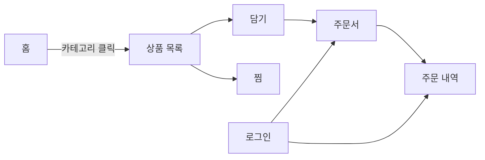
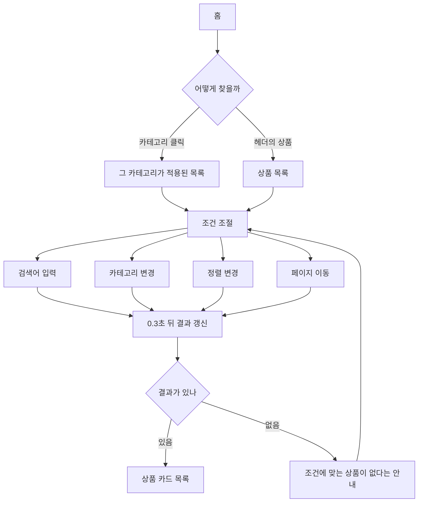
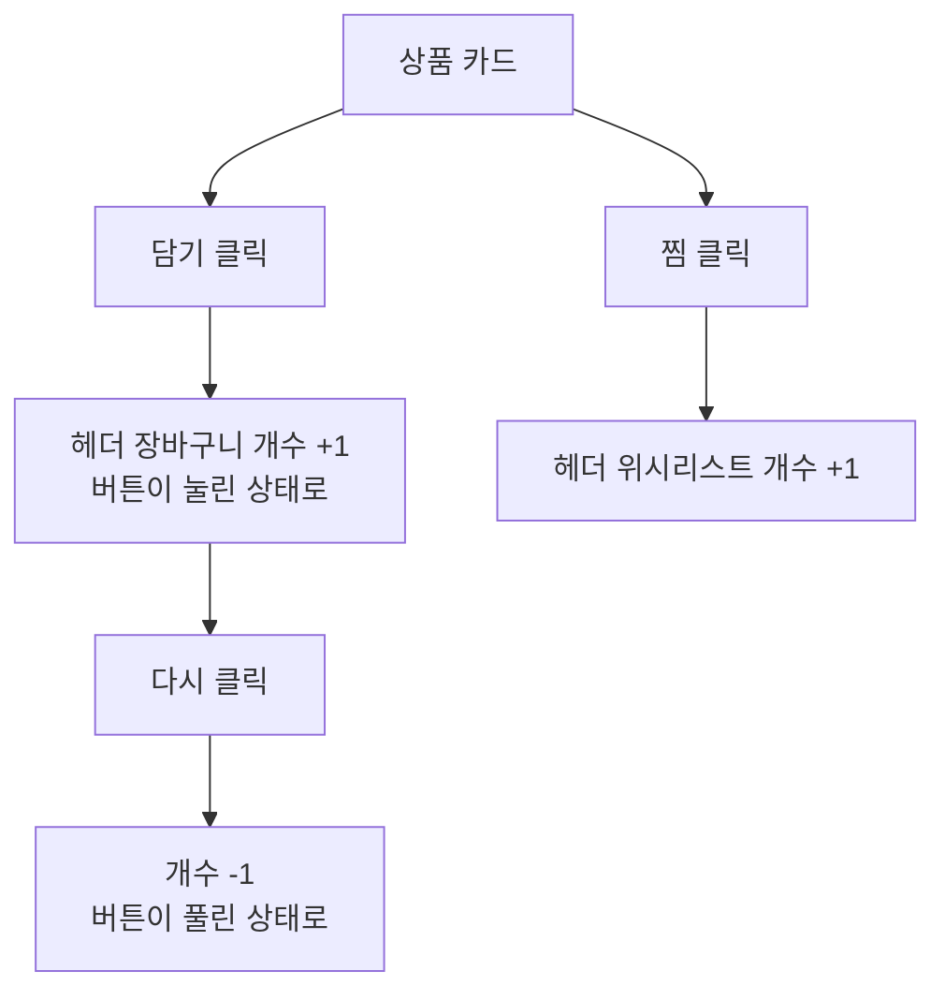
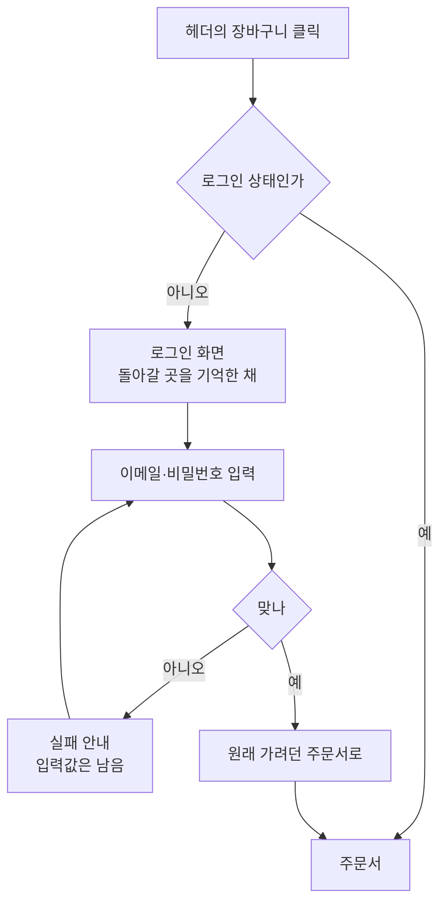
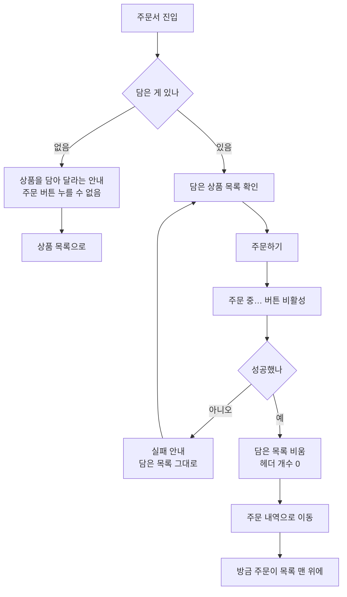
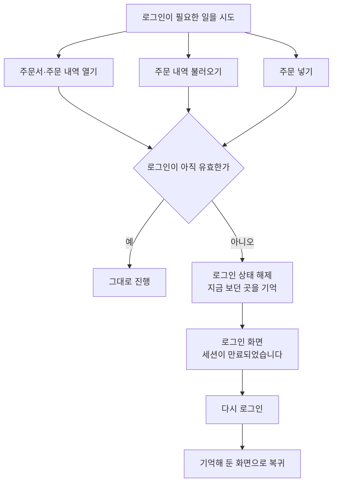
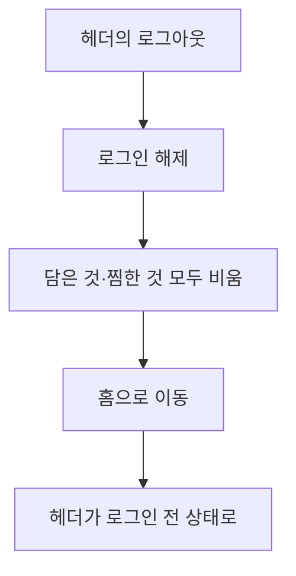

# 사용자 플로우

사용자가 이 서비스에서 무엇을 보고, 무엇을 누르고, 그다음 어디로 가는지를 정리했다.

규칙의 정의는 `docs/rfc/week09-service-policy.md`에 있고, 여기서는 **순서**를 다룬다.

---

## 1. 전체 지도

주된 길은 상품 목록에서 담고, 주문서를 거쳐 주문 내역으로 끝난다. 로그인은 그 길 중간에 **필요할 때만** 끼어든다.

**찜은 주문으로 이어지지 않는다.** 주문 대상은 담은 것뿐이고, 찜은 나중에 다시 보려고 표시해 두는 것이다.

---

## 2. 상품을 찾는 흐름

**조건을 바꾸는 동안 목록이 사라지지 않는다.** 이전 결과를 그대로 두고 갱신 중임을 표시한다. 화면이 비었다가 다시 차면 어디를 보고 있었는지 잃는다.

**조건은 모두 주소에 남는다.** 그래서 이런 일이 가능하다.

| 사용자가 하는 일   | 결과                         |
| ------------------ | ---------------------------- |
| 주소를 복사해 보냄 | 상대도 같은 조건의 화면을 봄 |
| 새로고침           | 조건 유지                    |
| 뒤로 가기          | 직전 조건으로                |
| 앞으로 가기        | 다시 그 조건으로             |

조건을 여러 번 바꿔도 마지막에 고른 조건과 화면에 보이는 결과가 어긋나지 않는다.

---

## 3. 담기와 찜

- 로그인하지 않아도 담을 수 있다.
- 담은 결과는 **지금 쓰는 탭에서만** 유지된다. 탭을 닫으면 사라진다.
- 같은 상품을 여러 번 담아도 1개다. 수량 개념이 없다.

---

## 4. 로그인이 필요해지는 순간

담기까지는 로그인이 필요 없다. **주문서로 넘어가려 할 때** 처음 요구된다.

**핵심은 마지막 단계다.** 로그인한 뒤 홈으로 보내지 않고, 가려던 곳으로 그대로 데려간다. 조건이 붙은 주소였다면 그 조건까지 유지한다.

로그인 화면으로 넘어가도 담아둔 것은 그대로 남는다.

---

## 5. 주문하기

주문서에서 하는 일은 확인뿐이다. 배송지·결제·수량 조절 단계는 없다.

성공하면 담은 목록을 비운다. 비우지 않으면 주문서에 다시 들어갔을 때 같은 상품이 그대로 있어 **같은 주문을 또 넣게 된다.** 찜한 것은 건드리지 않는다.

실패하면 담은 목록을 그대로 두어 다시 시도할 수 있게 한다.

---

## 6. 로그인이 풀렸을 때

로그인은 한 시간 뒤에 풀린다. 화면이 저절로 바뀌지는 않고, **로그인이 필요한 일을 하려는 순간**에 알게 된다.

로그인이 유효하지 않다고 판단하는 경우는 시간이 지난 것뿐만이 아니다. 로그인 정보가 손상되었거나 누군가 고쳐 넣은 경우도 같은 흐름을 탄다. 사용자 입장에서는 셋 다 "다시 로그인해야 한다"로 같다.

**처음 로그인하는 사람과 안내가 다르다.**

| 상황                       | 안내                                           |
| -------------------------- | ---------------------------------------------- |
| 아직 로그인한 적 없음      | 안내 없이 로그인 화면만                        |
| 로그인했었는데 시간이 지남 | "세션이 만료되었습니다. 다시 로그인해 주세요." |

전자는 그냥 로그인하면 되고, 후자는 "내가 뭘 잘못한 게 아니라 시간이 지난 것"임을 알아야 한다.

---

## 7. 로그아웃

담은 것과 찜한 것을 함께 비운다. 한 대의 기기를 여러 사람이 쓸 수 있고, 이전 사람의 관심사가 다음 사람에게 보이면 안 된다.

주문 내역을 보다가 로그아웃하면 그 화면에 머물지 않고 홈으로 나온다.

**로그아웃에 실패하면 아무것도 바뀌지 않는다.** 로그인 상태와 담은 목록이 그대로 남고 다시 시도할 수 있다. 화면만 로그아웃된 것처럼 보이면 사용자는 나갔다고 믿지만 실제로는 나가지 않은 상태가 된다.

---

## 8. 화면별 상태

### 헤더 (모든 화면)

| 상태      | 보이는 것                                                              |
| --------- | ---------------------------------------------------------------------- |
| 로그인 전 | 상품 · 위시리스트 N · 장바구니 N · **로그인**                          |
| 로그인 후 | 상품 · 위시리스트 N · 장바구니 N · **주문 내역 · {이름}님 · 로그아웃** |

화면이 뜨는 첫 순간부터 정확한 상태를 보여준다. 로그인했는데 "로그인" 버튼이 잠깐 보였다 바뀌는 일은 없다.

### 상품 목록

| 상태               | 화면                                   |
| ------------------ | -------------------------------------- |
| 처음 불러오는 중   | 실제 목록과 같은 크기의 자리 표시      |
| 조건 바꿔 갱신 중  | 이전 목록 유지 + 갱신 중 표시          |
| 결과 있음          | 상품 카드와 총 개수                    |
| 결과 없음          | 조건에 맞는 상품이 없다는 안내         |
| 처음 불러오기 실패 | 실패 안내 + 다시 시도                  |
| 갱신 실패          | 이전 목록 유지 + 갱신 실패만 따로 알림 |

### 주문서

| 상태         | 화면                                |
| ------------ | ----------------------------------- |
| 담은 게 있음 | 상품 목록 + 주문하기                |
| 담은 게 없음 | 담아 달라는 안내 + 주문 버튼 비활성 |
| 주문 중      | "주문 중…" 버튼 비활성              |
| 주문 실패    | 실패 안내 + 담은 목록 유지          |

### 주문 내역

| 상태      | 화면                                     |
| --------- | ---------------------------------------- |
| 주문 있음 | 총 N건 + 표(주문번호·상품·수량·주문일시) |
| 주문 없음 | 상품을 둘러보라는 안내                   |
| 조회 실패 | 실패 안내 + 다시 시도                    |

---

## 9. 예외 상황

| 사용자가 겪는 일                             | 결과                                                     |
| -------------------------------------------- | -------------------------------------------------------- |
| 비밀번호를 틀림                              | 로그인 화면에 실패 안내. 입력값 유지                     |
| 로그인 요청이 느림                           | 버튼이 "로그인 중…"으로 바뀌고 다시 눌리지 않음          |
| 조건을 빠르게 여러 번 바꿈                   | 마지막 조건의 결과만 남음. 늦게 온 이전 결과가 덮지 않음 |
| 결과보다 큰 페이지 번호로 들어옴             | 1쪽으로                                                  |
| 주소에 없는 카테고리·정렬을 넣음             | 조건에 맞지 않다는 안내                                  |
| 로그인 후 돌아갈 곳에 외부 주소를 넣음       | 무시하고 홈으로                                          |
| 로그인한 채로 로그인 화면에 들어옴           | 로그인 화면이 그대로 보임                                |
| 로그인 정보가 손상된 채로 보호 화면에 들어옴 | 오류 화면이 아니라 로그인 화면. 다시 로그인하라는 안내   |
| 담은 상품이 없는 채로 주문서에 들어옴        | 주문 버튼 비활성 + 담으러 가는 안내                      |
