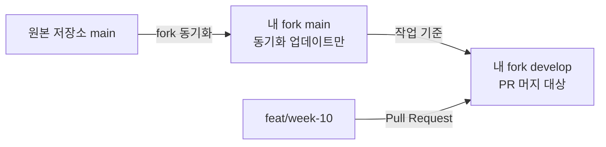

# Week 10 CI 측정과 개선 기록

## 요약

| 항목             | 결과                                                                                    | 배치/판단          | 근거                                  |
| ---------------- | --------------------------------------------------------------------------------------- | ------------------ | ------------------------------------- |
| CI 시간          | 느린 브라우저 job 2분 24초 → 1분 42초(−42초). workflow 전체는 사전 기준(30초 단축) 미달 | 구조 개선, 미확정  | [Before](#before) · [After](#after)   |
| 캐시             | hit 2초 vs miss 6~7초 — install이 병목 아님                                             | 추가 분리 보류     | [캐시](#캐시)                         |
| 번들 예산        | 현재 273.79 kB, 임계값 287.4 kB(여유폭 5%). PR #21에서 초과 확인                        | **경고**(advisory) | [번들 예산](#번들-예산)               |
| 환경 변수 게이트 | 누락·형식 오류·`NEXT_PUBLIC_` 노출을 build 전 차단. PR #20에서 실제 차단 확인           | **차단**(required) | [환경 변수 게이트](#환경-변수-게이트) |
| AI 리뷰          | PR #12 diff 리뷰 — P2 4건·P4 1건, 1건 채택·1건 기각(오탐 아님)·오탐 0건                 | 채택·기각은 작성자 | [AI 리뷰](#ai-리뷰)                   |
| 규칙 승격        | 6주차부터 반복된 Public API 미소비 export 지적을 기계 검사로 승격                       | `pnpm lint`에 연결 | [규칙 승격](#규칙-승격)               |
| required 배치    | 환경 변수는 차단, 번들은 경고 — 되돌리기 비용 차이가 근거                               | 작성자 판단        | [required 배치](#required-배치)       |

## 관련 문서

| 문서                                                              | 내용                                                 |
| ----------------------------------------------------------------- | ---------------------------------------------------- |
| [과제 명세](../assignments/week-10.md)                            | 10주차 과제 원문                                     |
| [진행 체크리스트](../week-10/checklist.md)                        | 필수·선택·과제 밖 범위 체크리스트                    |
| [10주 기술 회고](./week10-retrospective.md)                       | 제출 질문 답변을 포함한 최종 회고                    |
| [판단 이력(action plan)](../week-10/action-plan.html)             | 질의응답에서 바뀐 판단과 근거를 단계별로 기록한 이력 |
| [Self Review 결과](../week-10/self-review-result.md)              | 제출 전 자가 점검 결과                               |
| [Before 측정 가이드](../week-10/before-measurement.html)          | cold/warm 3회 측정 절차와 확인 항목                  |
| [After 측정 가이드](../week-10/after-measurement.html)            | 개선 후보 A/B/C 정의와 After 측정 절차               |
| [번들 예산 게이트 근거](../week-10/budget-gate.html)              | 임계값 산출 과정 상세                                |
| [E2E 조건부 실행 판정](../week-10/e2e-conditional-execution.html) | 감지 실패·step 실패 분리 검증 상세 로그              |

## 목차

- [측정 조건](#측정-조건)
  - [현재 workflow와 명령 대조](#현재-workflow와-명령-대조)
  - [Week 09 참고 실행](#week-09-참고-실행)
- [Before](#before)
  - [측정 전 준비](#측정-전-준비)
  - [기준 workflow 변경 이력](#기준-workflow-변경-이력)
  - [측정 기록](#측정-기록)
  - [병목 판단](#병목-판단)
- [After](#after)
  - [Cold](#cold-1)
  - [Warm](#warm-1)
  - [Before와 비교](#before와-비교)
- [캐시](#캐시)
- [실행 조건](#실행-조건)
  - [브랜치 흐름과 PR 대상](#브랜치-흐름과-pr-대상)
  - [Quality 조건 분리 보류 근거](#quality-조건-분리-보류-근거)
  - [감지 실패와 step 실패의 분리 검증](#감지-실패와-step-실패의-분리-검증)
  - [관찰된 flaky 사례](#관찰된-flaky-사례)
  - [flaky 대응 정책](#flaky-대응-정책)
- [예산](#예산)
  - [번들 예산](#번들-예산)
  - [환경 변수 게이트](#환경-변수-게이트)
  - [required 배치](#required-배치)
  - [결과 가시성](#결과-가시성)
- [AI 리뷰](#ai-리뷰)
  - [리뷰 기준과 프롬프트](#리뷰-기준과-프롬프트)
  - [판별 기록](#판별-기록)
  - [실제 리뷰 프롬프트와 실행 증거](#실제-리뷰-프롬프트와-실행-증거)
  - [작성자의 판별 기록](#작성자의-판별-기록)
- [규칙 승격](#규칙-승격)
  - [승격 결과](#승격-결과)
- [질문 답변](#질문-답변)
  - [AI와 작성자의 역할](#ai와-작성자의-역할)

## 측정 조건

### 현재 workflow와 명령 대조

#### Quality

`.github/workflows/quality.yml`은 검증을 네 step으로 나눠 실행한다. 실제 실행 순서는 다음과 같다.

```text
pnpm test → pnpm lint → pnpm typecheck → pnpm build
```

각 검증을 별도 step으로 두어 test, lint, typecheck와 build 시간을 따로 기록한다. Quality에는
Playwright 브라우저 설치를 두지 않는다.

```yaml
- name: Run unit tests
  run: pnpm test

- name: Run lint
  run: pnpm lint

- name: Run typecheck
  run: pnpm typecheck

- name: Run production build
  run: pnpm build
```

검증 항목을 줄인 것이 아니라 각 구간의 시간을 확인하기 위한 분리다. 이 구조를 Before 기준으로
고정하고 After도 같은 구조에서 측정한다.

#### E2E

`.github/workflows/e2e.yml`은 Chromium과 WebKit을 matrix job으로 나눠 각 브라우저에서 설치,
production build와 Playwright 테스트를 독립적으로 실행한다.

```text
matrix.browser = chromium | webkit
pnpm exec playwright install --with-deps ${{ matrix.browser }}
pnpm build
pnpm exec playwright test --project=${{ matrix.browser }}
```

E2E는 실제 Chromium과 WebKit을 사용하므로 브라우저 설치가 필요하다. Quality와 달리 E2E의
브라우저 설치 step은 사용되지 않는 준비 작업으로 볼 수 없다.

> 위 명령은 **Before/After 측정에 사용한 기준 구조**다. 측정을 끝낸 뒤 브라우저별 의존성 설치
> 비용이 다르다는 것을 확인해 Chromium은 `--with-deps` 없이 설치하고 WebKit은 공식 이미지를
> 컨테이너로 쓰도록 나눴다. 이 문서의 Before/After 수치는 모두 위 기준 구조에서 잰 값이며,
> 변경 근거와 실측은 [`ci-investigation-notes.md`](../week-10/ci-investigation-notes.md)의
> 「추가 확인 (2026-09-11)」에 있다. 변경 후 수치는 캐시가 채워진 실행을 확인한 뒤 갱신한다.

### Week 09 참고 실행

#### 참고 실행의 조건

| 항목                          | 값                                         |
| ----------------------------- | ------------------------------------------ |
| 대상                          | Week 09 PR #181                            |
| 실행 결과                     | 성공                                       |
| 러너                          | `ubuntu-latest`                            |
| GitHub Actions runner         | `2.337.0`                                  |
| 운영체제                      | Ubuntu 24.04.4 LTS                         |
| Runner Image                  | `ubuntu-24.04`                             |
| Runner Image 버전             | `20260831.293.1`                           |
| Hosted Compute Agent 버전     | `20260828.587`                             |
| Quality Azure Region          | `northcentralus`                           |
| E2E Azure Region              | `centralus`                                |
| `GITHUB_TOKEN` 권한           | `contents: read`, `metadata: read`         |
| Secret source                 | `None`                                     |
| Quality pnpm dependency cache | warm, 복원 성공                            |
| Quality Next.js build cache   | 없음                                       |
| E2E pnpm dependency cache     | warm, 복원 성공                            |
| E2E Next.js build cache       | 없음                                       |
| 분류                          | Before 반복 측정에 포함하지 않는 참고 실행 |

Quality와 E2E는 runner, OS, Runner Image와 이미지 버전이 같았다. 서로 다른 VM에서 실행되므로
Worker ID는 달랐고 Azure Region도 달랐다. 따라서 같은 `ubuntu-latest` 조건이어도 물리적 실행
환경과 네트워크 조건이 완전히 같다고 볼 수는 없으며, 한 번의 시간 차이만으로 개선 효과를 확정하지
않는다.

두 실행 모두 같은 pnpm cache key의 약 197MB store를 복원했다. Quality의 `Set up Node.js`는
10초, E2E는 9초였고 `Install dependencies`는 둘 다 2초였다. 두 실행 모두 pnpm cache 기준
warm이지만 변경 전 Week 09 참고 실행이므로 새 기준 workflow의 Before 3회에는 포함하지 않는다.

#### Quality 상세 시간

| 범위                                  |     시간 |
| ------------------------------------- | -------: |
| Quality workflow 전체                 | 1분 23초 |
| quality job                           | 1분 18초 |
| Set up job                            |      1초 |
| Checkout                              |      1초 |
| Set up pnpm                           |      3초 |
| Set up Node.js                        |     10초 |
| Install dependencies                  |      2초 |
| Install Playwright Chromium when used |     24초 |
| Run quality checks                    |     33초 |
| Post Set up Node.js                   |      0초 |
| Post Set up pnpm                      |      1초 |
| Post Checkout                         |      0초 |
| Complete job                          |      0초 |

`Run quality checks` 로그에서 추가로 확인한 값은 다음과 같다.

| 내부 명령 또는 출력 구간 | 확인한 시간 | 측정 범위                            |
| ------------------------ | ----------: | ------------------------------------ |
| `vitest run`             |      9.66초 | Vitest가 출력한 전체 test duration   |
| Next.js compile          |       3.7초 | build 내부 compile 구간              |
| Next.js TypeScript       |       3.8초 | build 내부 TypeScript 구간           |
| 17개 static page 생성    |       211ms | build 내부 page 생성 구간            |
| `pnpm lint`              |   구분 불가 | 시작 로그만 있고 전체 종료 시간 없음 |
| `pnpm typecheck`         |   구분 불가 | 시작 로그만 있고 전체 종료 시간 없음 |
| `pnpm build` 전체        |   구분 불가 | 일부 내부 구간만 출력됨              |

따라서 이 로그만으로 test, lint, typecheck와 build 네 명령의 정확한 개별 wall-clock을 모두 구할 수는
없다. 네 명령을 GitHub Actions의 별도 step으로 나누면 각 step의 시간을 같은 형식으로 확인할 수
있다.

테스트는 29개 파일의 164개 테스트가 모두 통과했다. Zustand persist storage 관련 메시지가
`stderr`에 반복됐지만 테스트 실패로 이어지지는 않았다. build 로그에는 E2E와 마찬가지로
`No build cache found`가 출력됐다.

Quality의 `Set up Node.js` 로그에서도 E2E와 같은 pnpm cache key, 약 197MB cache,
`Cache restored successfully`를 확인했다. 따라서 Quality 역시 pnpm dependency cache 기준
warm이고 Next.js build cache는 없는 실행이다.

#### 확인한 사실

이 실행에서 Chromium 설치에는 24초가 걸렸고, `pnpm check`는 Playwright E2E를 실행하지 않았다.
따라서 Quality의 Chromium 설치는 실제 Quality 검증에 사용되지 않는다. 반면 test, lint,
typecheck와 build는 과제에서 유지해야 하는 검증이다.

#### 개선 가설

Quality에서 Chromium 설치 step만 제거하면 필요한 검증을 유지하면서 quality job과 workflow 전체
시간이 줄어들 것으로 예상한다. 다만 24초는 한 번의 실행에서 관찰한 설치 시간이지 확정된 단축량은
아니다. 실제 감소 폭은 같은 조건의 Before/After cold·warm 반복 측정으로 확인한다.

#### E2E 참고 시간

| 범위                        |     시간 |
| --------------------------- | -------: |
| E2E workflow 전체           | 2분 30초 |
| e2e job                     | 2분 26초 |
| Set up job                  |      1초 |
| Checkout                    |      2초 |
| Set up pnpm                 |      3초 |
| Set up Node.js              |      9초 |
| Install dependencies        |      2초 |
| Install Playwright browsers |     47초 |
| Run E2E tests               | 1분 19초 |
| Post Set up Node.js         |      0초 |
| Post Set up pnpm            |      1초 |
| Post Checkout               |      0초 |
| Complete job                |      0초 |

E2E의 step별 시간은 확인했다. `Run E2E tests` 로그에서 production build 후 Chromium과 WebKit의
30개 테스트를 4 workers로 실행했고, 모두 통과했다. Playwright가 출력한 테스트 시간은
1.2분이었다.

build 로그에서는 다음 시간을 확인했다.

| 구간                               |  시간 |
| ---------------------------------- | ----: |
| optimized production build compile | 3.5초 |
| TypeScript                         | 3.4초 |
| 17개 static page 생성              | 179ms |

다만 이 값만 더해 build 전체 wall-clock을 확정할 수는 없다. `Run E2E tests` 1분 19초는 shell에서
측정한 전체 step 시간이고, Playwright의 1.2분은 소수점 한 자리로 반올림된 테스트 시간이다.

`Set up Node.js` 로그에서는 다음 pnpm dependency cache 증거를 확인했다.

| 항목       | 값                                                                                           |
| ---------- | -------------------------------------------------------------------------------------------- |
| Node       | `.nvmrc`에서 해석한 `24.17.0`, Linux x64                                                     |
| cache key  | `node-cache-Linux-x64-pnpm-4a4700f92bc4c477613076faf7033fe016210cf5d6a9cb6fb03827e2819d41f9` |
| cache size | 약 197MB                                                                                     |
| 로그 출력  | `Cache hit for`, `Cache restored successfully`, `Cache restored from key`                    |

따라서 이 E2E 실행은 pnpm dependency cache 기준으로 warm이다. 반면 build 로그에는
`No build cache found`가 출력됐으므로 Next.js build cache는 없었다. 서로 다른 캐시이므로 이
실행을 모든 캐시가 warm 또는 cold였다고 한 단어로 묶지 않는다.

## Before

### 측정 전 준비

- [x] Quality의 test, lint, typecheck와 build를 각각 별도 step으로 나눈다
- [x] Quality와 E2E job에 `timeout-minutes: 10`을 추가한다
- [x] 네 검증이 기존 `pnpm check`와 동일하게 유지되는지 대조한다
- [x] 기준 커밋과 Actions run URL을 기록한다
- [x] cold와 warm을 만드는 방법과 캐시 복원 로그의 확인 위치를 정한다
- [x] workflow 전체, job, 주요 step 시간을 기록할 표를 준비한다

### 기준 workflow 변경 이력

- Quality에서 사용하지 않는 Chromium 설치 step을 제거했다.
- Quality의 `pnpm check`를 test, lint, typecheck와 build 네 step으로 나눴다.
- E2E의 `pnpm test:e2e`를 production build와 Playwright test 두 step으로 나눴다.
- Quality와 E2E job에 `timeout-minutes: 10`을 추가했다.
- `pnpm verify` 결과 29개 파일의 164개 테스트, lint와 typecheck가 통과했다.
- production build와 Playwright는 저장소의 런타임 검증 규칙에 따라 로컬에서 실행하지 않았다.
- warm과 cold 각 3회차의 Quality/E2E Actions run URL과 커밋 SHA,
  workflow/job/주요 step 시간과 캐시 로그를 모두 기록했다.

### 측정 기록

#### Cold

| 회차 | 커밋 / run URL                                                                                                                                                                                                                                                        |                   workflow 전체 |                             job | 주요 step                                                                                                                           | 캐시 증거                                                                                                                                    |
| ---- | --------------------------------------------------------------------------------------------------------------------------------------------------------------------------------------------------------------------------------------------------------------------- | ------------------------------: | ------------------------------: | ----------------------------------------------------------------------------------------------------------------------------------- | -------------------------------------------------------------------------------------------------------------------------------------------- |
| 1    | [Quality run](https://github.com/im-wen3y/loop-pack-fe-l2-vol1/actions/runs/34442468386)<br>[E2E run](https://github.com/im-wen3y/loop-pack-fe-l2-vol1/actions/runs/34442468432)<br>커밋 `b9e92f8ff29996cdb075c2afd36f66263512b1ba`                                   |     Quality 50초<br>E2E 2분 6초 |     Quality 47초<br>E2E 2분 3초 | Quality: install 5초, test 9초, lint 7초, typecheck 3초, build 7초<br>E2E: install 5초, browser 설치 44초, build 8초, E2E 48초      | Quality/E2E: `pnpm cache is not found`<br>E2E 후처리의 동일 키 저장은 Quality와의 동시 생성으로 충돌했으나 job은 성공                        |
| 2    | [Quality job](https://github.com/im-wen3y/loop-pack-fe-l2-vol1/actions/runs/34443757239/job/102763993670)<br>[E2E job](https://github.com/im-wen3y/loop-pack-fe-l2-vol1/actions/runs/34443757278/job/102763993821)<br>커밋 `de540b8d435b3c452f38a096d1396fd76662105e` | Quality 1분 6초<br>E2E 2분 49초 | Quality 1분 3초<br>E2E 2분 46초 | Quality: install 6초, test 12초, lint 9초, typecheck 4초, build 10초<br>E2E: install 6초, browser 설치 1분 7초, build 8초, E2E 57초 | Quality/E2E: `pnpm cache is not found`, Next build cache miss<br>Quality가 동일 pnpm 키 저장, E2E 저장은 동시 생성으로 충돌했으나 job은 성공 |
| 3    | [Quality job](https://github.com/im-wen3y/loop-pack-fe-l2-vol1/actions/runs/34444582676/job/102766498626)<br>[E2E job](https://github.com/im-wen3y/loop-pack-fe-l2-vol1/actions/runs/34444582659/job/102766498665)<br>커밋 `6511cdc91550e1a9045b1879ee8e9174d62f55de` |    Quality 57초<br>E2E 2분 38초 |    Quality 53초<br>E2E 2분 27초 | Quality: install 6초, test 8초, lint 8초, typecheck 2초, build 8초<br>E2E: install 5초, browser 설치 52초, build 8초, E2E 1분 10초  | Quality/E2E: `pnpm cache is not found`, Next build cache miss<br>Quality가 동일 pnpm 키 저장, E2E 저장은 동시 생성으로 충돌했으나 job은 성공 |

- Quality workflow 중앙값: 57초, 범위 50초~1분 6초
- Quality job 중앙값: 53초, 범위 47초~1분 3초
- E2E workflow 중앙값: 2분 38초, 범위 2분 6초~2분 49초
- E2E job 중앙값: 2분 27초, 범위 2분 3초~2분 46초

#### Warm

| 회차 | 커밋 / run URL                                                                                                                                                                                                                                                        |                workflow 전체 |                          job | 주요 step                                                                                                   | 캐시 증거                                                                                                                                |
| ---- | --------------------------------------------------------------------------------------------------------------------------------------------------------------------------------------------------------------------------------------------------------------------- | ---------------------------: | ---------------------------: | ----------------------------------------------------------------------------------------------------------- | ---------------------------------------------------------------------------------------------------------------------------------------- |
| 1    | [Quality job](https://github.com/im-wen3y/loop-pack-fe-l2-vol1/actions/runs/34388626221/job/102591140674)<br>[E2E job](https://github.com/im-wen3y/loop-pack-fe-l2-vol1/actions/runs/34388626456/job/102591141913)<br>커밋 `1c4d8e2ac4169022285e56f944ce492b42bc7625` |  Quality 57초<br>E2E 3분 4초 | Quality 54초<br>E2E 2분 24초 | Quality: test 11초, lint 10초, typecheck 3초, build 11초<br>E2E: browser 설치 51초, build 12초, E2E 57초    | pnpm cache hit/restored<br>key: `node-cache-Linux-x64-pnpm-4a4700f92bc4c477613076faf7033fe016210cf5d6a9cb6fb03827e2819d41f9`<br>약 197MB |
| 2    | [Quality job](https://github.com/im-wen3y/loop-pack-fe-l2-vol1/actions/runs/34389832684/job/102595119971)<br>[E2E run](https://github.com/im-wen3y/loop-pack-fe-l2-vol1/actions/runs/34389832675)<br>커밋 `c4192a458aa3e9dfa187eec53bbca1763211645f`                  | Quality 55초<br>E2E 2분 33초 | Quality 53초<br>E2E 2분 30초 | Quality: test 11초, lint 10초, typecheck 3초, build 11초<br>E2E: browser 설치 57초, build 10초, E2E 1분 5초 | pnpm cache hit/restored<br>key: `node-cache-Linux-x64-pnpm-4a4700f92bc4c477613076faf7033fe016210cf5d6a9cb6fb03827e2819d41f9`<br>약 197MB |
| 3    | [Quality run](https://github.com/im-wen3y/loop-pack-fe-l2-vol1/actions/runs/34390806195)<br>[E2E run](https://github.com/im-wen3y/loop-pack-fe-l2-vol1/actions/runs/34390806199)<br>커밋 `8a6c4a6658176e4487cbe4eb1a4dc0cbd638d7db`                                   | Quality 53초<br>E2E 2분 10초 |  Quality 50초<br>E2E 2분 7초 | Quality: test 9초, lint 8초, typecheck 3초, build 9초<br>E2E: browser 설치 46초, build 8초, E2E 53초        | Quality/E2E: pnpm cache hit/restored, key 동일, 약 197MB                                                                                 |

- 원본 값: Quality/E2E warm 3회 모두 기록 완료
- Quality workflow 중앙값: 55초, 범위 53~57초
- Quality job 중앙값: 53초, 범위 50~54초
- E2E workflow 중앙값: 2분 33초, 범위 2분 10초~3분 4초
- E2E job 중앙값: 2분 24초, 범위 2분 7초~2분 30초
- 러너: Quality `eastus`, E2E `westcentralus`; 둘 다 Ubuntu 24.04.4 / `ubuntu-24.04` / image `20260831.293.1`

### 병목 판단

Before 반복 측정에서 가장 긴 구간은 E2E의 `Run E2E tests`였다. 중앙값은 warm 57초,
cold 57초이며, 다음으로 긴 `Install Playwright browsers`는 warm 51초, cold 52초였다.
pnpm 캐시 유무에 따른 install 시간 차이는 작았으며, Next build cache는 cold 3회 모두 miss였다.
개선 전 측정이므로 실제 단축량은 After 측정 전까지 확정하지 않는다.

## After

개선 적용 후 Before와 같은 검증 항목, 러너, Node 버전과 cold/warm 조건에서 각각 3회 측정한다.
Warm과 cold 모두 3회 측정을 완료했다. cold 2회차의 첫 시도는 캐시가 복원되어 집계에서 제외하고
재측정했다. 각 회차의 캐시 상태는 `Set up Node.js` 로그와 install 시간으로 확인했다.

### Cold

| 회차 | 커밋 / run URL                                                                                                                                                                                                                      |                         workflow 전체 |                                                              job | 주요 step                                                                                                                                                                                                      | 캐시 증거                                                                                              |
| ---- | ----------------------------------------------------------------------------------------------------------------------------------------------------------------------------------------------------------------------------------- | ------------------------------------: | ---------------------------------------------------------------: | -------------------------------------------------------------------------------------------------------------------------------------------------------------------------------------------------------------- | ------------------------------------------------------------------------------------------------------ |
| 1    | [Quality run](https://github.com/im-wen3y/loop-pack-fe-l2-vol1/actions/runs/34460080571)<br>[E2E run](https://github.com/im-wen3y/loop-pack-fe-l2-vol1/actions/runs/34460080641)<br>커밋 `99ce7b9f81885ea0c6e249c3e6e991c41e26794e` |          Quality 58초<br>E2E 1분 57초 |             Quality 53초<br>Chromium 1분 39초<br>WebKit 1분 53초 | Quality: install 7초, test 9초, lint 7초, typecheck 3초, build 8초<br>E2E Chromium: install 4초, browser 설치 45초, build 7초, E2E 23초<br>E2E WebKit: install 6초, browser 설치 30초, build 8초, E2E 56초     | `pnpm cache is not found` · Quality install 7초(warm 2초 대비 미복원)                                  |
| 2    | [Quality run](https://github.com/im-wen3y/loop-pack-fe-l2-vol1/actions/runs/34461266607)<br>[E2E run](https://github.com/im-wen3y/loop-pack-fe-l2-vol1/actions/runs/34461266531)<br>커밋 `e3cd5e23a1f7846bab48643490f98a6fc1bce44e` | Quality 약 1분 9초<br>E2E 약 3분 31초 | Quality 약 1분 5초<br>Chromium 약 1분 16초<br>WebKit 약 1분 38초 | Quality: install 6초, test 11초, lint 10초, typecheck 4초, build 9초<br>E2E Chromium: install 2초, browser 설치 22초, build 9초, E2E 25초<br>E2E WebKit: install 5초, browser 설치 33초, build 9초, E2E 37초   | `pnpm cache is not found` · Quality install 6초. E2E workflow는 Chromium job 대기로 전체 시간이 늘어남 |
| 3    | [Quality run](https://github.com/im-wen3y/loop-pack-fe-l2-vol1/actions/runs/34461971077)<br>[E2E run](https://github.com/im-wen3y/loop-pack-fe-l2-vol1/actions/runs/34461971079)<br>커밋 `33737f611b6e53b7ad15b4b49460450896ca6c23` |       Quality 1분 9초<br>E2E 2분 20초 |          Quality 1분 6초<br>Chromium 1분 18초<br>WebKit 1분 42초 | Quality: install 6초, test 11초, lint 10초, typecheck 3초, build 10초<br>E2E Chromium: install 6초, browser 설치 27초, build 8초, E2E 21초<br>E2E WebKit: install 5초, browser 설치 30초, build 10초, E2E 40초 | `pnpm cache is not found` · Quality install 6초                                                        |

- Quality workflow 중앙값: 1분 9초, 범위 58초~1분 9초
- Quality job 중앙값: 1분 5초, 범위 53초~1분 6초
- E2E workflow 중앙값: 2분 20초, 범위 1분 57초~3분 31초
- E2E job 중앙값(느린 브라우저): 1분 42초, 범위 1분 38초~1분 53초

### Warm

| 회차 | 커밋 / run URL                                                                                                                                                                                                                      |                   workflow 전체 |                                                     job | 주요 step                                                                                                                                                                                                      | 캐시 증거                                       |
| ---- | ----------------------------------------------------------------------------------------------------------------------------------------------------------------------------------------------------------------------------------- | ------------------------------: | ------------------------------------------------------: | -------------------------------------------------------------------------------------------------------------------------------------------------------------------------------------------------------------- | ----------------------------------------------- |
| 1    | [Quality run](https://github.com/im-wen3y/loop-pack-fe-l2-vol1/actions/runs/34456469894)<br>[E2E run](https://github.com/im-wen3y/loop-pack-fe-l2-vol1/actions/runs/34456469924)<br>커밋 `a9129272f963b1af19978e6ba2cf9d0f39375e4c` | Quality 1분 6초<br>E2E 1분 46초 | Quality 1분 3초<br>Chromium 1분 37초<br>WebKit 1분 44초 | Quality: install 2초, test 12초, lint 10초, typecheck 3초, build 10초<br>E2E Chromium: install 2초, browser 설치 38초, build 9초, E2E 24초<br>E2E WebKit: install 2초, browser 설치 35초, build 10초, E2E 39초 | `Cache restored from key` · Quality install 2초 |
| 2    | [Quality run](https://github.com/im-wen3y/loop-pack-fe-l2-vol1/actions/runs/34456907155)<br>[E2E run](https://github.com/im-wen3y/loop-pack-fe-l2-vol1/actions/runs/34456907202)<br>커밋 `594a9e7c494faea86ad8a99f8d5c7a1f68030fbe` |    Quality 55초<br>E2E 1분 33초 |    Quality 52초<br>Chromium 1분 27초<br>WebKit 1분 24초 | Quality: install 2초, test 10초, lint 9초, typecheck 4초, build 10초<br>E2E Chromium: install 3초, browser 설치 38초, build 7초, E2E 21초<br>E2E WebKit: install 2초, browser 설치 34초, build 6초, E2E 27초   | `Cache restored from key` · Quality install 2초 |
| 3    | [Quality run](https://github.com/im-wen3y/loop-pack-fe-l2-vol1/actions/runs/34458232736)<br>[E2E run](https://github.com/im-wen3y/loop-pack-fe-l2-vol1/actions/runs/34458232732)<br>커밋 `dac4d0e8aa87a3778a9bd23d0e60a2d9985241ed` |    Quality 57초<br>E2E 1분 54초 |    Quality 54초<br>Chromium 1분 21초<br>WebKit 1분 48초 | Quality: install 2초, test 11초, lint 9초, typecheck 4초, build 9초<br>E2E Chromium: install 2초, browser 설치 24초, build 10초, E2E 24초<br>E2E WebKit: install 2초, browser 설치 39초, build 10초, E2E 38초  | `Cache restored from key` · Quality install 2초 |

- Quality workflow 중앙값: 57초, 범위 55~1분 6초
- E2E workflow 중앙값: 1분 46초, 범위 1분 33초~1분 54초
- E2E job 중앙값(느린 브라우저): 1분 37초, 범위 1분 37초~1분 44초

### Before와 비교

개선 후보는 세 가지였다. 상세는 [After 측정 문서](../week-10/after-measurement.html)의 01절 참고.

| 후보   | 내용                                                           |
| ------ | -------------------------------------------------------------- |
| 후보 A | 브라우저별 E2E job 병렬화(Chromium·WebKit을 독립 job으로 분리) |
| 후보 B | `concurrency` 그룹(반복 push의 낭비 실행 취소)                 |
| 후보 C | pnpm store 캐시 추가                                           |

- Quality workflow 중앙값은 55초에서 1분 9초로 14초 늘었지만, Quality workflow는 후보 A 변경
  대상이 아니므로 후보 A의 영향으로 해석하지 않는다.
- E2E workflow 중앙값은 2분 33초에서 2분 20초로 13초 줄었다. 사전에 정한 30초 단축 기준에는
  미달해 PR 전체 wall-clock 성능 개선은 유의미하다고 확정하지 않는다.
- 느린 브라우저 job 중앙값은 2분 24초에서 1분 42초로 42초 줄었다. 이는 브라우저별 실행을
  분리한 구조적 효과지만, workflow 전체 시간 단축과 동일한 의미로 보지 않는다.
- 최종 결정: 후보 A는 Chromium·WebKit 실패를 독립적으로 확인하고 각각 required check로 보호할
  수 있어 유지한다. 후보 B concurrency도 반복 push의 오래된 실행을 줄이는 운영 안전장치로 유지한다.
- 후보 C pnpm store 캐시는 현재 install 시간이 짧고 추가 효과 근거가 부족해 보류한다.

## 캐시

| 항목                                       | 값                                                                                                                                                    |
| ------------------------------------------ | ----------------------------------------------------------------------------------------------------------------------------------------------------- |
| warm 실행의 캐시 복원 로그                 | 기존 After 3회에서 `Cache restored from key` 확인                                                                                                     |
| 의도적인 캐시 miss 로그                    | Quality와 WebKit에서 `pnpm cache is not found` 확인                                                                                                   |
| hit install 시간                           | Chromium 2초                                                                                                                                          |
| miss install 시간                          | Quality 7초, WebKit 6초                                                                                                                               |
| 캐시 키를 바꾸기 위해 사용한 lockfile 변경 | 실행 완료(커밋 `91cabde25d6fc3144146541b354639b9a1c217e6`)                                                                                            |
| 실험 Quality run                           | [run/34466947559](https://github.com/im-wen3y/loop-pack-fe-l2-vol1/actions/runs/34466947559)                                                          |
| 실험 E2E run                               | [run/34466947550](https://github.com/im-wen3y/loop-pack-fe-l2-vol1/actions/runs/34466947550)                                                          |
| 실험 후 lockfile 복구                      | 완료(커밋 `8fe73a0b182bfa45c387f2982c4a4394da3cc60e`). `git diff 91cabde2~1 HEAD -- pnpm-lock.yaml package.json`이 비어 있어 실험 전 상태와 동일하다. |

이번 실험은 matrix job이 동일한 새 cache key를 공유했다. 먼저 끝난 job이 캐시를 저장한 뒤
Chromium job이 시작되어 Chromium에서는 `Cache restored successfully`가 나타났다. 따라서 세 job
모두를 cold로 보지 않고, Quality·WebKit miss와 Chromium hit가 섞인 부분 cold 실험으로 분류한다.
matrix 전략 자체에는 cold를 강제하는 옵션이 없다. 브라우저별 key를 따로 만들거나 run ID를 key에
넣으면 miss를 만들 수 있지만, 이는 평소 캐시 공유·복원 동작과 다른 실험 조건이 된다. job을
순차화하고 매번 캐시를 삭제하는 방법도 있지만 병렬화의 전제가 사라지고 삭제 시점 경합이 생긴다.

캐시 hit/miss의 원본 로그와 install 시간을 함께 기록한다. miss는 frozen install이 실패하는 손상이
아니라 유효한 lockfile 변경으로 재현하고, 실험 변경은 측정 후 복구한다.

## 실행 조건

### 브랜치 흐름과 PR 대상

현재 fork의 `feat/week-10`에서 fork의 `develop`으로 PR을 올리고, `develop`을 통합 대상
브랜치로 사용한다. fork의 `main`은 원본 저장소와 동기화할 때만 업데이트한다. 이렇게 하면
작업 PR을 `main`에 직접 올릴 때 생길 수 있는 fork 브랜치 충돌을 피하면서, 실제 과제 변경은
`develop`에서 검증하고 머지할 수 있다.



| 항목           | 값                                                 |
| -------------- | -------------------------------------------------- |
| PR base        | `develop`                                          |
| `main`         | fork 동기화용 업데이트만 수행                      |
| 기능·문서 변경 | `feat/week-10` 등 작업 브랜치에서 `develop`으로 PR |

| 항목                                      | 내용                                                                                                                                                                                                                                                        |
| ----------------------------------------- | ----------------------------------------------------------------------------------------------------------------------------------------------------------------------------------------------------------------------------------------------------------- |
| 저비용 결정적 검증을 모든 PR에서 실행할지 | 현재 Quality workflow를 그대로 유지                                                                                                                                                                                                                         |
| E2E 실행 조건                             | 경로 기반 분류를 사용하며, 로직 변경 시 결제·주문 E2E를 항상 실행                                                                                                                                                                                           |
| 스킵할 변경 범위                          | 문서와 CSS만 변경된 PR                                                                                                                                                                                                                                      |
| 스킵이 안전한 이유                        | 문서·CSS-only는 브라우저 동작 로직을 변경하지 않는다는 경로 규칙                                                                                                                                                                                            |
| 조건에 걸려 E2E가 실행된 PR과 로그        | PR #12에서 `all=true`, Chromium/WebKit 각 15개 통과. PR #14(order 1개), #15(auth 계열 5개), #16(unknown 15개)에서 범위별 실행 확인                                                                                                                          |
| 조건에 걸리지 않아 E2E가 스킵된 PR과 로그 | [PR #13](https://github.com/im-wen3y/loop-pack-fe-l2-vol1/pull/13)(문서-only)에서 `scope result: all=false, run_e2e=false, tests=(skipped)`와 Checkout 이후 7개 step Skipped 확인. 두 browser job은 Success로 종료                                          |
| required check와 조건부 실행의 충돌       | `develop` 대상 `merge-required-ci` ruleset 설정 완료, PR #12 Merge box에서 네 check가 Required로 표시됨                                                                                                                                                     |
| flaky 대응 정책과 근거                    | CI에서만 재시도 2회를 켜고, 실패·flaky 실행의 Playwright trace를 아티팩트로 올린다. 재시도는 실패를 감추려는 것이 아니라 흔들림과 진짜 실패를 구분하려는 것이며, 최초 실패 로그와 trace가 남아야 그 구분이 가능하기 때문이다. 아래 「flaky 대응 정책」 참고 |

### Quality 조건 분리 보류 근거

최근 30개 커밋을 확인했다.

| 분류                           | 개수 | 비고                         |
| ------------------------------ | ---: | ---------------------------- |
| 전체 커밋                      |   30 |                              |
| CI 측정을 위한 empty commit    |   10 |                              |
| 실제 파일을 변경한 커밋        |   20 | 30 − empty 10                |
| ㄴ `docs/**`만 변경(문서-only) |   14 | 실제 파일 변경 커밋의 약 70% |
| ㄴ CSS-only                    |    0 |                              |

실제 파일을 변경한 20개 커밋 중 문서-only 커밋이 14개로 약 70%를 차지했다.

문서-only 변경이 많아 Quality를 조건부로 나누면 실행 시간을 줄일 여지는 있다. 그러나 별도
Format job을 만들면 포맷 검사보다 job 시작, checkout, Node·pnpm 준비 시간이 더 큰 비중을
차지할 수 있고 workflow와 required check 관리도 복잡해진다. 이번 단계에서는 Quality를 분리하지
않고 현재 검증을 유지한다. 문서·CSS 변경이 계속 누적되어 Quality 비용이 실제 병목으로 확인되면
그때 문서·스타일 포맷 검사와 전체 Quality를 분리한다.

E2E는 `paths-filter`로 변경 경로를 분류하는 방향을 선택했고 `.github/workflows/e2e.yml`에 반영했다.
로직 변경 시 Chromium과 WebKit에서
결제·주문 E2E를 공통 필수 검사로 실행하고, 인증·장바구니·위시리스트·상품 영역의 변경에는 해당
기능 E2E를 추가한다. 공통 로직이나 설정 변경은 전체 E2E를 실행한다. 이 정책의 실제 workflow
구현과 required 배치, 로직·설정 변경이 포함된 PR의 전체 실행 로그는 확인했다. 문서-only PR의
생략 로그도 [PR #13](https://github.com/im-wen3y/loop-pack-fe-l2-vol1/pull/13)에서 확보했다. flaky 정책은 아래에 정리했다.

### 감지 실패와 step 실패의 분리 검증

버리는 브랜치 두 개로 실패 경로를 확인했다. 두 PR은 머지하지 않는다.

| PR                                                              | 깨뜨린 지점                             | 결과                                                                                                    |
| --------------------------------------------------------------- | --------------------------------------- | ------------------------------------------------------------------------------------------------------- |
| [#17](https://github.com/im-wen3y/loop-pack-fe-l2-vol1/pull/17) | `Detect changed paths`의 `filters` YAML | `Detect E2E scope` failure → `E2E fallback:` 로그와 `all=true, run_e2e=true, tests=all`, 15개 전체 실행 |
| [#18](https://github.com/im-wen3y/loop-pack-fe-l2-vol1/pull/18) | `Checkout`의 존재하지 않는 `ref`        | `Checkout` failure → 이후 6개 step Skipped, 두 browser job이 각각 독립 Failure                          |

감지 실패는 전체 실행으로 복구되고, 실행 중간 실패는 후속 step을 중단시킨다. 두 동작이 서로를
덮어쓰지 않는다는 것을 실행 로그로 확인했다. 상세 로그와 판정 근거는
[E2E 조건부 실행 문서](../week-10/e2e-conditional-execution.html)의 04-C 절에 있다.

### 관찰된 flaky 사례

[PR #17](https://github.com/im-wen3y/loop-pack-fe-l2-vol1/pull/17)의 fallback 실행에서 Chromium만 15개 중 14개 통과로 끝났다.

```text
✘ [chromium] e2e/state-restoration.spec.ts:110
  debounce가 끝난 검색어는 뒤로·앞으로 이동에서 검색 결과와 함께 복원된다 (12.5s)
  Error: expect(locator).toBeVisible() failed
  > 118 | await expect(page.getByText('총 4개', { exact: true })).toBeVisible()
  Timeout: 10000ms · element(s) not found
```

같은 실행의 WebKit은 15개 모두 통과했고, 같은 spec이 PR #16에서는 두 브라우저 모두 통과했다.
같은 코드가 실행마다 다른 결과를 냈으므로 flaky 신호로 분류한다. workflow 수정과는 무관하며
fallback은 의도대로 전체 실행을 트리거했다.

이 실패를 조사하면서 원인을 사후에 확인할 수 없다는 문제가 함께 드러났다. `trace`는
`retain-on-failure`로 만들어지지만 job이 끝나면 사라졌고, `retries`도 설정되어 있지 않았다.
흔들림과 진짜 실패를 구분할 재료가 하나도 남지 않는 상태였다.

### flaky 대응 정책

먼저 재료를 남기고, 실패 메시지가 원인을 말하게 한 뒤, 마지막에 재시도를 켰다. 재료가 없는
상태에서 재시도부터 켜면 실패를 구분하는 것이 아니라 감추는 쪽이 되기 때문이다.

1. **증거 보존** — 테스트가 실행된 job은 `test-results/`를 아티팩트로 올린다(보관 7일).
   조건은 `steps.e2e.conclusion != 'skipped'`다. 전부 통과하면 `retain-on-failure`가 trace를
   지워 디렉터리가 비므로 `if-no-files-found: ignore`로 아티팩트를 만들지 않는다.
2. **실패 메시지** — 상품 목록은 갱신 실패 시 이전 결과를 유지하고 배너만 띄우므로, 개수 단언이
   "로딩 중"과 "갱신 실패"를 구분하지 못했다. `e2e/fixtures/product-list-assertions.ts`의
   `expectProductCount`가 배너 상태를 실패 메시지에 담는다.
3. **재시도** — `retries: process.env.CI ? 2 : 0`. 로컬은 0으로 두어 흔들림을 즉시 보고,
   CI에서만 2회 재시도한다. 재시도로 통과하면 Playwright가 `flaky`로 보고하고 최초 실패
   메시지도 리포트에 남는다.

반복 실패는 재시도로 덮지 않는다. 같은 spec이 계속 flaky로 남으면 trace를 근거로 원인을
고치거나 격리 여부를 판단한다.

#### 정책 자가 검증 — [PR #19](https://github.com/im-wen3y/loop-pack-fe-l2-vol1/pull/19)

`testInfo.retry === 0`일 때만 실패하는 테스트로 flaky를 결정적으로 재현했다. 두 브라우저 모두
같은 결과였다.

| 확인 항목          | 결과                                                                             |
| ------------------ | -------------------------------------------------------------------------------- |
| 재시도 동작        | 첫 시도 실패 → `retry #1` 통과 → `1 flaky` 표기, job은 성공                      |
| 아티팩트 업로드    | `playwright-chromium-attempt1`(2.42MB), `playwright-webkit-attempt1`(2.25MB)     |
| 첫 실패 trace 보존 | 아티팩트에 `trace.zip`(64 files)과 `error-context.md`가 있고 최초 실패 사유 포함 |

첫 시도에서는 업로드 조건을 `steps.e2e.conclusion == 'failure'`로 두어 아티팩트가 0개였다.
재시도로 통과한 flaky는 step이 `success`라 조건에 걸리지 않았고, 정작 필요한 첫 실패 trace가
버려졌다. 조건을 `!= 'skipped'`로 고친 뒤 위 결과를 얻었다. 정상 실패는 잡고 flaky만 놓치는
형태였으므로 실제 flaky가 날 때까지 드러나지 않았을 결함이다.

`retain-on-failure`는 재시도로 통과해도 첫 실패 시도의 trace를 지우지 않는다는 것도 함께
확인했다. `trace: 'on-first-retry'`로 바꿀 필요는 없다.

## 예산

### 번들 예산

| 항목                                | 값                                                                                                                                                                                                                                                                     |
| ----------------------------------- | ---------------------------------------------------------------------------------------------------------------------------------------------------------------------------------------------------------------------------------------------------------------------- |
| 도구                                | `size-limit@13.0.3` + `@size-limit/file@13.0.3`, 설정은 `.size-limit.json`                                                                                                                                                                                             |
| 대상                                | 전체 클라이언트 JS 번들(`.next/static/chunks/**/*.js`), gzip 기준                                                                                                                                                                                                      |
| 7주차 실제 전송 크기                | 홈 JS 약 177.0KB (After 총 2,603,503 B × 6.8%)                                                                                                                                                                                                                         |
| 현재 값                             | 홈 JS 179.5KB(CDP 실측), 전체 번들 **273.79 kB**(size-limit, Node 24.17.0)                                                                                                                                                                                             |
| 측정 편차                           | 같은 빌드 3회 0 B, 재빌드 3회 0 B. Node 22 → 24에서만 +47 B(+0.017%)                                                                                                                                                                                                   |
| 임계값과 여유폭                     | **287.4 kB**, 여유폭 5%                                                                                                                                                                                                                                                |
| 임계값 근거                         | 7주차 홈 177.0KB → 현재 홈 179.5KB(+1.4%)로 이어지고, gzip 개별합 174.7KB가 서버 실전송 179.5KB와 2.7% 안에서 대응해 단위가 맞는다. 편차가 0이라 여유폭은 노이즈 흡수분이 아니라 온전한 증가 허용분이다. 상세는 [예산 게이트 문서](../week-10/budget-gate.html)의 09절 |
| 예산 초과 PR의 빨간불               | PR #21에서 확인. `continue-on-error`라 `quality`는 pass로 남고 `::warning::` 주석과 PR 코멘트로 초과 3.79 kB가 표시됐다                                                                                                                                                |
| PR 화면의 측정값·한도·초과량 리포트 | PR 코멘트로 확인 완료                                                                                                                                                                                                                                                  |
| 수정 후 초록불 복구                 | 실험 브랜치를 되돌리면 복구된다. 기준 브랜치는 273.79 kB로 계속 통과 중                                                                                                                                                                                                |

### 환경 변수 게이트

| 항목                                 | 값                                                                        |
| ------------------------------------ | ------------------------------------------------------------------------- |
| 검증 스크립트                        | `scripts/validate-env.mjs`. 이 파일의 목록이 설정 계약이다                |
| 필수 환경 변수 목록                  | `APP_ORIGIN`(필수·URL), `AUTH_SESSION_SECRET`(노출 검사만). `PORT`는 제외 |
| 누락 값 실패                         | 확인. `APP_ORIGIN` 폴백을 제거해 build 전에 막는다                        |
| 잘못된 URL 실패                      | PR #20에서 확인. `Run production build`부터 3개 step이 skipped            |
| 비공개 값의 `NEXT_PUBLIC_` 노출 실패 | 로컬 6경로 확인                                                           |
| 실제 secret의 로그 비노출            | 아래 「secrets 취급」 참고                                                |

#### `APP_ORIGIN` 폴백 제거

`getApiBaseUrl()`의 `?? http://localhost:${PORT}`를 걷어냈다. 5주차에 "배포 환경이 정해지기 전에는
어떤 env를 읽어야 할지 알 수 없다"는 이유로 남겨둔 판단을 바꾼 것이다(`docs/week-05/decisions.md:208`).
배포 설정이 없다는 조건은 그대로이며, 바꾼 근거는 **설정 계약을 선언하고 CI가 지키게 하는 것 자체가
10주차 과제**이기 때문이다. 폴백이 있으면 origin을 빠뜨려도 조용히 localhost로 흘러가, 로컬에서는
통과하고 배포 환경에서만 어긋나는 형태가 된다.

#### secrets 취급

빨간불 실험에서 값을 비우지 않고 **형식을 깨뜨린** 덕에 문제를 하나 잡았다. 스크립트는 값을 출력하지
않는데 로그에는 값이 8번 나왔다. Actions가 모든 step 헤더에 그 step이 받는 `env`를 나열하기
때문이다(성공 실행에서도 11회). 자동 마스킹은 `secrets` 컨텍스트 값에만 적용된다.

`APP_ORIGIN`을 `${{ secrets.APP_ORIGIN }}`으로 옮긴 뒤 같은 자리가 `***`로 바뀌었다(평문 11회 → 0회).
비밀이 아닌 값이지만 **평문 `env:`는 자리 자체가 새는 자리**라, 나중에 진짜 비밀을 같은 칸에 넣으면
그대로 샌다. fork PR에는 secrets가 전달되지 않아 외부 기여 PR에서는 게이트가 실패한다는 한계가 있다.

#### 그 한계를 실제로 밟았다 — 제출 PR #210

위 한계는 예측으로 적어둔 것이었는데 제출 PR에서 그대로 관측했다. fork에서 upstream으로 올린
[PR #210](https://github.com/loopers-labs/loop-pack-fe-l2-vol1/pull/210)에서 `quality`,
`E2E (chromium)`, `E2E (webkit)` 세 job이 모두 실패했다.

| 확인 항목      | 결과                                                                                                                                                                                             |
| -------------- | ------------------------------------------------------------------------------------------------------------------------------------------------------------------------------------------------ |
| 실패한 job     | `quality`, `E2E (chromium)`, `E2E (webkit)`. `Detect E2E scope`만 통과                                                                                                                           |
| 실패 위치      | `Validate environment`(quality)와 `Run production build`(E2E), 둘 다 종료 코드 1                                                                                                                 |
| 로그의 값      | `APP_ORIGIN:` — 빈 값. `APP_ORIGIN이(가) 없습니다` 메시지 출력                                                                                                                                   |
| run URL        | [quality](https://github.com/loopers-labs/loop-pack-fe-l2-vol1/actions/runs/34574917691/job/103185072726) · [E2E](https://github.com/loopers-labs/loop-pack-fe-l2-vol1/actions/runs/34574917682) |
| 원인           | fork PR에 base 저장소의 secrets가 전달되지 않는다. 게이트의 오작동이 아니라 값 공급이 끊긴 것이다                                                                                                |
| 조치           | 두 workflow의 값을 `${{ secrets.APP_ORIGIN \|\| 'http://localhost:3000' }}`로 바꿨다                                                                                                             |
| 조치 후 재검증 | **완료.** 같은 fork PR에서 `quality`와 `E2E (chromium)`·`E2E (webkit)`이 모두 통과했다. 아래 「조치 후 재검증 결과」 참고                                                                        |

걷어낸 폴백을 되살린 것으로 보일 수 있으나 자리가 다르다. `getApiBaseUrl()`의 폴백은 **애플리케이션
런타임이 설정 누락을 조용히 넘기는 자리**였고, 로컬에서는 통과하고 배포 환경에서만 어긋나는 형태를
만들었다. 이번 기본값은 **CI가 쓸 값이 `playwright.config.ts`의 `baseURL` 하나로 고정된 자리**다. CI에
다른 정답이 존재하지 않으므로 가릴 설정 실수 자체가 없다. 배포 환경의 누락·오지정 차단은 Vercel이
부르는 `pnpm build`에서 그대로 동작한다.

대신 잃은 것도 적어둔다. secret이 없는 fork PR에서는 이 값이 평문으로 step 헤더에 다시 나타난다.
비밀이 아닌 값이라 유출 문제는 아니지만, "평문 `env:`는 새는 자리"라는 원칙을 fork PR에서는 지키지
못한다는 뜻이다. 진짜 비밀이 필요한 검증을 나중에 추가한다면 fork PR에서는 그 job을 건너뛰게 하거나
`pull_request_target`의 위험을 따로 검토해야 한다.

이 손실도 예측이 아니라 같은 PR의 로그에서 확인했다. 내 fork에서는 `APP_ORIGIN: ***`로 마스킹되지만,
secret이 없는 fork PR의 같은 자리에는 값이 그대로 찍혔다.

```text
# 내 fork (secret 있음)
env:
  APP_ORIGIN: ***

# fork PR (secret 없음 → 폴백)
env:
  APP_ORIGIN: http://localhost:3000
```

마스킹이 값의 성격이 아니라 **값의 출처**에 붙는다는 것을 보여주는 자리다. 같은 문자열이라도 `secrets`
컨텍스트를 거쳐야 가려진다.

#### 조치 후 재검증 결과

`APP_ORIGIN` 폴백을 넣은 뒤 같은 fork PR에서 다시 돌렸다.

| 커밋       | 변경                      | upstream 결과                                                                                                                                                                                                         |
| ---------- | ------------------------- | --------------------------------------------------------------------------------------------------------------------------------------------------------------------------------------------------------------------- |
| `fb019280` | 조치 전                   | Quality **failure**, E2E **failure** — `APP_ORIGIN` 빈 값                                                                                                                                                             |
| `7115c29f` | `APP_ORIGIN` 폴백 추가    | Quality **success**. E2E는 다음 push로 취소됨                                                                                                                                                                         |
| `ae636638` | 브라우저 의존성 설치 변경 | Quality **success**, E2E **success**([Quality](https://github.com/loopers-labs/loop-pack-fe-l2-vol1/actions/runs/34577821143) · [E2E](https://github.com/loopers-labs/loop-pack-fe-l2-vol1/actions/runs/34577821269)) |

secrets가 전달되지 않는 환경에서 통과한 것이므로, 폴백이 의도대로 동작했다는 근거가 된다. 내 fork의
PR은 secret이 있어 어느 쪽이든 통과하므로 이 조치의 검증 근거가 되지 못한다. **게이트의 동작 조건을
바꾼 변경은 그 조건이 실제로 성립하는 환경에서 확인해야 한다.**

#### 배포 환경이 생긴 뒤의 갱신

Vercel을 연결하면서 위 목록 중 한 줄이 바뀐다. **Vercel에서는 `APP_ORIGIN`이 필수가 아니다.**
배포마다 URL이 달라 고정값을 미리 넣을 수 없고, 대신 `VERCEL_URL`이 그 배포의 도메인을 담아 준다.
`VERCEL=1`이고 `VERCEL_URL`이 있으면 누락 검사를 건너뛴다. 계약이 느슨해진 것이 아니라 값의
공급자가 사람에서 플랫폼으로 바뀐 것이며, Vercel 밖(로컬·CI)에서는 그대로 실패한다.

같은 작업에서 게이트 자체의 결함을 하나 찾았다. Preview가 다른 환경을 가리키는지 보는
`checkSelfReference()`는 `VERCEL_ENV === 'preview'`일 때만 동작하는데, Vercel이 부르는 `pnpm build`가
`next build` 하나였다. 검증은 Actions의 별도 step에서만 돌았고 거기서는 그 조건이 참이 될 수 없다.
**즉 어디에서도 실행되지 않는 죽은 코드였다.** `build`를 `node scripts/validate-env.mjs && next build`로
바꿔 배포 경로에 연결했다. 게이트는 조건이 맞으면 막는지뿐 아니라 실제로 빌드하는 명령에 걸려
있는지까지 확인해야 완성이다.

#### 제출 질문 3번 실험 — Preview에 Production URL

Vercel Environment Variables에서 `APP_ORIGIN`을 **Preview 환경에만** Production URL로 지정하고
재배포했다.

| 확인 항목              | 결과                                                                    |
| ---------------------- | ----------------------------------------------------------------------- |
| build 앞에서 막히는가  | `&&` 앞에서 종료. `next build` 미실행 — 잘못된 배포물이 만들어지지 않음 |
| 사유가 로그에 보이는가 | 변수 이름, 무엇이 잘못됐는지, 어떻게 고치는지까지 출력                  |
| 값이 로그에 남는가     | 남지 않음. Production URL 문자열이 로그 어디에도 없음                   |

Preview 변수를 지우고 재배포해 초록불로 복구했다. 복구 후 Preview `/products`의 **서버 응답 HTML**에
`총 30개`가 들어 있는 것으로 `VERCEL_URL` 분기가 동작함을 확인했다. 브라우저가 나중에 채운 값이
아니라 서버가 만든 HTML에 이미 있다는 뜻이다.

#### Deployment Protection과 `VERCEL_URL`의 충돌

위 확인에 도달하기 전 Preview가 스켈레톤에서 멈춰 있었다. 브라우저로 API 경로를 부르면 200인데
같은 경로를 `curl`로 부르면 302로 `vercel.com/sso-api`에 튕겼다. 브라우저에는 SSO 쿠키가 있고
**서버가 스스로 부르는 요청에는 없다.** Vercel 문서도 Standard Protection에서는 `VERCEL_URL`로 향하는
fetch를 쓰지 말라고 명시한다. 보호 범위는 Standard(production 제외 전부)와 All Deployments 둘뿐이고
production만 보호하는 선택지는 Enterprise 전용이라, Hobby에서 켤 수 있는 유일한 옵션이 정확히
Preview를 잠그는 옵션이었다. 보호를 해제해 해결했다.

기준 하나를 얻었다. **접근 제한이 걸린 환경에서 "브라우저에서 200"은 서버도 통과한다는 근거가 되지
않는다.** 서버 쪽 요청을 따로 확인해야 한다.

### required 배치

| 게이트    | 변동성 | 비용                | 막지 못하면                              | 배치     |
| --------- | ------ | ------------------- | ---------------------------------------- | -------- |
| 환경 변수 | 없음   | 1초 미만            | 잘못된 설정이 배포까지 간다              | **차단** |
| 번들 예산 | 없음   | build 재사용, 수 초 | 번들이 조용히 커진다. 다만 되돌리기 쉽다 | **경고** |

작성자 판단이다. 번들 초과는 되돌리기 쉬운 문제라 머지를 막을 이유가 약하고, 설정 실수는 배포까지
흘러가면 되돌리기가 훨씬 비싸다.

두 게이트는 `quality` job 안의 step이라 따로 required로 걸 수 없다. `develop`의 ruleset
`merge-required-ci`(`quality`, `Detect E2E scope`, `E2E (chromium)`, `E2E (webkit)`)는 그대로 두고,
차단 여부는 step의 `continue-on-error`로 가른다. 별도 job으로 나누면 `size-limit`이 `.next`를 읽어야
해 build가 한 번 더 돌고, 1단계 체크리스트의 "install 비용 중복 금지"에 걸린다(약 25~32초 추가).

### 결과 가시성

job summary는 Checks 탭을 눌러야 보인다. PR #21을 눈으로 확인했을 때 대화 화면에는
`All checks have passed`만 있었다. 번들 예산은 막지 않으므로 이 상태면 초과를 놓친다.

각 스크립트가 `ci-report/`에 섹션을 남기고 마지막 step이 모아 **PR 코멘트 하나**로 올린다.
`$GITHUB_STEP_SUMMARY`가 step마다 별도 파일이라 다른 step의 요약을 읽을 수 없어 택한 구조다.
테스트·환경 변수·번들 세 결과가 함께 올라가며, 표식으로 기존 코멘트를 갱신해 쌓이지 않는다.

#### fork PR에서는 이 개선이 무효다

제출 PR의 `quality` 로그에서 확인했다.

```text
PR 코멘트: skipped: 코멘트 쓰기 실패 (403)
```

`quality.yml`에 `permissions: pull-requests: write`를 선언해도, fork에서 온 `pull_request` 이벤트는
GitHub이 `GITHUB_TOKEN`을 읽기 전용으로 강등한다. 선언한 권한보다 강등이 우선이라 우회할 방법이 없다.
fork PR의 코드가 base 저장소에 쓰는 것을 막는 장치이므로 이 제약 자체는 타당하다.

| PR                      | 코멘트           |
| ----------------------- | ---------------- |
| 내 fork 안의 PR (#12)   | 올라간다         |
| upstream fork PR (#210) | 403으로 생략된다 |

`scripts/post-ci-comment.mjs`는 이 실패를 job 실패로 올리지 않고 `skipped:`와 상태 코드만 남긴다.
코멘트를 달지 못한 것이 검증 결과를 빨간불로 바꾸면 안 되기 때문이다. 다만 그 결과로 **fork PR에서는
번들 초과를 대화 화면에서 놓치는 원래 문제로 되돌아간다.** 이 절이 해결하려던 상황이 외부 기여
PR에서는 그대로 남아 있다는 뜻이고, 지금 구조로는 받아들이는 것 외에 선택지가 없다.

Lighthouse CI는 선택이며 도입하지 않았다.

## AI 리뷰

### 리뷰 기준과 프롬프트

- 10주간 합의한 프로젝트 규칙을 담은 프롬프트: 작성 완료. 아래 「실제 리뷰 프롬프트와 실행 증거」 참고
- 현재 PR diff 리뷰: 실행 완료. PR #12(`develop...feat/week-10`), 아래 참고

### 판별 기록

- 잘 잡아낸 리뷰 1개와 채택 근거: 확인. 아래 「작성자의 판별 기록」 참고
- 헛소리한 리뷰 1개와 기각 근거: 실제 오탐 미발견. 아래 「오탐 기록」 참고
- 프롬프트 수정 전후와 변경 이유: 오탐이 확인되지 않아 미완료로 남김. 아래 「오탐 기록」 참고

AI 리뷰의 CI 통합은 선택이며 로컬 도구로 진행해도 된다. AI는 리뷰 후보를 제시하지만, 채택과
기각은 작성자가 실제 diff와 팀 규칙을 대조해 판단한다. CI에 통합한다면 timeout, max turns,
concurrency, 명시적 트리거, 최소 권한과 secret 노출 방지를 추가로 검토한다.

### 실제 리뷰 프롬프트와 실행 증거

Claude Code의 세션 맥락이 없는 리뷰 에이전트로 PR #12(`develop...feat/week-10`)를
검토했다. 실제 실행 프롬프트는 다음 순서와 출력 제약을 포함했다.

1. `.agents/skills/ai-review/SKILL.md`, `CLAUDE.md`, `.claude/rules/*` 4개를 먼저 읽는다.
2. 문서를 제외한 PR 코드·설정 diff를 읽고, 변경 파일의 전체 내용으로 라인 번호를 다시 확인한다.
3. Critical/Major/Minor로 분류하고 모든 지적에 `파일:라인`, 문제·영향·수정 방향·적용 기준을
   적는다.
4. 코드에서 확인할 수 없는 추측, 일반론, 개인 취향은 지적하지 않고, 채택 여부를 예단하지 않는다.

이 프롬프트를 현재 스킬의 기준과 대조한 결과, 리뷰 기준 자체는 누락 없이 반영되어 있었다. 특히
초기 실행 기록에는 코드·설정만 리뷰하고 문서는 제외한다는 범위와, 각 라인 번호를 현재 파일에서
검증하라는 조건이 명시되어 있다. 출력은 P1 지적 없음, P2 4건, P4 1건이었다.

### 작성자의 판별 기록

- **잘 잡아낸 지적 — `scripts/validate-env.mjs:37`**: URL 문법만 검사해 pathname·query·인증 정보가
  붙은 `APP_ORIGIN`을 통과시키는 문제를 P2로 채택했다. 순수 origin만 허용하도록 수정하고 잘못된
  입력이 실패하는 것을 재현했으며, PR 코멘트와 Actions 결과로 재검증했다.
- **기각한 지적 — `scripts/post-ci-comment.mjs:53`**: 최근 코멘트 100개만 조회한다는 의견은
  pagination을 추가하면 더 견고해지는 유효한 P4 제안이지만, 표식 코멘트 하나를 갱신하는 현재
  운영 범위에서 동작·게이트·보안을 깨뜨리는 결함은 아니므로 기각했다. 이는 오탐(false positive)이
  아니라 범위와 우선순위에 따른 기각이다.
- **오탐 기록**: 이번 실제 리뷰에서는 코드 사실과 규칙에 반하는 헛소리 1건을 확인하지 못했다.
  따라서 제출 조건을 채우기 위해 오탐 사례를 만들어내지 않으며, 오탐 전후 프롬프트 개선 항목은
  미완료로 남긴다. 추가 리뷰에서 실제 오탐이 확인되면 원문·기각 근거·수정 프롬프트를 이 절에
  append한다.

## 규칙 승격

| 항목                                                    | 상태                                                                                                                                   |
| ------------------------------------------------------- | -------------------------------------------------------------------------------------------------------------------------------------- |
| 반복 지적의 출처                                        | 선정 완료. 6주차 self-review·피드백 액션플랜(아래 「승격 결과」 참고)                                                                  |
| 결정적으로 참/거짓을 판별할 규칙                        | 결정 완료. `entities/*/index.ts` named export마다 슬라이스 외부 import 존재 여부                                                       |
| ESLint, `no-restricted-syntax` 또는 Danger 등 승격 수단 | 커스텀 스크립트(`scripts/check-public-api-consumers.mjs`)를 `pnpm lint`에 연결                                                         |
| 위반 코드가 실패하는지                                  | 확인. 임시 `__PUBLIC_API_PROBE__` export로 종료 코드 1 재현                                                                            |
| 정상 코드가 통과하는지                                  | 확인. 현재 다섯 슬라이스의 정상 Public API가 통과                                                                                      |
| 오탐을 발견했을 때 규칙을 좁힌 기록                     | 해당 없음 — 이번 승격에서 오탐 미발견                                                                                                  |
| AI·사람에게 남길 것과 기계로 내릴 것에 대한 판단        | 작성 완료. export 공개 여부와 계약 필요성은 사람이 결정하고, 공개하기로 한 export의 외부 소비처 존재 여부만 기계가 판별한다(아래 참고) |

이미 존재하는 규칙을 이번 주에 새로 승격한 것으로 기록하지 않는다. 어떤 반복 지적을 승격할지는
작성자가 직접 결정한다.

### 승격 결과

6주차 self-review에서 `PRODUCT_CATEGORY_FILTERS`를 외부 소비처 없이 Public API로 공개한 문제가
발견된 뒤, 같은 기준으로 `productQueries`, `productQueryKeys`, `GetProductListParams`도 반복 지적됐다
(`docs/week-06/self-review-result.md:41-43, 59-62`). 6주차 피드백도 각 export의 슬라이스 외부 소비처를
확인하지 않은 것을 재발 원인으로 기록했다(`docs/week-06/feedback-action-plan.md:9-12`). 이 반복 출처를
바탕으로 `entities/*/index.ts`의 named export마다 슬라이스 바깥 import가 하나 이상 있는지를 검사하는
`scripts/check-public-api-consumers.mjs`를 새 결정적 룰로 승격했다.

검사 스크립트는 TypeScript AST로 alias·상대 경로 import와 type import를 읽고, 같은 슬라이스 내부의
참조는 소비처에서 제외한다. 외부 소비처가 없는 export가 있으면 종료 코드 1로 실패하고, 현재 다섯
슬라이스의 정상 Public API는 통과한다. 임시 `__PUBLIC_API_PROBE__` export로 실패를 재현한 뒤 probe를
제거했으며, `pnpm check:public-api`, `pnpm lint`, `pnpm typecheck`가 통과했다.

기존 코드에서 실제 소비처가 없던 `selectIsInCart`, 주문 타입 두 개, `sessionQueryKeys`,
`useSessionQuery`는 Public API에서 제거하고 내부 구현은 유지했다. export의 공개 여부와 계약의 필요성은
사람이 결정하고, 공개하기로 한 export의 외부 소비처 존재 여부만 기계가 판별한다. `export *`는 공개
범위를 추적할 수 없으므로 검사에서 실패시켜 named export로 명시하게 한다.

실행 시점은 `package.json`의 `lint`에 `check:public-api`를 연결해 고정했다. 따라서 `pnpm verify`는
`pnpm test → pnpm lint(ESLint → Public API 소비처 검사) → pnpm typecheck` 순서로 이 게이트를 실행하며,
`pnpm check:public-api`로 단독 재현할 수 있다. 임시 미사용 export를 추가했을 때 종료 코드 1과 파일·심볼이
출력되는 것을 확인한 뒤 probe를 제거했다.

## 질문 답변

각 답변은 작성자가 판단과 근거를 직접 정해 2~4문장으로 작성한다.

### 1. E2E를 모든 PR에 required로 걸면 어떤 문제가 생길까?

E2E 테스트가 불필요한 문서-only PR에서도 실행되면 실행 시간과 CI 비용이 늘어나 업무 병목이 생길 수
있습니다. 또한 E2E를 required로 두면서 조건부로 실행하면, 스킵된 PR의 check가 영구 대기 상태가 될
수 있습니다. 그래서 저비용 검증은 모든 PR에서 실행하고, E2E는 관련 경로에서만 실행하되 스킵 시에도
성공으로 정리되는 guard 구조가 필요합니다.

### 2. Lighthouse 점수 하락은 항상 merge blocker여야 할까?

Lighthouse 점수가 하락했다고 해서 항상 merge blocker로 둘 필요는 없다고 생각합니다. 크래시나 핵심
사용자 흐름 중단처럼 즉시 동작을 깨뜨린 문제가 아니라면, 측정 변동성과 영향 범위를 확인한 뒤 PR
머지 후 후속 개선으로 다룰 수 있습니다. 다만 반복적인 하락이나 사전에 정한 임계값을 크게 넘은
경우에는 별도 판단을 통해 차단할 수 있습니다.

### 3. Preview 환경이 production API를 바라보면 무슨 일이 생길까?

Production API와 운영 DB에는 실제 운영 데이터와 깨끗한 상태가 유지되어야 합니다. Preview가
Production API를 바라보면 Preview에서 수행한 로그인·주문·테스트 요청이 운영 DB에 기록될 수 있어
데이터 오염과 사용자 영향으로 이어집니다. 따라서 Preview에서는 배포별 URL이나 별도 테스트 환경을
사용하고, `APP_ORIGIN`이 다른 환경을 가리키지 않는지 build 전에 검증해야 합니다.

### 4. AI가 만든 workflow를 그대로 머지하면 어떤 리스크가 있을까?

AI가 만든 workflow는 조건문 오류로 필요한 검증을 스킵하거나, 실패 상황을 통과시키고, 권한 또는
secret 키를 과도하게 노출할 수 있습니다. 따라서 조건문이 정상 동작하는지 실패 상황을 만들어 확인하고,
실제 PR에서도 실행해 봐야 합니다. 또한 workflow 권한이 최소인지와 secret 값이 로그·step 환경 변수에
노출되지 않는지를 반드시 확인해야 합니다.

> 위 네 답변은 `docs/rfc/week10-retrospective.md`의 「제출 질문」 절 원문을 그대로 옮긴 것이다.

### AI와 작성자의 역할

workflow와 `package.json`의 명령 연결, 시간 범위의 구분과 기록 틀은 AI와 함께 정리했다. GitHub
Actions 화면에서 각 step의 실제 시간을 확인한 것은 작성자다. 최종 병목, 적용할 개선 전략과 개선
효과는 반복 측정 결과를 본 뒤 작성자가 판단한다.
