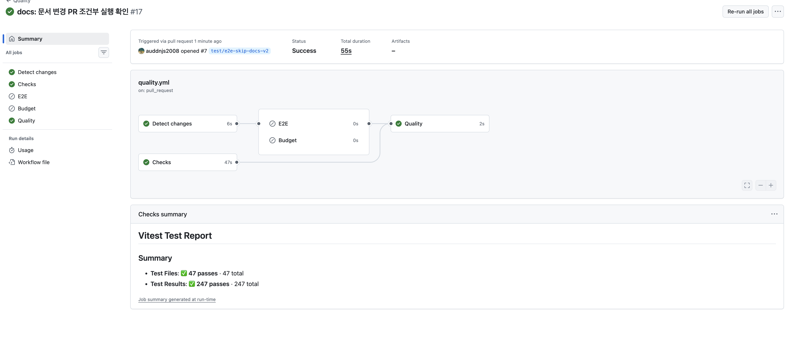
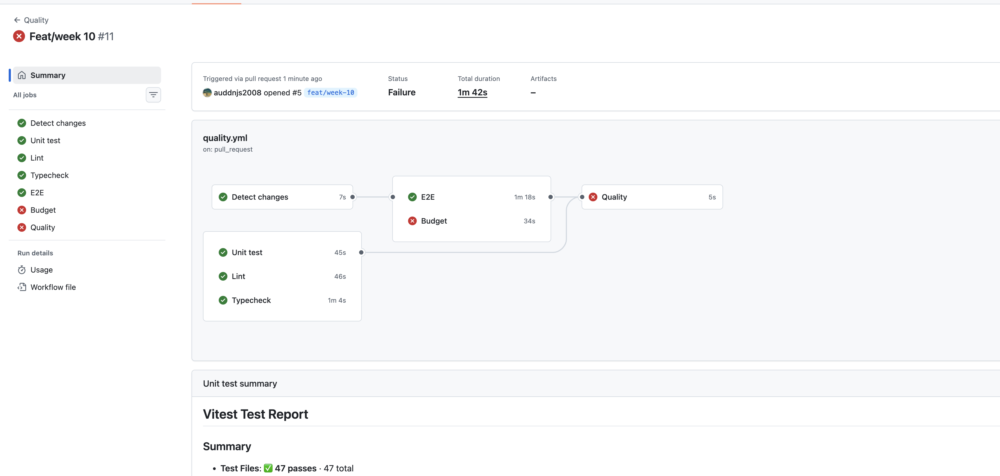
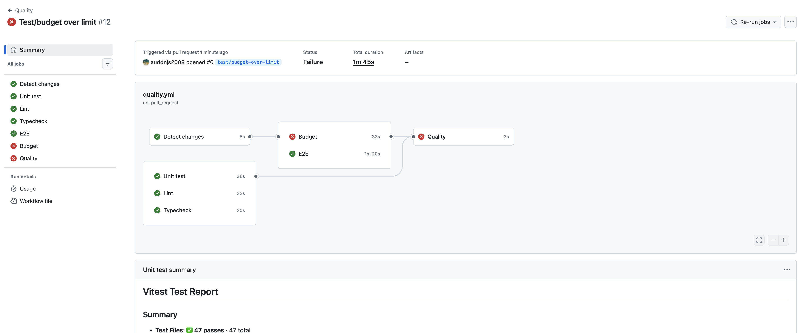
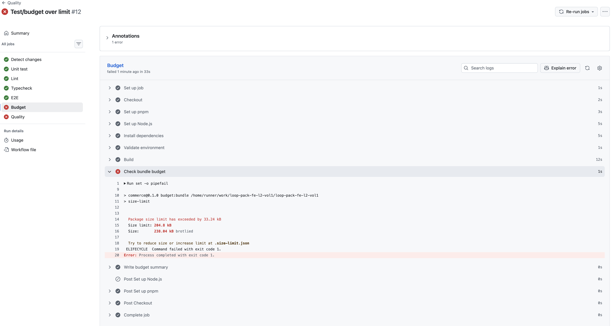

# 10주차 CI 측정 기록

## 1단계 - CI 파이프라인을 측정하고 병목만 줄이기

### Before 측정 조건

측정 대상은 기존 `Quality` workflow다. PR이 열리면 Ubuntu runner에서 `quality` job 하나만 실행되고, 의존성을 설치한 뒤 `pnpm check`를 실행한다.

- workflow: `.github/workflows/quality.yml`
- event: `pull_request`
- runner: `ubuntu-latest`
- Node.js: `.nvmrc` 기준 `24.17.0`
- package manager: `pnpm 10.15.1`
- install: `pnpm install --frozen-lockfile`
- 검증 명령: `pnpm check`
- 측정 커밋: `b3f34851 ci: quality job timeout 설정`

`pnpm check`는 `pnpm test && pnpm lint && pnpm typecheck && pnpm test:e2e`를 실행한다. `pnpm test:e2e` 안에서 production build와 Playwright E2E가 함께 돌기 때문에, 현재 CI에는 lint, typecheck, test, build, E2E가 모두 포함된다.

### Before Cold 측정

cold는 `Set up Node.js` step에 pnpm cache가 없다고 나온 실행으로 잡았다.

캐시 근거:

```txt
pnpm cache is not found
```

#### Cold Raw Data

| 구분       | Total duration | Quality job | Set up job | Checkout | Set up pnpm | Set up Node.js | Install dependencies | Install Playwright Chromium | Run quality checks | Post Set up Node.js |
| ---------- | -------------- | ----------- | ---------- | -------- | ----------- | -------------- | -------------------- | --------------------------- | ------------------ | ------------------- |
| cold try 1 | 1m 45s         | 1m 42s      | 1s         | 2s       | 3s          | 4s             | 6s                   | 23s                         | 56s                | 5s                  |
| cold try 2 | 1m 49s         | 1m 44s      | 2s         | 4s       | 8s          | 5s             | 9s                   | 25s                         | 44s                | 4s                  |
| cold try 3 | 1m 55s         | 1m 51s      | 1s         | 2s       | 4s          | 7s             | 7s                   | 23s                         | 59s                | 5s                  |

#### Cold Summary

| 항목           | Raw                 | Median | Range         |
| -------------- | ------------------- | ------ | ------------- |
| Total duration | 1m45s, 1m49s, 1m55s | 1m49s  | 1m45s ~ 1m55s |
| Quality job    | 1m42s, 1m44s, 1m51s | 1m44s  | 1m42s ~ 1m51s |
| Run quality    | 56s, 44s, 59s       | 56s    | 44s ~ 59s     |
| Playwright     | 23s, 25s, 23s       | 23s    | 23s ~ 25s     |
| Install deps   | 6s, 9s, 7s          | 7s     | 6s ~ 9s       |

### Before Warm 측정

warm은 `Set up Node.js` step에서 pnpm cache hit과 restore 로그가 나온 실행으로 봤다.

캐시 근거:

```txt
Cache hit for: node-cache-Linux-x64-pnpm-...
Cache restored successfully
Cache restored from key: node-cache-Linux-x64-pnpm-...
```

#### Warm Raw Data

| 구분       | Total duration | Quality job | Set up job | Checkout | Set up pnpm | Set up Node.js | Install dependencies | Install Playwright Chromium | Run quality checks | Post Set up Node.js |
| ---------- | -------------- | ----------- | ---------- | -------- | ----------- | -------------- | -------------------- | --------------------------- | ------------------ | ------------------- |
| warm try 1 | 1m 50s         | 1m 45s      | 1s         | 1s       | 6s          | 8s             | 2s                   | 27s                         | 57s                | 0s                  |
| warm try 2 | 1m 47s         | 1m 41s      | 0s         | 2s       | 4s          | 8s             | 2s                   | 24s                         | 58s                | 0s                  |
| warm try 3 | 2m 06s         | 2m 00s      | 1s         | 2s       | 3s          | 12s            | 2s                   | 35s                         | 1m 00s             | 0s                  |

#### Warm Summary

| 항목           | Raw                 | Median | Range         |
| -------------- | ------------------- | ------ | ------------- |
| Total duration | 1m50s, 1m47s, 2m06s | 1m50s  | 1m47s ~ 2m06s |
| Quality job    | 1m45s, 1m41s, 2m00s | 1m45s  | 1m41s ~ 2m00s |
| Run quality    | 57s, 58s, 1m00s     | 58s    | 57s ~ 1m00s   |
| Playwright     | 27s, 24s, 35s       | 27s    | 24s ~ 35s     |
| Install deps   | 2s, 2s, 2s          | 2s     | 2s ~ 2s       |

### 병목 지점

가장 긴 step은 모든 실행에서 `Run quality checks`였다.

- cold: 56s, 44s, 59s
- warm: 57s, 58s, 1m00s

두 번째로 긴 step은 `Install Playwright Chromium when used`였다.

- cold: 23s, 25s, 23s
- warm: 27s, 24s, 35s

pnpm cache는 `Install dependencies` 시간을 줄였다. cold에서는 6~9초가 걸렸고, warm에서는 2초로 줄었다. 하지만 전체 wall-clock 중앙값은 cold 1m49s, warm 1m50s로 거의 차이가 없었다. 병목은 의존성 설치보다 `pnpm check` 내부 검증과 Playwright Chromium 설치 쪽에 가까웠다.

### Before 결론

기존 workflow는 lint, typecheck, test, build, E2E를 한 job에서 모두 실행했다. pnpm cache hit은 확인했지만 전체 실행 시간에는 큰 영향을 주지 못했다. Before 기준에서 줄일 수 있는 부분은 `Run quality checks` 내부를 나눠 병렬화하는 것, 그리고 Playwright Chromium 설치를 E2E job으로 분리해 필요할 때만 실행하는 것이다.

다만 1단계 최적화에서는 검증을 제거하지 않고, 같은 검증을 유지한 채 병목만 줄여야 한다. 그래서 정적 검증과 E2E를 분리하고, Playwright Chromium 설치는 E2E 쪽에만 남기는 방향으로 잡았다.

### 전략 선택

Before에서 지목한 병목은 `Run quality checks`였다. 이 step 안에서 `pnpm test`, `pnpm lint`, `pnpm typecheck`, `pnpm test:e2e`가 직렬로 실행되므로, 1단계에서는 job 병렬화를 적용한다.

| 전략                       | 적용 여부 | 판단 근거                                                                                                                                                     |
| -------------------------- | --------- | ------------------------------------------------------------------------------------------------------------------------------------------------------------- |
| job 병렬화                 | 적용      | `Run quality checks`가 cold/warm 모두 최장 step이었다. 정적 검증과 E2E를 job으로 나누면 같은 검증을 유지하면서 E2E의 긴 실행 시간과 다른 검증을 겹칠 수 있다. |
| `concurrency` 그룹         | 제외      | 같은 PR에 연속 push가 쌓이는 문제를 줄이는 전략이다. 이번 Before 측정의 병목은 단일 실행 내부의 직렬 검증이므로 직접적인 wall-clock 개선 전략은 아니다.       |
| setup-node/pnpm store 캐시 | 제외      | 이미 적용되어 있고 warm 실행에서 cache hit이 확인됐다. `Install dependencies`는 warm 기준 2초라 현재 병목이 아니다.                                           |
| path filter                | 제외      | 안 돌려도 되는 검증을 제외하는 조건부 실행 전략이므로 2단계에서 다룬다. 1단계에서는 돌리기로 한 검증을 더 빠르게 만드는 데 집중한다.                          |

job을 병렬화하면 각 job에서 `pnpm install --frozen-lockfile`이 반복될 수 있다. 처음에는 `unit`, `lint`, `typecheck`, `e2e`를 각각 독립 job으로 나눠 측정했다. 당시 warm 기준 `Install dependencies` 중앙값이 2초였기 때문에 이 반복을 wall-clock 병목으로 보지는 않았다. 이후 중복 install을 더 줄이려고 `unit`, `lint`, `typecheck`는 하나의 `Checks` job으로 합쳤고, 24~35초가 걸리던 `Install Playwright Chromium when used`는 E2E job에만 남겼다.

`concurrency`를 나중에 적용한다면 main push 실행까지 취소하지 않도록 `group: ${{ github.workflow }}-${{ github.ref }}`처럼 ref를 포함해야 한다.

### 공통 보안 하드닝

CI는 PR 코드를 checkout해서 실행하고, `Budget` job에서는 repository secret도 읽는다. 그래서 workflow 기본값을 넓게 두지 않고 아래 기준을 적용했다.

| 항목                          | 적용 내용                                                                                                       | 판단 근거                                                                                                                        |
| ----------------------------- | --------------------------------------------------------------------------------------------------------------- | -------------------------------------------------------------------------------------------------------------------------------- |
| 최소 권한                     | workflow 최상단에 `permissions: contents: read`, `pull-requests: read`를 명시했다.                              | 코드를 읽고 PR 변경 파일을 판별하면 충분하다. PR 코멘트를 쓰지 않으므로 `pull-requests: write`는 주지 않는다.                    |
| third-party action 핀         | `actions/checkout`, `actions/setup-node`, `pnpm/action-setup`, `dorny/paths-filter`를 모두 commit SHA로 핀했다. | 공식 action은 major tag도 가능하지만, 이번 과제에서는 재현성과 공급망 리스크 축소를 위해 모두 SHA로 고정했다.                    |
| checkout credential 저장 차단 | 모든 `actions/checkout` step에 `persist-credentials: false`를 둔다.                                             | 이후 step에서 git credential이 남아 push나 외부 전송에 쓰일 여지를 줄인다.                                                       |
| `pull_request_target` 미사용  | trigger는 `pull_request`, `push`, `merge_group`만 사용한다.                                                     | fork PR 코드가 secrets 접근 권한으로 실행되는 위험을 피한다.                                                                     |
| secrets 노출 방지             | `AUTH_SESSION_SECRET`은 `Budget` job의 env로만 주입하고, 로그에는 값이 아니라 검증 성공/실패 메시지만 남긴다.   | secret 자체를 echo하지 않는다. PR에서는 CI용 더미 secret을 쓰고, `push main`과 `merge_group`에서는 repository secret을 요구한다. |
| AI 리뷰 CI 미연동             | AI 리뷰는 문서화된 수동 리뷰 보조로만 둔다.                                                                     | AI API key를 CI secret으로 추가하지 않아도 되고, PR 코드 실행과 외부 API 호출을 섞지 않아도 된다.                                |

### 캐시 hit 자가 검증

캐시가 실제로 hit 되는지 확인하려고 정상 lockfile 상태와 lockfile hash를 일부러 바꾼 상태를 각각 실행했다.

#### Warm hit 확인

정상 lockfile 상태의 warm 실행에서는 `Set up Node.js` step에 pnpm store cache 복원 로그가 남았다.

```txt
Cache hit for: node-cache-Linux-x64-pnpm-0f6fe750c5f71cdd5aa0c6b0f5fa1379245d0dc4ba658cbdc88391dc29ba5cc
Cache restored successfully
Cache restored from key: node-cache-Linux-x64-pnpm-0f6fe750c5f71cdd5aa0c6b0f5fa1379245d0dc4ba658cbdc88391dc29ba5cc
```

- `Set up Node.js`: 12s
- `Install dependencies`: 2s

#### Cache miss 재현

`pnpm-lock.yaml` 맨 위에 실험용 주석을 추가해 lockfile hash만 바꿨다. 이 변경은 `9efc3270 test: cache miss 재현` 커밋으로 PR에 올려 Actions를 실행했다.

```diff
+# cache-miss experiment
 lockfileVersion: '9.0'
```

해당 실행의 `Set up Node.js` step에서는 pnpm store cache miss가 찍혔다.

```txt
pnpm cache is not found
```

- `Total duration`: 1m45s
- `Quality job`: 1m41s
- `Set up Node.js`: 6s
- `Install dependencies`: 8s

실험 후 `1cf4ffcd chore: cache miss 실험 원복` 커밋으로 `pnpm-lock.yaml`을 원래 상태로 되돌렸다.

#### Hit/Miss 비교

| 조건 | 캐시 로그                  | Set up Node.js | Install dependencies |
| ---- | -------------------------- | -------------- | -------------------- |
| hit  | `Cache restored from key:` | 12s            | 2s                   |
| miss | `pnpm cache is not found`  | 6s             | 8s                   |

cache hit에서는 pnpm store가 복원되어 `Install dependencies`가 2초로 끝났다. cache miss에서는 store를 복원하지 못해 `Install dependencies`가 8초로 늘어났다. 다만 cache hit일 때는 `Set up Node.js` step 안에서 약 200MB cache archive를 내려받고 압축까지 해제한다. 이 시간이 setup step에 포함되기 때문에, 이번 실행에서는 `Set up Node.js + Install dependencies` 합산 시간이 hit과 miss 모두 14초로 같았다. pnpm store cache의 동작은 확인했지만, wall-clock 병목은 cache 복원이 아니라 `Run quality checks`와 Playwright Chromium 설치였다.

### 적용 내용

`.github/workflows/quality.yml`의 단일 `quality` job을 `checks`, `e2e`, `budget`, `quality` job으로 나눴다.

- `checks`: 한 번 install한 뒤 `pnpm test`, `pnpm lint`, `pnpm typecheck`
- `e2e`: `pnpm exec playwright install --with-deps chromium` 후 `pnpm test:e2e`
- `budget`: 환경 변수 검증, production build, 번들 예산 검사
- `quality`: 항상 실행되는 최종 집계 job

검증은 유지하되 정적 검증의 install 반복은 줄였다. E2E와 Budget은 production build나 Playwright 설치처럼 실행 성격이 달라 별도 job으로 유지했다. Playwright Chromium 설치는 E2E에만 필요하므로 `e2e` job에만 남겼다.

기존 PR check 이름을 유지하려고 마지막에 `Quality` 집계 job을 뒀다. 이 job은 `checks`가 성공하고, E2E와 Budget이 실행 대상이면 `success`, 실행 대상이 아니면 `skipped`일 때만 통과한다.

### After 측정

After는 최종 workflow 기준으로 측정했다. `Checks` job은 한 번 install한 뒤 `pnpm test`, `pnpm lint`, `pnpm typecheck`를 실행한다. cold는 `pnpm cache is not found` 로그가 나온 실행, warm은 `Cache restored from key:` 로그가 나온 실행으로 잡았다.

#### After Cold Raw Data

| 구분       | Total duration | Detect changes | Checks | E2E   | Budget | Quality | Cache |
| ---------- | -------------- | -------------- | ------ | ----- | ------ | ------- | ----- |
| cold try 1 | 1m 42s         | 9s             | 50s    | 1m20s | 37s    | 4s      | miss  |
| cold try 2 | 1m 59s         | 5s             | 51s    | 1m44s | 49s    | 2s      | miss  |
| cold try 3 | 1m 30s         | 8s             | 51s    | 1m12s | 39s    | 2s      | miss  |

#### After Cold Summary

| 항목           | Raw                 | Median | Range         |
| -------------- | ------------------- | ------ | ------------- |
| Total duration | 1m42s, 1m59s, 1m30s | 1m42s  | 1m30s ~ 1m59s |
| Detect changes | 9s, 5s, 8s          | 8s     | 5s ~ 9s       |
| Checks         | 50s, 51s, 51s       | 51s    | 50s ~ 51s     |
| E2E            | 1m20s, 1m44s, 1m12s | 1m20s  | 1m12s ~ 1m44s |
| Budget         | 37s, 49s, 39s       | 39s    | 37s ~ 49s     |
| Quality        | 4s, 2s, 2s          | 2s     | 2s ~ 4s       |

#### After Warm Raw Data

| 구분       | Total duration | Detect changes | Checks | E2E   | Budget | Quality | Cache |
| ---------- | -------------- | -------------- | ------ | ----- | ------ | ------- | ----- |
| warm try 1 | 1m 29s         | 8s             | 47s    | 1m08s | 38s    | 4s      | hit   |
| warm try 2 | 1m 34s         | 7s             | 57s    | 1m15s | 39s    | 4s      | hit   |
| warm try 3 | 1m 40s         | 5s             | 55s    | 1m23s | 43s    | 3s      | hit   |

#### After Warm Summary

| 항목           | Raw                 | Median | Range         |
| -------------- | ------------------- | ------ | ------------- |
| Total duration | 1m29s, 1m34s, 1m40s | 1m34s  | 1m29s ~ 1m40s |
| Detect changes | 8s, 7s, 5s          | 7s     | 5s ~ 8s       |
| Checks         | 47s, 57s, 55s       | 55s    | 47s ~ 57s     |
| E2E            | 1m08s, 1m15s, 1m23s | 1m15s  | 1m08s ~ 1m23s |
| Budget         | 38s, 39s, 43s       | 39s    | 38s ~ 43s     |
| Quality        | 4s, 4s, 3s          | 4s     | 3s ~ 4s       |

After에서 가장 긴 job은 cold/warm 모두 `E2E`였다. `Checks`는 install을 한 번만 수행한 뒤 unit test, lint, typecheck를 직렬로 실행하지만, median 기준 cold 51초, warm 55초로 E2E보다 짧았다. 정적 검증을 합쳐 install 반복을 줄여도 새로운 wall-clock 병목이 생기지는 않았다.

### Before/After 비교

| 조건 | Before median | After median | 차이     |
| ---- | ------------- | ------------ | -------- |
| cold | 1m49s         | 1m42s        | 7s 감소  |
| warm | 1m50s         | 1m34s        | 16s 감소 |

Before에서는 하나의 `quality` job 안에서 `pnpm test`, `pnpm lint`, `pnpm typecheck`, `pnpm test:e2e`가 직렬로 실행됐다. After에서는 정적 검증을 `Checks`로 묶고, E2E와 Budget을 별도 job으로 분리해 병렬 실행했다. 그 결과 cold median은 1m49s에서 1m42s로, warm median은 1m50s에서 1m34s로 줄었다.

처음에는 `unit`, `lint`, `typecheck`를 각각 독립 job으로 나눠 측정했지만, 각 job이 setup과 install을 반복한다는 단점이 있었다. 최종 workflow에서는 세 검증을 `Checks` job 하나로 합쳐 install 반복을 줄였다. `Checks`는 직렬 실행이라 길어졌지만, 최장 job은 여전히 E2E였으므로 병렬화 이득을 크게 잃지 않았다.

더 줄이려면 Playwright browser cache나 E2E shard를 검토할 수 있다. 다만 1단계 목표는 같은 검증을 유지한 채 Before에서 확인한 직렬 병목만 줄이는 것이므로, 이번 단계에서는 workflow를 더 복잡하게 만들지 않고 job 병렬화까지만 적용했다.

## 2단계 - 조건부 실행 설계

### 대상 변경 범위

E2E는 브라우저를 설치하고 production build까지 수행하므로 현재 workflow에서 가장 비싼 검증이다. 반면 unit test, lint, typecheck는 결정적이고 상대적으로 비용이 낮아 `Checks` job으로 묶고 모든 PR에서 계속 실행한다.

E2E는 앱 런타임, 브라우저 노출 자산, E2E 테스트/설정, 의존성, Node 버전, CI 실행 방식이 바뀐 경우에만 실행한다.

| 분류      | 경로                                                                                                                                                                                   | 이유                               |
| --------- | -------------------------------------------------------------------------------------------------------------------------------------------------------------------------------------- | ---------------------------------- |
| 앱 코드   | `src/**`                                                                                                                                                                               | UI, API route, 상태, 공통 계층     |
| E2E 코드  | `e2e/**`, `playwright.config.*`                                                                                                                                                        | E2E 시나리오와 실행 설정           |
| 정적 자산 | `public/**`                                                                                                                                                                            | 브라우저에서 직접 노출             |
| 환경/설정 | `package.json`, `pnpm-lock.yaml`, `.size-limit.json`, `scripts/**`, `next.config.*`, `postcss.config.*`, `tsconfig.json`, `vitest.config.*`, `.nvmrc`, `.github/workflows/quality.yml` | 빌드, 런타임, 테스트, CI 동작 영향 |

`docs/**`, `README.md`처럼 문서만 변경한 PR은 앱 런타임이나 브라우저 사용자 흐름을 바꾸지 않으므로 E2E를 스킵한다.

### 실행 조건

`dorny/paths-filter`로 PR의 변경 경로를 판정하고, workflow 자체는 항상 실행한다. `on.pull_request.paths`는 workflow 전체를 스킵해 `Checks`와 `Quality`까지 실행하지 않을 수 있으므로 사용하지 않았다.

| 이벤트         | E2E 실행 조건                              |
| -------------- | ------------------------------------------ |
| `pull_request` | draft가 아니고 E2E 관련 경로가 변경된 경우 |
| `push` to main | 항상 실행                                  |
| `merge_group`  | 항상 실행                                  |

Draft PR은 아직 merge 대상이 아니므로 E2E를 스킵한다. Ready for review로 전환되면 PR 이벤트가 다시 발생하고 변경 경로 기준으로 E2E 실행 여부를 다시 판정한다.

Branch protection의 required check와 충돌하지 않도록 `E2E` 자체가 아니라 항상 실행되는 `Quality` job을 최종 판정으로 둔다. `Quality`는 `Checks`가 성공해야 통과하고, E2E는 실행 대상이면 `success`, 의도적으로 스킵된 경우면 `skipped`를 정상으로 인정한다.

main 보호는 `merge_group`에서 보완한다. PR 단계에서 문서 변경이나 draft 상태로 E2E가 스킵되더라도, merge queue에서는 경로와 무관하게 E2E를 항상 실행해 main 병합 직전 최종 방어선을 둔다. merge queue를 쓰지 않는 main push에서도 E2E를 항상 실행한다.

### 검증 결과

조건에 걸리는 PR과 걸리지 않는 PR을 각각 만들어 검증한다.

| 케이스             | 기대 결과                                                 |
| ------------------ | --------------------------------------------------------- |
| 문서만 변경한 PR   | `Checks`, `Quality` 실행, `E2E` skipped                   |
| `src/**` 변경 PR   | `Checks`, `E2E`, `Quality` 모두 실행                      |
| Draft PR           | E2E 관련 경로가 바뀌어도 `E2E` skipped, `Quality` success |
| Ready 전환 후 PR   | E2E 관련 경로 변경이 있으면 `E2E` 실행                    |
| `merge_group` 실행 | 경로와 무관하게 `E2E` 실행                                |

실제 PR에서도 조건부 실행을 확인했다.

| PR / 변경 범위                      | 결과                                                                   | 판단 |
| ----------------------------------- | ---------------------------------------------------------------------- | ---- |
| `feat/week-10` / workflow 변경      | `Detect changes`, `Checks`, `E2E`, `Budget`, `Quality` success         | 통과 |
| `test/e2e-skip-docs-v2` / 문서 변경 | `Detect changes`, `Checks`, `Quality` success, `E2E`, `Budget` skipped | 통과 |

문서만 변경한 PR은 전체 55초에 끝났고, E2E와 Budget이 의도대로 skipped 처리됐다. `Quality`도 success로 끝나 required check 대기 상태가 생기지 않았다.

workflow 변경 PR은 전체 1m24s에 끝났고, `Checks`, `E2E`, `Budget`이 모두 실행됐다. 최장 job은 `E2E` 1m10s였고, `Checks`는 51s, `Budget`은 40s였다.




E2E flaky 대응은 기존 Playwright 설정을 따른다. CI에서는 `retries: 2`와 `trace: "on-first-retry"`로 일시적인 runner 지연을 구분하고, 로컬에서는 `retries: 0`으로 실패를 바로 드러낸다. 같은 스펙이 반복해서 실패하면 retry로 숨기지 않고 별도 이슈로 분리해 원인을 추적한다.

## 3단계 - 예산 게이트와 결과 표시

### 예산 기준

번들 예산은 `size-limit`와 `@size-limit/file`로 검사한다. Next 16 Turbopack의 `next build` 출력은 route별 `First Load JS` 표를 제공하지 않으므로, CI에서는 빌드 산출물인 `.next/static/chunks/*.{js,css}`의 brotli 크기를 예산 대상으로 삼는다.

임계값은 7주차 Home real-final 측정값과 현재 빌드 값을 함께 기준으로 잡았다.

| 기준                      | 값          | 근거                                                               |
| ------------------------- | ----------- | ------------------------------------------------------------------ |
| 7주차 Home 전체 전송량    | `459.5KiB`  | `docs/performance/week-07/step-4-regression/after/summary.md`      |
| 7주차 Home Hero 전송량    | `46.0KiB`   | 같은 문서의 Network 관찰                                           |
| 현재 client JS/CSS brotli | `238.04 kB` | `pnpm build` 후 `pnpm budget:bundle` 측정                          |
| 예산                      | `340KiB`    | 현재값에서 약 43% 여유, 7주차 전체 전송량보다는 낮은 상한으로 설정 |

예산은 현재값과 너무 붙이지 않았다. 작은 Next/Turbopack chunk 변동이나 CSS 생성 순서 차이로 불필요한 빨간불이 나지 않도록 여유를 뒀다. 대신 7주차 Home 전체 전송량보다 낮게 잡아 클라이언트 JS/CSS가 한 번에 크게 늘어나는 회귀는 막는다.

환경 변수 검증은 build 전에 `scripts/validate-env.mjs`로 수행한다. 로컬에서는 `.env.local`이 있으면 먼저 읽고, CI/production에서는 `APP_ORIGIN`과 `AUTH_SESSION_SECRET`을 필수로 요구한다. `APP_ORIGIN`, `INTERNAL_API_BASE_URL`, `NEXT_PUBLIC_API_BASE_URL`은 설정된 경우 절대 `http(s)` URL이어야 한다. `NEXT_PUBLIC_*` 이름에 `SECRET`, `TOKEN`, `PASSWORD`, `DATABASE`, `PRIVATE`, `KEY`가 포함되면 브라우저 노출 위험이 있어 실패시킨다.

실제 env 값은 Git에 커밋하지 않는다. 저장소에는 `.env.example`만 커밋하고, 로컬 값은 `.env.local`, CI secret은 GitHub Actions Secret, 운영 값은 배포 플랫폼의 secret manager에서 관리한다.

Lighthouse CI는 이번 단계의 required gate로 넣지 않는다. 7주차 LCP/CLS 기준은 이미 남아 있지만 Lighthouse는 CI runner 상태에 따른 변동성이 크다. 이번 단계의 필수 사고 방지 범위는 번들 크기와 환경 변수 검증으로 좁힌다.

### 적용 내용

- `pnpm validate:env`: 환경 변수 게이트
- `pnpm budget:bundle`: `size-limit` 번들 예산 게이트
- `pnpm budget`: 환경 변수 검증, production build, 번들 예산 검사를 한 번에 수행
- `Budget` CI job: 앱 관련 변경 PR, main push, `merge_group`에서 실행
- `Quality` CI job: `Budget`이 실행 대상이면 success를 요구하고, 문서-only 또는 draft PR에서 skipped면 정상으로 인정
- `.env.example`: 필요한 환경 변수 목록과 형식 문서화

GitHub Actions에서 `AUTH_SESSION_SECRET`은 이벤트에 따라 다르게 주입한다. `pull_request`에서는 upstream/fork PR도 검증을 통과할 수 있도록 16자 이상의 CI용 더미 값을 사용한다. 반면 `push main`과 `merge_group`에서는 `${{ secrets.AUTH_SESSION_SECRET }}`를 사용하므로 repository secret을 직접 추가해야 한다.

설정 절차:

1. GitHub repository `Settings`로 이동한다.
2. `Secrets and variables` > `Actions`를 연다.
3. `New repository secret`을 누른다.
4. Name은 `AUTH_SESSION_SECRET`, 값은 16자 이상의 CI용 secret으로 저장한다.

Branch protection의 required check는 `Quality`를 기준으로 둔다. `Quality`가 `Checks`, 조건부 `E2E`, 조건부 `Budget` 결과를 집계하므로 required check가 조건부 job의 skipped 상태 때문에 대기 상태에 빠지지 않는다.

### 검증 결과

로컬 검증:

```txt
CI=true APP_ORIGIN=http://127.0.0.1:3000 AUTH_SESSION_SECRET=ci-week10-budget-secret pnpm budget
```

결과:

- 환경 변수 검증 통과
- `pnpm build` 통과
- `size-limit` 결과: 예산 `348.16 kB`, 현재 `238.04 kB brotlied`

#### 빨간불 자가 검증

초기 설계에서는 `AUTH_SESSION_SECRET` repository secret을 등록하지 않은 상태에서 PR을 실행했다. `Budget` job의 `Validate environment` 단계가 `AUTH_SESSION_SECRET is required.` 메시지로 실패했고, 최종 `Quality` job도 실패했다.




이후 GitHub repository secret에 `AUTH_SESSION_SECRET`을 추가하고 failed jobs를 rerun했다. `Validate environment` 단계는 `Environment validation passed`로 통과했고, `Budget`과 `Quality`가 모두 성공했다. 최종 workflow에서는 upstream PR에서도 확인 가능한 제출을 위해 `pull_request`에 한해 CI용 더미 secret을 주입하고, main 병합 전 경로인 `merge_group`에서는 repository secret을 요구하도록 조정했다.


번들 예산 빨간불은 별도 `test/budget-over-limit` PR에서 확인했다. 실제 구현의 예산은 유지하고, 테스트 브랜치에서만 `.size-limit.json`의 limit을 `200 KiB`로 낮췄다. `Budget` job의 `Check bundle budget` 단계에서 현재 번들 `238.04 kB brotlied`가 제한 `204.8 kB`를 `33.24 kB` 초과해 실패했고, 최종 `Quality` job도 실패했다. 이 테스트 PR은 캡처용이며 과제 브랜치에는 머지하지 않는다.





## 4단계 - AI 코드리뷰 활용

### 리뷰 기준 출처

AI 코드리뷰 프롬프트는 일반적인 가독성 조언이 아니라, 10주간 이 프로젝트에서 합의한 규칙을 기준으로 작성한다. 리뷰 진입점은 `docs/ai/review-skill.md`로 두고, 세부 기준은 주제별 rule 파일로 나눴다.

| 파일                                      | 역할                                                            |
| ----------------------------------------- | --------------------------------------------------------------- |
| `docs/ai/review-skill.md`                 | PR diff 리뷰 순서, 출력 형식, advisory 운영 원칙                |
| `docs/ai/review-rules/type-lint.md`       | pnpm 사용, 타입/린트 우회 금지, 검증 우회 금지                  |
| `docs/ai/review-rules/react-component.md` | 컴포넌트, Hook, API, 유틸 책임 경계와 `useEffect` 정당성        |
| `docs/ai/review-rules/state-url.md`       | 서버·URL·클라이언트 상태의 Source of Truth, 서버 응답 복사 금지 |
| `docs/ai/review-rules/fsd-boundary.md`    | FSD import 방향, slice Public API 우회 금지                     |
| `docs/ai/review-rules/test-boundary.md`   | 단위/통합/E2E 경계, MSW 모킹 경계, E2E production build 기준    |

AI 리뷰는 비결정적이므로 required gate로 두지 않는다. 이번 과제에서는 로컬/수동 PR 리뷰 보조 도구로만 사용하고, 반복적으로 유효한 지적이 나오면 5단계에서 결정적 하네스로 승격할 후보로 기록한다.

### 리뷰 대상

실제 과제 브랜치 diff는 CI, 문서, workflow 변경이 대부분이라 React/FSD/상태 경계 규칙을 검증하기 어렵다. 그래서 `test/ai-review-sample` 브랜치에 의도적인 작은 위반 diff를 만들고, 이 diff를 AI 리뷰 대상으로 삼았다. 이 브랜치는 리뷰 기준 검증용이며 머지하지 않는다.

- 대상 브랜치: `test/ai-review-sample`
- 대상 커밋: `0a40349f test: add AI review sample violation`
- 대상 diff: `src/entities/product/ui/ProductCard.tsx`에서 `@/features/add-to-cart`를 import하고, entity 컴포넌트 안에서 `useAddToCart(product.id)`와 `담기` 버튼 fallback을 직접 조합함

실험 브랜치에는 아래처럼 의도적인 FSD 위반을 넣었다.

```diff
 import Image from "next/image";
 import type { ReactNode } from "react";
+import { useAddToCart } from "@/features/add-to-cart";

 export function ProductCard({
   product,
   titleLevel = 2,
   floatingAction,
   bottomAction,
 }: ProductCardProps) {
   const Title = titleLevel === 2 ? "h2" : "h3";
+  const fallbackAddToCart = useAddToCart(product.id);

   return (
     <article className="group grid gap-2.5">
       ...
-      {bottomAction !== undefined ? <div data-slot="bottom-action">{bottomAction}</div> : null}
+      {bottomAction !== undefined ? (
+        <div data-slot="bottom-action">{bottomAction}</div>
+      ) : (
+        <button type="button" disabled={fallbackAddToCart.disabled} onClick={fallbackAddToCart.onClick}>
+          담기
+        </button>
+      )}
     </article>
   );
 }
```

### AI 피드백

#### 잘 잡은 리뷰

AI는 `src/entities/product/ui/ProductCard.tsx`가 `@/features/add-to-cart`를 import한 점을 FSD 의존 방향 위반으로 지적했다. `entities`는 `features`나 `widgets`를 알면 안 되고, 상품 표현과 장바구니 행위의 조합은 `widgets`나 `_pages`에서 해야 한다는 `docs/ai/review-rules/fsd-boundary.md` 기준과 맞다.

가장 작은 수정안도 타당했다. `ProductCard`는 기존처럼 `bottomAction` slot만 유지하고, `useAddToCart(product.id)`와 버튼 조합은 상위 `widgets/product-card` 또는 `_pages`에서 처리해야 한다.

#### 헛소리한 리뷰

약한 프롬프트로 "이 diff 코드리뷰해줘"라고 요청했을 때, AI는 새 `<button>`에 `aria-label`이 없어 접근성 문제가 있다고 지적했다. 하지만 해당 버튼에는 visible text인 `담기`가 있어 접근성 이름이 이미 제공된다. 이 프로젝트의 테스트/리뷰 기준은 role과 name처럼 사용자가 인식하는 방식으로 요소를 찾는 것이며, 모든 버튼에 별도 `aria-label`을 요구하지 않는다.

이 지적은 파일/라인과 실제 접근성 결함이 연결되지 않은 일반론이므로 반려했다.

### 반영 결과

#### 프롬프트 개선

오탐을 줄이기 위해 `docs/ai/review-skill.md`에 아래 제한을 명시했다.

- PR diff에 포함된 변경을 먼저 본다.
- 이번 PR과 무관한 오래된 문제는 finding으로 쓰지 않는다.
- 추측으로 지적하지 않는다.
- 파일/라인, 변경 내용, 어긴 규칙이 이어질 때만 finding으로 쓴다.
- "가독성", "유지보수성"처럼 근거 없는 일반론으로 지적하지 않는다.

#### 5단계 승격 후보

잘 잡은 FSD import 경계 위반은 결정적으로 판별 가능하다. 5단계에서는 `entities/*`가 `features/*`, `widgets/*`, `_pages/*`를 import하지 못하게 하는 정적 하네스로 내려 실제 gate에서 막는다.

## 5단계 - AI 지적을 결정적 룰로 승격

### 승격 대상

4단계 AI 리뷰에서 잘 잡은 지적은 `entities/product`가 `features/add-to-cart`를 import한 FSD 경계 위반이었다. 이 규칙은 import 경로만 보면 참/거짓을 판별할 수 있다. 그래서 AI나 사람이 매번 리뷰로 확인하기보다, 결정적 하네스로 내려 PR gate에서 막는 편이 맞다고 판단했다.

승격한 규칙:

- 하위 레이어가 상위 레이어를 import하지 않는다.
- 같은 레이어의 다른 slice를 직접 import하지 않는다.

AI/사람 리뷰에 남길 것과 기계로 내릴 것은 아래처럼 나눴다.

| 구분                   | 담당                 | 판단 근거                                           |
| ---------------------- | -------------------- | --------------------------------------------------- |
| import 방향            | `architecture:check` | 경로만으로 참/거짓을 판별할 수 있다.                |
| 다른 slice 직접 import | `architecture:check` | source/target layer와 slice가 결정적이다.           |
| slice 배치             | AI/사람 리뷰         | 이 로직이 어느 slice 책임인지 맥락 판단이 필요하다. |
| Public API 의도        | AI/사람 리뷰         | 무엇을 외부 계약으로 공개할지는 설계 판단이다.      |
| `shared` 오염          | AI/사람 리뷰         | 도메인 정책인지 공용 유틸인지 맥락 확인이 필요하다. |

이 규칙은 `src/shared/config/architecture/fsdImportBoundaries.test.ts`에서 Vitest 기반 아키텍처 테스트로 검증한다. 별도 ESLint rule을 새로 만들지 않은 이유는 이미 같은 목적의 하네스가 있고, `package.json`의 `architecture:check`로 단독 실행할 수 있기 때문이다.

### CI 배치

`quality.yml`의 `Checks` job은 `pnpm test`를 실행한다. `fsdImportBoundaries.test.ts`는 일반 Vitest suite에 포함되므로 PR마다 `Checks`와 최종 `Quality` gate를 통해 실행된다.

빠르게 이 규칙만 확인할 때는 아래 명령을 사용한다.

```bash
pnpm architecture:check
```

### 자가 검증

정상 코드에서는 아키텍처 하네스가 통과했다.

```txt
> commerce@0.1.0 architecture:check
> vitest run fsdImportBoundaries

Test Files  1 passed (1)
Tests       2 passed (2)
```

4단계 실험 브랜치 `test/ai-review-sample`에서는 같은 명령이 실패했다. 샘플 위반은 `src/entities/product/ui/ProductCard.tsx`에서 `@/features/add-to-cart`를 import한 변경이다.

```txt
FAIL src/shared/config/architecture/fsdImportBoundaries.test.ts > FSD import boundary > 하위 레이어가 상위 레이어를 import하지 않는다

Expected []
Received [
  "src/entities/product/ui/ProductCard.tsx -> src/features/add-to-cart/index.ts",
]
```

이 결과로 AI가 잡은 FSD 경계 위반이 결정적 하네스로도 막히는 것을 확인했다. 정상 브랜치에서는 같은 하네스가 통과하므로, 현재 구조에 대한 오탐은 확인되지 않았다.

## 생각해 볼 질문 답변

### 1. E2E를 모든 PR에 required로 걸면 어떤 문제가 생길까?

E2E를 모든 PR에 required로 걸면 문서나 설명만 바꾼 PR에서도 브라우저 설치와 production E2E가 매번 실행되어 시간과 비용이 낭비된다. 또 E2E는 runner 상태나 네트워크 지연 때문에 flaky가 생길 수 있어, 앱 동작과 무관한 변경도 거짓 빨간불로 막힐 수 있다.

반대로 E2E를 조건부로 스킵하면서 E2E job 자체를 required로 걸면 job이 대기 상태에 빠져 PR이 머지되지 않을 수 있다. 그래서 이 프로젝트에서는 E2E는 관련 경로, main push, `merge_group`에서 실행하고 required check는 항상 실행되는 `Quality` job으로 둔다.

### 2. Lighthouse 점수 하락은 항상 merge blocker여야 할까?

Lighthouse 점수 하락을 항상 merge blocker로 두는 것은 위험하다. 같은 코드라도 CI runner의 CPU, 네트워크, 측정 타이밍에 따라 점수가 흔들릴 수 있고, 단발성 하락으로 정상 PR을 막을 수도 있다.

그래서 이번 과제에서는 Lighthouse CI를 required gate로 두지 않고, 더 결정적인 번들 크기 예산과 환경 변수 검증만 merge blocker로 둔다. Lighthouse는 주요 화면 변경이나 정기 점검에서 참고 지표로 보고, 반복해서 재현되는 큰 회귀가 있을 때 별도 gate 승격을 검토한다.

### 3. Preview 환경이 production API를 바라보면 무슨 일이 생길까?

Preview 환경이 production API를 바라보면 테스트 주문, 장바구니 변경, 계정 데이터 수정 같은 실험 데이터가 실제 운영 데이터에 섞일 수 있다. 결제, 이메일, 재고 차감처럼 외부 효과가 있는 플로우라면 단순 데이터 오염을 넘어 실제 사용자나 운영 시스템에 영향을 줄 수 있다.

그래서 preview와 CI에서는 production API가 아니라 격리된 API와 테스트 secret을 바라보도록 환경 변수를 분리해야 한다. 이번 프로젝트에서는 `validate-env`로 필수 URL 형식과 secret 존재 여부를 build 전에 검사하고, 실제 값은 Git에 커밋하지 않고 GitHub Secrets나 배포 플랫폼 secret으로 주입한다.

### 4. AI가 만든 workflow를 그대로 머지하면 어떤 리스크가 있을까?

AI가 만든 workflow를 그대로 머지하면 겉보기에는 동작해도 보안과 운영 조건이 틀릴 수 있다. 예를 들어 `permissions`를 과하게 열거나, `pull_request_target`에서 PR 코드를 checkout해 secret이 노출될 수 있다. third-party action을 태그로만 써서 공급망 변경에 취약해지는 경우도 있다.

또 cache key가 실제 lockfile과 연결되지 않거나, path filter가 필요한 검증을 스킵하거나, 조건부 job을 required로 걸어 PR이 pending에 빠질 수 있다. 그래서 AI 초안은 그대로 믿지 않고 최소 권한, secret 노출 여부, action pin, cache hit 로그, path filter 안전성, required check 구조를 실제 CI 실행으로 검증해야 한다.

### 선택. Rollback은 이전 버전으로 되돌리기만 하면 끝날까?

Rollback은 이전 커밋으로 되돌리는 것만으로 끝나지 않는다. 앱 코드는 이전 deployment로 되돌릴 수 있지만, DB schema, 캐시, queue job, 진행 중인 결제/주문 트랜잭션이 새 버전의 상태를 이미 만들었을 수 있다.

그래서 운영에서는 되돌리기 어려운 마이그레이션을 늦추고, 새/구 코드가 함께 동작하는 이전 버전과 호환되는 마이그레이션을 먼저 설계한다. 문제가 특정 기능에 국한되면 전체 rollback보다 feature flag를 끄는 편이 빠르다. rollback 후에는 캐시 무효화와 오류율/핵심 플로우 지표 확인까지 해야 완료로 본다.
