# 10주차 — CI 측정·최적화 기록

quality workflow를 측정한 뒤 job 병렬화, 중복 빌드 제거, Playwright 브라우저 캐시를 적용했다. 전체 실행 시간의 중앙값은 cold **144→94초**, warm **134→71초**로 줄었다. unit·integration, lint, typecheck, production build, E2E 검증은 모두 유지했다.

결과는 세 축으로 구분한다. 중복 workflow 제거 효과를 quality workflow 자체의 속도 개선으로 계산하지 않는다.

| 축 | Before | After |
|---|---|---|
| 전체 실행 시간 (quality run wall-clock) | cold 144초 · warm 134초 | cold 94초 (−35%) · warm 71초 (−47%) |
| PR당 러너 사용 시간 추정 | 두 workflow 합계 약 266초 | 두 job 합계 약 130초 |
| 연속 push의 중복 검증 | 이전 PR run도 계속 실행 | 같은 PR의 이전 run 취소, main run은 독립 실행 |

계획과 의사 결정은 [week10-decisions.md](week10-decisions.md)에 기록했다. 측정 프로토콜은 ADR-2·4, 실험 환경은 ADR-3을 따른다.

## 측정 조건과 판정 기준

- **대상**: fork `heeji289`의 실험 PR. upstream에서는 캐시 삭제와 재실행 권한이 없어 fork에서 측정했다.
- **전체 실행 시간**: quality workflow의 attempt별 시작부터 종료까지 걸린 시간.
- **cold**: `gh cache delete --all`로 서버 캐시를 모두 삭제한 뒤 같은 커밋에서 “Re-run all jobs”.
- **warm**: 캐시를 보존한 채 같은 커밋에서 재실행.
- **반복**: 각 조건에서 3회. [7주차 측정 방식](../week-07-performance/measure-protocol.md)을 따라 원자료·중앙값·범위를 함께 기록했다.

**판정 규칙은 After 측정 전에 고정했다.** After의 [최소, 최대] 구간이 Before보다 낮고 두 구간이 겹치지 않을 때만 “개선”으로 판정한다. 겹치면 “유의미하지 않음”으로 기록한다. 이는 3회 표본에 적용한 실무 판정 기준이며, 통계적 유의성을 검정한 결과는 아니다.

## Before — 병목 확인

2026-09-09 측정. 커밋 `08344858`, run [34329855053](https://github.com/heeji289/loop-pack-fe-l2-vol1/actions/runs/34329855053).

### 전체 실행 시간

| 조건 | 1회 | 2회 | 3회 | 중앙값 | 최소–최대 (폭) |
|---|---|---|---|---|---|
| cold — attempt 2·3·4 | 144초 | 128초 | 146초 | **144초** | 128–146초 (18초) |
| warm — attempt 5·6·7 | 151초 | 132초 | 134초 | **134초** | 132–151초 (19초) |

### step별 소요 시간

Actions 화면의 step 이름을 그대로 사용했다.

| step | cold — attempt 2·3·4 | warm — attempt 5·6·7 |
|---|---|---|
| Set up job | 1초 | 1초 |
| Checkout | 1~2초 | 2초 |
| Set up pnpm | 3~5초 | 3~8초 |
| Set up Node.js | 5~8초 | 8~9초 |
| Install dependencies | 6~7초 | **2초** |
| Install Playwright Chromium when used | 24~26초 | 23~32초 |
| **Run quality checks** | **67~89초** | **86~90초** |
| Post Set up Node.js | 4~5초 | 0초 |

`Post Set up Node.js`는 pnpm store 캐시를 저장하는 단계다. cold에서는 업로드에 4~5초가 들었고, warm에서는 기존 캐시를 사용해 저장을 건너뛰었다.

### 가장 긴 step 내부 분해

`Run quality checks`는 `pnpm check` 한 명령으로 아래 검증을 직렬 실행했다. raw 로그의 줄별 타임스탬프로 cold attempt 2와 warm attempt 6을 분해했다.

| 명령 | cold | warm |
|---|---|---|
| `pnpm test` | 23.4초 | 21.8초 |
| `pnpm lint` | 16.8초 | 16.2초 |
| `pnpm typecheck` | 4.7초 | 4.6초 |
| `pnpm build` | 11.5초 | 11.1초 |
| **`pnpm test:e2e`** | **32.7초** | **31.7초** |

가장 긴 구간은 E2E 실행 32~33초였다. 여기에 매번 반복되는 Playwright 설치 23~32초를 더하면 **E2E 준비·실행에 약 60초**, 전체 약 140초의 43%가 들었다. 설치 시간에는 브라우저 다운로드와 OS 의존성 설치가 모두 포함된다. E2E 실행에는 `webServer`가 수행하는 두 번째 production build도 포함돼 있었다.

### 캐시 이득과 실행 편차

pnpm store 캐시는 이미 적용돼 있었다. warm에서 의존성 설치는 6~7초에서 2초로 줄었지만, `Set up Node.js`의 약 198MB 캐시 복원에는 cold보다 약 2~3초가 더 들었다. 두 step만 보면 순이득은 약 2초였다. cold의 캐시 업로드 비용 4~5초는 별도로 발생했다.

전체 실행 시간의 cold·warm 구간은 겹쳤다. 이 표본만으로 pnpm 캐시가 전체 시간을 뚜렷하게 줄였다고 판단하지 않았다.

`Run quality checks` 자체도 cold 89/67/88초, warm 90/86/87초로 흔들렸다. 같은 조건에서 최대 22초 차이가 나므로 한 번의 빠른 실행을 대표값으로 삼지 않았다. 러너 성능 등 실행 환경의 영향을 의심할 수 있지만, 원인을 별도로 분리 측정하지는 않았다.

### 중복 workflow 확인

4주차의 `ci.yml`은 lint·unit·E2E를, 5주차의 `quality.yml`은 `pnpm check` 전체를 실행했다. `ci.yml`의 검증은 quality의 부분집합이어서 PR마다 lint·unit·E2E가 두 번씩 실행됐다. Node 버전도 `ci.yml`의 22와 `.nvmrc` 기준이 달랐다.

두 workflow는 병렬로 실행되므로 `ci.yml` 삭제 효과는 **러너 사용 시간 절감**으로 기록한다. 이를 quality workflow의 wall-clock 단축으로 계산하지 않는다.

## 전략 선택

2026-09-09, Before 측정 직후 아래 세 전략을 함께 적용하기로 결정했다. 예상치는 당시의 가설로 남기고, 실제 결과와 구분한다.

| 전략 | 대응하는 비용 | 당시 예상 |
|---|---|---|
| Playwright 브라우저 캐시 | 매번 반복되는 브라우저 다운로드 | 20~25초 단축 — OS 의존성 비용을 충분히 반영하지 못한 예상 |
| `checks` ∥ `build-e2e` 병렬화 | unit·lint·typecheck와 build·E2E의 직렬 실행 | 전체 완료를 결정하는 경로에서 약 44초 분리 |
| CI의 중복 build 제거 | Build 직후 E2E의 `webServer`가 다시 build | 8~10초 단축 |

과제에서 제시한 job 병렬화와 concurrency는 채택했다. pnpm store 캐시는 이미 적용돼 있었고 관찰한 순이득도 작아 추가 보강하지 않았다. concurrency의 목적과 검증은 [별도 절](#concurrency--pr의-중복-검증-취소)에 정리했다.

### job은 둘로, build와 E2E는 같은 job으로

`checks`에는 unit·integration, lint, typecheck를 두고, `build-e2e`에는 production build와 E2E를 뒀다. 두 job은 독립적으로 실행한다.

job마다 준비·설치에 약 20초가 들기 때문에 lint 약 17초나 typecheck 약 5초까지 별도 job으로 나누지는 않았다. 더 잘게 나눴을 때의 전체 시간은 별도로 측정하지 않았다. job 안에서 test와 lint를 동시에 실행하는 방안도 vitest의 CPU 사용량이 높다는 관찰(로컬 약 448%)을 고려해 채택하지 않았다.

build와 E2E는 `.next` 산출물로 연결돼 있다. 별도 job으로 나누면 다시 빌드하거나 artifact로 전달해야 하므로 같은 job에 유지했다. 대신 **Build와 E2E를 별도 step으로 나눠 시간과 실패 위치를 확인**한다. CI의 Playwright `webServer`는 `pnpm start`만 실행한다.

### 추가하지 않은 최적화

- **job 간 setup·install 공유**: 각 job은 별도 VM에서 실행한다. pnpm store 캐시는 두 job에서 복원하되, `node_modules` artifact 전송이나 선행 준비 job은 추가하지 않았다. warm install이 2초인 상황에서 전송·준비 단계를 늘릴 근거가 부족했다.
- **커스텀 러너 이미지**: 준비 비용을 줄일 수 있지만 개인 레포에서 이미지 관리까지 도입하지 않았다.
- **Next.js build 캐시**: 측정한 build가 약 11초여서 이번에는 적용 범위를 늘리지 않았다.
- **검증 축소**: Before와 같은 검증 항목을 유지한다는 측정 조건에 따라 제외했다.

단독 전략별 A/B 실험은 하지 않았다. 아래 After 결과는 세 전략을 함께 적용한 결과이며, 각 전략의 효과는 관련 step의 변화로 해석한다.

workflow 통합과 함께 job timeout을 10분으로 설정했다. Before warm 중앙값 2분 14초의 약 4.5배를 여유로 둔 값이다.

## After — 같은 조건에서 재측정

2026-09-09 측정. 커밋 `5cadb544`, PR #3, run [34357394959](https://github.com/heeji289/loop-pack-fe-l2-vol1/actions/runs/34357394959)의 attempt 2~7. Before와 동일하게 cold·warm 각 3회를 측정했다.

### 전체 실행 시간 비교

| 조건 | Before 원자료 (중앙값) | After 원자료 (중앙값) | 판정 |
|---|---|---|---|
| cold | 144/128/146초 (**144초**) | 94/91/110초 (**94초**) | [128,146]과 [91,110]이 겹치지 않음 — **50초·35% 단축** |
| warm | 151/132/134초 (**134초**) | 69/83/71초 (**71초**) | [132,151]과 [69,83]이 겹치지 않음 — **63초·47% 단축** |

unit·integration, lint, typecheck, production build, E2E는 Before와 After에서 모두 실행했다. 검증을 제거하거나 축소해 얻은 단축은 없다.

### 병렬화와 중복 build 제거

| 관찰 대상 | Before | After |
|---|---|---|
| 검증 실행 구조 | `pnpm check`에서 직렬 실행 | `checks` 63~73초 ∥ `build-e2e` 64~104초 |
| E2E step | 32~33초 — 재빌드 포함 | 20~22초 — 기존 빌드 사용 |
| Build step | `pnpm check` 내부 11초대 | 독립 step 11~13초 |

두 job의 실행 구간이 겹치면서 전체 완료 시간은 주로 더 늦게 끝나는 job에 좌우됐다. workflow 전체 시간에는 job 시작 시차 등도 포함되므로 job 소요 시간의 최댓값과 정확히 같지는 않다. E2E의 약 10초 단축은 중복 build 제거의 예상과도 맞았다.

job 분리로 늘어난 설치 비용도 확인했다. warm의 `Install dependencies`는 두 job에서 **각 2초**, 합계 약 4초였다. 이 실행에서는 설치 중복이 전체 시간 단축을 상쇄하지 않았다.

### Playwright 캐시는 유지할 가치가 있었나

같은 After run의 miss attempt 2·3·4와 hit attempt 5·6·7을 비교했다.

| 비교 구간 | 원자료 | 중앙값 |
|---|---|---|
| 새 설치: 브라우저 + OS 의존성, 캐시 저장 제외 | 26/27/38초 | **27초** |
| hit 전체: 캐시 복원 + OS 의존성 + 캐시 후처리 | 14/20/15초 | **15초** |

hit의 구성은 복원 2~7초, OS 의존성 설치 11~13초, 캐시 후처리 0~1초였다. miss에서는 새 설치 외에 캐시 저장 비용 **3~6초**가 추가됐다.

[Playwright 공식 문서](https://playwright.dev/docs/ci#caching-browsers)는 복원 시간이 다운로드 시간과 비슷할 수 있고 Linux의 OS 의존성은 캐시할 수 없다는 이유로 브라우저 캐시를 권장하지 않는다. 사용한다면 Playwright 버전에 맞춰 캐시 키를 구분하도록 안내한다. 현재 구현은 버전 키를 사용하며 hit에서도 `install-deps chromium`을 실행한다.

**새 설치 27초(캐시 저장 제외) 대비 hit 전체 15초로, 설치 관련 구간에서 약 12초의 이득을 관찰해 캐시를 유지했다.** 예상했던 20~25초보다 작았던 이유는 hit에도 OS 의존성 설치가 남기 때문이다. 표본은 각 3회이며 항상 같은 이득을 보장하지 않는다. miss가 잦으면 저장 비용 때문에 손해일 수 있다.

이 비교는 브라우저 바이너리 다운로드만의 시간이 아니라 **설치 관련 구간 전체**의 비교다. 전체 workflow의 단축분에는 pnpm 캐시 상태와 다른 최적화도 영향을 주므로 이를 모두 브라우저 캐시 효과로 계산하지 않는다.

공식 컨테이너 이미지도 검토했지만 이번에는 도입하지 않았다. 이미지 pull 비용과 `.nvmrc`에 맞춘 Node 설정을 추가로 확인해야 하며, 현재 캐시보다 빠른지는 측정하지 않았다.

### 러너 사용 시간 추정

Before는 PR당 quality 약 134초와 `ci.yml` 약 132초를 합쳐 **약 266초**, After는 warm의 `checks` 약 64초와 `build-e2e` 약 65초를 합쳐 **약 130초**로 추산했다.

중복 workflow 삭제와 실행 효율화로 사용 시간도 약 절반으로 줄었다. 이 수치는 대표 소요 시간으로 계산한 추정치이며, 실제 청구 시간을 집계한 값은 아니다.

## 캐시 키 검증 — hit, miss, 원복

### pnpm store의 hit 확인

Before warm에서 다음 로그를 확보했다.


| 관찰 지점 | warm | cold — attempt 2 |
|---|---|---|
| Set up Node.js | `Cache hit for: node-cache-Linux-x64-pnpm-ea3717af…`, 약 198MB 복원 | `pnpm cache is not found` |
| Install dependencies | `reused 540, downloaded 0` — 2초 | `downloaded 540` — 6~7초 |

install step에서 관찰한 차이는 4~5초다. 캐시 복원과 저장 비용은 이 차이에 포함하지 않는다.

### lockfile 변경으로 miss 재현

2026-09-09, 커밋 `7b1c55a5`에서 lockfile 끝에 YAML 주석 한 줄을 추가했다. 의존성 정의는 유지하면서 파일 내용의 해시만 바꾸기 위해서다. `--frozen-lockfile` 검증도 통과했다.

변경 후 run [34363213822](https://github.com/heeji289/loop-pack-fe-l2-vol1/actions/runs/34363213822)에서 다음을 확인했다.

| 관찰 지점 | 기존 warm | lockfile 변경 후 |
|---|---|---|
| Set up Node.js | `Cache hit for: node-cache-…` | `pnpm cache is not found` |
| Install dependencies | `reused 540, downloaded 0` — 2초 | `reused 0, downloaded 540` — 6.4초 |

같은 run의 브라우저 캐시는 `playwright-browsers-Linux-1.61.1` 키로 hit했다. lockfile 주석 변경으로 Playwright 버전은 바뀌지 않았으므로, pnpm store만 miss가 발생했다.

커밋 `a098c839`에서 주석을 제거한 뒤 run [34363761765](https://github.com/heeji289/loop-pack-fe-l2-vol1/actions/runs/34363761765)이 green으로 끝났고 install도 **2초로 복귀**했다. 이 실험으로 lockfile 내용이 pnpm store 캐시 키에 반영되며, 브라우저 캐시는 별도의 버전 키를 사용함을 확인했다. 실험용 주석은 남아 있지 않다.

## concurrency — PR의 중복 검증 취소

### 이벤트별 정책

| 이벤트 | group 예시 | 동작 |
|---|---|---|
| PR push | `Quality-refs/pull/N/merge` | 같은 PR의 이전 run을 취소하고 최신 변경 검증 |
| main push | `Quality-<run_id>` | 서로 다른 그룹으로 독립 실행, 후속 push에 의한 concurrency 취소 방지 |

`cancel-in-progress: false`만으로는 같은 그룹의 대기 run까지 보호할 수 없다. 기본 큐에서는 한 run이 실행 중이고 다른 run이 대기할 때 세 번째 run이 들어오면 기존 대기 run을 대체한다. main에는 서로 다른 `run_id`를 사용해 이 충돌을 피했다.

GitHub은 `queue: max`로 여러 run을 대기시키는 방식도 지원한다. 다만 현재 검증은 독립된 러너와 로컬 서버에서 실행하므로 직렬로 대기시킬 필요가 없다. 이 정책은 배포 순서를 제어하는 설정과는 별개다. [GitHub concurrency 문서](https://docs.github.com/en/actions/how-tos/write-workflows/choose-when-workflows-run/control-workflow-concurrency)

### main의 각 push를 검증하는 이유

최신 run만으로도 최신 코드의 상태는 확인할 수 있다. 이 프로젝트에서는 PR의 핵심 E2E를 main의 전체 E2E로 보완할 계획이므로, 각 push의 검증 결과를 남기기로 했다. 실패 원인인 머지를 찾거나 flaky 결과를 대조할 때도 도움이 된다.

이는 머지된 코드의 검증 기록이며, 실제 Production 배포 환경을 테스트했다는 뜻은 아니다. main run을 모두 유지하면 그만큼 러너를 사용한다. 현재 규모에서는 이를 수용하되, 머지 빈도가 높아지면 최신 run만 검증하는 정책과 다시 비교한다.

### 도입 근거와 검증 범위

“연속 push가 잦다”는 초기 가정과 달리, upstream round-6~9 브랜치의 **32 run 중 겹침은 2건**이었다. 큰 절감 효과를 입증한 것은 아니다. 기존 workflow에 간단한 설정을 추가해 연속 push 때의 중복 검증을 줄이는 목적으로 유지했다.

PR의 이전 run 취소는 문서 마감 커밋 두 건을 시차를 두고 push해 재현했다. 취소된 run 목록 캡처는 PR 본문에 첨부했다. main은 비취소를 별도로 실측하지 않았으며, 서로 다른 그룹을 사용한다는 설정 근거로 판단했다. 후속 main push에 의한 concurrency 취소는 피하지만, 수동 취소나 timeout까지 막는 것은 아니다.

## 2단계 — 조건부 실행

2026-09-10 구현. **실제 PR·Actions 검증과 시간 측정은 아직 진행하지 않았다.** 실행 정책은 [2단계 스펙](../../specs/260910-week10-step2-conditional-ci.spec.md), 선택 근거는 [ADR-6~10](week10-decisions.md)에 기록했다.

1단계에서는 같은 검증을 더 빨리 실행했다. 2단계에서는 변경 영향과 실행 시점에 따라 검증 범위를 나눴다. 따라서 이후의 시간 차이는 1단계의 동일 조건 Before/After와 구분해 기록한다.

### 어떤 검증을 언제 실행하는가

기존 Quality workflow를 유지했다. lint·typecheck·unit 전체와 production build는 모든 PR에서 실행하고, integration과 E2E의 범위를 조절한다.

| 실행 | integration | E2E | Lighthouse | Production 배포 |
|---|---|---|---|---|
| main 대상·준비 완료·런타임 변경 PR | 변경 관련 | 로그인·주문 핵심 3개 | 없음 | 없음 |
| 문서 전용·draft·main 외 PR | 변경 관련, 문서 전용은 생략 | 생략 | 없음 | 없음 |
| main push | 전체 | 전체 | 없음 | 필수 검증 성공 후 |
| 정기·수동 실행 | 전체 | 전체 | 홈·상품 목록 | 없음 |

정기는 매주 월요일 **03:30 KST**에 main을 검증한다(일요일 18:30 UTC, `30 18 * * 0`). 수동 실행은 선택한 브랜치를 검증한다. 작업 브랜치에서도 병합 전에 전체 E2E와 Lighthouse를 확인할 수 있도록 main으로 제한하지 않았다.

같은 PR의 이전 run은 취소한다. main·정기·수동 실행은 서로 다른 그룹으로 두어 이 concurrency 설정 때문에 검증이 취소되지 않게 했다.

### 변경 관련 integration을 고르는 방법

먼저 테스트를 책임에 따라 나눴다. node/jsdom은 실행 환경 구분으로 유지했다.

| 분류 | 기준 | 현재 파일 수 |
|---|---|---|
| unit | 순수 계산·단일 모듈 계약. URL 파서, API 클라이언트, 공용 UI 훅 등 | 21개 |
| integration | 화면·상태·API의 연결. 페이지, API route, 상태 복원 등 | 25개 |

로컬에서 `vitest list`로 두 집합의 합이 기존 46개 파일과 일치함을 확인했다. integration으로 분류하지 않은 테스트는 unit에 포함해 항상 실행한다. 로컬 `pnpm test`와 `pnpm check`도 전체 검증을 유지한다.

변경 파일은 `dorny/paths-filter`로 수집하고, 관련 테스트는 Vitest의 import 관계로 찾는다. 테스트에 쓰이지 않는 문서 Markdown과 루트 안내 문서만 제외한다. 소스·설정·자산·미분류 파일은 검증 대상으로 남긴다.

| 변경 내용 | integration 실행 |
|---|---|
| 문서만 변경 | 생략하고 이유 기록 |
| 일반 소스·테스트 변경 | `vitest related`로 관련 테스트 실행 |
| 공통 setup·MSW·빌드 설정·lockfile | 전체 |
| 삭제 등으로 관계를 복원할 수 없거나 import 그래프 밖인 파일 | 전체 |
| 어느 변경 파일이든 관련 테스트가 0개 | 전체 실행, 테스트 공백 가능성 기록 |

관련성은 파일별로 확인한다. 여러 변경을 한꺼번에 넣으면 한 파일의 선택 결과가 다른 파일의 테스트 공백을 가릴 수 있기 때문이다. 파일별 확인은 실행 없이 수집만 하는 선택 프로브(어떤 테스트 이름과도 안 맞는 `-t` 필터)로 하고, 실행은 확인이 끝난 뒤 합집합으로 한 번만 한다. 같은 테스트의 중복 실행이 없고, 유일한 실행의 종료 코드가 그대로 결과라 앞선 실패가 재실행에 덮이는 경로가 없다. 프로브도 setup과 모듈 최상위 코드는 실행하므로 수집 예외는 즉시 실패로 처리하고, 프로브 선택과 실행 선택의 집합이 다르면 판별 실패다. 파일 수 상한은 두지 않는다 — 비용을 이유로 related 정책을 철회하지 않는다.

파일 목록은 JSON으로 전달한다. 조회 실패·목록 누락·리포트 수집 실패는 생략 성공으로 처리하지 않는다. 이름 변경은 이전·새 경로를 모두 받도록 했으며, 실제 PR에서의 출력 대조는 남아 있다.

로컬 확인 결과는 다음과 같다. Actions에서 같은 결과가 나오는지는 아직 확인하지 않았다.

| 입력 | 확인 결과 |
|---|---|
| 상품 queries / login-url | 각각 integration 16개 / 8개 파일 선택 |
| layout 단독 / layout + ProductList | 관련 테스트가 없는 파일을 찾아 전체 실행 |
| E2E 파일·lockfile·존재하지 않는 파일 | 전체 실행 |
| 상품 queries + login-url 동시 변경 | 프로브로 16·8개 확인 후 합집합 18개를 1회 실행 |

### 핵심 E2E와 병합 보호

핵심 범위는 로그인 성공·실패 2개와 주문 완료 1개다. auth·order 그룹의 `@critical` 태그로 선택하고, 실행 결과에서 3개가 실제 통과했는지 확인한다. 태그 누락이나 skip·fixme·예상 실패 표시는 핵심 검증 완료로 인정하지 않는다.

문서 전용·draft·main 외 PR에서는 브라우저 준비와 E2E를 생략한다. 문서는 실행 코드를 바꾸지 않으며, draft와 main 외 PR은 main 병합 준비가 끝난 상태가 아니기 때문이다. ready 전환이나 대상 브랜치 변경 시 조건을 다시 판단한다. 별도 라벨은 사용하지 않는다.

`guard`는 변경 판별·기본 검사·build·E2E 결과를 대조한다. 필요한 E2E가 실패하거나 예상과 달리 생략되면 실패하고, 의도한 생략일 때만 성공한다. 변경 판별이 실패해도 기본 검사와 build는 실행하도록 했다.

**main의 required 설정은 적용 완료다.** strict(최신 main 반영 요구)와 `checks`·`guard`를 required로 연결했다. guard는 체크 이름이 첫 실행 전에는 설정 화면에 나타나지 않아 구현 PR의 첫 CI 실행 뒤에 추가했다. 다른 PR이 먼저 병합되면 남은 PR도 main을 반영한 뒤 다시 검증해야 한다. 개인 소유 fork는 merge queue 지원 대상이 아니어서 `merge_group` 대신 이 방식을 선택했다. 지원 범위와 근거는 [스펙](../../specs/260910-week10-step2-conditional-ci.spec.md#further-notes)에 남겼다.

### 전체 E2E와 Production 배포

main 자동 Git 배포를 끄고, 기본 검사·build·전체 E2E 성공 후 CI에서 배포하도록 구성했다. 전체 E2E는 현재 로그인·주문·세션 만료·상품 목록·Dialog를 검증한다. 파일 목록은 자동 수집하고, 실행 누락과 스킵도 확인한다.

배포에는 검증한 커밋을 사용한다. 게시 job을 직렬화하되 대기열은 `queue: max`로 넓혔다 — 기본값(single)은 pending 1개만 유지해 늦게 도착한 과거 run이 대기 중인 최신 배포를 취소할 수 있다. 시작 시 최신 main과 SHA를 대조해 늦게 끝난 이전 run이 최신 배포를 덮지 않도록 했다. 배포 자격 증명은 소유 fork의 main push 배포 단계에서만 사용한다. secrets는 등록했고, 실제 배포 차단·게시 순서 검증은 남아 있다.

이 정책이 모든 회귀의 main 유입을 막는 것은 아니다. **main 병합 전에는 핵심 흐름을, Production 배포 전에는 전체 흐름을 검증한다.** 비핵심 E2E가 발견하는 오류는 main에 들어갈 수 있으며, 배포 전 전체 검증으로 사용자 노출을 막는 것이 목표다.

이 분리는 **무엇을 병합 차단 사유로 삼을 것인가**에 대한 판단이다. 전체 E2E가 늘어날 때마다 모든 PR의 반복 실행 비용과 비핵심 테스트의 flaky에 따른 병합 차단 범위까지 함께 늘리지 않도록, 병합 전에는 로그인·주문을 보호하고 전체 검증은 배포 자격으로 둔다. [핵심/전체 비교 측정](week10-e2e-cost.md)에서 현재 3개와 16개의 로컬 실행 중앙값 차이는 약 11.77초였고, 기존 CI의 E2E 실행 42회에서 flaky는 관찰되지 않았다. 이는 현재 비용의 기록이며, 향후 실행 시간이나 flaky 증가를 입증한 결과는 아니다.

대신 비핵심 회귀가 main에 들어오면 원인을 찾아 수정·원복하고 배포를 재검증하는 비용을 수용한다. 아래 PR #9→#10은 이 차단·복구 경계를 확인한 실험이다. 비핵심 회귀로 배포가 반복해서 지연되거나 기능의 실패 영향이 커지면, 해당 흐름의 핵심 E2E 편입을 재검토한다. strict는 최신 main을 반영해 선택된 PR 검증을 다시 받게 하는 장치이며, 생략한 전체 E2E를 대신 실행하지는 않는다.

### flaky와 성능 측정

E2E 재시도는 CI에서만 2회, 로컬에서는 0회로 설정했다. 재시도 후 성공은 flaky로 따로 표시하고, 지속 실패는 검증 실패로 남긴다. 실패 분석용 리포트·trace를 보관하며 인증 상태 파일은 제외한다.

같은 테스트가 서로 다른 CI 실행에서 2회 이상 flaky이면 자동 대기와 상태 격리를 먼저 점검하고, 원인·실행 링크·복구 작업을 로컬 이슈에 남긴다. 핵심 또는 해당 변경을 검증하는 테스트는 대체 검증 없이 격리한 채 병합·배포하지 않는다.

Lighthouse는 정기·수동 실행에서 홈과 상품 목록을 각각 3회 측정한다. 리포트는 30일간 보관한다. PR required나 배포 조건에는 넣지 않았으며, 성능 임계값은 3단계에서 다룬다.

### 남은 검증

아래 항목은 모두 **대기** 상태다. 각 결과에 PR·run URL과 대상 SHA를 붙여 완료 여부를 기록한다.

| 항목 | 확인할 내용 |
|---|---|
| 실행·생략 PR | 코드 PR과 문서 PR의 선택 목록·E2E 실행 여부, draft·base 전환 재판정 |
| 관련 테스트의 검출력 | 상품 개수 표시에 오류를 넣어 기존 테스트의 실패 확인, 복구 후 같은 선택 조건에서 통과 |
| 필터 경계 | 문서+코드·공통 설정·미분류·삭제·이름 변경의 선택 및 전체 실행 |
| 병합 보호 | required·strict 적용, 실패 시 병합 차단, 다른 PR 병합 후 최신 main 반영·재검증 |
| Production | secrets·산출물 호환 확인, E2E 실패 시 배포 차단, 정상 배포의 SHA·시간·게시 순서 |
| 정기·수동 | main·작업 브랜치 수동 검증과 배포 미실행, 실제 첫 schedule run |
| flaky | 일회성 실패의 재시도 성공과 지속 실패, 결과 요약·trace 확인 |
| 실행 비용 | 같은 커밋·CI 조건에서 전체 검증과 unit 전체+관련 integration을 각 3회 비교. 원자료·중앙값·범위·판별 비용 기록 |

실험 후에는 의도적으로 넣은 오류를 제거하고 최종 `pnpm check`를 실행한다. 수동 실행 결과를 실제 schedule 실행 증거로 대신하지 않는다.

### 실증 기록 1차 (2026-09-10)

- **코드 PR의 조건부 실행** — [PR #4](https://github.com/heeji289/loop-pack-fe-l2-vol1/pull/4), [run 34435589309](https://github.com/heeji289/loop-pack-fe-l2-vol1/actions/runs/34435589309): 변경 16개를 런타임 13·문서 3으로 분류. 전체 영향 경로(quality.yml·package.json·vitest.config.ts) 검출로 integration 전체 폴백(25개 통과), 핵심 E2E 3개 실행·통과(flaky 0), guard PASS. checks·build-e2e 병렬로 전체 약 1분 30초.
- **required·strict 설정** — main branch protection에 `checks`·`guard` required와 strict 적용을 API로 확인: `{"contexts":["checks","guard"],"strict":true,"enforce_admins":true}`. guard는 첫 실행 전 설정 화면에 나타나지 않아 PR #4의 첫 run 후 추가했다. PR #4는 required 충족으로 MERGEABLE/CLEAN.
- **배포 게이트 첫 실전** — 병합 커밋 `be3ec589`의 [run 34437046969](https://github.com/heeji289/loop-pack-fe-l2-vol1/actions/runs/34437046969): 통합 전체·전체 E2E 5종 16개 통과(passed 16·flaky 0·skipped 0, full 모드 실행 검증 포함) 후 같은 SHA를 Production에 게시 — https://loop-pack-fe-l2-vol1.vercel.app. Vercel secrets 오류(ID 불일치→토큰 scope)로 deploy가 2회 실패하는 동안 검증 계층은 초록, 배포 단계만 빨간불로 남고 기존 Production이 유지됐다 — 배포 실패가 침묵 통과로 바뀌지 않는 동작의 실측 증거.
- ~~남은 항목(문서 PR 생략·draft/base 재판정·오류 검출·strict 재검증·비핵심 E2E 배포 차단·정기/수동·측정)은 위 표의 대기 상태를 유지한다.~~ → 2차에서 완료.

### 실증 기록 2차 (2026-09-10)

- **문서 전용 PR** — [PR #5](https://github.com/heeji289/loop-pack-fe-l2-vol1/pull/5), run 34438250214: 문서 1·런타임 0 분류, integration "판별 성공·의도된 생략", E2E 생략(문서 전용), guard PASS, 머지 가능.
- **draft↔ready** — [PR #6](https://github.com/heeji289/loop-pack-fe-l2-vol1/pull/6): draft run에서 관련 integration 2개만 선택(무관 23개 제외)·E2E 생략(draft) → ready 전환 run 34438572260에서 같은 diff에 핵심 E2E 3개 실행·통과.
- **오류 검출·차단·복구** — 커밋 3134a092(개수 +1): 관련 2개 선택, 기존 테스트 9개가 불일치 검출 실패(run 34438718419), guard FAIL·PR BLOCKED. 핵심 E2E는 통과 — 층 분리 확인. 원복 5104fb35 후 같은 선택 조건에서 통과(run 34438884451).
- **strict 재검증** — A(#5)·B(#6) 모두 CLEAN → A 머지 → B `BEHIND` 차단 → Update branch(f0eb3a2b) → 재검증 run 34439119718 → 머지.
- **base 재지정** — [PR #8](https://github.com/heeji289/loop-pack-fe-l2-vol1/pull/8): main 외 대상에서 E2E 생략(run 34441289636) → base를 main으로 변경(edited) → 핵심 E2E 재실행(run 34441470263).
- **필터 반례** — [PR #7](https://github.com/heeji289/loop-pack-fe-l2-vol1/pull/7): 테스트 파일 자체 변경 → 자기 선택 1개(run 34440565350) / rename → paths-filter가 added+deleted 2경로로 펼침을 실측, 이전 경로 부재로 전체 폴백(run 34440694804 — 대조 확정) / tests/msw 변경 → 전체 영향 폴백(run 34440838760) / classify 강제 실패 → changes 실패에도 unit·lint·typecheck 실행 유지, integration step 실패·guard FAIL·BLOCKED(run 34440961662) / 로그인 픽스처 오류 → 핵심 E2E 실패(재시도 2회 소진 후 failed — retry 정책 실측), guard FAIL·BLOCKED(run 34441105276).
- **배포 차단·복구** — [PR #9](https://github.com/heeji289/loop-pack-fe-l2-vol1/pull/9)(비핵심 dialog 스펙 의도적 실패)는 PR 검증을 통과해 머지 → main run 34441821105에서 전체 E2E 실패·deploy skipped·Production `dpl_4sTRk6Up` 유지 → 원복 [PR #10](https://github.com/heeji289/loop-pack-fe-l2-vol1/pull/10) 머지 → run 34442109441 green·새 배포 `dpl_974UBU3Z`. 합의한 안전 경계(비핵심 회귀는 main 유입 가능, 배포 전 차단) 그대로.
- **수동 dispatch** — run 34442293948(workflow_dispatch, main): 전체 E2E 16개·Lighthouse 홈·상품 각 3회 성공, 리포트 artifact 업로드, deploy skipped.
- **측정** — 같은 내용 계열 커밋·같은 날 CI에서 각 3회. integration step: 관련 선택(2개) 6/6/5초(중앙 6) vs 전체(25개) 16/17/16초(중앙 16) — 구간 비겹침, 10초·63% 단축. checks job 전체: 52 vs 64초(중앙값). 판별 비용: changes job 8/6/11초(중앙 8, 병렬 job이라 wall-clock에 거의 흡수). 선택 사례는 소형 diff 기준이며 전체 영향 경로가 섞인 PR은 폴백으로 이득이 없다 — related는 측정과 무관하게 기본 정책(ADR-7).
- **남은 대기**: 실제 첫 schedule run(월 03:30 KST), freshness 경쟁 재현(타이밍 의존·선택), flaky 발생 시 기록.

### 실증 기록 3차 (2026-09-10) — 실제 변경 기반 재실증

주석 변경만으로는 "실제 변경이 올바른 테스트를 만나는지"의 증거가 약해, 실사용 변경 두 건으로 다시 검증했다.

- **로그인 화면 가운데 정렬** — [PR #12](https://github.com/heeji289/loop-pack-fe-l2-vol1/pull/12), run 34443456604. 실제 디자인 결함 수정(1280px에서 왼쪽 정렬, before/after 스크린샷 확인). `home.css`는 root layout이 import해 테스트 그래프 밖이라 파일별 프로브가 관련 0개를 검출 → **integration 전체 폴백**(이유에 home.css 명시) + 핵심 E2E 실행. 합산 판별이었다면 LoginPage.tsx의 선택이 이 공백을 가렸을 사례가 실전에서 나왔다.
- **장바구니 전체 선택** — [PR #13](https://github.com/heeji289/loop-pack-fe-l2-vol1/pull/13), run 34443836321. 실제 기능 추가(테스트 선작성 빨간불 → 초록). CartPage·cart-store·CSS module·페이지 테스트 변경 → **cart 관련 13개만 정밀 선택**. 선택 13개는 cart-store를 import하는 5곳(CartPage·상품 카드의 담기 버튼·header 배지·OrderForm·providers)의 정적 사슬로 전부 설명되고 — HomePage·home-error가 포함된 이유도 홈 상품 카드의 담기 버튼이다. 제외 12개의 무관성: orders-page(내역은 API 조회)·my-page·로그인 계열·search-params(무관 도메인)·wishlist/checkout-store(자기 스토어만 검증)·API route 4개(클라이언트 store와 정적 무관 — 주문 흐름은 같은 run의 핵심 E2E가 커버). 같은 CSS라도 컴포넌트가 import하는 CartPage.module.css는 그래프 안(3개 선택), 전역 home.css는 그래프 밖(전체 폴백)이라는 대비도 확보했다.
- **작업(dev·통합) 브랜치 정책** — 검증은 PR 단위다: 브랜치 직접 push는 workflow를 트리거하지 않고(`on.push`는 main뿐), 작업 브랜치 **대상** PR은 기본 검사·관련 integration을 그대로 실행하며 E2E만 생략한다(2차의 PR #8 실증 — unit 21·관련 8 실행 로그). dev에 쌓인 변경을 main으로 올리는 PR은 누적 전체 diff로 판별되어 그 시점에 핵심 E2E가 걸린다.

### 실행 조건을 한 곳에서 판정하게 정리 (2026-09-11, ADR-12 편입분)

같은 조건이 workflow step과 guard **두 곳에서 각각 계산**되고 있었다. 한쪽만 고치면 조용히 갈라지고, 갈라진 결과가 곧 "조건 버그로 인한 침묵 생략"이 된다.

- 조건(main 대상 AND non-draft AND 런타임 변경)을 `scripts/week-10-ci/decide-e2e-scope.mjs` 하나로 모으고 workflow가 호출한다. `core`·`full`·`browsers`·`periodic`과 **생략 이유**를 출력한다.
- main×draft×runtime 8조합의 기대값을 **손으로 적은 진리표**로 고정한 정책 테스트를 unit 집합에 뒀다 — `pnpm test:unit`에 포함되어 모든 PR에서 돈다. 기대값을 같은 조건문으로 재계산하면 중복이 테스트로 자리만 옮기므로, CI가 실제 부르는 그 명령을 실행해 `GITHUB_OUTPUT`을 읽는다.
- guard는 재계산을 버리고 **선언된 결정과 실제 outcome의 대조**만 한다: 결정이 정확히 `true`/`false`인지, `true`면 outcome이 `success`인지, `false`면 `skipped`인지. 생략 이유도 판정 스크립트가 낸 값을 그대로 쓴다.

**양쪽 경로 실 run 확인**

| 경로 | run | 판정 | 결과 |
|---|---|---|---|
| 런타임 변경 PR | [34519689607](https://github.com/heeji289/loop-pack-fe-l2-vol1/actions/runs/34519689607) (PR #36) | `core=true` | `Core E2E (@critical)` 실행·성공, `guard: PASS — 핵심 E2E 실행·성공` |
| 문서 전용 PR | [34550904064](https://github.com/heeji289/loop-pack-fe-l2-vol1/actions/runs/34550904064) (PR #40) | `core=false` | `## E2E: 의도적 생략 / 이유: 문서 전용 변경`, `Core E2E` skipped, guard PASS |

문서 전용 run의 guard 입력은 `RUNTIME: false` · `CORE_EXPECTED: false` · `CORE_OUTCOME: skipped` · `CORE_SKIP_REASON: 문서 전용 변경`이었다. 판정 스크립트가 낸 이유가 job 출력을 거쳐 guard까지 그대로 흘렀다는 뜻이라, 단일 출처 전환이 배선 수준에서 확인된다. 브라우저 설치도 함께 생략되어 build-e2e가 46초로 끝났다(런타임 PR 1분 14초).

## 3단계 — env 게이트

### 게이트 구성

**2026-09-11 변경:** env 검증은 Next.js 생명주기에서 호출한다. `src/env/validate.ts`의 규칙은 import만으로 실행되지 않으며, Zod는 서버 실행에도 필요해 기존 버전을 dependencies로 옮겼다. 클라이언트는 검증 모듈을 import하지 않는다.

| 시점 | 호출 지점 | 검사 대상 |
| --- | --- | --- |
| 개발/프로덕션 빌드 | `next.config.ts`의 해당 phase | APP_ORIGIN, 알려진 비밀 변수의 NEXT_PUBLIC_ 변형 |
| Node 서버 인스턴스 시작 | `src/instrumentation.ts`의 `register()` | APP_ORIGIN, AUTH_SESSION_SECRET, 비밀 공개 변수 |

APP_ORIGIN은 루트 metadata에서도 읽어 빌드와 서버 양쪽에 필요하다. AUTH_SESSION_SECRET은 요청 처리용이라 빌드에서 요구하지 않는다. 서버의 인증값 누락·공백 및 배포용 기본값 오류는 요청 처리 전에 종료 코드 1로 중단한다. 실제 Next 16.2.10의 `next start`는 register 예외만 던지면 Ready 로그 이후 프로세스를 유지하는 것을 확인해, Node register에서 검증 실패를 출력하고 명시적으로 종료한다. Ready 로그 자체는 기동 성공의 판정 기준으로 쓰지 않는다. Preview의 origin 생략 허용과 설정 시 주소 대조는 유지한다.

`dev`·`start`는 Next 명령을 직접 호출하고 Next의 `.env*` 로딩을 사용한다. 별도 `validate-env.mjs` CLI는 제거했다. 규칙은 `src/env/validate.test.ts`에서 직접 검증하고 실제 Next 연결은 `check-env-build.test.ts`와 CI의 서버 실행 검사에서 확인한다. 오류에는 변수명·이유만 남긴다. CI는 `.env.example`의 격리값을 사용하고 Vercel 빌드·서버는 실제 대상 환경값을 사용한다.

빌드용 env 실패는 기존 build-e2e·guard·배포 경로에 전파된다. 모든 PR에서 빌드 산출물로 실제 서버 env 실행 검사를 수행한다. Production은 `--prod --skip-domain`으로 후보를 만든 뒤 `check-deployment.mjs`가 동적 인증 API의 HTTP 401·앱 JSON 본문을 확인한다. 최신 main SHA를 다시 대조한 뒤 검증한 동일 배포만 promote하므로, 런타임 env 오류로 기동하지 못하는 후보는 운영 도메인에 연결되지 않는다. 원격 실패·복구 실증은 아래 과거 기록과 분리해 갱신한다.

### 생명주기 변경 검증

- env·번들 CLI 테스트 31개, lint·typecheck 통과. 런타임 시크릿 없이 빌드하는 새 테스트의 실패를 먼저 확인한 뒤 구현으로 통과시켰다.
- `AUTH_SESSION_SECRET=''`로 실제 `pnpm build` 실행: 프로덕션 빌드·번들 예산 모두 통과.
- 실제 Next 16.2.10 프로세스 실행(Node 22.23.1, localhost): Production start의 빈 시크릿·잘못된 origin, dev의 잘못된 origin·빈 시크릿 모두 종료 코드 1 확인. 타임아웃에 의한 강제 종료는 성공으로 인정하지 않았다.
- 같은 프로덕션 산출물에 정상 env를 주입해 홈 HTTP 200과 `/api/auth/me`의 비로그인 HTTP 401·응답 본문 확인. 검증 프로세스는 종료했다.
- 최초 서버 검증은 register 예외 후에도 프로세스가 유지돼 실패했다. `register()`에서 검증 오류를 출력하고 종료하도록 수정한 뒤 위 5개 시나리오가 통과했다.
- 원격 Vercel의 새 배포·콜드 스타트 실증은 이번 로컬 검증에 포함하지 않았다. 아래 PR·배포 실증은 변경 전 구현의 기록이다.

### required 판단 — 별도 check를 만들지 않았다

| 축 | 근거 |
|---|---|
| 실행 비용 | CI 실측 약 0.1초 (run 34487715872 Build step: 14:15:24.697 시작 → 24.796 PASS). Vercel 원격 빌드에서도 약 0.16초 |
| 실패 변동성 | 결정적 — 네트워크·외부 서비스 의존이 없는 스키마 검증이라 flaky 요인이 없다 |
| 현재 실패 리스크 | 오설정일 때만 실패. 정상 상태 오탐 0 (PR #18 초록 실증) |

빌드용 env 검사는 build-e2e job의 Build step에서 Next 설정을 읽을 때 실행되므로 실패가 그대로 build-e2e 실패 → 이미 required인 guard 실패로 전파된다. 0.1초짜리 검사에 별도 required check·job을 만들면 관리 비용만 늘어 기존 guard 전파로 충분하다고 판단했다.

### 실증 기록 (2026-09-10)

- **정상 PR 초록** — [PR #18](https://github.com/heeji289/loop-pack-fe-l2-vol1/pull/18) (`8606734c`), [run 34487715872](https://github.com/heeji289/loop-pack-fe-l2-vol1/actions/runs/34487715872): changes·checks·build-e2e·guard 전부 통과, deploy는 PR이라 의도된 생략. Vercel Preview 배포도 성공 — 정상 설정에서 게이트가 소음을 만들지 않는다.
- **오류 PR 빨간불·병합 차단** — [PR #19](https://github.com/heeji289/loop-pack-fe-l2-vol1/pull/19) (`186fbd90`, 머지 금지 실험): `.env.example`에 `APP_ORIGIN=ftp://…`(http/https 외)와 `NEXT_PUBLIC_AUTH_SESSION_SECRET=`(비밀 변수의 공개 접두 변형, 빈 값) 주입. [run 34488205085](https://github.com/heeji289/loop-pack-fe-l2-vol1/actions/runs/34488205085)에서 Build step이 두 오류의 변수명·이유를 출력하고 exit 1 — `next build` 미시작(로그에 "Creating an optimized production build" 없음), build-e2e FAIL → guard FAIL → PR `BLOCKED`. **checks job(unit·lint·typecheck·CLI integration)은 같은 run에서 통과** — env 오류가 build 게이트에서만 정확히 걸리는 층 분리.
- **Vercel 배포 단계 차단** — 같은 실험 PR에서 Preview 환경변수 `APP_ORIGIN`을 타 환경 주소(`https://loop-pack-fe-l2-vol1.vercel.app`)로 오설정하고 커밋 `e213d02d`로 재배포를 트리거: Vercel 원격 빌드가 `env 검증 실패(preview) — APP_ORIGIN: 이 환경의 배포 주소와 다르다`로 실패(배포 `dpl_6DaajmGVWKpQzGMT94o4niF5ABkP`), PR의 Vercel check가 빨간불로 표시됐다. 실제 값 재검증이 CI 테스트값 성공과 별개로 동작한다는 증거. 빌드 로그 화면: 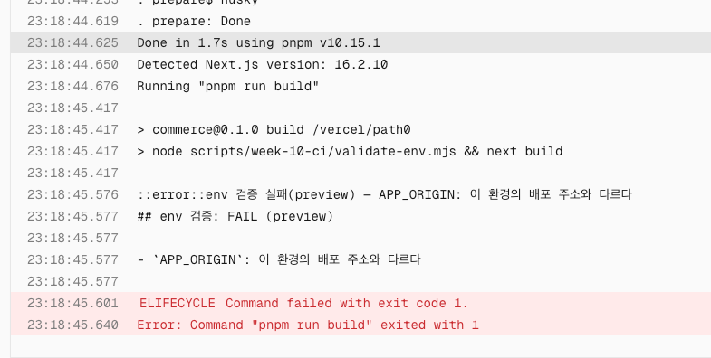
- **실험 잔재 원복** — Preview의 오설정 `APP_ORIGIN` 제거 완료(`vercel env rm`), 실험 PR은 머지 없이 닫는다. `.env.example` 오류값은 실험 브랜치에만 있다.
- **Production 게시 차단·복구** — PR #18 머지(병합 커밋 `27b6220c`) 직전에 Production env에 `NEXT_PUBLIC_AUTH_SESSION_SECRET`(더미값)을 일시 설정해 실전으로 확인했다. [run 34490240780](https://github.com/heeji289/loop-pack-fe-l2-vol1/actions/runs/34490240780) attempt 1: checks·build-e2e(전체 E2E)는 성공했지만 deploy의 Vercel 원격 빌드가 `env 검증 실패(production) — NEXT_PUBLIC_AUTH_SESSION_SECRET: 서버 비밀 변수의 공개 접두 변형`으로 실패 — 게시 미실행, 기존 Production `dpl_Eq3fkz5sezvBXwdXsrpF8f9iddp5`(17:07 게시분)가 그대로 유지됐다. 오설정 제거(`vercel env rm`) 후 **같은 SHA**의 attempt 2에서 deploy 성공, 새 배포 `dpl_Gz8GMaLhdDTDvLTuDQLBbgcERRso`(23:42) 게시 — 검증·배포 SHA 일치. (실패 로그 화면 캡처는 남기지 못했다 — 위 run의 deploy job 로그가 근거다.)

### 티켓 1 재실증 (2026-09-11)

기존 PR #18·#19는 이전 CLI 구현의 기록이다. 생명주기 변경은 env 전용 PR #21 (`1761aeba`)에서 다시 검증했다. 번들 후속 구현과 다른 화면 변경은 이 PR에 포함하지 않았다.

- **로컬**: 테스트 440개·E2E 16개, lint·typecheck·production build, 실제 서버 실행 검사 4종 통과. 첫 전체 실행의 기존 세션 테스트 1개는 타임아웃으로 실패했고 단독 15개와 전체 440개 재실행에서 통과했다. 테스트 기대값이나 timeout을 변경하지 않았다. 당시 배포 응답 판정 함수의 오류 사례 4개 실패·복원 후 5개 통과를 확인했다. 이 검사는 실제 CLI 연결 누락을 잡지 못해 아래 추가 보완에서 대체했다.
- **정상 PR**: [PR #21](https://github.com/heeji289/loop-pack-fe-l2-vol1/pull/21), [run 34501245339](https://github.com/heeji289/loop-pack-fe-l2-vol1/actions/runs/34501245339)에서 checks·build-e2e·guard 성공. 실제 서버 실행 step은 약 3초(16:19:22–25 UTC), build는 약 13초였다. Preview `dpl_BPkigeEfXKUNUC8AgYiSVrfiisVF`의 [동적 인증 API 대상 배포](https://loop-pack-fe-l2-vol1-l1a5ekemh-heeji289-6430s-projects.vercel.app)는 HTTP 401·정확한 앱 JSON 본문으로 검증됐다.
- **오류 PR**: [PR #22](https://github.com/heeji289/loop-pack-fe-l2-vol1/pull/22)의 `8eb4e0b6`, [run 34501339378](https://github.com/heeji289/loop-pack-fe-l2-vol1/actions/runs/34501339378)에서 잘못된 origin과 빈 비밀 공개 변수를 주입했다. checks는 성공, Build는 Next 설정 로딩에서 exit 1(최적화 빌드 미진행), build-e2e·guard 실패, mergeStateStatus BLOCKED를 확인했다. `23e472f5`로 오류값을 원복한 [run 34501597916](https://github.com/heeji289/loop-pack-fe-l2-vol1/actions/runs/34501597916)은 checks·build-e2e·guard 전부 성공했다. PR #22는 병합 없이 닫고 원격 실험 브랜치를 삭제했다.
- **Preview 빌드 오류**: 배포별 `--build-env APP_ORIGIN=ftp://invalid.example`로 `dpl_HzkTjoSwCLuEkXaAFgXd1VZFFyTN`이 build/preview origin 검증에서 실패했다.
- **Preview 서버 오류**: 배포별 `--env AUTH_SESSION_SECRET=loopers-week09-secret`로 `dpl_AMzbe96didWvPCcNhhpT3ihsjMnQ`는 빌드 READY지만 동적 API HTTP 500·후보 검사 exit 1이었다. 런타임 로그는 `env 검증 실패(server/preview) — AUTH_SESSION_SECRET: 배포 환경에서 데모 기본값을 사용했다`와 프로세스 exit 1을 기록했다. 정상 값은 PR Preview에서 위의 HTTP 401·본문으로 확인했다.
- **Production 서버 오류 차단**: 동일 코드의 `--prod --skip-domain` 후보 `dpl_J7ZNj1Sg9qxYtz4JptJKnGQD8Saz`에 같은 오류 인증값을 배포별 주입했다. 빌드는 READY, 실제 API는 HTTP 500, 후보 검사는 exit 1이었다. 런타임 로그의 server/production 검증 오류·프로세스 exit 1을 확인했고 promote하지 않았다. 이후 운영 도메인을 inspect한 ID는 실험 전과 같은 `dpl_Gz8GMaLhdDTDvLTuDQLBbgcERRso`였다.
- **실험 입력 격리**: 공유 Vercel env는 수정하지 않았다. CLI는 로컬 `.env`도 업로드할 수 있어 테스트용 템플릿을 배포 입력에서 제외했다. 이 파일 때문에 최초 Preview 서버 오류 실험은 origin 오류로 빌드부터 실패했고, 파일을 제외한 새 후보에서 서버 오류를 따로 확인했다. 실제 CI deploy는 별도 checkout job이라 이 로컬 파일이 없다.

정상 Production 수동 후보 `dpl_agHUq7VszdFrPxSkXGf6F3pq1ueR`는 실제 Production env로 동적 API 검증을 통과했다. 자동 승격은 최종 PR head `f3c560ea`의 [run 34501780251](https://github.com/heeji289/loop-pack-fe-l2-vol1/actions/runs/34501780251)이 전부 통과한 뒤 병합 SHA `f3b0d1ee`의 main run에서 확인한다. 후보 API 요청에는 배포 보호 우회가 가능한 `vercel curl`을 사용하며, 보호 페이지의 401은 앱 응답과 본문이 달라 통과할 수 없다. 네트워크·보호 인증 실패도 승격을 중단한다. CLI 출력은 `--non-interactive --json`으로 고정해 안내 출력과 URL을 혼동하지 않는다.

- **자동 배포에서 발견한 CLI 인수 오류**: 병합 SHA `f3b0d1ee`의 [run 34501975852](https://github.com/heeji289/loop-pack-fe-l2-vol1/actions/runs/34501975852)은 전체 검증·E2E와 후보 빌드가 성공했지만 CI 인증 요청에서 실패해 promote하지 않았다. 후보 `dpl_48tHdMFvjXf9WhMQ1FWbhrNmKKbq`는 로컬 인증으로는 정상 API 응답을 반환했다. CLI 59.14.0의 curl 인수 파서가 `--token`을 curl 옵션으로 전달하는 경로를 확인했다. CLI가 지원하는 `VERCEL_TOKEN` 환경변수로 인증하고 중복 인수를 제거한다. 실패를 무시하거나 수동으로 승격해 우회하지 않는다.

- **자동 Production 복구·승격 완료**: 인증 인수 수정 [PR #23](https://github.com/heeji289/loop-pack-fe-l2-vol1/pull/23)의 [run 34502734079](https://github.com/heeji289/loop-pack-fe-l2-vol1/actions/runs/34502734079)은 필수 checks·guard·핵심 E2E 성공. 병합 SHA `38fa8487071a5b91f362c815044f475e58ba1d74`의 [main run 34502967531](https://github.com/heeji289/loop-pack-fe-l2-vol1/actions/runs/34502967531)은 checks·전체 E2E·deploy 전부 성공했다. 16:37:14 UTC에 후보 API HTTP 401·본문 검증 PASS, main 최신성 재확인 후 16:37:17에 **동일 후보** `dpl_4RmiC6t1zL6iTbPiYy8UKaMLWHME` 승격 성공. [배포 URL](https://loop-pack-fe-l2-vol1-d92rgm32i-heeji289-6430s-projects.vercel.app)과 운영 도메인 inspect의 ID가 일치했다. build 이후 후보 API 검사까지 약 4초, promote 약 2초가 추가됐다.
- **배포 실증 당시 자체 검증**: 이후 실제 CLI 연결의 자동 검사 공백을 발견해 완료 판정을 보류하고 아래와 같이 보완했다. 이후 발견한 CLI 인증 문제는 동일 요청 경로에서 수정하고 실제 CI 배포의 실패→성공으로 확인했다. 오류 PR은 원복·종료·원격 브랜치 삭제를 완료했고 공유 env는 바꾸지 않았다. 배포 이력은 실패 증거로 보존한다. 후속 번들 예산·PR 코멘트·guard 정책 추출은 이 티켓의 완료에 포함하지 않는다.

### 티켓 1 자동 검사 보완 (2026-09-11)

- `check-env-build.test.ts`(이전 `validate-env.test.ts`에서 분리): 저장소의 `next.config.ts`와 검증 모듈을 복사한 최소 앱에서 실제 `next build`를 실행한다. 런타임 시크릿 없이 성공하고, origin·비밀 공개 변수 오류는 빌드 전에 exit 1로 중단되는지 확인한다. 임시 앱의 외부 node_modules 연결 때문에 Webpack을 사용하며 실제 앱의 프로덕션 빌드는 기존 CI가 담당한다.
- `check-deployment.test.ts`: 함수 호출 테스트를 실제 CLI 실행으로 교체했다. 외부 Vercel 요청만 고정 응답으로 대체하고 정상 401·본문, 500, 보호 페이지, 다른 JSON, 잘못된 200, 빈 응답, URL 오류, 외부 CLI 실패의 종료 코드·진단·summary를 확인한다. Vercel 요청 인수도 검사해 이전 `--token` 전달 오류를 막는다.
- `check-deployment.mjs`: 실패 summary에도 이유를 남긴다. 외부 CLI 오류는 인증·네트워크·인수·기타 실행으로 분류하고 exit·signal·오류 코드를 출력한다. 인증값이 섞일 수 있는 stderr 원문은 게시하지 않는다.
- **실패 검출 증거**: 격리 작업 트리에서 build 검증 호출을 제거하자 새 테스트 2개가 실패했다. 배포 CLI의 응답 판정 호출을 제거하자 5개가 실패했다. 두 변경을 원복한 뒤 관련 테스트 42개가 통과했다. 보완 전에는 두 연결을 제거해도 각각 기존 25개·5개 테스트가 통과했다.
- **보완 검증 완료**: 관련 테스트 42개, 전체 lint·typecheck 통과. 최종 테스트 환경 타입 수정 뒤 배포 CLI 14개와 typecheck·변경 파일 lint도 다시 통과했다.
- 새 테스트는 현재 CI의 전체 unit / CLI integration 실행 대상이다. 원격 배포 실증은 위 main run의 기록이며, 이번 보완은 로컬 실행 검증이다. 별도 재배포나 운영 설정 변경은 하지 않았다.

### 불필요한 env CLI 제거·summary 중복 수정 (2026-09-11)

- 앱과 CI가 호출하지 않는 `validate-env.mjs` 및 이 CLI 전용 `.env.development` 로딩 테스트를 삭제했다. 직접 의존하던 `@next/env`도 제거했다. Next 자체의 env 로딩은 유지된다.
- 변수별 규칙과 호출 시점의 env 반영은 `src/env/validate.test.ts`에서 직접 검사한다. 실제 Next 빌드 연결 3개는 `check-env-build.test.ts`로 분리해 CLI integration 실행 대상에 유지했다. 배포 검사 CLI 테스트는 유지한다.
- Next 16.2.10의 빌드 본체와 Turbopack 빌드·워커는 production-build phase로 설정을 다시 읽는다. 기존 검증 함수는 호출마다 PASS를 append해 동일 summary가 반복됐다. 검증은 매번 실행하되 함수에서는 FAIL만 즉시 기록하고, PASS는 CI Build 명령 성공 뒤 한 번만 기록하도록 바꿨다.
- 반복 성공 검증 3회가 summary를 채우지 않고 이후 실패는 이유와 함께 기록되는 테스트를 추가했다. 수정 전에는 PASS 3개로 실패하는 것을 확인했다. 수정 후 규칙 24개·실제 빌드 3개·배포 CLI 14개(총 41개), lint·typecheck를 통과했고 새 파일들이 unit / CLI integration에서 발견되는 것도 확인했다.

### 티켓 1 제출용 캡처

2026-09-11 사용자 캡처. [과제 3단계 완료조건](../assignments/week-10.md#-3단계--예산-게이트를-걸고-결과를-보이게-해요)의 빨간불·실패 리포트 가시성과 수정 후 복구를 env 게이트에서 확인한 증거다. 번들 초과 대상·실측 크기·임계값·초과량이 보이는 캡처는 번들 티켓에서 별도로 남긴다.

**(1) env 오류의 실패 전파와 원인 표시** — [PR #22](https://github.com/heeji289/loop-pack-fe-l2-vol1/pull/22), SHA `8eb4e0b6`, [실패 run 34501339378](https://github.com/heeji289/loop-pack-fe-l2-vol1/actions/runs/34501339378) (화면의 Quality #56).

기본 checks는 통과하고 build-e2e·required guard가 실패했다. 바로 아래 job summary에는 잘못된 APP_ORIGIN과 빈 값이어도 금지되는 NEXT_PUBLIC_AUTH_SESSION_SECRET이 변수명·이유로 표시된다. 원시 로그를 열지 않고 설정 오류를 알 수 있으며 비밀값은 노출되지 않는다. 이 PR의 deploy 생략은 PR 이벤트 정책에 따른 것이므로 Production 차단 증거와 구분한다.

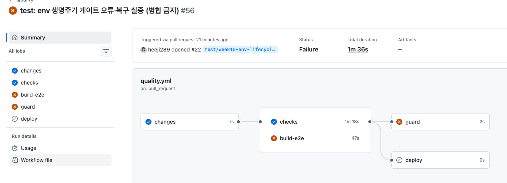

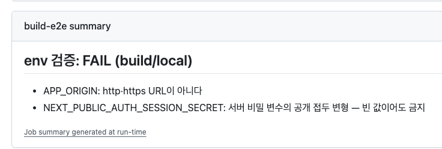

**(2) 같은 실험 PR의 원복 후 성공** — PR #22, SHA `23e472f5`, [복구 run 34501597916](https://github.com/heeji289/loop-pack-fe-l2-vol1/actions/runs/34501597916) (Quality #57).

오류값을 원복하자 checks·build-e2e·guard가 모두 통과했다. 실험 PR은 병합 없이 닫았다. 화면의 #56·#57은 workflow 실행 번호이며 PR 번호는 둘 다 #22다.

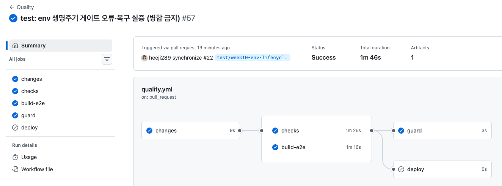

**(3) 실제 Production 후보 검증과 배포 추적성** — SHA `38fa8487071a5b91f362c815044f475e58ba1d74`, [main run 34502967531](https://github.com/heeji289/loop-pack-fe-l2-vol1/actions/runs/34502967531).

summary에 후보의 동적 인증 API HTTP 401·본문 확인 PASS와 Production 배포 SHA·URL이 함께 보인다. 후보 검증 URL과 배포 URL이 같으며, 동일 배포 promote 성공과 운영 도메인의 배포 ID 대조는 위 재실증 기록의 로그 근거로 보완한다. HTTP 401은 미로그인 인증 API의 기대 응답이고 앱의 정확한 JSON 본문까지 검사한 결과다.

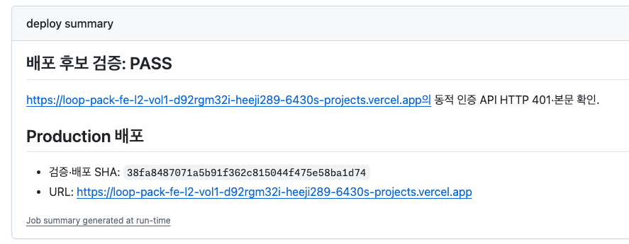
## 3단계 — 번들 예산 게이트

### 대상과 집계 규칙

| 대상 | 수집 방법 |
|---|---|
| 홈 초기 JS | `build-manifest.json`의 `rootMainFiles` ∪ `/(commerce)/page` client-reference-manifest의 `entryJSFiles` 전 세그먼트 합집합 |
| 상품 목록 초기 JS | 같은 방식, `/(commerce)/products/page` |
| 공유 JS | 두 화면 파일 목록의 교집합 — 별도 표시만 하고 화면별 합계와 다시 더하지 않는다 |

- 집계는 **파일별 Brotli(q11) 압축 후 합산** (`@size-limit/file` 13.0.3 기본). 리포트에 단위(B·KiB)와 압축 방식을 명시하고, CI 고정 압축값을 실제 HTTP 전송량과 구분한다.
- **`polyfillFiles`는 제외한다 (리뷰 반영 정정)**: HTML에서 `noModule` 속성으로 렌더링되는 레거시 polyfill(Brotli 35,158 B)이라 현대 브라우저는 다운로드하지 않는다. 초기 반영안은 이를 포함해 세 합계가 각각 35,158 B 크게 측정됐다.
- Turbopack 빌드(Next 16.2.10)는 `app-build-manifest.json`을 내지 않아 위 조합으로 수집했고, `next start`로 서빙한 두 화면의 HTML `<script>` 목록과 대조했다 — 홈은 스크립트 12개 중 `noModule` polyfill 1개를 제외한 11개가 수집 목록과 정확히 일치한다. HTML 대조는 마크업상의 요청 후보 확인이며, `noModule` 분기는 [MDN 명세](https://developer.mozilla.org/en-US/docs/Web/HTML/Reference/Elements/script#nomodule)를 근거로 한다. 해시 파일명은 고정하지 않는다(`.size-limit.mjs`가 매 빌드 매니페스트에서 계산).
- 서버 JS·source map·타 화면 청크는 수집 구성상 포함되지 않는다. 매니페스트·대상 파일 누락, 교집합 0개, 임계값 누락은 모두 검사 실패다 — 빈 검사가 통과로 남지 않는다.
- **Hero 원본 이미지는 대상에서 제외 (사용자 결정, 2026-09-10)**: ADR-10의 초기 목록에 있었으나 "정적 자산 원본 감시는 과하다, 번들 JS만 보자"로 축소했다. 정적 파일이라 빌드로 회귀하지 않고, 이미지발 LCP 회귀는 정기 Lighthouse 측정이 감시한다.
- **알려진 사각지대 — 지연 로딩 청크**: 과제 요구사항이 "주요 진입점의 번들 예산"이라 화면의 **초기** JS만 대상으로 뒀다. 따라서 Dialog 안에서 `import()`로 불러오는 무거운 라이브러리처럼 초기 요청에 없는 청크는 이 예산에 걸리지 않는다. 앱 전체 청크 총량(`.next/static/chunks/**`, 현재 gzip 272.5 KB·Brotli 236.9 KB)에 상한을 하나 더 두면 이 구멍은 막히지만, ADR-10에서 "페이지 전수·총량 예산은 소음"으로 제외한 결정을 유지했다 — 총량은 아무도 받지 않는 청크와 모두가 받는 청크를 같은 무게로 세고, 화면 추가 같은 정당한 증가에도 반응한다. 지연 청크가 실제로 커지는 상황이 생기면 그때 총량 상한을 재검토한다.

### 기준선 측정 (2026-09-11, polyfill 제외 기준)

같은 조건에서 **빌드부터 3회** 반복: SHA `27b6220c`의 **깨끗한 git worktree**(진행 중인 워킹트리 수정 배제) · Darwin arm64(로컬) · Node 24.17.0 · pnpm 10.15.1 · lockfile `5b33d582…` · `rm -rf .next && next build` 후 size-limit 측정.

| 대상 | 1회 | 2회 | 3회 | 중앙값 C | 범위 R |
|---|---|---|---|---|---|
| 홈 초기 JS | 155,779 B | 155,779 B | 155,779 B | **155,779 B** (152.1 KiB) | 0 |
| 상품 목록 초기 JS | 159,533 B | 159,533 B | 159,533 B | **159,533 B** (155.8 KiB) | 0 |
| 공유 JS | 149,479 B | 149,479 B | 149,479 B | **149,479 B** (146.0 KiB) | 0 |

세 번 모두 바이트까지 동일 — 같은 환경·경로에서는 빌드가 결정적이라 측정 노이즈 몫이 없다.

**경로 민감성 관찰**: 같은 SHA를 메인 레포 디렉터리에서 빌드하면 워크트리 측정 대비 −30/−11/−32 B 수준의 차이가 났다(메인 트리에는 미커밋 수정도 섞여 있어 원인 분리는 안 했지만, 프로젝트 경로가 산출물에 스며드는 영향으로 추정). 절대값은 환경·경로별로 ~0.02% 흔들릴 수 있고 여유율 10%가 흡수한다. CI(ubuntu)·Vercel 실측은 아래 「세 환경의 측정값 일치」에 기록했다 — 두 환경이 서로 바이트까지 같고 로컬과는 목록에서만 29 B 차이다.

### 7주차 값 확보 — 원자료 부재를 재측정으로 메웠다

7주차 기록에서 JS 크기를 직접 인용할 수는 없었다. waterfall 표에는 document(7.4 KiB gzip)와 `hero-original.jpg`(7,368 KiB) 두 행만 있고, 스크린샷 원본([03-waterfall.png](../week-07-performance/r0-before/03-waterfall.png))도 Network 패널이 아니라 Performance 패널 녹화라 요청별 전송 크기가 찍혀 있지 않다. Hero 관련 값(7,368 KiB → 409 kB)은 이미지 **전송량**이라 JS 예산의 근거로 쓰지 않는다.

대신 **7주차 SHA를 같은 도구로 다시 측정**했다. `d3c6b8d5`(7주차 최종)와 현재의 Next·React 버전이 **16.2.10 / 19.2.4로 동일**해 번들러 산출 방식이 같고, SHA를 뺀 조건(도구·압축·집계·머신)을 모두 맞출 수 있어 비교가 성립한다.

측정 방법의 신뢰성부터 확인했다. 위 수집식을 복제한 스크립트로 현재 빌드를 재니 `@size-limit/file` 실행 결과와 세 대상 모두 **바이트까지 일치**(155,749 / 159,522 / 149,447 B — 미커밋 워킹트리 빌드 기준)했다. 같은 스크립트를 7주차 워크트리 빌드에 적용했다.

| 대상 | 7주차 `d3c6b8d5` | 현재 `27b6220c` | 증가 |
|---|---|---|---|
| 홈 초기 JS | 151,784 B | 155,779 B | +3,995 B (+2.6%) |
| 상품 목록 초기 JS | 155,663 B | 159,533 B | +3,870 B (+2.5%) |
| 공유 JS | 141,886 B | 149,479 B | +7,593 B (+5.4%) |

**이 값이 임계값 근거에서 하는 역할**: 7주차(2026-08-07)부터 지금까지 예산 없이 지낸 약 한 달 동안 초기 JS가 2.5~5.4% 늘었다. 아래 임계값은 7주차 대비 +12.7~15.9% 지점에 있어, **지금까지의 증가 속도라면 서너 달치 여유**에 해당한다. 즉 여유율 10%는 현재값에만 걸린 임의 배수가 아니라, 실제로 관측된 증가 속도와 대조해 "이 정도 쌓이면 멈춰 세운다"를 정한 값이다.

**한계**: 7주차 당시에 실제로 잰 수치가 아니라 지금 재현한 값이다. 원본 기록이 남았다면 그쪽이 우선이며, 이후 측정 기록에는 화면별 JS 크기를 함께 남긴다. 파일 수가 13개(7주차) → 11개(현재)로 줄고도 총량이 는 것은 청크 분할 방식이 달라졌기 때문으로 보이며, 원인은 분리하지 않았다. Hero 원본 7,545,239 B가 7주차 기록 7,368.4 KiB와 일치함은 교차 확인용으로만 남긴다.

### 임계값 결정 (사용자, 2026-09-11)

공식 `C + R + C×N%`에서 R=0, **N=10%**. 반올림 없이 바이트 내림.

| 대상 | 임계값 |
|---|---|
| 홈 초기 JS | 171,356 B |
| 상품 목록 초기 JS | 175,486 B |
| 공유 JS | 164,426 B |

- **선택 이유**: 앞으로 라이브러리 추가가 활발해질 수 있어, 소형 증가마다 예산 재결정 마찰이 생기는 5%보다 라이브러리급(+19KB↑)부터 멈춰 세우는 10%를 택했다. 위 7주차 대비 실측(한 달에 2.5~5.4%)과 대조하면 서너 달치 여유에 해당한다.
- **수용한 트레이드오프**: ~19KB 미만 증가는 조용히 통과한다. 이 구간 감시가 필요해지면 실측 근거를 들고 재결정한다.
- **정정 (2026-09-11, 실측)**: 이 항목의 원래 예시였던 "zod가 실수로 클라이언트 번들에 들어가는 ~13KB급"은 **틀린 추정이었다**. `origin/main` 산출물에 zod 검증을 쓰는 클라이언트 컴포넌트를 하나 넣고 재보니 홈 초기 JS가 155,749 B → 228,629 B로 **+72,880 B(+46.8%)** 늘었다(Brotli q11, 같은 방식). 즉 zod 유입은 이 여유로 묵인되는 게 아니라 **즉시 빨간불이다.** 참고로 같은 조건에서 `@floating-ui/react` 기반 Select를 공용 헤더에 넣으면 +10,645 B로 여유 안에 들어온다 — 실제로 묵인되는 것은 이런 컴포넌트급 증가다.
- 검토한 대안: 2%(사실상 증가 금지)·5%(소형 라이브러리부터 차단). 측정 범위가 0이라 여유율 전체가 "묵인량"의 의미다. size-limit 문서는 초기 상한 예시로 현재 크기 +25%를 안내하지만([README](https://github.com/ai/size-limit)), 그 값은 라이브러리 배포용 예시이고 이 저장소의 실측 증가 속도를 반영하지 않아 따르지 않았다.
- **예산을 움직이는 규칙**: 초과 PR에 맞춘 자동 상향은 하지 않는다. 반대로 **큰 최적화로 크기를 줄였다면 예산도 함께 내려** 개선분이 다시 잠식되지 않게 한다. 어느 방향이든 새 측정 근거와 이유를 이 문서에 남긴 뒤 바꾼다.

### 게이트 배선과 검증

**예산 검사는 build 스크립트에서 분리했다 (2026-09-11 재검토).** 처음에는 `"build": "next build && check-budget"`으로 묶어 "어디서 빌드하든 예산이 함께 돈다"를 노렸는데, 검토해 보니 성격이 다른 두 실패를 같은 종료 코드로 묶는 구조였다. env 오류는 산출물 자체가 무효라 build를 막는 게 맞지만, **예산 초과는 산출물이 정상인데 정책상 크다는 판단**이다. 후자를 build 실패로 만들면 유효한 산출물을 만드는 일까지 정책이 막는다.

묶었을 때 실제로 치르던 비용은 둘이다. ① `playwright.config.ts`의 로컬 경로가 `pnpm build && pnpm start`라, 예산을 넘긴 상태에서는 **E2E를 아예 실행할 수 없다** — 크기 정책이 기능 테스트를 막는다. ② `vercel.json`이 `main`만 git 배포를 껐고 PR Preview는 켜져 있어, 초과 PR은 **Preview 배포까지 잃는다**. "이 증가가 정당한가"를 판단해야 할 때 판단 재료인 화면이 사라진다. 여기에 `pnpm build`가 "컴파일 되나?"에 답하지 못하게 되는 문제도 있었고, 문서에 남겼던 우회로(`pnpm exec next build`)의 존재 자체가 결합이 새고 있다는 신호였다.

분리 후 배선은 이렇다.

| 실행 위치 | 명령 | 막는 것 |
|---|---|---|
| CI build-e2e job | build step 다음의 `Bundle budget` step (`pnpm check:budget`) | main 병합 (guard 전파) |
| 로컬 전체 검증 | `pnpm check`의 build 다음 | 작성자가 올리기 전에 발견 |
| Vercel 배포 빌드 | `vercel.json`의 `buildCommand` — `VERCEL_ENV = production`일 때만 | Production 게시 |

`pnpm build` = `next build`로 되돌렸고, Next 설정 로딩의 빌드용 env 검증은 그대로다. 서버용 env는 `instrumentation.register()`가 맡는다.

**Preview를 일부러 제외했다.** Preview가 초과로 실패해도 얻는 게 없다 — 병합은 이미 CI 예산 검사가 막고 있고, 잃는 것은 리뷰어가 볼 화면이다. 반대로 Production은 게시 직전이라 막을 실익이 있다. 조건문 의미(production만 실행, build 실패 시 미실행)는 같은 셸 표현식을 로컬에서 `VERCEL_ENV` 세 경우로 실행해 확인했고, 실제 초과 상태에서도 확인했다(아래 「Preview 제외 실증」).

**배포 경로 실증 완료 (2026-09-11)**: [PR #28](https://github.com/heeji289/loop-pack-fe-l2-vol1/pull/28) 병합 커밋 `8ac18380`의 [run 34513756401](https://github.com/heeji289/loop-pack-fe-l2-vol1/actions/runs/34513756401) deploy job 로그에서 Vercel 원격 빌드가 `vercel.json`의 명령을 그대로 실행하는 것을 확인했다.

```
Running "pnpm build && if [ "$VERCEL_ENV" = production ]; then pnpm check:budget; fi"
> commerce@0.1.0 check:budget /vercel/path0
## 번들 예산: PASS
```

Production 후보 검증 후 같은 배포를 승격했다(`dpl_3sbQkLzH4pvofexvGwjugbxF8jve`). 이로써 "게시할 산출물에도 예산을 적용한다"가 설정 근거가 아니라 실행 근거가 됐다.

**Preview 제외 실증 (2026-09-11)**: 아래 빨간불 실험의 초과 커밋 `57697d5e`(홈 +35.4% 초과)에서 **Vercel Preview 배포는 success였다.** 같은 SHA의 CI는 `Bundle budget`에서 실패했으니, Preview 빌드에서는 `check:budget`이 실행되지 않았다는 뜻이다 — 실행됐다면 exit 1로 빌드가 깨졌을 것이다. `VERCEL_ENV` 분기가 실제 초과 상태에서 의도대로 동작했고, 예산을 넘긴 PR에서도 리뷰어가 볼 화면이 남는다는 설계 의도가 성립했다.

| 커밋 | CI 예산 | Vercel Preview |
|---|---|---|
| `57697d5e` (초과) | ❌ `Bundle budget` 실패 | ✅ success ([배포](https://vercel.com/heeji289-6430s-projects/loop-pack-fe-l2-vol1/9i78YGLSzvWcyqePg5ZmdTW6WjoZ)) |
| `af6d63ad` (복구) | ✅ PASS | ✅ success |

이 실증은 빨간불 실험의 부산물이다 — Preview를 깨뜨리려고 따로 만든 상황이 아니라, 초과 PR을 만들었더니 Preview가 살아남은 것을 확인한 것이다.

### 세 환경의 측정값 일치 (2026-09-11)

| 대상 | 로컬 Darwin arm64 | CI ubuntu ([run 34512796761](https://github.com/heeji289/loop-pack-fe-l2-vol1/actions/runs/34512796761)) | Vercel 원격 빌드 |
|---|---|---|---|
| 홈 초기 JS | 155,749 B | 155,749 B | 155,749 B |
| 상품 목록 초기 JS | 159,522 B | 159,551 B | 159,551 B |
| 공유 JS | 149,447 B | 149,447 B | 149,447 B |

CI와 Vercel은 **세 대상 모두 바이트까지 동일**하다. 로컬과는 목록에서만 29 B(+0.018%) 차이가 나는데, 위 「경로 민감성 관찰」의 ~0.02%와 같은 크기다. 예산 step 실행 시간은 CI에서 **1초**(18:21:37→18:21:38)로 로컬 중앙 1.07초와 일치한다 — required 판단에 쓴 비용 근거가 CI에서도 확인됐다.

- 예산 설정(`budget.json`)·수집(`.size-limit.mjs`)·검사(`check-budget.mjs`)는 기존 변경 필터에서 docs 목록 밖이라 자동으로 런타임(빌드·검증 입력)으로 분류된다.
- 실행 검사 `check-budget.test.ts` 9케이스(integration-cli, 모든 PR 실행): 정상 통과·**임계값 동일 통과**·초과 시 초과량/초과율 표시·대상 파일 누락·산출물 없음·임계값 누락 실패, 그리고 기준선 있음/없음·다음 기준선 기록. 실제 명령의 종료 코드와 공개 출력을 검증한다. 첫 실행에서 설정 오류 시 size-limit이 `{error}` JSON을 내는 경로 미처리를 빨간불로 잡아 고쳤다.
- summary·stdout에 대상·집계·측정값·base 대비 증가량·임계값·여유/초과량·초과율 표를 남기고, 같은 결과를 `reports/budget.md`(비추적)로도 남긴다 — PR 코멘트 게시가 재측정 없이 소비한다. 측정 실패(대상 누락·수집 실패)일 때도 같은 파일에 미측정 사유를 남겨 코멘트가 원인을 그대로 싣는다.
- **base 대비 증가량**은 main push가 남긴 `reports/budget.json`을 Actions 캐시(`budget-baseline-main-<sha>`, 없으면 접두 일치로 최근 main)로 받아 예산 검사가 계산한다. base를 다시 빌드하지 않아 PR 비용은 그대로다. 기준선이 없으면 열을 생략하고 그 사실을 적는다 — 증가량을 지어내지 않는다.
### 빨간불·복구 실증 (2026-09-11, PR #35)

예산 검사가 한 번도 실패해 본 적 없으면 잘 도는 것과 조용히 생략되는 것을 구별할 수 없다. 검사기 테스트는 픽스처를 주면 스크립트가 종료 코드 1을 낸다는 것까지만 증명하고, 그 뒤의 사슬(실제 코드 증가 → 예산 step 실패 → build-e2e 실패 → guard 실패 → required 병합 차단 → 코멘트 표시 → 원복 초록불)은 덮지 않는다. [실험 PR #35](https://github.com/heeji289/loop-pack-fe-l2-vol1/pull/35)로 그 사슬을 밟았고 **머지 없이 닫았다**.

**무엇을 키웠나.** 임계값을 낮추거나 압축으로 사라지는 주석을 넣지 않았다. 커머스 공용 헤더에 표시 통화 선택을 넣고 저장된 설정을 zod 스키마로 검증하게 했다 — 코드 자체는 타당하지만 공용 레이아웃이라 **zod가 홈·목록 초기 클라이언트 번들로 딸려 들어온다.** RFC가 이미 위험으로 지목해 둔 시나리오다.

| 구분 | SHA | run | 홈 초기 JS | 판정 |
| --- | --- | --- | --- | --- |
| 빨간불 | `57697d5e` | [34518767357](https://github.com/heeji289/loop-pack-fe-l2-vol1/actions/runs/34518767357) | 231,993 B (임계 171,356) | **초과 60,637 B (+35.4%)** |
| 초록불 | `af6d63ad` | [34519214029](https://github.com/heeji289/loop-pack-fe-l2-vol1/actions/runs/34519214029) | 159,491 B | 여유 11,865 B |

빨간불에서 목록은 +57,081 B(+32.5%), 공유는 +66,237 B(+40.3%) 초과였다. 복구는 **임계값·검증 조건을 그대로 둔 채** 클라이언트 zod 의존만 걷어냈다 — 확인할 것이 "아는 통화 코드인가" 하나뿐이라 목록 대조로 대체했고 기능과 방어 범위는 유지했다. 통화 선택 기능 자체가 남긴 증가(+3,742 B)는 여유 안이다.

**차단이 실제로 걸렸다.** 빨간불 run의 job 결과는 `changes` ✅ · `checks` ✅ · `build-e2e` ❌ · `guard` ❌ · `deploy` skipped였고, 실패 step은 `Bundle budget` 하나다. guard 주석은 `guard 실패 — build·E2E job이 성공하지 않았다 (failure)`. PR의 병합 상태는 `mergeable=MERGEABLE`이지만 `mergeStateStatus=BLOCKED` — required가 막았다는 뜻이다. lint·typecheck·490개 테스트는 전부 통과했으므로 **빨간불의 원인은 예산 게이트 하나로 격리된다.**

**설계 의도 두 가지가 함께 확인됐다.**

- 예산이 실패해도 `Server env lifecycle`은 계속 돌아 ✅로 판정됐고, 코멘트의 env 절은 "미측정"이 아니라 PASS로 표시됐다. 예산 실패가 env 판정을 가리지 않는다.
- Vercel Preview 배포는 성공했다. 예산 게이트를 Production에만 걸어 둔 결정대로, 초과 PR에서도 리뷰어가 볼 화면이 남는다.

**코멘트만으로 판독된다.** 원시 로그를 열지 않고 대상·집계·측정값·base 대비 증가량·임계값·초과량·초과율을 읽을 수 있었고, 아티팩트 `gate-reports`의 `budget.md`와 대조해 같은 값임을 확인했다. 코멘트는 **하나가 유지된 채 갱신**됐다 — 원복 후에도 새 댓글이 생기지 않고 같은 코멘트가 run `34519214029`·SHA `af6d63ad` 기준 PASS로 바뀌었다.

**두 채널이 같은 결과를 싣는다.** 코멘트와 job summary를 나란히 놓고 대조했다 — 세 대상의 측정값·base 대비·임계값·초과량·초과율이 자릿수까지 같고, 아티팩트 `gate-reports`의 `budget.md`와도 같다. 표시를 위해 검사를 다시 돌리지 않는다는 계약이 실제로 지켜진다.

| | 빨간불 (`57697d5e`) | 초록불 (`af6d63ad`) |
| --- | --- | --- |
| PR 코멘트 | 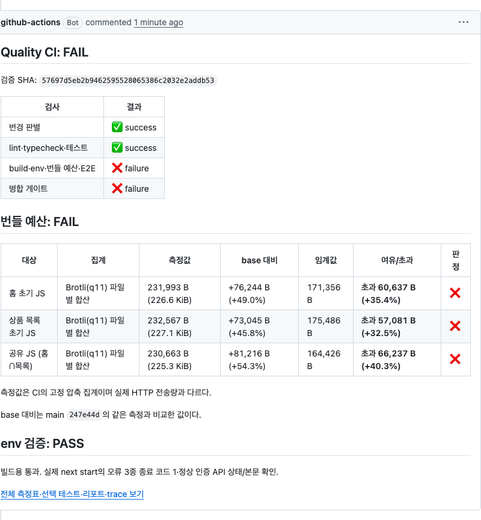 | 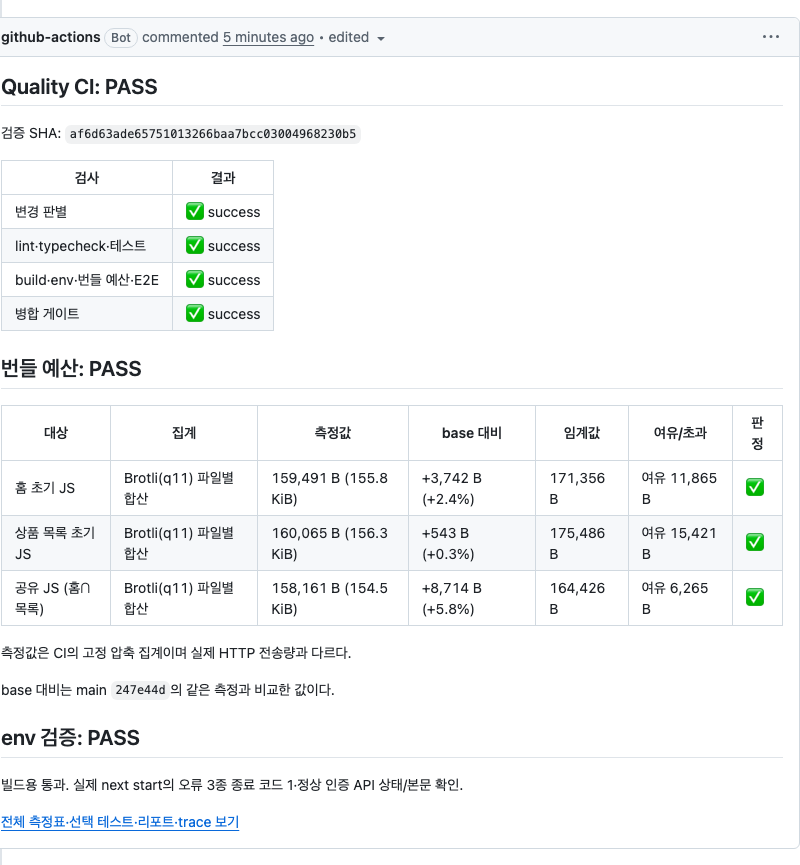 |
| job summary | 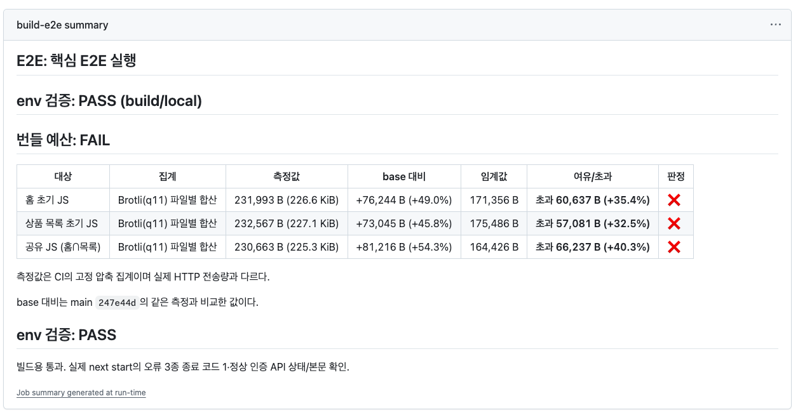 | 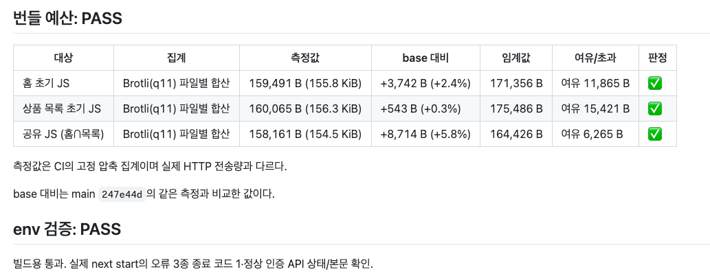 |
| run 전체 | 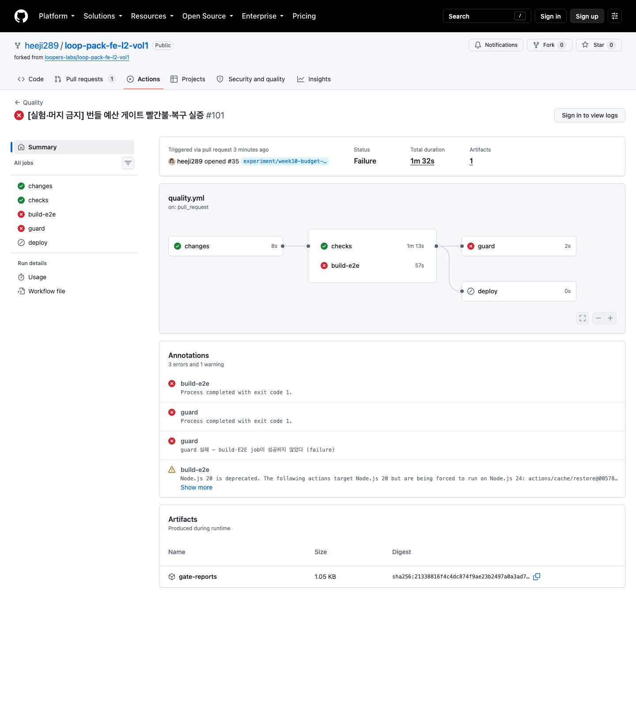 | 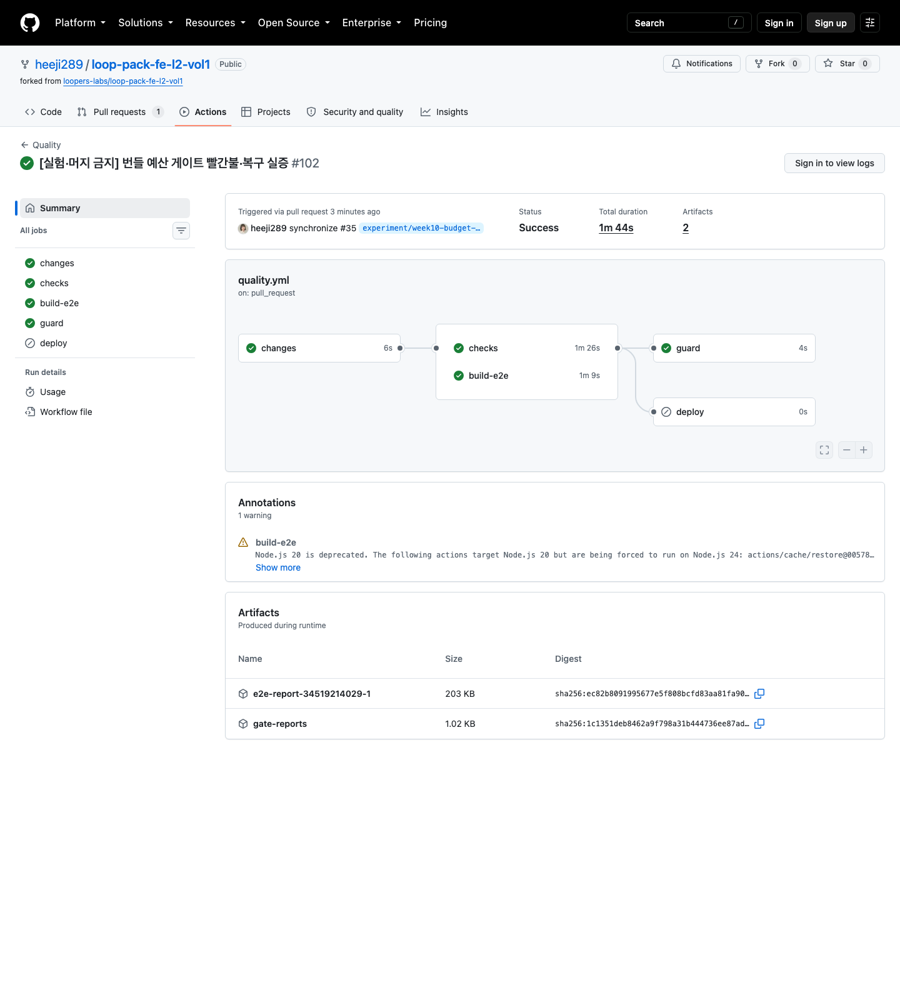 |

**대조하다 찾은 것 — summary의 `env 검증` 제목 중복.** 위 캡처 시점의 summary에는 `env 검증: PASS (build/local)`(Build step)과 `env 검증: PASS`(서버 실행 검사)가 **같은 제목으로 두 번** 찍혀 있었다. 검증 시점이 둘이라 중복 기록은 아니지만, 읽는 쪽에서는 같은 판정이 두 번 나온 것으로 보인다.

Build step의 성공 기록을 지워 정리했다. 서버 env 실행 검사의 판정이 이미 `빌드용 통과. 실제 next start의 …`로 **두 단계를 묶어** 서술하므로, 앞의 한 줄은 그것과 겹치기만 한다. 실패는 각 검증 지점이 그 자리에서 남기므로 잃는 정보가 없다 — 지금은 어느 경로에서도 `env 검증` 제목이 정확히 하나이고, 실패일 때는 제목이 단계를 밝힌다.

| 경로 | summary·`reports/env.md`에 남는 판정 |
| --- | --- |
| 빌드용 env 오류 | `env 검증: FAIL (build/local)` + 변수명·이유 |
| 서버 실행 검사 실패 | `env 검증: FAIL (서버 실행)` + 실패한 검사 이름 |
| 둘 다 통과 | `env 검증: PASS` (본문이 두 단계를 서술) |

코멘트는 `reports/env.md`를 그대로 싣는 계약이라 이 정리가 두 채널에 함께 반영된다.

### required 판단 — env와 같이 별도 check를 만들지 않았다

| 축 | 근거 |
|---|---|
| 실행 비용 | 로컬 실측 0.90 / 1.07 / 1.42초 (중앙 1.07초, Darwin arm64). 세 대상의 원본 합계 약 1.8 MB(중복 포함, 홈 612 KB·목록 624 KB·공유 592 KB)를 Brotli q11로 압축하는 비용이 대부분이다. CI(ubuntu) 실측 **1초**(run 34512796761)로 로컬 중앙값과 일치 |
| 실패 변동성 | 결정적 — 같은 산출물이면 바이트까지 같고(기준선 3회 범위 0) 네트워크·외부 서비스 의존이 없다 |
| 현재 실패 리스크 | 여유 약 15 KB(9~10%). 라이브러리급 증가에서만 빨간불이 되고 정상 상태 오탐은 없다 |

예산 검사는 build-e2e job 안의 별도 step(`Bundle budget`)이라 실패가 build-e2e 실패 → 이미 required인 guard 실패로 전파된다. **step으로 나눈 것과 job으로 나누는 것은 다르다** — step 분리는 build와 판정의 책임을 가르고 실패 지점을 로그에서 바로 보이게 하는 반면, 1초짜리 검사에 별도 job·required check를 만들면 checkout·install 비용이 검사 자체보다 커진다. 그래서 step은 나누고 job은 나누지 않았다.

## 3단계 — Lighthouse assertion

### 실행 조건 점검 — mobile 기본값 발견과 Desktop 전환

2단계의 수동 dispatch run [34442293948](https://github.com/heeji289/loop-pack-fe-l2-vol1/actions/runs/34442293948)(main@`8e54c236`, 2026-09-10, ubuntu-latest, LHCI 0.15.1 · Lighthouse 12.6.1, simulate 스로틀링)의 리포트 `configSettings`는 formFactor **mobile**(RTT 150 ms · 1,638 kbps · CPU 4x)이다 — 설정 없이 실행한 LHCI 기본값. 스펙과 [7주차 측정 절차](../week-07-performance/measure-protocol.md)의 전제는 Desktop(1350×940 · RTT 40 ms · 10 Mbps · CPU 1x)이라 서로 어긋난다.

**결정 (사용자, 2026-09-11)**: `collect.settings.preset: "desktop"`으로 전환한다. 7주차와 같은 프리셋으로 비교 맥락을 잇는다. 다만 하드웨어(CI 러너 vs 로컬 Mac)·headless 여부는 여전히 달라 7주차 값을 cutoff로 직접 쓰지 않고, 임계값은 전환 후 CI 분포에서 정한다.

기존 mobile 측정 원자료 (run 34442293948, 각 3회 — 조건 기록용, 임계값 근거로 쓰지 않음):

| URL | 지표 | 1회 | 2회 | 3회 | 중앙값 | 범위 |
|---|---|---|---|---|---|---|
| 홈 | LCP | 3220.541 ms | 2846.973 ms | 2665.2675 ms | 2846.973 ms | 555.2735 ms |
| 홈 | CLS | 0.005005 | 0.005005 | 0.005005 | 0.005005 | 0 |
| 홈 | FCP | 925.694 ms | 911.982 ms | 915.414 ms | 915.414 ms | 13.712 ms |
| 홈 | TTFB | 152.714 ms | 11.414 ms | 9.499 ms | 11.414 ms | 143.215 ms |
| 목록 | LCP | 3293.076 ms | 3265.2825 ms | 3199.732 ms | 3265.2825 ms | 93.344 ms |
| 목록 | CLS | 0 | 0 | 0 | 0 | 0 |
| 목록 | FCP | 764.384 ms | 764.626 ms | 761.732 ms | 764.384 ms | 2.894 ms |
| 목록 | TTFB | 17.932 ms | 11.956 ms | 11.165 ms | 11.956 ms | 6.767 ms |

홈 CLS의 `numericValue` 원값은 3회 모두 `0.00500509661830313`이다(표는 표시 축약). TTFB 1회차만 튀는 것은 두 URL 공통(서버 워밍업 추정)이며, 중앙값 집계가 이 outlier를 걸러낸다.

**7주차 값과의 비교 한계**: 7주차 홈 LCP 중앙값 0.8 s·범위 0.4 s·CLS 0.006, 목록 slow 시나리오 LCP 0.7 s·CLS 0. ① 프리셋(Desktop vs 현재 mobile)·하드웨어·headless가 달라 수치 직접 비교가 성립하지 않는다. ② 7주차 목록 값은 `?scenario=slow`(1.5초 대기) 측정인데도 LCP가 스트리밍 API 대기를 충분히 반영하지 못한 한계가 기록돼 있고, 현재 CI는 시나리오 파라미터 없는 기본 `/products`라 시나리오도 다르다. 7주차 값은 "전송 크기가 LCP를 지배한다"는 발견의 맥락 인용으로만 쓴다.

### assertion 설계 (합의, 2026-09-11)

- **판정 대상은 LCP·CLS만** error로 둔다. FCP·TTFB는 리포트로 함께 보고하되 근거 없는 cutoff를 추가하지 않는다. 종합 점수 cutoff도 없다.
- **집계는 지표별 중앙값** — `aggregationMethod: "median"` (3회 값의 중앙값으로 판정).
- **임계값 공식은 번들 예산과 동일한 `C + R + C×N%`**. 게이트가 판정하는 환경(CI ubuntu)의 분포에서 C·R을 뽑는다 — 조건이 다른 7주차·로컬 값을 cutoff로 옮겨 쓰지 않는다.
- **실행 시점은 정기·수동만** (기존 step 조건 유지). PR required·Production 배포 조건에 연결하지 않는다.
  - 비용: Lighthouse step은 **87초**(mobile, run 34442293948) → **88초**(desktop, run 34504508321). 프리셋 전환으로 실질 변화 없다. 모든 PR에 붙이면 PR당 이 시간이 추가된다.
  - 변동성: 같은 run 안에서도 홈 LCP 범위 555 ms(중앙값의 19.5%, mobile 기준)로, 코드 무관 흔들림이 PR 게이트에선 거짓 빨간불이 된다.
  - 현재 리스크: 전송 크기 회귀는 PR의 결정적 번들 예산이 차단하고(7주차의 발견 — 전송 크기가 LCP를 지배), Lighthouse는 그 밖의 로딩 성능 악화를 정기적으로 감시한다.
- **실패 시 리포트 보존**: `lhci autorun`(0.15.1 소스 확인)은 healthcheck→collect→assert→upload 순서이며 assert 실패를 기억해 두고 upload까지 마친 뒤 exit 1로 끝난다. workflow의 artifact 업로드 step도 `!cancelled()` 조건이라 빨간불 run의 리포트가 남는다 — workflow 변경 불요.

### 로컬 검증 (2026-09-11, Darwin arm64 — 판정 메커니즘 확인용, CI 분포 아님)

조건: **미커밋 워킹트리**(base `27b6220c` 이후 3단계 진행분 포함 — 임계값 근거가 아니라 판정 메커니즘 검증이 목적이라 수용) · Node 24.17.0 · `pnpm build` 후 `lhci collect`(LHCI 0.15.1, desktop preset, 각 3회, Lighthouse 12.6.1) 원자료:

| URL | 지표 | 1회 | 2회 | 3회 | 중앙값 | 범위 |
|---|---|---|---|---|---|---|
| 홈 | LCP | 740.910 ms | 532.660 ms | 626.909 ms | 626.909 ms | 208.250 ms |
| 홈 | CLS | 0.072461 | 0.072461 | 0.072461 | 0.072461 | 0 |
| 홈 | FCP | 280.364 ms | 252.660 ms | 258.606 ms | 258.606 ms | 27.704 ms |
| 홈 | TTFB | 375.823 ms | 28.340 ms | 22.991 ms | 28.340 ms | 352.832 ms |
| 목록 | LCP | 695.808 ms | 669.062 ms | 602.058 ms | 669.062 ms | 93.750 ms |
| 목록 | CLS | 0 | 0 | 0 | 0 | 0 |
| 목록 | FCP | 219.404 ms | 208.708 ms | 208.058 ms | 208.708 ms | 11.346 ms |
| 목록 | TTFB | 23.185 ms | 28.041 ms | 20.611 ms | 23.185 ms | 7.430 ms |

임시 assert 설정 3종으로 판정을 대조했다 (모두 위 동일 산출물 대상):

1. **초과**: CLS ≤ 0.02 → 홈 실패, 출력에 `expected <=0.02 / found 0.07246101290432143 / all values 3회`가 표시돼 원시 로그 없이 초과량을 판독할 수 있다.
2. **정상**: CLS ≤ 0.1 → 전체 통과 (`All results processed!`).
3. **중앙값 집계 증명**: LCP ≤ 600 ms를 홈의 min(532.660) < 600 < 중앙값(626.909) 사이에 두면 median 집계는 홈·목록 모두 실패하고 found가 각 중앙값(626.909 · 669.062)과 손 계산 결과로 일치한다. 같은 임계값을 optimistic 집계로 바꾸면 found가 최솟값(602.058)으로 바뀐다 — 판정이 실제로 지표별 중앙값을 쓴다.

**관찰**: desktop viewport에서 홈 CLS가 0.072461(3회 동일)로, mobile 0.005005·7주차 desktop 0.006과 크게 다르다. layout-shifts 상세에서 `body > main.week05-page` 전체가 1회 시프트한다.

**해석 (최초 가설, 반증됨)**: 처음엔 웹폰트 스왑·상단 요소 늦은 마운트를 추정했으나 아래 원인 규명에서 반증됐다.

### 홈 CLS 0.0725 원인 규명 (2026-09-11, 로컬 Darwin arm64 · Lighthouse CLI 12.6.1)

환경 탓인지 코드 탓인지 세 가지 대조로 분리했다:

1. **headed vs headless** — 같은 조건에서 창을 띄운 Chrome 3회·`--headless=new` 3회 모두 CLS 0.07246, 같은 시프트(`main.week05-page`). headless 여부는 무관하다.
2. **7주차 SHA 재측정** — `d3c6b8d5`를 worktree로 빌드해 같은 로컬·같은 도구로 측정: 역시 0.07246. **7주차 이후 코드 회귀가 아니다** (SHA만 다르고 조건 동일한 비교).
3. **실브라우저 로드** — Playwright(실제 viewport 1350×940, 스로틀 없음)의 layout-shift 관찰: 유일한 시프트 0.00657, hero copy가 440×132 → 440×239로 성장(Suspense 배너 도착, 이동 107 px). **7주차 기록 0.006과 일치한다.**

LH trace의 유일한 LayoutShift 이벤트가 차이를 설명한다: main이 `(75,0,1200,931) → (68,0,1200,940)` — 콘텐츠가 늘어나 **클래식 스크롤바(15 px)가 생기면서 가운데 정렬된 main 전체가 7 px 좌측 이동**했고, 같은 프레임에 hero copy 성장(frame_max_distance 107)이 묶였다. impact 영역이 화면의 약 89%로 확대돼 0.894 × (107/1350) ≈ 0.071 ≈ 0.0725가 된다.

**결론**: 앱의 실제 시프트는 hero copy 성장 하나(≈0.006, 7주차에도 있던 것)다. 0.0725는 **클래식 스크롤바 환경(Lighthouse CLI, CI ubuntu도 해당 예상)에서 페이지 높이 증가가 main 전체 이동으로 증폭된 측정 특성**이고, 오버레이 스크롤바 환경(macOS DevTools·Playwright 기본)에는 증폭이 없다 — 7주차 0.006과 이번 0.0725가 둘 다 정직한 측정인 이유.

시사점: ① CI desktop 분포도 ~0.07대일 가능성이 높다 — CLS 임계값은 이 특성을 안 상태에서 결정한다(아래 CI 측정에서 0.0725로 확인됐다). ② 완화 후보는 `scrollbar-gutter: stable`(스크롤바 공간 예약으로 증폭 제거)과 hero copy 공간 예약 — 둘 다 이번 단계 범위 밖(성능 최적화 자체)이라 별도 작업 후보로 남긴다. ③ 7주차 프로토콜의 Chrome·Lighthouse 버전 칸이 공란이라 재현 대조가 어려웠다 — 이후 측정 기록은 버전을 채운다.

### CI 기준선 측정 (2026-09-11, desktop 전환 후)

조건 고정: SHA `c5eb77f7`(desktop 전환 커밋) · ubuntu-latest · LHCI 0.15.1 · Lighthouse 12.6.1 · desktop preset(1350×940 · RTT 40 ms · 10,240 kbps · CPU 1x · simulate) · URL당 3회. 리포트 `configSettings`로 프리셋 적용을 확인했다.

같은 SHA에서 **dispatch 3 run**을 돌렸다: [34504508321](https://github.com/heeji289/loop-pack-fe-l2-vol1/actions/runs/34504508321) · [34504517419](https://github.com/heeji289/loop-pack-fe-l2-vol1/actions/runs/34504517419) · [34504527236](https://github.com/heeji289/loop-pack-fe-l2-vol1/actions/runs/34504527236). assertion이 **run 안 3회의 중앙값**으로 판정하므로, 임계값이 견뎌야 하는 흔들림은 회차 간이 아니라 **run 간 중앙값의 흔들림**이다 — 그래서 C·R을 run 중앙값 3개에서 뽑았다.

| URL | 지표 | run별 3회 원자료 | run별 중앙값 | C(중앙값의 중앙값) | R(run 간 범위) |
|---|---|---|---|---|---|
| 홈 | LCP | 687.008 / 613.099 / 607.783 · 697.407 / 606.462 / 614.724 · 710.245 / 600.849 / 616.031 ms | 613.099 · 614.724 · 616.031 ms | **614.724 ms** | 2.932 ms |
| 홈 | CLS | 9회 전부 0.07246101290432143 | 0.0725 · 0.0725 · 0.0725 | **0.0725** | 0 |
| 홈 | FCP | 252.672 / 256.066 / 254.522 · 258.938 / 248.308 / 251.816 · 254.830 / 258.566 / 255.354 ms | 254.522 · 251.816 · 255.354 ms | 254.522 ms | 3.538 ms |
| 홈 | TTFB | 146.571 / 12.457 / 15.157 · 147.236 / 11.616 / 11.603 · 141.499 / 17.189 / 10.471 ms | 15.157 · 11.616 · 17.189 ms | 15.157 ms | 5.573 ms |
| 목록 | LCP | 719.335 / 717.070 / 678.128 · 659.411 / 643.415 / 712.993 · 708.277 / 660.046 / 703.477 ms | 717.070 · 659.411 · 703.477 ms | **703.477 ms** | 57.659 ms |
| 목록 | CLS | 9회 전부 0 | 0 · 0 · 0 | **0** | 0 |
| 목록 | FCP | 217.890 / 217.380 / 208.502 · 215.092 / 219.610 / 208.662 · 212.518 / 212.312 / 214.844 ms | 217.380 · 215.092 · 212.518 ms | 215.092 ms | 4.862 ms |
| 목록 | TTFB | 18.872 / 15.344 / 14.579 · 16.635 / 11.625 / 12.941 · 16.977 / 16.431 / 15.647 ms | 15.344 · 12.941 · 16.431 ms | 15.344 ms | 3.490 ms |

읽을 때의 두 가지 유의점:

- **홈 LCP의 R=2.932 ms는 실제보다 안정적으로 보이는 값이다.** run 안 원자료는 600.849~710.245 ms로 109 ms 벌어지는데, 매 run 1회차가 가장 느린 규칙성(서버 워밍업, TTFB 141~147 ms와 같은 패턴)을 중앙값이 일관되게 걸러낸 결과다. 게다가 3 run 모두 같은 시각·같은 러너 풀이라 **러너 세대 차이는 이 R에 포함돼 있지 않다.** 목록은 R=57.659 ms로 흔들림이 드러나 있다.
- **홈 CLS는 9회 전부 바이트 단위로 동일**하다. 위 원인 규명대로 스크롤바 증폭이 CI에서도 결정적으로 재현된다.

run 실행 비용: 3 run 모두 전체 검증(unit·integration 전체·lint·typecheck·build·전체 E2E 5종) 성공 후 Lighthouse까지 **run당 2분 40초**(캐시 hit 기준), 그중 Lighthouse step 88초.

### 임계값 결정 (사용자, 2026-09-11)

여유율 **N=10%**, 정수 올림. LCP는 위 CI 분포에 `C + R + C×N%`를 적용했고, CLS는 URL별로 다른 근거를 썼다.

| URL | 지표 | 공식 계산 | 확정 임계값 | 현재 대비 여유 |
|---|---|---|---|---|
| 홈 | LCP | 614.724 + 2.932 + 61.472 = 679.128 | **680 ms** | 65 ms (10.6%) |
| 홈 | CLS | 0.0725 + 0 + 0.00725 = 0.07975 | **0.08** | 0.0075 |
| 목록 | LCP | 703.477 + 57.659 + 70.348 = 831.484 | **832 ms** | 128 ms (18.3%) |
| 목록 | CLS | 공식값은 0 (현재 0, R 0) | **0.01** | 새 시프트는 즉시 실패 |

- **N=10%를 고른 이유**: 이 여유율이 실제로 감당하는 건 두 가지다 — R에 안 잡힌 환경 변동(3 run이 같은 시각·같은 러너 풀이라 러너 세대 차이가 빠져 있다)과 조용히 넘어가도 되는 실제 회귀량. 둘 다 지금은 모르는 값이라, **모르는 몫을 미리 사두는 대신 측정으로 알아내는 쪽**을 택했다. 근거는 세 가지다. ① Lighthouse는 병합·배포를 막지 않아 거짓 빨간불의 대가가 리포트 확인에 그치는 반면, 20%로 미리 부풀리면 그 차이(홈 61 ms)는 영영 관측되지 않는다. ② 빨간불이 뜨면 3회 원자료로 회귀인지 러너 편차인지 판별할 수 있고, 그 판별 결과가 다음 임계값의 근거가 된다. ③ 현재 LCP 0.6~0.7초는 Core Web Vitals 'good' 기준 2.5초의 1/4 수준이라, 이 선은 사용자 피해를 막는 cutoff가 아니라 **변화를 알아채는 선**이다 — 그 목적에는 민감한 쪽이 맞다.
- **이 선택의 전제**: 매주 거짓 빨간불이 나면 사람이 리포트를 무시하게 되고, 무시되는 게이트는 없느니만 못하다. 따라서 "틀리면 고친다"가 전제 조건이다 — 정기 실행 몇 회의 원자료에서 run 간 변동이 10%를 넘는 것으로 드러나면 그 측정을 근거로 N을 다시 정한다. 임계값을 초과 결과에 맞춰 사후 상향하는 것과, 새 변동 측정을 근거로 재결정하는 것은 구분한다.
- **URL별로 나눈 이유**: 두 화면의 C가 89 ms, R이 20배 차이 난다. 공통 단일값으로 맞추면 느린 쪽(목록)에 맞춰야 하고, 그러면 홈은 여유가 46%까지 벌어져 홈의 회귀를 못 잡는다.
- **목록 CLS만 공식을 안 쓴 이유**: 현재값·R이 모두 0이라 공식대로면 임계값도 0인데, 부동소수 계산에서 0을 정확히 요구하는 건 과하다. 새 시프트가 생기면 바로 걸리도록 0.01이라는 하한을 뒀다 — 감시 목적을 공식보다 우선한 예외이며 그 사실을 여기 남긴다.
- **홈 CLS 0.08의 성격**: 스크롤바 증폭을 포함한 값이다. 실사용 체감(오버레이 스크롤바 환경 ≈0.006)과 다르므로 이 숫자를 사용자 체감 CLS로 인용하지 않는다. `scrollbar-gutter: stable`을 넣으면 CI 값이 ~0.006대로 내려가 임계값을 재결정해야 한다 — 성능 규칙("CI 성능 예산은 새 측정 근거가 있을 때만 움직인다")대로 그때 재측정하고 다시 정한다.
- **이 값이 만드는 결과**: 홈 LCP는 여유가 65 ms뿐이라 러너 하드웨어가 다른 날 거짓 빨간불이 날 수 있다. 반대 방향으로는 목록 LCP 128 ms·홈 CLS 0.0075 미만의 악화가 조용히 통과한다.
- 검토한 대안: N=20%(홈 741 ms·목록 902 ms — 러너 편차까지 흡수하지만 홈 감시가 둔해짐), 공통 단일값 900 ms(설정은 가장 단순하나 홈 여유 46%). 초과에 맞춘 자동 상향은 하지 않는다.

### assertMatrix 배선과 라우팅 검증

URL별 임계값이 필요해 `assert.assertions` 대신 `assert.assertMatrix`를 쓴다. 패턴은 `^http://localhost:3000/$`(홈)·`^http://localhost:3000/products$`(목록)로 앵커를 붙여 홈 패턴이 목록까지 삼키지 않게 했다.

로컬(desktop, 각 3회) 산출물에 임시 설정으로 라우팅을 대조했다 — 두 URL 모두 임계값 아래라 통과만으로는 패턴이 뒤바뀌어도 구별되지 않으므로, **한쪽만 통과 불가능한 값(1 ms)으로 두는 방식**으로 확인했다:

| 검증 | 설정 | 결과 |
|---|---|---|
| 실제 설정 | 홈 680/0.08 · 목록 832/0.01 | 전체 통과 (`All results processed!`) — 이 세션 로컬 중앙값 홈 LCP 482.995·목록 638.640 |
| 홈만 1 ms | 홈 LCP 1 · 목록 99999 | **홈만 실패**, found 482.995 |
| 목록만 1 ms | 홈 99999 · 목록 LCP 1 | **목록만 실패**, found 638.640 |
| 매칭 없는 패턴 | `/nonexistent`에 1 ms | **통과** — 아래 한계 확증 |

이 로컬 중앙값(홈 482.995)은 앞 「로컬 검증」 절의 626.909와 다른 collect 세션의 값이다. 같은 로컬에서도 세션 간 144 ms가 움직이는데 CI의 run 중앙값은 2.9 ms 안에 모인다 — 임계값 근거를 로컬이 아니라 CI 분포에서 뽑은 이유이기도 하다.

**알려진 한계 (실측 확인)**: `assertMatrix`는 어떤 패턴에도 매칭되지 않은 URL에 assertion을 **하나도 적용하지 않고 조용히 통과**시킨다(LHCI 0.15.1 `resolveAssertionOptionsAndLhrs`가 매칭 0건이면 early return). `collect.url`에 URL을 추가하고 패턴을 안 늘리면 그 화면은 측정만 되고 판정되지 않는다. 두 목록이 같은 파일 안에 인접해 있다는 점에 기대고 있으며, 별도 검사기는 두지 않았다 — Lighthouse가 병합·배포를 막지 않는 advisory 게이트라 비용 대비 이득이 낮다고 판단했다.

### CI 정상 판정 확인 (2026-09-11)

assert 활성화 커밋 `5caafb1a`에서 dispatch [34508298144](https://github.com/heeji289/loop-pack-fe-l2-vol1/actions/runs/34508298144) 성공. Lighthouse step 로그에 `Checking assertions against 2 URL(s), 6 total run(s)` → `All results processed!`가 남아, 임계값이 적용된 상태로 판정이 실행되고 통과했음을 확인했다.

| URL | 지표 | 3회 원자료 | 중앙값 | 임계값 | 여유 |
|---|---|---|---|---|---|
| 홈 | LCP | 740.972 / 607.932 / 605.949 ms | 607.932 ms | 680 ms | 72.068 ms (10.6%) |
| 홈 | CLS | 0.0725 / 0.0725 / 0.0725 | 0.0725 | 0.08 | 0.0075 (9.4%) |
| 목록 | LCP | 726.408 / 617.376 / 615.634 ms | 617.376 ms | 832 ms | 214.624 ms (25.8%) |
| 목록 | CLS | 0 / 0 / 0 | 0 | 0.01 | 0.01 |

참고 지표: 홈 FCP 252.0 ms·TTFB 13.1 ms, 목록 FCP 209.6 ms·TTFB 10.3 ms (중앙값).

**기준선 대비 관찰**: 홈 LCP 중앙값이 614.724 → 607.932 ms로 6.8 ms, 목록이 703.477 → 617.376 ms로 86.1 ms 낮아졌다. 목록의 하락폭은 기준선 R(57.659 ms)보다 크지만, 기준선 3 run과 이 run은 다른 시각·다른 러너에서 돌았고 코드 변경은 `lighthouserc.json`뿐이라 성능 개선으로 해석하지 않는다 — **오히려 run 간 변동이 같은 시각에 잰 R보다 크다는 첫 증거**이며, N=10%가 감당해야 할 몫이 이런 종류라는 뜻이다. 홈 여유는 72 ms로 목록(215 ms)보다 좁아 먼저 빨간불이 뜬다면 홈일 가능성이 높다. 정기 실행이 쌓이면 이 변동폭으로 N을 재검토한다.

### 남은 것 (대기)

- **CI 초과 판정**은 임계값을 일시로 낮춘 실행이 아니라 실제 초과를 만들어 확인하거나, 그럴 수 없으면 로컬 검증만으로 한계를 명시한다.
- 실제 정기(schedule) 실행 증거는 월요일 03:30 KST run으로 남긴다 — 수동 실행으로 대신하지 않는다.
- 별도 작업 후보: `scrollbar-gutter: stable`로 CLS 증폭 제거 후 임계값 재결정(성능 최적화라 3단계 범위 밖).
