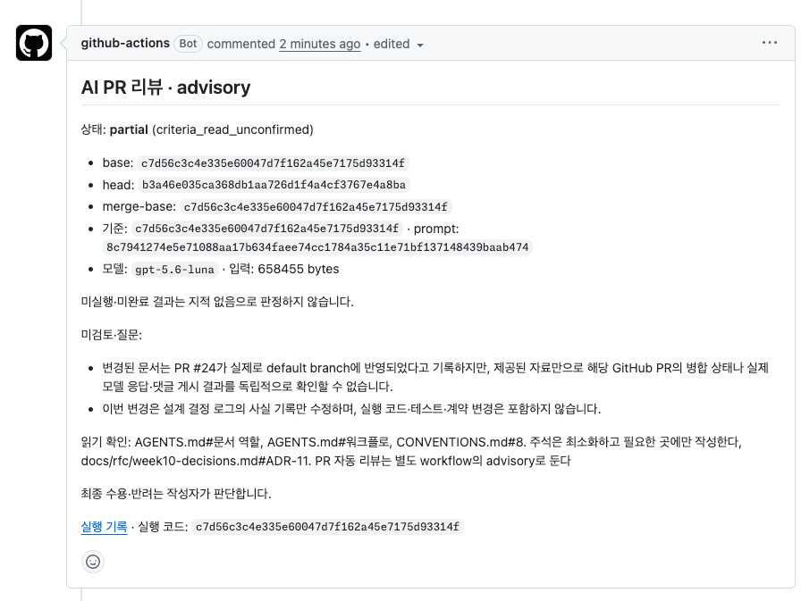

# 10주차 결정 로그 (계획 그릴링 ADR)

> 구현 전 계획 그릴링(2026-09-09)에서 합의한 결정 기록. 2026-09-10 사용자가 지정한 PR 관련 통합 테스트·main 병합 전 핵심 E2E·배포 전 전체 E2E·정기 E2E/Lighthouse 정책으로 개정했다. 측정·실험 결과와 그에 따른 최종 판단은 week10-ci.md에 기록한다.

## ADR-1. workflow 정리: quality.yml 기준 통합, ci.yml 삭제

- **상태**: 합의 (2026-09-09)
- **맥락**: 4주차에 본인이 만든 ci.yml(lint·unit·E2E, node 22 하드코딩)과 5주차 스타터 quality.yml(`pnpm check` 전체, SHA 핀, permissions, .nvmrc)이 모든 PR에서 동시 실행 — ci.yml 검증은 quality.yml의 완전 부분집합, PR마다 E2E·lint·unit 2중 실행 중.
- **결정**: quality.yml을 기준으로 보강하고 ci.yml은 삭제. "새로 만들지 않고 보강" 원칙 준수.
- **근거**: (1) 하드닝(SHA 핀·permissions)·.nvmrc 정합이 이미 quality.yml에 있음 (2) ci.yml의 node 22는 .nvmrc 24와 불일치 — 발제의 "로컬·CI·배포가 같은 기준" 위반 (3) "측정으로 5주간의 중복 실행을 발견하고 통합"이 1단계 서사가 됨.
- **주의**: ci.yml 삭제는 wall-clock 개선이 아니라 러너 사용량·소음 절감임 (두 workflow는 병렬 실행이므로). 개선 수치로 주장할 때 축을 구분할 것.

## ADR-2. Before 기준선: 현재 상태에서 측정, 비교 축은 quality.yml wall-clock

- **상태**: 합의 (2026-09-09)
- **결정**: Before 측정은 ci.yml 삭제 전 현재 상태에서 수행. wall-clock Before/After 비교 축은 quality.yml(→통합 workflow)로 고정. ci.yml 삭제 효과는 러너 사용 분(×2→×1) 절감으로 **별도 표에 분리 표기**하고 wall-clock 성과로 섞지 않음.
- **근거**: 0단계 취지(손대기 전 상태 고정)를 지키면서 "측정이 중복 실행을 발견했다"를 산출물에 포함. 두 workflow는 병렬이라 삭제가 wall-clock에 거의 무영향 — 섞으면 측정 정직성 훼손.

## ADR-3. 실험 무대: fork = 실험실, upstream 제출 PR = 최종 무대 (하이브리드)

- **상태**: 합의 (2026-09-09)
- **맥락**: fork(heeji289/...)는 Actions 실행 이력 0건 (지금까지 CI는 upstream PR에서만 실행). upstream에서는 캐시 삭제(cold 재현)·re-run·branch protection·label 부착이 전부 권한 부족으로 불가. fork는 User 소유라 **merge queue(merge_group) 사용 불가** — 2단계 최종 방어선 설계에서 제외.
- **결정 (2026-09-09 개정)**: 권한이 필요한 실험(측정 cold/warm, 캐시 hit/miss, branch protection, 조건부 실행 PR 2개, 빨간불 PR)은 fork에서. **최초 1회 `feat/round-10` → fork `main` 통합 PR로 main을 작업 최신 상태로 만든 뒤, 실험 브랜치 → `main` base로 PR 생성**(통합 후엔 diff가 실험 변경만 담겨 path filter 검증 유효). branch protection도 fork `main`에. 작업은 feat/round-10에서 계속, 구간마다 main으로 PR(= "main 머지 PR"에서만 블로커 동작). 제출 흐름(upstream/heeji289 base PR)은 기존대로. fork main의 upstream 미러 역할 상실은 수용 — 새 주차 수급은 늘 로컬 `git fetch upstream`이라 실사용 없음.
- **준비 작업**: fork Actions 활성화 (Actions 탭 enable) 선행.

## ADR-4. 측정 프로토콜: cold = 캐시 전삭제 후 re-run, 기록은 docs/rfc/week10-ci.md

- **상태**: 합의 (2026-09-09)
- **결정**: 동일 커밋에서 cold = `gh cache delete --all` → "Re-run all jobs" × 3, warm = 캐시 보존 re-run × 3. 수치는 `gh run view <id> --json`으로 run wall-clock + step별 시간 수집(raw 3개·중앙값·범위). 기록은 `docs/rfc/week10-ci.md`에 본문, PR 본문엔 요약+링크.
- **근거**: 캐시 삭제는 서버 저장물만 비워 코드·커밋·workflow 무변경 — "같은 커밋에서 측정" 원칙 유지. lockfile 변조는 2단계 miss 재현 실험 전용으로 분리해 실험 구분 유지. docs/rfc 축적은 7~9주차 문서 패턴과 일관, 6단계 회고 인용 용이.

## ADR-5. 최적화 전략은 측정 후 결정, concurrency는 낭비 방지 축으로 도입

- **상태**: 합의 (2026-09-09)
- **결정**: (1) job 분리 등 wall-clock 전략은 Before 측정이 병목을 지목한 뒤 선택 — "측정이 전략을 고른다"를 결정 규칙으로 문서화, 예상 시나리오(직렬 pnpm check에서 E2E·build 최장 예상)만 사전 기록. (2) concurrency는 병목 전략이 아닌 낭비 방지로 분리 기록하고 도입 — `group`에 `github.ref` 포함, `cancel-in-progress`는 PR에서만(main push 취소 금지). 도입 근거는 upstream 본인 PR run 이력에서 연속 push로 겹쳐 돈 run 수를 실측해 인용.

## ADR-6. 조건부 실행: PR·main 병합·Production 배포·정기 검증 분리

- **상태**: 합의 (2026-09-10 사용자 지정 정책으로 재개정)
- **모든 PR**: lint·typecheck·unit 전체·변경 관련 integration. production build도 유지한다. workflow 자체는 생략하지 않고, dorny/paths-filter로 job/step을 분기한다. draft에서도 기본 검증은 유지한다.
- **main 병합 전**: main 대상 AND non-draft AND 런타임 관련 변경 PR에서 기존 로그인 성공·실패 2개와 주문 완료 1개를 `@critical`로 실행한다. draft·문서 전용·main 외 PR은 E2E를 생략한다. base 변경과 ready/draft 전환 이벤트에서 재판정·재실행한다. 회원가입·결제는 현재 앱에 구현된 독립 기능이 아니므로 추가하지 않는다.
- **Production 배포 전**: main의 대상 SHA를 고정하고 기본 검사·전체 integration·production build·전체 E2E 5종을 실행한 뒤 성공한 SHA만 배포한다. 전체는 로그인·주문·세션 만료·상품 목록·Dialog다. 실패 시 기존 Production을 유지한다. main 자동 Production 배포와 병렬로 검사하던 방식은 ADR-9대로 대체한다.
- **정기·수동**: 정기는 main, 수동은 선택한 브랜치에서 전체 E2E와 Lighthouse CI를 실행하고 배포하지 않는다. 작업 브랜치의 전체 검증도 병합 전에 실행할 수 있도록 수동 실행은 main으로 제한하지 않는다. 기본 주기는 매주 월요일 03:30 KST(일요일 18:30 UTC). 기본 Lighthouse 측정·리포트는 2단계에, assertion 임계값은 3단계에 둔다.
- **변경 필터**: dorny/paths-filter를 SHA로 고정해 사용한다. 런타임과 무관함을 확인한 문서만 제외하고 소스·공통 UI·설정·정적 자산·lockfile·테스트·미분류 파일은 실행 대상으로 둔다. 파일 목록·영역 결과를 관련 integration 선택에도 재사용한다. 라벨은 도입하지 않는다.
- **guard와 required**: 2단계에서 기본 checks와 PR guard를 fork main required로 연결한다. 판별·build·핵심 E2E 실패는 main 병합을 차단한다. 문서 전용·draft·main 외 PR의 E2E 생략은 이유를 보고한다. draft는 ready 전환 후 다시 검증한다. 판별 실패·파일 목록 누락은 성공으로 생략하지 않고 실패시킨다.
- **선택 근거**: 개발 중에는 변경 관련 검증으로 비용을 줄이고, main 병합 전에 실패 비용이 큰 로그인·주문을 검증한다. 비핵심 브라우저 회귀는 배포 전 전체 E2E로 막고, 정기 측정으로 전체 흐름과 성능을 감시한다. 관련 integration은 실험 후 선택하는 후보가 아니라 기본 정책이다.
- **유지 판단 (2026-09-11)**: [비교 측정](week10-e2e-cost.md)의 현재 추가 비용 약 11.77초만으로 전체 E2E를 PR required로 확대하지 않는다. 테스트 증가에 따라 PR 반복 실행 비용과 비핵심 flaky의 병합 차단 범위까지 함께 늘리지 않도록 실행 시점을 유지한다. 이는 향후 비용에 대한 설계 판단이며, 현재 flaky 증가를 관측했다는 뜻은 아니다. 비핵심 회귀의 main 유입에 따른 수정·원복·배포 재검증 비용은 수용하되, 배포 지연이 반복되거나 실패 영향이 커진 흐름은 핵심 편입을 재검토한다.
- **안전 논리의 범위**: 핵심 회귀는 main 병합 전에, 전체 E2E가 검출하는 회귀는 Production 배포 전에 차단한다. 비핵심 회귀가 main에 들어갈 가능성까지 없앤다고 주장하지 않는다. main 유입 방지와 사용자 대상 배포 방지를 구분해 과제 문서에 설명한다.
- **개정 이유**: 모든 코드 PR의 전체 E2E 정책을 사용자 지정 실행 시점 분리로 대체하고 changed-files·draft 생략을 추가했다. 정기 실행은 배포 전 게이트를 대신하지 않는다.
- **merge queue 대체 확정 (2026-09-10)**: 현재 fork는 API상 개인(User) 소유 공개 저장소로 merge queue 지원 대상이 아니다. 개인 fork를 유지하고 main required checks를 strict로 설정한다. main이 바뀌면 PR에 최신 main을 반영하고 CI를 다시 통과해야 병합 가능하다. main 변경 자체로 모든 PR이 자동 재실행되는 것은 아니다. 전체 E2E의 실행 시점은 배포 전·정기로 유지한다. [GitHub strict checks](https://docs.github.com/en/repositories/configuring-branches-and-merges-in-your-repository/managing-protected-branches/about-protected-branches).
- **merge_group 미적용 이유·제출 기록**: merge queue는 조직 소유 공개 저장소 또는 Enterprise Cloud 조직의 비공개 저장소에서 제공된다. 현재 개인 fork에서는 큐를 활성화할 수 없으므로 큐가 발생시키는 `merge_group` 검증도 사용할 수 없다. 이벤트 선언만으로 동작하지 않는다. CI 제출 문서에 저장소 소유 유형·공식 지원 범위·strict 대체 방식·main 갱신 후 재검증 증거를 함께 남긴다. [GitHub 지원 범위](https://docs.github.com/en/pull-requests/how-tos/merge-and-close-pull-requests/merging-a-pull-request-with-a-merge-queue).

## ADR-7. 통합 테스트: 모든 PR에서 변경 관련 실행

- **상태**: 합의 (2026-09-10 사용자 요청으로 채택 확정)
- **분류**: 8주차 단위/통합 판단을 출발점으로 현재 테스트 책임을 확인해 두 집합을 나눈다. node/jsdom과 DOM 파일명은 실행 환경 구분이며 단위/통합 구분이 아니다. 현재 전체 테스트가 빠지지 않게 목록을 대조한다. unit은 항상 전체 실행한다.
- **선택**: 기존 Vitest의 `related --run`을 integration 집합에 적용하고 수정한 integration 테스트 자체도 포함한다. 정적 의존 그래프로 변경 영향이 연결된 테스트를 선택하며 테스트 본문을 복제하지 않는다.
- **전체 영향 처리**: 공통 setup·MSW 기반·빌드/테스트 설정·lockfile·안전하게 범위를 복원할 수 없는 삭제/이름 변경·미분류 런타임 경로는 전체 integration을 실행한다. 런타임 변경인데 관련 결과가 0개인 경우도 전체 폴백하고 테스트 공백 여부를 기록한다.
- **생략과 실패 구분**: 앱·빌드·테스트 입력이 아닌 문서는 관련 integration 0개가 가능하다. 판별 성공과 이유를 보고한다. 변경 파일 조회 실패·누락·잘림이나 테스트 수집 실패를 0개 성공으로 취급하지 않는다.
- **검증·측정**: 관련/무관 영역, 공통 기반, 테스트 자체 변경, 삭제·이름 변경의 선택 목록을 실제 실행과 대조한다. 같은 커밋·CI 조건에서 전체 실행과 unit 전체+관련 integration을 각 3회 측정하고 raw·중앙값·범위·판별 비용을 남긴다. 시간 이득이 작다는 이유로 일반 PR의 related 정책을 철회하지 않는다.
- **전체 실행 시점**: 배포 전·정기·수동 전체 검증과 로컬 전체 테스트 명령은 모든 integration을 실행한다.

## ADR-8. flaky 정책: CI 한정 재시도 + 격리 상한 + trace 수집

- **상태**: 합의 (2026-09-09)
- **결정**: (1) `retries: process.env.CI ? 2 : 0` — 로컬 0(흔들림 즉시 노출), CI 2회. Playwright가 재시도 후 성공을 "flaky"로 별도 표기 → 재시도 자체가 흔들림/진짜 실패의 구분 장치. (2) flaky 발생이 로그 안 열고 보이게 리포트 노출. (3) 같은 스펙 2회 이상 flaky 기록 시 `test.fixme` 격리 + 이슈 기록 — 만성 흔들림 은폐 방지 상한. (4) CI 한정 `trace: retain-on-failure` — flaky 원인 사후 분석용 증거 수집.
- **병합·배포 게이트와의 정합 (2026-09-10)**: 격리한 경로와 검증 공백·복구 계획을 명시한다. 핵심 테스트 또는 해당 변경의 검증을 격리한 경우 대체 검증 없이 병합·배포하지 않고, 격리된 흐름까지 검증 완료한 것으로 보고하지 않는다.
- **검토 후 제외 (판단 흔적)**: 타임아웃 연장(진짜 실패 판명 지연), quarantine 별도 트랙(스펙 5개 규모에 과함), 개별 재시도(어떤 스펙이 흔들릴지 겪은 후 좁히는 게 순서), 재시도 0+수동 재실행(구분이 기록에 안 남음). 자동 대기 준수는 flaky 발생 시 1차 수리 방법으로 정책에 한 줄 명시.

## ADR-9. Vercel Production 배포: 전체 E2E 성공 후 게시

- **상태**: 합의한 배포 전 검증 정책의 기본 구현안 (2026-09-10 개정, 실제 설정 변경 전)
- **현재 상태**: fork 연결과 main Production 브랜치 설정은 1단계에서 준비했다. Git main push 자동 배포는 Actions 결과를 기다리지 않으므로 배포 전 E2E 게이트가 아니다.
- **변경안**: main의 자동 Git Production 배포를 중지하고, 소유 fork main의 CI 파이프라인이 기본 검사·전체 integration·build·전체 E2E 성공 후 공식 Vercel CLI로 같은 SHA를 Production에 배포한다. PR의 개발용 Preview 자동 배포는 유지할 수 있다. [Vercel Git 설정](https://vercel.com/docs/project-configuration/git-configuration), [Actions 연동](https://vercel.com/kb/guide/how-can-i-use-github-actions-with-vercel).
- **대상 고정**: 검증 SHA·run URL·배포 SHA와 결과를 연결한다. 배포 단계에서 바뀐 main을 다시 가져오지 않는다. 오래된 검증 run이 최신 Production을 덮지 않도록 게시 순서를 보호한다. 빌드 환경·산출물 호환은 구현 시 확인한다.
- **실행 경계**: E2E는 CI의 격리된 서버에서 실행한다. PR·upstream 제출·정기·검증용 수동 실행에는 Production 배포 자격 증명을 공급하지 않는다. 인증·프로젝트 설정은 secrets/환경 설정으로 제공한다.
- **2단계 완료 증거**: 비핵심 E2E 실패 시 배포가 시작되지 않고 기존 Production이 유지되는지 확인한다. 정상 실행은 전체 E2E 성공 뒤 같은 SHA가 배포되는지 확인한다. 실제 배포 연결이 없으면 배포 전 게이트 완료로 표시하지 않는다.
- **의미**: main에 합쳐진 코드와 사용자에게 배포할 코드를 구분한다. 전체 E2E는 사후 검출이 아니라 Production 배포 차단 조건이다.

## ADR-10. 예산 게이트 구성: size-limit + Zod env 검증 + Lighthouse 임계값은 7주차 LCP 근거

- **상태**: 합의 (2026-09-09)
- **결정**:
  - **size-limit 채택** (새 devDependency, 사용자 승인). 대상 확정: **홈·상품목록·상품상세 First Load JS + 공유 청크(shared by all) + hero 이미지 소스 파일** — 공유 청크는 전역 회귀(공통 모듈에 무거운 import) 검출용으로 빨간불 실험과 짝. 페이지 전수·총량 예산은 소음이라 제외. 임계값은 이번 주 실측 후 `현재값 + 측정 범위 + 여유폭 N%` 공식으로 본인이 결정 — 7주차 인용의 실체는 "전송 크기가 LCP를 지배한다는 발견의 회귀 방지".
  - **env 검증은 Zod 규칙을 공유하는 빌드/서버 검증 함수** (2026-09-11 사용자 요청으로 개정). APP_ORIGIN은 metadata와 요청 처리에 쓰여 양쪽에서, AUTH_SESSION_SECRET은 서버 시작에서 검증한다. 비밀 변수의 NEXT_PUBLIC_ 변형은 양쪽에서 거부한다. `next.config`의 개발/빌드 phase와 `instrumentation.register()`에 연결한다. Zod는 기존 버전의 dependencies로 이동하고 클라이언트 import는 하지 않는다. 이전 빌드 전 CLI만의 검증은 이 결정으로 대체한다.
  - **LCP·FCP·TTFB는 Lighthouse CI가 측정** (정기 + 수동). 2단계에서 홈·상품 목록의 기본 측정·리포트를 연결하고 3단계에서 assertion을 적용한다. assertion 임계값 근거 = **7주차 실측 LCP 값** (docs/week-07-performance rf-after) — "7주차 값 인용" 요구의 본류. 변동성 대응은 numberOfRuns 3 중앙값.
- **배포와의 연결 (2026-09-11 개정)**: ADR-9의 배포 전 전체 E2E를 유지하고 3단계 예산·env 검증도 필수 성공 조건에 추가한다. env는 모든 PR의 실제 서버 실행 검사와 Production 후보의 동적 API 검증으로 보완한다. `--prod --skip-domain` 후보가 통과하고 main SHA가 여전히 같을 때 동일 배포만 promote한다. Lighthouse의 변동성 있는 측정은 PR required·Production 배포 차단 조건으로 사용하지 않는다.

## ADR-11. PR 자동 리뷰는 별도 workflow의 advisory로 둔다

- **결정 (2026-09-11)**: 기존 무유도 로컬 Codex 리뷰는 유지한다. PR 자동 리뷰는 [AI PR Review](../../.github/workflows/ai-review.yml)에서 `gpt-5.6-luna`를 Responses API로 호출한다. 사용자가 구독과 별도 API 과금을 선택했다.
- **트리거·신뢰 경계**: Quality 완료 후 성공 여부와 무관하게 실행한다. default branch의 실행 코드와 고정한 PR base의 기준을 사용한다. PR head는 Git 객체로만 읽고 코드·설치 스크립트를 실행하지 않는다. 외부 fork·draft·오래된 SHA는 생략 사유를 남긴다.
- **범위**: 기존 변경 판별을 재사용한다. 코드·설정·설계 문서·규칙 변경은 리뷰하고 일반 안내 문서는 사람 검토로 넘긴다. 기준의 정본은 복사하지 않고 base에서 읽는다.
- **한도**: 모델 호출 1회·출력 6,000토큰·3분·입력 1MiB, 자동 재시도 없음. 같은 base/head는 댓글 예약으로 중복을 막고 AI workflow의 수동 재실행 1회만 허용한다. 작은 저장소의 소스·테스트를 함께 제공하며 상한 초과는 잘라서 성공시키지 않는다. 이 한도는 금액 상한이 아니다. API 사용량·프로젝트 한도는 작성자가 확인한다.
- **결과**: SHA·기준/프롬프트 해시·읽은 기준·실행 링크와 함께 PR 댓글에 남긴다. 인증·수집·입력·응답·시간·게시 실패는 지적 없음과 구별한다. 비결정적 결과이므로 required·guard·배포 조건에 넣지 않고 수용·반려는 작성자가 결정한다.
- **활성화·검증**: 저장소 secret 등록과 [PR #24](https://github.com/heeji289/loop-pack-fe-l2-vol1/pull/24)·[수정 PR #26](https://github.com/heeji289/loop-pack-fe-l2-vol1/pull/26)의 main 반영을 확인했다. [실제 리뷰](https://github.com/heeji289/loop-pack-fe-l2-vol1/pull/25#issuecomment-5622602438)에서 기준 6개 읽기 응답과 댓글 게시를 확인했다. 외부 GitHub 상태는 입력만으로 확인할 수 없어 `partial`로 남겼다.

첫 AI 리뷰 댓글 기록. 처음의 기준 경로 응답 형식 오류를 수정했고, 재실행 제한·오래된 결과 게시 차단의 실행 근거는 [PR #25](https://github.com/heeji289/loop-pack-fe-l2-vol1/pull/25)에 남겼다.

## ADR-12. required 선정: main 핵심 E2E와 Production 전체 E2E 분리

- **상태**: 합의 (2026-09-10 사용자 실행 정책 반영)
- **2단계 main branch protection**: 기본 checks(lint·type·unit 전체·관련 integration)와 PR guard(변경 판별·production build·main 대상 핵심 E2E)를 required로 연결한다. 문서 전용·draft에서는 판별·build 성공 후 guard가 의도적 E2E 생략을 보고한다. ready 전환 시 재판정한다. 전체 E2E를 PR required로 요구하지 않는다.
- **최신 main 반영 강제**: `Require branches to be up to date before merging`을 활성화한다. 다른 PR 병합으로 main이 바뀌면 기존 PR은 병합할 수 없으며, Update branch 또는 merge/rebase로 갱신한 뒤 `pull_request.synchronize`의 CI를 통과해야 한다. 과거 커밋의 run 재실행만으로는 이 조건을 충족하지 않는다. 별도 브랜치 자동 갱신 봇은 만들지 않는다.
- **2단계 완료 증거**: 같은 main 대상으로 E2E가 실행되는 non-draft 코드 PR과 생략되는 문서 PR을 각각 확인한다. draft→ready에서 기본 검증 유지·핵심 E2E 재실행도 확인한다. main의 non-draft 런타임 변경 PR은 핵심 E2E 성공 후 머지 가능하며 핵심 E2E·관련 integration·판별 실패 시 차단되는지 최신 SHA·required 설정·PR 상태로 확인한다. base 재지정 시 이전 생략 결과로 main에 병합할 수 없는지도 검증한다. 관리자 우회는 통과 증거가 아니다.
- **strict 검증 증거**: A·B PR이 통과한 상태에서 A를 먼저 병합한다. B가 최신 main 미반영으로 차단되는지, B를 갱신하면 새 SHA의 CI가 실행되고 성공 후 병합 가능해지는지 확인한다. 갱신 전후 base/head SHA·run URL·PR 상태를 남긴다. 선택된 PR 검증을 재실행하는 것이며 전체 E2E를 병합 전에 추가하는 실험은 아니다.
- **Production gate**: main에 병합된 대상 SHA의 기본 검사·전체 integration·build·전체 E2E가 성공해야 배포한다. 비핵심 E2E 실패가 Production을 막는 실제 증거는 2단계에 포함한다(ADR-9).
- **3단계 확장**: size-limit·env 검증을 main required와 배포 조건에 추가한다. PR 검증 책임은 기본 검사·관련 integration / production build / size-limit / env / 핵심 E2E다. 책임 수에 맞춰 물리 job을 쪼개지는 않는다.
- **PR required 제외**: 전체 E2E(배포 전 게이트), Lighthouse(정기·수동 측정), AI 리뷰(비결정적 advisory). 정기 검증의 실패를 PR에 강제로 연결하지 않는다.
- **근거**: 개발·병합·배포 단계마다 사용자가 정한 검증 강도를 적용한다. 관련 검증과 핵심 기능의 실패는 병합을, 전체 브라우저 흐름의 실패는 Production 배포를 차단한다.
- **guard 조건 재계산의 전환 메모 (2026-09-10)**: 현재 guard는 핵심 E2E 실행 조건(main 대상 AND non-draft AND 런타임 변경)을 build-e2e의 실행 단계와 **같은 입력으로 한 번 더 계산**해 실제 결과와 대조한다. 이 재계산이 막는 것은 "두 조건 중 한쪽만 잘못 바뀌는 경우"뿐이고, 분류 오류나 잘못된 정책이 양쪽에 같이 반영되는 경우는 못 잡는다 — 독립 검증이 아니라 작은 안전장치다. 3단계에서 guard를 확장(env·예산 판정 추가)할 때 다음으로 전환한다: ① 실행 조건을 테스트 가능한 스크립트(예: `decide-e2e-scope.mjs`)로 추출해 workflow가 호출하고, ② main×draft×runtime 8조합의 기대값을 **손으로 적은 진리표**로 고정한 정책 테스트를 unit 집합에 둬 모든 PR에서 돌게 하며(기대값을 같은 조건문으로 재계산하면 중복이 테스트로 자리만 옮기므로 금지, 테스트 대상은 CI가 실제 호출하는 그 스크립트여야 한다), ③ 그 후에 guard의 조건 재계산을 제거한다. guard에는 job 결과 확인, 출력이 정확히 true/false인지 검증(빈 문자열 불허), 선언된 결정 대비 실제 outcome 대조가 계속 남는다. **정책 테스트 없이 재계산만 지우지 않는다.** 전환 전까지 현재 중복은 유지한다.

## 5단계 승격 후보 풀 (1~10주차 과제 문서 스캔 반영, 최종 선택은 모드 2 AI 리뷰 결과와 대조 후)

> **2026-09-10 재검토**: 아래 네 후보는 이전 조사 기록이며 전체 후보의 상한이 아니다. “유력”, “현재 위반 0 → 정상 통과 보장”, “인라인 객체/staleTime 누락 금지”를 검증된 결론으로 사용하지 않는다. 현재 위반이 없는 것과 룰의 정상 코드 통과는 다르다. 새 감사의 테스트/E2E/파일·구조 후보까지 AI·사람의 실제 반복 지적과 대조하고 성격에 맞는 ESLint 또는 CI 검사 수단을 선택한다. 5단계에서 하나만 승격하는 것과 4단계의 전체 rule·skill 정비를 구별한다.

- **① HTTP 호출 위치 강제** — api-client 밖 `fetch`/`axios` + `'/api/...'` 리터럴 금지. 출처 삼중(week-03 API 분리, 05 팩토리, 09 401 단일화). 현재 위반 0 → 정상 통과 보장. **유력**
- **② as 단언 제한** — week-01 "새 as 금지" + 최근 커밋의 반복 제거 이력. selector: `TSAsExpression`(as const 제외). 잔존 ~10곳 전수 검토로 룰 좁히기 필요(오탐 검증 과제와 부합)
- **④ Query 옵션 계약** — useQuery 인라인 객체 금지 + `queryOptions`에 staleTime 누락 금지 (week-05·07 이중 출처)
- **⑤ Zustand 무인자 전체 구독 금지** — `useXxxStore()` 인자 없이 호출 시 위반 (week-05 selector 규율)
- 이미 승격 완료(중복 제외): FSD 경계+Public API(6주차), 테스트 단언 품질 toBeTruthy 류(8주차)
- 부산물 흡수: **'use client' 파일에서 비-NEXT_PUBLIC process.env 접근 금지** → 3단계 validate-env/lint 게이트에 추가 검토. workflow 메타 검사(concurrency ref·permissions·SHA 핀)는 actionlint 계열 도구 아이디어로 회고에 언급 가능
- 탈락(비결정) 확정: 서버 응답 store 복사(맥락), 성급한 추상화(맥락), staleTime 값의 근거(판단)

## ADR-13. 심화·선택 범위: 둘 다 수행 + AI 관행 유지

- **상태**: 합의 (2026-09-09)
- **결정**: (1) rollback 심화 질문 답변 — 필수 질문 4개와 함께 PR 본문에. (2) **Docker 실습 수행** — multi-stage Dockerfile로 이미지 빌드 → `docker run` → production build smoke 확인 (발제 수준: 클라우드 배포까지는 안 감). (3) 5관점 workflow AI 리뷰 1회 편입(질문 4 답변의 실물 증거). (4) 전 주차 AI 관행 유지 — PR에 AI 생성 부분 표기 + 위임 경계 선언(YAML 초안·selector·스크립트 골격은 AI, required·임계값·승격 선택·안전 논리는 사람).
- **준비 확인 필요**: 로컬 Docker 실행 환경(Docker Desktop 등) 설치 여부 — 구현 시작 시 확인.

## 실행 순서 (계획)

> 4·5단계는 2026-09-10 재검토 초안이 아래 이전 요약에 우선한다. 학습 목록 전체 대조 → rule·skill 보완/연결 → 실제 리뷰/판정 → 프롬프트 개선 → 반복 규칙 선택/승격 순서다. 기존 C1~C9 조립이나 후보 풀 네 개만으로 범위를 닫지 않는다.

0. **준비**: fork Actions 활성화 → feat/round-10 origin push → **통합 PR(feat/round-10→fork main) 머지** → Vercel 연동(Production=main) → fork secrets(Claude 토큰) → Docker 환경 확인
1. **1단계 측정**: Before cold/warm 각 3회(gh cache delete + re-run) → 병목 지목 → 전략 적용(quality.yml 보강·ci.yml 삭제 포함) → After 재측정 → 캐시 hit/miss 실험(lockfile 원복) → `docs/rfc/week10-ci.md` 기록
2. **2단계 조건부**: dorny/paths-filter·unit/integration 분류·관련 integration 선택 → main·non-draft·런타임 변경 핵심 E2E·guard·strict required 연결 → 실행/생략·draft 전환·base 재지정·병합 차단·main 갱신 후 재검증 PR 실험 → main 자동 Production 배포를 전체 E2E 성공 후 CI 게시로 전환·배포 차단 검증 → 주간·수동 전체 E2E와 Lighthouse 기본 측정 → related 실행 비용 기록
3. **3단계 예산**: size-limit 기준선 실측 → 임계값 결정 → validate-env(zod) → required·배포 조건에 예산·env 추가 → 예산 초과 빨간불 PR 실험 → Lighthouse assertion 임계값 → 리포트·릴리즈 추적성 보강
4. **4단계 AI 리뷰**: 모드 2 프롬프트 조립(component-review·architecture-review SKILL + CONVENTIONS) → CI 통합(안전장치·paths 조건) → 잘 잡은 1/헛소리 1 수집 → 프롬프트 개선 전후 재실행 비교 → 완성 workflow에 5관점 AI 리뷰
5. **5단계 승격**: AI 리뷰 결과와 후보 풀(①②④⑤) 대조 → 1개 선택 → 위반/정상 양방향 검증 → 승격 항목을 AI 프롬프트에서 제거 → 책임 모델 문단
6. **심화**: Docker 이미지 빌드·실행 smoke / rollback 답변
7. **6단계 회고** + 질문 4개 답변 → 마무리 게이트(pnpm check, 실험 잔재 제거, AI 표기) → 제출 PR

## 4단계 프롬프트·회고 7절 재료 (1~9주차 AI 요구사항 스캔, 2026-09-09)

> 이 절은 기존 부분 조사다. “조립이지 신작이 아님”은 신규 검토 절차를 금지하는 결정으로 사용하지 않는다. 추가 발제 대조 결과와 현재 스킬의 공백은 [요구사항 감사](week10-ai-review-requirements-audit.md)를 따른다. 10주차 발제 원본은 아직 미확보다.

- **모드 2 리뷰 프롬프트는 조립이지 신작이 아님**: 3주차 `component-review` SKILL + 6주차 `architecture-review` SKILL이 이미 리뷰 지침 초안. 여기에 CONVENTIONS.md + 1주차 셀프리뷰 4단(any/as/@ts-ignore/eslint-disable 침묵 금지, 기존 유틸 중복 생성 금지) + 5·7주차(URL 규칙, 서버 응답 복사 금지) + 8·9주차(AI 생성 테스트의 단언·모킹 경계 검토)를 합쳐 조립.
- **"잘 잡은 1/헛소리 1"의 선행 형식 존재**: 6주차 "AI 지적 중 수용/반려를 근거와 함께 기록" — 같은 형식 재사용. 헛소리 후보 최빈 지점은 7주차 경험상 "측정과 무관한 최적화 제안".
- **전 주차 반복 필수 관행 (10주차 PR에도 유지)**: ① AI로 생성한 부분 표기 + 직접 검토 명시 ② 위임 경계 선언 — 반복 코드(셋업·픽스처·YAML 초안)는 AI, 단언·모킹 경계·E2E 범위·required·임계값 판단은 사람.
- **회고 7절 뼈대**: 1주차 책임 모델 표("하네스가 약한 레포에선 AI 에이전트도 약해진다", "git hook은 AI 커밋에도 걸린다") → 10주차 CI/AI/사람 표로 재작성 + 8·9주차 위임 경계 선언을 결론 문장 재료로.
