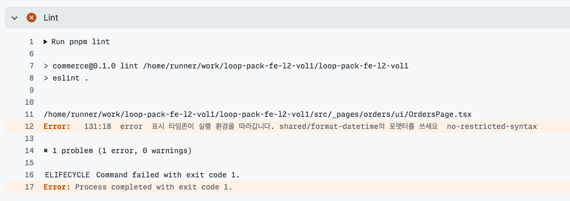
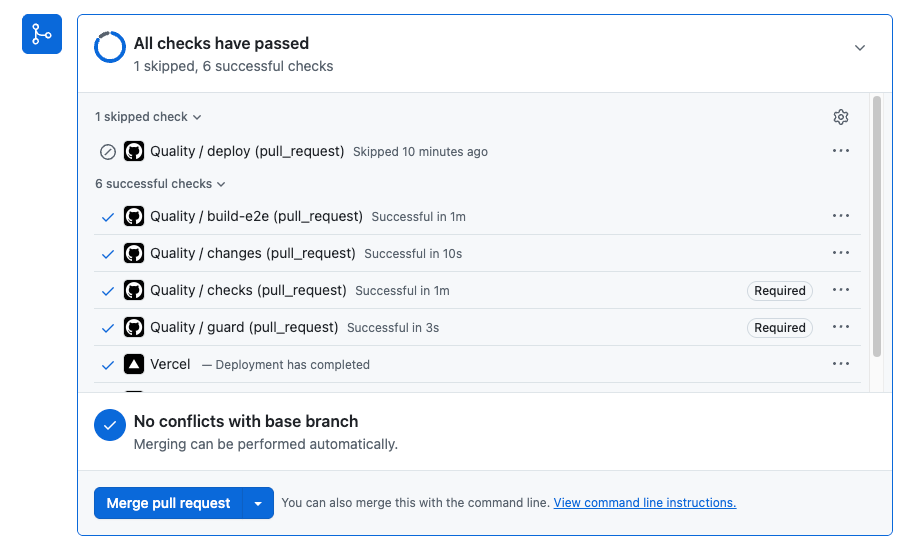

# 10주차 5단계 — 반복 지적을 결정적 게이트로 승격

4단계 리뷰가 반복해서 짚던 것 하나를 사람·AI 판단에서 떼어내 CI 게이트로 내린 기록이다.

| 항목 | 내용 |
| --- | --- |
| 승격한 것 | **날짜를 로케일 문자열로 직접 만드는 것** (표시 타임존 미고정) |
| 구현 | `eslint.config.mjs`의 `no-restricted-syntax` selector 2개 + 예외 1파일 |
| 실행 | `pnpm lint` — `quality.yml`의 `checks` job step, pre-commit(lint-staged)에서도 실행 |
| 배치 | 기존 required(`checks`)에 붙였다. **새 check 이름을 만들지 않았다** |
| 실행 시간 | 기존 lint에 흡수 — 추가 step 없음 |
| 회귀 검사 | `scripts/eslint-locale-date.test.ts`(unit-node) · `src/shared/format-datetime.test.ts`(unit-node) |

---

## 1. 반복 지적과 기존 공백

### 저장소에 살아 있던 거짓 초록불

`tests/orders-page.dom.test.tsx`가 구현(`OrdersPage.tsx`)과 **똑같은 `toLocaleString` 식으로 기대값을 만들고** 있었다. 표시 타임존을 주지 않으면 결과가 실행 환경의 TZ를 따라간다.

```
TZ=UTC              → 26. 08. 30. (일) 오전 09:00
TZ=Asia/Seoul       → 26. 08. 30. (일) 오후 06:00
TZ=America/New_York → 26. 08. 30. (일) 오전 05:00

→ 세 환경 모두 테스트 통과
```

주문 시각이 CI(UTC)와 로컬(KST)에서 **9시간 어긋나도 빨간불이 없었다.** 화면이 틀린 시각을 보여줘도 아무도 모른다.

### 기존 검사가 못 잡는 이유

ESLint의 테스트 블록은 비활성화·단언 없음·truthiness 단언을 막지만 **실행 환경에 의존하는 값**은 보지 않는다. 타입도 못 잡는다 — `toLocaleString`의 반환은 어느 환경에서나 `string`이다. 테스트도 못 잡는다 — 기대값을 구현과 같은 식으로 만들면 양쪽이 같이 움직인다.

`test-review`의 「거짓 초록불」 표에 *"타임존 고정 없이 ISO 시각을 로컬 날짜 문자열로 바꿔 비교 → 로컬과 CI(UTC) 결과가 다르다"* 행이 있었다. **문장 규칙으로만 있었고 사람이 매번 눈으로 확인했다.** 그 눈이 이번에 실제로 놓쳤다.

---

## 2. 후보와 선택 근거

4단계 리뷰 10건에서 모은 반복 지적을 빈도·영향·판별 가능성·예외로 놓고 골랐다. 집계 원본은 [요구사항 감사](week10-ai-review-requirements-audit.md)의 「4단계가 실제로 모은 반복 지적」.

| 후보 | 빈도 | 판별 가능성 | 결과 |
| --- | --- | --- | --- |
| **E. 날짜 로케일 포맷** | 리뷰 1건 | **높음 — 단일 노드·단일 파일** | **선택** |
| A. 복구 버튼 재시도 중 비활성화 | 리뷰 3건 (최다) | 낮음 (아래) | 탈락 |
| B. 보호 경로 정의 드리프트 | 리뷰 3건 | 중간 — 룰이 아니라 테스트 성격 | 탈락 |
| C. E2E 고정 sleep | **반복 근거 없음** | 최고 | 탈락 |
| D. `week05-*` 전역 클래스 상향 의존 | 리뷰 1건 | 높음 | 탈락 |

### A를 떨어뜨린 이유 — selector를 실제로 짜봤고 실패했다

빈도가 가장 높아 먼저 시도했다. 판정식은 "`<button>`에 `refetch*()`를 부르는 `onClick`이 있고 `disabled` 속성이 없다"이다.

```
JSXElement:has(JSXOpeningElement[name.name="button"])
  :has(JSXAttribute[name.name="onClick"] CallExpression[callee.name=/^refetch/])
  :not(:has(JSXAttribute[name.name="disabled"]))
```

실제 ESLint로 5개 케이스에 돌린 결과:

| 케이스 | 결과 | |
| --- | --- | --- |
| `<button onClick={() => { void refetchSession(); }}>` | HIT | ✅ |
| `<button disabled={isFetching} onClick={...refetch()}>` | 통과 | ✅ |
| `<div onClick={...refetch()}><button>다시</button></div>` | HIT | ❌ **오탐** |
| `<button onClick={handleRetry}>` | 통과 | ❌ **놓침** |
| `<button onClick={() => { if (x) void refetch(); }}>` | HIT | ✅ |

**오탐 1 · 놓침 1.** 좁히려고 자식 결합자(`:has(> JSXOpeningElement > ...)`)로 바꿨더니 이번엔 **0건**이 잡혔다. `:has()`는 ESLint 문서에 없고 esquery 구현에 얹혀 있어 조합이 조금만 달라져도 조용히 무너진다.

근본적으로 이 룰은 **"함수 이름이 `refetch`로 시작한다"는 관례**에 기댄다. `handleRetry`로 한 겹 감싸면 못 잡는다. 조건부 속성 요구는 ESLint가 원래 약한 영역이다.

**기계로 못 내려가는 건 아니다.** 현업 관행대로 `<RetryButton>` 컴포넌트로 캡슐화하고 "손으로 만들지 마라"만 막으면 selector 한 줄로 끝난다. 다만 그러면 이미 정상인 4곳까지 포함해 **11곳을 컴포넌트로 교체**해야 해서, 룰 승격 실증에 리팩터링이 딸려온다. 규모가 5단계 범위를 넘는다고 판단했다.

### B를 떨어뜨린 이유

보호 경로가 세 곳(`proxy.ts:31` matcher · `login-url.ts:44` `isProtectedPath` · `requireServerSession` 호출부)에 수동 동기화로 있고, 양쪽 주석이 "수동으로 맞춘다"고 명시한다. 영향은 가장 크다(세션·보안).

다만 성격에 맞는 수단이 **드리프트 테스트 한 개**이지 룰이 아니다. 그리고 **현재 위반이 0건**이라 "위반을 빨간불로 막는다"를 보이려면 위반을 지어내야 한다. 후속 과제로 남긴다.

### C를 떨어뜨린 이유

판별은 가장 쉽다(`waitForTimeout` 한 줄). 그러나 **AI도 사람도 반복 지적한 적이 없다** — 티켓 05가 규칙 문장만 두고 후보로 남긴 것이다. `e2e/**` 전체에 현재 위반 0건이라 "현재 위반이 없는 것과 미래 차단은 다르다"는 함정에 그대로 걸린다.

### D를 떨어뜨린 이유

`app/home.css`가 정의한 `week05-*` 전역 클래스 24종을 entities·features·_pages **17개 파일**이 쓴다. CSS는 import 그래프에 없어 `boundaries/dependencies`가 **원리적으로 못 보는** 구멍이고, 검사기를 만들어 실제로 **53건**을 잡는 것까지 확인했다.

떨어뜨린 이유는 둘이다.

1. **빈도가 1건**이다. `architecture-review` 한 곳에서만 나왔고, "기계가 못 보는 구멍"이라는 서사가 좋아서 빈도 기준을 넘길 뻔했다.
2. **고쳐도 코드가 안 바뀐다.** 해소하려면 `home.css`를 shared로 옮기면 되는데, className 53곳은 그대로다. "위반 코드를 빨간불로 막는지" 자가 검증이 공허해진다 — 애초에 위반한 게 코드가 아니라 파일 배치였다.

검사기는 남기지 않았다. 필요하면 다시 만들 수 있고, 이 판단 자체를 기록으로 둔다.

### 선택 근거 요약

E는 빈도가 1건으로 낮다. 그럼에도 고른 이유는 **반복 지적의 대상이 "지금 있는 위반"이 아니라 "이미 명문화된 규칙을 사람이 계속 확인해 왔다"는 점**이고, 그 확인이 실제로 실패한 증거가 저장소에 살아 있었기 때문이다. 판별식이 단일 노드라 오탐을 만들기 어렵고, 위반·정상이 같은 저장소에 공존해 양방향 검증이 자연스럽다.

---

## 3. 판정식과 예외

| 구분 | 대상 |
| --- | --- |
| **위반** | `toLocaleDateString` · `toLocaleTimeString` (Date 전용 메서드라 수신자를 따지지 않는다) |
| **위반** | `new Date(...).toLocaleString` (수신자가 구문으로 Date임이 확정될 때만) |
| **정상** | `Number.toLocaleString` — 금액 표시. 저장소에 21곳 있고 대상이 아니다 |
| **정상** | `toLocaleLowerCase` 등 이름이 비슷한 다른 메서드 |
| **예외** | `src/shared/format-datetime.ts` 한 파일 — 표시 타임존을 고정하는 유일한 자리 |
| **범위** | `{src,tests,e2e,scripts}`의 `.ts` · `.tsx`. `scripts/**`의 `.mjs` 검사기는 린트 대상 자체가 아니라 걸리지 않는다 |

`toLocaleString`을 수신자로 좁힌 이유는 오탐 때문이다. 금액 포맷이 같은 메서드 이름을 쓰므로 이름만으로 막으면 21곳이 잘못 걸린다.

### 자동화했다고 주장하지 않는 것

- **포맷터가 고정한 타임존이 화면 의도에 맞는지** — `Asia/Seoul`이 옳은 선택인지는 제품 판단이다.
- **`Intl.DateTimeFormat` 직접 사용, `getHours`류 지역 시간 접근자** — 같은 문제를 다른 경로로 만들 수 있다. 현재 저장소에 사용처가 없어 룰에 넣지 않았고, `test-review`의 판단 영역으로 남겼다.
- **`.mjs` 검사기 스크립트** — 린트 대상이 아니다.

---

## 4. 자가 검증

### RED → GREEN

| 단계 | 명령 | 결과 |
| --- | --- | --- |
| RED | 룰만 넣고 코드는 안 고친 채 `pnpm lint` | **정확히 2건** — `OrdersPage.tsx:172`, `orders-page.dom.test.tsx:55`. **오탐 0** (금액 `toLocaleString` 21곳·`toLocaleLowerCase` 안 걸림) |
| GREEN | 공용 포맷터 도입 후 | lint 0 · typecheck 0 · 496 passed (승격 커밋 시점). 포맷터 테스트를 더한 현재는 498 |
| 타임존 독립 | `TZ=UTC` · `Asia/Seoul` · `America/New_York`로 `orders-page` 테스트 | 세 환경 모두 **같은 리터럴**을 단언하며 통과 |

### 오탐을 일부러 찾아본 것

`toLocaleString` 이름만으로 막는 안을 먼저 검토했다가 금액 표시 21곳이 걸리는 것을 확인하고 **수신자가 `new Date(...)`일 때로 좁혔다.** 좁힌 뒤 다시 돌려 위반 2건·오탐 0건을 확인했다.

### 뮤테이션

| 깨뜨린 자리 | 결과 |
| --- | --- |
| `format-datetime.ts`에서 `timeZone` 제거 | `orders-page` 테스트가 **UTC에서 실패**, KST에서는 통과 — CI가 UTC라 CI가 잡는다 |
| 같은 자리, `format-datetime.test.ts` 기준 | **러너 타임존과 무관하게 2개 다 실패** |
| `eslint.config.mjs`의 테스트 블록에서 `...LOCALE_DATE_SELECTORS` 제거 | 회귀 검사 **실패**, 원복 시 통과 |

### 회귀 검사를 최소로 둔 이유

룰이 망가지는 경로는 셋인데 둘은 린트를 돌리면 바로 드러난다 — `ignores` 경로가 죽으면 포맷터가 자기 규칙에 걸리고, selector를 잘못 고치면 위반 코드를 쓰는 순간 안 막힌다.

나머지 하나만 조용하다. **flat config는 뒤 블록이 같은 규칙을 통째로 갈아치운다.** 테스트 블록에 규칙을 추가하며 `...LOCALE_DATE_SELECTORS`를 빠뜨리면 에러 없이 테스트 파일에서 룰이 사라진다. 승격 전 실제 위반 2건 중 **하나가 테스트 파일**이었으므로 그 경로만 회귀 검사로 막았다.

위반 픽스처를 만들어 exit code까지 단언하는 안도 만들어봤으나(112줄, `eslint` spawn, `src/`에 픽스처 생성·삭제), 위 이유로 **30줄로 줄였다.** 위반 차단·정상 통과는 승격 시점 RED/GREEN과 아래 실험 PR이 증거다.

---

## 5. required 연결과 실증

### 배치

`pnpm lint`는 `quality.yml`의 `checks` job step이다. branch protection 실측(`gh api`)은 `required_status_checks.contexts = ["checks","guard"]`, `strict: true`. 룰 위반 → lint 실패 → `checks` 실패 → **병합 차단**. **새 check 이름을 만들지 않았다.**

pre-commit(lint-staged)도 같은 `eslint`를 부르므로 커밋 시점에도 걸린다.

### 실험 PR — [#43](https://github.com/heeji289/loop-pack-fe-l2-vol1/pull/43) (main 미병합)

| SHA | 커밋 | changes | checks | guard | 병합 상태 | run |
| --- | --- | --- | --- | --- | --- | --- |
| [`2a933a6d`](https://github.com/heeji289/loop-pack-fe-l2-vol1/commit/2a933a6d) | 위반 주입 | SUCCESS | **FAILURE** (Lint) | **FAILURE** | **BLOCKED** | [34561956992](https://github.com/heeji289/loop-pack-fe-l2-vol1/actions/runs/34561956992) |
| [`31daa3a3`](https://github.com/heeji289/loop-pack-fe-l2-vol1/commit/31daa3a3) | 원복만 | **FAILURE** (Classify changes) | FAILURE | FAILURE | BLOCKED | [34562121517](https://github.com/heeji289/loop-pack-fe-l2-vol1/actions/runs/34562121517) |
| [`48e2b464`](https://github.com/heeji289/loop-pack-fe-l2-vol1/commit/48e2b464) | 원복 + 포맷터 테스트 | SUCCESS | SUCCESS | SUCCESS | **CLEAN** | [34562404085](https://github.com/heeji289/loop-pack-fe-l2-vol1/actions/runs/34562404085) |

룰이 main에 들어간 PR은 [#42](https://github.com/heeji289/loop-pack-fe-l2-vol1/pull/42)(run [34561390524](https://github.com/heeji289/loop-pack-fe-l2-vol1/actions/runs/34561390524), 전부 SUCCESS) — **정상 코드가 통과하는 것**도 실제 CI로 확인했다.

### 실증 중에 드러난 것 셋

1. **pre-commit이 먼저 막았다.** lint-staged가 커밋 자체를 거부해 `--no-verify`로 우회해야 했다. 룰이 커밋 시점과 CI 두 곳에서 걸린다.
2. **원복만 했더니 다른 가드가 걸렸다.** PR diff가 정확히 0파일이 되자 `classify-changes.mjs`가 `변경 파일 목록이 0개다`로 막았다. 룰 실패가 아니라 **기존 가드의 정상 동작**이고, 빈 PR이 조용히 통과하지 않는다는 덤 증거다.
3. **Lint가 먼저 실패해 뒤 step이 생략됐다.** 그래서 빨간불 run에서는 `orders-page` 테스트의 검출이 보이지 않는다. 그 부분은 로컬 `TZ=UTC` 실행으로만 확인했다 — CI run이 증거가 아니라는 뜻이다.

### 캡처

위반 커밋 `2a933a6d`의 `checks` job — required인 Lint가 이 룰 하나로 실패했다.



원복 후 — `Quality / checks`와 `Quality / guard`에 **Required** 배지가 붙은 채 통과했고 머지 버튼이 열렸다. `deploy`는 main 대상이 아니라 정상 생략(skipped)이다.



---

## 6. AI 리뷰에서 뺀 범위

`test-review` SKILL의 「거짓 초록불」 표에서 **승격한 검출 범위만** 제거했다.

| | 전 | 후 |
| --- | --- | --- |
| 신호 | 타임존 고정 없이 ISO 시각을 로컬 날짜 문자열로 바꿔 비교 | `Intl.DateTimeFormat` 직접 사용 · `getHours`류 지역 시간 접근자로 비교 · 포맷터가 고정한 표시 타임존이 화면 의도와 다름 |
| 덧붙인 문장 | — | **`toLocale*` 호출 자체는 린트가 막으므로 다시 지적하지 않는다** |

`testing.md`의 「이 레포 하네스」에도 승격 범위를 적어, 무엇이 기계로 막히고 무엇이 사람 몫인지가 한 곳에서 보이게 했다.

---

## 7. 책임 배치

5단계가 옮긴 것은 **한 칸**이다.

| 담당 | 맡는 것 | 이번에 바뀐 것 |
| --- | --- | --- |
| **기계** | 레이어 import 방향·슬라이스 격리·순환 · 테스트 비활성화/단언 없음 · 타입 · 번들 예산 · Lighthouse 임계값 · env 생명주기 · E2E 실행 수 | **+ 날짜 로케일 포맷** |
| **AI 리뷰** | 설계 냄새와 반례 제안, 규칙 위반 후보 지목. 비결정적이라 advisory | **− `toLocale*` 호출** (다른 지역시간 경로는 그대로) |
| **작성자** | 지적의 수용·반려 · 단언 문구와 모킹 경계 · E2E 범위 · 예산과 required 배치 · 승격할 규칙 선택 · 판정식과 예외 범위 · 최종 검증 | 변화 없음 |

**기계로 내리지 못한 것이 훨씬 많다.** 10주 학습 기준 44개(A01~A14 · R01~R30) 중 기계가 전부 막는 것은 둘(R12 레이어 경계 · R20 테스트 무력화)뿐이고, 대부분은 맥락 판단이라 문장 규칙과 검토 절차로 남는다. 이번 승격은 그중 하나를 옮긴 것이다.

AI·사람 승인이 정확성을 보장하지 않는다. 동작과 검증에 대한 1차 책임은 작성자에게 있다.
