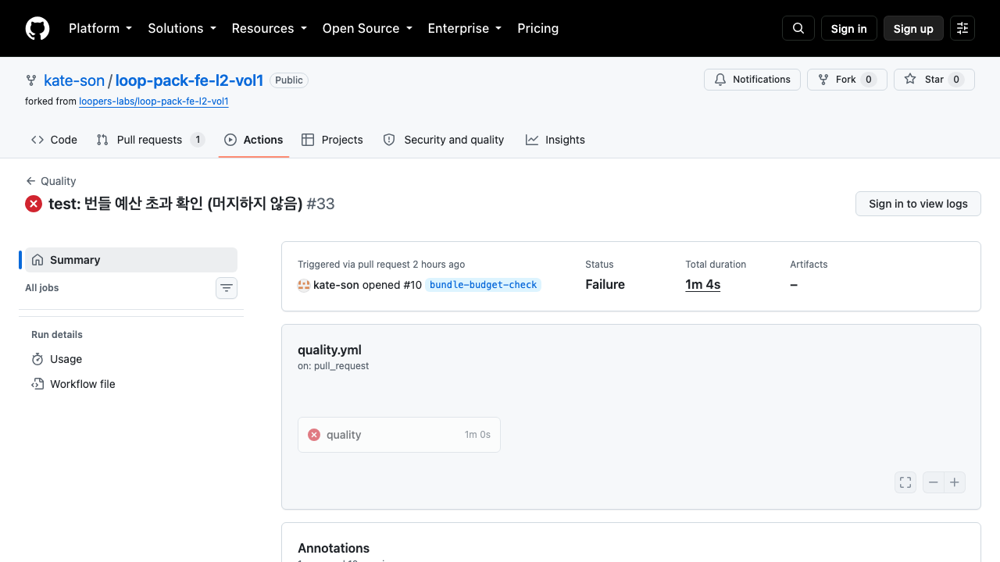

# 3단계 — 예산 게이트와 결과 가시성

코드 변경만으로 재현되는 번들 크기와 환경 변수 계약을 CI에서 차단하고, 실패 원인을 실행 요약에서 확인할 수 있게 한다.

| 항목                     | 상태                                     |
| ------------------------ | ---------------------------------------- |
| 번들 예산 게이트         | 완료 — `scripts/measure-transfer.mjs`    |
| 환경 변수 검증 (CI 맥락) | 완료 — `scripts/validate-env.mjs`        |
| 환경 변수 검증 (CD 맥락) | 스크립트 준비 완료, **배포 환경 미확인** |
| 실패·복귀 PR 증거        | 완료 — PR #10                            |
| required 동작 확인       | 완료 — 임시 보호 브랜치, PR #11·#12·#13  |
| required 영구 배치       | **미실시** — 확인 후 보호 설정을 정리함  |

---

## 1. 임계값의 근거

### 7주차 값 재분류

7주차 기록의 숫자는 대상이 서로 다르다. 번들 예산에는 JS·CSS만 쓴다.

| 값                        | 실제 대상                 | 출처                                                | 예산에 사용 |
| ------------------------- | ------------------------- | --------------------------------------------------- | ----------- |
| 홈 163.7KB / 목록 132.4KB | **hero 이미지 전송량**    | `docs/rfc/week7/week07-part4/README.md` 164행·542행 | 아니오      |
| 약 138KB                  | JS 청크 (DevTools 워터폴) | `docs/rfc/week7/week07-part3/README.md` 319행       | 참고        |
| CSS ×2 4.6KB              | CSS 전송량 (같은 표)      | 같은 파일                                           | 참고        |
| CSS 총량 3.7KB            | 비압축 총량               | `docs/rfc/week7/week07-part4/README.md` 316행       | 참고        |

### 7주차와 현재의 측정 범위 차이

**압축 기준만 같고 자산 집합은 다르다.** 같은 수치의 재현이 아니라, 현재 진입점 예산을 새로 세우기 위한 참고로 쓴다.

| 구분  | 무엇을 잰 값                                           |
| ----- | ------------------------------------------------------ |
| 7주차 | 관측된 주요 JS 자산의 전송량 (워터폴 한 행)            |
| 현재  | `/`와 `/products`가 실제로 참조한 JS·CSS **전체 합계** |

### 현재값 측정

| 항목      | 값                                                                                       |
| --------- | ---------------------------------------------------------------------------------------- |
| 측정 커밋 | `c6f71395`                                                                               |
| 환경      | Node v24.17.0 / pnpm 10.15.1 / Next 16.2.10 / macOS arm64                                |
| 절차      | `pnpm build` 후 `next start --hostname 127.0.0.1 --port 3210`                            |
| 요청      | 진입점 HTML을 받아 참조된 `/_next/static/**`의 JS·CSS를 `Accept-Encoding: gzip`으로 요청 |
| 합산      | 응답 본문의 wire byte. 응답 헤더의 `content-encoding`을 파일별로 기록                    |
| KB 환산   | `bytes / 1024`, 소수 첫째 자리 반올림. 판정은 byte로 한다                                |
| 반복      | 3회                                                                                      |

3회 raw 값 — **byte 단위까지 동일, 범위 0**.

| 회차 | `/` JS  | `/` CSS | `/` 합계    | `/products` JS | `/products` CSS | `/products` 합계 |
| ---- | ------- | ------- | ----------- | -------------- | --------------- | ---------------- |
| 1    | 219,033 | 3,213   | **222,246** | 228,480        | 3,213           | **231,693**      |
| 2    | 219,033 | 3,213   | **222,246** | 228,480        | 3,213           | **231,693**      |
| 3    | 219,033 | 3,213   | **222,246** | 228,480        | 3,213           | **231,693**      |

KB로는 `/` 217.0KB, `/products` 226.3KB다.

**응답 인코딩**: `/products`의 16개 중 13개가 `gzip`, 3개가 `identity`다. 서버는 작은 파일을 압축하지 않고 내려준다(`0c0wq3ntos4-u.css` 991 B, `0d0-5ks2bgg1y.js`·`3z5vla6aw7rmn.js` 각 399 B). 브라우저가 받는 양을 재는 것이 목적이므로 그 경우도 받은 그대로 더한다.

`/products` 파일별 전송량:

```
70972 B gzip     0ctm3i2mzu4am.js      8935 B gzip     2zr5608t7yez7.js
39627 B gzip     0cz1d0mv5g_q7.js      8105 B gzip     21ma4d--hfotv.js
37353 B gzip     0n4b__2liqxe0.js      8013 B gzip     1ehk8h76sefkw.js
12885 B gzip     2_5j8l4s_w03f.js      5657 B gzip     0ppao-926gz5p.js
12143 B gzip     23hf_4mbohzg1.js      4150 B gzip     turbopack-1yf-dal_ol1dr.js
10818 B gzip     1m7rk1av5mq_o.js      2222 B gzip     3t43jy-na-arw.css
 9024 B gzip     35jodn_1d6hu2.js       991 B identity 0c0wq3ntos4-u.css
                                         399 B identity 0d0-5ks2bgg1y.js
                                         399 B identity 3z5vla6aw7rmn.js
```

### 임계값

```
최대 진입점 /products = 231,693 B
정책 여유폭 10%      → 254,862 B
KB 반올림            → 249KB = 254,976 B
```

**10%는 측정 변동폭이 아니라 변경 허용폭이다.** 반복 측정 범위가 0이므로 흔들림 대비 여유는 필요 없다. 의존성 패치처럼 작은 증가를 매번 막지 않으려는 **정책값**이고, 관측에서 계산된 객관적 여유가 아니다. 변경 이력이 충분히 쌓이면 다시 정한다.

| 이 예산이 하는 일과 하지 않는 일                                                                                                     |
| ------------------------------------------------------------------------------------------------------------------------------------ |
| **하는 일** — 현재 상태에서의 추가 증가를 제한한다. 최대 진입점 `/products`에만 적용한다                                             |
| **하지 않는 일** — 7주차 수준(JS 약 138KB)으로 되돌리는 목표가 아니다. 그 사이 9주차 인증·이벤트 계측 등이 추가돼 이미 늘어난 상태다 |
| 초과 시 예산을 올려 통과시키지 않는다. 증가 원인을 먼저 확인한다                                                                     |

---

## 2. 측정 대상과 도구 선택

### 대상

**진입점 HTML이 참조하는 JS·CSS 전체.** 다른 후보와 비교하면 이렇다.

| 안                                     | 측정값 (gzip)   | 진입 비용과의 관계                                 |
| -------------------------------------- | --------------- | -------------------------------------------------- |
| `.next/static/**` 전체 합산            | 271.0KB         | 모든 라우트의 산출물. 한 사용자가 받는 양이 아니다 |
| 공통 진입 JS(`rootMainFiles`+polyfill) | 167.2KB         | `/products` 진입 전체를 대표하지 못한다            |
| **진입점별 참조 자산 합계**            | 217.0 / 226.3KB | **실제 진입 비용과 일치**                          |

### 도구

`size-limit`을 쓰지 않는다. `@size-limit/file`은 glob으로 파일을 합산하는데, 어느 청크가 어느 진입점에 실리는지는 app 라우터 + Turbopack 빌드에서 `build-manifest.json`만으로 나오지 않는다(`app-build-manifest.json` 없음). 진입점 단위 합산을 표현할 수 없다.

과제가 "size-limit 또는 동등 도구"를 허용하므로, **위 정의를 그대로 구현한 Node 스크립트 하나를 유일한 차단 기준으로 둔다.** 두 도구를 함께 두면 어느 쪽이 실제 기준인지 흐려진다.

| 항목      | 값                             |
| --------- | ------------------------------ |
| 차단 기준 | `scripts/measure-transfer.mjs` |
| 실행      | `pnpm measure:transfer`        |
| 설정      | `bundle-budget.json`           |
| 보조 지표 | 두지 않음                      |

---

## 3. 환경 변수 검증 — 두 컷으로 나눈다

`scripts/validate-env.mjs`가 `--context`로 갈린다.

### CI 컷 — 코드만으로 판정 가능한 것

| 검사                       | 내용                                                                                        |
| -------------------------- | ------------------------------------------------------------------------------------------- |
| `APP_ORIGIN` 형식          | 값이 있으면 URL 파싱과 http/https 프로토콜을 확인                                           |
| `AUTH_SESSION_SECRET` 존재 | 비어 있으면 실패                                                                            |
| `NEXT_PUBLIC_` 접두사 오용 | `src`·`e2e`·`test`의 171개 파일에서 서버 전용 값에 접두사가 붙었는지 정적 검사. 주석은 제외 |

**CI에는 실제 비밀값이 없다.** workflow가 로그에 남아도 문제가 없는 검증용 값을 주입한다.

```yaml
env:
  APP_ORIGIN: http://127.0.0.1:3000
  AUTH_SESSION_SECRET: ci-validation-placeholder
```

값의 진짜 여부는 CI에서 묻지 않는다. 형식과 접두사 오용만 본다.

### CD 컷 — 배포 환경에서만 판정 가능한 것

| 검사                  | 내용                                                              |
| --------------------- | ----------------------------------------------------------------- |
| `AUTH_SESSION_SECRET` | 비어 있거나 코드의 fallback(`loopers-week09-secret`)이면 실패     |
| `APP_ORIGIN`          | 비어 있거나 `localhost`/`127.0.0.1`이면 실패. https가 아니면 실패 |

`src/app/api/_data/auth.ts:16`과 `src/shared/api/response.ts:23`에 fallback이 있어, 값을 주지 않아도 빌드와 실행이 통과한다. 그 상태로 배포되면 기본 시크릿으로 도는데 코드 검증으로는 드러나지 않는다.

**이 검증은 배포 환경이 준비되지 않아 아직 실행하지 못했다.** 스크립트만 준비돼 있다. Preview·Production의 `APP_ORIGIN`·API 대상·쿠키 설정이 서로 섞이지 않는지도 그때 확인한다.

### 로컬 확인 결과

| 맥락         | 입력                                | 결과                                 |
| ------------ | ----------------------------------- | ------------------------------------ |
| `ci`         | 값 없음                             | **실패** — 검증용 값을 주입해야 한다 |
| `ci`         | 검증용 값 주입                      | 통과                                 |
| `production` | `AUTH_SESSION_SECRET`이 fallback 값 | **실패** — fallback 그대로           |
| `production` | `APP_ORIGIN=http://localhost:3000`  | **실패** — 로컬 주소, https 아님     |

---

## 4. Lighthouse — required에서 제외

실험실 점수는 단발성 측정이라 실제 사용자 성능을 대표하지 않는다. **CI·CD의 차단 기준으로 쓰지 않는다.**

7주차 기록에는 같은 페이지의 LCP가 회차마다 1,405ms와 7,325ms로 갈린 이봉분포 사례가 있다(`docs/rfc/week7/week07-part4/README.md`). 측정 프로토콜·캐시 상태·횟수와 함께 **LIVE CUT의 참고 자료**로 보존한다.

실사용자 데이터(RUM)를 수집하는 경로가 없어 LIVE CUT 게이트는 만들지 않았다. 회고에 그 한계를 적는다.

---

## 5. 결과 가시성

`pnpm measure:transfer`가 판정 결과를 표로 만들어 `$GITHUB_STEP_SUMMARY`에 기록한다. Actions 실행 요약 화면에서 로그를 열지 않고 확인한다.

초과 시 출력 예(임계값을 200KB로 낮춰 확인):

```
### 번들 예산 초과

| 진입점       | 자산 수 | JS      | CSS   | 합계       | 예산    | 여유             |
| `/`          | 15      | 213.9KB | 3.1KB | 217.0KB    | 200.0KB | +17.0KB 초과     |
| `/products`  | 16      | 223.1KB | 3.1KB | 226.3KB    | 200.0KB | +26.3KB 초과     |

`/products`가 예산을 26.3KB 넘겼다. 늘어난 자산은 아래 목록에서 확인한다.
- 69.3KB /_next/static/chunks/0ctm3i2mzu4am.js
- 38.7KB /_next/static/chunks/0cz1d0mv5g_q7.js
  ...
```

항목명·현재 크기·임계값·초과량이 한 표에 있고, 큰 자산 10개가 함께 나온다. PR 코멘트 권한(`pull-requests: write`)은 부여하지 않았다. 실행 요약으로 충분한지 확인한 뒤 필요하면 추가한다.

### PR 화면 캡처

실패한 GitHub Actions run [34511183387](https://github.com/kate-son/loop-pack-fe-l2-vol1/actions/runs/34511183387)의 Summary 화면에서 quality job이 실패한 사실을 확인할 수 있다. Summary 화면에는 로그 접근 권한에 따라 상세 표가 노출되지 않을 수 있으므로, 정확한 현재값·임계값·`82.3KB` 초과량은 연결된 run 로그와 위 출력에 함께 기록했다.



---

## 6. workflow 순서

```
1. 의존성 설치
2. Validate env (ci)     ← build 전
3. Test / Lint / Typecheck
4. Build
5. Bundle budget         ← build 산출물 재사용, build를 다시 돌리지 않는다
```

예산 판정은 `next start`로 이미 만들어진 `.next`를 띄워 측정한다. 별도 빌드가 없다.

---

## 7. 컷별 required 여부

| 검증                  | 컷   | 실행 조건  | required  | 담는 check     | 근거                                       |
| --------------------- | ---- | ---------- | --------- | -------------- | ------------------------------------------ |
| 번들 예산             | CI   | 모든 PR    | 예        | `quality`      | 코드만으로 재현되고 반복 측정 범위가 0이다 |
| 환경 변수 형식·접두사 | CI   | 모든 PR    | 예        | `quality`      | 정적 검사라 오탐 여지가 낮다               |
| E2E                   | CI   | 앱 변경 시 | 예        | `e2e-required` | 실행 조건이 갈려 guard job을 대신 지정한다 |
| 환경 변수 실제 주입   | CD   | 배포 시    | 배포 중단 | —              | 배포 환경 값을 봐야 판정된다               |
| Lighthouse 실험실     | —    | 사용 안 함 | 아니오    | —              | 단발성 측정이라 차단 기준으로 쓰지 않는다  |
| 실사용 Web Vitals     | LIVE | 미구축     | 아니오    | —              | 수집 경로가 없다                           |

required로 지정한 것은 job 이름 `quality`와 `e2e-required` 둘뿐이다. 예산·환경 변수 검증은 `quality` job 안의 step이라 별도 check로 잡히지 않고, `e2e`는 스킵될 수 있어 지정 대상에서 뺐다.

### required 배치와 확인

`main`에 영향을 주지 않기 위해 임시 보호 브랜치 `experiment/week10-protected-base`를 `feat/week-10`(`51f3e600`)에서 만들고, 거기에만 required status check로 `quality`와 `e2e-required`를 지정했다. `strict: false`(base 최신화 요구 없음), `enforce_admins: false`, 리뷰 요구 없음이다. 리뷰 요구를 걸지 않았으므로 머지 판정 차이는 check 결과에서만 갈린다.

세 경로를 각각 PR로 열었다. 세 PR은 base와 보호 설정이 같고 변경 내용만 다르다.

| 경로               | PR                                                              | `changes` 판정 | `e2e`     | `e2e-required` | `quality` | mergeStateStatus |
| ------------------ | --------------------------------------------------------------- | -------------- | --------- | -------------- | --------- | ---------------- |
| 앱 파일 변경       | [#11](https://github.com/kate-son/loop-pack-fe-l2-vol1/pull/11) | `run=true`     | success   | success        | success   | **CLEAN**        |
| 문서만 변경        | [#12](https://github.com/kate-son/loop-pack-fe-l2-vol1/pull/12) | `run=false`    | `skipped` | success        | success   | **CLEAN**        |
| E2E 단언 고의 실패 | [#13](https://github.com/kate-son/loop-pack-fe-l2-vol1/pull/13) | `run=true`     | failure   | **failure**    | success   | **BLOCKED**      |

guard가 무엇을 보고 판정했는지는 실행 로그에 남는다.

```
#11  changes=success target=true  e2e=success   → E2E가 통과했다.
#12  changes=success target=false e2e=skipped   → 문서 변경만 있어 E2E를 의도적으로 스킵했다.
#13  changes=success target=true  e2e=failure   → E2E 결과가 통과가 아니다: failure   (exit 1)
```

run: [#11 34512231977](https://github.com/kate-son/loop-pack-fe-l2-vol1/actions/runs/34512231977) · [#12 34512237137](https://github.com/kate-son/loop-pack-fe-l2-vol1/actions/runs/34512237137) · [#13 34512240360](https://github.com/kate-son/loop-pack-fe-l2-vol1/actions/runs/34512240360)

#13만 BLOCKED가 된 것을 `e2e-required` 실패로 볼 수 있는 이유는, 나머지 조건이 셋 다 같고 `quality`는 모두 성공했으며 리뷰 요구를 걸지 않았기 때문이다. 스킵된 `e2e`가 차단 사유가 되지 않는다는 점도 #12에서 같이 확인된다 — `e2e`가 `skipped`인데 머지는 막히지 않았다.

**확인 뒤 보호 설정과 임시 브랜치, 실험 PR을 모두 정리했다.** 그래서 지금 이 저장소의 `main`과 `feat/week-10`에는 branch protection이 없고, 실제로 머지가 막히는 상태는 아니다. 확인된 범위는 "required로 지정하면 세 경로가 이렇게 판정된다"까지다. 영구 배치는 같은 설정을 `main`에 한 번 적용하면 된다.

```bash
# protection.json: required_status_checks.checks = [quality, e2e-required], strict=false,
#                  enforce_admins=false, required_pull_request_reviews=null
gh api -X PUT repos/<owner>/<repo>/branches/main/protection --input protection.json
```

---

## 8. 빨간불 자가 검증

예산을 넘기는 변경을 만들어 CI가 막는지, 실행 요약만 보고 원인을 알 수 있는지 확인했다.

### 초과를 만든 방법

`/products`의 클라이언트 컴포넌트 `src/app/products/_ui/ProductView.tsx`에 무의미한 무거운 import를 넣었다.

```tsx
import * as prettierStandalone from 'prettier/standalone';
import * as prettierBabel from 'prettier/plugins/babel';

// 이 참조가 없으면 위 import가 트리 셰이킹으로 사라진다.
const BUNDLE_PROBE = Object.keys(prettierStandalone).length + Object.keys(prettierBabel).length;
```

임계값을 낮추는 방식은 쓰지 않았다. 그러면 "번들이 커져서 막혔다"가 아니라 "예산 설정만 바뀌었다"가 된다.

### 결과 — [PR #10](https://github.com/kate-son/loop-pack-fe-l2-vol1/pull/10)

| 단계 | 커밋       | run                                                                                      | 결과        |
| ---- | ---------- | ---------------------------------------------------------------------------------------- | ----------- |
| 초과 | `c9e28641` | [34511183387](https://github.com/kate-son/loop-pack-fe-l2-vol1/actions/runs/34511183387) | **failure** |
| 복귀 | `f811e0bb` | [34511448577](https://github.com/kate-son/loop-pack-fe-l2-vol1/actions/runs/34511448577) | **success** |

초과 회차의 step 결과다. **다른 검증은 전부 통과하고 `Bundle budget`만 실패했다.**

```
success  Validate env (ci)
success  Test / Lint / Typecheck / Build
failure  Bundle budget
```

실행 요약에 남은 표다. 로그를 열지 않고 여기서 원인을 읽는다.

| 진입점      | 자산 수 | JS      | CSS   | 합계        | 예산    | 여유             |
| ----------- | ------- | ------- | ----- | ----------- | ------- | ---------------- |
| `/`         | 15      | 213.9KB | 3.1KB | 217.0KB     | 249.0KB | 32.0KB 남음      |
| `/products` | 17      | 328.2KB | 3.1KB | **331.3KB** | 249.0KB | **+82.3KB 초과** |

이어서 큰 자산 10개가 나열된다. **변경한 진입점만 잡히고 `/`는 그대로 통과**한다는 점도 함께 확인됐다. CI 값이 로컬 측정값과 같았다.

### 복귀

`git revert`로 되돌린 뒤 `feat/week-10`과 파일 내용이 완전히 같아졌고, 같은 PR의 다음 회차에서 `Bundle budget`이 다시 통과했다. 실험 PR은 머지하지 않고 닫았다.

---

## 9. 남은 것

| #   | 항목                                                                                     |
| --- | ---------------------------------------------------------------------------------------- |
| 1   | 임시 브랜치에서 확인만 한 required 설정을 `main`에 영구 배치한다                         |
| 2   | 배포 환경이 준비되면 `--context=production` 검증을 실행한다                              |
| 3   | `changes` job 자체가 실패하는 경우(API 오류 등)는 코드 경로로만 확인했고 재현하지 않았다 |
