# 7주차 — 초기 로딩 성능과 목록 상태 설계

7,545,239B(7.20MiB) Hero 이미지가 초기 화면의 LCP를 지배했고, 상품 목록은 최초 로딩과 갱신을 같은 방식으로 처리하고 있었습니다. 이미지 전송량을 줄이고 렌더링 경계를 정리해 Slow 4G 조건의 LCP 중앙값을 **44.8초에서 2.3초로 줄였고**, 상품 목록의 로딩·갱신·빈 결과·실패·취소 상태를 분리했습니다.

성능 수치만 줄이는 데서 끝내지 않고 동적 metadata의 비용, 서버 요청 중복, prefetch 실패 시 오류 소유권까지 확인했습니다. 공식 Before·After 성능 비교와 Lighthouse 캡처는 2026년 8월 8일에 `http://localhost:3000/`에서 같은 조건으로 실행한 [Lighthouse JSON 10개 요약](./measurement-summary.json)을 기준으로 작성했습니다. DevTools 동작 캡처와 production HTML·HTTP 기록은 최종 코드의 보조 검증 자료이며 Lighthouse 수치와 섞어 해석하지 않았습니다.

## 결과 요약

| 항목 | Before | After | 판단 |
|------|--------|-------|------|
| LCP 중앙값 | 44,846ms | 2,262ms | 42,584ms 단축 |
| LCP 범위 | 44,718–45,342ms | 2,184–2,856ms | 이미지 전송 병목을 크게 축소 |
| FCP 중앙값 | 2,723ms | 2,198ms | 525ms 단축 |
| 홈 CLS 중앙값 | 0 | 0 | 레이아웃 안정성 유지 |
| Hero 이미지 | JPEG 7.20MiB | AVIF/WebP 21.1–157.8KiB | viewport별 후보 제공 |
| 목록 대기 화면 | 텍스트 스피너 | 실제 그리드 형태의 스켈레톤 | 최초 로딩과 갱신 분리 |
| 상품 목록 서버 호출 | 진단 중 document당 2회 관찰 | 최종 document당 1회 | 동일 URL·options로 memoization, 최종 로그 첨부 |

## 판단 기록

각 변경은 관찰한 사실과 반증 조건을 먼저 정한 뒤 선택했습니다.

| 대상 | 관찰한 사실 | 원인 가설 | 반증 조건 | 가장 작은 변경 |
|------|-------------|-----------|-----------|----------------|
| Hero LCP | 대표 Before의 44,846ms 중 이미지 전송이 44,141ms였습니다. | 7.20MiB JPEG 전송이 LCP를 지배합니다. | 전송량을 줄여도 이미지 전송 구간과 LCP 범위가 유지되면 기각합니다. | 같은 원본으로 viewport별 AVIF/WebP 후보를 제공합니다. |
| 목록 갱신 | query key가 바뀔 때 기존 목록 전체가 fallback으로 교체됐습니다. | 최초 로딩과 갱신이 같은 Suspense 경계를 사용해 기존 결과가 사라집니다. | 이전 데이터를 유지해도 목록이 사라지거나 마지막 URL과 결과가 다르면 기각합니다. | `useQuery`와 `keepPreviousData`로 갱신을 분리하고 `AbortSignal`을 전달합니다. |
| metadata 요청 | 상품 목록 document 한 번에 같은 Route Handler가 두 번 실행됐습니다. | 두 서버 fetch의 `AbortSignal`이 달라 request memoization이 적용되지 않습니다. | URL·options를 맞춘 뒤에도 서버 호출이 2회면 기각합니다. | 서버 fetch에서만 `signal`을 제외합니다. |
| prefetch 실패 | `ensureQueryData`가 throw해 목록의 인라인 오류 UI까지 도달하지 못했습니다. | 서버 prefetch가 목록 오류의 소유권을 먼저 가져갑니다. | throw하지 않는 prefetch 뒤에도 공통 오류 화면이 나타나면 기각합니다. | `ensureQueryData`를 `prefetchQuery`로 한 줄 교체합니다. |

## 측정 기준

성능 변경 전후를 같은 조건에서 각각 5회 측정하고 중앙값·최솟값·최댓값을 비교했습니다. localhost의 무제한 전송에서는 7.20MiB 이미지도 빠르게 내려와 병목이 드러나지 않아, 최종 판단에는 네트워크와 CPU 제한을 직접 적용한 결과를 사용했습니다.

| 항목 | 조건 |
|------|------|
| Before SHA | `ee94807` |
| After 측정 SHA | `a924f54` |
| 측정 후 기준 SHA | `61e2b65` — 상품 목록 폴백의 데이터 소유권만 Query cache로 이동, 홈 측정 경로 변경 없음 |
| 측정 후 검증 변경 | 상품 카드·스켈레톤 CLS와 FSD Public API 보완, 홈 Lighthouse 측정 경로·Hero 리소스 변경 없음 |
| 실행 방식 | Lighthouse 측정 산출물의 기록은 Next.js production build(Webpack), `APP_ORIGIN=http://localhost:3000` |
| 측정 도구 | Lighthouse CLI 12.8.2 |
| 브라우저·프로필 | Chrome 151.0.7922.76, Before·After 모두 같은 실행 옵션의 격리된 임시 프로필 |
| 화면 조건 | 모바일 412×823, DPR 1.75 |
| 제한 조건 | DevTools Slow 4G, CPU 4x slowdown |
| URL·로드 조건 | `http://localhost:3000/`, 캐시를 비운 콜드 로드(cold load) |
| 반복 횟수 | Before·After 각 5회 |
| 판단 지표 | FCP, LCP, CLS, LCP 4구간, 전송 크기, 회귀 여부 |

공식 비교는 위 표의 모바일 412×823, DPR 1.75, Slow 4G, CPU 4x 조건만 사용했습니다. 최종 회귀 검증과 추가 DevTools 증거 수집은 Chrome 151.0.7922.76의 격리된 임시 프로필에서 같은 모바일 viewport와 DPR을 유지하고 캐시를 비활성화했습니다. 추가 Network 캡처는 네트워크 제한 없이 파일 선택·형식·전송 크기만 확인한 보조 자료이므로 Lighthouse 시간 비교에는 사용하지 않았습니다. 현재 Next.js 16.2.10의 `pnpm build`는 Turbopack으로 완료되므로, 측정 요약에 기록된 Lighthouse 당시 Webpack build와 최종 빌드 도구를 구분합니다.

Lighthouse CLI가 생성한 10개 report JSON은 직접 관찰을 대신하지 않고 5회 반복값을 빠짐없이 집계하는 데 사용했습니다. 제출물에는 필요한 필드와 run 이름을 [측정 요약](./measurement-summary.json)에 보존했습니다. 병목 구간과 filmstrip은 Lighthouse HTML report에서 직접 확인했고, 실제 요청 워터폴(waterfall)·Layout Shifts·취소 상태는 Chrome DevTools의 Network와 Performance 패널을 직접 열어 확인했습니다. 따라서 AI가 JSON만 보고 화면 동작을 추정한 결과와 구분됩니다.

원시값과 재현 결과는 다음 산출물에서 다시 확인할 수 있습니다.

- [Lighthouse 10회 측정 요약](./measurement-summary.json): 각 run의 FCP·LCP·CLS와 대표 run의 LCP 4구간
- [홈 document와 Hero 요청](./evidence/home-network.json): 요청 순서와 실제 전송 크기
- [상품 목록 동작 기록](./evidence/products-runtime.json): active query, 최종 URL, 취소된 요청
- [normal·empty 응답과 UA별 시간](./evidence/http-runtime.json): 초기 HTML의 metadata·구조와 응답 시점
- [metadata query failure 응답](./evidence/http-runtime-query-failure.json): root metadata 상속 결과
- document 원본: [normal](./evidence/document-normal.html) · [empty](./evidence/document-empty.html) · [query failure](./evidence/document-normal-query-failure.html)
- [Route Handler 호출 계수](./evidence/route-handler-count.log): document 한 번에서 관찰한 서버 호출 1회

대표 캡처는 LCP 중앙값에 해당하는 Before `run-04`와 After `run-04`입니다. Lighthouse 화면은 초 단위 한 자리로 반올림하며, 아래 5회 측정값 표에는 같은 report JSON의 값을 밀리초 단위로 반올림해 적었습니다.

<p align="center">
  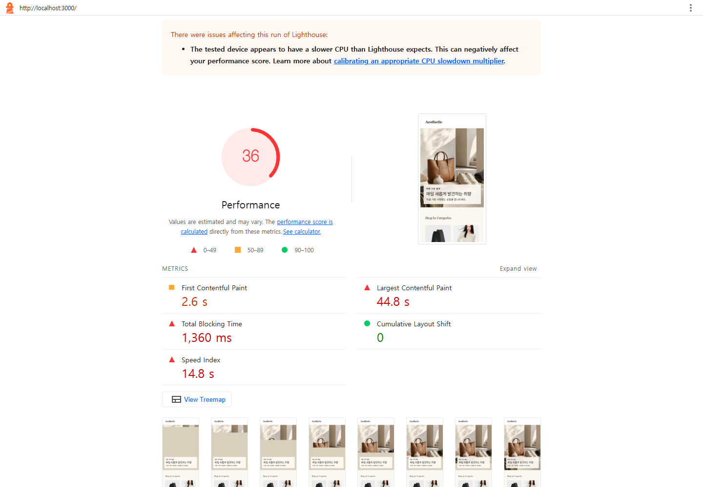
  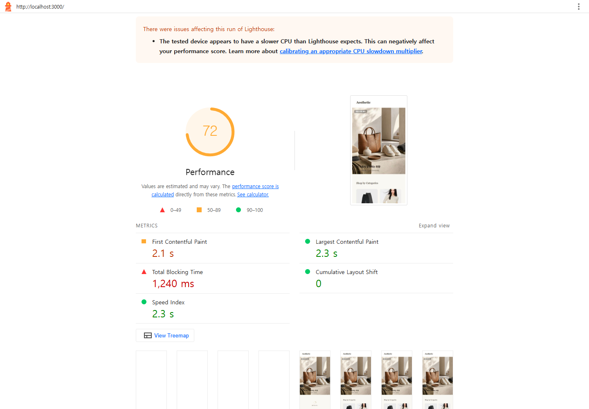
</p>

- Before `run-04`: FCP 2,567ms · LCP 44,846ms · CLS 0 · Performance 36
- After `run-04`: FCP 2,131ms · LCP 2,262ms · CLS 0 · Performance 72

## 1. Hero 이미지의 LCP 병목 제거

### 관찰

Before와 After의 LCP element는 모두 Hero의 ``였습니다. 대표 run에서 화면에 표시된 영역도 412×515px로 같았습니다. Before Hero는 7,545,239B(7.20MiB) JPEG 원본을 사용했습니다. 브라우저가 이미지 요청을 시작하기까지 약 0.62초가 걸렸고, Slow 4G에서는 이미지 전송 44.14초가 LCP의 대부분을 차지했습니다. After의 요청 시작 대기는 약 0.65초로 줄지 않았으므로, 렌더링 경계 변경을 이미지 발견 개선으로 해석하지 않았습니다.

LCP를 다음 네 구간으로 나누자 변경해야 할 지점이 명확해졌습니다.

| 구간 | 관찰 | 선택한 변경 |
|------|------|-------------|
| 서버 응답 대기 | 이번 변경의 주된 병목이 아님 | 유지 |
| 이미지 요청 시작 대기 | Before 620ms, After 650ms로 개선되지 않음 | 성능 개선값으로 해석하지 않음 |
| 이미지 전송 | 7.20MiB 원본이 지배적 병목 | 반응형 AVIF/WebP 제공 |
| 화면에 그리기 | 레이아웃 공간이 필요 | `aspect-ratio` 유지 |

### 최소 변경

- 640px·1080px·1920px 해상도마다 AVIF와 WebP를 생성했습니다.
- `<picture>`, `srcSet`, `sizes="(max-width: 1280px) 100vw, 1280px"`로 실제 CSS 슬롯 너비에 맞는 후보를 선택하게 했습니다.
- LCP 이미지에 `fetchPriority="high"`와 `loading="eager"`를 적용했습니다. 다만 After Lighthouse JSON에서 해당 요청의 관찰 priority는 `Low`였으므로, priority 상승을 개선 성과로 계산하지 않았습니다.
- Hero의 16:9, 모바일 4:5 비율을 예약해 이미지 교체 전후의 CLS를 막았습니다.
- Hero는 바로 이어지는 `h1`과 설명을 보조하는 장식 이미지라 빈 `alt`를 유지했고, 상품 이미지는 상품명을 대체 텍스트로 유지했습니다.

### 렌더링 경계 재조정

처음에는 fallback에도 Hero를 배치해 이미지 발견만 앞당겼습니다. 하지만 fallback의 고정 문구가 실제 `banner.title`과 `banner.description`으로 교체되면 같은 위치의 텍스트가 버벅여 보일 수 있었습니다.

현재 홈 데이터는 비동기 API가 아니라 동기 메모리 함수인 `getHomeData()`가 반환합니다. 따라서 Hero를 Suspense 밖의 현재 위치에서 한 번만 렌더하고, Suspense는 Hero 아래의 카테고리·인기 상품·신상품만 담당하도록 줄였습니다. 동적 문구의 소유권은 그대로 유지하면서 불필요한 텍스트 교체를 없앴습니다.

### 결과

대표적인 1080px AVIF의 전송 크기는 60,748B입니다. LCP 중앙값은 44,846ms에서 2,262ms로 95.0% 줄었습니다. CLS는 전후 모두 0이어서 이번 변경의 개선값으로 해석하지 않고 회귀가 없었다고 판단했습니다. Before LCP가 44,718–45,342ms에 집중되고 After가 2,184–2,856ms로 이동해 이미지 전송 병목이 크게 줄어든 사실을 확인했습니다.

아래는 After production build를 모바일 412×823, DPR 1.75에서 실행한 실제 홈 화면입니다. AVIF로 전환한 뒤에도 Hero의 피사체와 문구가 원본과 동일하게 유지됐습니다.


관찰한 사실은 Before LCP 44,846ms 중 이미지 전송이 44,140ms로 가장 길었다는 점입니다. 원인 가설은 viewport보다 큰 7.20MiB JPEG가 제한된 네트워크에서 전송 시간을 지배한다는 것이었습니다. 반응형 이미지를 적용한 뒤에도 전송 시간과 LCP 범위가 그대로라면 이 가설을 기각하기로 했습니다. 먼저 시도한 가장 작은 변경은 Hero의 피사체·문구·공간을 유지하면서 같은 원본에서 만든 AVIF/WebP 후보만 제공하는 것이었습니다.

### 같은 run의 filmstrip과 LCP breakdown

<p align="center">
  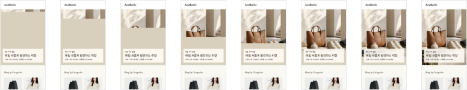
  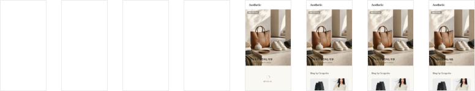
</p>

Before `run-04`는 Hero 전송에 44,141ms가 걸렸습니다. After `run-04`에서는 같은 구간이 1,496ms로 줄었습니다. Lighthouse 화면은 각각 44,140ms와 1,500ms로 반올림해 표시합니다.

<p align="center">
  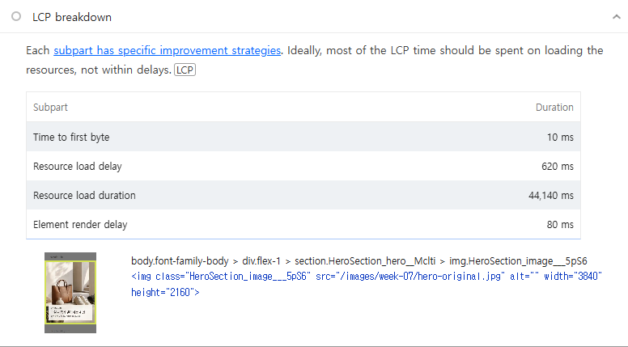
  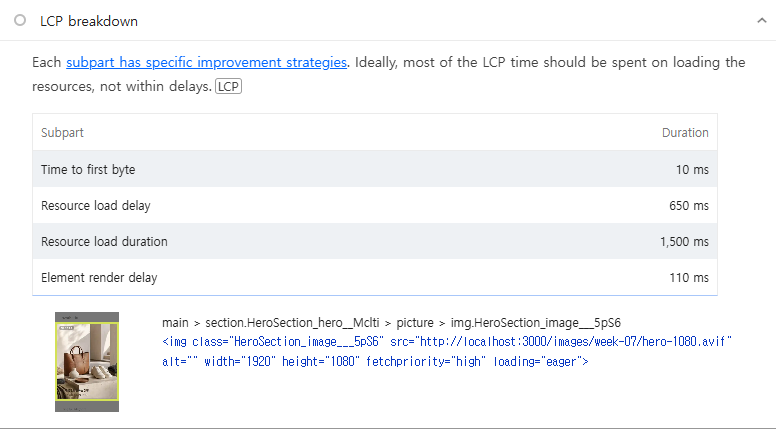
</p>

같은 두 run의 Lighthouse JSON에서 Hero 전송 크기는 7,545,525B에서 60,748B로 줄었습니다. 아래 이미지는 같은 run의 Network dependency tree이며 Hero 요청 행을 직접 보여 주는 DevTools waterfall은 아닙니다. 4구간 수치와 전송 크기는 모두 `http://localhost:3000/`에서 실행한 각 대표 run의 JSON에서 가져왔습니다.

<p align="center">
  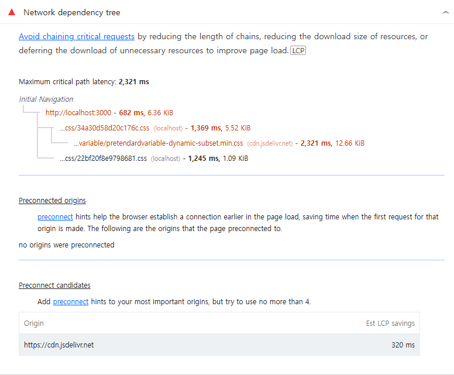
  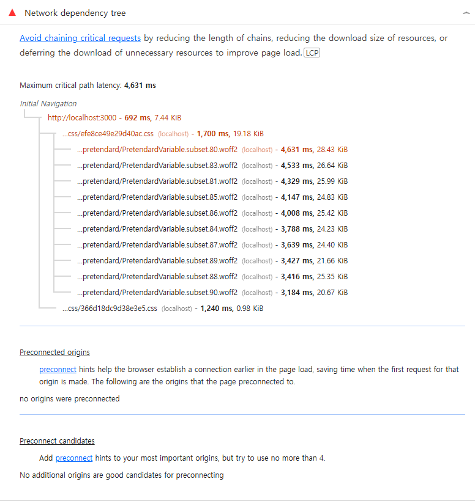
</p>

production 콜드 로드에서 document는 7,542B, Hero `hero-1080.avif`는 60,748B였고 document 다음에 Hero 요청이 시작됐습니다. 요청 순서와 원시 크기는 [home-network.json](./evidence/home-network.json)에 남겼습니다. 홈 데이터는 서버의 동기 메모리 함수에서 초기 HTML에 포함되므로 별도 `/api/home` 브라우저 요청은 발생하지 않았습니다.

아래는 최종 production build를 같은 모바일 412×823, DPR 1.75에서 캐시를 끄고 확인한 실제 DevTools Network 화면입니다. Hero 요청 행·형식·전송 크기와 워터폴을 직접 보여 줍니다. 이 화면의 무제한 네트워크 시간은 공식 전후 성능값으로 사용하지 않았습니다.

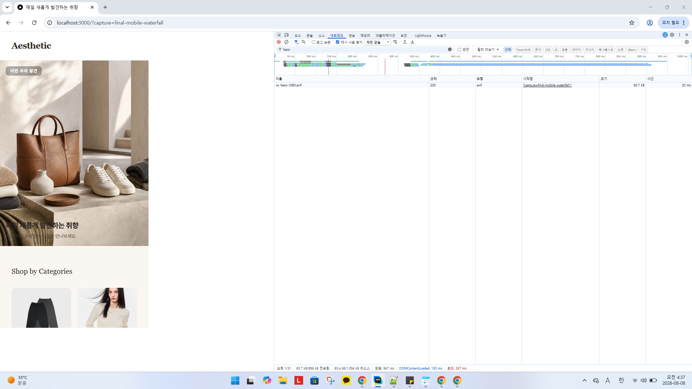

After `run-04`의 Layout shift culprits에는 원인 항목이 없었고, 같은 report JSON의 `layout-shifts` 항목도 0건, CLS도 0이었습니다.

<p align="center">
  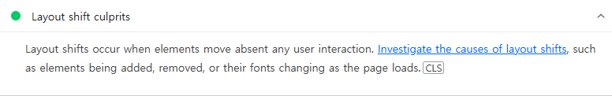
</p>

## 2. 상품 목록의 여섯 가지 상태 분리

### 문제

`useSuspenseQuery`를 사용할 때는 query key가 바뀔 때마다 목록 전체가 Suspense fallback으로 전환됐습니다. 검색·카테고리·정렬·페이지를 바꿀 때 기존 결과가 사라져, 최초 로딩과 기존 데이터 갱신을 구분할 수 없었습니다.

### 변경

- 최초 진입에는 실제 필터와 12개 카드 크기를 예상할 수 있는 `ProductListSkeleton`을 표시했습니다.
- 목록 조회를 `useQuery`와 `placeholderData: keepPreviousData` 조합으로 바꿨습니다.
- 갱신 중에는 이전 목록을 유지하고 `isPlaceholderData`와 `isFetching`으로 진행 상태를 표시했습니다.
- query key가 바뀌면 TanStack Query의 `AbortSignal`을 실제 `fetch`에 전달해 이전 요청을 취소했습니다.

`isPending`은 URL 상태 변경을 예약한 React transition만 나타내므로 네트워크 완료 화면과 연결하지 않았습니다. 실제 요청 중 여부는 `isFetching`, 이전 결과를 보여 주는 갱신 여부는 `isPlaceholderData`, 표시할 데이터가 전혀 없는 최초 상태는 `!displayData`가 맡습니다.

| 사용자 상태 | 화면 | 담당 상태 |
|-------------|------|-----------|
| 데이터 없는 최초 진입 | 목록 형태의 스켈레톤 | SSR prefetch + Suspense |
| 이전 데이터가 있는 갱신 | 기존 목록 유지·흐림·진행 문구 | `isPlaceholderData`, `isFetching` |
| 성공했지만 0건 | “상품이 없습니다.” | `data.products.length === 0` |
| 최초 실패 | 오류 안내와 다시 시도 | `isError && !displayData` |
| 기존 목록 갱신 실패 | 기존 목록과 인라인 오류 배너 | `isShowingFallback` |
| 취소된 요청 | 현재 query 결과 유지 | query key 변경 + `AbortSignal` |

상태별 UI 캡처와 Performance 기록은 최종 production build를 `APP_ORIGIN=http://localhost:3000`으로 실행하고 모바일 412×823, DPR 1.75에서 만들었습니다. 요청 취소와 주소창 복원 캡처는 최종 production build의 데스크톱 DevTools 보조 증거이며 Lighthouse 전후 비교에는 포함하지 않았습니다.

### 최초 진입과 기존 목록 갱신

<p align="center">
  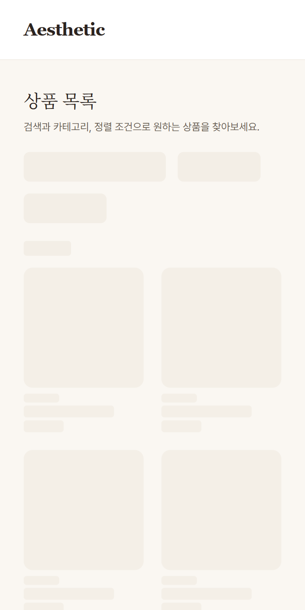
  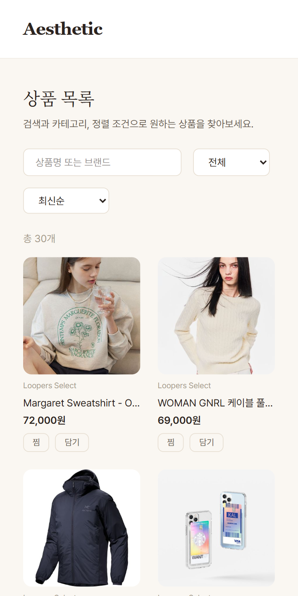
</p>

<p align="center">
  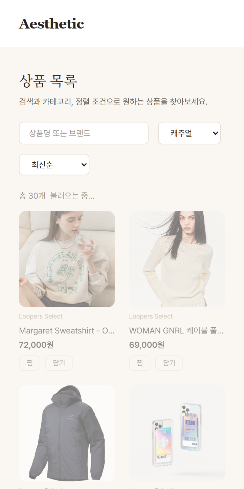
  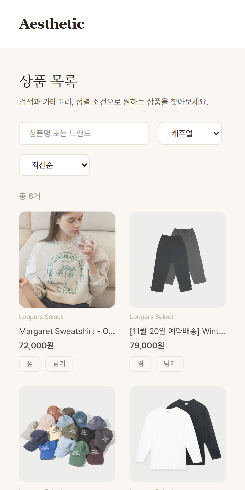
</p>

### 빈 결과와 실패 복구

<p align="center">
  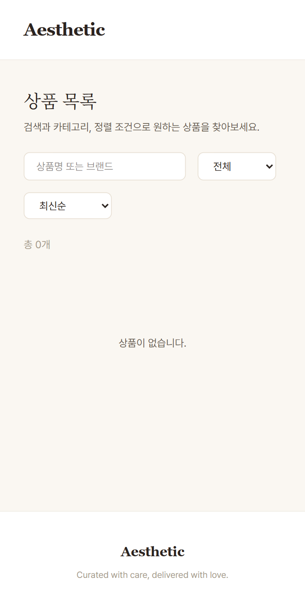
  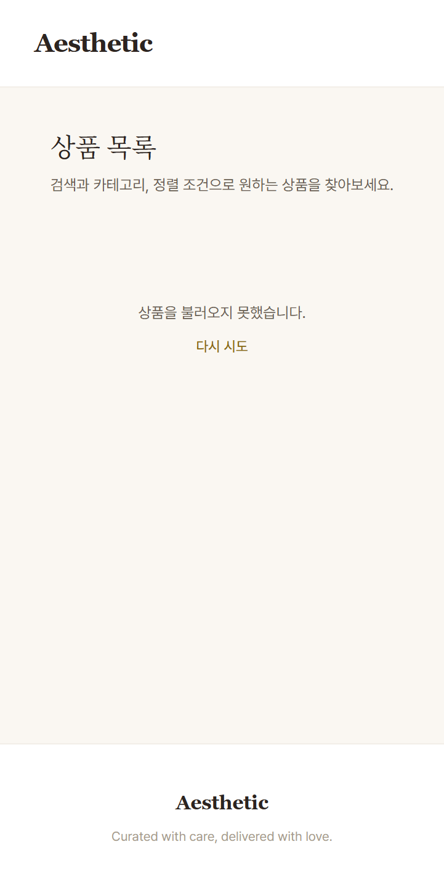
</p>

현재 사용 중인 TanStack Query v5.101.2에서 `placeholderData: keepPreviousData`는 새 query가 pending인 동안 이전 데이터를 제공합니다. 새 query가 에러로 확정되면 현재 관찰자에서 `data`가 `undefined`가 되는 동작을 직접 재현했습니다. 이는 [v5 `useQuery`의 `placeholderData` 설명](https://tanstack.com/query/v5/docs/framework/react/reference/useQuery)을 기준으로 판단했고, React Query 3.34.0을 다룬 GitHub #3046은 v5 근거로 사용하지 않았습니다.

갱신 실패 시 기존 목록을 유지하기 위해 로컬 state에는 마지막 성공 응답이 아닌 query key만 보존합니다. 실제 이전 응답은 TanStack Query가 소유한 캐시에서 `queryClient.getQueryData(lastSuccessKey)`로 조회하고, `displayData = data ?? fallbackData`로 폴백합니다. 서버 응답을 Zustand나 별도 로컬 상태에 복사하지 않습니다.

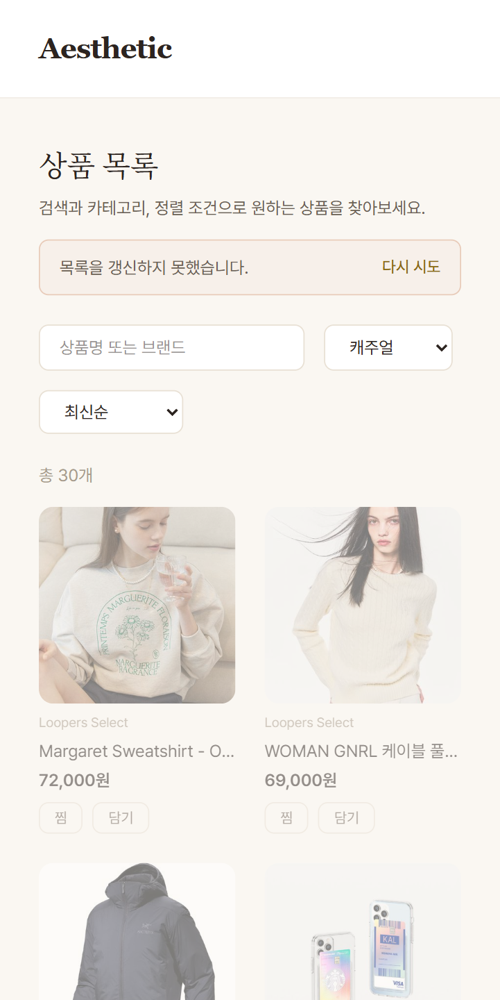

갱신 API를 재시도 횟수까지 5회 연속 실패시키자 기존 30개 목록과 인라인 오류 배너가 함께 남았습니다. 이후 `다시 시도`를 누르자 같은 `category=casual` URL에서 6개 결과로 복구됐습니다.

### 요청 취소와 URL 복원

빠르게 검색어를 바꿨을 때 이전 API 요청에서 `ERR_ABORTED`가 발생하고, 최종 URL·입력값·목록은 마지막 검색어와 일치했습니다. 뒤로 가기와 앞으로 가기에서도 URL의 검색·카테고리·정렬 조건이 화면에 복원됐습니다.

<p align="center">
  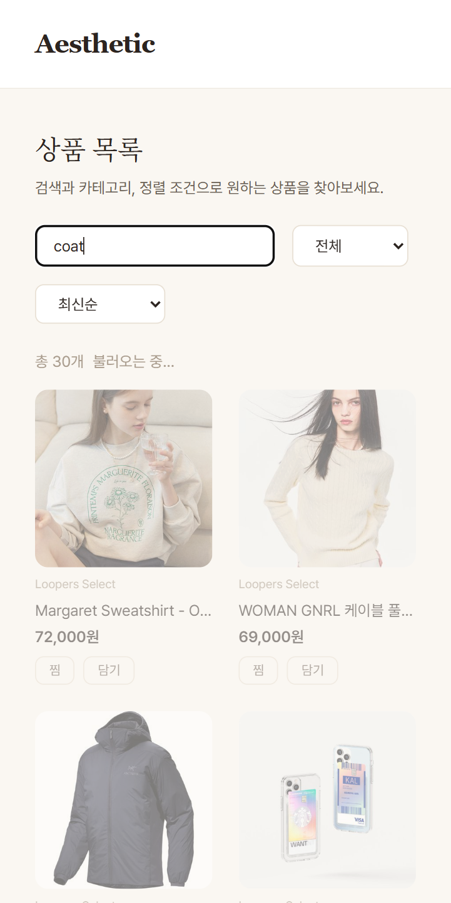
  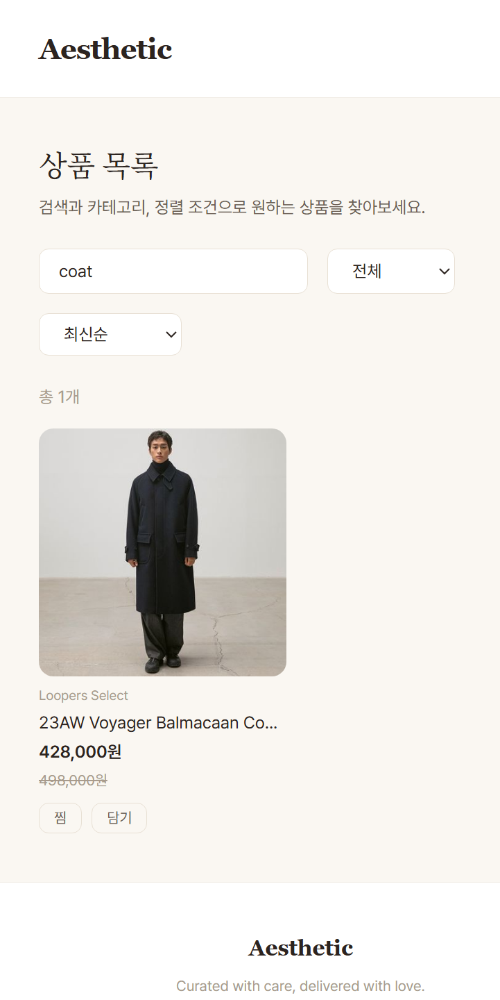
</p>

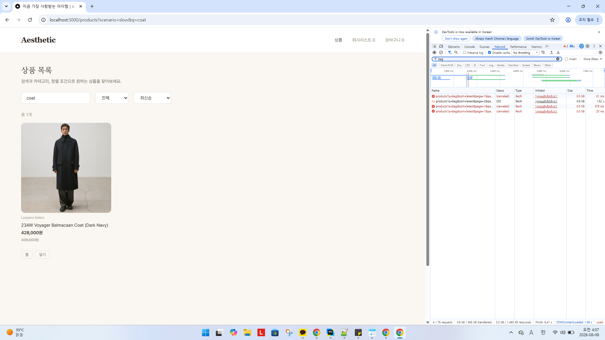

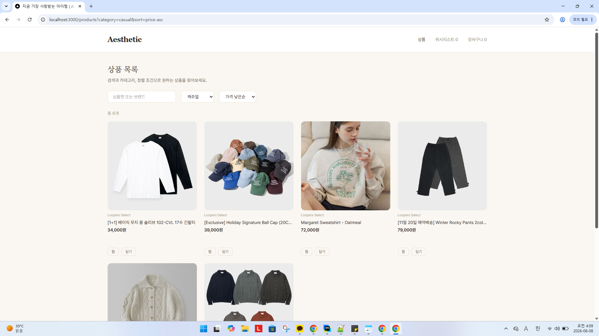

복원 전후 URL은 모두 `http://localhost:3000/products?category=casual&sort=price-asc`였고, control 값도 `category=casual`, `sort=price-asc`로 일치했습니다.

최초 fallback→목록 교체의 layout shift는 0건(CLS 0)이었고, 검색·카테고리·정렬·뒤로/앞으로를 연속 실행한 전체 구간도 CLS 0.00668이었습니다. 빠르게 검색어를 바꿨을 때 이전 요청에서 `net::ERR_ABORTED`가 발생하고, 최종 URL·입력값·목록은 마지막 검색어와 일치했습니다.

수정 전 진단 기록에서는 목록이 나타날 때 `main` 높이가 늘어나 footer가 밀리면서 CLS 0.54가 발생했습니다. `main`의 최소 높이를 예약하고 카드와 스켈레톤의 본문·버튼 영역 높이를 맞춘 뒤, 모바일 412×823, DPR 1.75의 Performance 재기록에서는 CLS가 0.01로 내려갔습니다. 이 상품 페이지 진단은 홈 Lighthouse 비교와 별개입니다. CDP 전체 상호작용 원시값은 [products-runtime.json](./evidence/products-runtime.json)의 0.006681이며, DevTools 표시값은 두 자리로 반올림됩니다.

<p align="center">
  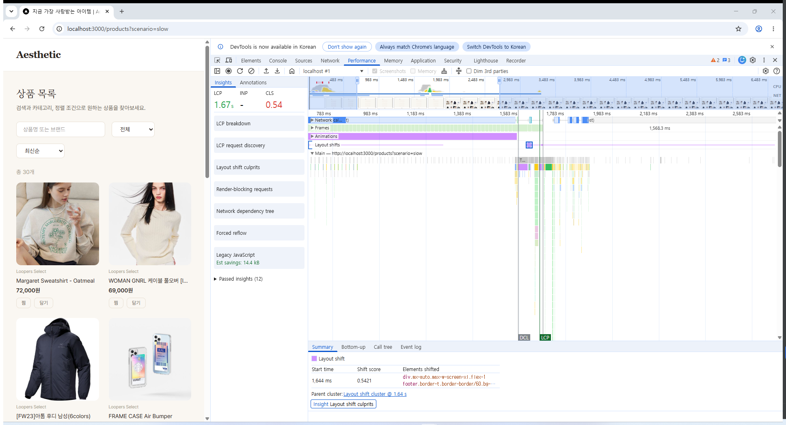
  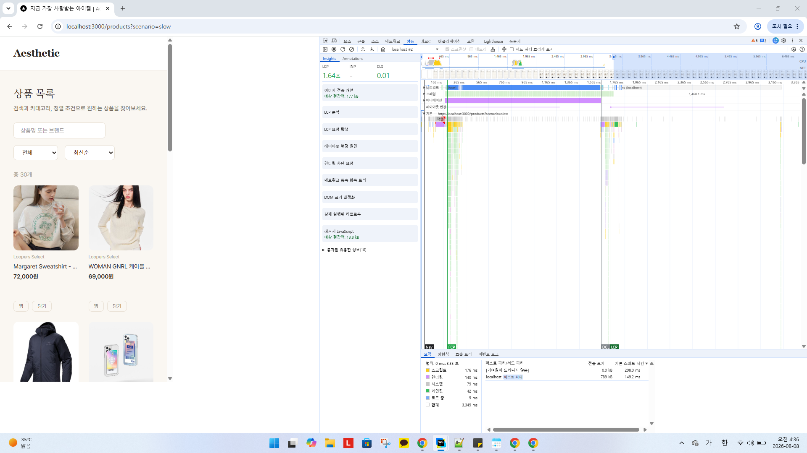
</p>

## 3. 동적 metadata와 서버 요청 중복

홈·상품 목록·상품 상세는 각 페이지 데이터에 맞는 title, description, Open Graph 이미지를 생성합니다. 상품 목록은 metadata와 본문이 다음 경로를 공유하도록 맞췄습니다.

상품 목록은 검색어가 있으면 `'<검색어>' 검색 결과`를 title의 첫 정보로 사용하고, 2페이지 이상이면 `(n페이지)`를 덧붙입니다. category 이름과 sort label은 description에 포함하며, 결과가 0건이면 검색어·category·기본 조건에 맞는 빈 결과 문장과 fallback Open Graph 이미지를 사용합니다. 모든 경우 root의 기본 `robots: index, follow`를 유지합니다.

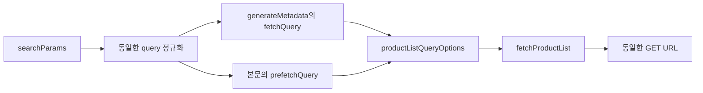
```mermaid
flowchart LR
  A[searchParams] --> B[동일한 query 정규화]
  B --> C[generateMetadata의 fetchQuery]
  B --> D[본문의 prefetchQuery]
  C --> E[productListQueryOptions]
  D --> E
  E --> F[fetchProductList]
  F --> G[동일한 GET URL]
```

처음에는 두 QueryClient가 서로 다른 `AbortSignal`을 `fetch` options에 넣었습니다. URL이 같아도 options가 달라 Next.js request memoization이 적용되지 않았고, document 요청 한 번에 Route Handler가 두 번 실행됐습니다.

서버에서는 `fetch(url)`만 호출하고 클라이언트에서만 `fetch(url, { signal })`을 사용하도록 범위를 나눴습니다. 서버의 metadata와 본문은 같은 URL·options를 만들고, 클라이언트는 검색 조건 변경 시 요청 취소 기능을 유지합니다. 진단 중에는 document당 2회를 관찰했고, 최종 계측은 [Route Handler 로그](./evidence/route-handler-count.log)에서 document당 1회를 확인했습니다. 수정 전 원시 로그는 남기지 않았으므로 2→1 수치 중 첨부 증거가 있는 값은 최종 1회입니다.

`getQueryClient()`는 서버에서 호출할 때마다 새 QueryClient를 반환하고, 브라우저에서만 단일 인스턴스를 재사용합니다. metadata와 본문 사이에 영속 QueryClient를 추가하지 않았으며, 같은 render/request 안의 동일한 native `fetch` URL·options만 memoization 대상으로 사용했습니다.

홈의 `getHomeData()`는 native fetch가 없는 동기 메모리 함수이므로 request memoization 대상으로 설명하지 않았습니다.

페이지의 `openGraph`는 root 값을 shallow merge하지 않고 통째로 덮을 수 있으므로, 홈과 상품 목록 metadata에 `siteName`, `locale`, `type`을 명시적으로 포함해 공통 필드를 유지했습니다.

### production document 증거

normal과 정상 empty는 `APP_ORIGIN=http://localhost:3000`으로 build·runtime을 맞춘 production document 응답에서 확인했습니다. query failure는 과제의 재현 절차대로 build와 별도 runtime(port 3001)을 모두 `APP_ORIGIN=http://127.0.0.1:9`로 맞춰 metadata 조회 실패와 root fallback을 확인했습니다. 응답을 저장한 뒤 정상 origin build로 복구했습니다.

| 상황 | 최종 document URL | title | description | Open Graph image |
|------|-------------------|-------|-------------|------------------|
| normal | `http://localhost:3000/products` | `지금 가장 사랑받는 아이템 \| Aesthetic` | `최신순 총 30개` | 첫 상품 `p26.jpg` |
| 정상 empty | `http://localhost:3000/products?scenario=empty` | `지금 가장 사랑받는 아이템 \| Aesthetic` | `조건에 맞는 상품이 없습니다.` | fallback `hero-1920.webp` |
| metadata query failure | `http://localhost:3001/products` | root의 `Aesthetic \| 매일 새롭게 발견하는 취향` | root 공통 description | 없음 |

세 응답은 모두 HTTP 200이었습니다. normal과 empty는 `og:site_name=Aesthetic`, `og:locale=ko_KR`, `og:type=website`를 유지했고, query failure는 페이지별 빈 metadata 대신 root의 title·description·Open Graph 공통 필드를 상속했습니다. document 응답 자체에서 metadata와 `main`·`h1`·`nav` 구조를 확인했으므로 JavaScript 실행에 의존하지 않습니다.

- normal: [document-normal.html](./evidence/document-normal.html)
- empty: [document-empty.html](./evidence/document-empty.html)
- query failure: [document-normal-query-failure.html](./evidence/document-normal-query-failure.html), [실행 요약](./evidence/http-runtime-query-failure.json)

초기 HTML에는 홈과 상품 목록으로 이동하는 `href` 링크가 남았고, 상품 카드는 상품 상세 `href`와 상품명을 담은 대체 텍스트를 제공했습니다. Hero는 제목과 설명을 같은 section에서 텍스트로 전달하는 장식 이미지이므로 빈 `alt`를 유지했습니다. 성능 최적화를 위해 링크를 클릭 이벤트로 바꾸거나 의미 있는 이미지의 대체 텍스트를 제거하지 않았습니다.

### metadata 비용

상품 목록 metadata가 데이터를 기다리는 동안 일반 브라우저는 셸을 먼저 스트리밍하지만, `facebookexternalhit` 같은 크롤러에는 완성된 HTML을 전달합니다.

| User-Agent | 응답 시작 | 전체 완료 |
|------------|-----------|-----------|
| 일반 브라우저 | 16.2–33.2ms | 1,531.2–1,552.6ms |
| `facebookexternalhit` | 1,530.9–1,551.4ms | 1,535.9–1,558.5ms |

각 User-Agent를 같은 slow URL에서 3회 측정한 결과, 크롤러의 TTFB에는 1.5초 metadata 조회 비용이 그대로 포함됐습니다. 현재 과제에서는 페이지별 동적 OG 이미지가 필요해 유지했지만, 실제 목록 API가 더 느려지면 title·description은 URL 조건만으로 만들고 OG 이미지는 고정하는 방식도 검토할 수 있습니다.

3회 측정값과 응답 필드 검증 결과는 [http-runtime.json](./evidence/http-runtime.json)에 남겼습니다.

## 4. 서버 prefetch 실패의 소유권

상품 목록에는 이미 최초 실패 시 인라인 안내와 `refetch()`를 제공하는 정책이 있었습니다. 하지만 서버의 `ensureQueryData`가 먼저 실패를 throw하면서 해당 UI까지 도달하지 못하고 공통 Server Component 오류 화면이 나타났습니다. `products/error.tsx`를 수정해도 스트리밍 중 발생한 이 실패 경로를 처리하지 못했습니다.

오류 경계를 더 늘리지 않고 한 줄만 바꿨습니다.

```diff
- await queryClient.ensureQueryData(productListQueryOptions(query));
+ await queryClient.prefetchQuery(productListQueryOptions(query));
```

`prefetchQuery`가 성공하면 이전과 같이 서버 데이터를 dehydrate해 즉시 목록을 표시합니다. 실패하면 서버 렌더를 중단하지 않고 클라이언트 `useQuery`가 조회를 이어받습니다. 클라이언트 요청도 실패하면 `isError && !displayData` 분기가 인라인 오류와 다시 시도 버튼을 표시합니다.

```text
prefetch 성공 → 서버 데이터 hydration → 목록 표시
prefetch 실패 → 클라이언트 useQuery
                  ├─ 성공 → 목록 표시
                  └─ 실패 → 인라인 오류 + refetch
```

이 처리는 목록 내부에서 복구하기로 한 상품 목록에만 적용했습니다. 홈과 상품 상세가 전체 페이지 오류를 route error boundary에 맡기는 정책은 바꾸지 않았습니다.

## 5. 최종 측정과 판정

### Lighthouse 5회 측정값

| Run | Before FCP | Before LCP | Before CLS | After FCP | After LCP | After CLS |
|-----|-----------:|-----------:|-----------:|----------:|----------:|----------:|
| 1 | 2,699ms | 44,791ms | 0 | 2,426ms | 2,512ms | 0 |
| 2 | 2,723ms | 45,342ms | 0 | 2,198ms | 2,258ms | 0 |
| 3 | 2,740ms | 44,718ms | 0 | 2,734ms | 2,856ms | 0 |
| 4 | 2,567ms | 44,846ms | 0 | 2,131ms | 2,262ms | 0 |
| 5 | 2,852ms | 44,883ms | 0 | 2,122ms | 2,184ms | 0 |
| **중앙값** | **2,723ms** | **44,846ms** | **0** | **2,198ms** | **2,262ms** | **0** |
| **범위** | **2,567–2,852ms** | **44,718–45,342ms** | **0** | **2,122–2,734ms** | **2,184–2,856ms** | **0** |

LCP 개선은 Before에서 지목한 이미지 전송 구간과 직접 연결됐습니다. FCP는 525ms 줄었지만 두 범위가 일부 겹치므로 주된 성과로 해석하지 않았고, CLS는 전후 모두 0이었습니다. 절대값을 실제 사용자 환경 전체에 일반화하지 않고 같은 로컬 환경의 Before·After 비교 증거로만 사용했습니다.

### 회귀 검증

| 확인 항목 | 결과 |
|-----------|------|
| 홈의 `h1`·설명·Hero 이미지 | 정상 |
| 검색·카테고리·정렬·페이지 URL 복원 | 정상 |
| 뒤로 가기·앞으로 가기 | 정상 |
| 장바구니·위시리스트와 Header 개수 | 정상 |
| 빠른 검색어 변경 시 이전 요청 취소 | 정상 |
| 정상 목록·0건·최초 실패·갱신 실패·재시도 화면 | 정상 |
| Vitest | 7개 파일, 75개 테스트 통과 |
| TypeScript | `tsc --noEmit` 통과 |
| production build | Next.js 16.2.10 Turbopack 빌드 통과 |
| `pnpm check` | test·lint·typecheck·production build 전체 통과 |

## 관련 코드

- root metadata와 공통 구조: [`src/app/layout.tsx`](../../src/app/layout.tsx)
- 홈 metadata·본문 prefetch: [`src/app/page.tsx`](../../src/app/page.tsx)
- 상품 목록 metadata·본문 prefetch: [`src/app/products/page.tsx`](../../src/app/products/page.tsx)
- 목록 상태 UI의 Public API: [`src/_pages/product-list/index.ts`](../../src/_pages/product-list/index.ts)
- 홈·상품 상세 page slice의 Public API: [`src/_pages/home/index.ts`](../../src/_pages/home/index.ts), [`src/_pages/product-detail/index.ts`](../../src/_pages/product-detail/index.ts)

## 제외한 변경과 남겨둔 한계

- `fetchPriority="high"`를 적용했지만 After 대표 run의 관찰 priority는 `Low`였습니다. 이 변경은 효과가 확인되지 않아 LCP 개선 원인으로 계산하지 않았습니다.
- Hero preload가 root layout에 있어 상품 목록에서도 요청 후보가 만들어집니다. 현재 브라우저가 낮은 우선순위로 처리하고 구조 변경 대비 이득이 작아 유지했습니다.
- Pretendard 전체 CSS는 render-blocking입니다. 비동기 주입은 FOUC와 유지보수 비용이 커서 이번 범위에서는 적용하지 않았습니다.
- 동적 metadata는 slow scenario에서 크롤러의 TTFB를 약 1.5초 늦춥니다. 실제 API 지연과 SEO 요구가 커지면 데이터 의존 범위를 다시 판단해야 합니다.
- After에서도 LCP의 이미지 요청 시작 대기가 약 0.65초 남습니다. 다음 성능 작업에서는 preload 우선순위와 실제 요청 시작 시점을 분리해 측정해야 합니다.

## AI 활용과 직접 검증

AI는 이 README의 판단 표 구성, 과제 체크리스트 대조, 캡처 자동화 보조, 문장 정리에 사용했습니다. Lighthouse 수치는 측정 당시 생성한 10개 report JSON과 화면 캡처를 다시 대조했고, DevTools 이미지는 격리 Chrome에서 직접 기록했습니다. production HTML·HTTP·CDP 결과는 위 원시 파일과 현재 코드에서 확인했으며, 생성형 이미지나 임의로 만든 성능 수치는 사용하지 않았습니다. 원인 가설은 저장된 Network·Performance·document·서버 로그와 맞지 않으면 채택하지 않았습니다.
