# R0 — Before

- SHA: 홈 측정 `4a04dddf` · 목록 관찰 `df3bfae5` (scenario 전달 추가. 홈 경로에는 영향 없음)
- 측정 일시: `2026-08-05`
- 상태: `HeroSection` 연결, 최적화 없음. 홈 텍스트 전체가 홈 조회 뒤에 있음
- 설정 증거: [00-lighthouse-settings.png](./00-lighthouse-settings.png)

### 홈 cold load — Lighthouse 5회

| 회차 | FCP | LCP | CLS |
| --- | --- | --- | --- |
| 1 | 0.3 s | 6.7 s | 0.004 |
| 2 | 0.3 s | 6.7 s | 0.004 |
| 3 | 0.3 s | 6.7 s | 0.004 |
| 4 | 0.3 s | 6.7 s | 0.004 |
| 5 | 0.3 s | 6.7 s | 0.004 |
| **중앙값** | **0.3 s** | **6.7 s** | **0.004** |
| **최솟값** | 0.3 s | 6.7 s | 0.004 |
| **최댓값** | 0.3 s | 6.7 s | 0.004 |
| **범위(max−min)** | **0** | **0** | **0** |

참고 지표(1회차): Performance 76 · TBT 0 ms · Speed Index 0.5 s

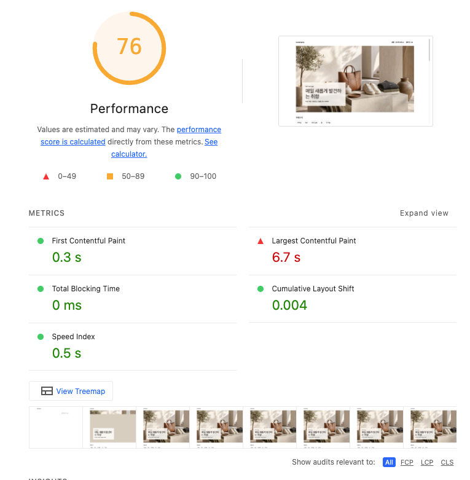

> 범위가 0이다. 총합으로는 변화를 판정할 수 없어 **LCP breakdown의 구간 값과 전송 크기**로 판정한다.

- LCP element: `img.HeroSection-module__image` (Hero 원본 이미지)

### filmstrip 표시 순서

녹화 조건: Device toolbar `1350×940` · Network `Desktop 10Mbps`(10240 Kbps / 40ms) · CPU `No throttling` · `Disable network cache` 

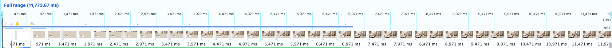

| 요소 | 보이기 시작한 시점 |
| --- | --- |
| Header | ~90 ms (FCP) |
| 카테고리 / 인기 상품 / 신상품 | 문서 완료 직후 (~550 ms) |
| Hero 이미지 | ~6.2 s (다운로드 완료 후) |

필름스트립 앞쪽이 계속 비어 있고, 프레임 간격이 1,000 ms 단위로 벌어진다. 화면이 그동안 아무것도 바뀌지 않았다는 뜻이다.

대기 화면은 두 단계로 나뉜다.

| 시점 | 화면 | 캡쳐 |
| --- | --- | --- |
| ~965 ms | 헤더와 `홈을 불러오는 중입니다.` 텍스트 한 줄뿐. 제목·설명·카테고리·상품 섹션이 모두 없다 | [02b](./02b-home-waiting-shell.png) |
| ~1,965 ms | 오버레이 카드·카테고리 칩·인기 상품 섹션은 보이고, Hero 이미지만 위에서부터 점진적으로 채워지는 중(아래는 `#d8cebf` 배경) | [02c](./02c-home-waiting-hero.png) |

첫 단계가 1단계에서 고칠 대상이다. 홈 조회가 끝나기 전에는 `HomePage`의 `Suspense` fallback이 페이지 전체를 덮어, 데이터와 무관한 제목·설명까지 함께 막힌다.

두 번째 단계는 `aspect-ratio: 16 / 9`로 Hero 공간이 미리 잡혀 있어 이미지가 늦게 도착해도 아래 콘텐츠가 밀리지 않는다. CLS가 0.005로 작은 이유이고, fallback을 넣을 때 지켜야 할 공간 계약이다.

### Network waterfall

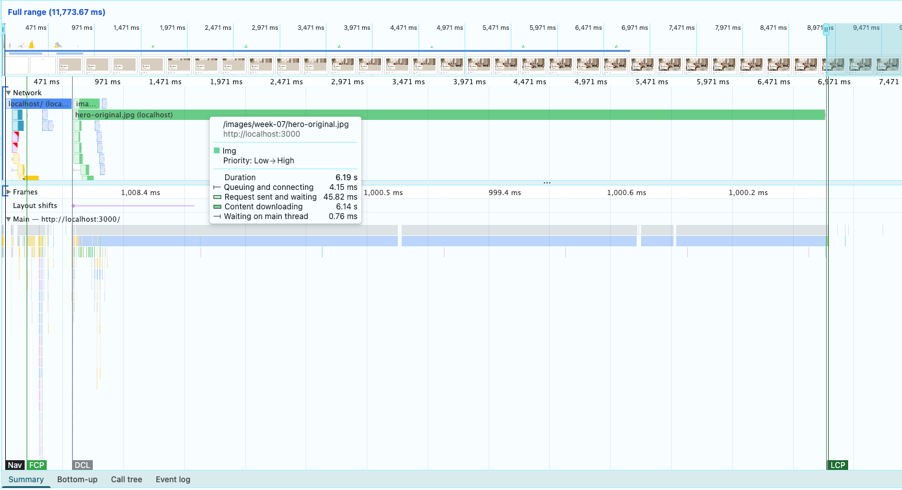

| 요청 | 시작 시점 | 전송 크기 | 소요 |
| --- | --- | --- | --- |
| document (`localhost/`) | 0 ms | 7.4 KiB (gzip) / 30.3 KiB | 550 ms |
| `hero-original.jpg` | 문서 직후 | 7,368 KiB | 6.19 s |

`hero-original.jpg` 구간 (툴팁)

| 구간 | 시간 |
| --- | --- |
| Queuing and connecting | 4.15 ms |
| Request sent and waiting | 45.82 ms |
| Content downloading | 6.14 s |
| Waiting on main thread | 0.76 ms |

document는 7.4 KiB인데 550 ms가 걸린다. 크기가 아니라 서버가 홈 데이터를 기다리며 스트림을 붙들고 있는 시간이다. `hero-original.jpg`는 그 문서가 끝난 뒤에야 시작한다. `img`가 `HomeContent` 안에 있어 홈 조회 전에는 HTML에 나타나지 않기 때문이다.

### Hero 이미지

| | 값 |
| --- | --- |
| 원본 크기 | `3840 × 2160` |
| 실제 표시 크기 | `2400 × 1350` |
| 전송 크기 | `7,368.4 KiB` |

Lighthouse `Improve image delivery` 제안

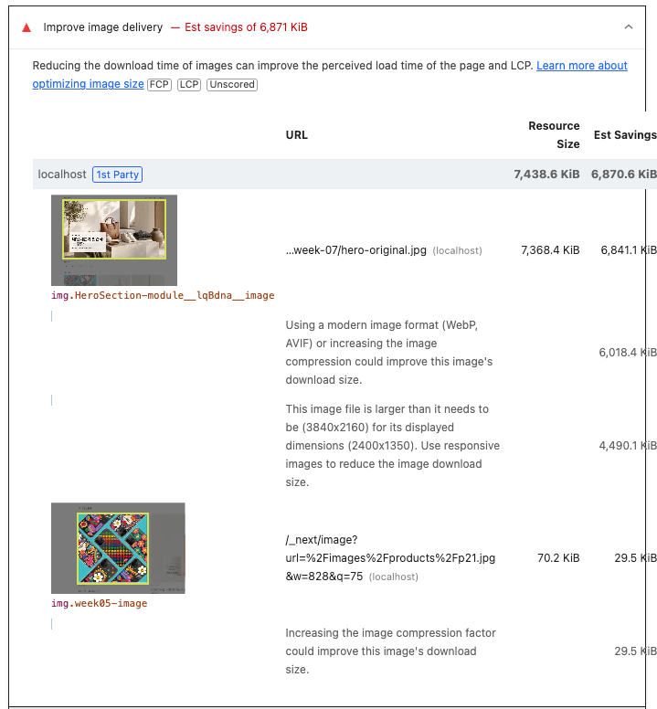

| 제안 | 절감 추정 |
| --- | --- |
| 최신 포맷(WebP·AVIF) 또는 압축률 조정 | 6,018.4 KiB |
| 표시 크기에 맞춘 반응형 이미지 | 4,490.1 KiB |
| 합계 | 6,841.1 KiB |

### LCP 구간 분해

Lighthouse `LCP breakdown`

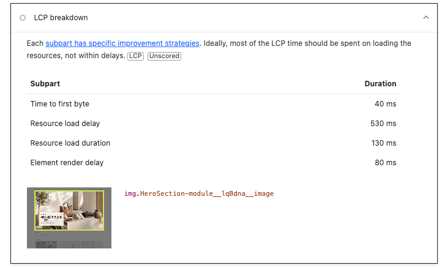

| 구간 | Lighthouse 표기 | 시간 | Performance에서 확인한 것 |
| --- | --- | --- | --- |
| 서버 응답 대기 | Time to first byte | 40 ms | document의 `Request sent and waiting 43.21 ms`와 일치 |
| 이미지 요청 시작 대기 | Resource load delay | **530 ms** | document 막대가 550 ms까지 이어지고 `hero-original.jpg`가 그 직후 시작 |
| 이미지 전송 | Resource load duration | 130 ms | 10 Mbps를 걸면 `Content downloading 6.14 s`. 크기 7,368 KiB |
| 화면에 그려질 때까지 | Element render delay | 80 ms | 이미지 도착 후 filmstrip에서 Hero가 채워짐. 공간이 예약돼 있어 이동 없음 |
| 합계 | | 780 ms | |

Lighthouse breakdown은 스로틀 전 관측값이라 전송이 130 ms로 나온다. 실제 10 Mbps에서는 6.14 s이고, 그 조건에서 **가장 긴 구간은 전송**이다. 발견 지연 530 ms가 그다음이다.

> 구간 합계 780 ms와 지표 LCP 6.7 s는 서로 다른 값이다. 지표는 simulated
> throttling이 10 Mbps로 환산한 값이고, breakdown은 관측값이다. After에서도
> 같은 기준으로 읽는다.

### Layout Shifts

| 시점 | 값 | 비고 |
| --- | --- | --- |
| ~1,008 ms | `0.0051` (Layout shift cluster) | Lighthouse CLS 0.004와 같은 구간. 문서 완료(550ms) 뒤 콘텐츠가 그려질 때 발생 |

Hero는 `aspect-ratio: 16/9`로 공간을 미리 잡아 이미지 도착 시점에는 이동이 없다. 값이 작아 지금은 문제가 아니지만, Suspense fallback을 넣으면 교체 지점이 새로 생기므로 이 값을 기준으로 비교한다.

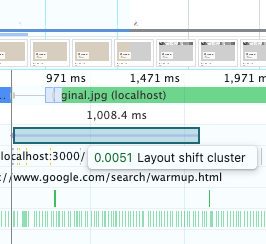

### 목록 slow — 6화면 관찰

조건: Network `No throttling`. 기다림은 `?scenario=slow`(1.5초)가 만든다.

| 상태 | 현재 동작 | 과제 기준 |
| --- | --- | --- |
| 데이터 없는 최초 진입 | 셸은 보이고 목록 자리에 `상품 목록을 불러오는 중입니다.` 텍스트 한 줄. 약 1.7초 유지 | **미달** — 목록 크기를 예상할 수 없다 |
| 이전 데이터 있는 갱신 | 기존 목록이 즉시 비워지고 최초 진입과 같은 화면이 된다 | **미달** |
| 성공 + 0건 | `총 0개` + `조건에 맞는 상품이 없습니다.`, 셸 유지 | 충족 |
| 최초 실패 | `상품 목록을 불러오지 못했습니다.` + `다시 시도` + `홈으로 가기`, 셸 유지 | 충족 |
| 갱신 실패 | 기존 목록이 사라지고 최초 실패와 같은 에러 화면 | **미달** |
| 취소 | 요청이 겹쳐도 늦게 끝난 응답이 현재 화면을 덮지 않는다 | 충족 |

#### 목록 지표 — Lighthouse 5회 (`/products?scenario=slow`)

| 회차 | FCP | LCP | CLS |
| --- | --- | --- | --- |
| 1 | 0.3 s | 0.8 s | 0 |
| 2 | 0.3 s | 0.7 s | 0 |
| 3 | 0.3 s | 0.7 s | 0 |
| 4 | 0.3 s | 0.7 s | 0 |
| 5 | 0.3 s | 0.7 s | 0 |
| **중앙값** | **0.3 s** | **0.7 s** | **0** |
| **최솟값 / 최댓값** | 0.3 / 0.3 | 0.7 / 0.8 | 0 / 0 |
| **범위(max−min)** | **0** | **0.1 s** | **0** |

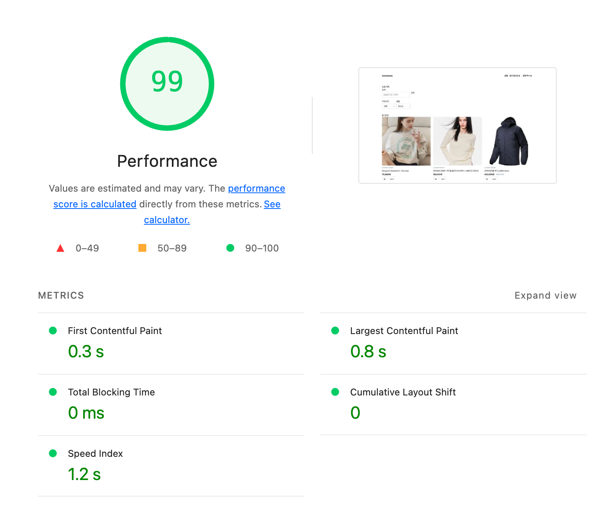

- LCP element: `img.week05-image` — 상품 카드 이미지 ([06f](./06f-list-lcp-element.png))

**CLS가 0인 이유 — 밀릴 것이 없다**

Layout shift는 이미 그려진 요소가 움직여야 계산된다. 빈 공간에 새 요소가 추가되는 것은 shift가 아니다.

- 목록 섹션이 문서의 마지막 요소다. `(commerce)/layout.tsx`에 footer가 없어 교체 지점 아래에 밀릴 것이 없다.
- 대기 화면 위쪽(header · `h1` · 검색 · 필터)은 이미 자리가 고정돼 있어 목록이 채워져도 움직이지 않는다.
- 카드 이미지가 늦게 와도 `.week05-image`의 `aspect-ratio: 1`이 공간을 잡는다. [완료 프레임](./06e-list-loaded-frame.png)에서 이미지가 아직 없는데 카드 높이는 이미 확정돼 있다.

**밀릴 것이 없어서 0**이다. 2단계의 CLS 목표는 이 0을 유지하는 것이 목표다.

#### 데이터 없는 최초 진입 (`/products?scenario=slow`)

셸(헤더 · `h1 상품 목록` · 검색 · 카테고리/정렬)은 그려져 있고 목록 자리만 비어 있다. `ProductsPage`가 제목·검색·필터를 `Suspense` 밖에 두고 `ProductListContent`만 안에 두기 때문이다. **홈과 달리 목록은 셸이 데이터를 기다리지 않는다.**

목록 자리는 텍스트 한 줄이라 몇 개가 올지, 화면이 얼마나 길어질지 알 수 없다. 과제가 요구한 "실제 목록 크기를 예상할 수 있는 pending UI"에 미달한다.

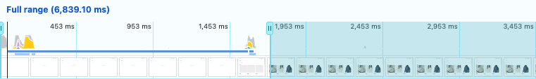

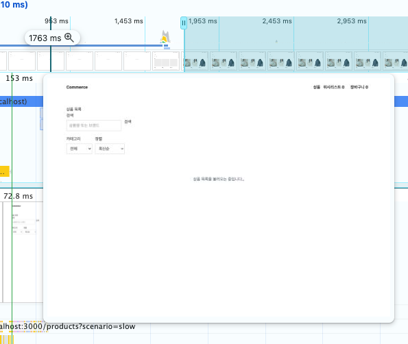

#### 이전 데이터가 있는 갱신 (카테고리 `전체` → `캐주얼`)

목록이 즉시 비워지고 `상품 목록을 불러오는 중입니다.`로 바뀐다. 약 1.5초간 유지되며 최초 진입과 화면이 같아 구분되지 않는다.

원인은 `keepPreviousPage`의 `isSameProductSet`이다. `q · category · sort · pageSize`를 모두 비교해 **페이지만 바뀔 때만** 이전 목록을 유지한다. 6주차에 "검색·필터·정렬이 바뀌면 목록 자체가 달라지므로 이전 결과를 남기지 않는다"로 정한 결과다.

과제 2단계는 "검색·카테고리·정렬·페이지 조건을 바꾸면 목록을 즉시 비우지 않고 갱신 중임을 보여줘요"로 네 조건 전부를 요구한다.

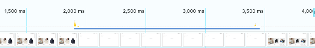

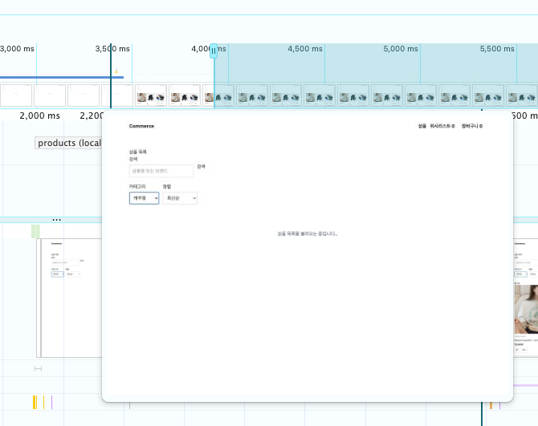

#### 취소 (카테고리를 캐주얼 → 패션 → 홈으로 빠르게 연속 변경)

`/api/products` 요청 3개가 겹쳐 나가고 **전부 끝까지 완료**된다. `AbortSignal`을 쓰지 않아 취소는 발생하지 않는다.

최종 화면은 URL의 `category=home`과 일치하고 `총 6개`가 맞다. TanStack Query가 queryKey별로 결과를 관리해 늦게 끝난 이전 요청이 현재 키의 화면을 바꾸지 못한다.

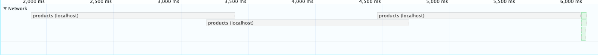

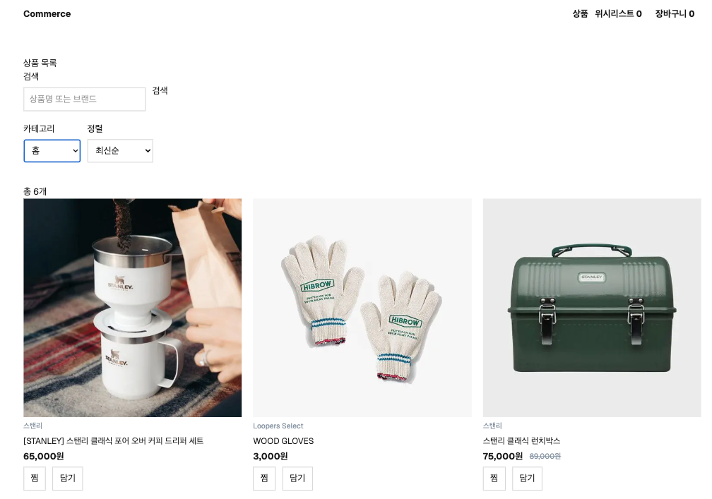

#### 성공 + 0건 (`?scenario=empty`)

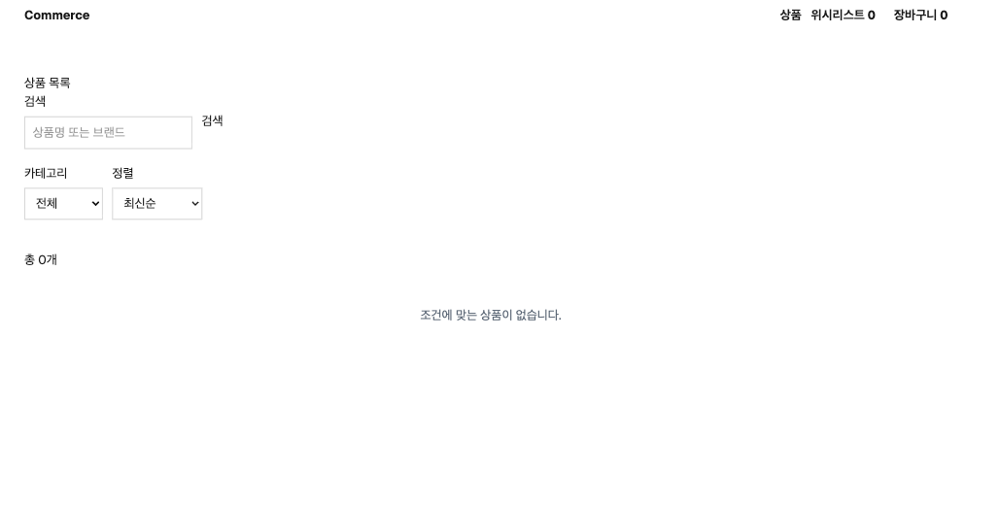

#### 최초 실패 (`?scenario=error`)

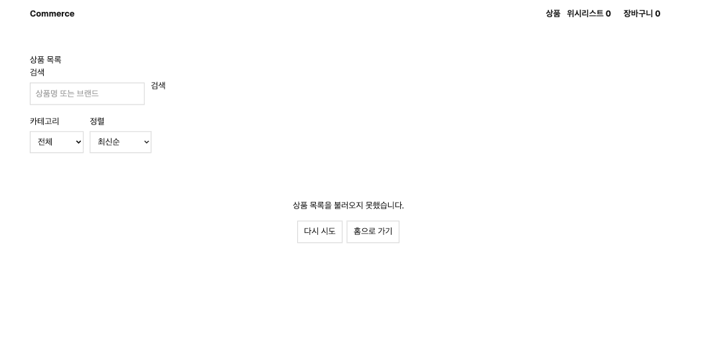

#### 갱신 실패

기존 목록이 사라지고 최초 실패와 같은 에러 화면이 된다.

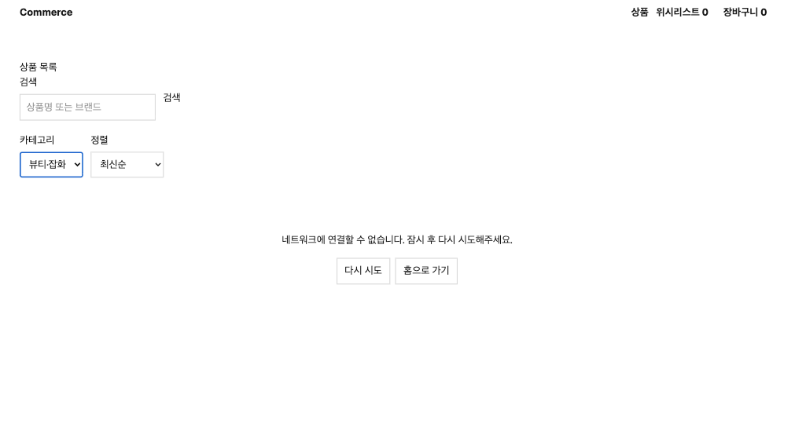

### 판단 기록

LCP 네 구간을 각각 보고, 개입할 구간과 하지 않을 구간을 나눈다.

| # | 관찰한 사실 | 원인 가설 | 반증 방법 | 가장 작은 변경 |
| --- | --- | --- | --- | --- |
| 1 | **서버 응답 대기** — 40 ms. document의 첫 바이트까지는 빠르다 | 셸을 즉시 스트리밍하므로 첫 바이트가 늦을 이유가 없다 | 서버를 손대도 LCP가 줄면 가설이 틀렸다 | **없음** — 전체의 5%라 개입 대상이 아니다 |
| 2 | **이미지 요청 시작 대기(발견 지연)** — 530 ms. document가 7.4 KiB인데 550 ms까지 열려 있고, `hero-original.jpg`가 그 직후 시작한다 | `img`가 `HomeContent` 안에 있어 홈 조회가 끝나야 HTML에 나타나고, 그전까지 브라우저가 이미지의 존재를 모른다 | 셸을 먼저 보내도 이미지 요청 시작이 당겨지지 않으면 가설이 틀렸다 | 데이터가 필요 없는 영역을 `Suspense` 밖으로 빼 셸을 먼저 보낸다 |
| 3 | **이미지 전송** — 10 Mbps에서 6.14 초. 원본 3840×2160(7,368 KiB)인데 표시는 2400×1350 | 표시 크기보다 큰 원본을 그대로 내려받아 전송이 LCP를 지배한다 | 표시 크기·포맷에 맞춰 줄였는데 LCP가 그대로면 가설이 틀렸다 | Hero 이미지의 크기와 포맷을 표시 크기에 맞춘다 |
| 4 | **렌더 지연** — 80 ms. `aspect-ratio`로 공간이 예약돼 있어 이동이 없고 CLS는 0.005 | 디코딩·페인트는 병목이 아니다 | 이미지를 줄였는데 이 구간이 늘면 가설이 틀렸다 | **없음** — 다만 fallback을 넣을 때 이 공간 계약을 깨지 않는다 |

개입 순서는 구간 크기가 정한다. 전송 6.14 s가 발견 지연 530 ms의 약 12배이므로 이미지가 먼저다. 다만 이미지를 줄여도 발견 지연은 남는다. 그 구간은 렌더링 경계를 바꿔야 사라지고, 같은 변경이 홈의 제목·설명이 함께 막히는 문제도 해결한다.

---

### 초기 HTML — `curl`로 확인한 document 응답

| 항목 | `/` (홈) | `/products` (목록) |
| --- | --- | --- |
| `<title>` | `Commerce` | `Commerce` — 페이지 구분 없음 |
| `description` | `Loopers 커머스 - 4주차부터 여기에 쌓아갑니다.` | 좌동 — 4주차 스타터 문구 그대로 |
| Open Graph | **없음** | **없음** |
| `h1` | **없음** | `상품 목록` |
| `h2` | Hero 제목, 카테고리, 인기 상품, 신상품 | 상품명(카드 제목) |
| 구조 | `header` · `main` · `nav` · `section`×4 | `header` · `main` · `nav`×2 · `section`×2 |
| 본문 데이터 | 포함됨 (Hero 제목·상품 섹션) | 포함됨 (상품 목록) |
| `robots: noindex` | 없음 | 없음 |

3단계에서 할 일

- 루트 `title` template과 공통 Open Graph가 없다 → 신설
- 홈·목록 `generateMetadata`가 없어 두 페이지의 title·description이 같다 → 신설
- `description`이 4주차 스타터 문구 그대로다 → 갱신
- 홈에 `h1`이 없다 → 1단계 렌더링 경계와 함께 다룸

본문 데이터는 양쪽 다 초기 HTML에 들어 있다. 서버 prefetch와 `HydrationBoundary`가 이미 동작한다는 뜻이다.
