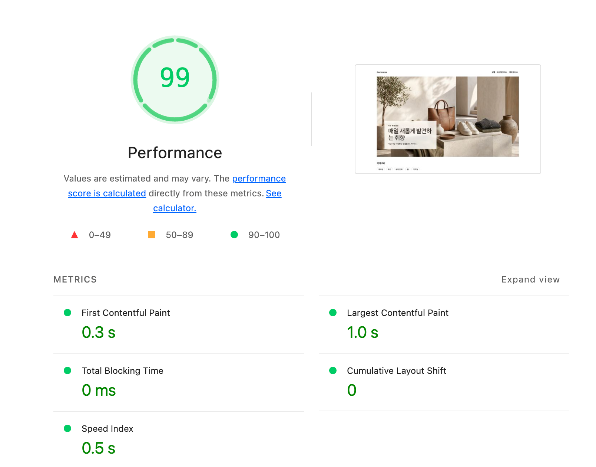
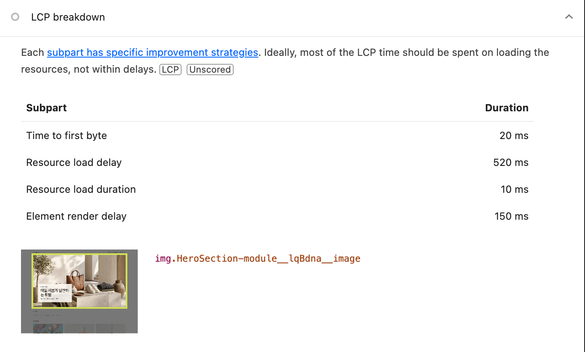
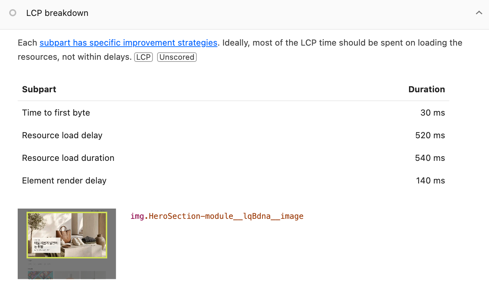
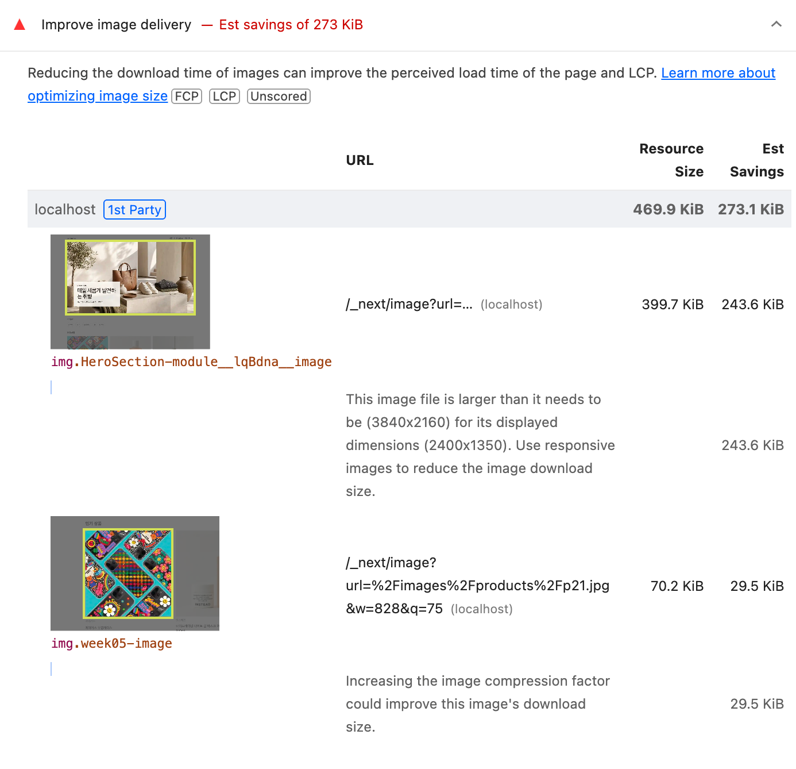

# R1 — Hero 이미지 전송

- SHA: `cf571ae6` · 측정 일시 `2026-08-05`
- 변경 내용: `` → `next/image`. `sizes`로 표시 폭을 알리고 `loading="eager"`로 기본 lazy를 막는다. `width`/`height`·CSS는 R0 그대로.
- 고른 근거: R0 LCP 4구간 중 이미지 전송이 6.14 s로 가장 길다. 발견 지연 530 ms의 약 12배라 전송을 먼저 줄인다.

### 이 라운드에서 새로 생긴 조건

`next/image`는 `(src, w, q)` 조합마다 첫 요청에서 서버 인코딩이 일어난다. R0(정적 파일 한 장)엔 없던 체제라 회차별 캐시 상태를 함께 기록한다.

| 상태 | `time_starttransfer` | 크기 |
| --- | --- | --- |
| COLD (`.next/cache/images` 비운 직후) | `571 ms` | 409,306 B |
| WARM | `1.2 ms` | 409,306 B |

### Lighthouse 5회

캐시를 비우고 브라우저로 열지 않은 채 1회차에 들어갔다.

| 회차 | 캐시 | FCP | LCP | CLS |
| --- | --- | --- | --- | --- |
| 1 | **COLD** | 0.3 s | 1.0 s | 0 |
| 2 | WARM | 0.3 s | 0.6 s | 0 |
| 3 | WARM | 0.3 s | 1.0 s | 0 |
| 4 | WARM | 0.3 s | 0.6 s | 0 |
| 5 | WARM | 0.3 s | 1.0 s | 0 |
| **중앙값** | | **0.3 s** | **1.0 s** | **0** |
| **최솟값 / 최댓값** | | 0.3 / 0.3 | 0.6 / 1.0 | 0 / 0 |
| **범위** | | **0** | **0.4 s** | **0** |

- 조건 1 — 중앙값 변화가 R0 범위 밖인가: **통과.** R0 범위 0, LCP 중앙값 `6.7 s → 1.0 s`.

### 회차별 LCP 구간 분해

| 회차 | 캐시 | TTFB | 발견 지연 | 전송 | 렌더 지연 | 합계 |
| --- | --- | --- | --- | --- | --- | --- |
| R0 | — | 40 | **530** | 130 | 80 | 780 |
| 1 | COLD | 30 | 520 | **540** | 140 | 1,230 |
| 2 | WARM | 40 | 520 | 10 | **30** | 600 |
| 3 | WARM | 20 | 530 | 10 | **130** | 690 |
| 4 | WARM | 40 | 520 | 10 | **30** | 600 |
| 5 | WARM | 20 | 520 | 10 | **150** | 700 |

1. **COLD 인코딩은 전송 구간에 잡힌다.** 1회차 540 ms가 curl로 잰 571 ms와 맞는다. WARM은 10 ms.
2. **발견 지연은 520~530 ms로 고정.** R0의 530 ms에서 움직이지 않았다.
3. **LCP 편차는 전부 렌더 구간에서 나온다.** 렌더가 `30`과 `130~150` 두 값으로만 갈리고 LCP가 각각 `0.6 s`·`1.0 s`로 따라간다. **원인 미확인** — 캐시로는 설명되지 않는다(3·5회차는 WARM인데 높다).

 

### 바뀐 구간

| 관찰 항목 | R0 | 이번 라운드 | 예상대로 |
| --- | --- | --- | --- |
| LCP element | `img.HeroSection-module__image` | 동일 요소 | ⭕️ |
| 가장 긴 구간 | 이미지 전송 `6.14 s` | **발견 지연 `520 ms`** | ⭕️ |
| Hero 전송 크기 | `7,368.4 KiB` | **`399.7 KiB`** (−94.6%) | ⭕️ |
| Hero 요청 시작 시점 | `~550 ms` | `520~530 ms` | ⭕️ 움직이지 않음 |

- 조건 2 — 변화가 지목한 병목 구간에서 나왔는가: **통과.**

### 건드리지 않기로 한 구간

| 항목 | R0 | 이번 라운드 |
| --- | --- | --- |
| Hero 요청 시작 시점 | `~550 ms` | `520~530 ms` ⭕️ |
| CLS | `0.004` | `0` (5회 전부) ⭕️ |

`next/image`가 넣는 `<link rel="preload">`는 `<head>`가 아니라 body의 Suspense 청크 안에 있어 ``보다 859바이트만 앞선다. 발견 지연은 렌더링 경계를 바꿔야 줄어든다.

### 판정

**유지.** 두 조건을 모두 통과했다. LCP 중앙값이 R0 범위(0) 밖으로 움직였고, 그 변화가 전송 구간(`7,368 → 399.7 KiB`)에서 나왔으며 발견 지연은 고정됐다.

### 다음 라운드 후보

| 대상 | 근거 | 남은 크기 |
| --- | --- | --- |
| 렌더링 경계 분리 | 이제 **발견 지연 520 ms가 가장 긴 구간**이다 | — |
| 반응형 후보 정밀화 | `deviceSizes` 버킷 간격(2048 → 3840) | 243.6 KiB |

미확인으로 남긴 것: 렌더 지연 이중 분포(30 vs 130~150 ms). 중간값 없이 두 값으로만 갈리는 걸 보면 물리적 현상보다 simulated throttling의 재계산이 몇 개 상태로 튀는 쪽으로 보이나 확인하지 못했다. R0에서 안 보였던 것은 전체가 6.7 s라 100 ms가 묻혔기 때문이고, 지금은 0.6 s로 짧아져 같은 크기가 그대로 드러난다.
