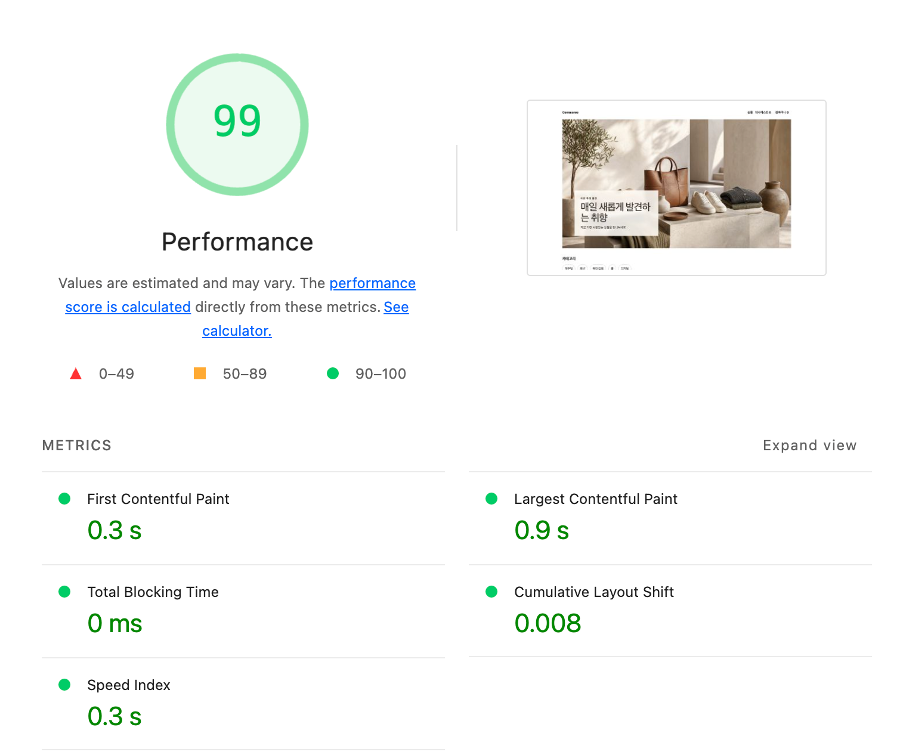
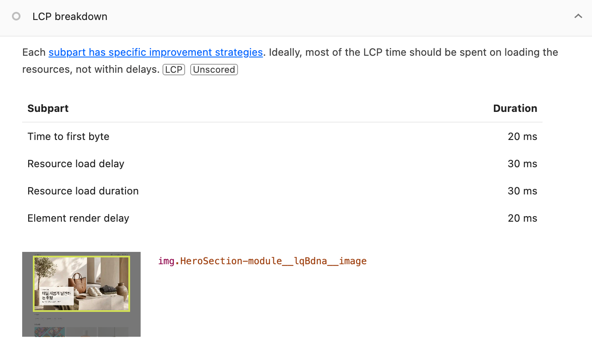

# R2 — 렌더링 경계 분리

- SHA: `f787a51a` · 측정 일시 `2026-08-06`
- 변경 내용: Hero 이미지와 오버레이 카드를 `Suspense` 밖으로 빼고 제목·설명만 경계 안에 남겼다.
- 고른 근거: R1에서 전송을 줄이고 나니 **발견 지연 520 ms가 가장 긴 구간**이 됐다. 홈 조회(mock 500 ms)가 끝나야 이미지 태그가 HTML에 나타나는 구조가 원인이다. `preload`만 거는 안은 요소가 여전히 520 ms에 생겨 load delay가 render delay로 옮겨갈 뿐이라 접었다.

**이미지 태그가 브라우저에 언제 도착하는가** — 서버 응답을 흘려받으며 각 문구가 나타난 시점을 쟀다.

```
첫 바이트          65 ms
 태그        65 ms   ← 첫 바이트와 동시에 온다
배너 제목        578 ms   ← 홈 조회를 기다린다
문서 끝          586 ms
```

R1에서는 ``가 배너 제목과 **같은 청크**에 있었다(문서 내 위치 18,332 vs 15,426, 둘 다 조회 뒤). 그래서 이미지 태그도 지금 배너 제목이 오는 `578 ms` 쪽이었다.

| | `` 도착 | 배너 제목 도착 |
| --- | --- | --- |
| R1 | 조회 뒤 (제목과 같은 청크) | 조회 뒤 |
| **R2** | **65 ms — 첫 바이트와 동시** | 578 ms |

이미지가 **조회를 기다리는 자리에서 안 기다리는 자리로 옮겨갔다.** 발견 지연이 줄어든 것이 이 이동의 결과다.

### Lighthouse 5회

측정 직전 `.next/cache/images`를 비우고 브라우저로 열지 않은 채 1회차에 들어갔다.

| 회차 | 캐시 | FCP | LCP | CLS |
| --- | --- | --- | --- | --- |
| 1 | **COLD** | 0.3 s | 1.1 s | 0.008 |
| 2 | WARM | 0.3 s | 0.9 s | 0.008 |
| 3 | WARM | 0.3 s | 0.9 s | 0.008 |
| 4 | WARM | 0.3 s | 0.9 s | 0.008 |
| 5 | WARM | 0.3 s | 0.4 s | 0.008 |
| **중앙값** | | **0.3 s** | **0.9 s** | **0.008** |
| **최솟값 / 최댓값** | | 0.3 / 0.3 | 0.4 / 1.1 | 0.008 / 0.008 |
| **범위** | | **0** | **0.7 s** | **0** |



### 회차별 LCP 구간 분해

| 회차 | 캐시 | TTFB | **발견 지연** | 전송 | 렌더 지연 | 합계 |
| --- | --- | --- | --- | --- | --- | --- |
| R0 | — | 40 | **530** | 130 | 80 | 780 |
| R1 (WARM 대표) | WARM | 40 | **520** | 10 | 30 | 600 |
| 1 | COLD | 30 | **20** | 550 | 110 | 710 |
| 2 | WARM | 20 | **30** | 30 | 20 | 100 |
| 3 | WARM | 80 | **20** | 20 | 110 | 230 |
| 4 | WARM | 40 | **10** | 20 | 100 | 170 |
| 5 | WARM | 50 | **30** | 20 | 30 | 130 |



### 판정 — 유지

이번 라운드의 표적은 **발견 지연** 으로 판정도 그 구간으로 한다.

| | 5회 값 | 폭 |
| --- | --- | --- |
| R1 | `520 · 520 · 530 · 520 · 520` | 10 ms |
| **R2** | `20 · 30 · 20 · 10 · 30` | 20 ms |

**두 분포가 전혀 겹치지 않는다.** R1의 최솟값(520)이 R2의 최댓값(30)보다 17배 크다.

| 조건 | 근거 |
| --- | --- |
| 1 — 변화가 이전 라운드 범위 밖인가 | 폭 10 ms짜리 분포가 통째로 500 ms 옮겨갔다 |
| 2 — 그 변화가 지목한 병목에서 나왔는가 | 움직인 구간이 지목한 그 구간이다. Hero 전송 크기(`399.7 KiB`)와 LCP element는 그대로다 |

원인도 설명된다. 이미지 태그 도착 시점이 조회 뒤에서 첫 바이트와 동시(`65 ms`)로 바뀌었고, 발견 지연은 정의상 그 시점까지의 대기다.

### 부작용 — CLS `0 → 0.008`

`.copy`가 `inset: auto auto ...`로 아래쪽 기준 배치라, 제목·설명이 붙으면 카드 윗변이 올라가고 그 안의 `이번 주의 발견`이 밀린다. 이번 변경이 만든 새 교체 지점이다.

필름스트립 3단계: [셸](./02b-home-shell.png)(배경색 + 빈 카드) → [이미지](./02c-home-image.png) → [문구](./02d-home-copy.png). 뒤 두 프레임 사이가 그 지점이다.

발견 지연 500 ms를 없앤 대가가 `0.008`이라 되돌리지 않고 R3에서 카드 공간 계약으로 잡는다.

### 다음 라운드 후보

| 대상 | 근거 |
| --- | --- |
| Hero 카드 공간 계약 | 이번에 생긴 CLS `0.008` |
| 반응형 후보 정밀화 | `deviceSizes` 버킷 간격(2048 → 3840), 남은 243.6 KiB |
