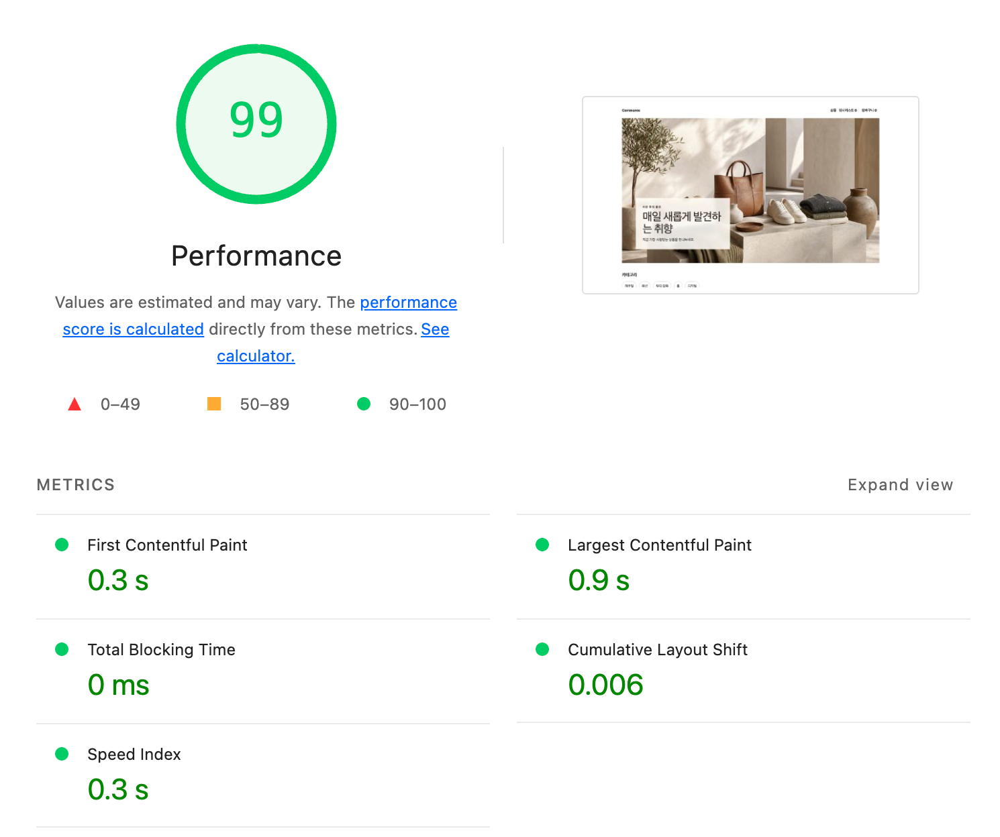
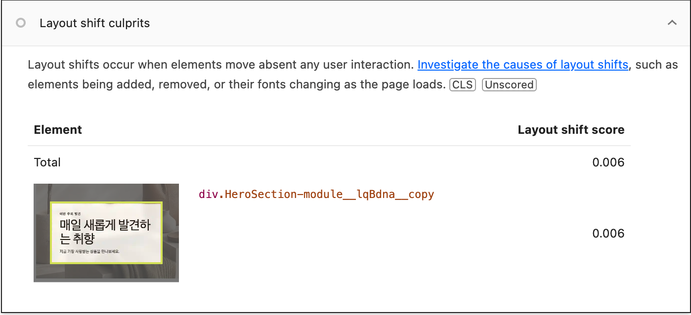
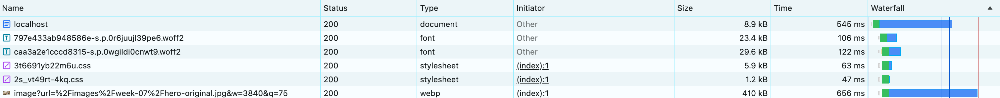

# R3 — Hero 카드 공간 예약

- SHA: `4070396f` · 측정 일시 `2026-08-06`
- 변경 내용: `.copy`에 `min-height: 132px`를 줘서 조회 전에도 카드가 자리를 잡게 했다.
- 고른 근거: R2가 만든 부작용. 카드가 아래쪽 기준 배치라 제목·설명이 붙으면 윗변이 올라가고 그 안의 `이번 주의 발견`이 밀렸다(CLS `0 → 0.008`).

### Lighthouse 5회

CLS는 이미지 캐시와 무관하므로 5회 모두 WARM으로 쟀다.

| 회차 | FCP | LCP | CLS |
| --- | --- | --- | --- |
| 1 | 0.3 s | 0.9 s | 0.006 |
| 2 | 0.3 s | 0.9 s | 0.006 |
| 3 | 0.3 s | 0.9 s | 0.006 |
| 4 | 0.3 s | 0.9 s | 0.006 |
| 5 | 0.3 s | 0.8 s | 0.006 |
| **중앙값** | **0.3 s** | **0.9 s** | **0.006** |
| **최솟값 / 최댓값** | 0.3 / 0.3 | 0.8 / 0.9 | 0.006 / 0.006 |
| **범위** | **0** | **0.1 s** | **0** |

### 판정 — 유지

표적은 CLS 하나다.

| 조건 | 근거 |
| --- | --- |
| 1 — 이전 라운드 범위 밖인가 | R2의 CLS 범위가 `0`인데 중앙값이 `0.008 → 0.006`으로 움직였다 |
| 2 — 지목한 병목에서 나왔는가 | `Layout shift culprits`가 **`div.HeroSection-module__copy` 하나**를 `0.006`으로 지목한다. `min-height`를 준 그 요소다. FCP·LCP는 R2와 같다 |

### 0이 아닌 이유 — 의도적으로 남겼다

예약값 `132px`은 가장 좁은 화면의 실측 높이다. 측정 폭(1350px)에서는 제목 폰트가 `52px`이라 카드가 `182px`까지 자라고, 그 `50px`이 남은 `0.006`이다. R2에서는 `52px → 182px`로 130px 자랐다.

`182px`로 올리면 측정 CLS는 0에 가까워지지만, 제목 폰트가 `clamp(28px, 4vw, 52px)`로 연속 변하는 **중간 폭에서 카드가 필요 이상으로 커진다.** 실제로 넣어 화면을 확인한 뒤 되돌렸다. 항상 보이는 여백과 가끔 생기는 shift 중 앞을 없애는 쪽을 골랐다.

`0.006`은 CLS 기준(`< 0.1`)의 6%이고 개선 전 R0(`0.004`) 수준이다. 넓은 화면만 0으로 만들려면 `@media (min-width: 1232px)`에 `182px`을 주면 된다 — 컨테이너가 고정되는 지점이라 중간 폭에 영향이 없다.

필름스트립: [조회 전](./02c-home-image.png)(이미지 + 자리 잡힌 빈 카드) → [조회 후](./02d-home-copy.png)(문구 채워짐)

### Network waterfall (1단계 최종 상태)

| 요청 | 크기 | 시간 |
| --- | --- | --- |
| `localhost` (document) | 8.9 kB | 545 ms |
| `image?url=...&w=3840&q=75` (webp) | 410 kB | 656 ms |

두 막대가 겹친다. **이미지가 document가 끝나기 전에 시작한다** — R2에서 만든 변화이고, R0에서는 document가 끝난 뒤에야 시작했다.

`/api/home`은 이 목록에 없다. 서버 컴포넌트가 부르는 요청이라 브라우저 Network를 타지 않는다. 호출 횟수는 R2에서 서버 측 임시 계측으로 **문서 1회당 1회**를 확인했다.

