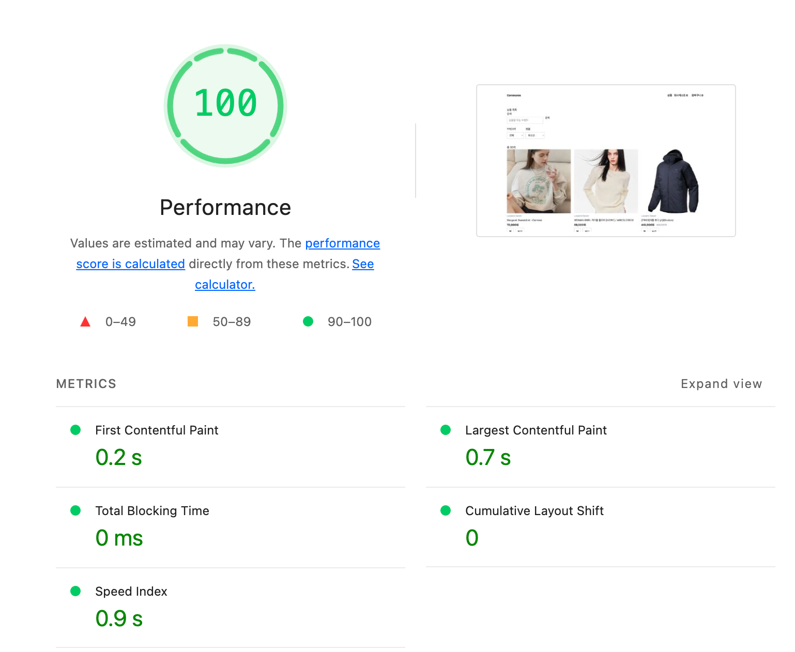

# R4 — 목록 최초 진입 대기 화면

- SHA: `a0a6d7fb` · 측정 일시 `2026-08-06`
- 변경 내용: 텍스트 한 줄이던 대기 화면을 한 페이지 크기(`PRODUCT_PAGE_SIZE` 12장)만큼의 카드 골격으로 바꿨다. 서버 `Suspense` fallback과 클라이언트 최초 pending 두 곳이 같은 컴포넌트를 쓴다.
- 고른 근거: R0 목록 관찰에서 최초 진입이 유일하게 "목록 크기를 예상할 수 없다"로 미달이었다.

이 라운드의 표적은 지표가 아니라 **화면**이다. 목록 기준선의 CLS가 이미 0이라 줄일 것이 없고, 대신 **0을 유지하는지**가 제약이다.

### Lighthouse 5회 (`/products?scenario=slow`)

| 회차 | FCP | LCP | CLS |
| --- | --- | --- | --- |
| 1 | 0.2 s | 0.7 s | 0 |
| 2 | 0.2 s | 0.7 s | 0 |
| 3 | 0.2 s | 0.6 s | 0 |
| 4 | 0.2 s | 0.6 s | 0 |
| 5 | 0.2 s | 0.6 s | 0 |
| **중앙값** | **0.2 s** | **0.6 s** | **0** |
| **최솟값 / 최댓값** | 0.2 / 0.2 | 0.6 / 0.7 | 0 / 0 |
| **범위(max−min)** | **0** | **0.1 s** | **0** |

### 바뀐 구간

| 관찰 항목 | 기준선 | R4 | 예상대로 움직였는가 |
| --- | --- | --- | --- |
| 대기 화면 | 텍스트 한 줄, 목록 크기 예측 불가 | 카드 골격 12장(3열 × 4행) | ✅ 표적 |
| CLS | 0 | **0** | ✅ 제약 유지 |
| FCP | 0.3 s | 0.2 s | - |
| LCP | 0.7 s | 0.6 s | - |

### 판정 — 유지

| 조건 | 근거 |
| --- | --- |
| 1 — 중앙값 변화가 기준선 범위 밖인가 | **CLS는 해당 없음.** 0에서 0으로 변화가 없고, 이 라운드가 노린 것도 감소가 아니라 유지다 |
| 2 — 변화가 지목한 병목에서 나왔는가 | 표적이 화면 요건이라 증거도 화면이다. 대기 프레임이 텍스트 한 줄에서 카드 12장 골격으로 바뀌었다 |

### 화면 증거

| 시점 | 화면 | 캡쳐 |
| --- | --- | --- |
| ~1,695 ms | 셸 + **카드 골격 12장**. 몇 개가 올지, 화면이 얼마나 길어질지 보인다 | [06b](./06b-list-pending-frame.png) |
| 목록 도착 직후 | `총 30개`·상품명·가격은 있고 **이미지 자리만 회색** | [06c](./06c-list-arrived-frame.png) |
| 그 뒤 | 이미지가 채워짐. 아래 콘텐츠가 밀리지 않는다 | [06d](./06d-list-images-loaded.png) |

가운데 프레임이 CLS 0의 직접 증거다. 이미지가 아직 없는데 카드 높이는 이미 확정돼 있다 — `.week05-image`의 `aspect-ratio: 1`이 잡아둔 공간이고, 스켈레톤과 무관하게 원래 있던 성질이다.

### 카드 높이 계약은 만들지 않는다

스켈레톤을 넣기 전에는 "골격 카드가 실제 카드보다 짧으면(상품명이 두 줄로 감기는 카드가 있어 실제가 116 px 더 길다) 교체 때 아래가 밀릴 것"으로 봤다. 측정은 그렇지 않았다.

layout shift는 **이미 그려진 요소가 움직여야** 계산된다. fallback → 실제 목록은 DOM 서브트리가 통째로 교체되고, 목록 섹션 아래에는 살아남는 요소가 없다(`(commerce)/layout.tsx`에 footer가 없다). 움직일 요소 자체가 없으므로 골격과 실제 카드의 높이가 달라도 CLS가 생기지 않는다.

