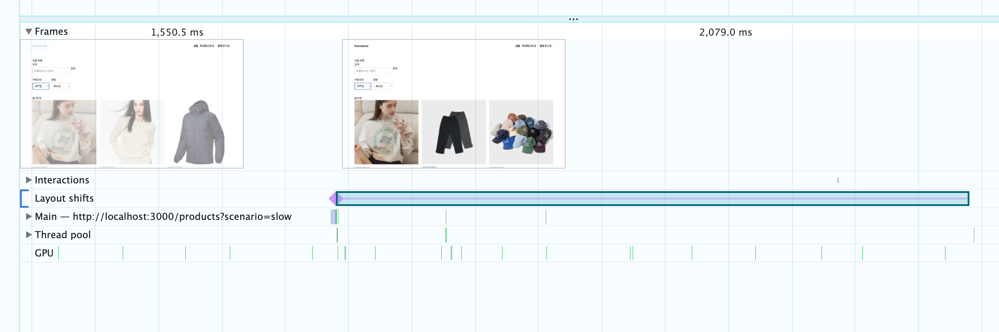

# R5 — 갱신 중 이전 목록 유지

- SHA: `a0fc24e9` · 측정 일시 `2026-08-06`
- 변경 내용: 페이지가 바뀔 때만 이전 목록을 남기던 `keepPreviousPage`를 내장 `keepPreviousData`로 바꿔, 검색·카테고리·정렬·페이지 무엇이 바뀌든 새 목록이 올 때까지 이전 목록을 유지한다. 갱신 중임은 목록을 흐리게(`opacity: 0.5`) 알린다.
- 고른 근거: R0 목록 관찰에서 "이전 데이터 있는 갱신"이 미달이었다. 목록이 즉시 비워져 최초 진입과 화면이 같았다.

Lighthouse는 쓰지 않는다. 최초 로드만 재는 도구라 갱신 중에 생기는 이동은 잡히지 않는다. 이 라운드의 지표 증거는 **Performance 트레이스와 `layout-shift` 계측값**이다.

### 표적 — 충족

| 시점 | 화면 | 캡쳐 |
| --- | --- | --- |
| 변경 전 | 카테고리 `전체` · `총 30개` | [07](./07-list-refetch-before.png) |
| 갱신 중 (~1.5초) | select만 `캐주얼`로 바뀌고 **`총 30개`와 이전 카드가 흐린 채 유지** | [07b](./07b-list-refetch-frame.png) |
| 갱신 완료 | `총 6개` · 캐주얼 상품 | [07c](./07c-list-refetch-done.png) |

최초 진입(스켈레톤 12장)과 갱신(흐린 이전 목록)이 서로 다른 화면이 됐다. R0에서는 둘이 같은 텍스트 한 줄이라 구분되지 않았다.

URL과 화면의 관계도 이 프레임에서 읽힌다. 주소는 이미 `category=casual`인데 목록은 아직 `전체`의 결과다. 흐림이 그 간극을 "갱신 중"으로 설명한다.

### 제약 — 위반. CLS `0 → 0.33`

| 코드 | 카테고리 변경 | 정렬 변경 |
| --- | --- | --- |
| R4 (조건이 바뀌면 목록을 비움) | `0.0000` | `0.0000` |
| R5 (이전 목록 유지) | `0.3322` | `0.1694` |

`0`은 R4 코드로 되돌려 같은 조건에서 잰 값이다. **이 라운드가 만든 회귀다.**

### 대책 두 가지 — 둘 다 기각

| 무엇이 움직이나 | 대책 | 기각 사유 |
| --- | --- | --- |
| 상품명이 1줄 ↔ 2줄로 바뀌어 카드 높이가 흔들린다 | 제목 영역 2줄 고정 | 짧은 이름 아래 빈 줄이 **상시로** 남아 버그처럼 보인다 |
| 결과 수가 달라지면 페이지네이션이 위아래로 움직인다 | 상품과 페이지네이션 사이에 빈 자리 확보 | 6개짜리 결과에도 12장 자리를 비워둬 **불필요한 스크롤을 강요**한다 |

각각 따로 적용해 같은 조건에서 쟀다.

| 조작 · 스크롤 | 기준선 | 제목 2줄 고정 | 빈 자리 확보 |
| --- | --- | --- | --- |
| 카테고리 · 상단 | `0.3322` | `0.2986` | `0.3322` |
| 카테고리 · 하단 | `0.4832` | `0.4259` | `0.4614` |
| 정렬 · 상단 | `0.1694` | `0.1694` | `0.1694` |
| 정렬 · 하단 | `0.1995` | `0.2005` | `0.1995` |
| 그리드 높이(카테고리) | `2171 → 1096` | `2225 → 1102` | **`2171 → 2171`** |

카드 높이를 `[538, 517]`에서 `[541]`로 통일해도, 페이지네이션을 완전히 멈춰 세워도 값이 남는다. 정렬 변경은 문서 `2714 → 2714` · 그리드 `2171 → 2171`로 레이아웃이 한 픽셀도 안 변하는데 값이 나오고, 지목된 요소는 `prev [0,0,0,0]` — 그 자리에 없던 노드다. **자리가 아니라 그 자리의 상품이 바뀌는 것이 잡힌다.** 두 대책 모두 자리를 다루므로 지표는 그대로인데 사용자 대가만 남았다.

### 판정 — 유지. CLS는 개입하지 않는다

| 조건 | 근거 |
| --- | --- |
| 1 — 표적을 충족했는가 | 갱신 화면이 최초 진입과 구분되고 목록이 비워지지 않는다 |
| 2 — 제약을 지켰는가 | **아니다.** CLS `0 → 0.33` |

`placeholderData`만 떼고 재보면 거래가 그대로 드러난다.

| | 갱신 CLS (카테고리 · 정렬 · 페이지) | 갱신 화면 |
| --- | --- | --- |
| `keepPreviousData` 없음 | **전부 `0.0000`** | 스켈레톤 12장 — 최초 진입과 구분되지 않는다 (R0 미달) |
| `keepPreviousData` | `0.3322` · `0.1694` | 흐린 이전 목록 — 요구 충족 |

**CLS를 0으로 만드는 방법은 있고, 그게 곧 목록을 비우는 것이다.** 그래서 택하지 않는다. 실제 서비스도 같은 선택을 한다 — 쿠팡은 우리와 같은 UX(이전 목록 유지 + 흐림 + 스피너)이고, 무신사는 `더보기`로 덧붙여 교체 구간 자체가 없다. 어느 쪽도 빈 카드로 자리를 채우지 않는다.

이 이동이 CLS에 잡히는 것은 slow API 응답이 `500ms`를 넘겨 브라우저의 입력 유예 밖에서 일어나기 때문이다.

### 2단계 6화면 재점검

R0에서 셋이 미달이었다. R4·R5로 둘을 고쳤고 나머지는 이미 만족해 개입하지 않았다.

| 상태 | 현재 화면 | 판정 |
| --- | --- | --- |
| 데이터 없는 최초 진입 | 한 페이지 크기(12장)만큼의 카드 골격 | [R4](../r4-list-pending/notes.md)에서 해결 |
| 이전 데이터 있는 갱신 | `총 30개`와 이전 카드를 흐린 채 유지 | 이 라운드에서 해결 |
| 성공 + 0건 | `총 0개` + `조건에 맞는 상품이 없습니다.`, 셸 유지 | 개입 없음 (R0에서 확인) |
| 최초 실패 | 실패 이유 + `다시 시도` + `홈으로 가기`, 셸 유지 | 개입 없음 (R0에서 확인) |
| 갱신 실패 | 보던 목록을 유지한 채 상단 배너와 `다시 시도` | 개입 없음 (6주차 PR #122) |
| 취소 | 늦게 끝난 이전 요청이 현재 화면을 덮지 않고 오류로도 보이지 않는다 | 개입 없음 |

**취소** — `queryFn`이 `AbortSignal`을 받지 않아 요청이 취소되지 않고 전부 완주한다. 다만 TanStack Query가 queryKey별로 결과를 관리해 늦게 끝난 요청이 현재 키의 화면을 바꾸지 못한다. 카테고리를 `패션 → 뷰티·잡화 → 디지털`로 연속 변경한 뒤 최종 화면이 URL의 `category=digital`·`총 6개`와 일치하는 것을 확인했다. 넣는다면 `signal`을 `apiClient`까지 전달하면 되는데, 그때는 `fetch` 실패를 일괄 변환하는 경로에서 `AbortError`만 다시 던져야 한다. 그러지 않으면 취소가 `네트워크에 연결할 수 없습니다`라는 오류로 보여 요건을 정확히 어기게 된다.

**갱신 실패의 범위** — 실패는 두 가지고, 화면을 다르게 다룬다.

| 상황 | 화면에 떠 있는 목록 | 처리 |
| --- | --- | --- |
| 같은 조건으로 다시 조회하다 실패 | **그 조건의 결과** | 목록을 유지하고 위에 배너 |
| 조건을 바꾼 요청이 실패 | **이전 조건의 결과** | 목록을 지우고 전체 에러 화면 |

과제 표의 "기존 목록을 유지한 채 갱신 실패를 보여준다"는 첫 줄로 읽었다. 둘째 줄까지 유지하면 주소는 `category=casual`인데 화면에는 `전체` 상품이 깔려 URL의 active query와 어긋난다. TanStack Query도 쿼리가 `error`가 되면 `placeholderData`를 버려 같은 방향으로 동작한다. 이 라운드는 `placeholderData`만 바꿔 배너 분기(`data && isError`)를 건드리지 않았다.

**서버 응답을 로컬 상태에 복제하지 않음** — 목록·홈 응답은 TanStack Query 캐시에만 있다. Zustand 스토어는 장바구니·위시리스트의 `productIds: string[]`만 든다.

**URL의 active query와 화면 일치** — 조건은 `nuqs` 파서로 URL에서만 읽고, 같은 값이 `queryKey`와 실제 GET 요청에 함께 실린다. 서버 응답을 바꾸는 `scenario`도 포함한다.
