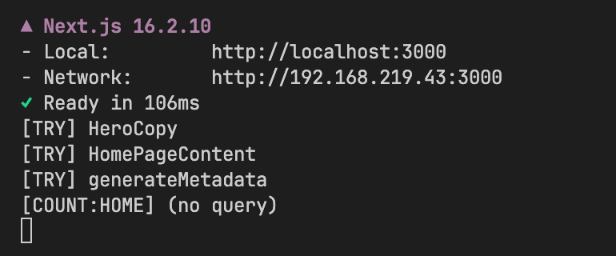
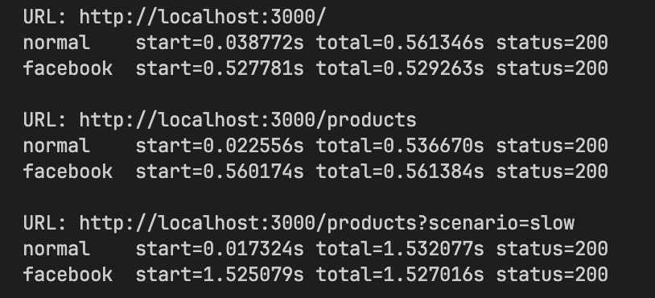
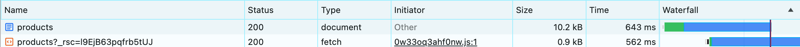

# R6 — metadata와 Open Graph

- SHA: `2ae07373` · 측정 일시 `2026-08-07`
- 변경 내용: 루트에 title template과 공통 Open Graph를 두고, 홈·목록에 `generateMetadata`를 추가했다. 두 페이지 모두 본문 prefetch와 같은 query factory로 조회한다.
- 고른 근거: R0의 초기 HTML 관찰에서 두 페이지의 `title`·`description`이 같고 Open Graph가 아예 없었다.

지표 라운드가 아니다. 이 라운드의 증거는 **document 응답과 서버 로그**다.

### 합성 규칙 — 무엇이 상속되고 무엇이 사라지는가

임시 `generateMetadata`로 확인했다. 페이지가 `title`과 `openGraph.images`만 준 경우다.

| 항목 | 결과 |
| --- | --- |
| `<title>` | 루트 template의 `%s`에 들어간다 |
| `description` | 페이지가 안 주면 루트 값을 상속한다 |
| `og:title` · `og:description` | **openGraph에 없어도 페이지의 title·description에서 채워진다** |
| `og:site_name` · `og:locale` · `og:type` | **사라진다** — shallow merge라 루트 `openGraph` 객체가 통째로 교체된다 |

그래서 두 페이지가 `siteName`·`locale`·`type`을 직접 다시 적는다(D7).

### 화면별 document

| 상황 | title | description | og:image | 캡쳐 |
| --- | --- | --- | --- | --- |
| 홈 | `매일 새롭게 발견하는 취향 \| LOOP MALL` | 배너 설명 | 배너 이미지 | [12](./12-home-metadata.png) |
| 목록 normal | `전체 상품 \| LOOP MALL` | `카테고리 전체 · 정렬 최신순 · 상품 30개` | 첫 상품 | [12b](./12b-list-metadata-normal.png) |
| 목록 카테고리 | `패션 상품 \| LOOP MALL` | `카테고리 패션 · … · 상품 6개` | 첫 상품 | [12c](./12c-list-metadata-category.png) |
| 목록 2페이지 | `전체 상품 2페이지 \| LOOP MALL` | `… 정렬 높은 가격순 …` | 2페이지 첫 상품 | [12d](./12d-list-metadata-page2.png) |
| 정상 empty | `전체 상품 \| LOOP MALL` | `… 상품 0개` | **fallback 유지** | [13](./13-meta-empty.png) |
| metadata query failure | `루프몰 \| LOOP MALL` | **루트 값** | 없음 | [14](./14-meta-failure.png) |

정상 empty와 조회 실패가 서로 다른 fallback을 보인다. empty는 조건과 0건을 설명하고, 실패는 페이지별 빈 값 대신 루트를 상속한다(D9).

실패는 `APP_ORIGIN=http://127.0.0.1:9`로 build·start해 재현했다. 두 가지가 함께 보인다.

- `og:image`가 없어지자 `twitter:card`가 `summary_large_image` → `summary`로 바뀐다. Next가 이미지 유무로 카드 종류를 정한다.
- **화면에는 상품이 정상으로 뜬다.** 서버는 닿지 않는 origin으로 조회해 실패하지만, 브라우저는 상대 경로라 자기 origin으로 다시 조회해 성공한다. metadata는 서버에서만 만들어지므로 루트 값이 그대로 남는다.

### 서버 호출 계수 — 3번 시도, 1번 호출

Route Handler와 조회 호출부에 임시 로그를 넣고 홈 문서를 한 번 요청했다.

```
[TRY] HeroCopy
[TRY] HomePageContent
[TRY] generateMetadata
[COUNT:HOME] (no query)
```



세 곳은 QueryClient도 서로 다르다. 서버에서 `getQueryClient()`가 호출마다 새 인스턴스를 만들기 때문이다(사용자 간 캐시 격리). 그런데도 HTTP가 한 번인 것은 **React가 같은 render 안에서 URL·options가 같은 native `fetch`를 memoize**하기 때문이다. 한 겹 아래에서 합쳐지므로 singleton으로 바꿀 이유가 없다.

성립 조건은 셋이다 — 같은 render/request, native `fetch`, URL·options 완전 일치. metadata와 본문이 같은 URL 정규화(`loadProductListConditions`)와 같은 query factory를 쓰는 이유가 이것이다.

브라우저 Network에는 이 호출이 보이지 않는다. 서버가 자기 API를 부르는 것이라 서버에서 세야 한다. 관찰 후 계측은 제거했다.

### UA에 따라 응답 시점이 달라진다



| URL | UA | `time_starttransfer` | `time_total` |
| --- | --- | --- | --- |
| `/` | normal | `0.039s` | `0.561s` |
| | facebookexternalhit | `0.528s` | `0.529s` |
| `/products` | normal | `0.023s` | `0.537s` |
| | facebookexternalhit | `0.560s` | `0.561s` |
| `/products?scenario=slow` | normal | `0.017s` | `1.532s` |
| | facebookexternalhit | `1.525s` | `1.527s` |

일반 UA는 첫 바이트가 수십 ms다. 셸을 먼저 보내고 metadata는 나중에 스트림으로 흘려보내기 때문이다(Next 15.2+ streaming metadata). 실제로 document를 파싱해보면 일반 UA에서는 `og:*`가 `</head>` **뒤**에 있고, 크롤러 UA에서는 `<head>` **안**에 있다.

크롤러는 JavaScript를 실행하지 않아 body에 있으면 읽지 못한다. 그래서 Next가 UA를 보고 metadata가 준비될 때까지 응답을 붙든다.

그래서 **metadata가 데이터를 기다리는 비용은 크롤러만 낸다.** slow에서 크롤러 첫 바이트가 `0.53s → 1.53s`로 밀리는 동안 사용자 쪽은 `0.017s` 그대로다.

### document와 RSC 경계

같은 경로인데 요청 종류가 갈린다.

| 동작 | 요청 | Content-Type | 크기 |
| --- | --- | --- | --- |
| 주소창 직접 진입 | `document /products` | `text/html; charset=utf-8` | 10.2 kB |
| 헤더 링크 클릭 | `fetch /?_rsc=…` | `text/x-component` | 0.9 kB |
| 카테고리 필터 변경 | `fetch /api/products?…` | — | — |



문서 응답의 최종 URL은 `http://localhost:3000/products`로 리다이렉트가 없다([17b](./17b-document-headers.png)). `Transfer-Encoding: chunked`는 스트리밍임을, `Vary: rsc, next-router-state-tree, …`는 같은 URL이 요청 헤더에 따라 다른 응답을 준다는 것을 보여준다. RSC 요청에는 `Rsc: 1`, `Next-Url`, `Next-Router-State-Tree` 헤더가 붙는다([17c](./17c-rsc-headers.png)).

**필터 변경은 이 둘 중 어느 쪽도 아니다.** 카테고리를 바꿨을 때 나가는 요청은 `/api/products?category=casual&…`(`application/json`) 하나뿐이고 `_rsc` 요청이 없다([17d](./17d-filter-api-only.png)).

### 초기 HTML — JavaScript 실행 전

production document 응답을 파싱했다.

| 항목 | 홈 | 목록 |
| --- | --- | --- |
| 제목 | `이번 주의 발견` | `상품 목록` |
| `h2` | 배너 제목 · 카테고리 · 인기 상품 · 신상품 | 상품명 12개 |
| 랜드마크 | `header` · `main` · `nav[주요 메뉴]` · `section[이번 주의 발견]` | 좌동 + `section[상품 검색 결과]` · `nav[페이지 이동]` |
| 주요 이동 | `href` 링크 7개 (헤더 2 + 카테고리 5) | `href` 링크 2개 (페이지 이동은 버튼) |
| 이미지 대체 텍스트 | 상품 13개에 상품명, Hero는 장식이라 `alt=""` | 상품 12개에 상품명 |
| `robots: noindex` | 없음 | 없음 |

본문 데이터가 초기 HTML에 들어 있다. 서버 prefetch와 `HydrationBoundary`가 동작한다는 뜻이고, JavaScript 없이도 상품명·카테고리·이동 경로가 보인다.
