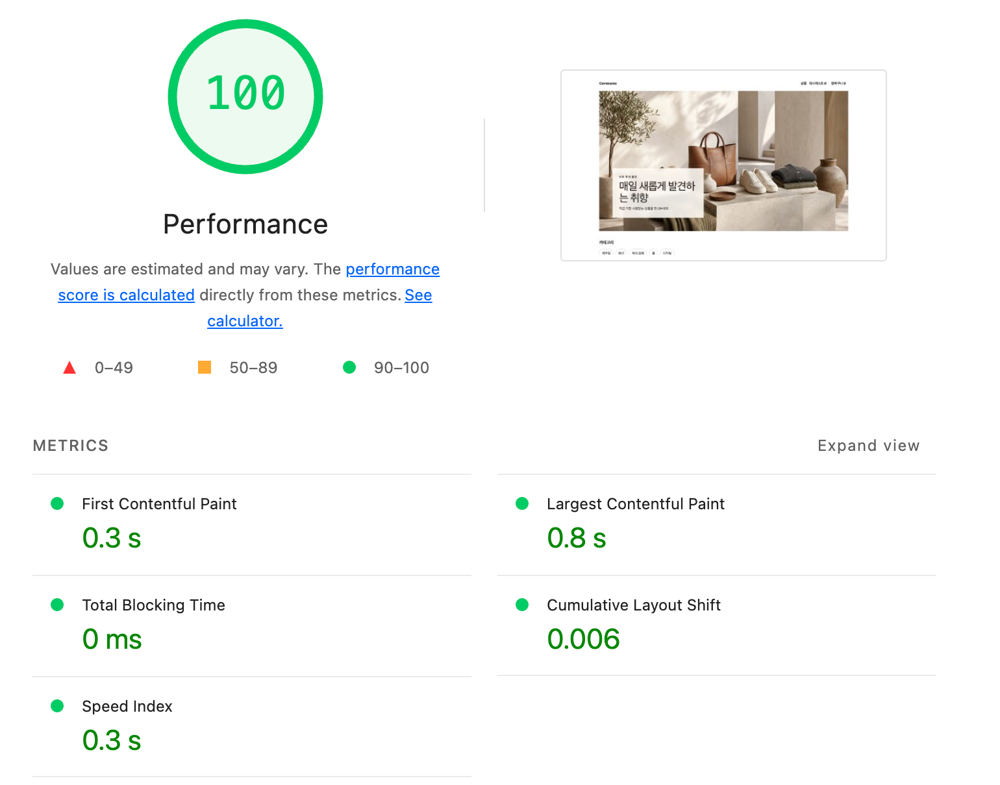
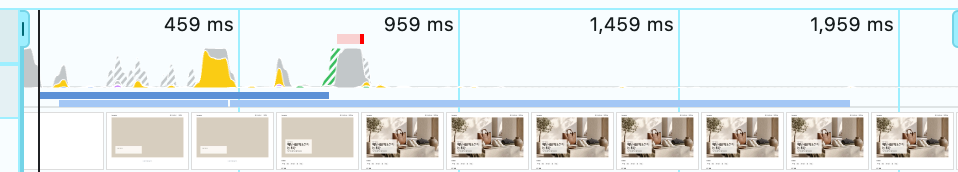
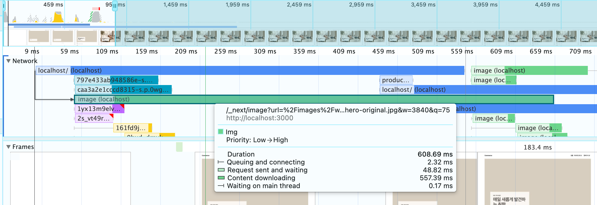
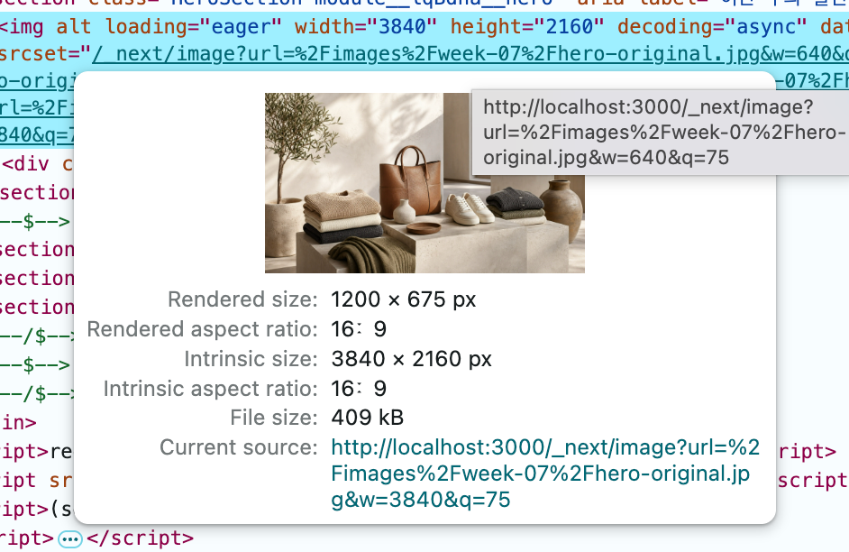
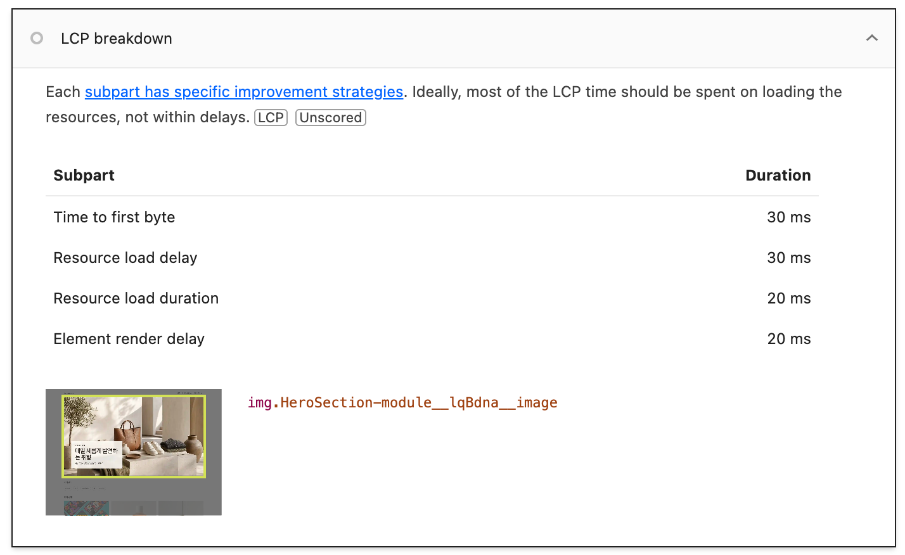
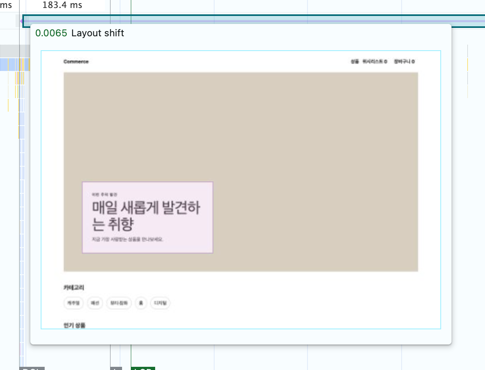
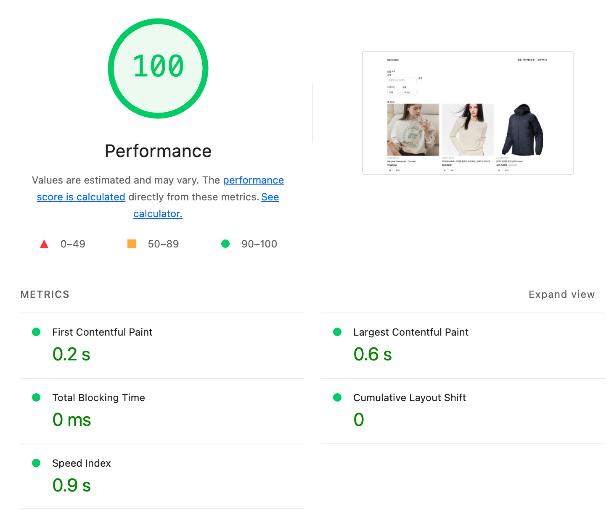

# R최종 — After

- SHA: `d3c6b8d5` (Before는 `4a04dddf`)
- 측정 일시: `2026-08-07`
- 상태: Hero 이미지 최적화(R1) · 렌더링 경계 분리(R2) · 카드 공간 예약(R3) · 목록 상태 경계(R4·R5) · metadata(R6)까지 반영
- 조건은 R0와 같다. `http://localhost:3000/` · Lighthouse Desktop · Performance만 · Clear storage · 별도 프로필(`perf-week07`)

### 홈 cold load — Lighthouse 5회

| 회차 | FCP | LCP | CLS |
| --- | --- | --- | --- |
| 1 | 0.3 s | 0.9 s | 0.006 |
| 2 | 0.3 s | 0.8 s | 0.006 |
| 3 | 0.3 s | 0.9 s | 0.006 |
| 4 | 0.3 s | 0.5 s | 0.006 |
| 5 | 0.3 s | 0.5 s | 0.006 |
| **중앙값** | **0.3 s** | **0.8 s** | **0.006** |
| **최솟값** | 0.3 s | 0.5 s | 0.006 |
| **최댓값** | 0.3 s | 0.9 s | 0.006 |
| **범위(max−min)** | **0** | **0.4 s** | **0** |

참고 지표: Performance 99~100 · TBT 0 ms · Speed Index 0.3 s

| | Before | After |
| --- | --- | --- |
| FCP | 0.3 s | 0.3 s |
| LCP | **6.7 s** | **0.8 s** |
| CLS | 0.004 | 0.006 |

- LCP element: `img.HeroSection-module__…__image` — Before와 같은 요소다. 같은 기준으로 비교했다.

### filmstrip 표시 순서

녹화 조건: Device toolbar `1350×940` · Network `Desktop 10Mbps`(10240 Kbps / 40ms) · CPU `No throttling` · `Disable network cache`

| 요소 | Before | After |
| --- | --- | --- |
| Header + **Hero 자리(빈 상태)** | ~90 ms (Header만) | **~180 ms** |
| Hero 문구 카드 | ~550 ms | ~540 ms |
| Hero 이미지 | **~6.2 s** | **~720 ms** |
| 카테고리 / 인기 상품 / 신상품 | ~550 ms | ~720 ms |

시각은 필름스트립 눈금에서 읽은 근사값이다. 이미지 도착 시점은 waterfall과 맞는다 — 요청이 40 ms에 시작해 608 ms 걸렸으니 ~650 ms에 도착하고 그다음 프레임에서 사진이 보인다.

Before는 `~965 ms`까지 헤더와 `홈을 불러오는 중입니다.` 텍스트 한 줄뿐이었다. **그 대기 화면 자체가 사라졌다.** 지금은 두 번째 프레임부터 Hero 자리가 잡혀 있고, 그 안이 빈 상태 → 문구 → 사진 순으로 채워진다. 아래 콘텐츠는 그동안 밀리지 않는다.

### Network waterfall

Performance 패널의 Network 트랙으로 확인했다.

| 요청 | 시작 시점 | 전송 크기 | 소요 |
| --- | --- | --- | --- |
| document (`localhost/`) | 9 ms | — | 진행 중 |
| `_next/image?…hero-original.jpg&w=3840&q=75` | **~40 ms (document 진행 중)** | 409 kB | 608.69 ms |

`_next/image` 구간 (툴팁)

| 구간 | Before(`hero-original.jpg`) | After |
| --- | --- | --- |
| Queuing and connecting | 4.15 ms | 2.32 ms |
| Request sent and waiting | 45.82 ms | 48.82 ms |
| Content downloading | **6.14 s** | **557.39 ms** |
| Waiting on main thread | 0.76 ms | 0.17 ms |

**요청 순서가 뒤집혔다.** Before는 document가 끝난 뒤에야 이미지가 시작했지만, 지금은 document 막대가 진행 중인데 이미지 막대가 이미 시작한다. `img`가 `Suspense` 밖 셸에 있어 홈 조회를 기다리지 않기 때문이다(R2). 우선순위도 `Low → High`로 올라간다.

### Hero 이미지

| | Before | After |
| --- | --- | --- |
| 원본 크기(intrinsic) | `3840 × 2160` | `3840 × 2160` |
| 실제 표시 크기 | `2400 × 1350` | `1200 × 675` |
| 요청 파일 | `hero-original.jpg` | `_next/image?…&w=3840&q=75` (webp) |
| 전송 크기 | `7,368 KiB` | **`409 kB`** |

원본 크기가 그대로다. **같은 그림을 다른 포맷·해상도로 보낸 것이지 이미지를 줄여 수치를 낮춘 것이 아니다.** Before에서 `6,841 KiB` 절감을 제안하던 Lighthouse `Improve image delivery` 항목은 사라졌다.

### LCP 구간 분해

| 구간 | Lighthouse 표기 | Before | After (5회 범위) |
| --- | --- | --- | --- |
| 서버 응답 대기 | Time to first byte | 40 ms | 20~70 ms |
| 이미지 요청 시작 대기 | Resource load delay | **530 ms** | **10~40 ms** |
| 이미지 전송 | Resource load duration | 130 ms (관측) | 10~40 ms |
| 화면에 그려질 때까지 | Element render delay | 80 ms | 20~100 ms |

R0에서 지목한 두 구간이 그대로 줄었다. **전송**은 이미지 최적화(R1), **발견 지연**은 렌더링 경계 분리(R2)가 맡았다. 이제 네 구간이 모두 100 ms 안이라 어느 하나가 지배하지 않는다.

Before의 전송 `130 ms`는 스로틀 전 관측값이고 10 Mbps에서는 `6.14 s`였다. After는 같은 조건에서 `557 ms`다(위 waterfall).

### Layout Shifts

| 시점 | Before | After |
| --- | --- | --- |
| 값 | `0.0051` | `0.0065` |
| 지목 요소 | 문서 완료 뒤 콘텐츠가 그려지며 발생 | `div.HeroSection-module__copy` — 문구 카드 |

하이라이트된 프레임을 보면 이미지는 이미 자리를 잡았고 **문구 카드만 채워지는 순간**이다. R3에서 `min-height: 132px`로 예약하면서 "측정 폭(1350px)에서는 제목 폰트가 커져 `50px`이 남는다"고 기록한 그 잔여분이다. 예상한 자리에서 예상한 크기로 나왔다.

### 목록 slow — Lighthouse 5회 (`/products?scenario=slow`)

| 회차 | FCP | LCP | CLS |
| --- | --- | --- | --- |
| 1 | 0.2 s | 0.6 s | 0 |
| 2 | 0.2 s | 0.6 s | 0 |
| 3 | 0.2 s | 0.7 s | 0 |
| 4 | 0.2 s | 0.7 s | 0 |
| 5 | 0.2 s | 0.7 s | 0 |
| **중앙값** | **0.2 s** | **0.7 s** | **0** |
| **최솟값** | 0.2 s | 0.6 s | 0 |
| **최댓값** | 0.2 s | 0.7 s | 0 |
| **범위(max−min)** | **0** | **0.1 s** | **0** |

| | Before(`6ff6885c`) | After |
| --- | --- | --- |
| FCP | 0.3 s | 0.2 s |
| LCP | 0.7 s | 0.7 s |
| CLS | 0 | **0** |

**CLS `0`이 유지됐다.** 이 페이지의 표적은 처음부터 감소가 아니라 유지였다 — 목록이 문서의 마지막 요소라 교체 지점 아래에 밀릴 것이 없었고, 스켈레톤 12장을 깐 뒤에도 그대로다.

LCP는 같고 FCP만 `0.3 → 0.2`로 내려갔는데, 원인을 지목할 수 없어 효과로 세지 않는다. 이 페이지의 LCP는 slow API 지연이 스트림 중간에 있어 Lighthouse 시뮬레이션이 재현하지 못하므로 참고값으로만 읽는다.

### 목록 6화면

| 상태 | Before | After | 캡쳐 |
| --- | --- | --- | --- |
| 데이터 없는 최초 진입 | 텍스트 한 줄 — **미달** | 카드 골격 12장. 몇 개가 올지 화면이 얼마나 길어질지 보인다 | [08](./08-slow-pending.png) |
| 이전 데이터 있는 갱신 | 목록이 즉시 비워지고 최초 진입과 같은 화면 — **미달** | `총 30개`와 이전 카드를 흐린 채 유지. 최초 진입과 구분된다 | [R5 07b](../r5-list-refresh/07b-list-refetch-frame.png) |
| 성공 + 0건 | 충족 | `총 0개` + `조건에 맞는 상품이 없습니다.`, 셸 유지 | [09](./09-empty.png) |
| 최초 실패 | 충족 | 실패 문구 + `다시 시도` + `홈으로 가기`, 셸 유지 | [10](./10-error.png) |
| 갱신 실패 | 목록이 사라짐 — **미달 판정**(조건 변경으로 재현) | 같은 조건 재조회 실패는 목록을 유지하고 배너를 띄운다. 조건을 바꾼 요청의 실패는 URL과 화면이 어긋나므로 전체 에러 화면으로 둔다 | [R5](../r5-list-refresh/notes.md) |
| 취소 | 충족 | 그대로. `AbortSignal`을 쓰지 않아 취소는 발생하지 않지만, 카테고리를 연속으로 바꿔도 최종 화면이 URL의 `category=digital`·`총 6개`와 일치한다 | — |

갱신 시 CLS `0.33`이 새로 생겼고, 원인이 자리가 아니라 그 자리의 상품이 바뀌는 것이어서 개입하지 않았다. 대조 측정은 [R5 기록](../r5-list-refresh/notes.md)에 있다.

### 가설 검증 — R0에서 세운 네 가설은 어떻게 됐나

| # | R0의 가설 | 반증 방법 | 결과 |
| --- | --- | --- | --- |
| 1 | 서버 응답 대기는 병목이 아니다 | 서버를 손대도 LCP가 줄면 틀렸다 | **유지** — 손대지 않았고 TTFB는 `40 → 20~70 ms`로 그대로다 |
| 2 | `img`가 `HomeContent` 안에 있어 브라우저가 이미지의 존재를 늦게 안다 | 셸을 먼저 보내도 요청 시작이 당겨지지 않으면 틀렸다 | **맞았다** — 셸로 옮기자 발견 지연이 `530 → 10~40 ms`, 이미지가 document보다 먼저 시작한다 |
| 3 | 표시 크기보다 큰 원본이 전송을 지배한다 | 크기·포맷을 맞췄는데 LCP가 그대로면 틀렸다 | **맞았다** — `7,368 KiB → 409 kB`, 전송이 `6.14 s → 557 ms` |
| 4 | 디코딩·페인트는 병목이 아니다 | 이미지를 줄였는데 이 구간이 늘면 틀렸다 | **유지** — 렌더 지연은 `80 ms → 20~100 ms`로 같은 수준이다 |

개입 순서도 R0에서 정한 대로였다. 전송이 발견 지연의 12배라 이미지(R1)를 먼저 하고, 남은 발견 지연을 렌더링 경계(R2)로 없앴다.

### 초기 HTML — `curl`로 확인한 document 응답

| 항목 | Before | After (`/` 홈) | After (`/products` 목록) |
| --- | --- | --- | --- |
| `<title>` | 양쪽 다 `Commerce` | `매일 새롭게 발견하는 취향 \| LOOP MALL` | `전체 상품 \| LOOP MALL` |
| `description` | 4주차 스타터 문구 | 배너 설명 | `카테고리 전체 · 정렬 최신순 · 상품 30개` |
| Open Graph | **없음** | `title`·`description`·`image`·`siteName`·`locale`·`type` | 좌동 (image는 첫 상품) |
| `h1` | 홈 없음 / 목록 `상품 목록` | 없음 — 제목은 `이번 주의 발견`(`p`) | `상품 목록` |
| `h2` | Hero 제목·카테고리·인기·신상품 / 상품명 | 좌동 | 상품명 12개 |
| 구조 | `header`·`main`·`nav`·`section` | 좌동 + `section[이번 주의 발견]` | 좌동 + `nav[페이지 이동]` |
| 본문 데이터 | 포함됨 | 포함됨 | 포함됨 |
| `robots: noindex` | 없음 | 없음 | 없음 |

3단계에서 할 일로 적었던 셋(title template·`generateMetadata`·description 갱신)은 [R6](../r6-metadata/notes.md)에서 처리했다. **홈 `h1`은 넣지 않았다** — 제목 문구는 셸에 있어 데이터를 기다리지 않지만 태그가 `h1`이 아니다.

### 회귀 확인

| 항목 | 결과 | 캡쳐 |
| --- | --- | --- |
| 검색·카테고리·정렬·페이지 URL 복원 | `?sort=price-desc&page=2` 새로고침 후 정렬·페이지·첫 상품 동일 | [06](./06-url-restore.png) |
| 뒤로 / 앞으로 가기 | `page=2` ↔ `page=1`이 URL과 화면 모두 복원 | — |
| 장바구니·위시리스트·Header 개수 | `0 → 1`, 새로고침 후에도 유지 | [07](./07-cart-wishlist.png) |
| 로딩·에러·빈 상태·재시도 | 위 6화면 표와 같음 | [08](./08-slow-pending.png)·[09](./09-empty.png)·[10](./10-error.png) |
| Hero 이미지 품질 | 피사체·비율·문구 유지 (intrinsic 동일) | [04](./04-hero-size.png) |
| FSD 의존 방향 | `pnpm lint` 통과 | — |

`pnpm test`(178) · `lint` · `typecheck` · `build` 모두 통과.

### 효과가 없었거나 되돌린 변경

| 변경 | 측정 | 결과 |
| --- | --- | --- |
| 목록 카드 제목 2줄 고정 | 카드 높이가 `[538, 517]`에서 `[541]`로 균일해졌지만 정렬 변경 shift는 `0.1694 → 0.1694` | 되돌림 |
| 목록 그리드에 `key`를 줘 강제 재생성 | `0.1694 → 0.1694` | 되돌림 |
| 상품과 페이지네이션 사이 빈 자리 확보 | 그리드가 `2171 → 2171`로 고정되고 페이지네이션이 멈췄지만 shift는 `0.4832 → 0.4614` | 되돌림 |
| 조건 변경 시 목록 위로 스크롤 | 하단 조작 `0.4832 → 0.3322` | 되돌림 — 성능 라운드에 UX 변경을 끼우지 않는다 |

앞의 셋은 CLS의 원인이 자리가 아니라 **그 자리의 상품이 바뀌는 것**이어서 듣지 않았다. 대조 측정은 [R5 기록](../r5-list-refresh/notes.md)에 있다.

### 개입하지 않은 것

| 대상 | 이유 |
| --- | --- |
| 갱신 중 CLS | 목록을 비우면 `0`이 되지만 그것이 곧 2단계 요구를 어기는 것이다 |
| 취소 | `AbortSignal`을 쓰지 않아 취소가 발생하지 않지만, queryKey별로 결과를 관리해 늦게 끝난 요청이 현재 화면을 덮지 않는다 |
| 정상 0건 · 최초 실패 · 갱신 실패 | 6주차에 구현·검증한 화면이고 이번 변경이 해당 분기를 건드리지 않았다 |
| 목록 페이지의 LCP | Lighthouse가 `fetchpriority`·`loading=lazy`를 지적하지만 이번 주 표적은 홈 Hero와 목록의 상태 경계다 |
