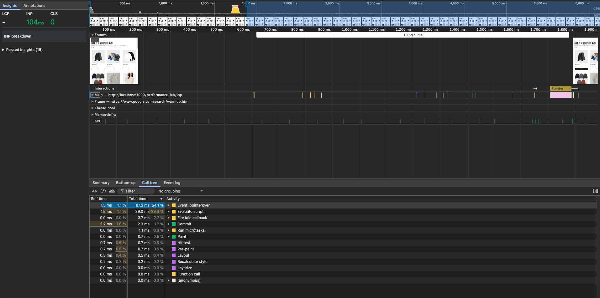
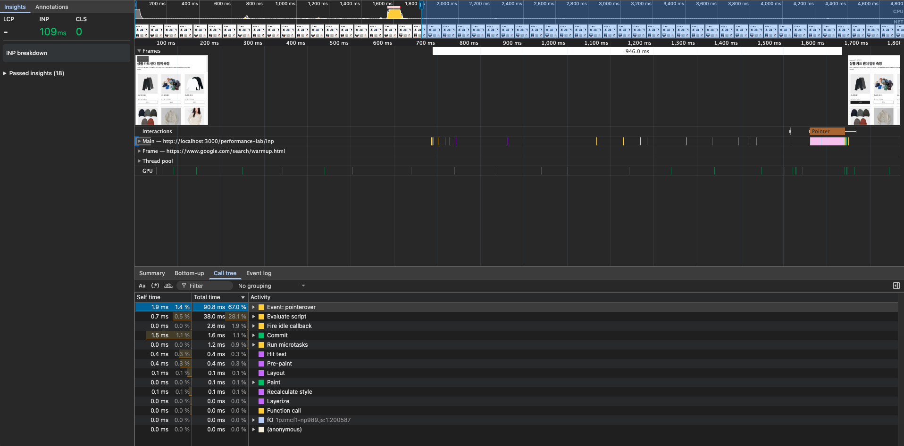
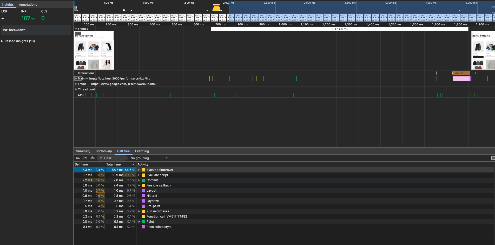
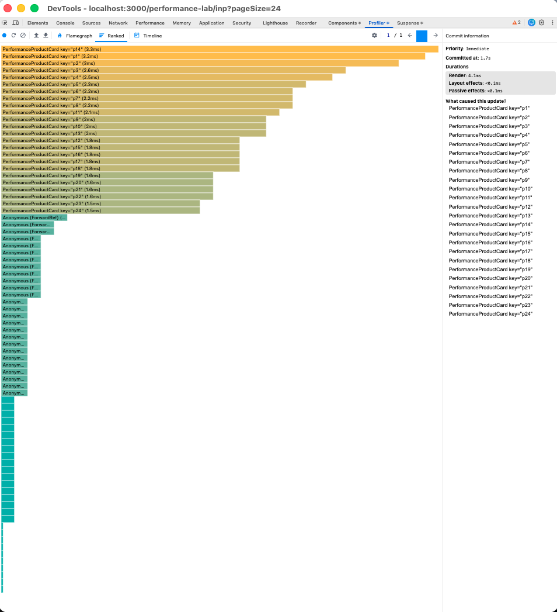
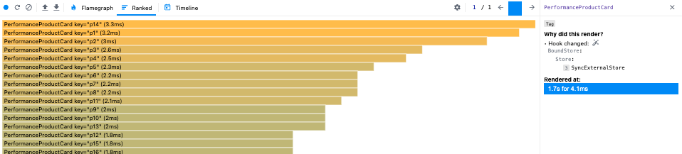
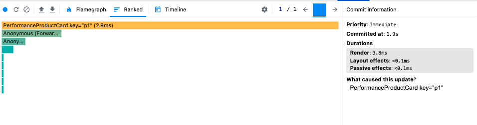
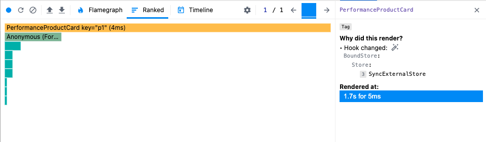
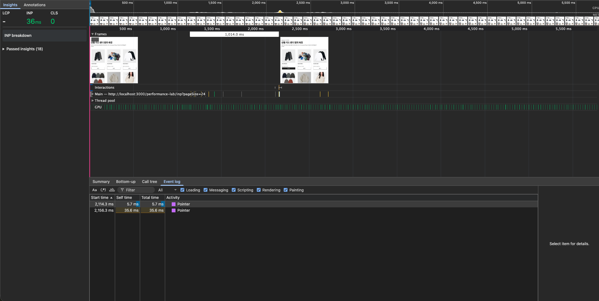
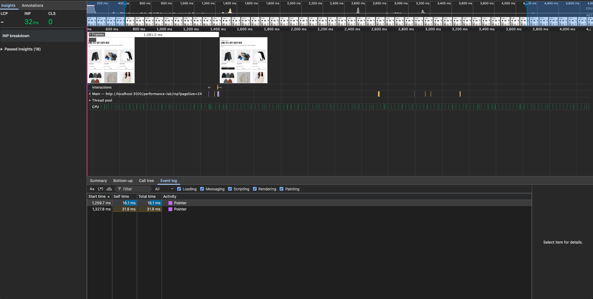
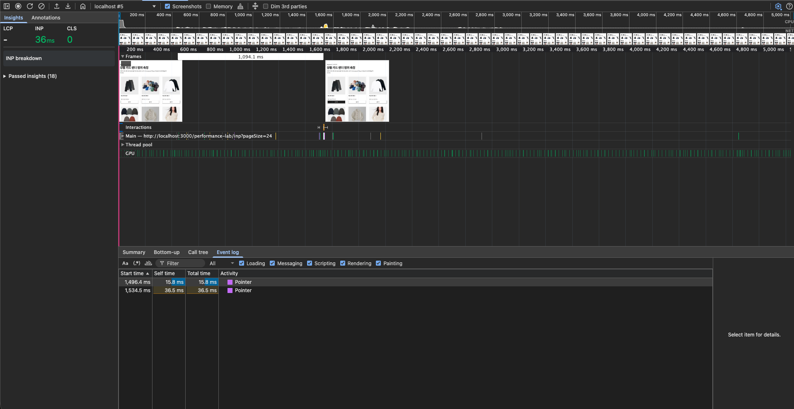

# Advanced A — INP 측정 및 개선

> 7주차 전체 결과를 먼저 보려면 [7주차 성능 측정 및 개선 요약](README.md)을 확인한다.

선택 과제 Advanced A의 측정 절차, Before/After 결과, 개입 근거를 한 문서에 기록한다. 번호 순서대로 하면 되고 결과물 경로는 각 단계 옆에 적어뒀다.

전달할 때는 단계별로 끊어서 줘도 된다.

> **트레이스 원본(`results/*.json`)은 레포에 두지 않는다.** 6건 226MB이고 Interaction 구간 값은 1·5절 표에 회차별로 전부 옮겨 적었다. 문서에 남은 `results/…` 표기는 그 값을 어느 녹화에서 뽑았는지 밝히는 출처 표시다.

> **현재 상태 (2026-08-07) — 완료.** 1·2절의 Before 측정으로 병목을 확인한 뒤 3절의 selector 변경을 적용했고, 4·5절의 After 측정과 6절 회귀·정적 검사까지 끝냈다. **Before SHA `8aa15c5`, After SHA `f50b925`**다.

---

## 0. 시작 전 (측정 없음)

1. **React Developer Tools 확장이 설치돼 있는지 확인한다.** DevTools에 `⚛️ Components` / `⚛️ Profiler` 탭이 보여야 한다. 없으면 Chrome 웹스토어에서 설치하고 브라우저를 다시 켠다.
2. 다른 탭·앱을 정리한다. CPU 4x로 재는 측정이라 백그라운드 부하가 그대로 섞인다.
3. 터미널에서 현재 SHA를 남긴다 — **Before SHA다.**
   ```bash
   git rev-parse --short HEAD && git status --short
   ```
   → 작업 트리가 깨끗해야 한다. 안 깨끗하면 먼저 커밋한다.
4. **일반 production build**로 서버를 띄운다.
   ```bash
   pnpm build && pnpm start
   ```
   → profiling build가 아니다. 시간 숫자는 이 빌드에서만 낸다.
5. 시크릿 창에서 `http://localhost:3000/performance-lab/inp?pageSize=24` 를 연다.
   `pageSize`는 화면이 읽지 않는다(fixture가 24개 고정). 명세가 지정한 URL이라 그대로 쓴다.
6. 뷰포트 크기를 기록한다. Console에 `window.innerWidth, window.innerHeight` → 값 메모.

   **기록값 — 960 × 929, dpr 1.** 스크롤바를 뺀 콘텐츠 폭은 945다. 트레이스의 `PaintTimingVisualizer::Viewport`가 Before 3회는 945, After 3회는 960으로 갈렸는데 둘 다 같은 창의 값이고 높이 929는 전 회차 동일하다. 카드 그리드는 `max-width: 960px` 구간이라 945든 960이든 **3열로 같다**(`app/performance-lab/inp/performance-lab.module.css`). 폭 표기 차이가 레이아웃이나 렌더 대상을 바꾸지 않았다.

---

## 1. Before — Performance 3회

**측정 대상은 "같은 상품의 찜 버튼 1회 클릭"이다.** 페이지 로드가 아니다.

7. DevTools → **Performance** 탭 → 톱니바퀴에서 **CPU: 4x slowdown**, **Network: No throttling**
8. 📸 설정 캡처 1장 → `assets/adv-a-performance-settings.png`
9. 페이지를 새로고침하고 **이미지 24장이 전부 뜰 때까지 기다린다.** 아직 아무것도 클릭하지 않는다.
10. 모든 카드가 `찜하기`(= 찜 안 된 상태)인지 확인한다. 하나라도 `찜 해제`면 새로고침한다.
11. **Record 시작** (`Cmd+E` 또는 ● 버튼) — 이때부터 녹화가 돈다
12. 1초쯤 기다렸다가 **첫 번째 카드의 `찜하기`를 한 번 클릭한다**
13. 2초쯤 더 기다린다 (presentation delay까지 잡히도록)
14. **Record 정지**
15. 트레이스를 저장한다 → `results/adv-a-before-1.json`
16. 9–15번을 **3회 반복**한다 → `results/adv-a-before-1.json` ~ `-3.json`
    - 매 회차마다 새로고침해서 **찜 안 된 상태에서 시작**한다. 같은 초기 상태여야 비교가 된다
    - 매번 **같은 카드(첫 번째)** 를 누른다

17. 각 회차에서 **Interactions track**을 펼쳐 `pointer` 인터랙션 막대를 클릭하고 세 구간을 읽는다.
    📸 캡처 3장 → `assets/adv-a-before-interaction-1.png` ~ `-3.png`

    | 구간                | 무엇                                    |
    | ------------------- | --------------------------------------- |
    | Input delay         | 클릭이 들어와 핸들러가 돌기까지         |
    | Processing duration | 핸들러 + 리렌더가 메인 스레드를 쥔 시간 |
    | Presentation delay  | 렌더 끝나고 다음 paint까지              |

    → **Processing duration이 커야 이 과제의 전제가 맞는다.** 세 구간이 다 작으면 병목이 없다는 뜻이라 개입하지 않고 그 사실을 기록하는 게 맞다.

### 측정 결과 — 완료

`results/adv-a-before-1.json` ~ `-3.json`의 `EventTiming` 이벤트에서 계산했다. 5절 After와 같은 식이다.

```text
input delay        = pointerup.processingStart − pointerup.timeStamp
processing         = click.processingEnd − pointerup.processingStart
presentation delay = (pointerup.timeStamp + duration) − click.processingEnd
```

| 회차       | 총(INP)     | input delay | processing  | presentation |
| ---------- | ----------- | ----------- | ----------- | ------------ |
| 1          | 104.2ms     | 0.64ms      | 79.23ms     | 24.34ms      |
| 2          | 109.2ms     | 1.72ms      | 81.57ms     | 25.89ms      |
| 3          | 107.2ms     | 1.04ms      | 79.26ms     | 26.93ms      |
| **중앙값** | **107.2ms** | **1.04ms**  | **79.26ms** | **25.89ms**  |
| 범위       | 104.2–109.2 | 0.6–1.7     | 79.2–81.6   | 24.3–26.9    |

3회 모두 processing duration이 약 79–82ms로 가장 컸다. 따라서 클릭 수신 지연이 아니라 클릭 뒤 렌더 처리에 시간이 몰린다는 전제가 확인됐다.





---

## 2. Before — React Profiler로 렌더 범위 확인

시간 숫자가 아니라 **"어떤 컴포넌트가 왜 렌더됐는가"** 를 보는 단계다. 그래서 서버를 바꾼다.

18. 서버를 내리고 **webpack dev 서버**로 띄운다.
    ```bash
    pnpm exec next dev --webpack
    ```
    → **명세가 말한 profiling build(`next build --profile`)로는 Profiler가 붙지 않는다.** `pnpm dev`(Turbopack)도 시도했지만 녹화 버튼이 안 열렸고, `--webpack`에서 열렸다. 실패 원인 정리는 아래 "미리 짚어둘 것" 참고.
    → 이 절에서 읽는 값은 렌더 개수와 렌더 원인뿐이고 둘 다 번들러와 무관하다. **시간은 1·5절의 production 빌드에서만 낸다.**
    → dev는 StrictMode가 켜져 있어 렌더가 두 번 호출된다. Before/After를 같은 조건에서 재므로 비교는 성립하지만, 숫자를 적을 때 그 사실을 함께 적는다.
19. 같은 URL을 새로 열고 이미지 24장 로드를 기다린다
20. DevTools → **⚛️ Profiler** 탭 → 톱니바퀴 → **"Record why each component rendered while profiling"** 체크
21. **Record 시작** → 첫 번째 카드 `찜하기` 1회 클릭 → **Record 정지**
22. 커밋 막대를 선택하고 **Ranked** 차트로 본다. 렌더된 컴포넌트 개수를 센다
    📸 캡처 1장 → `assets/adv-a-before-profiler-ranked.png`
23. `PerformanceProductCard` 하나를 클릭해 **"Why did this render?"** 를 읽는다
    📸 캡처 1장 → `assets/adv-a-before-profiler-why.png`

    → 예상은 `Hook 1 changed`(= `wishlistIds` 배열 구독)다. **누르지 않은 23장도 같은 이유로 렌더됐다면 병목이 확인된 것이다.**

### 확인 결과 — 완료

첫 번째 카드 한 장을 눌렀을 때 커밋 1건에 `PerformanceProductCard` `p1`~`p24`가 모두 들어왔다. 렌더 원인은 `Hook changed: BoundStore > Store > SyncExternalStore`로 표시됐다. 즉 `wishlistIds` 배열 참조가 바뀌면서 누르지 않은 23장까지 변경 알림을 받은 것이 확인됐다.




---

## 3. 개입 — 가장 작은 변경

24. 여기서 멈추고 21–23번 결과를 알려준다. **렌더 범위를 실제로 확인한 뒤에 코드를 고친다.**

2절에서 관계없는 카드 23장의 렌더가 확인됐으므로 아래 한 줄을 변경했다.

```diff
- const wishlistIds = usePerformanceWishlist((state) => state.wishlistIds)
- const selected = wishlistIds.includes(product.id)
+ const selected = usePerformanceWishlist((state) => state.wishlistIds.includes(product.id))
```

배열 대신 boolean을 구독하면 다른 카드의 boolean은 값이 그대로라 리렌더가 안 걸린다.

**적용 완료.** `memo`, 카드 수, `calculateCardPresentation`, 즉각적인 찜 피드백에는 손대지 않았다.

**하지 않을 것** — `memo`부터 붙이기, `pageSize` 줄이기, `calculateCardPresentation` 제거·축소, `setTimeout`으로 갱신 미루기. 명세가 전부 금지한다. 카드 24장과 즉각적인 찜 피드백은 그대로 남는다.

---

## 4. After — 2절과 같은 조건으로 Profiler

25. webpack dev 서버를 다시 띄운다 (2절과 같은 조건)
    ```bash
    pnpm exec next dev --webpack
    ```
26. 19–23번을 그대로 반복한다
    📸 캡처 2장 → `assets/adv-a-after-profiler-ranked.png`, `assets/adv-a-after-profiler-why.png`
    → 카드별 boolean selector에서는 toggle로 값이 바뀐 **누른 카드 1장**만 렌더돼야 한다

### 확인 결과 — 완료

찜이 모두 해제된 초기 상태에서 첫 번째 카드를 눌렀을 때 렌더된 `PerformanceProductCard`가 24장에서 `p1` 한 장으로 줄었다. 관계없는 23장의 렌더가 사라졌으므로 selector 변경이 의도대로 동작했다.



렌더 원인 화면도 남겼다. 클릭 커밋(`1 / 1`)의 `p1`을 선택하면 `Why did this render?`가 **Before와 똑같이** `Hook changed: BoundStore > Store > SyncExternalStore`로 표시된다. 원인 문구가 그대로인 것이 맞다. 카드는 여전히 store를 구독하고 있고 selector가 반환하는 값만 배열에서 boolean으로 좁아졌기 때문이다. 바뀐 것은 **알림을 받는 카드의 범위**이지 구독 자체가 아니다. `memo`를 붙였다면 이 문구가 사라졌겠지만 그 방향은 택하지 않았다.



---

## 5. After — 1절과 같은 조건으로 Performance 3회

27. **일반 production build**로 되돌린다. 이게 시간 숫자를 내는 빌드다.
    ```bash
    pnpm build && pnpm start
    ```
28. 9–17번을 그대로 3회 반복한다
    → `results/adv-a-after-1.json` ~ `-3.json`
    → 📸 `assets/adv-a-after-interaction-1.png` ~ `-3.png`

29. After SHA를 기록한다
    ```bash
    git rev-parse --short HEAD
    ```

### 측정 결과 — 3회 완료

After 트레이스 3건과 Interaction 캡처 3장을 남겼다. 중앙값은 총 35.6ms, input delay 0.88ms, processing 8.59ms, presentation 25.54ms다. Before와 비교하면 총 INP는 107.2ms에서 35.6ms로 67%, processing은 79.26ms에서 8.59ms로 89% 줄었다.





**After SHA는 `f50b925`**(`refactor: 찜 상태를 카드별 boolean으로 구독해 리렌더 축소`)다. Before SHA `8aa15c5`의 바로 다음 커밋이고, 3절의 selector 한 줄 변경만 담고 있다. 이어지는 문서 커밋에는 코드 변경이 없다.

---

## 6. 회귀 확인

> **완료** — 30–33번 동작 확인과 34번 정적 검사를 모두 통과했다.

30. `/performance-lab/inp?pageSize=24`에서 카드가 **24장 그대로**인지 — **통과**. 마지막 카드가 `성능 측정 상품 24`다
31. `화면 계산 {숫자}` 가 카드마다 여전히 표시되는지 (필수 계산을 지우지 않았다는 증거) — **통과**
32. 찜 버튼이 **누르는 즉시** `찜하기` ↔ `찜 해제`로 바뀌는지 — **통과**
33. 여러 카드를 연달아 눌러도 각자의 상태가 독립적으로 유지되는지 — **통과**. 누른 카드만 `찜 해제`로 남는다
34. 정적 검사 — **통과**. `pnpm lint` 경고 0건, `pnpm exec tsc --noEmit` 오류 0건

    ```bash
    pnpm lint && pnpm exec tsc --noEmit
    ```

30–33번은 이상이 없었으므로 별도 캡처를 남기지 않았다. selector를 좁히면서 카드 수·필수 계산·즉시 피드백 중 어느 것도 줄이지 않았음이 확인된다.

---

## 7. 전달 목록

| 순번    | 파일                                                                      | 상태                       |
| ------- | ------------------------------------------------------------------------- | -------------------------- |
| 0-3     | Before SHA                                                                | 완료 — `8aa15c5`           |
| 0-6     | 뷰포트 값                                                                 | 완료 — 960 × 929, dpr 1    |
| 8       | `adv-a-performance-settings.png`                                          | 완료                       |
| 16      | `results/adv-a-before-1.json` ~ `-3.json`                                 | 값 전사 완료 (원본 미보관) |
| 17      | `adv-a-before-interaction-1.png` ~ `-3.png`                               | 완료                       |
| 22 · 23 | `adv-a-before-profiler-ranked.png`, `-why.png`                            | 완료                       |
| 26      | `adv-a-after-profiler-ranked.png`, `-why.png`                             | 완료                       |
| 28      | `results/adv-a-after-1.json` ~ `-3.json`, `adv-a-after-interaction-*.png` | 값 전사 완료 (캡처는 보관) |
| 29      | After SHA                                                                 | 완료 — `f50b925`           |
| 30–33   | 회귀 4항목 통과 여부 (캡처는 이상 있을 때만)                              | 완료 — 4항목 전부 통과     |

---

## 미리 짚어둘 것

### 서버를 네 번 바꾼다

| 절  | 실행                           | 번들러    | 여기서 읽는 것 |
| --- | ------------------------------ | --------- | -------------- |
| 1   | `pnpm build && pnpm start`     | Turbopack | 시간(INP 구간) |
| 2   | `pnpm exec next dev --webpack` | webpack   | 렌더 범위·원인 |
| 4   | `pnpm exec next dev --webpack` | webpack   | 렌더 범위·원인 |
| 5   | `pnpm build && pnpm start`     | Turbopack | 시간(INP 구간) |

**2·4절의 시간과 1·5절의 시간을 같은 표에 놓지 않는다.** dev는 계측과 StrictMode가 얹혀 훨씬 느리고 번들러도 다르다.

### React Profiler를 붙이는 데 네 번 걸렸다

명세는 "profiling build에서 React Profiler로 재현"하라고 한다. **Next 16에서는 이 경로가 에러 없이 무시된다.** 네 번 시도해서 마지막에야 녹화 버튼이 활성화됐다.

| 시도 | 명령                                                     | 결과             |
| ---- | -------------------------------------------------------- | ---------------- |
| 1    | `pnpm exec next build --profile && pnpm start`           | 녹화 버튼 비활성 |
| 2    | `pnpm exec next build --profile --webpack && pnpm start` | 녹화 버튼 비활성 |
| 3    | `pnpm next dev`                                          | 녹화 버튼 비활성 |
| 4    | `pnpm next dev --webpack`                                | **활성화**       |

**원인이 잡힌 건 1번뿐이다.**

1. **Turbopack에 profiling alias가 없다.** `--profile`이 하는 일은 alias 한 줄인데(`react-dom/client$` → `next/dist/compiled/react-dom/profiling`, `create-compiler-aliases.js:412`) 이 함수는 webpack 설정 경로에서만 호출된다. 설치된 `next-swc.darwin-arm64.node`(16.2.10)에도 `/profiling` 경로 문자열이 0건이다. Next 16은 build 기본이 Turbopack이라 플래그가 조용히 무시된 것으로 보인다.
2. **`--webpack`은 코드상 됐어야 하는데 안 됐다.** CLI 옵션·config 전파·alias 적용 경로가 다 살아 있고, 같은 증상의 [#51131](https://github.com/vercel/next.js/issues/51131)도 2023년에 닫혔다. 그런데 산출물에 프로파일링 표식(`Cascading Update` 등, vendored 번들에는 13건)이 0건이었다. **왜인지는 못 찾았다.**
3. **3번은 확장 상태였을 수 있다.** [facebook/react#31880](https://github.com/facebook/react/issues/31880)은 같은 버전에서 Chrome만 `Profiling not supported`가 뜨고 Firefox는 정상이라고 보고한다. 브라우저를 완전히 닫고 다시 했으면 됐을지 모르지만 재현하지 않았다.

Profiler 실행 경로별 실패 원인과 webpack dev 서버를 선택한 근거는 이 문서의 위 절에 모두 적었다.

Profiler를 포기하고 production 트레이스의 JS 샘플로 렌더 횟수를 세는 우회도 안 된다. 함수 이름이 minify돼 있고 샘플 20,509개 중 18,736개가 idle이라 해상도가 부족하다.

그래서 **webpack dev 서버로 대체했다.** 이 절에서 읽는 값은 렌더 개수와 렌더 원인뿐이고, 둘 다 React 의미론이라 번들러·빌드 모드와 무관하다. 번들러가 바꾸는 것은 시간인데 시간은 1·5절에서만 낸다.

모르고 지나가면 `Profiling not supported`만 보고 Advanced A를 포기하거나, 더 나쁘게는 일반 빌드에서 잰 숫자를 Profiler 결과라고 적게 된다.

### dev의 StrictMode 이중 렌더

`next.config`가 없으면 App Router는 StrictMode를 기본으로 켠다.

```js
// next/dist/build/define-env.js:143
'process.env.__NEXT_STRICT_MODE_APP': // When next.config.js does not have reactStrictMode it's enabled by default.
```

렌더가 두 번 호출되므로 Profiler 개수가 실제의 2배로 보일 수 있다. Before/After를 같은 조건에서 재니 비교는 성립하지만, **숫자를 적을 때 "StrictMode 이중 렌더 포함"을 함께 적는다.**

### Lighthouse TBT를 INP라고 쓰지 않는다

명세가 명시적으로 금지한다. TBT는 페이지 로드 중 메인 스레드가 막힌 총량이고, INP는 **클릭 뒤 다음 paint까지**다. 이번 측정은 Interactions track의 세 구간이 유일한 근거다.

### 개입이 필요 없다고 나올 수도 있다

Before Interaction의 세 구간이 다 작고 Profiler에서 24장이 안 뜨면, **고치지 않고 그 사실을 기록하는 게 맞는 답이다.** 명세가 "병목이 확인될 때만" 하라고 했다. 2단계에서 6상태 중 4개를 무개입으로 남긴 것과 같은 판단이다.

### 이 SHA는 홈·목록 측정과 별개다

Basic의 After SHA는 `a081464`다. Advanced A는 `app/performance-lab/` 안에서만 바뀌므로 그 측정을 무효화하지 않는다. 대신 **Advanced A용 Before/After SHA를 따로 남긴다.**

---

## 5절 결과 — After 상호작용 3회

`results/adv-a-after-1.json` ~ `-3.json`의 `EventTiming` 이벤트에서 계산했다. Before와 같은 식이다.

```text
input delay        = pointerup.processingStart − pointerup.timeStamp
processing         = click.processingEnd − pointerup.processingStart
presentation delay = (pointerup.timeStamp + duration) − click.processingEnd
```

| 회차       | 총(INP)    | input delay | processing | presentation |
| ---------- | ---------- | ----------- | ---------- | ------------ |
| 1          | 35.6ms     | 0.81ms      | 8.59ms     | 26.25ms      |
| 2          | 31.9ms     | 0.88ms      | 7.82ms     | 23.23ms      |
| 3          | 36.5ms     | 1.47ms      | 9.49ms     | 25.54ms      |
| **중앙값** | **35.6ms** | **0.88ms**  | **8.59ms** | **25.54ms**  |
| 범위       | 31.9–36.5  | 0.8–1.5     | 7.8–9.5    | 23.2–26.2    |

### Before와 대조

| 구간         | Before(중앙값) | After(중앙값) | 차이           |
| ------------ | -------------- | ------------- | -------------- |
| 총(INP)      | 107.2ms        | 35.6ms        | −71.6ms (−67%) |
| input delay  | 1.04ms         | 0.88ms        | 거의 그대로    |
| processing   | 79.26ms        | 8.59ms        | −70.7ms (−89%) |
| presentation | 25.89ms        | 25.54ms       | 거의 그대로    |

**줄어든 71.6ms 중 70.7ms가 processing이다.** 나머지 두 구간은 회차 간 흔들림 범위 안이라 움직였다고 보기 어렵다. 4절에서 렌더된 카드가 24장에서 1장으로 줄어든 것과 방향이 맞고, 구간이 하나만 움직였다는 점에서 selector 변경 말고 다른 원인이 섞였다고 보기는 어려울 것 같다.

Before/After 모두 3회뿐이고 범위가 겹치지 않는 정도라 중앙값을 그대로 쓴다. 회차 수가 적은 건 그대로 한계다.

### Before에 적어둔 추측 하나가 빗나갔다

Before 절에 "presentation delay 26ms는 24장을 다시 그리는 비용으로 보인다"고 적어뒀다. **After는 카드 1장만 렌더하는데 presentation delay가 25.5ms로 거의 같다.** 24장 리페인트가 원인이었다면 여기서 줄었어야 한다.

그러니 이 26ms는 렌더된 카드 수와 무관한 비용 — CPU 4x에서의 프레임 대기나 24장 레이아웃 자체(카드 수는 안 바뀌었다) 쪽으로 보는 게 맞다. 어느 쪽인지는 재보지 않았다. 개입 대상이 아니었으므로 여기까지만 적는다.

### 남는 것

- INP 107.2ms → 35.6ms. 둘 다 "좋음"(200ms 이하) 구간이라, **개선의 근거는 등급 변화가 아니라 processing 구간이 89% 줄었다는 점이다.** CPU 4x를 건 값이라 실사용자 기기 수치로 옮겨 읽지 않는다.
- processing 8.59ms는 누른 카드 1장의 렌더 + `calculateCardPresentation`이 남은 값이다. 필수 계산을 지우지 않았으므로 0이 되지는 않는다.

---

After SHA `f50b925`는 Claude(AI)가 커밋 로그에서 확인해 채웠고, 34번 정적 검사도 AI가 `pnpm lint`와 `pnpm exec tsc --noEmit`을 실제로 실행해 통과를 확인한 것이다. 4절 `Why` 캡처와 30–33번 회귀 확인은 작성자가 직접 수행했고, 캡처를 읽고 문서에 옮긴 것은 AI다. 0-6 뷰포트 값은 AI가 트레이스 6건의 `PaintTimingVisualizer::Viewport`에서 추출하고 작성자가 브라우저에서 대조했다.

이 문서는 Claude(AI)가 `docs/assignments/week-07.md` Advanced A와 [checklist.md](checklist.md)를 대조해 작성했다. Before·After 수치는 AI가 작성자가 직접 측정한 트레이스 6건을 파싱해 계산하고 해석한 것이다. 3절의 개입 후보는 처음에는 코드를 읽고 세운 가설이었고, 작성자가 2절 Profiler에서 관계없는 카드 23장의 렌더와 `SyncExternalStore` 변경 원인을 확인한 뒤 적용했다.
