# 7주차 측정 기록

> 전체 결과와 핵심 판단을 먼저 보려면 [7주차 성능 측정 및 개선 요약](README.md)을 확인한다.

Before / After 측정값과 관찰 결과다. 진행 순서는 [plan.md](plan.md), 체크 항목은 [checklist.md](checklist.md)에 있다.

Step 3(Before)과 Step 7(After)에서 같은 표를 채운다.

> **트레이스·리포트 원본(`results/*.json`)은 레포에 두지 않는다.** Lighthouse 5회 raw, LCP 구간, `LayoutShift` 집계, `didFail` 건수 등 판단에 쓴 값은 전부 아래 표에 옮겨 적었다. 문서에 남은 `results/…` 표기는 그 값을 어느 녹화에서 뽑았는지 밝히는 출처 표시다.

## 홈 — 측정 조건

| 항목               | Before                                    | After                                     |
| ------------------ | ----------------------------------------- | ----------------------------------------- |
| SHA                | `3da2db4`                                 | `a081464` (코드는 `29c7900`과 동일)       |
| URL / query string | `http://localhost:3000`                   | 동일                                      |
| 행동               | 새 탭에서 홈 최초 진입                    | 동일                                      |
| 실행 방식          | `pnpm build` 후 `pnpm start`              | 동일                                      |
| 측정 도구          | Lighthouse 13.3.0 (DevTools 패널)         | Lighthouse 13.3.0 (DevTools 패널)         |
| Mode / Device      | Navigation / Desktop                      | Navigation / Desktop                      |
| throttlingMethod   | `simulate` (RTT 40ms, 10,240Kbps, CPU 1x) | `simulate` (RTT 40ms, 10,240Kbps, CPU 1x) |
| Network 패널       | **No throttling**                         | **No throttling**                         |
| screenEmulation    | `disabled: true` (실제 창 크기)           | `disabled: true` (실제 창 크기)           |
| 캐시               | Clear storage + Disable cache             | 동일                                      |
| 브라우저 / 프로필  | Chrome 150, 시크릿 창                     | 동일                                      |
| cold load / warm   | cold load                                 | cold load                                 |
| 뷰포트             | **미기록**                                | **945 × 929**                             |
| 측정 일시          | 2026-08-04 21:42~21:44 KST                | 2026-08-06 18:41~18:46 KST                |

After의 `throttlingMethod`·`throttling`·`screenEmulation`은 리포트 JSON의 `configSettings`에서 직접 대조했다(`results/after-final-lh-1.json`). 값이 Before와 문자열까지 같다. 원본을 지울 것이므로 대조에 쓴 값을 그대로 옮겨 둔다.

```json
"lighthouseVersion": "13.3.0",
"formFactor": "desktop",
"channel": "devtools",
"throttlingMethod": "simulate",
"throttling": {
  "rttMs": 40, "throughputKbps": 10240, "requestLatencyMs": 0,
  "downloadThroughputKbps": 0, "uploadThroughputKbps": 0, "cpuSlowdownMultiplier": 1
},
"screenEmulation": { "mobile": true, "width": 412, "height": 823, "deviceScaleFactor": 1.75, "disabled": true }
```

`screenEmulation`에 `mobile: true`와 412 × 823이 남아 있지만 `disabled: true`라 적용되지 않는다. Lighthouse가 기본값을 그대로 실은 것이고, `formFactor: desktop`과 실제 창 크기로 측정된다. UA는 `Chrome/150.0.0.0` (macOS)다.

LCP를 8초대로 만든 `throughputKbps: 10240`이 여기 있다 — [LCP 구간 분해](#lcp-구간-분해)에서 실측 662.1ms와 12배 벌어진 원인이다.

**뷰포트는 Before가 미기록이다.** `screenEmulation: disabled: true`라 실제 창 크기로 재는데, Before 홈 측정 당시 창 크기를 남기지 않았다. 945 × 929는 상품 목록 녹화에서 확인된 값이라 After를 거기에 맞췄지만, **홈 Before가 같은 크기였다는 보장은 없다.** 조건을 맞췄다고 적을 수 없는 항목이므로 그대로 남긴다.

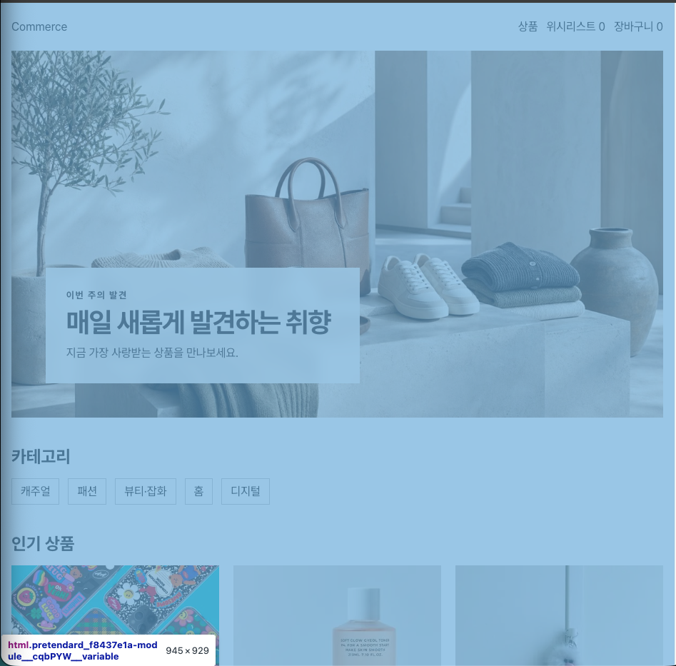

Lighthouse의 `simulate`는 스로틀링 없이 수집한 뒤 위 모델로 환산한다. 따라서 **Network 패널 스로틀링은 반드시 꺼야 한다.** 켜두면 수집 단계에 실제 지연이 걸린 위에 시뮬레이션이 한 번 더 얹힌다(아래 폐기 기록 참고).

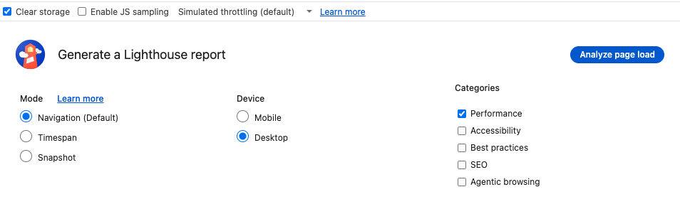


After 측정에서도 같은 조건을 화면으로 남겼다. JSON의 `configSettings`는 Lighthouse가 스스로 기록한 값이라 **Network 패널이 실제로 꺼져 있었는지는 증명하지 못한다.** 이중 스로틀링으로 Before 1차를 폐기했던 항목이라 패널 상태를 따로 찍었다.

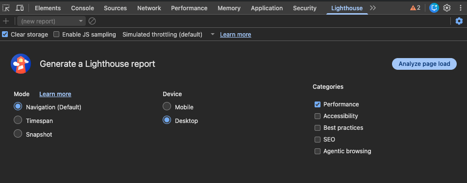

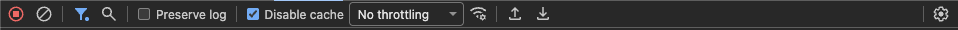

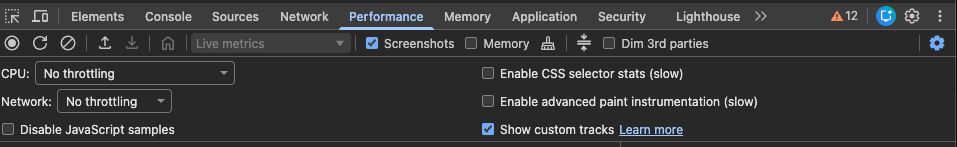

세 번째는 Lighthouse가 아니라 Performance 패널 설정이다. LCP 구간 분해와 6상태 녹화가 이 조건에서 나왔다.

측정은 `3da2db4` 커밋 직전의 작업 트리에서 수행했고, 그 트리의 코드는 `3da2db4`와 같다. 이후 문서 커밋은 빌드 산출물에 영향을 주지 않는다.

## Lighthouse 5회

Before cold load 5회다. 단위는 ms(CLS 제외).

| 지표 | 1      | 2      | 3      | 4      | 5      | 중앙값 | 최솟값 | 최댓값 |
| ---- | ------ | ------ | ------ | ------ | ------ | ------ | ------ | ------ |
| FCP  | 252.0  | 250.7  | 250.8  | 247.9  | 249.6  | 250.7  | 247.9  | 252.0  |
| LCP  | 8292.0 | 8270.7 | 8270.8 | 8367.9 | 8289.6 | 8289.6 | 8270.7 | 8367.9 |
| CLS  | 0      | 0      | 0      | 0      | 0      | 0      | 0      | 0      |

Performance score 75, Speed Index 약 440ms, TBT 0ms, 서버 응답 8~12ms.

여기서 두 가지가 확정된다.

- **Header는 hero에 막히지 않는다.** FCP 250.7ms, LCP 8,289.6ms로 격차 8초가 전부 hero 몫이다. 다만 `h1`까지 막히지 않는다는 결론은 아래 filmstrip에서 뒤집혔다.
- **CLS가 0이다.** Step 1에서 `HeroSectionSkeleton`에 `aspect-ratio`를 맞춘 것이 동작한다. CLS 항목은 무개입 근거로 쓴다.

### 폐기한 1차 측정 (2026-08-04 21:26~21:31)

Network 패널을 `Fast 4G`로 둔 채 Lighthouse를 돌려 이중 스로틀링이 걸렸다. FCP 577.4ms / LCP 9,297.4ms / CLS 0.0008, score 68이 나왔지만 **Before로 쓰지 않는다.**

판별 근거는 5회 편차다. LCP 편차가 0.6ms(9,296.951~9,297.529)로 계산값에서만 나올 수 있는 값이었고, hero 이미지의 network 시간도 localhost에서 9,462ms로 물리적으로 불가능했다. 스로틀링을 끄자 같은 파일이 61ms로 떨어졌다.

이 측정의 리포트 HTML과 `Fast 4G` 설정 스크린샷은 재측정 때 덮어써서 남아 있지 않다. 위 수치는 폐기 전에 리포트에서 추출한 값이다.

### After — Lighthouse 5회 (Step 7)

`a081464` cold load 5회다. 원본은 `results/after-final-lh-1.json` ~ `-5.json`이다.

| 지표  | 1      | 2      | 3      | 4      | 5      | 중앙값 | 최솟값 | 최댓값 |
| ----- | ------ | ------ | ------ | ------ | ------ | ------ | ------ | ------ |
| FCP   | 248.8  | 248.6  | 250.2  | 251.8  | 249.1  | 249.1  | 248.6  | 251.8  |
| LCP   | 2248.8 | 2248.6 | 2250.2 | 2251.8 | 2249.1 | 2249.1 | 2248.6 | 2251.8 |
| CLS   | 0      | 0      | 0      | 0      | 0      | 0      | 0      | 0      |
| SI    | 250.5  | 251.0  | 250.2  | 257.7  | 249.1  | 250.5  | 249.1  | 257.7  |
| Score | 89     | 89     | 89     | 89     | 89     | 89     | 89     | 89     |

TBT는 5회 모두 0ms다.

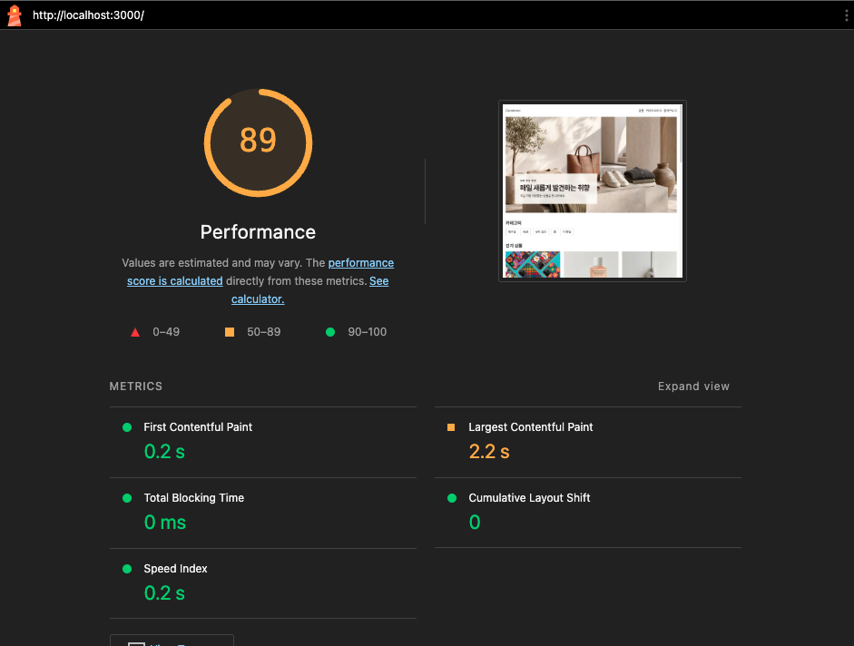

#### Before 대비

| 지표       | Before        | After        | 변화                                      |
| ---------- | ------------- | ------------ | ----------------------------------------- |
| FCP 중앙값 | 250.7ms       | **249.1ms**  | −1.6ms (사실상 동일)                      |
| LCP 중앙값 | 8289.6        | **2249.1**   | **−6,040.5ms (−72.9%)**                   |
| CLS        | 0             | 0            | 유지                                      |
| Score      | 75            | **89**       | +14                                       |
| 5회 범위   | LCP 97.2ms 폭 | LCP 3.2ms 폭 | 좁아짐 (전송량이 줄어 환산 편차도 줄었다) |

#### 예상 2건 중 1건이 반증됐다

측정 전에 적어둔 예상은 두 가지였다.

| 예상                                                         | 결과                              |
| ------------------------------------------------------------ | --------------------------------- |
| LCP는 2,300ms 근처로 줄 것이다                               | **적중** (2,249.1ms)              |
| FCP는 Before(250.7ms)보다 나빠질 것이다 — Step 4에서 351.7ms | **반증** (249.1ms, Before와 동일) |

FCP 예상의 근거는 Step 4의 인과 사슬이었다. `Header 조기 하이드레이션 → /products prefetch 94.1ms → React 19가 그 라우트 스타일시트를 head에 hoisting → 첫 페인트 차단`.

After의 네트워크 기록에서 이 사슬이 끊긴 지점을 찾았다.

|                           | Step 4                      | After                     |
| ------------------------- | --------------------------- | ------------------------- |
| `/products` prefetch 시작 | 94.1ms                      | **109ms**                 |
| FCP(실측)                 | —                           | 96.6ms                    |
| 관계                      | prefetch가 FCP보다 **앞섬** | prefetch가 FCP보다 **뒤** |

FCP 이전에 완료되는 CSS는 홈 자신의 3건(41→49ms, 각 966·1,905·997 B, 모두 `VeryHigh`)뿐이다. prefetch가 109ms로 밀리면서 라우트 스타일시트가 첫 페인트를 막지 못한다.

**왜 밀렸는지는 확정하지 못했다.** Step 5·6에서 클라이언트 번들과 컴포넌트 트리가 바뀌었으므로 그중 하나일 텐데, Step 4 트레이스와 직접 대조하지 않았다. 확정된 것은 "지금은 prefetch가 FCP를 막지 않는다"까지다.

## LCP 구간 분해

Chrome DevTools Performance 패널의 Insights → `LCP breakdown`에서 읽은 값이다. **Lighthouse와 달리 스로틀링 없는 실측이므로 5회 표와 같은 숫자가 아니다.** 측정 조건은 CPU·Network 모두 `No throttling`, Disable cache, 시크릿 창, `Record and reload` 1회이고, 2026-08-05 13:25 KST에 녹화했다. 코드는 `3da2db4`와 동일하다(`git diff 3da2db4 HEAD -- . ':!docs'`가 비어 있다).

아래 표, filmstrip, waterfall은 **모두 같은 녹화 하나**(`results/before-home-record.json`)에서 뽑았다.

| 구간                   | Before                 | After               | Before 비중 | 비고                                                  |
| ---------------------- | ---------------------- | ------------------- | ----------- | ----------------------------------------------------- |
| Time to first byte     | 19ms                   | **11ms**            | 3%          | head와 shell fallback이 먼저 flush                    |
| Resource load delay    | **514ms**              | **5ms**             | 78%         | document가 533.6ms에 끝나야 ``가 도착            |
| Resource load duration | 47ms                   | **5ms**             | 7%          | 7.5MB를 localhost에서 받는 시간                       |
| Element render delay   | 83ms                   | **76ms**            | 13%         | 디코딩·래스터화                                       |
| **실측 LCP**           | **662.1ms**            | **96.6ms** (−85.4%) |             | Performance 패널 LCP 마커                             |
| Hero 전송 크기         | 7,368.7KB (원본 7.5MB) | **175.1KB**         |             | `hero-1200.webp` 1200×675                             |
| LCP element            | Hero 이미지            | Hero 이미지 (동일)  |             | `img.HeroSection-module__lqBdna__image`, Type `image` |

After 녹화는 `results/after-final-home-record.json`이다. 조건은 Before와 같다(CPU·Network `No throttling`, Disable cache, 시크릿 창, `Record and reload` 1회, 2026-08-06 18:50~18:55 KST).

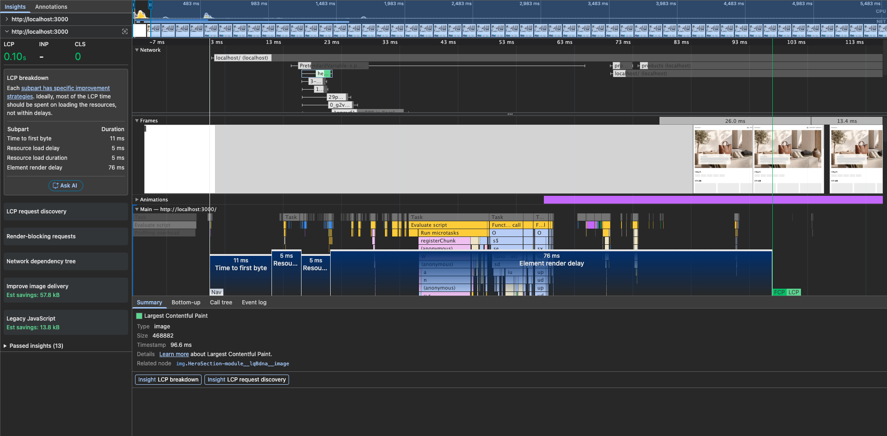

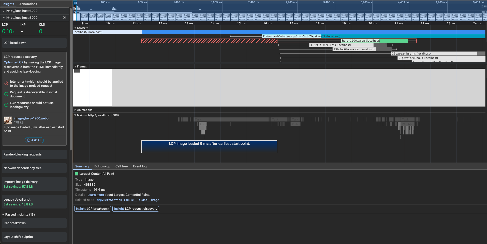

**Before에서 78%를 차지하던 `Resource load delay`가 514ms → 5ms로 사라졌다.** 개입 4(``를 Suspense 밖 첫 flush로 올림)의 효과이고, `Resource load duration` 47ms → 5ms는 파일 크기(7.5MB → 179KB)의 효과다. 두 개입이 서로 다른 구간에 걸렸다는 것이 여기서 분리되어 보인다.

`Element render delay`만 83ms → 76ms로 거의 그대로다. 디코딩·래스터화는 이번 개입 대상이 아니었고, 이제 실측 LCP 96.6ms의 **79%**가 이 구간이다. 다음에 줄일 것이 있다면 여기다.

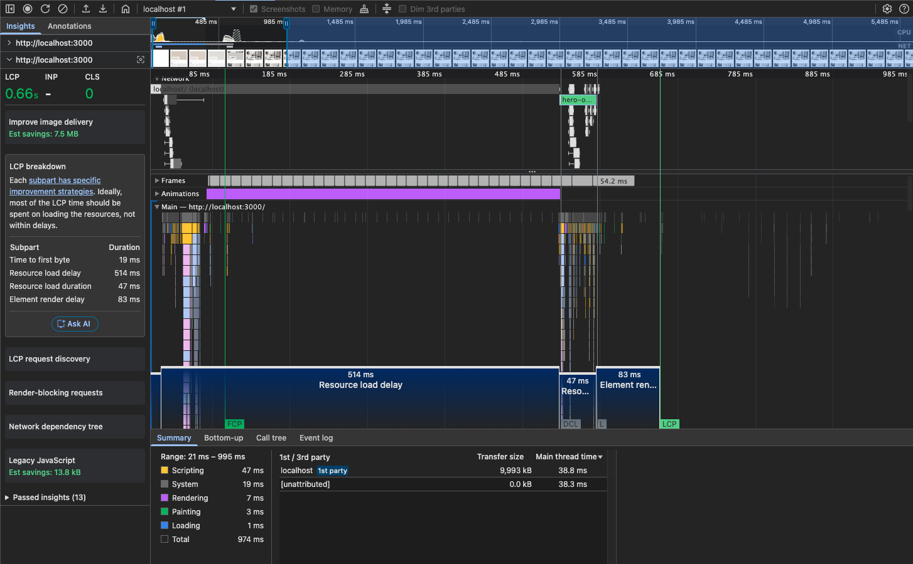


Lighthouse 5회의 LCP 중앙값은 8,289.6ms인데 실측은 662.1ms다. 12배 차이의 원인은 Lighthouse의 `simulate`가 7,545,525 bytes를 10,240Kbps 모델로 환산하기 때문이다(≈5.76초). **localhost에서는 대역폭 병목이 아예 보이지 않는다.**

### Performance filmstrip 표시 순서

같은 녹화(`before-home-record.json`)의 Screenshot 43프레임과 paint 마커를 `navigationStart` 기준으로 정렬한 값이다.

| 시각         | 화면에 새로 나타난 것                                                                               | 대응 마커                                                    |
| ------------ | --------------------------------------------------------------------------------------------------- | ------------------------------------------------------------ |
| 85.5ms       | Header(로고·상품·위시리스트 0·장바구니 0), `h2` "카테고리"·"인기 상품", Hero·카테고리·카드 스켈레톤 | FCP 101.9ms, LCP candidate 1 = `H2`(size 2581)               |
| 85.5~552.8ms | **화면 변화 없음.** 34프레임이 같은 스켈레톤이다                                                    | 홈 데이터 대기 구간                                          |
| 566.0ms      | Hero 이미지 상단 일부, `h1` "매일 새롭게 발견하는 취향", 페이지 설명, 카테고리 칩 실제 텍스트       | DOMContentLoaded 534.1ms, LCP candidate 2 = `H1#hero-title`  |
| 593.3ms      | 인기 상품 카드 이미지                                                                               | firstImagePaint 582.1ms, LCP candidate 3 = `img.ProductCard` |
| 643.7ms      | Hero 이미지 전체                                                                                    | LCP 662.1ms, candidate 4 = `img.HeroSection`                 |

프레임 이미지의 md5는 매 장 다르지만(스켈레톤 shimmer 애니메이션과 JPEG 인코딩 차이), 85.5ms와 552.8ms 프레임을 직접 열어 비교하면 화면 내용은 같다. "변화 없음"은 해시가 아니라 육안 대조로 판정했다.

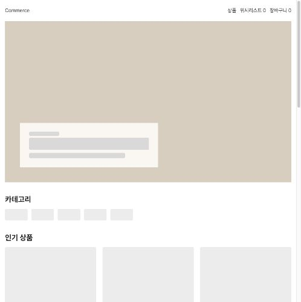


**Lighthouse 5회에서 내린 결론을 여기서 한 칸 좁힌다.** Header는 85.5ms에 나오지만 `h1`과 페이지 설명은 566.0ms까지 없다. 초기 HTML의 최대 텍스트가 `h2`("인기 상품", LCP candidate 1)라는 것이 그 증거다. `h1`이 `HeroSection` 안에 있어서 홈 데이터를 함께 기다린다.

명세 1단계는 "Header, 하나의 `h1`, 페이지 설명까지 함께 막히지 않도록" 요구한다. **Header는 통과하지만 `h1`과 설명은 통과하지 못한다.** Step 4의 렌더링 경계 조정은 근거가 없는 것이 아니라, Header가 아니라 `h1`·설명을 대상으로 해야 한다.

3단계 "JavaScript 실행 전에도 제목이 보여야 한다"와도 같은 지점을 가리킨다. Step 6의 초기 HTML 확인에서 다시 대조한다.

### Network waterfall — 요청 시작 순서와 전송 크기

같은 트레이스의 `ResourceSendRequest` / `ResourceFinish`를 `navigationStart` 기준으로 정렬했다.

| 시작    | 종료    | 크기          | 리소스                                   |
| ------- | ------- | ------------- | ---------------------------------------- |
| 21.9ms  | 533.6ms | 10.2KB        | document `/`                             |
| 22.3ms  | 74.9ms  | **2,009.8KB** | `PretendardVariable.woff2`               |
| 23.7ms  | 60.1ms  | 178.8KB       | CSS·JS 청크 14개(병렬)                   |
| 532.8ms | 580.4ms | **7,368.7KB** | `/images/week-07/hero-original.jpg`      |
| 544.4ms | 560.2ms | 136.0KB       | `/_next/image` 상품 카드 9장(w=640&q=75) |
| 551.2ms | 577.4ms | 8.7KB         | `/products?...&_rsc=` prefetch 11건      |
| 576.6ms | 581.1ms | 19.9KB        | JS 청크 2개(추가 로드)                   |
| 582.1ms | 584.4ms | 25.6KB        | `favicon.ico`                            |

총 40개 요청, 전송 합계 9,757.6KB다.

여기서 세 가지가 확인된다.

- **`/api/home` 요청이 waterfall에 없다.** 홈 데이터는 서버에서 RSC로 조회하므로 브라우저 요청으로 나타나지 않는다. slow API 500ms는 document `/`의 21.9~533.6ms 안에 들어 있다. 3단계의 "Browser Network만 보고 Route Handler 호출 횟수를 판정하지 않는다"가 이 상황을 말한다.
- **Hero 요청은 document가 끝나기 직전인 532.8ms에 시작한다.** 스트리밍된 HTML을 preload scanner가 읽은 시점이고, 그 앞 500ms 동안 네트워크는 폰트·청크를 다 받고 놀고 있었다.
- **상품 카드 이미지는 `/_next/image`로 최적화되는데 Hero만 원본 ``다.** 카드 9장 합계가 136.0KB(webp)인데 Hero 한 장이 7,368.7KB(jpeg)다. 같은 페이지 안에서 처리 방식이 갈린다.

### 실측이 가리키는 병목 — 요청 시작이 514ms 늦다

DevTools 설명대로 LCP 시간은 대기가 아니라 리소스 로딩에 쓰여야 하는데, 지금은 받는 데 47ms, 기다리는 데 514ms로 정반대다.

원인은 `HomePage`가 `await queryClient.prefetchQuery(homeQueries.detail())`로 홈 API 500ms를 기다린 뒤에야 `HeroSection`이 들어간 HTML을 내보내는 구조다.

`LCP request discovery` 인사이트의 판정은 다음과 같다.

| 항목                                                                | 결과 |
| ------------------------------------------------------------------- | ---- |
| `fetchpriority=high` should be applied to the image preload request | ⛔   |
| Request is discoverable in initial document                         | ✅   |
| LCP resources should not use `loading=lazy`                         | ✅   |

``는 초기 HTML에 있으므로 발견 자체는 문제가 없다. **그 HTML이 늦게 도착하는 것이 문제다.** 같은 패널이 `LCP image loaded 514 ms after earliest start point.`라고 표시하는데, 이 514ms가 위 breakdown의 `Resource load delay`와 같은 값이다.


같은 녹화의 Insights에 `Legacy JavaScript`(Est savings 13.8kB), `Render-blocking requests`, `Network dependency tree`도 함께 잡혔다. JS 청크 합계가 178.8KB로 Hero 7.5MB에 비해 두 자릿수 작으므로 이번 병목과 무관하다고 보고 다루지 않는다. 판단이 틀렸다면 Hero를 줄인 뒤에도 LCP가 안 내려가는 것으로 드러날 것이다.

### CLS

Layout Shifts 트랙에 항목이 없고 Insights의 CLS도 `0`이다. `HeroSectionSkeleton`이 실제 Hero와 같은 공간을 잡고 있다. 2단계·4단계의 CLS 항목은 무개입 근거로 쓴다.

### Step 4 개입 후보

두 측정이 서로 다른 구간을 가리킨다. 어느 쪽을 먼저 할지는 아래 "관찰 → 가설 → 반증 → 최소 변경" 표에서 정한다.

**후보 1. Hero 이미지 파일 크기 축소**

- 근거: Lighthouse Before 8,289.6ms에서 전송 환산분(≈5.76초)이 최장 구간이다. Insights도 `Improve image delivery — Est savings 7.5MB`를 지적한다.
- 반증: 크기를 줄였는데 Lighthouse LCP가 비례해 줄지 않으면 전송이 지배 항목이라는 가설이 틀린 것이다.
- 제약: 시각적 크기·비율·피사체·문구를 유지한다. 작게 보이게 하거나 품질을 낮춰 수치만 줄이지 않는다.

**후보 2. `app/layout.tsx` head에 preload + `fetchpriority="high"`**

- 근거: 실측 514ms delay가 전체의 78%다. `HeroSection`의 `src`는 `/images/week-07/hero-original.jpg`로 하드코딩된 정적 URL이라 API 응답과 무관하고, TTFB 19ms에 head가 이미 flush되므로 힌트를 API 대기 전에 내보낼 수 있다.
- 반증: preload를 넣어도 이미지 요청이 여전히 532.8ms 근처에서 시작하면 가설이 틀린 것이다.
- 발제가 경고한 반례(데이터가 와야 URL을 아는 경우)에는 해당하지 않는다.

**후보 3. `h1`·페이지 설명을 홈 데이터 밖으로 빼기**

- 근거: filmstrip에서 `h1`과 설명이 566.0ms까지 없다. LCP 숫자가 아니라 명세 1단계·3단계 요구사항에 걸린다.
- 반증: 경계를 바꿨는데도 초기 HTML(View Source)에 `h1`이 없으면 가설이 틀린 것이다.

한 번에 하나만 바꾸고 각각 같은 조건에서 재측정한다.

## 개입 1 — 후보 3(렌더링 경계 분리) 중간 검증

4단계 After가 아니라 개입 하나가 의도대로 동작했는지 확인한 중간 측정이다. After 표는 이미지·preload까지 끝낸 뒤 Lighthouse 5회로 따로 채운다.

### 무엇을 바꿨나

`HomePage`가 `async` 함수라 `return` 전체가 `prefetchQuery` await 뒤로 밀려 Header와 `h1`까지 홈 데이터를 기다렸다. 기다리는 부분만 `HomeData`로 내려 `Suspense` 안에 두고, `PageContainer`·`Header`·`h1`은 첫 flush로 내보내도록 바꿨다.

- 홈의 `h1`은 시각 숨김 텍스트로 `HomePage`가 소유한다. `HeroSection`의 `banner.title`은 응답에 딸린 섹션 제목이므로 `h2`로 내렸다.
- 라우트 레벨 `app/(home)/loading.tsx`는 삭제했다. `HomePage` 내부 `Suspense`와 중복이라 초기 HTML에 `Header`·`h1`이 두 벌 실렸다(아래 참고).
- 스켈레톤은 `HomeContentSkeleton`으로 분리해 `Suspense` fallback이 사용한다.

측정 조건은 홈 Before의 LCP 구간 분해와 같다. CPU·Network 모두 `No throttling`, Disable cache, 시크릿 창, `Record and reload` 1회다. 트레이스는 `results/after-h1-home-record.json`이다.

### 중간에 발견한 결함 — 초기 HTML에 `h1`이 2개

`loading.tsx`를 남겨둔 1차 시도에서는 라우트 fallback과 `HomePage` shell이 각각 `Header`+`h1`을 그려 document에 두 벌이 실렸다. 하이드레이션 후 DOM에는 하나만 남지만, JavaScript를 끈 요청과 crawler가 보는 초기 HTML에는 `h1`이 둘이다. 명세의 "하나의 명확한 `h1`"과 "JavaScript를 끈 요청으로 초기 HTML 확인"에 걸린다.

`loading.tsx`를 지워 해결했다. document 전송 크기도 함께 줄었다.

| 상태                    | document 전송 | 초기 HTML `h1`    | 초기 HTML `<header>` |
| ----------------------- | ------------- | ----------------- | -------------------- |
| Before                  | 10.2KB        | 1개(566.0ms 렌더) | 1개                  |
| 1차(`loading.tsx` 유지) | 11.4KB        | **2개**           | **2개**              |
| 2차(`loading.tsx` 삭제) | 9.3KB         | 1개               | 1개                  |

### 초기 HTML 확인

production build를 `APP_ORIGIN=http://localhost:3000`으로 실행하고 `curl`로 document를 받아 확인했다.

```bash
curl -s http://localhost:3000 | grep -o '<h1[^>]*>[^<]*'
# <h1 class="visually-hidden">취향을 발견하는 라이프스타일 스토어
```

- `h1` 1개, `<header>` 1개
- `h1` 위치는 전체 46,450 byte 중 **1,863 byte 지점**이다. 첫 flush에 들어간다.
- `h1` 바로 뒤가 `<!--$?--><template id="B:0">`다. Suspense 대기 마커이므로 shell이 홈 데이터를 기다리지 않고 나갔다는 뜻이다.

### 측정값 비교

| 항목                 | Before(홈)    | 개입 1 후  |
| -------------------- | ------------- | ---------- |
| FCP                  | 101.9ms       | 118.7ms    |
| 실측 LCP             | 662.1ms       | 638.9ms    |
| CLS                  | 0             | 0          |
| `LayoutShift` 이벤트 | 0건           | 0건        |
| document 전송        | 10.2KB        | 9.3KB      |
| hero 요청 시작       | 532.8ms       | 534.2ms    |
| hero 전송 크기       | 7,368.7KB     | 7,368.7KB  |
| 초기 HTML의 `h1`     | 없음(566.0ms) | 1,863 byte |

**FCP와 LCP 차이는 개선으로 읽지 않는다.** 같은 조건 실측이 662.1(Before) / 617.9(1차) / 638.9ms(2차)로 44ms 폭인데, Before Lighthouse 5회 범위도 97ms였다. 이 개입은 이미지 요청 시점을 바꾸지 않으므로 LCP가 그대로인 것이 예상된 결과다.

### LCP 후보 변화

| 순서 | Before                    | 개입 1 후                 |
| ---- | ------------------------- | ------------------------- |
| 1    | `H2` 101.9ms              | `H2` 118.7ms              |
| 2    | `H1#hero-title` 566.0ms   | `H2#hero-title` 585.6ms   |
| 3    | `img.ProductCard` 593.3ms | —                         |
| 4    | `img.HeroSection` 662.1ms | `img.HeroSection` 638.9ms |

`h1`이 후보에서 사라진 것은 의도한 결과다. 시각 숨김이라 크기가 1px이라 LCP 후보가 될 수 없다.

### filmstrip

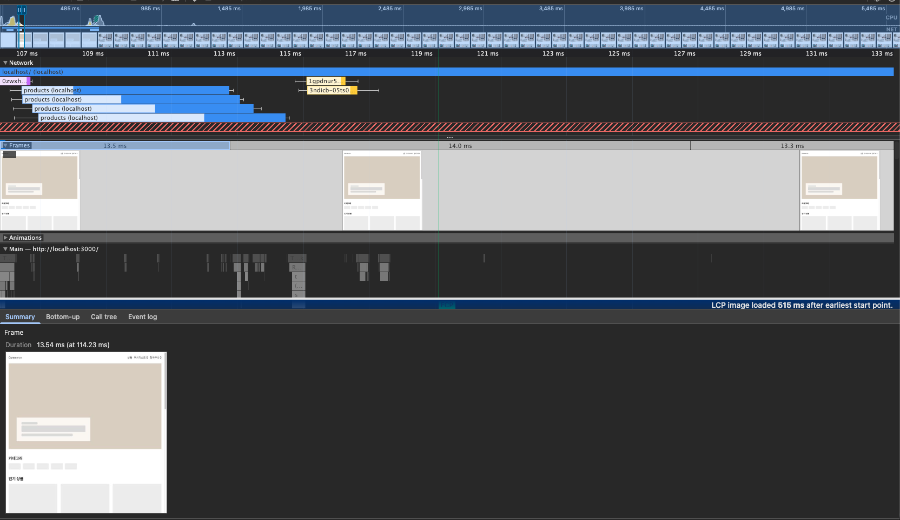
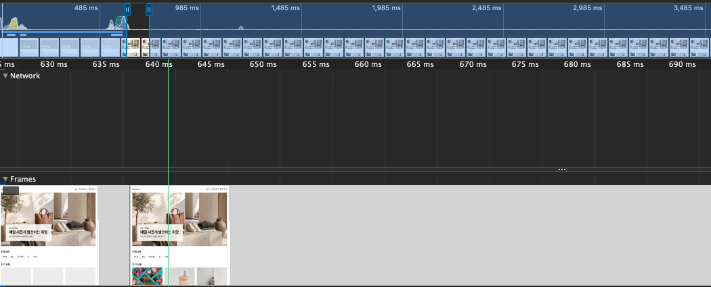

114.23ms 프레임에 Header(`Commerce`, `상품`, `위시리스트 0`, `장바구니 0`)가 이미 있다. 두 프레임에서 Header·`카테고리`·`인기 상품`의 세로 위치가 같아 스켈레톤과 실제 콘텐츠가 같은 공간을 차지한다. `LayoutShift` 이벤트 0건과 일치한다.

`h1`은 시각 숨김이라 filmstrip에 나타나지 않는다. 그 확인은 위 초기 HTML 검사가 대신한다.

### 판정

후보 3의 반증 조건은 "경계를 바꿨는데도 초기 HTML에 `h1`이 없으면 가설이 틀린 것"이었다. **반증되지 않았다.** `h1`은 초기 HTML 첫 flush에 있고, CLS 0과 기존 filmstrip 순서는 유지된다. LCP는 변하지 않았고 이는 이 개입의 대상이 아니다.

`pnpm test`(8 파일 53개), `pnpm lint`, `pnpm exec tsc --noEmit`, `pnpm build`를 통과했다.

### 부작용 — FCP가 101ms 늘었다

Lighthouse 5회를 개입별로 따로 돌려 원인을 갈랐다. 개입 2(이미지)를 `git stash`로 잠시 되돌리고 개입 1만 적용된 `2b465a2` 상태에서 5회, 다시 개입 2를 얹고 5회 측정했다. 측정 조건은 Before와 같다.

| 지표       | Before `3da2db4` | 개입 1 `2b465a2` | 개입 1+2      |
| ---------- | ---------------- | ---------------- | ------------- |
| FCP 중앙값 | 250.7ms          | **351.7ms**      | 352.8ms       |
| LCP 중앙값 | 8,289.6ms        | 8,290.2ms        | **2,370.2ms** |
| CLS        | 0                | 0                | 0             |
| score      | 75               | 75               | 88            |

개입 1은 FCP를 +101.0ms 올리고 LCP는 +0.6ms만 움직였다. 개입 2는 FCP를 +1.1ms 움직이고 LCP를 −5,920.0ms 내렸다. FCP 5회 범위가 2.1ms, LCP가 101.7ms이므로 각 개입이 정확히 한 지표씩만 바꾼 것으로 판정한다.

**원인은 Header 조기 렌더가 유발한 route prefetch다.** 두 트레이스의 FCP 이전 요청을 비교하면 드러난다.

|                            | Before               | 개입 1                          |
| -------------------------- | -------------------- | ------------------------------- |
| CSS 요청 시각              | 4개 모두 23.7~24.0ms | 3개는 25.3ms, **1개는 105.1ms** |
| `/products?_rsc=` prefetch | 547.6ms (FCP 뒤)     | **94.1ms (FCP 앞)**             |
| FCP                        | 101.9ms              | 118.7ms                         |

늦게 온 `0zwxhsxlocupd.css`는 홈이 쓰지 않는 `ProductFilters` 스타일이다. 상품 목록 라우트의 CSS인데 priority가 `VeryHigh`라 홈의 첫 페인트를 막는다.

사슬은 이렇다. 개입 1이 Header를 첫 flush로 올림 → Header가 일찍 하이드레이션됨 → `<Link href="/products">`의 prefetch가 94.1ms에 실행됨 → React 19가 그 라우트의 스타일시트를 head에 hoisting함 → 렌더 블로킹으로 FCP 지연. Before에서는 Header가 `HomeContent` 안에 있어 홈 데이터를 기다렸고, prefetch도 547.6ms에야 나가 FCP에 영향이 없었다.

즉 **개입 1이 의도대로 동작한 결과로 생긴 부작용이다.** Header를 일찍 보여주려는 변경이, 일찍 보여준 Header 때문에 첫 페인트를 늦췄다.

이 인과 사슬은 요청 시각 순서와 priority로 추론한 것이다. 직접 반증하려면 Header 링크에 `prefetch={false}`를 주고 같은 조건에서 재측정해 FCP가 250ms대로 회복되는지 보면 된다.

**유지한다.** 근거는 셋이다.

- 개입 1은 FCP 개선이 목적이 아니라 명세 1단계의 "Header·`h1`·페이지 설명이 함께 막히지 않도록"과 3단계의 초기 HTML 요구를 맞추려는 구조 변경이다. 그 목적은 달성했다.
- 손실 +101ms는 같은 측정에서 얻은 LCP −5,920ms의 1.7%다.
- prefetch 자체는 상품 목록 이동을 빠르게 하는 실제 이득이다. 홈 FCP 101ms를 위해 다른 페이지의 이동 속도를 파는 거래가 순이득인지 이 측정만으로는 판정할 수 없다.

`prefetch={false}`로 되돌리는 선택지는 검토했으나 적용하지 않았다. 이득과 손실이 서로 다른 화면에 걸쳐 있어 같은 조건에서 비교할 기준을 세우지 못했다.

## 개입 2 — 후보 1(Hero 이미지 축소)

컨테이너 최대 폭이 1200px(`PageContainer`의 `min(100% - 32px, 1200px)`)인데 원본은 3840px였다. 표시 크기의 3.2배라 화면에 그릴 수 없는 픽셀을 받고 있었다. 표시 폭에 맞춘 후보를 미리 만들어 `srcset`으로 제공한다.

`next/image`도 검토했으나 정적 파일 생성을 골랐다. 런타임 변환이 없어 첫 요청도 같은 조건이고, 측정이 재현된다. 명세 87줄이 `next/image` 사용 여부는 완료 기준이 아니라고 명시한다.

### 압축률 선택

`sips`로 리사이즈하고 `cwebp`로 변환했다. PSNR 기준 이미지는 원본을 같은 폭으로 줄인 것 — 브라우저가 원본에서 실제로 화면에 그렸을 픽셀이다.

| 품질    | 크기(1200w)   | PSNR         | 원본 대비 |
| ------- | ------------- | ------------ | --------- |
| q75     | 76,750 B      | 40.01 dB     | 1.0%      |
| q85     | 119,256 B     | 43.61 dB     | 1.6%      |
| **q92** | **179,012 B** | **47.61 dB** | **2.4%**  |

40dB가 통상 육안 구별 불가 경계라 q75도 기준을 넘지만 **q92를 골랐다.** 10,240Kbps 환산으로 q75가 61ms, q92가 143ms라 8,289.6ms 기준선에서 82ms 차이에 불과한 반면, "품질을 낮춰 수치만 줄였다"는 반론을 원천적으로 없앨 수 있다.

크기가 준 주된 이유는 압축이 아니라 리사이즈다. 3840px를 1200px로 줄이면 픽셀 수가 1/10이 된다.

| 파일                          | 크기        | PSNR     |
| ----------------------------- | ----------- | -------- |
| `hero-original.jpg` 3840×2160 | 7,545,239 B | —        |
| `hero-1200.webp` 1200×675     | 179,012 B   | 47.61 dB |
| `hero-2400.webp` 2400×1350    | 527,432 B   | 48.22 dB |

CSS는 한 줄도 바꾸지 않았다. `.hero`의 `width: 100%`, `aspect-ratio: 16/9`, 모바일 `4/5`가 그대로다. 시각적 크기·비율·피사체·문구를 유지한다는 명세 요구를 충족한다.

### 결과

| 지표       | 개입 1    | 개입 1+2      |
| ---------- | --------- | ------------- |
| FCP 중앙값 | 351.7ms   | 352.8ms       |
| LCP 중앙값 | 8,290.2ms | **2,370.2ms** |
| CLS        | 0         | 0             |
| score      | 75        | **88**        |

**LCP −5,920.0ms(−71%).** 전송 환산분 약 5.76초가 빠질 것이라는 예측과 일치한다. 측정 흔들림(Before 101.7ms, After 81.9ms)의 60배가 넘는 변화다.

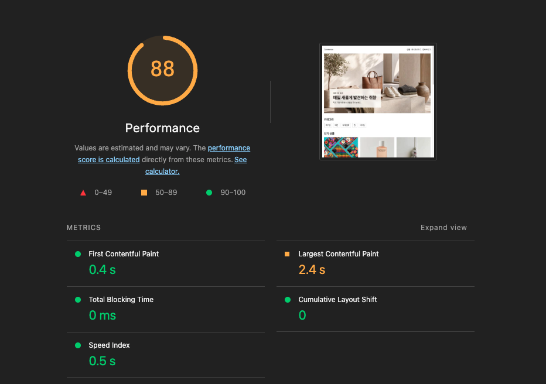

브라우저가 받은 후보는 `hero-1200.webp` 179,296 B였다(hostDPR 1). Before 7,368.7KB 대비 97.6% 감소다.

## 개입 3 — 후보 2(preload + `fetchpriority`)는 되돌렸다

`HomePage`에서 `ReactDOM.preload()`로 Hero 이미지 힌트를 prefetch await 앞에 내보냈다. ``와 같은 후보 목록을 `imageSrcSet`·`imageSizes`로 넘겨 재사용을 보장했다. 측정 뒤 되돌렸으므로 커밋에는 남지 않는다.

### 가설은 맞았다

| 구간                     | 개입 1+2  | 후보 2 적용 |
| ------------------------ | --------- | ----------- |
| Time to first byte       | 19ms      | 15ms        |
| **Resource load delay**  | **514ms** | **6ms**     |
| Resource load duration   | 47ms      | 8ms         |
| **Element render delay** | 83ms      | **557ms**   |
| 실측 LCP                 | 662.1ms   | 586.2ms     |

Hero 요청이 532.8ms → **21.6ms**로 앞당겨졌고 29.5ms에 전송을 마쳤다. `LCP request discovery`의 세 항목이 모두 통과로 바뀌었다. "preload를 넣어도 요청이 532.8ms 근처에서 시작하면 가설이 틀린 것"이라는 반증 조건은 반증되지 않았다.

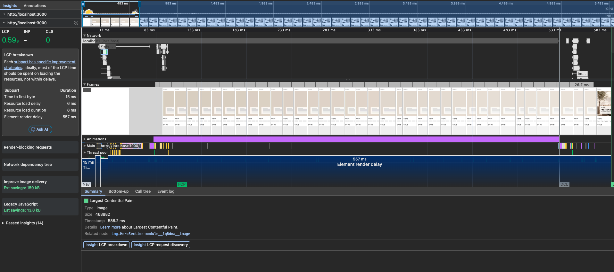
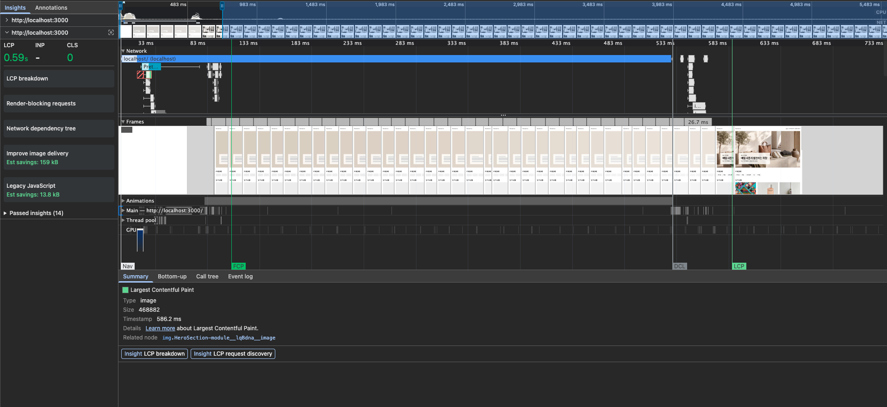
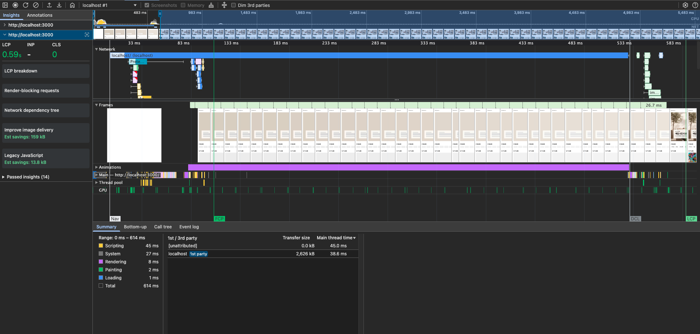

### 그런데 LCP는 나빠졌다

| 지표       | 개입 1+2  | 후보 2 적용   |
| ---------- | --------- | ------------- |
| FCP 중앙값 | 352.8ms   | 351.0ms       |
| LCP 중앙값 | 2,370.2ms | **2,448.1ms** |
| CLS        | 0         | 0             |
| score      | 88        | 87            |

Lighthouse LCP가 +77.9ms 늘었다. 두 측정의 범위가 겹치지 않는다(개입 1+2는 2,308.3–2,390.2, 후보 2는 2,431.1–2,448.9).

원인은 대역폭 경쟁이다. preload가 Hero를 폰트와 같은 시점·우선순위로 끌어올렸다.

```
23.5ms   2,057,992 B   PretendardVariable.woff2   (High)
23.9ms     179,296 B   hero-1200.webp             (High)
```

`simulate`의 10,240Kbps 모델에서 둘이 대역폭을 나눠 쓰므로 문서·CSS·JS 전달이 뒤로 밀린다. 반면 Hero를 일찍 받아도 이득이 없다. 실측에서 29.5ms에 전송을 마치고도 586.2ms까지 그리지 못했다 — `` 태그가 Suspense 안에 있어 홈 데이터를 기다리는 HTML이 528.8ms에 도착해야 DOM에 생기기 때문이다.

**즉 필요하지 않은 시점에 리소스를 먼저 받느라 정작 필요한 문서 전달이 늦어졌다.** localhost 실측에서는 대역폭이 사실상 무제한이라 이 손해가 드러나지 않았고 `simulate`에서만 보였다.

### 판단

되돌린다. 근거는 둘이다.

- 의도한 구간(`Resource load delay` 514ms)은 정확히 제거했지만 그 구간이 실제 병목이 아니었다. 병목은 `Element render delay` 557ms이고 이는 HTML 도착을 기다리는 시간이다.
- 같은 조건에서 Lighthouse LCP가 측정 흔들림을 넘어 악화됐다.

**후보 2를 1순위로 고른 판단 자체가 틀렸다.** 실측 514ms가 전체의 78%라는 비중만 보고 순위를 정했는데, localhost는 전송이 거의 공짜라 대기 구간이 상대적으로 커 보였을 뿐이다. 비중은 측정 환경의 성질을 반영하므로 그것만으로 개입 순서를 정하면 안 된다.

다음 개입에서 ``가 첫 flush에 들어가면 브라우저가 스스로 일찍 발견하므로 preload는 중복 힌트가 된다. 다시 넣지 않는다.

## 개입 4 — Hero의 이미지와 카피를 분리한다

개입 3에서 드러난 `Element render delay` 557ms를 겨냥한다. 이 구간은 `` 태그가 담긴 HTML이 도착하기를 기다리는 시간이다.

Hero 안에서 데이터 소유권이 갈린다. ``의 `src`는 정적 경로라 홈 응답과 무관하고, 카피(`banner.title`·`banner.description`)만 응답에 딸려 있다. 그래서 껍데기와 이미지를 shell로 올리고 카피만 스트리밍한다.

```
<section class="hero">          ← shell (첫 flush)
              ← shell (첫 flush)
  <Suspense fallback={카피 스켈레톤}>
    <HeroCopy />                ← 홈 데이터 대기
  </Suspense>
</section>
```

`.copy`는 `.hero` 안에서 `position: absolute`이고 `.hero`는 `aspect-ratio: 16/9`로 높이가 고정이다. 따라서 카피가 교체돼도 아래 콘텐츠가 밀리지 않는다.

`HeroCopy`는 Server Component로 두어 `fetchQuery`로 직접 읽는다. 클라이언트 번들과 hydration이 필요 없다.

### Suspense 경계가 둘인데 요청은 1회다

`HeroCopy`와 `HomeData`가 각각 조회해도 `/api/home` 요청은 1회다. 측정 당시에는 `getServerQueryClient`가 React `cache()`로 감싸져 있어 요청 단위로 같은 QueryClient를 공유하는 것을 원인으로 적었다. **Step 6에서 이 근거가 틀린 것으로 확인됐다.**

Step 6 서버 호출 계수에서 `cache()`를 뗀 채로 같은 측정을 반복했더니 `/api/home`은 그대로 1회였다.

| 조건           | `/api/home` | `/api/products` |
| -------------- | ----------- | --------------- |
| `cache()` 유지 | 1회         | 1회             |
| `cache()` 제거 | 1회         | 1회             |

요청을 합치던 것은 QueryClient 공유가 아니라 Next의 **request memoization**이다. 같은 render 안에서 URL과 options가 같은 native `fetch`는 실제로 한 번만 나간다. `generateMetadata`·`HomeData`·`HeroCopy`가 모두 같은 `${getApiBaseUrl()}/api/home`을 옵션 없이 호출하므로 세 호출이 하나로 합쳐진다. 이 memoization은 Data Cache(`fetch`의 `cache` 옵션, Next 15부터 기본 `no-store`)와 다른 층이라 캐시를 끈 상태에서도 동작한다.

`/api/products`의 1회는 이 판단의 근거가 되지 못한다. 상품 목록은 홈과 달리 서버 prefetch가 없고 `ProductListContent`가 클라이언트에서 조회하므로, 서버 호출은 `generateMetadata` 하나뿐이라 `cache()` 유무와 무관하게 1회다.

명세 141줄은 서버에서 `getQueryClient()`를 호출할 때마다 새 QueryClient를 만들라고 요구한다. 요청 손실이 0이므로 `cache()`를 제거해 명세 문구를 그대로 따르기로 했다. 두 해석은 [plan.md의 "판단이 갈렸던 것"](plan.md#판단이-갈렸던-것--getserverqueryclient의-cache)에 정리해 두었고, 실측으로 논쟁이 필요 없어진 경우다.

### 반증 기준과 결과

측정 전에 정한 기준은 "실측 LCP가 250ms 이상이면 가설이 틀린 것"이었다. 예상 범위는 110~190ms였다(FCP 하한 106ms + `Element render delay` 상한 83ms).

| 구간                     | 개입 3(preload) | **개입 4**  |
| ------------------------ | --------------- | ----------- |
| Time to first byte       | 15ms            | 18ms        |
| Resource load delay      | 6ms             | 5ms         |
| Resource load duration   | 8ms             | 9ms         |
| **Element render delay** | **557ms**       | **92ms**    |
| **실측 LCP**             | 586.2ms         | **123.2ms** |

**반증되지 않았다.** 예상 범위 안에 들어왔다.

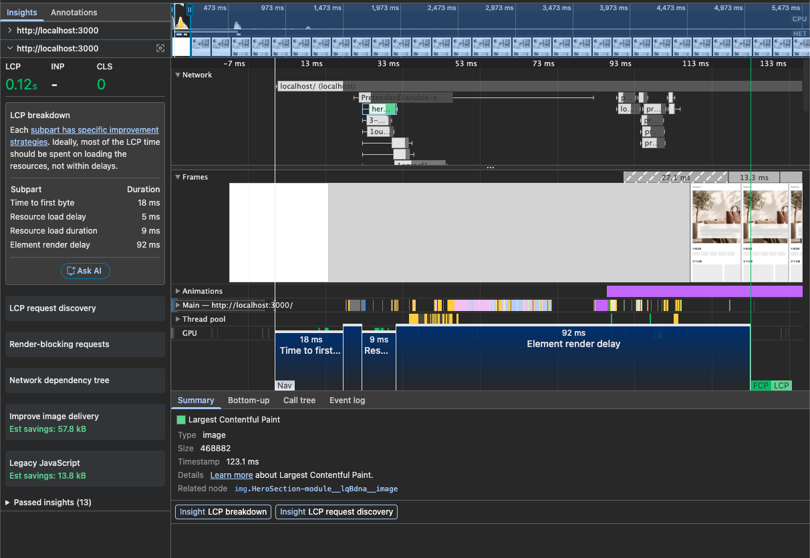

실측 LCP가 FCP와 같은 123.2ms다. 첫 페인트 순간에 Hero 이미지가 이미 최대 요소로 잡혔고 LCP element도 여전히 `img.HeroSection-module__lqBdna__image`다. 구조적으로 더 앞당길 여지가 없다.

`LayoutShift` 이벤트 0건, CLS 0을 유지한다. 초기 HTML에서 ``는 전체 47,732 byte 중 2,175 byte 지점에 있고 바로 뒤가 `<!--$?-->` Suspense 대기 마커다. `<h1>`은 1개다.

### Network waterfall — Before와 같은 방식으로 비교

`hero-split-home-record.json`의 `ResourceSendRequest` / `ResourceFinish`를 `navigationStart` 기준으로 정렬했다.

| 시작    | 종료    | 크기          | 리소스                              |
| ------- | ------- | ------------- | ----------------------------------- |
| 20.1ms  | 535.2ms | 9.9KB         | document `/`                        |
| 20.5ms  | 82.7ms  | **2,009.8KB** | `PretendardVariable.woff2`          |
| 22.7ms  | 31.8ms  | **175.1KB**   | `/images/week-07/hero-1200.webp`    |
| 22.7ms  | 96.6ms  | 4.5KB         | CSS 청크 4개(병렬)                  |
| 22.8ms  | 105.1ms | 193.6KB       | JS 청크 12개(병렬)                  |
| 88.4ms  | 567.5ms | 8.7KB         | `/products?...&_rsc=` prefetch 11건 |
| 542.8ms | 547.7ms | 25.6KB        | `favicon.ico`                       |
| 546.8ms | 565.3ms | 136.1KB       | `/_next/image` 상품 카드 9장        |

Before와 비교하면 Hero 항목이 세 가지 다 바뀌었다.

| 항목      | Before                     | 개입 4                   |
| --------- | -------------------------- | ------------------------ |
| 요청 시작 | 532.8ms                    | **22.7ms**               |
| 전송 크기 | 7,368.7KB                  | **175.1KB**              |
| 요청 순서 | document 종료 직전(6번째)  | **document 직후(3번째)** |
| 파일      | `hero-original.jpg` 3840px | `hero-1200.webp` 1200px  |

Before에서 Hero는 document가 끝나야 발견됐고, 그 앞 500ms 동안 네트워크는 폰트·청크를 다 받고 놀고 있었다. 지금은 document·폰트와 함께 출발해 31.8ms에 끝난다.

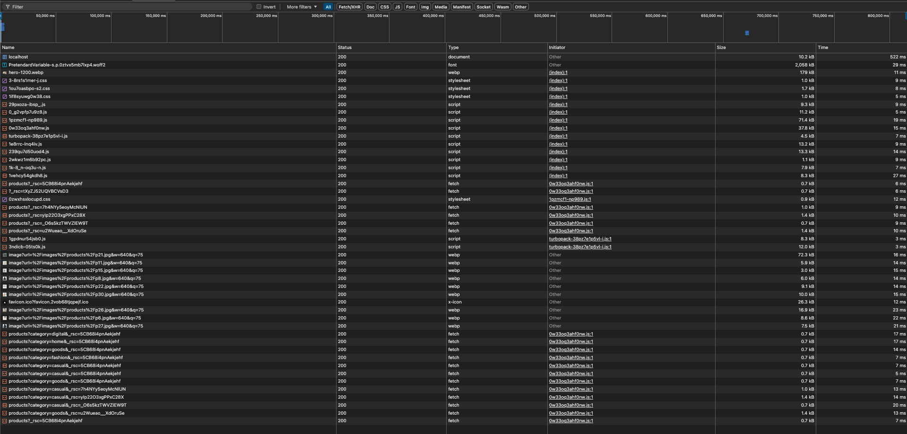

Network 패널에서 세 가지가 함께 확인된다. Hero가 document·폰트 다음 **3번째**로 출발하고, `Initiator`가 `(index):1`이라 초기 HTML에서 발견됐으며, 폰트 2,058kB가 Hero 179kB를 압도한다.

같은 캡처에서 `0zwxhsxlocupd.css`(상품 목록 CSS)의 `Initiator`가 `1pzmcf1-np989.js:1`이고 `products?_rsc=` 요청들 바로 뒤에 있다. 개입 1의 FCP 부작용에서 세운 인과 사슬 — prefetch가 다른 라우트의 스타일시트를 끌어온다 — 이 여기서도 확인된다.

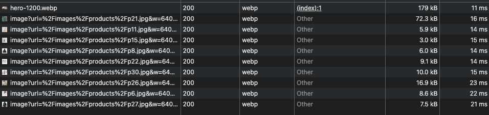

이미지만 걸러 보면 Hero 179kB와 상품 카드 9장(3.0~72.3kB)이 모두 `webp`다. Before에서는 카드만 `/_next/image`로 최적화되고 Hero만 원본 ``로 예외였는데, 그 불일치가 해소됐다.

`priority`는 `Low`다. ``에 `fetchpriority`를 주지 않았으므로 브라우저 기본값이다. 개입 3에서 preload로 `High`를 준 적이 있으나 되돌렸고, 태그가 첫 flush에 있으면 `Low`로도 31.8ms에 완료되므로 다시 올릴 이유가 없다.

초기 HTML의 `<head>`에는 preload 힌트가 남아 있는데, 이것은 우리가 넣은 것이 아니다. ``가 첫 flush에 들어가자 Next가 자동으로 붙였다.

```html
<link
  rel="preload"
  as="image"
  imagesrcset="/images/week-07/hero-1200.webp 1200w, /images/week-07/hero-2400.webp 2400w"
  imagesizes="(max-width: 1232px) calc(100vw - 32px), 1200px"
/>
```

개입 3에서 `ReactDOM.preload()`로 직접 만들려 했던 힌트와 같은 내용이다. **태그를 올바른 위치에 두면 프레임워크가 알아서 만든다**는 뜻이고, 개입 3을 되돌린 판단을 뒷받침한다.

`/api/home`은 여전히 waterfall에 없다. 홈 데이터는 서버에서 RSC로 조회하므로 브라우저 요청으로 나타나지 않고, 지연은 document `/`의 20.1~535.2ms 안에 들어 있다.

### 사용자가 보는 화면

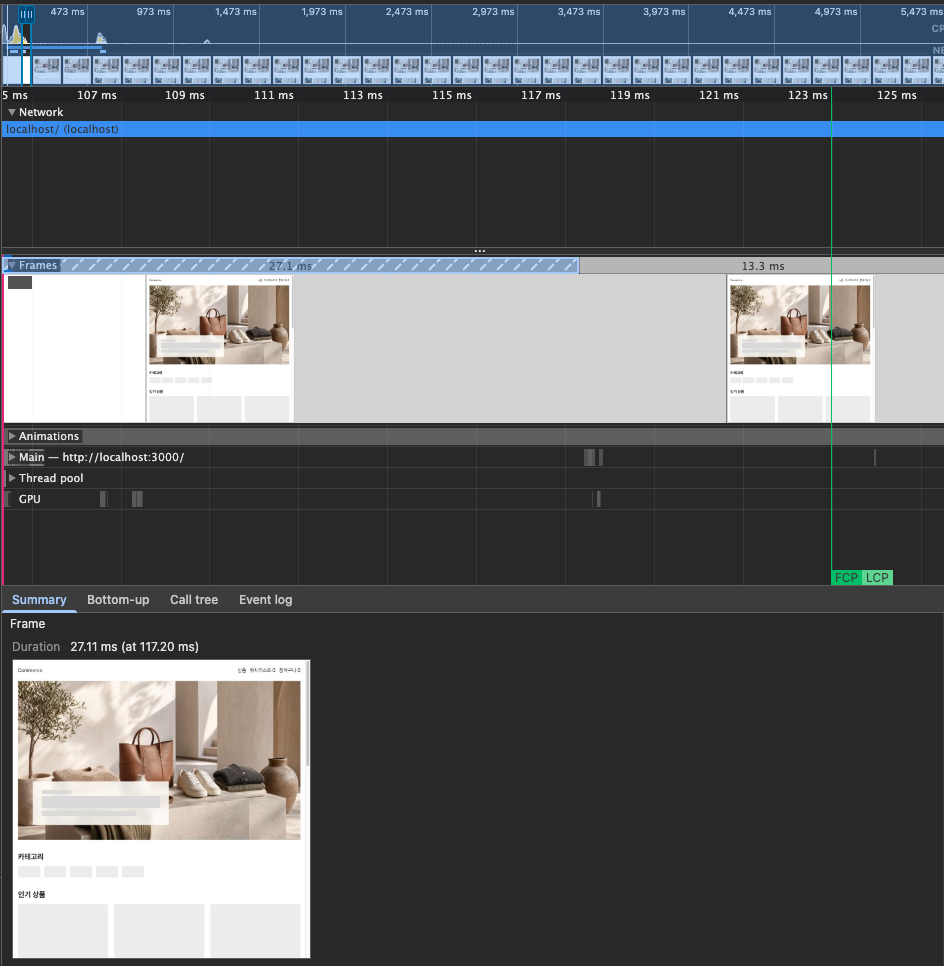
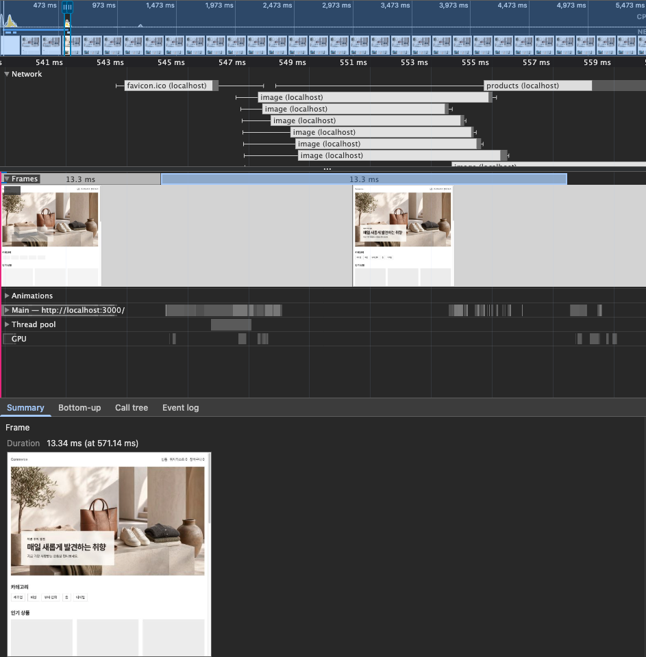

117.2ms에 사진이 전부 보이고 그 위 카피 카드만 회색 막대다. 571.1ms에 같은 자리에 문구가 채워진다. 두 프레임에서 사진과 카드의 위치·크기가 동일하다.

Before는 이 구간에 베이지 단색 박스를 보여줬다. **빈 박스를 0.5초 보는 것보다 사진을 먼저 보여주고 문구만 채우는 쪽이 낫다고 판단했다.** CLS 수치로는 두 경우가 모두 0이라 구분되지 않으므로 filmstrip을 근거로 남긴다.

배너가 API에서 오는 슬라이드로 바뀌면 이미지 URL이 데이터가 되므로 이 분리는 성립하지 않는다. 그때는 `preconnect`가 대안이 된다.

### 뒤늦게 발견한 손실 — 접근성 이름이 끊겼다

`HeroSection`은 starter부터 `aria-labelledby="hero-title"`로 카피의 `h2`를 섹션 이름으로 썼다. 이 개입이 카피를 `Suspense` 뒤로 보내면서 **첫 flush의 `<section>`에는 참조할 `id`가 없는 상태**가 됐다. starter에서는 `h2`가 같은 렌더에 있어 생기지 않던 문제다.

LCP·CLS 수치에는 나타나지 않는다. 이름 없는 `<section>`은 landmark로 노출되지 않을 뿐 레이아웃도 페인트도 바꾸지 않아서, 이 절의 어떤 측정에도 잡히지 않았다. 명세 2단계까지 끝낸 뒤 코드와 명세를 다시 대조하다 찾았다.

이미지와 카피를 데이터 소유권으로 가른 것과 같은 이유로 섹션 이름도 데이터에서 뗐다 — `aria-label="추천 배너"` 정적 문자열이다. 같은 대조에서 페이지 설명이 첫 flush에 없다는 것도 함께 찾아 `HomePage`에 시각 숨김 설명을 넣었다. 두 변경 다 렌더 결과를 바꾸지 않으므로 위 측정값은 그대로 유효하다.

### Lighthouse는 거의 움직이지 않았다

| 지표       | 개입 1+2  | 개입 4    |
| ---------- | --------- | --------- |
| FCP 중앙값 | 352.8ms   | 352.2ms   |
| LCP 중앙값 | 2,370.2ms | 2,307.6ms |
| CLS        | 0         | 0         |
| score      | 88        | 88        |

−62.6ms지만 범위가 겹친다(2,308.3–2,390.2 vs 2,288.0–2,310.1). **개선이라고 주장하지 않는다.**

실측은 −463ms인데 `simulate`는 −62.6ms다. 두 측정이 서로 다른 병목을 보고 있기 때문이다. 실측의 병목은 렌더 대기였고 개입 4가 그것을 제거했다. `simulate`의 병목은 전송량이고 그것은 개입 2가 이미 처리했다.

## 개입 요약과 다음 병목

| 개입                     | 실측 LCP    | Lighthouse LCP | 상태                       |
| ------------------------ | ----------- | -------------- | -------------------------- |
| Before `3da2db4`         | 662.1ms     | 8,289.6ms      | —                          |
| 1. 렌더링 경계 분리      | 638.9ms     | 8,290.2ms      | 유지(FCP −101ms 손실 기록) |
| 2. Hero 이미지 축소      | —           | **2,370.2ms**  | 유지                       |
| 3. preload               | 586.2ms     | 2,448.1ms      | **되돌림**                 |
| 4. Hero 이미지·카피 분리 | **123.2ms** | 2,307.6ms      | 유지                       |

**다음 병목은 폰트다.** 개입 4 시점의 전송 구성은 이렇다.

| 자산                         | 크기            | 비중      |
| ---------------------------- | --------------- | --------- |
| `PretendardVariable.woff2`   | **2,057,992 B** | **78.4%** |
| `hero-1200.webp`             | 179,296 B       | 6.8%      |
| `/_next/image` 상품 카드 9장 | 139,416 B       | 5.3%      |
| 나머지                       | 248,924 B       | 9.5%      |
| **총계**                     | **2,625,628 B** |           |

Before에서는 Hero 7.5MB에 가려 보이지 않던 항목이다. `simulate`의 10,240Kbps 모델에서 폰트 2MB는 약 1.6초에 해당하고, 남은 LCP 2,307.6ms의 상당 부분이 여기 있을 가능성이 크다.

**이번 주에는 개입하지 않는다.** 명세 1단계는 Hero 이미지의 LCP 병목을 다루고 폰트는 범위에 없다. 관찰 사실만 남기고, 손대려면 subset 범위·`font-display`·variable font의 weight 축 범위를 함께 봐야 한다는 것을 다음 작업의 시작점으로 기록한다.

## 상품 목록 — Before 측정 조건

홈과 달리 Lighthouse 5회가 아니라 **Performance 녹화**가 증거다. 명세 0단계는 `/api/products?scenario=slow`에서 (a) 데이터 없는 최초 진입과 (b) 기존 목록이 있는 갱신을 각각 녹화하라고 요구한다.

| 항목              | 값                                           |
| ----------------- | -------------------------------------------- |
| SHA               | `342e857` + slow API 재현용 임시 패치 (아래) |
| 실행 방식         | `pnpm build` 후 `pnpm start`                 |
| 측정 도구         | Performance 패널 `Record` (Lighthouse 아님)  |
| Network 패널      | No throttling, Disable cache                 |
| 브라우저 / 프로필 | Chrome 150, 시크릿 창                        |
| 측정 일시         | 2026-08-05 00:02 KST                         |

**홈 Before(`3da2db4`)와 코드가 같다.** `342e857`은 `3da2db4` 바로 위의 docs 전용 커밋이고 `git diff 3da2db4 342e857 -- . ':!docs'`가 비어 있다. Before가 SHA 두 개로 나뉜 것은 측정 날짜가 달라서지 측정 대상이 달라서가 아니다.

### slow API 재현 — 임시 패치

이 레포는 `scenario`를 화면에서 API로 전달하지 않는다. `src/_pages/home/api/model.ts`에 "scenario는 mock 검증 전용이라 클라이언트에서 보내지 않는다"고 명시한 기존 설계 결정이다. 그래서 명세가 요구한 slow API(1.5초)를 화면 조작만으로는 재현할 수 없다.

측정 동안만 요청에 `scenario=slow`를 붙인다. **커밋하지 않고 녹화가 끝나면 되돌린다.**

```ts
// src/entities/product/api/api.ts
- response = await fetch(`/api/products${query}`)
+ response = await fetch(`/api/products${query}&scenario=slow`)
```

mock의 기본 지연을 1.5초로 올리는 방법도 대기 시간은 같지만, 요청 URL에 `scenario=slow`가 찍히지 않아 "slow 조건에서 측정했다"를 Network 증거로 입증할 수 없다. 명세 체크리스트가 API의 **URL**을 확인하라고 요구하므로 URL에 남는 쪽을 골랐다.

`src/entities/product/api/api.test.ts:25`가 요청 URL을 단언하므로 이 패치가 있는 동안 `pnpm test`는 실패한다. **이 실패가 되돌리기를 잊지 않게 하는 신호다.** 되돌린 뒤 통과를 확인한다.

### 녹화 시나리오

각 시나리오를 따로 녹화하고 `docs/week-07/`에 트레이스를 내보낸다(파일명은 아래 표 기준).

| #   | 시나리오              | 조작                                                             | 트레이스 파일                                                           |
| --- | --------------------- | ---------------------------------------------------------------- | ----------------------------------------------------------------------- |
| 1   | 데이터 없는 최초 진입 | `Record and reload`로 `/products` 진입                           | `before-products-initial.json`                                          |
| 2   | 기존 목록이 있는 갱신 | 목록이 보이는 상태에서 카테고리 1회 변경                         | `before-products-refetch.json`                                          |
| 3   | 성공 + 0건            | 결과가 없는 검색어 입력                                          | `before-products-empty.json`                                            |
| 4   | 최초 실패 / 갱신 실패 | 에러 응답 상태에서 최초 진입과 갱신을 각각                       | `before-products-init-error.json`, `before-products-refetch-error.json` |
| 5   | 취소 + 빠른 연속 변경 | 카테고리·정렬·페이지를 1초 안에 4회 연속 변경 후 URL과 화면 대조 | `before-products-race.json`                                             |

트레이스를 저장해두면 filmstrip 프레임과 요청 시작 시점을 홈과 같은 방식으로 표에 옮길 수 있다.

### 화면 조작 절차

`/products`의 조작 지점은 셋이다. 검색 `input`(300ms debounce), 카테고리 `select`(전체·캐주얼·패션·뷰티·잡화·홈·디지털), 정렬 `select`(최신순·인기순·낮은 가격순·높은 가격순). 하단에 페이지네이션이 있다.

기록할 화면은 이렇게 구분된다.

| 화면         | 눈으로 확인할 것                                       |
| ------------ | ------------------------------------------------------ |
| 최초 pending | 카드 자리를 잡은 skeleton 12개                         |
| 갱신 중      | 기존 목록이 남은 채 흐려짐(`opacity 0.6`, `aria-busy`) |
| 0건          | "검색 결과가 없습니다."                                |
| 실패         | "상품 목록을 불러오지 못했어요." + `다시 시도` 버튼    |

**1. 데이터 없는 최초 진입** — Performance 패널에서 `Record and reload`(⌘⇧E)로 `/products` 진입. skeleton → 목록 전환까지 녹화.

**2. 기존 목록이 있는 갱신** — 목록이 다 보이는 상태에서 `Record`(⌘E) 시작 → 카테고리를 "전체"에서 "디지털"로 1회 변경 → 새 목록이 뜨면 정지. 이 1.5초 동안 **기존 목록이 지워지지 않고 흐려지기만 하는지**가 관찰 대상이다.

**3. 성공 + 0건** — `Record` 시작 → 검색창에 `zzzz`처럼 결과가 없을 문자열 입력 → "검색 결과가 없습니다."가 뜨면 정지. debounce 300ms가 있으니 입력 후 잠깐 기다린다.

**4. 최초 실패 / 갱신 실패** — Network 패널 우클릭 → `Block request URL` → 패턴에 `*/api/products*` 추가.

- 최초 실패: 차단을 켠 채 `Record and reload`
- 갱신 실패: 차단을 끈 상태로 목록을 띄우고 → 차단을 켠 뒤 → `Record` 시작 → 카테고리 1회 변경

두 화면이 달라야 한다. 최초 실패는 목록 자리에 에러가 오고, 갱신 실패는 **기존 목록이 남은 채** 에러가 붙어야 한다. 녹화가 끝나면 차단 패턴을 지운다.

**5. 취소 + 빠른 연속 변경** — `Record` 시작 → 1.5초 안에 카테고리를 4번 연속으로 바꾼다(캐주얼 → 패션 → 홈 → 디지털) → 마지막 응답이 올 때까지 두고 정지.

> 실제로는 드롭다운을 순서대로 훑느라 5번(캐주얼→잡화→패션→홈→디지털) 바뀌었고 처음~마지막 요청 간격도 1.5초가 아니라 약 4.8초였다. "이전 요청이 끝나기 전에 다음 요청이 나간다"는 핵심 조건은 유지됐다고 판단해 재녹화하지 않았다 — 근거는 [5번 측정 결과](#5-빠른-연속-변경--측정-결과-이번-측정의-핵심) 참고.

정지 후 **주소창의 `category=digital`과 화면의 목록이 일치하는지** 확인한다. 먼저 보낸 요청이 늦게 도착해 화면을 덮으면 그게 관찰 결과다. Network에서 앞선 3건이 `(canceled)`인지 완료인지도 함께 본다.

3·4번은 `scenario=slow` 패치와 무관하게 재현되지만, 패치가 켜져 있으면 1.5초 지연이 함께 걸린다.

**녹화가 모두 끝나면 위 임시 패치를 되돌리고 `pnpm test` 통과를 확인한다.**

### 1. 데이터 없는 최초 진입 — 측정 결과

| 항목                | 값                                                                     |
| ------------------- | ---------------------------------------------------------------------- |
| API 요청            | `/api/products?q=&category=all&…&page=1&pageSize=12&scenario=slow`     |
| API Duration        | **1.51s** (Request sent and waiting 1.50s, Content downloading 0.29ms) |
| FCP                 | **108.1ms** (약 130ms filmstrip에서 skeleton 12개 확인)                |
| LCP                 | **1,628.6ms** — `img.ProductCard-module__KaYlzG__image`, Type `image`  |
| LCP 이미지          | `/_next/image` 16.5KB, earliest start 기준 1,580ms 뒤 로드             |
| CLS                 | **0**                                                                  |
| Main thread 총 작업 | 45.1ms (전체 1,695ms 중)                                               |
| 전송 합계           | 2,445KB                                                                |

**요청 URL에 `scenario=slow`가 찍혔고 서버 대기가 1.50s다.** 요청은 navigationStart 후 66.2ms에 시작해 1,572.3ms에 끝났고, 응답 헤더 대기는 1,505.1ms, 다운로드는 약 0.3ms였다. 임시 패치가 의도대로 동작했고, 이 바는 document가 아니라 XHR이다. `/products` document 자체는 앞쪽에서 빠르게 끝난다.

LCP 후보는 `h1`(108.1ms) → 상품 영역 `h2`(1,615.3ms) → 상품 카드 이미지(1,628.6ms) 순으로 바뀌었다. 최종 LCP 이미지의 발견 시점은 1,588.8ms, 로드 종료는 1,596.1ms다. 즉 이미지 전송 자체보다 API 응답 뒤에야 카드 DOM과 이미지 요청이 생기는 구조가 LCP 시점을 결정한다.

관찰 결과는 세 가지다.

- **skeleton은 이미 요구를 만족한다.** FCP는 108.1ms이고 약 130ms filmstrip에서 카드 12개 자리가 확인된다. 1.5초 뒤 실제 목록으로 바뀔 때도 **CLS가 0**이다. "실제 목록 크기를 예상할 수 있는 pending UI"가 이미 있다.
- **기다림은 전부 서버 지연이다.** 1,695ms 중 메인스레드 작업이 45.1ms고 중간 구간이 통째로 비어 있다. 클라이언트에서 줄일 여지가 없는 대기이며, 명세는 이 1.5초를 줄이지 말라고 명시한다.
- **`LCP request discovery` 3개 항목이 모두 실패한다.** `fetchpriority=high` 미적용, 초기 document에서 발견 불가, `loading=lazy` 사용. 홈은 `fetchpriority` 하나만 실패했는데 여기는 셋 다다.

마지막 항목은 **개입 대상이 아니다.** 상품 카드 이미지는 1.5초짜리 클라이언트 쿼리가 끝난 뒤에 렌더되므로 초기 HTML에 존재할 수 없고, 이는 데이터 조회 전략의 결과지 이미지 속성의 문제가 아니다. `loading=lazy`를 떼거나 `fetchpriority`를 올려도 LCP는 API 응답 시점 아래로 내려가지 않는다. 반증하려면 속성만 바꾼 뒤 LCP가 1.63s보다 유의미하게 줄어드는지 보면 된다.

### 2. 기존 목록이 있는 갱신 — 측정 결과

`before-products-refetch.json`에서 카테고리 `select`의 `change` 이벤트를 기준(t=0)으로 잡았다. 이 시나리오는 navigation이 없어 `navigationStart`가 없다.

| 항목                | 값                                                                                        |
| ------------------- | ----------------------------------------------------------------------------------------- |
| 조작                | 카테고리 `select` "전체" → "디지털" 1회                                                   |
| API 요청            | `/api/products?q=&category=digital&sort=latest&page=1&pageSize=12&scenario=slow`          |
| change → fetch 시작 | 약 3ms(거의 즉시)                                                                         |
| API Duration        | **1,516.8ms** (`ResourceSendRequest` → `ResourceFinish`, change 이벤트로부터는 1,519.8ms) |
| 전송량              | encoded 2,287B / decoded 2,025B                                                           |
| CLS                 | **0.37**                                                                                  |
| INP                 | 45ms                                                                                      |
| Layout shift        | 1건, 응답 완료 약 3.7ms 뒤(t≈1,523.5ms)                                                   |

Performance 패널 Insights 요약에서 CLS 0.37, `Improve image delivery`(Est savings 68.4kB)가 확인된다. 이 스크린샷에서 읽을 수 있는 건 숫자와 요청 타이밍(Network `products` 바가 7,000~8,600ms대, 그 직후 Layout shifts 마커)까지다.


`Layout shift culprits`를 펼치면 두 가지가 더 보인다.

- **Layout shifts 다이아몬드가 Animations 트랙의 `opacity` 구간과 같은 지점(≈8,280ms, "Worst cluster: Layout shift cluster @ 8.28s")에서 겹친다.** 목록에 걸었던 `opacity 0.6 → 1` 전환이 끝나는 순간과 레이아웃 시프트가 동시에 일어난다 — 흐림을 걷어내며 새 데이터로 교체하는 시점에 카드 크기가 같이 바뀐다는 뜻이다.
- **DevTools 자체가 "Could not detect any layout shift culprits"라고 표시한다.** 자동 분석은 원인 노드를 짚지 못했고, `node_id 418`이 `old_rect` 높이 142px → `new_rect` 높이 453px로 튀었다는 근거는 화면이 아니라 트레이스 JSON(`LayoutShift` 이벤트의 `impacted_nodes`)을 직접 읽어서 나온 것이다.

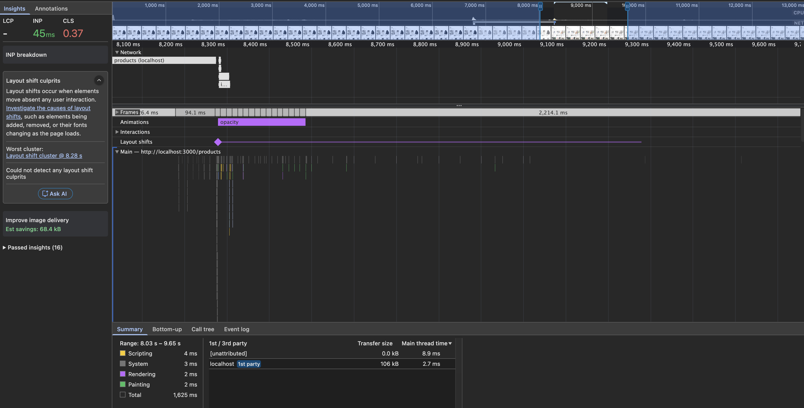

**filmstrip은 t=0~200ms까지만 프레임이 있고 이후 t≈1,434ms까지 새 프레임이 없다.** 약 1.2초 동안 화면에 변화가 없었다는 뜻이라 "기존 목록이 남은 채 흐려지기만 한다"는 기대와는 일단 부합한다.

다만 1,434ms에 프레임이 재개되는 시점은 응답 완료(change 기준 1,519.8ms)보다 **약 85ms 이르다.** 이 85ms 동안 뭐가 다시 그려졌는지는 이 트레이스만으로 특정하지 못했다 — Layout shift는 여전히 응답 완료 이후(1,523.5ms)에 일어나므로 "응답 도착 직후 카드가 튄다"는 결론 자체는 유효하지만, 1,434ms의 프레임 재개 원인은 미확인으로 남겨둔다.

**LayoutShift 이벤트(`had_recent_input: false`, score 0.367)의 `impacted_nodes`를 보면 `ProductCard` 카드 하나(`node_id 418`)가 `old_rect [16, 787, 291, 142]` → `new_rect [16, 285, 291, 453]`로 이동한다.** 같은 노드가 높이 142px에서 453px(실제 카드 높이)로, y좌표도 787→285로 크게 움직였다. 나머지 impacted node(카드 하나, `actions`, `H2`)는 `old_rect [0,0,0,0]`으로 이전에 레이아웃에 없던 새 요소다.

- **6상태 표의 "이전 데이터가 있는 갱신"은 충족되지 않는다.** 명세가 기대하는 "기존 목록 유지 + `opacity 0.6` + `aria-busy`"는 화면이 멈춰 있는 구간(0~1,434ms)에서는 맞지만, 새 데이터가 그려지는 순간 카드 레이아웃이 튀며 CLS 0.37을 만든다. CLS 0이었던 최초 진입과 다른 결과다.
- **원인은 이 시점에 가설 단계였다.** `old_rect` 높이 142px가 정상 카드 높이(453px)와 달라서, 갱신 중 그리드가 다른 중간 상태를 거쳤을 가능성을 의심했다. 뒤의 "[6. CLS 0.37의 원인 — 반증 실험](#6-cls-037의-원인--반증-실험)"에서 **이 의심이 틀렸음이 드러난다.** 카드 높이는 항상 453px이고 142px은 뷰포트 클리핑이었다. (5번 시나리오에서 정확히 같은 `score`로 재현되는 것도 그쪽에서 설명된다.)

### 3. 성공 + 0건 — 측정 결과

이 녹화는 직전 시나리오(카테고리=디지털)에 이어서 검색창에 `zzz` → `zzzz`를 입력한 상태다. `before-products-empty.json`의 첫 filmstrip 프레임(`ts=35915880583`)을 t=0 기준으로 잡았다.

| 항목         | 값                                                                                   |
| ------------ | ------------------------------------------------------------------------------------ |
| 입력         | 검색창에 `zzz` 입력 후 잠깐 멈춤 → `z` 한 글자 더 입력해 `zzzz`                      |
| API 요청 1   | `/api/products?q=zzz&category=digital&sort=latest&page=1&pageSize=12&scenario=slow`  |
| API 요청 2   | `/api/products?q=zzzz&category=digital&sort=latest&page=1&pageSize=12&scenario=slow` |
| 요청 시작    | 1번 t≈2,753ms, 2번 t≈3,238ms (간격 484ms)                                            |
| API Duration | 1번 1,509.4ms, 2번 1,509.2ms                                                         |
| 응답 완료    | 1번 t≈4,263ms, 2번 t≈4,747ms (2번이 나중에 시작해 나중에 끝남 — 순서 뒤집히지 않음)  |
| CLS          | **0.00**                                                                             |
| INP          | 43ms (Input delay 3ms + Processing 0ms + Presentation delay 40ms)                    |

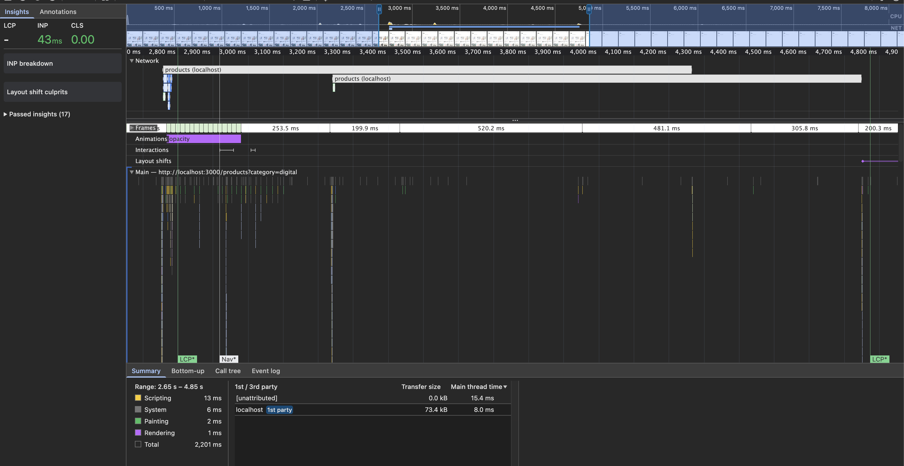


키 입력 이벤트를 debounce 타이밍과 맞춰보면 둘 다 정상 300ms debounce로 설명된다.

- `zzz`의 마지막 입력은 요청 1 시작 304ms 전이고, `zzzz`로 이어지는 4번째 입력은 요청 1이 이미 나간 뒤(181ms 뒤) 들어왔다. 그 입력으로부터 다시 304ms 뒤에 요청 2가 나갔다.
- **즉 이번 케이스는 debounce가 실패한 게 아니라, 사용자가 300ms보다 길게 끊어 쳐서 debounce 창이 두 번 만들어진 것이다.** 요청이 취소되지 않고 둘 다 200으로 끝났지만 순서가 뒤집히지 않아(1번이 먼저 끝나고 2번이 나중에 끝남) 화면에는 마지막 요청(`zzzz`) 결과만 남는다.
- 진짜 취소·경쟁 상태 검증은 5번(1.5초 안에 4회 연속 변경) 몫이다. 여기서는 debounce 자체가 스펙대로 동작하는지만 확인된다.
- CLS 0, "검색 결과가 없습니다."로 전환될 때도 레이아웃 시프트가 없다 — 2번 시나리오의 카드 크기 점프와 달리, 빈 상태 전환은 별도 개입 없이 통과한다.

### 4. 최초 실패 / 갱신 실패 — 측정 결과

`Network request blocking`(새 Chrome은 `Request conditions`) 패턴은 `*/api/products*`가 URLPattern 파싱에 실패해서 `http://localhost:3000/api/products*`로 바꿔 적용했다. 두 트레이스(`before-products-init-error.json`, `before-products-refetch-error.json`) 모두 `/api/products` 요청 자체가 `ResourceSendRequest` 이벤트로 남지 않는다 — DevTools가 CDP 레벨에서 요청을 만들기 전에 끊기 때문에 Network 패널에도, 트레이스에도 안 잡히고 `fetch()`만 reject된다.

| 항목                      | 최초 실패                                 | 갱신 실패                                          |
| ------------------------- | ----------------------------------------- | -------------------------------------------------- |
| 조작                      | 차단 켠 채 `/products` 최초 진입          | 목록 로드 후 차단 켬 → 카테고리 "전체"→"잡화" 변경 |
| URL                       | `localhost:3000/products`                 | `localhost:3000/products?category=goods`           |
| LCP                       | **0.10s** — `H1`(4,522 size, "상품 목록") | -                                                  |
| INP                       | -                                         | 30ms                                               |
| CLS                       | 0                                         | 0.00                                               |
| `/api/products` 요청 흔적 | 트레이스에 없음(차단)                     | 트레이스에 없음(차단)                              |


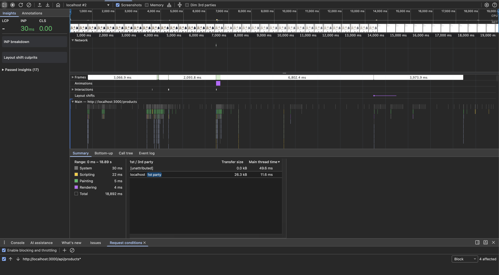


관찰 결과는 계획 문서의 기대와 다르다.

- **"두 화면이 달라야 한다"는 기대가 반증됐다.** 최초 실패 화면과 갱신 실패 화면이 **똑같다.** 둘 다 목록 자리에 "상품 목록을 불러오지 못했어요." + `다시 시도` 버튼만 있고, 갱신 실패 쪽에도 이전에 떠 있던 카드 12개가 하나도 안 남아 있다. 명세가 요구하는 "갱신 실패는 기존 목록이 남은 채 에러가 붙는다"를 **충족하지 못한다.**
- **부가로 발견한 것 — 카테고리 select가 URL과 어긋난다.** 갱신 실패 화면의 주소창은 `category=goods`인데 카테고리 `select`는 "전체"를 보여준다. 쿼리 실패 시 화면이 초기화되면서 선택값도 함께 날아간 것으로 보인다. 6상태 표와는 별개로 원인 후보에 추가해야 한다.
- LCP가 0.10s로 아주 빠른 건 개입 결과가 아니라 **네트워크 실패라 기다릴 대상 자체가 없었기 때문**이다(`H1` 텍스트가 유일한 LCP 후보). 이 값 자체를 성과로 읽으면 안 된다.

### 5. 빠른 연속 변경 — 측정 결과 (이번 측정의 핵심)

계획은 카테고리를 1.5초 안에 4번(캐주얼→패션→홈→디지털) 바꾸는 거였는데, 실제로는 드롭다운을 훑으며 **5번**(캐주얼→잡화→패션→홈→디지털) 바뀌었고 총 소요는 send 기준 처음~마지막이 **약 4.8초**로 1.5초보다 길다. 계획과 다르게 진행됐다는 걸 그대로 남긴다 — 그래도 "이전 요청이 끝나기 전에 다음 요청이 나간다"는 핵심 조건 자체는 5번 전환 모두에서 성립한다.

| 카테고리 | 요청 시작(t) | 응답 완료(t) | 다음 요청 시작과의 관계                      |
| -------- | ------------ | ------------ | -------------------------------------------- |
| casual   | 2,025.4ms    | 3,538.1ms    | goods가 casual 완료 **전**(2,993.7ms)에 시작 |
| goods    | 2,993.7ms    | 4,508.7ms    | fashion이 goods 완료 전(4,312.6ms)에 시작    |
| fashion  | 4,312.6ms    | 5,824.2ms    | home이 fashion 완료 전(5,754.9ms)에 시작     |
| home     | 5,754.9ms    | 7,265.2ms    | digital이 home 완료 전(6,848.1ms)에 시작     |
| digital  | 6,848.1ms    | 8,359.0ms    | 마지막 요청, URL과 최종 일치                 |

Network 패널(All 필터가 아니라 Fetch/XHR)에서 5건 전부 **Status 200, Time 1.51s대**로 확인된다. **`(canceled)`는 하나도 없다.**


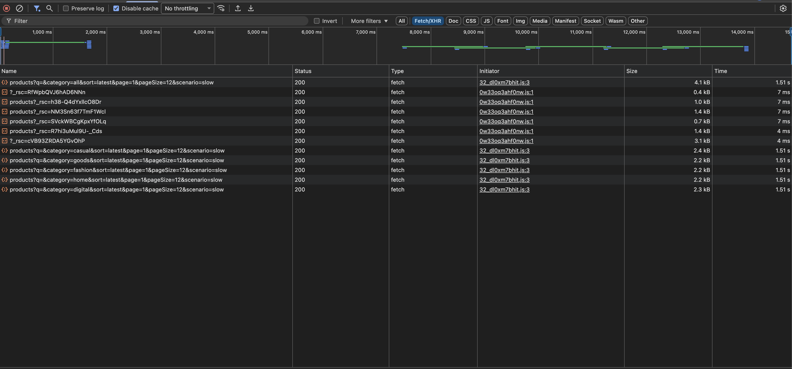
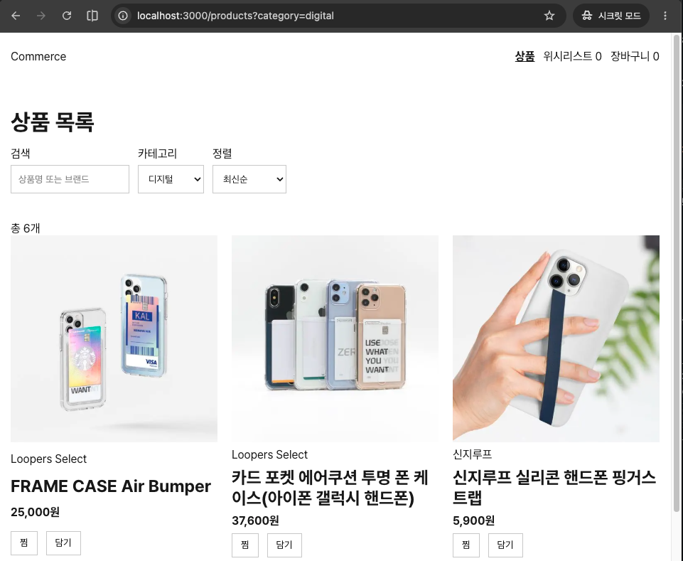

정지 후 화면은 주소창 `category=digital`, `select` "디지털", 디지털 카테고리 상품 6개로 **URL·select·목록이 셋 다 일치한다.** 이전 카테고리(캐주얼·잡화·패션·홈) 상품이 섞여 있거나 남아있는 흔적은 없다.

**Step 5 개입 근거로 예상했던 가설이 정확히 맞았다.** `AbortSignal`이 `fetch`에 안 넘어가 있어서 5건이 다 완료로 뜬다.

- **`src/entities/product/api/api.ts:14`의 `getProductList`는 `fetch`를 호출할 때 `AbortSignal`을 받지도, 넘기지도 않는다.** `queries.ts`의 `queryFn: () => getProductList(params)`도 TanStack Query가 `queryFn`에 넘겨주는 `{ signal }` 컨텍스트를 사용하지 않는다. 그래서 카테고리가 바뀌어도 이전 요청은 취소되지 않고 서버 응답(1.5초)까지 그대로 실행된다.
- **그런데도 화면은 `digital`로 정확히 끝난다 — CLS 0.37 외에는 화면이 늦게 도착한 응답에 덮이지 않는다.** 원인은 취소가 아니라 **query key 격리**다. `productQueryKeys.list(params)`(`src/entities/product/api/queries.ts:16`)가 `category`를 포함한 `params` 전체를 key로 쓰기 때문에, `casual`·`goods`·`fashion`·`home` 응답은 각자의 캐시 엔트리에만 반영되고 화면이 구독하는 건 현재 `category=digital` key뿐이다. 늦게 도착한 이전 카테고리 응답이 캐시는 채우지만 화면을 다시 그리게 만들지 않는다.
- **이번 녹화에서 화면이 안 덮인 건 우연이 아니라 필연이다.** 하지만 우연히 안전한 부분도 하나 있다 — 5건의 API Duration이 전부 1,505~1,515ms로 거의 동일해서 **송신 순서가 곧 응답 순서**였다. 만약 이 서버가 `scenario=slow`처럼 고정 지연이 아니라 요청마다 지연이 들쭉날쭉한 실제 네트워크였다면, 먼저 보낸 `casual` 응답이 나중에 보낸 `digital` 응답보다 늦게 도착하는 경우도 생길 수 있다. 그 경우에도 query key 격리 덕분에 화면이 덮이지는 않겠지만, 검증하려면 응답 지연을 요청마다 다르게 준 재현이 필요하다 — 이번 측정 범위 밖이다.
- **CLS 0.37은 2번 시나리오와 동일한 `LayoutShift` 이벤트(`score 0.3671410915759678`)다.** `digital` 응답 완료 4.3ms 뒤 발생한다. 우연의 일치가 아니라 2번에서 짚은 `ProductCard` 142px→453px 점프가 카테고리 전환마다 재현된다는 뜻이다. 6상태 표의 "취소" 행도 이 CLS 문제를 안고 있다.

### 6. CLS 0.37의 원인 — 반증 실험

2번과 5번에서 같은 `score`가 나온 CLS의 원인을 가르기 위해 카테고리 전환 두 건을 추가로 녹화했다. **예측을 먼저 적고 측정했다.**

가설은 "이전 목록과 새 목록에 같이 있는 상품의 DOM 노드를 React가 재사용해 이동시키고, 그 이동이 layout shift로 잡힌다"였다. `ProductGrid`가 `key={product.id}`를 쓰기 때문이다.

카테고리끼리는 상품이 겹칠 수 없고 `전체 → X`만 겹친다. 그래서 이렇게 갈린다.

| 실험                   | 교집합 | 사전 예측                                   | 실측                       | 판정     |
| ---------------------- | ------ | ------------------------------------------- | -------------------------- | -------- |
| 캐주얼 → 패션          | 0건    | 카드 impacted 0건, CLS가 0.37보다 훨씬 작음 | **LayoutShift 0건, CLS 0** | 예측대로 |
| 전체 → 홈              | 2건    | CLS ≠ 0 이고 ≠ 0.3671410915759678           | **0.320072**               | 예측대로 |
| 전체 → 디지털(2번·5번) | 2건    | —                                           | 0.3671410915759678         | —        |

측정 조건은 2번과 같다. production build, No throttling, Disable cache, 시크릿 창, 스크롤 최상단, `scenario=slow` 임시 패치. 트레이스는 `results/before-products-refetch-disjoint.json`, `results/before-products-refetch-home.json`이다.

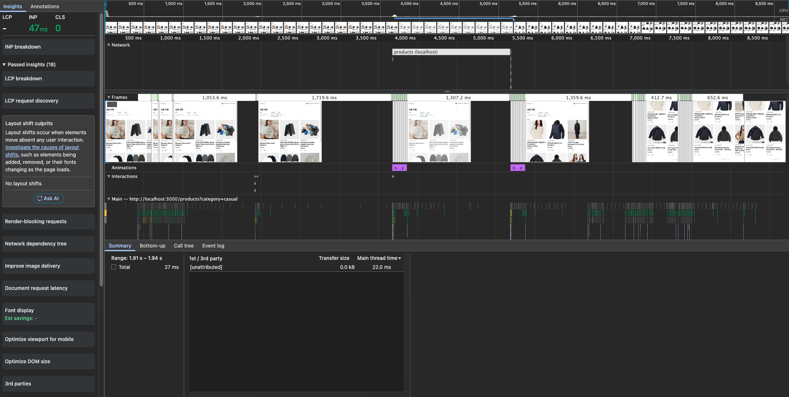
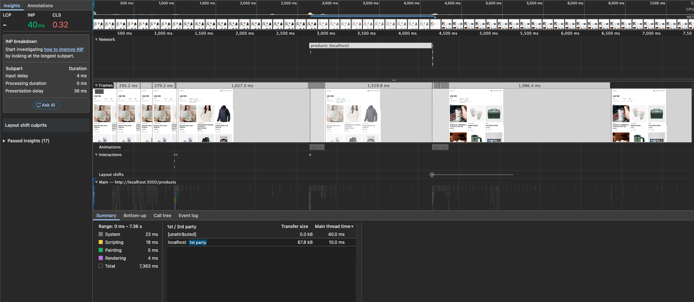

#### 뷰포트가 산수를 확정했다

창 뷰포트는 **945 × 929**다. 3열 그리드에서 1행은 y=285, 2행은 y=787에서 시작하므로 2행 카드는 `929 - 787 = 142px`만 보인다. **`old_rect`의 142는 카드가 작아진 게 아니라 뷰포트 클리핑이었다.** 3행(y≈1289)은 아예 화면 밖이라 `[0, 0, 0, 0]`으로 기록된다.

이걸 알고 나면 두 전환의 `impacted_nodes`가 상품 위치와 그대로 맞는다.

| 전환     | 공유 상품                  | 전체에서 위치 | 새 목록에서 위치 | 트레이스 rect                           |
| -------- | -------------------------- | ------------- | ---------------- | --------------------------------------- |
| → 디지털 | FRAME CASE Air Bumper      | 4번(2행1열)   | 1번              | `[16,787,291,142]` → `[16,285,291,453]` |
| → 디지털 | 카드 포켓 에어쿠션 케이스  | 11번(4행2열)  | 2번              | `[0,0,0,0]` → `[327,285,291,453]`       |
| → 홈     | [STANLEY] 포어 오버 드리퍼 | 7번(3행1열)   | 1번              | `[0,0,0,0]` → `[16,285,291,453]`        |
| → 홈     | WOOD GLOVES                | 9번(3행3열)   | 2번              | `[0,0,0,0]` → `[327,285,291,453]`       |

score가 0.367과 0.320으로 갈리는 것도 여기서 나온다. 디지털 전환은 카드 하나가 **142px 보이는 상태에서** 이동해 impact 영역이 그만큼 넓고, 홈 전환은 두 카드 모두 화면 밖에서 들어온다.

`총 N개` 텍스트 노드는 두 전환 모두 `old_rect`와 `new_rect`가 완전히 같다. 움직인 건 카드뿐이다.

#### 확정된 원인과 명세와의 긴장

**원인은 공유 상품의 DOM 노드 이동이다.** 카드 크기 변화도, 그리드의 중간 상태도 아니다.

그리고 이 이동은 명세 109줄이 요구한 "기존 목록을 즉시 비우지 않고 갱신 중임을 보여준다"의 직접적인 결과다. 목록을 비우고 skeleton을 보여주면 공유 상품도 unmount → mount가 되어 이동이 아니게 되고 CLS는 0이 된다. 실험 1이 그 상태를 보여준다 — 겹치는 상품이 없으면 전부 새 노드라 shift가 없다.

즉 **"기존 목록 유지"와 "CLS 0"이 이 화면에서는 동시에 성립하지 않는다.** 둘 중 하나를 고르는 문제이고, 명세는 전자를 요구한다. 5번 시나리오에서 같은 score가 재현된 것도 그때 화면에 떠 있던 게 계속 전체 목록이었기 때문이다 — `keepPreviousData`는 렌더된 이전 데이터를 체인으로 이어받으므로 중간 응답(casual·goods·fashion·home)은 각자의 키에만 반영되고 화면을 바꾸지 않는다. 두 녹화 모두 실제로는 `전체 → 디지털` 전환이었고, 그래서 rect가 소수점까지 같다.

## 상품 목록 — 개입과 After 측정

Before에서 미충족으로 판정된 것은 **갱신 실패**(목록이 전부 사라짐)와 **취소**(취소 자체가 관찰되지 않음) 둘이다. 갱신 CLS 0.37은 [6번 반증 실험](#6-cls-037의-원인--반증-실험)의 결론대로 개입하지 않았다.

| 개입   | 커밋      | 내용                                                               |
| ------ | --------- | ------------------------------------------------------------------ |
| 개입 5 | `e836a06` | 갱신 실패와 최초 실패를 분리하고, 캐시에 남은 직전 목록을 유지한다 |
| 개입 6 | `c29ccaa` | 필요 없어진 요청에 `AbortSignal`을 연결한다                        |

### 개입 5 — 표시할 데이터 유무로 실패를 가른다

Before의 원인은 `isError` 분기 하나가 두 상태를 같이 처리한 것이다. 여기에 TanStack Query의 함정이 겹쳤다.

조건을 바꾸면 `productQueryKeys.list(params)`가 **새 key**가 된다. 새 key에는 데이터가 없어 `status`는 `pending`에서 시작하고 `keepPreviousData`가 이전 key의 데이터를 `placeholderData`로 빌려 화면에 보여준다. 그런데 `placeholderData`는 `status === 'pending'`일 때만 적용되므로, 요청이 실패해 `status`가 `error`가 되는 순간 `data`가 `undefined`로 떨어진다. **화면에 방금까지 목록이 떠 있었는데도 `isRefetchError`(= `isError && hasData`)는 false**이고 항상 `isLoadingError`로 잡힌다. 그래서 v5의 이 플래그를 쓰지 않았다.

대신 캐시를 직접 읽는다. `dataUpdatedAt`이 가장 최신인 목록이 곧 직전에 화면에 있던 목록이다.

```ts
// entities/product/api/queries.ts
export const getLatestProductList = (queryClient: QueryClient) => {
  const latestKey = queryClient
    .getQueryCache()
    .findAll({ queryKey: productQueryKeys.all })
    .filter((query) => query.state.data !== undefined)
    .sort((a, b) => b.state.dataUpdatedAt - a.state.dataUpdatedAt)
    .at(0)?.queryKey

  return latestKey ? queryClient.getQueryData<GetProductListResponse>(latestKey) : undefined
}
```

파라미터를 따로 기억하지 않는다. 명세 112줄("서버 응답을 Zustand나 별도 로컬 상태에 복사하지 않아요")에 걸릴 여지를 없애려고 **읽기 전용 캐시 조회**만 남겼다.

분기는 `displayData = data ?? fallbackData`의 유무로 갈린다.

| 조건                        | 화면                                      | 명세 상태 표 |
| --------------------------- | ----------------------------------------- | ------------ |
| `isPending && !displayData` | skeleton 12개                             | 최초 진입    |
| `isError && !displayData`   | 목록 자리에 실패 이유 + 다시 시도         | 최초 실패    |
| `isError && displayData`    | 직전 목록 유지 + 흐름 밖 알림 + 다시 시도 | 갱신 실패    |

같은 변경으로 `categories`도 `fallbackData`에서 오게 되어 카테고리 `select`의 `option`이 실패 중에도 남는다. Before에서 URL은 `category=goods`인데 select가 "전체"로 보이던 것은 `value`가 잘못된 게 아니라 **그 값을 가진 `option`이 사라져 브라우저가 첫 항목을 표시**한 것이었다. 원인이 하나였으므로 개입도 하나로 끝났다.

`handleCategoryChange`의 검증 기준도 서버 응답 `categories`에서 URL 허용값 `PRODUCT_CATEGORY_FILTERS`로 바꿨다. 캐시마저 빈 최초 실패 상태에서 목록이 없다는 이유로 카테고리 전환까지 막히면 화면 안에서 실패를 빠져나갈 방법이 없다.

#### 알림을 흐름 밖에 둔 이유

여기서 명세 두 줄이 부딪힌다. 109줄은 "기존 목록을 유지"하라 하고, 111줄은 "현재 URL의 active query와 화면 결과가 일치"하라고 한다. 갱신 실패 화면은 URL이 `category=fashion`인데 목록은 이전 조건의 결과다.

목록 위에 배너를 끼워 넣어 이유를 설명하면 111줄의 취지는 살지만 **그 아래 전체가 밀려 새 CLS가 생긴다.** 조건 변경 1.5초 뒤에 나타나므로 `hadRecentInput` 500ms 창에 걸리지 않아 그대로 집계된다. 같은 단계의 다른 완료조건("fallback 교체가 눈에 띄는 CLS를 만들지 않아야")을 스스로 깨는 셈이다.

그래서 `position: fixed` 상단 바로 두 조건을 동시에 만족시켰다. 문서 흐름에 참여하지 않아 목록이 1px도 밀리지 않고, 문구가 화면과 URL이 다른 이유를 설명한다.

**자동 소멸과 닫기 버튼은 두지 않았다.** 3초 뒤 사라지는 toast가 커머스에서 일반적이지만, 그 수명은 "장바구니에 담았습니다"처럼 사용자가 취할 행동이 남지 않은 **통지**에 맞는 것이다. 갱신 실패는 재시도가 남아 있는 **지속 상태**이고, 알림이 없어지면 화면이 성공 상태와 구별되지 않는다 — 주소창은 `fashion`인데 목록은 전체이고 그 이유가 화면 어디에도 없게 된다. 명세 109줄이 요구한 "다시 시도할 방법"도 함께 사라진다. 배치만 toast에서 빌리고 수명은 빌리지 않았다.

### 개입 6 — 취소를 관찰 가능하게 만든다

명세를 두 줄로 나눠 판정했다.

- **111줄**("이전 요청이 늦게 끝나도 현재 화면을 덮지 않아야") — 이미 충족이다. query key 격리가 [5번](#5-빠른-연속-변경--측정-결과-이번-측정의-핵심)에서 확인됐다.
- **상태 표의 "취소" 행** — 충족이 아니라 **관찰 불가**였다. 요청을 취소하지 않으니 취소된 화면이라는 게 존재하지 않는다. 여섯 화면 중 하나를 녹화에서 구분할 수 없다.

"이미 만족하면 개입하지 말라"(명세 116줄)의 대상이 아니라고 판단해 넣었다.

```diff
- queryFn: () => getProductList(params),
+ queryFn: ({ signal }) => getProductList(params, signal),
```

한 가지 더 필요했다. `fetch`가 abort되면 `AbortError`를 던지는데, 기존 `catch`가 그것을 `ApiError(kind: 'network')`로 감싸 다시 던진다. 그대로 두면 **취소한 이전 요청이 네트워크 실패로 보이고**, 개입 5에서 만든 갱신 실패 알림까지 함께 떴을 것이다. 명세 상태 표의 "취소된 이전 요청이 오류로 보이지 않아야 한다"를 정면으로 어긴다.

```ts
if (signal?.aborted) {
  throw cause // 원본을 그대로 올려 React Query가 취소로 인식하게 둔다
}
```

`api.test.ts`에 회귀 테스트 2건(`AbortSignal` 전달, 취소를 네트워크 오류로 바꾸지 않음)을 추가했다.

### After 측정 조건

| 항목              | 값                                    |
| ----------------- | ------------------------------------- |
| 실행 방식         | `pnpm build` 후 `pnpm start`          |
| Network 패널      | No throttling, Disable cache          |
| 브라우저 / 프로필 | Chrome 150, 시크릿 창                 |
| 뷰포트            | **945 × 963** (Before는 945 × 929)    |
| 코드              | `c29ccaa` + `scenario=slow` 임시 패치 |

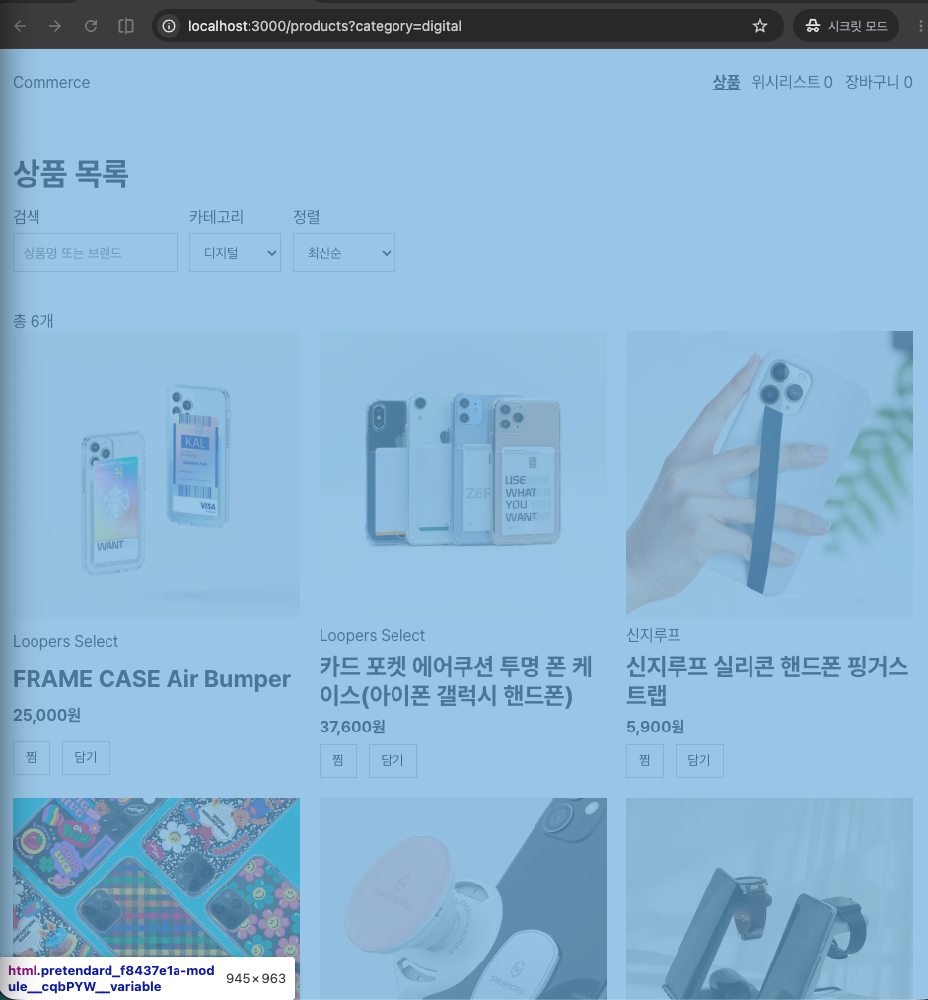

뷰포트 높이가 Before와 34px 다르다. 폭이 같아 rect의 `x`·`width`는 그대로 비교되고, 실제로 시나리오 2의 CLS가 소수점 16자리까지 일치했다. 다만 `old_rect`의 높이가 뷰포트 클리핑 값이므로([6번 뷰포트 산수](#뷰포트가-산수를-확정했다)) 높이에 민감한 비교에는 이 차이를 감안해야 한다.

절차는 Before와 같다([화면 조작 절차](#화면-조작-절차)). 트레이스는 `results/after-products-*.json`이다.

### After 대조 — 여섯 화면 전부

각 트레이스의 `LayoutShift` 이벤트를 직접 집계한 값이다.

| #   | 시나리오  | Before                 | After (Step 5)         | **After (Step 7)**        | 판정                        |
| --- | --------- | ---------------------- | ---------------------- | ------------------------- | --------------------------- |
| 1   | 최초 진입 | 0 (shift 0건)          | 0 (shift 0건)          | **0 (shift 0건)**         | 동일                        |
| 2   | 갱신      | **0.3671410915759678** | **0.3671410915759678** | **0.3671410915759678**    | 비트 단위로 동일            |
| 3   | 0건       | 7.256766908862576e-05  | 7.256766908862576e-05  | **7.256766908862576e-05** | 비트 단위로 동일            |
| 4-a | 최초 실패 | 0 (shift 0건)          | 0 (shift 0건)          | **0 (shift 0건)**         | 동일                        |
| 4-b | 갱신 실패 | 0.0003991502119214209  | **0 (shift 0건)**      | **0 (shift 0건)**         | **개선 유지**               |
| 5   | 취소      | 0.3671410915759678     | 0.4334352806           | **0.3671410915759678**    | **Before와 비트 단위 동일** |

Step 7 값은 `results/after-final-products-*.json` 6건에서 `LayoutShift` 이벤트를 직접 집계한 것이다. 측정 조건은 `a081464` + `scenario=slow` 임시 패치, 뷰포트 945 × 929, production build, No throttling, Disable cache, 시크릿 창이다.

#### 취소 시나리오 — Step 5의 판정이 재현으로 확인됐다

Step 5에서 취소 CLS가 0.4334로 튀었을 때 "개입 때문이 아니라 조작 순서가 달라서"라고 판정했다([근거](#취소-cls-0433은-개입-때문이-아니다)). 근거는 shift 발생 시각과 응답 완료 시각의 대조였고, 추론이었다.

Step 7에서 전환 간격을 응답 시간(1.5초)보다 짧게 유지하자 **Before와 소수점 16자리까지 같은 `0.3671410915759678`이 나왔다.** 같은 조작에서 같은 값이 재현되므로 그때 판정이 맞았다는 것이 실측으로 뒷받침된다.

취소 자체도 유지된다. `didFail` 3건이 전부 `/api/products`이고, Network 패널에도 `(canceled)` 3건이 찍혔다(Before 0건).

```
/api/products?q=&category=casual&…&scenario=slow
/api/products?q=&category=fashion&…&scenario=slow
/api/products?q=&category=home&…&scenario=slow
```

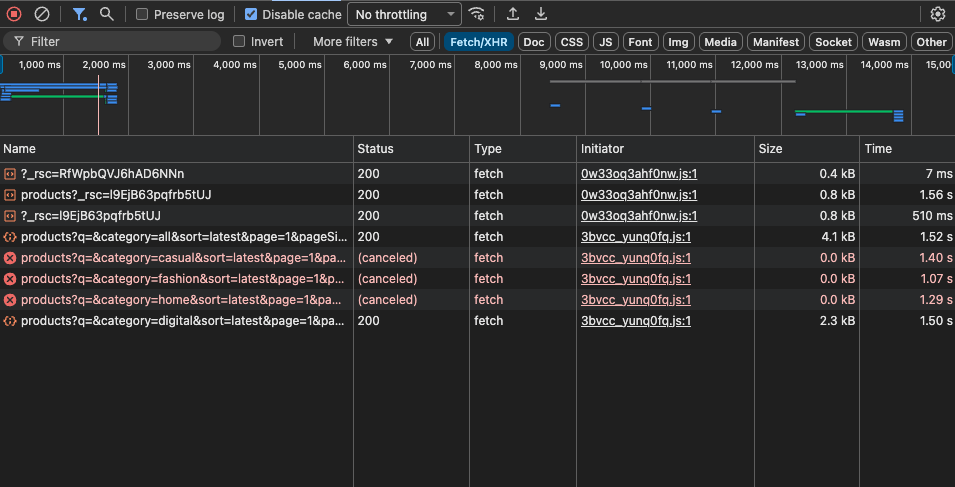

#### 차단된 요청은 트레이스에 남지 않는다

실패 두 시나리오는 Network 패널의 `Block request URL`(`*/api/products*`)로 재현했다. 이 앱은 `scenario`를 화면에서 API로 보내지 않으므로 URL 조작으로는 실패를 만들 수 없다.

**차단된 요청은 트레이스에 `ResourceSendRequest`도 `ResourceFinish`도 남기지 않는다.** 그래서 4-a·4-b 트레이스의 `/api/products` 요청 건수는 0이다. 요청이 없었던 것이 아니라 네트워크 스택에 닿기 전에 막힌 것이다.

4-a의 `didFail` 4건은 차단과 무관하다. requestId를 URL에 매칭하면 `/`, `/products`, `/?_rsc=…`, `/products?_rsc=…`로, **정상 최초 진입 트레이스에도 똑같이 4건이 있다.** 라우터가 내비게이션 중 취소하는 prefetch라 시나리오 판정에 쓰지 않는다.

증거는 화면 캡처와 `LayoutShift` 집계로 남긴다.

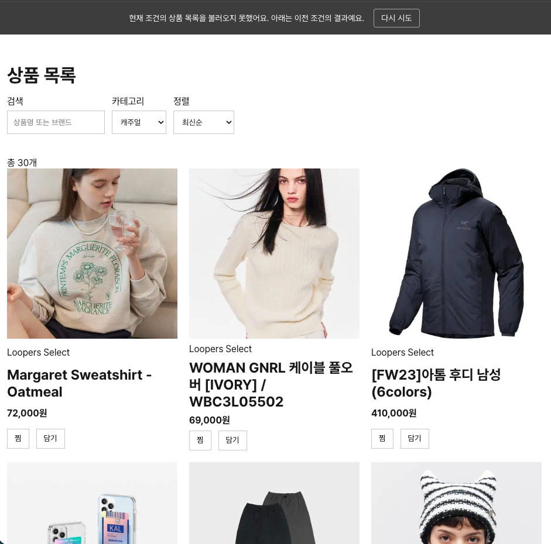

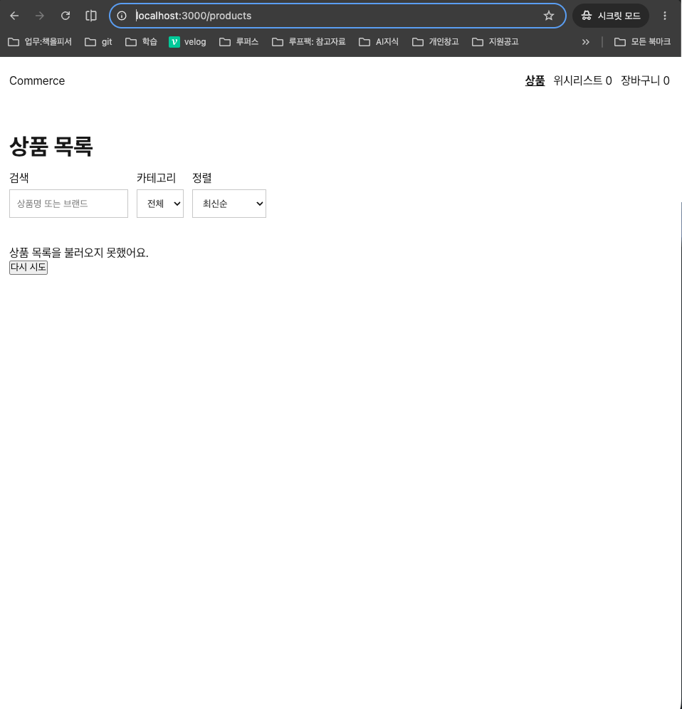


Step 5에서 확인한 갱신 실패의 세 조건(목록 유지 / 상단 고정 알림 / `select`가 URL과 일치)이 Step 7에서도 그대로다. 캡처의 카테고리는 "캐주얼"이고 목록은 이전 조건의 30개가 유지된다.

#### slow 조건과 6상태 화면

요청 URL에 `scenario=slow`가 실렸다는 증거와 각 상태 화면이다.

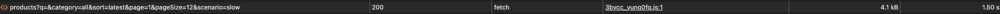

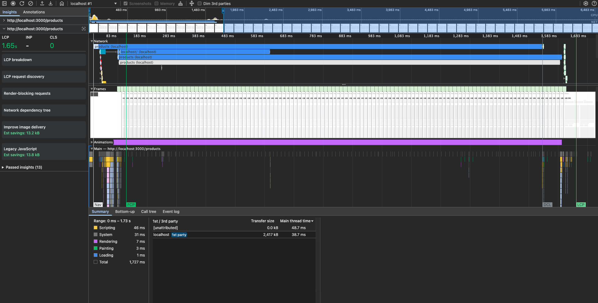

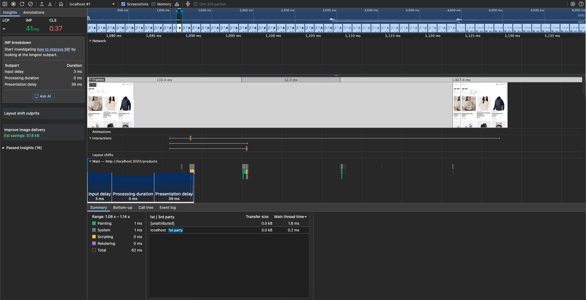

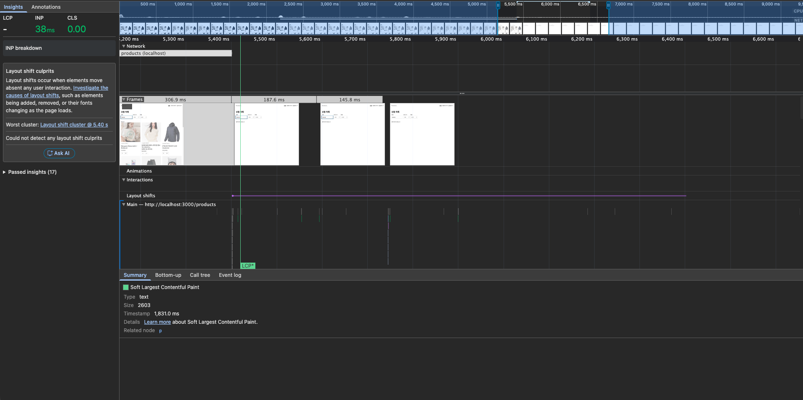

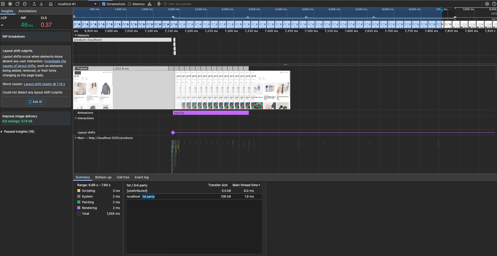

0건 시나리오의 트레이스에는 debounce 중간 요청까지 3건이 잡혔고(`q=zzz` → `q=zzzz` → `q=zzzzqqq`), 앞 2건이 `didFail`로 취소됐다. 카테고리 전환뿐 아니라 **검색 입력 경로에서도 취소가 걸린다**는 것이 여기서 확인된다.

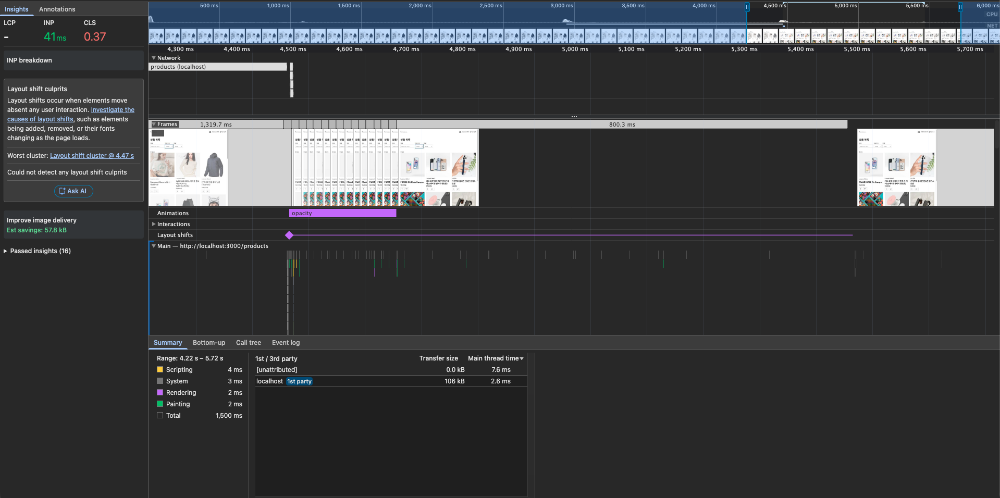

갱신 CLS 0.37은 의도적으로 남긴 값이다. Insights가 `Could not detect any layout shift culprits`를 표시하는 것까지 Before와 같아서, 원인 판정은 여전히 트레이스 JSON의 `impacted_nodes`로만 가능하다.

### 갱신 실패 — 세 조건이 모두 바뀌었다

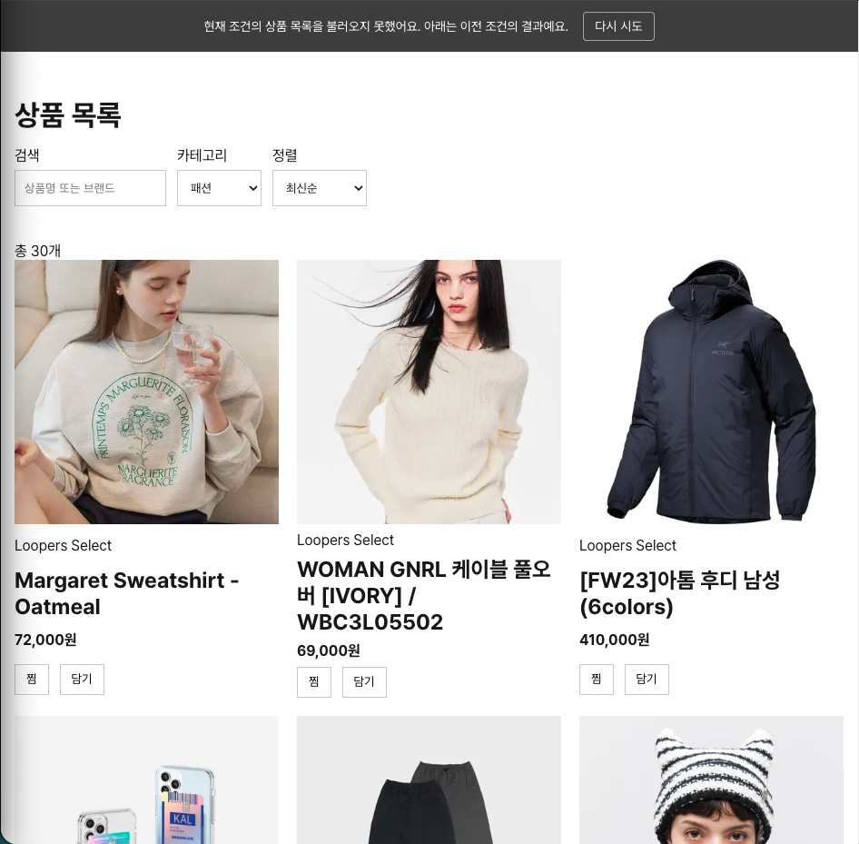

| 확인 항목 | Before                  | After                               |
| --------- | ----------------------- | ----------------------------------- |
| 목록      | 12개 전부 사라짐        | 전체 목록 30개 그대로 유지          |
| 실패 표시 | 목록 자리를 에러가 대체 | 상단 고정 알림 + `다시 시도`        |
| select    | URL과 무관하게 "전체"   | URL `category=fashion` ↔ **"패션"** |
| CLS       | 0.0003991502119214209   | **0 — `LayoutShift` 이벤트 0건**    |

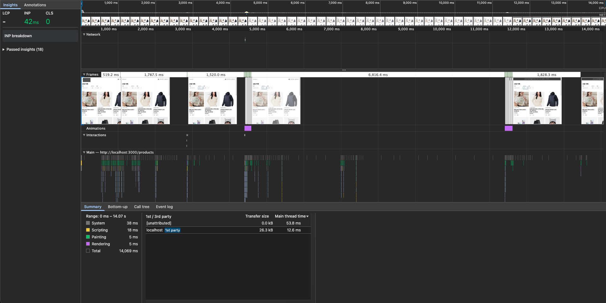

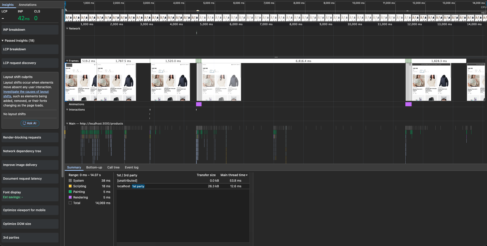

Insights가 `No layout shifts`를 표시하고 CLS가 `0`이다. **알림을 새로 추가했는데 shift는 오히려 Before보다 줄었다.** 인라인 배너였다면 여기서 새 shift가 잡혔을 것이므로, 흐름 밖 배치 판단이 실측으로 확인됐다.

최초 실패는 Before와 같은 화면이다. reload로 메모리 캐시가 비어 `getLatestProductList`가 `undefined`를 주고, 의도대로 목록 자리에 에러가 온다.

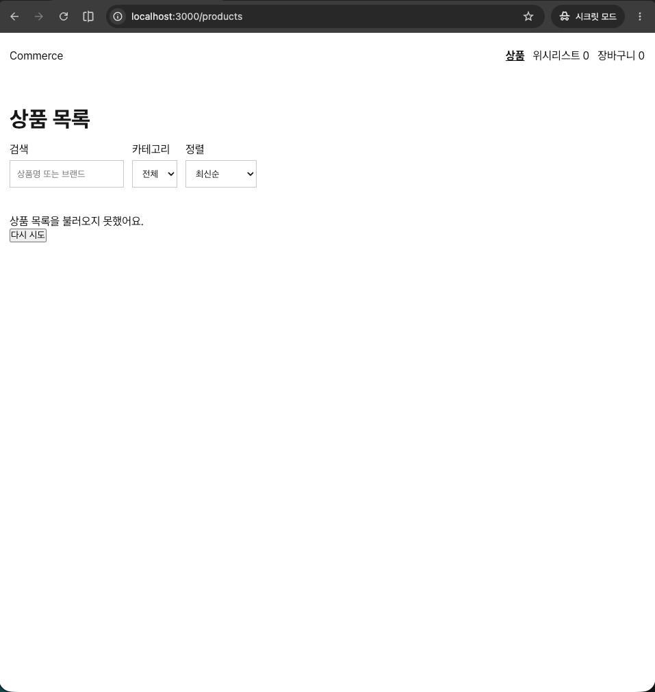

### 갱신 CLS — 개입하지 않은 그대로다

```
score 0.3671410915759678
node old [16, 787, 291, 142] -> new [16, 285, 291, 453]
```

[6번 반증 실험](#6-cls-037의-원인--반증-실험)에서 확정한 rect와 같다. `key={product.id}` 노드 재사용에 손대지 않기로 했고 실제로 안 건드려졌다. **개입 5가 이 경로에 부작용을 남기지 않았다는 회귀 증거**이기도 하다.

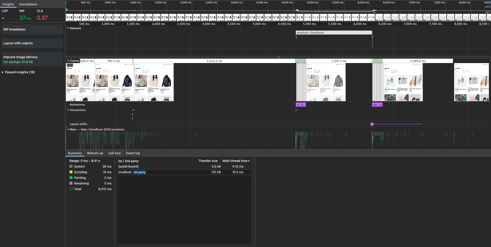

### 취소 — 트레이스의 `didFail`이 증거다

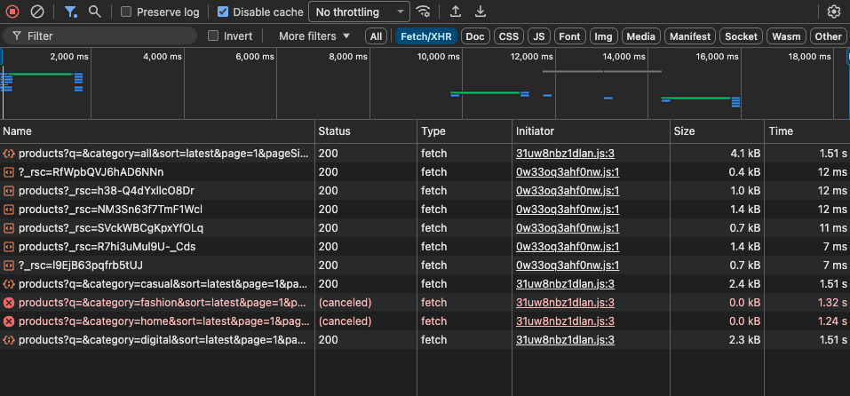

| 시각(첫 요청 기준) | 카테고리 | 완료     | `didFail` |
| ------------------ | -------- | -------- | --------- |
| 0ms                | casual   | +1,507ms | false     |
| 1,986ms            | fashion  | +1,323ms | **true**  |
| 3,307ms            | home     | +1,239ms | **true**  |
| 4,543ms            | digital  | +1,508ms | false     |

Before는 5건 전부 `didFail=false`였다(취소 0건). Network 패널의 `(canceled)` 2건과 트레이스가 일치한다.

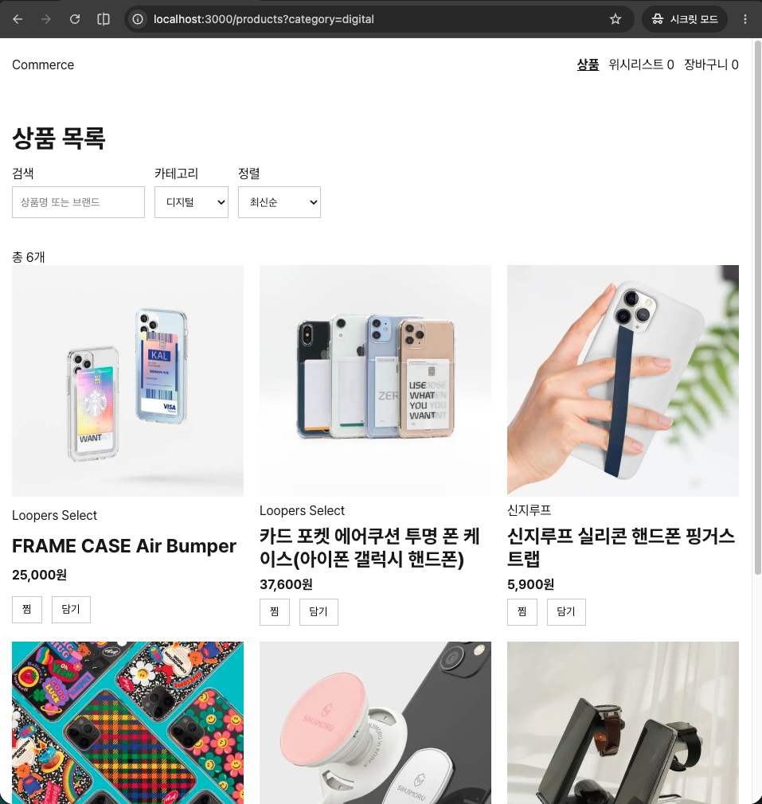

정지 후 URL `category=digital`, select "디지털", 총 6개, **실패 알림 없음**. `signal?.aborted` rethrow가 없었다면 취소 2건이 네트워크 오류가 되어 개입 5의 알림이 떴을 것이다. **두 개입이 충돌하지 않는다는 실측 증거다.**

#### 취소 CLS 0.433은 개입 때문이 아니다

숫자만 보면 올라갔다. shift 발생 시각을 응답 완료와 맞춰보면 원인이 갈린다.

```
finish   1,507ms  casual
SHIFT    1,510ms  score=0.4334352806    ← casual 응답 3ms 뒤
finish   6,051ms  digital
                                        ← 여기엔 shift 없음
```

**shift는 `전체 → 캐주얼` 전환이고, `캐주얼 → 디지털`은 shift가 0이다.**

Before에서는 5번 전환이 968~1,443ms 간격으로 붙어 어떤 중간 응답도 렌더되지 못했고, 화면은 `전체 → 디지털` 한 번만 바뀌었다. 이번에는 캐주얼로 바꾼 뒤 1,986ms를 기다렸다가 패션으로 넘어갔다 — 1.5초 응답보다 길어 캐주얼이 렌더됐다. **조작 순서가 달라진 것이지 코드가 달라진 게 아니다.** 재현하려면 전환 간격을 응답 시간보다 짧게 유지해야 한다.

그리고 `캐주얼 → 디지털`이 shift 0인 것이 중요하다. 두 카테고리는 교집합이 0건이다. 6번 실험 1에서 `캐주얼 → 패션`(교집합 0건)의 shift가 0임을 확인했는데, **예측하지 않은 다른 카테고리 쌍에서 독립적으로 재현됐다.** 원인 판정이 한 번 더 지지된다.

### `isPending`과 `isFetching`이 각각 맡는 화면

명세 110줄이 요구하는 설명이다. 결론부터 적으면 **`isFetching`은 쓰지 않았고 `isPlaceholderData`를 썼다.**

| 플래그              | 참이 되는 때                                    | 맡는 화면                 |
| ------------------- | ----------------------------------------------- | ------------------------- |
| `isPending`         | 이 query key에 데이터가 없고 요청이 끝나지 않음 | 최초 진입 skeleton        |
| `isPlaceholderData` | 화면의 데이터가 **이전 key**의 것               | 갱신 중 흐림(`aria-busy`) |
| `isFetching`        | 이유를 가리지 않고 요청이 떠 있음               | (쓰지 않음)               |

`isFetching`으로 흐림을 걸면 **사용자가 아무것도 바꾸지 않은 배경 재조회에서도 목록이 흐려진다.** `staleTime` 만료나 창 포커스 복귀로 도는 요청이 그렇다. 화면에 있는 데이터는 여전히 현재 조건의 결과이므로 흐릴 이유가 없다.

`isPlaceholderData`는 정확히 "보이는 데이터가 지금 URL 조건의 결과가 아니다"일 때만 참이다. 명세 상태 표의 "이전 데이터가 있는 갱신"과 정의가 그대로 겹친다.

`isPending`은 단독으로 쓰지 않고 `isPending && !displayData`로 좁혔다. 조건을 바꾼 직후에는 새 key가 `pending`이면서 캐시 fallback이 있을 수 있는데, 그때 skeleton을 그리면 유지해야 할 목록을 스스로 지우게 된다.

## 목록 6상태 관찰

| 상태                    | 현재 화면                                                                  | 충족 여부                           | 개입 / 미개입 근거                                                                                                                                         |
| ----------------------- | -------------------------------------------------------------------------- | ----------------------------------- | ---------------------------------------------------------------------------------------------------------------------------------------------------------- |
| 데이터 없는 최초 진입   | skeleton 12개 → 1.5초 뒤 목록                                              | 충족                                | CLS 0, 카드 자리 유지. 무개입                                                                                                                              |
| 이전 데이터가 있는 갱신 | 1.2초는 기존 목록 유지, 응답 도착 시 공유 상품 카드가 위로 이동            | 관찰 기준은 충족, **CLS는 미충족**  | CLS 0.37. 원인은 공유 상품의 DOM 노드 이동으로 확정([6번](#6-cls-037의-원인--반증-실험)). 목록을 비우면 사라지지만 그건 명세가 금지한다                    |
| 성공 + 0건              | "검색 결과가 없습니다." 전환, 요청 2건(debounce 창 2개) 모두 순서대로 완료 | 충족                                | CLS 0. debounce는 스펙대로 동작. 무개입                                                                                                                    |
| 최초 실패               | 목록 자리에 에러 + 다시 시도                                               | 충족                                | 에러 메시지·다시 시도 버튼 확인됨(스크린샷). LCP 0.10s는 대기 대상이 없어 빠른 것뿐이라 판정 근거로 쓰지 않음. 화면은 그대로 두고 개입 5에서 분기만 갈랐다 |
| 갱신 실패               | 목록이 사라지고 에러로 대체, 카테고리 select도 초기화                      | **미충족**                          | 명세는 "기존 목록 유지"를 요구하나 실제로는 전부 사라짐. 개입 필요                                                                                         |
| 취소                    | 요청 5건 전부 완료(취소 없음), 화면은 마지막 카테고리로 정확히 귀결        | 충족(레이스는), **CLS는 위와 동일** | query key 격리로 화면 안 덮임(무개입). 착지 시 CLS 0.37은 2번과 같은 사건이다 — 화면에 계속 전체 목록이 떠 있었으므로 실제로는 같은 전환이었다             |

개입 후 상태는 다음과 같다. 근거는 [After 대조](#after-대조--여섯-화면-전부)에 있다.

| 상태                    | After 화면                                                     | 충족 여부                        |
| ----------------------- | -------------------------------------------------------------- | -------------------------------- |
| 데이터 없는 최초 진입   | skeleton 12개 → 목록 (변화 없음)                               | 충족                             |
| 이전 데이터가 있는 갱신 | 기존 목록 유지 + 흐림 (변화 없음)                              | 관찰 기준 충족, **CLS는 미충족** |
| 성공 + 0건              | "검색 결과가 없습니다." (변화 없음)                            | 충족                             |
| 최초 실패               | 목록 자리에 에러 + 다시 시도 (변화 없음)                       | 충족                             |
| 갱신 실패               | **직전 목록 유지 + 상단 고정 알림 + 다시 시도, select도 유지** | **충족**, CLS 0.00040 → **0**    |
| 취소                    | **`(canceled)` 2건, 취소가 오류로 보이지 않음**                | **충족**                         |

CLS만 미충족으로 남는다. [6번 반증 실험](#6-cls-037의-원인--반증-실험)에서 "기존 목록 유지"와 "CLS 0"이 이 화면에서 동시에 성립하지 않음을 확인했고, 명세가 전자를 요구하므로 개입하지 않았다.

## 관찰 → 가설 → 반증 → 최소 변경

각 항목을 한 문장으로 적는다. 홈 Hero LCP는 이미 "[Step 4 개입 후보](#step-4-개입-후보)"에 후보 1~3으로 정리돼 있어 아래 표에서는 제목만 참조하고, 상품 목록에서 새로 나온 항목만 채운다.

| 관찰한 사실                                                                         | 원인 가설                                                                                                                                                                           | 반증 방법                                                                                                                                                           | 먼저 시도할 가장 작은 변경                                                                                               |
| ----------------------------------------------------------------------------------- | ----------------------------------------------------------------------------------------------------------------------------------------------------------------------------------- | ------------------------------------------------------------------------------------------------------------------------------------------------------------------- | ------------------------------------------------------------------------------------------------------------------------ |
| 홈 Hero LCP 662.1ms의 78%가 Resource load delay                                     | [Step 4 개입 후보](#step-4-개입-후보) 참고(후보 1~3)                                                                                                                                | 각 후보 문단의 반증 방법 참고                                                                                                                                       | 후보 2(preload+fetchpriority)부터, 근거는 해당 문단                                                                      |
| 카테고리 갱신·레이스 응답 완료 직후 `ProductCard`가 142px→453px로 점프하며 CLS 0.37 | ~~갱신 중 그리드가 다른 중간 상태를 거친다~~ → **반증됨.** 이전·새 목록에 함께 있는 상품의 DOM 노드를 `key={product.id}`로 재사용해 이동시키는 것이 원인이다(142px은 뷰포트 클리핑) | 교집합이 없는 카테고리끼리 전환하면 CLS가 0이어야 한다 → **[6번 실험](#6-cls-037의-원인--반증-실험)에서 확인(0건)**                                                 | 명세가 요구한 "기존 목록 유지"와 상충하므로 무개입 근거를 남기는 쪽을 검토한다                                           |
| 갱신 실패 시 기존 목록 12개가 전부 사라지고 최초 실패와 같은 화면으로 대체됨        | 쿼리 실패 시 컴포넌트가 `data`를 유지하지 않고 에러 전용 분기로 완전히 스위칭한다                                                                                                   | 실패 시 `isError`와 `data` 유무를 함께 확인해 이전 `data`가 실제로 비는지 검증 → **확인됨.** 새 key라 `placeholderData`가 적용되지 않아 `data`가 `undefined`가 된다 | `getLatestProductList`로 캐시의 직전 목록을 읽어 분기를 가른다 → `e836a06`, [After](#갱신-실패--세-조건이-모두-바뀌었다) |
| 갱신 실패 화면에서 카테고리 `select`가 "전체"로 보이는데 URL은 `category=goods`     | ~~select 값이 URL이 아니라 쿼리 결과에서 파생된다~~ → **반증됨.** `value`는 URL에서 온다. 그 값을 가진 `option`이 사라져 브라우저가 첫 항목을 표시한 것이다                         | `ProductFilters.tsx`의 `value` prop 출처를 소스에서 확인 → `useProductFilters`(URL)였다                                                                             | 위와 같은 변경으로 `categories`가 유지되면 함께 풀린다 → `e836a06`                                                       |
| 조건을 빠르게 연속으로 바꿔도 요청 5건이 전부 완료되고 `(canceled)`가 없다          | `queryFn`이 `AbortSignal`을 받지 않아 취소 신호가 `fetch`까지 닿지 않는다                                                                                                           | `signal`을 연결한 뒤 같은 조작에서 트레이스의 `didFail`이 true로 바뀌는지 확인 → **2건 확인**                                                                       | `queryFn: ({ signal }) => getProductList(params, signal)` → `c29ccaa`, [After](#취소--트레이스의-didfail이-증거다)       |

## Step 7 — 홈 After 추가 관찰

Step 4에서 미확인으로 남긴 두 항목을 여기서 채우고, After 측정에서 새로 나온 것을 기록한다.

### CLS 0의 시각 증거 (Step 4 미확인 해소)

Step 4까지 홈 CLS 0의 근거는 트레이스 JSON의 `LayoutShift` 0건과 Insights의 CLS 수치뿐이었다. Performance 패널 캡처가 없어 미확인으로 남겼던 항목이다.

`results/after-final-home-record.json`에서 `LayoutShift` 이벤트는 **0건**, score 합 **0**이다. Insights의 `Layout shift culprits` 카드가 **`No layout shifts`**를 명시한다.

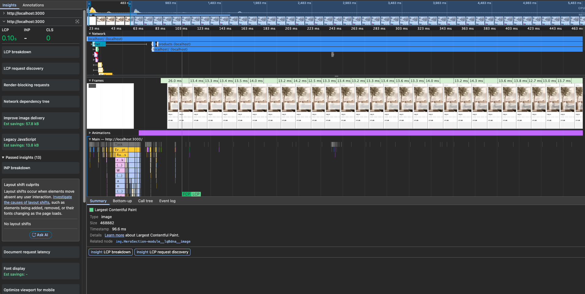

**`Layout shifts` 트랙 자체는 화면에 없다.** shift가 0건이면 DevTools가 트랙을 렌더하지 않는다. "트랙을 못 찾아서 안 찍었다"와 구분하기 위해 Insights 카드를 증거로 남긴다. 이쪽이 "0건"을 명시적으로 말해주므로 빈 트랙 캡처보다 낫다.

### 모바일 뷰포트 (Step 4 미확인 해소)

Step 4까지의 녹화는 전부 데스크톱이라 `@media (max-width: 640px)`의 `aspect-ratio: 4 / 5` 분기가 한 번도 검증되지 않았다. 녹화는 `results/after-final-home-mobile.json`이다.

`aspect-ratio`를 트레이스 값으로 역산해 확인했다.

|                     | 데스크톱         | 모바일                    |
| ------------------- | ---------------- | ------------------------- |
| LCP element size    | 468,882px²       | 160,205px²                |
| 역산한 hero 박스    | 913 × 513.6      | **358 × 447.5**           |
| `PaintImage` height | —                | **447.5** (역산값과 일치) |
| 폭 ÷ 높이           | 1.777 = **16/9** | 0.800 = **4/5**           |
| 실측 LCP            | 96.6ms           | 95.1ms                    |
| `LayoutShift`       | 0건              | **0건**                   |

데스크톱 역산값 913 × 513.6은 Lighthouse가 기록한 `boundingRect`(913 × 514)와 일치하고, 뷰포트 945에서 `PageContainer`의 좌우 여백 32px을 뺀 값과도 맞는다. 모바일은 390px 뷰포트에서 같은 계산이 성립한다.

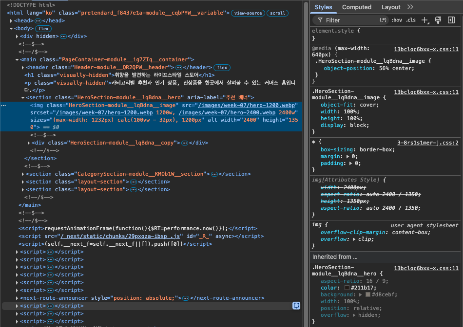

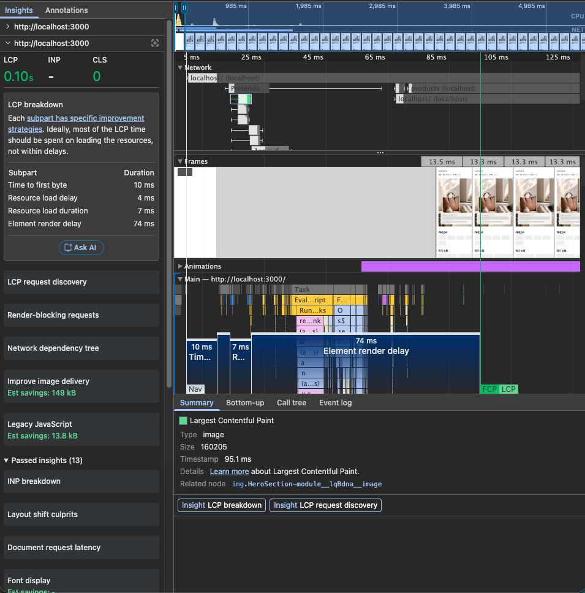

**모바일에서도 `LayoutShift`가 0건이다.** `HeroSection.module.css`의 주석("스켈레톤은 `.hero`와 `.copy`를 그대로 재사용한다. 바깥 aspect-ratio가 같아 실제 Hero로 교체될 때 아래 콘텐츠가 밀리지 않는다")이 브레이크포인트 양쪽에서 성립한다는 것이 확인됐다.

### 새로 발견한 것 1 — metadata가 prefetch 비용을 올렸다

홈 문서 요청 하나에 딸려 나가는 `/products` RSC prefetch가 응답마다 약 500ms를 쓴다.

| 요청                                | 시작 → 종료     | 소요  |
| ----------------------------------- | --------------- | ----- |
| `/products?_rsc=…`                  | 117 → 629ms     | 512ms |
| `/products?category=digital&_rsc=…` | 575 → 1,092ms   | 517ms |
| `/products?category=home&_rsc=…`    | 582 → 1,095ms   | 513ms |
| `/products?category=goods&_rsc=…`   | 629 → 1,145ms   | 516ms |
| `/products?category=fashion&_rsc=…` | 630 → 1,148ms   | 518ms |
| `/products?category=casual&_rsc=…`  | 1,096 → 1,613ms | 517ms |

원인은 Step 6에서 붙인 `generateMetadata`다. 상품 목록 metadata가 mock API(기본 지연 500ms)를 기다리므로 **prefetch 응답도 그만큼 늦어진다.** Step 6 이전에는 없던 비용이다.

우선순위가 전부 `Low`이고 FCP(96.6ms)·LCP(96.6ms) 이후라 **사용자 체감 지표에는 잡히지 않았다.** Lighthouse 5회에서 FCP·LCP·CLS·TBT 어디에도 영향이 없다.

다만 홈 진입 한 번에 서버가 6회 × 약 500ms를 더 일한다. 명세 3단계가 요구한 동적 metadata의 대가이고, 이번 범위에서 되돌릴 항목은 아니라고 판단해 기록만 남긴다. 되돌리려면 `generateMetadata`에서 조회를 빼야 하는데 그건 3단계 요구사항을 깬다.

### 새로 발견한 것 2 — 모바일에 과대한 이미지가 나간다

Insights `Improve image delivery`의 절감 추정치가 데스크톱 57.8KB, **모바일 149KB**다.

`srcset` 후보가 `hero-1200.webp 1200w`와 `hero-2400.webp 2400w` 둘뿐이라, 358px 박스에도 1200w(179KB)를 받는다. 더 작은 후보가 없어서 브라우저가 고를 수 없다.

Step 4에서 후보를 만들 때 데스크톱 표시 폭 상한(1200px)만 기준으로 삼았고 모바일 분기를 계산에 넣지 않았다. 600w 후보를 하나 추가하면 풀리는 문제이지만, **Step 7은 같은 조건에서 재측정하는 단계라 여기서 코드를 고치면 After SHA가 무효가 된다.** 다음 주 항목으로 남긴다.

### 다음 병목은 폰트다

After의 총 전송량은 2,603,503 B이고 그중 폰트가 **2,057,992 B(79.0%)**다. 이미지 13.3%, JS 6.8%, 텍스트 0.9%다.

Lighthouse 시뮬레이션 LCP가 5회 모두 `FCP + 정확히 2,000ms`인 것도 여기서 설명된다. 총 전송량 ÷ 10,240Kbps = 2,034ms로, **`simulate`가 보는 LCP는 이제 hero가 아니라 폰트 다운로드다.** 실측 96.6ms와 시뮬레이션 2,249.1ms의 23배 차이가 이 계산에서 나온다.

Step 4에서 hero를 7.5MB → 179KB로 줄이면서 전송량 1위가 폰트로 바뀌었고(78.4%), After에서도 그대로다(79.0%). `next/font/local`은 `next/font/google`과 달리 자동 서브셋을 하지 않는다. 이번 주 범위 밖이지만 다음 병목은 확정됐다.

## Step 7 — 전체 검증

`a081464`에서 `scenario=slow` 임시 패치를 되돌린 뒤 실행했다.

| 검증                     | 결과                                                      |
| ------------------------ | --------------------------------------------------------- |
| `pnpm check` — test      | 8 파일 / **59 통과** (286ms)                              |
| `pnpm check` — lint      | 통과                                                      |
| `pnpm check` — typecheck | 통과                                                      |
| `pnpm check` — build     | 통과. `/`·`/products` 모두 `ƒ (Dynamic)`                  |
| `pnpm test:e2e`          | **35 / 36 통과.** WebKit 1건은 기존에 기록된 플래키(아래) |

### E2E 1차 실행은 무효다 — 측정용 서버가 재사용됐다

첫 실행에서 32건이 실패했는데 코드 회귀가 아니었다. [playwright.config.ts](../../playwright.config.ts)가 이렇게 되어 있다.

```ts
webServer: {
  command: 'pnpm dev',
  url: 'http://localhost:3000',
  reuseExistingServer: !process.env.CI,
}
```

Step 7 녹화용으로 띄워둔 **`scenario=slow` 패치가 박힌 production 서버**가 3000번을 점유하고 있었고, Playwright가 `pnpm dev`를 새로 띄우지 않고 그 서버를 그대로 썼다. 모든 응답이 1.5초로 늘어나 debounce·연속 조작 타이밍을 전제한 테스트가 무너졌다.

판별 근거는 문서 응답 시간이었다.

```
curl -w 'total=%{time_total}' http://localhost:3000/products
→ total=1.535917
```

서버를 내리고 다시 돌리자 35/36이 됐다. **측정과 E2E를 같은 날 수행하면 다시 밟기 쉬운 함정이라 기록해 둔다.** E2E는 production 빌드가 아니라 dev 서버를 쓰므로, `pnpm check`의 빌드 결과와도 무관하다.

### WebKit debounce 이탈 — 회귀가 아니다

남은 1건은 `debounce 대기 중 페이지를 떠나면 검색어 변경을 취소한다`(WebKit 전용)다. Chromium은 통과한다.

```
Expected: "http://localhost:3000/"
Received: "http://localhost:3000/products?q=%EC%8A%A4%ED%83%A0%EB%A6%AC"
```

검색어 입력(debounce 300ms) 중 Commerce 링크로 `/`에 나가는 흐름인데, `/`로 가는 내비게이션이 끝나기 전에 debounce가 발화해 `?q=…`를 도로 쓴다.

**6주차에 이미 관찰하고 판정한 항목이다**(`docs/week-06/decisions.md` 12절 앞). 당시 격리 재현 실패율이 `--repeat-each=5`에서 2/5였고, 원인은 "홈의 서버 prefetch 지연(약 500ms)이 검색 debounce(300ms)보다 길어 두 내비게이션이 경합한다"는 가설까지만 세워두고 미뤘다.

Step 7에서 같은 방법으로 다시 쟀다.

| 시점   | 격리 실패율 (`--repeat-each=5`) |
| ------ | ------------------------------- |
| 6주차  | 2 / 5                           |
| Step 7 | **2 / 5**                       |

**비율이 그대로다.** Step 6의 `generateMetadata` 추가가 홈 내비게이션을 더 느리게 만들었다면 실패율이 올랐어야 하는데 변화가 없다. 회귀로 판정하지 않는다.

가설을 뒷받침하는 관찰이 하나 더 나왔다. **실패한 회차만 느리다.**

```
1회 ✘ 6.9s     2회 ✓ 2.3s     3회 ✓ 2.3s     4회 ✓ 2.3s     5회 ✘ 6.8s
```

통과는 2.3초로 일정하고 실패는 6.8~6.9초다. 홈 내비게이션이 느려질 때만 debounce와 경합해 진다는 6주차 가설과 방향이 맞는다. 원인 확정은 이번에도 하지 않았다.

## Step 7 — 회귀 확인

`scenario=slow` 패치를 제거한 production 서버에서 확인했다.

### URL 상태 복원 — 검색·카테고리·정렬·페이지

픽스처가 30건이고 `PRODUCT_PAGE_SIZE = 12`라 **카테고리를 걸면 6건이 되어 2페이지가 존재하지 않는다.** 그래서 페이지를 먼저 만들고 필터를 나중에 거는 순서로 밟았다. 이 순서면 필터가 `page`를 리셋하는 것도 같은 흐름에서 확인된다.

```
/products → ?page=2 → ?sort=price-asc → &category=fashion → &q=가디건
```

뒤로/앞으로를 왕복하며 **주소창 값과 화면 컨트롤 값이 어긋나는 지점이 있는지**를 봤다.

| 되돌아간 URL                                | 검색   | 카테고리 | 정렬        | 총 건수 | 판정 |
| ------------------------------------------- | ------ | -------- | ----------- | ------- | ---- |
| `?sort=price-asc&category=fashion&q=가디건` | 가디건 | 패션     | 낮은 가격순 | 1개     | 일치 |
| `?sort=price-asc&category=fashion`          | 빈칸   | 패션     | 낮은 가격순 | 6개     | 일치 |
| `?sort=price-asc`                           | 빈칸   | 전체     | 낮은 가격순 | 30개    | 일치 |
| `?page=2`                                   | 빈칸   | 전체     | 최신순      | 30개    | 일치 |
| `/products`                                 | 빈칸   | 전체     | 최신순      | 30개    | 일치 |

앞으로 가기로 정순 복귀했을 때도 다섯 상태 모두 같았다.

**Step 5에서 관찰한 결함(`category=goods`인데 select는 "전체")이 재현되지 않았다.** 정렬을 걸었을 때 `page`가 URL에서 사라지는 것도 확인했다(4행 → 3행).

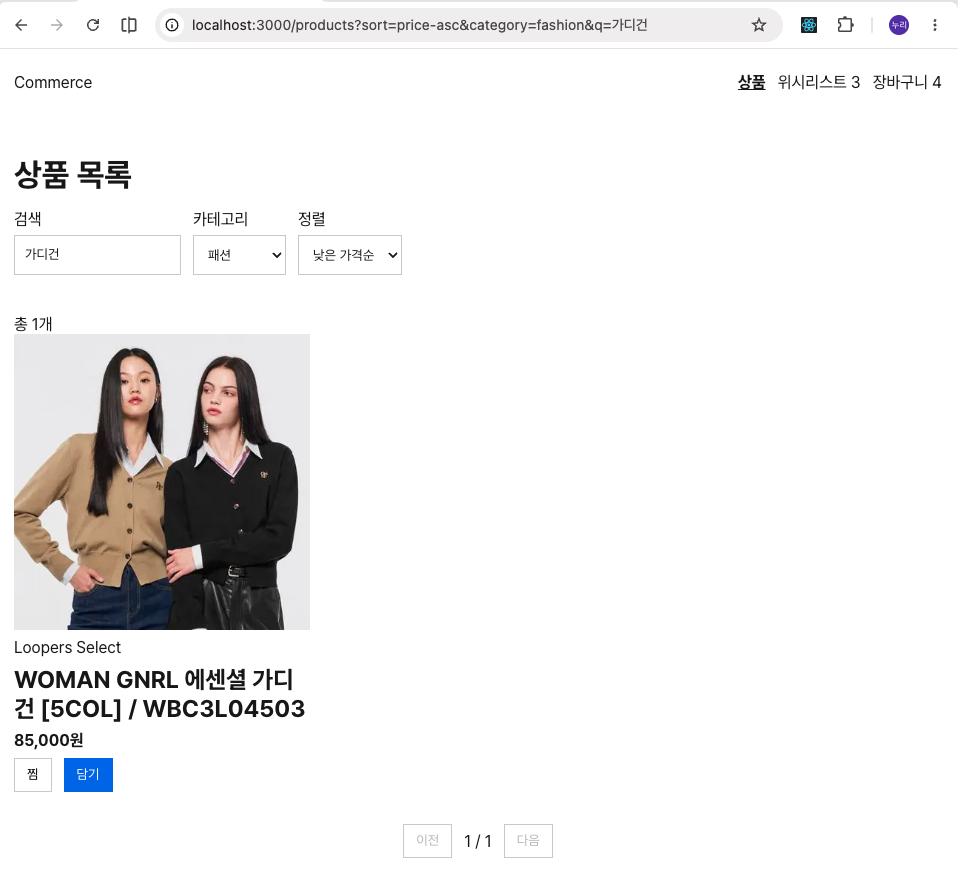

카테고리가 `fashion`(6건)일 때 페이지네이션이 `1 / 1`로 줄고, 필터 없을 때는 `1 / 3`으로 돌아온다. 총 건수 표시와 페이지 수가 함께 움직인다.

### 장바구니·위시리스트와 Header 개수

| 조작                 | Header                      | 확인                                     |
| -------------------- | --------------------------- | ---------------------------------------- |
| 홈에서 찜 2 · 담기 3 | 위시리스트 2 장바구니 3     | 개수가 조작대로 오른다                   |
| `/products`로 이동   | 유지                        | **같은 상품의 찜 버튼이 눌린 상태 유지** |
| 목록에서 1개 더 담기 | 장바구니 4                  | 페이지를 넘어가도 같은 store다           |
| 새로고침             | 위시리스트 2 장바구니 4     | persist 통과                             |
| 찜 1개 해제          | **위시리스트 1 장바구니 4** | 두 store가 독립적이다                    |

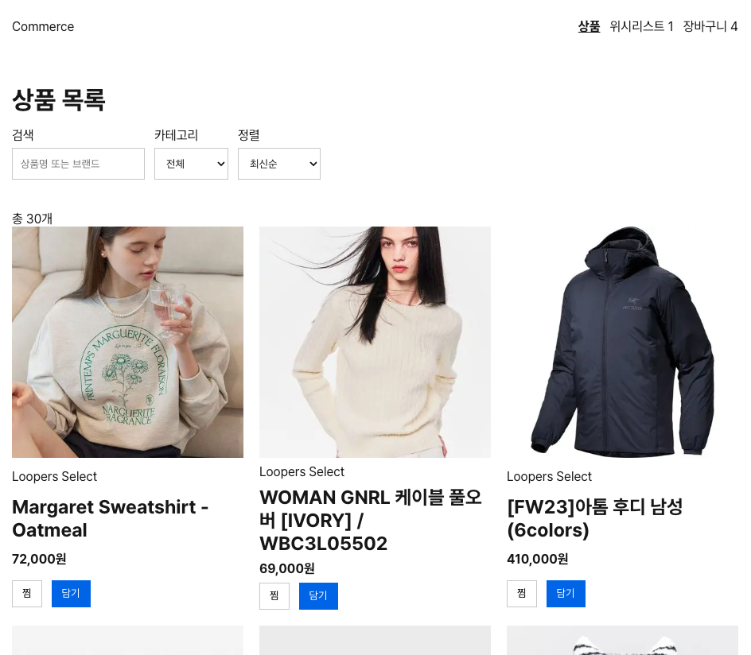

마지막 행의 상태다. 찜을 해제했는데 장바구니 4는 그대로다.

### 로딩·에러·빈 상태·재시도

`scenario=slow` 없이 정상 응답(0.5초)으로 다시 확인했다. 화면 캡처는 [목록 6상태 관찰](#목록-6상태-관찰)에 이미 남아 있어 여기서는 통과 여부만 기록한다.

| 상태   | 재현                         | 결과                                        |
| ------ | ---------------------------- | ------------------------------------------- |
| 로딩   | `/products` 새로고침         | 스켈레톤 → 목록 교체                        |
| 빈     | `?q=zzzzqqq`                 | "검색 결과가 없습니다." + 페이지네이션 없음 |
| 에러   | `*/api/products*` 요청 차단  | 목록 자리에 에러 + `다시 시도`              |
| 재시도 | **차단 해제 후 `다시 시도`** | **목록이 정상 복구됨**                      |

재시도는 Step 7에서 처음 밟은 항목이다. 에러 상태에서 버튼을 눌러 원래 목록으로 돌아오는 것까지 확인했다. 6상태를 한 컴포넌트에서 분기하는 구조라 에러 → 성공 전이가 별도 경로를 타지 않는다.

### 이미지 품질 회귀

Hero를 7,545,239 B JPG(3840×2160) → 179,296 B webp(1200×675)로 바꿨으므로 **화질을 깎아 수치를 만든 것은 아닌지**를 확인해야 한다.

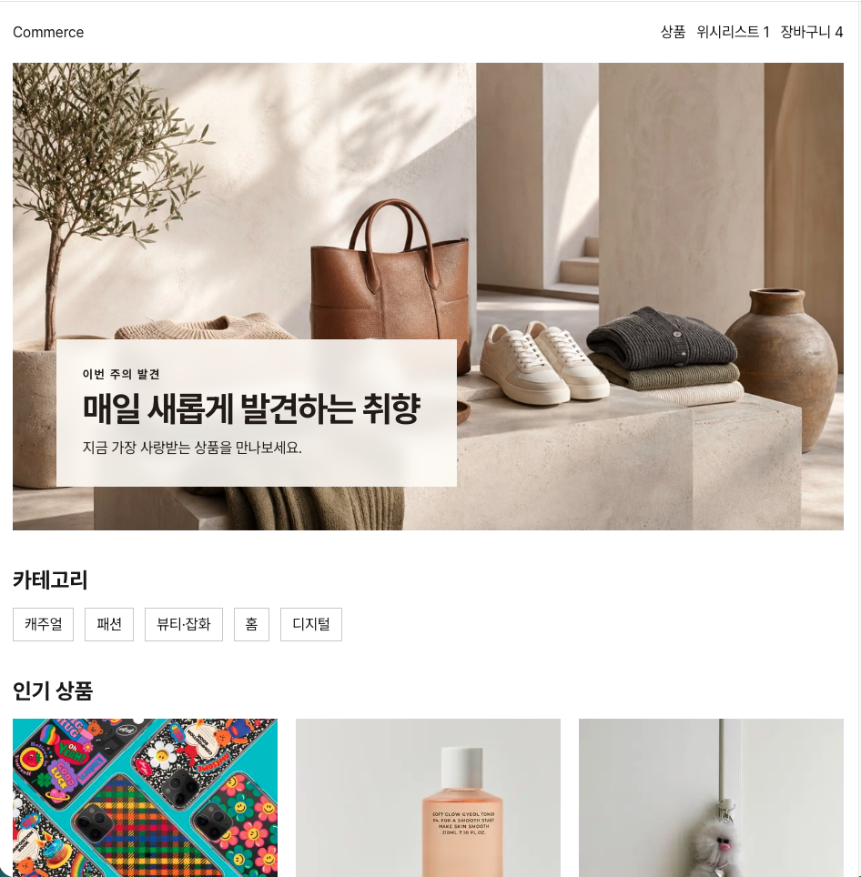

Before([`assets/filmstrip-644ms-hero-full.jpg`](assets/filmstrip-644ms-hero-full.jpg))와 비교했을 때 피사체 위치·잘림 범위·색감이 같고, 오버레이 카피(`매일 새롭게 발견하는 취향`)의 가독성도 유지된다. CSS(`width: 100%`, `aspect-ratio: 16/9`)를 건드리지 않았으므로 표시 크기와 비율도 그대로다.

**42배 줄인 것은 화질이 아니라 표시하지도 않던 해상도였다.** 1200px 폭에 3840px 원본을 내려받고 있었다.

### FSD 의존 방향과 Public API

Step 6에서 슬라이스 3개(`_pages/home`, `_pages/product-list`, `entities/product`)의 Public API를 건드렸으므로 확인 대상이다. 브라우저가 아니라 정적 검사다.

| 검사                                                  | 결과                                                      |
| ----------------------------------------------------- | --------------------------------------------------------- |
| `pnpm lint` (`boundaries/dependencies`)               | 통과                                                      |
| `rg "eslint-disable.*boundaries" src app`             | 0건                                                       |
| 슬라이스 내부 경로(`ui/`·`model/`·`api/`) 우회 import | 0건 — 검출된 2건은 각 슬라이스 자기 `index.ts`의 재export |

`entities/cart/index.ts`와 `entities/wishlist/index.ts`가 자기 `model/`을 재export하는 것은 Public API를 정의하는 정상 형태다.

## Advanced A — INP

선택 과제의 상세 측정 절차와 결과는 [Advanced A — INP 측정 및 개선](advanced-a-inp.md)에 분리해 기록한다. Basic의 홈·상품 목록 로드 성능과는 다른 화면·지표·SHA를 사용하므로 같은 표에 놓지 않는다.

| 항목              | 결과                                                            |
| ----------------- | --------------------------------------------------------------- |
| Before SHA        | `8aa15c5`                                                       |
| After SHA         | `f50b925`                                                       |
| 조건              | production build, CPU 4x, Network No throttling, 같은 카드 클릭 |
| 반복              | Before 3회 / After 3회                                          |
| 렌더 범위         | 24장 → 누른 카드 1장                                            |
| INP 중앙값        | 107.2ms → 35.6ms (`−67%`)                                       |
| processing 중앙값 | 79.26ms → 8.59ms (`−89%`)                                       |
| 개입              | `wishlistIds` 배열 구독 → 카드별 `selected` boolean 구독        |
| 상태              | 완료 — 측정·개입·회귀 4항목·정적 검사·Profiler `Why` 캡처 전부  |

Before Profiler에서 `SyncExternalStore` 변경으로 관계없는 카드 23장까지 렌더되는 것을 확인한 뒤 selector를 변경했다. After에서는 누른 카드 1장만 렌더됐고, 감소한 총 71.6ms 중 70.7ms가 processing에서 나왔다. 상세 계산식, raw 결과, Profiler 대체 경로와 남은 증빙은 별도 문서를 기준으로 한다.

## metadata 증거

> **요약** — 홈과 상품 목록에 `generateMetadata`를 붙이고 normal·정상 empty·query failure 세 상황의 document를 남겼다. 정상 empty는 0건을 설명하는 페이지 metadata에 OG fallback image를, query failure는 루트 metadata 상속을 보여 fallback이 갈린다.
>
> 서버 호출 계수는 `cache()` 유무와 무관하게 `/api/home` 1회여서 `cache()`를 제거했다. 요청을 합치던 것은 QueryClient 공유가 아니라 Next의 request memoization이었고, **개입 4에 적어둔 근거가 이 측정으로 반증됐다.**
>
> `facebookexternalhit`는 일반 UA보다 첫 바이트가 67배 늦다(7.7ms → 516.5ms). 총 시간은 같으므로 metadata 비용을 치르는 쪽이 사용자가 아니라 크롤러다.
>
> 미충족 1건 — 상품 목록 초기 HTML에 상품 링크가 없다. 목록 조회가 클라이언트 전용이라 문서에 데이터가 실리지 않는다.

실행 환경은 `APP_ORIGIN=http://localhost:3000`, production build(`Next.js 16.2.10`, Turbopack), `pnpm start`다. `/products`는 `generateMetadata`가 `searchParams`를 읽어 `ƒ (Dynamic)`으로 잡힌다.

임시 계수 로그를 넣고 → 그게 필요한 측정(normal·정상 empty·서버 호출 계수·UA 비교)을 몰아서 하고 → 빼고 → 나머지(query failure·초기 HTML)를 재는 순서로 진행했다. 계측이 들어간 채로 실패 재현이나 JS 비활성 캡처를 하면 증거에 계측이 섞인다.

| 상황                           | 증거                                        | 기록                                                                                                                                                                                                                                                                                                       |
| ------------------------------ | ------------------------------------------- | ---------------------------------------------------------------------------------------------------------------------------------------------------------------------------------------------------------------------------------------------------------------------------------------------------------- |
| normal                         | document 응답 / 초기 HTML                   | `<title>상품 목록 \| Commerce</title>`, `og:site_name=Commerce`·`og:locale=ko_KR`·`og:type=website` 유지, `og:image=http://localhost:3000/images/products/p26.jpg`(첫 상품), `robots` 0건, `<h1>상품 목록</h1>` 1개. 홈은 `<title>매일 새롭게 발견하는 취향 \| Commerce</title>`(`banner.title`), `h1` 1개 |
| 정상 empty                     | URL 조건 / 0건 metadata / OG fallback image | `/products?q=zzzzqqq` 및 `?q=없는상품`(HTTP 200). `<title>'zzzzqqq' 검색 결과 - 결과 없음 \| Commerce</title>`, `og:description=조건에 맞는 상품이 없습니다.`, **`og:image=…/images/week-07/hero-1200.webp`**(fallback 유지)                                                                               |
| metadata query failure         | root 공통 metadata 상속 여부                | `APP_ORIGIN=http://127.0.0.1:9`로 build·start. `<title>Commerce</title>`, `description`·`og:title`·`og:description`이 루트 값, `og:site_name`·`locale`·`type` 유지, `og:image=http://127.0.0.1:9/images/week-07/hero-1200.webp`. HTTP 200, `h1` 1개, `robots` 0건                                          |
| 서버 호출 계수                 | 임시 로그 계수 / 제거 여부                  | 임시 `console.log` 계수 기준 `cache()` 유지·제거 모두 `/api/home` 1회, `/api/products` 1회. 계측은 관찰 후 제거했고 `pnpm exec vitest run app/api` 38건 통과로 원상복구 확인                                                                                                                               |
| 일반 UA vs facebookexternalhit | `time_starttransfer`, `time_total`          | 3회 중앙값 — 일반 `start=0.0077s / total=0.5153s`, `facebookexternalhit/1.1` `start=0.5165s / total=0.5177s`. 첫 바이트가 **67배** 차이나고 총 시간은 같다. 크롤러 응답에도 `<title>`·`og:title`·`og:image`가 모두 실린다                                                                                  |
| 초기 HTML (JS 비활성)          | `h1` / 설명 / 주요 링크 / 구조              | 홈·상품 목록 모두 `h1`·페이지 설명·헤더 탐색 링크가 보인다. 화면은 둘 다 스켈레톤이지만 **문서에 실린 내용이 다르다** — 아래 참조                                                                                                                                                                          |
| title·description 규칙         | 조건별 document 응답                        | `?category=fashion&sort=price-asc` → `description="카테고리 패션 · 낮은 가격순 · 총 6개의 상품을 볼 수 있습니다."`. `?page=2` → `<title>상품 목록 (2페이지) \| Commerce</title>`. 검색어 title은 정상 empty 행 참조                                                                                        |

### title·description 규칙 세 가지가 각각 다른 자리에 나타난다

명세는 검색어를 title에, category·sort를 description에, 2페이지 이상은 title의 페이지 번호에 반영하라고 요구한다. 조건을 하나씩 건 document 응답으로 확인했다.

| 조건                               | 확인한 값                                                                     | 읽는 법                                                                       |
| ---------------------------------- | ----------------------------------------------------------------------------- | ----------------------------------------------------------------------------- |
| `?q=zzzzqqq`                       | `<title>'zzzzqqq' 검색 결과 - 결과 없음 \| Commerce</title>`                  | 검색어가 title을 차지한다                                                     |
| `?category=fashion&sort=price-asc` | `description="카테고리 패션 · 낮은 가격순 · 총 6개의 상품을 볼 수 있습니다."` | category·sort는 title로 올라가지 않고 description에만 있다                    |
| `?page=2`                          | `<title>상품 목록 (2페이지) \| Commerce</title>`                              | 페이지 번호가 title에 붙고, 루트 template(`%s \| Commerce`)도 그대로 적용된다 |

`sort`는 URL에 실제로 있을 때만 description에 넣는다. parser가 기본값 `latest`를 채우므로 정규화 결과만 보면 사용자가 고르지 않은 정렬까지 설명하게 되기 때문이다(`src/_pages/product-list/model/generate-metadata.ts`). 위 응답에서 `낮은 가격순`이 나온 것은 `sort=price-asc`를 명시했기 때문이고, `?page=2`처럼 sort가 없는 요청의 description에는 정렬 문구가 붙지 않는다.

### 두 fallback이 실제로 갈렸다

명세는 정상 empty와 metadata query failure가 서로 다른 fallback을 보이라고 요구한다. 같은 `og:image`(`hero-1200.webp`)를 쓰지만 도달 경로가 다르다.

|                         | 정상 empty                                    | metadata query failure                               |
| ----------------------- | --------------------------------------------- | ---------------------------------------------------- |
| `generateMetadata` 반환 | 0건을 설명하는 페이지 metadata                | `{}` (catch)                                         |
| `title`                 | `'zzzzqqq' 검색 결과 - 결과 없음 \| Commerce` | `Commerce` (루트 `title.default`)                    |
| `description`           | 조건에 맞는 상품이 없습니다.                  | 루트 `SITE_DESCRIPTION`                              |
| `og:image` 지정 주체    | 페이지가 명시적으로 fallback 지정             | 루트 `openGraph` 상속                                |
| `og:image` 호스트       | `localhost:3000`                              | `127.0.0.1:9` (`metadataBase`가 `APP_ORIGIN`을 따름) |

실패 쪽 응답이 오히려 빠르다(`total=10.9ms`, 정상은 515ms). 닿지 않는 origin은 연결이 즉시 거부되어 mock의 500ms 대기를 타지 않기 때문이다. **시간만 보면 개선으로 오독할 수 있는 값**이라 함께 기록한다.

### JS 비활성 — 화면과 문서가 다르다

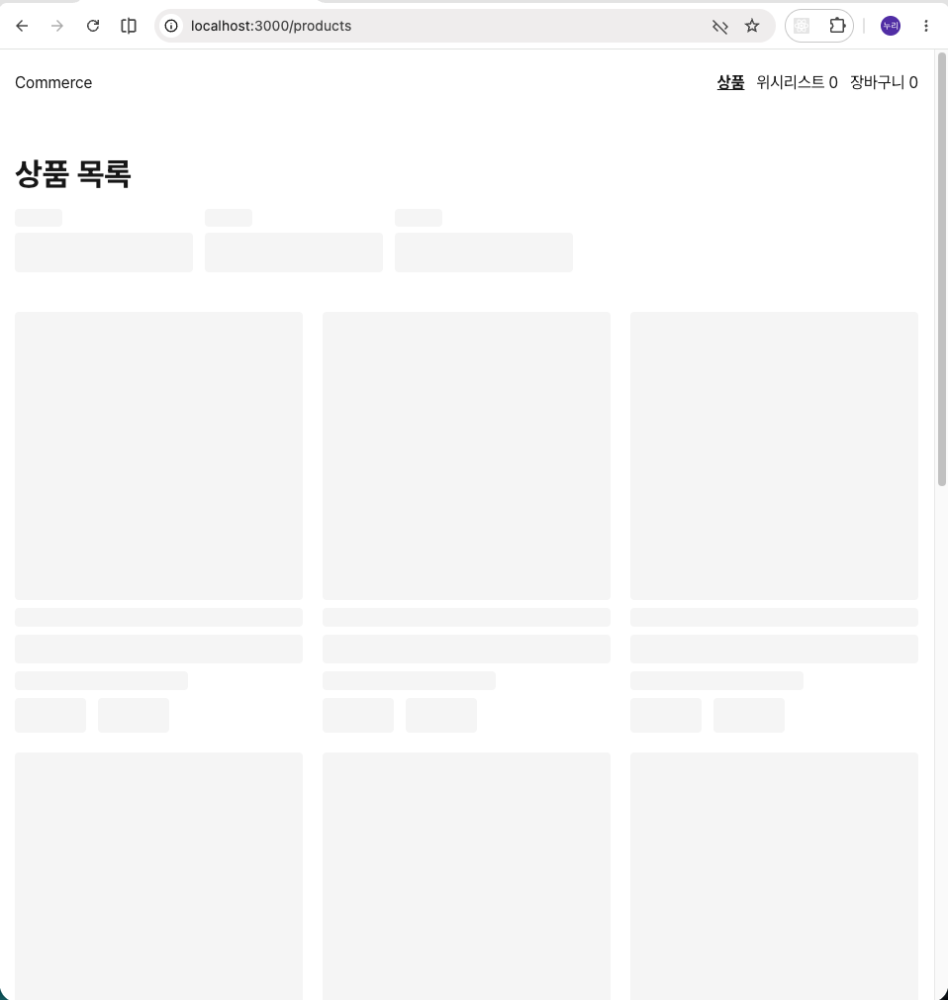

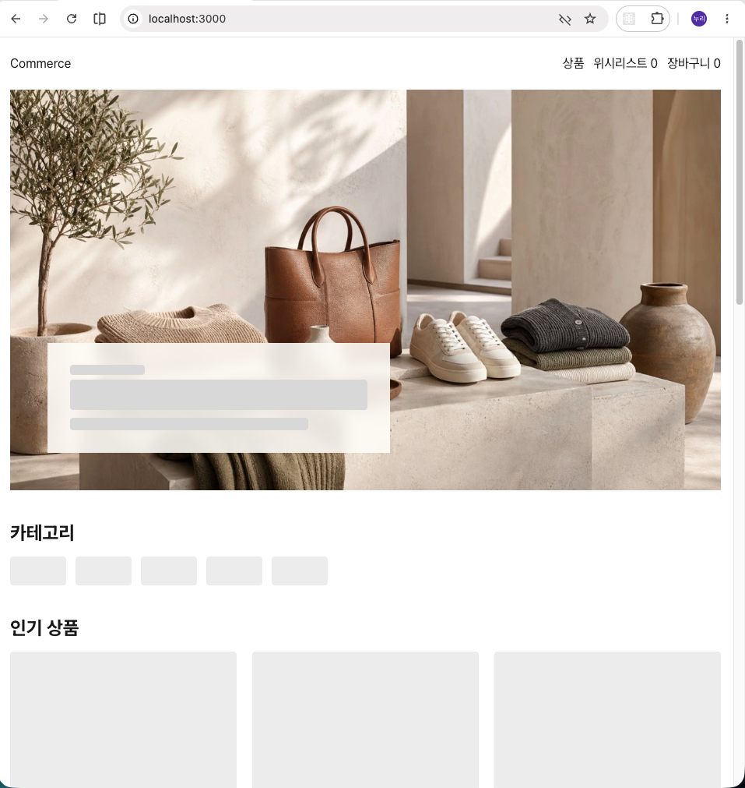

두 페이지 모두 JS를 끄면 스켈레톤에 머문다. Suspense fallback을 실제 콘텐츠로 교체하는 것이 React의 인라인 스크립트이기 때문이고, 서버가 본문을 스트리밍했는지와 무관하다.

문서를 직접 세면 갈린다.

|                                         | 홈       | 상품 목록         |
| --------------------------------------- | -------- | ----------------- |
| 문서 크기                               | 52,046 B | 37,548 B          |
| 카테고리 이름(`패션`·`디지털`·`캐주얼`) | 각 2회   | **0회**           |
| `href="/products…"` 링크                | 6개      | 1개 (헤더 탐색뿐) |

홈은 `HomeData`의 서버 prefetch 결과가 문서에 실려 있고, 상품 목록은 `ProductListContent`가 클라이언트에서 조회하므로 문서에 데이터가 없다. 명세의 "초기 응답에 주요 링크와 구조"를 상품 목록이 충족하지 못한다.

이번 단계에서는 고치지 않았다. 2단계에서 목록의 6상태(최초 로딩·갱신·갱신 실패·최초 실패·빈 결과·취소)를 클라이언트 조회 전제로 설계했고, 서버 prefetch를 넣으면 그 상태 설계를 다시 짜야 한다. 범위를 넘는 변경이라 발견 사실로 남긴다.

---

이 문서는 [plan.md](plan.md)에서 분리했다. 측정과 스크린샷 캡처는 작성자가 직접 수행했고, `before-home-record.json` 트레이스에서 filmstrip 프레임·paint 마커·Network 요청을 추출해 표로 정리하고 스크린샷의 값을 표에 옮긴 것은 Claude(AI)다.

`## metadata 증거` 절은 다음과 같이 나뉜다. production build 실행, 서버 기동, `APP_ORIGIN`을 바꾼 재빌드, 서버 터미널의 호출 계수 확인, JS 비활성 캡처 2장은 작성자가 직접 수행했다. `curl`로 document를 받아 `<head>`를 뽑고 UA별 응답 시점을 3회씩 잰 것, 문서에 실린 내용을 세어 홈과 상품 목록을 대조한 것, 표를 채운 것은 Claude(AI)다. `cache()` 제거 결정은 작성자가 실측을 보고 내렸다.

`## Step 7 — 홈 After 추가 관찰` 절과 홈 측정 조건·Lighthouse 5회·LCP 구간 분해의 `After` 열도 같은 방식으로 나뉜다. production build, Lighthouse 5회, Performance 녹화 2건(데스크톱·모바일), 캡처 12장은 작성자가 직접 수행했다. 리포트 JSON에서 지표를 추출해 중앙값·범위를 계산한 것, 트레이스에서 `LayoutShift`·LCP candidate·`PaintImage`를 뽑아 `aspect-ratio`를 역산한 것, prefetch 응답 시간과 전송량 구성을 세어 표로 정리한 것은 Claude(AI)다. 측정 전 예상 두 건도 Claude(AI)가 적었고 그중 FCP 예상은 반증됐다.

`## Step 7 — 전체 검증` 절은 Claude(AI)가 `pnpm check`와 `pnpm test:e2e`를 실제로 실행하고 결과를 정리한 것이다. 1차 E2E 실패가 코드 회귀가 아니라 `reuseExistingServer`에 걸린 측정용 서버 때문이라는 판별, WebKit 플래키를 6주차 기록과 같은 방법(`--repeat-each=5`)으로 다시 재어 회귀가 아님을 확인한 것도 Claude(AI)다. 서버를 내리는 조작은 작성자가 했다.

이 절에서 Claude(AI)의 예측이 두 번 빗나갔다. `cache()`를 떼면 `/api/home` 요청이 늘 것으로 봤으나 1회로 같았고(원인이 QueryClient 공유가 아니라 request memoization이었다), JS 비활성에서 홈은 콘텐츠가 보일 것으로 봤으나 홈도 스켈레톤이었다(fallback 교체 자체가 JS다). 두 번째는 작성자의 캡처로 드러났다.

"개입 1"부터 "개입 요약과 다음 병목"까지의 절은 다음과 같이 나뉜다.

Lighthouse 5회와 Performance 녹화, filmstrip·Insights 캡처는 작성자가 직접 수행했다. 코드 변경(렌더링 경계 분리, 이미지 후보 생성, preload 적용과 되돌림, Hero 이미지·카피 분리), 트레이스·Lighthouse JSON에서 수치를 추출해 표로 정리한 것, `curl`로 받은 초기 HTML 확인, 인과 사슬과 판정 문단 작성은 Claude(AI)다.

판단이 갈린 지점은 작성자가 정했다. 초기 HTML에 `h1`이 두 벌 실린 결함은 Claude(AI)가 발견해 보고했고 `loading.tsx` 삭제는 작성자가 결정했다. 이미지 후보를 `next/image` 대신 정적 파일로 만드는 선택, Hero를 이미지와 카피로 쪼개도 사용자 경험이 나빠지지 않는다는 판단(높이가 고정이라 화면이 밀리지 않는다는 근거), 폰트를 이번 주 범위에서 제외하는 결정도 작성자가 내렸다.

개입 순서를 잘못 정한 판단(후보 2를 1순위로 추천)은 Claude(AI)의 오류이고, 측정으로 반증된 뒤 되돌렸다.

"상품 목록 — 개입과 After 측정" 절도 같은 방식으로 나뉜다. 개선할 문제 4건(갱신 시 layout shift, 최초/갱신 실패 미구분, select와 URL 불일치, 취소 부재)은 작성자가 화면을 직접 조작하며 찾아냈고, After 녹화 6건과 캡처 8장도 작성자가 수행했다. 원인 분석(`placeholderData`가 `pending`에서만 적용되어 `isRefetchError`가 걸리지 않는다는 것, select 문제가 `value`가 아니라 `option` 소실이라는 것), 코드 변경, 트레이스에서 `LayoutShift`·`didFail`·요청 타임라인을 추출해 표로 정리한 것, 판정 문단 작성은 Claude(AI)다.

알림을 흐름 밖에 두는 설계는 작성자가 "인라인 텍스트가 생기면 CLS가 생기지 않느냐"고 지적해 바뀐 것이다. Claude(AI)가 처음 제안한 것은 목록 위 인라인 배너였고, 그대로 갔으면 같은 단계의 CLS 조건을 스스로 깼을 것이다. toast 형태의 상단 바로 바꾸자는 제안도 작성자가 했고, 자동 소멸과 닫기 버튼을 두지 않는 결정은 논의 끝에 작성자가 정했다.

취소 시나리오의 CLS가 0.433으로 오른 것을 개입 탓으로 오해할 뻔한 것도 기록해 둔다. shift 발생 시각을 응답 완료와 대조해 조작 순서 차이임을 확인했다.

명세 2단계까지 끝난 시점에 Claude(AI)가 plan.md와의 정합성을 다시 대조해 두 곳을 고쳤다. 상품 목록 Before SHA가 홈과 코드가 같다는 근거(`git diff`)를 명시한 것과, 최초 실패 행의 "무개입"을 개입 5가 분기를 갈랐다는 사실에 맞춘 것이다. 측정값은 바꾸지 않았다.
